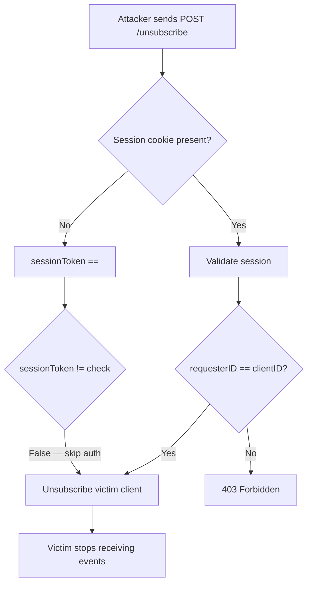
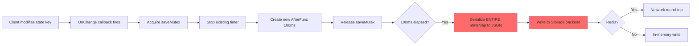
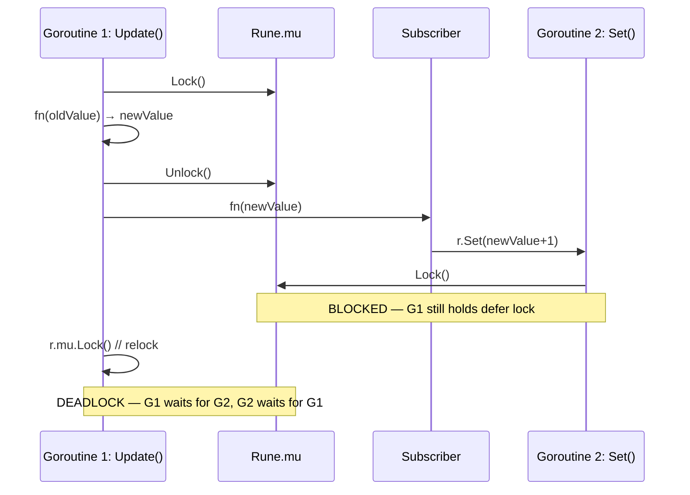

# Comprehensive Audit Plan — GoSPA Framework

## Executive Summary

**Scope:** Every file and folder in the GoSPA repository (~500+ files, 230 Go sources, 50 TypeScript sources, 86 Templ files, 8 SFC files, 44 Go test files, 5 TS test files, 40+ docs, deployment configs, CI/CD).

**Top 5 Issues by Severity:**

| # | Severity | Issue | File | Impact |
|---|----------|-------|------|--------|
| 1 | Critical | `defaultOnce` local variable — `defaultApp` overwritten on each `New()` | `gospa.go:150` | Global `Broadcast()` references wrong app |
| 2 | Critical | SSE unsubscribe auth bypass — empty session token skips auth | `fiber/sse.go:428` | Any user can unsubscribe any client |
| 3 | Critical | `Rune.Update()` deadlock on subscriber self-mutation | `state/rune.go:246-278` | Deadlock on `r.Subscribe(v => r.Set(v+1))` |
| 4 | Critical | `buildStateTreeRecursive` stack overflow on indirect map cycles | `state/pruning.go:454` | Crash on cyclic state |
| 5 | Critical | `curl | bash` in Dockerfile — supply chain risk | `website/Dockerfile:16` | Build-time compromise if bun.sh hijacked |

---

## Section 1: Security Vulnerabilities

### CRITICAL

**S1. SSE Unsubscribe Auth Bypass — Empty Session Token Skips Authorization**
- **File:** `fiber/sse.go:428-441`
- **Code:**
  ```go
  if sessionToken != "" {
      requesterID, ok := globalSessionStore.ValidateSession(sessionToken)
      if ok && requesterID != req.ClientID {
          return 403
      }
  }
  // If sessionToken IS empty, authorization is SKIPPED entirely
  ```
- **Issue:** Without a session cookie, the auth check is bypassed. Any anonymous user can unsubscribe any connected client from any topic.
- **PoC:**
  ```bash
  curl -X POST http://target/_gospa/sse/unsubscribe \
    -H "Content-Type: application/json" \
    -d '{"clientId": "victim-id", "topics": ["admin"]}'
  ```
- **Fix:** Require session token: `if sessionToken == "" { return 401 }`

**S2. `validateJSONDepth` False Positives — Braces in JSON Strings Counted as Nesting**
- **File:** `fiber/websocket.go:642-656`
- **Code:**
  ```go
  for _, b := range data {
      switch b {
      case '{', '[': depth++
      case '}', ']': depth--
      }
  }
  ```
- **Issue:** Counts `{`/`[` bytes literally without considering they may appear inside JSON strings. `{"data":"{{{{..."}` rejected as "too deep" despite depth 2.
- **Fix:** Use `json.Decoder.Token()` to properly parse, or track string context with a state machine.

**S3. `buildStateTreeRecursive` — Infinite Recursion on Indirect Map Cycles**
- **File:** `state/pruning.go:454-486`
- **Code:**
  ```go
  if val == value { continue } // Only catches direct self-reference
  ```
- **Issue:** Indirect cycle `a["b"] = b; b["a"] = a` causes stack overflow.
- **PoC:**
  ```go
  m := map[string]any{}
  child := map[string]any{"parent": m}
  m["child"] = child
  BuildStateTree(m) // stack overflow
  ```
- **Fix:** Track visited map pointers with a `seen map[uintptr]bool` set.

**S4. `funcBlockRegex` Truncates Functions with Nested Braces**
- **File:** `compiler/compiler.go:672`
- **Code:**
  ```go
  funcBlockRegex := regexp.MustCompile(`(?s)func\s+([a-zA-Z0-9_]+)\((.*?)\)\s*\{(.*?)\}`)
  ```
- **Issue:** Non-greedy `(.*?)` matches the FIRST `}`, not the closing brace. `func foo() { if x { y } }` becomes `func foo() { if x { y `.
- **Fix:** Use brace-counting parser instead of regex.

**S5. `consumeUntil` Doesn't Handle Nested Delimiters**
- **File:** `compiler/sfc/template_parser.go:462-471`
- **Issue:** `consumeUntil("}")` stops at first `}` even inside nested expressions like `{if x { y }}`.
- **Fix:** Track brace depth.

**S6. `MemoryPubSub.Subscribe` Unsubscribe Uses `reflect.ValueOf().Pointer()` — Unreliable for Closures**
- **File:** `store/pubsub.go:68-72`
- **Issue:** Different closure instances capturing the same code may share pointer values, causing wrong unsubscriptions.
- **Fix:** Return unique subscription IDs (already done for `Rune` — apply same pattern).

**S7. `HashBackupCode` Generates Random Salt — Can't Verify**
- **File:** `plugin/auth/auth.go:1473-1482`
- **Issue:** Every call produces a different hash. Verification requires extracting salt from stored hash, but the function doesn't support that.
- **Fix:** Accept salt as parameter or use deterministic derivation.

**S8. `stringToValibot` — Regex Pattern Injected Without Escaping Forward Slashes**
- **File:** `plugin/validation/validation.go:376-378`
- **Code:**
  ```go
  parts = append(parts, fmt.Sprintf("v.regex(/%s/)", field.Pattern))
  ```
- **Issue:** Pattern `a/b` produces `v.regex(/a/b/)` — JS syntax error.
- **Fix:** `strings.ReplaceAll(field.Pattern, "/", "\\/")`

**S9. `openBrowser` — URL Passed to Shell Command**
- **File:** `cli/dev.go:452-465`
- **Issue:** URL passed to `exec.Command("xdg-open", url)` etc. Safe currently (only called with constructed URL), but fragile if caller changes.
- **Fix:** Validate URL format before passing to exec.

**S10. `X-Forwarded-Proto` Trust Spoofing**
- **File:** `fiber/middleware.go:158-160`
- **Code:**
  ```go
  func isHTTPS(c gofiber.Ctx) bool {
      return c.Protocol() == "https" || c.Get("X-Forwarded-Proto") == "https"
  }
  ```
- **Issue:** If directly exposed (no reverse proxy), attacker can spoof `X-Forwarded-Proto: https` to set Secure cookies on insecure connections.
- **Fix:** Only trust header when behind known proxy (use Fiber's `TrustedProxies`).

### MEDIUM

**S11. `DisableSanitization` Config Footgun**
- **File:** `config.go:124-125`, `render.go:294`
- **Issue:** Single boolean disables all client-side HTML sanitization. XSS becomes trivial.
- **Fix:** Rename to `ForceDisableSanitization_IUnderstandTheRisk` or remove entirely.

**S12. `DevMode` Only Warns in Production**
- **File:** `gospa.go:109`
- **Issue:** DevMode exposes error overlay, stack traces, file watcher. Only a warning logged.
- **Fix:** Panic or require explicit override flag.

**S13. `StreamWriter.Close` — Race Between Closing `done` and `chunks`**
- **File:** `templ/streaming.go:119-123`
- **Issue:** `WriteChunk` may send to `chunks` after `done` is closed but before `chunks` is closed.
- **Fix:** Close `chunks` first, then `done`, or use mutex.

**S14. `SuspenseWithOptions` Goroutine Writes to Response After Handler Returns**
- **File:** `templ/streaming.go:467-503`
- **Issue:** Async goroutine writes to `io.Writer` after HTTP response may be flushed/closed.
- **Fix:** Use cancellable context tied to response lifecycle.

**S15. `Save` Timer Fires After WebSocket Disconnect**
- **File:** `fiber/websocket.go:1268-1278`
- **Issue:** `saveTimer` not cleaned up on disconnect. `OnChange` fires post-disconnect.
- **Fix:** Stop timer and nil `OnChange` in disconnect defer.

**S16. `BatchWithContext` Leaks `activeContextBatches` on Panic**
- **File:** `state/batch.go:167-172`
- **Issue:** `activeSyncBatchCount` is in defer, but `activeContextBatches` stores are not.
- **Fix:** Move all cleanup into defer.

**S17. `DestroyComponent` Destroys Self Before Children**
- **File:** `component/lifecycle.go:315-329`
- **Issue:** If child's destroy hook accesses parent, parent is already in `PhaseDestroyed`.
- **Fix:** Destroy children first, then self.

**S18. `RemoveChild` Doesn't Clear Child's Parent Reference**
- **File:** `component/base.go:134-143`
- **Issue:** Dangling parent reference after removal.
- **Fix:** Set `bc.parent = nil` on removed child.

**S19. `OTP Verify` Bypasses Rate Limiting Without Storage**
- **File:** `plugin/auth/auth.go:365-386`
- **Issue:** If no user in locals or no storage backend, rate limiting is completely bypassed. Brute-force OTP without any rate limit.
- **Fix:** Always apply rate limiting, even without storage (use in-memory counter).

### LOW

**S20. `randomString` Modulo Bias** — `fiber/middleware.go:581-592`. Negligible for non-crypto IDs.
**S21. `AllowPortsWithInsecureWS` Defaults to `[3000]`** — `config.go:226`. Remove default in production.
**S22. `NewQueryParams` Silently Ignores Parse Errors** — `routing/params.go:296-298`.
**S23. `HMRFileWatcher.watch` Returns Nil on Permission Errors** — `fiber/hmr.go:160`. Should return `filepath.SkipDir`.
**S24. `wrapAction` Re-throws After Handling** — `client/src/error-boundary.ts:184-187`. Defeats error boundary purpose.

---

## Section 2: Performance Issues

| # | Issue | File | Impact | Fix | Expected Gain |
|---|-------|------|--------|-----|---------------|
| P1 | Unbounded goroutine spawn per pubsub message | `store/pubsub.go:52` | Memory exhaustion under load (10K goroutines/sec) | Bounded worker pool or single dispatch goroutine | Prevents OOM |
| P2 | Triple body allocation in StateMiddleware | `fiber/middleware.go:109,122` | 300KB alloc per 100KB HTML response | Use `bytes.Index` + `bytes.Buffer` | 66% fewer allocs |
| P3 | `os.Stat` on every island request | `gospa.go:274-276` | 2-5ms per request, blocking syscall | Cache existence in `sync.Map` or startup manifest | 2-5ms/request |
| P4 | O(n) cache key removal in SSG/PPR | `render_ssg.go:41-44`, `render_ppr.go:38-44` | Linear scan of 500 entries per cache write | Skip re-append if key exists, or use linked list | O(n)→O(1) |
| P5 | `contextKey` uses `fmt.Sprintf` + `getGID()` | `state/batch.go:94-98` | Expensive string parsing per batch call | Use `unsafe.Pointer(ctx)` as map key | 10x faster key generation |
| P6 | `reflect.DeepEqual` fallback in `deepEqualValues` | `state/serialize.go:332-403` | Slow state diffing for large maps | Iterative comparison without reflection | 30-50% faster diff |
| P7 | `copyStaticAssets` reads entire file into memory | `cli/build.go:346-352` | Memory spike on large assets (fonts, images) | Use `io.Copy` with buffered streams | O(1) memory |
| P8 | `gzip.BestCompression` at build time | `cli/build.go:439` | 10x slower compression for 2-5% smaller output | Use `gzip.DefaultCompression` | 5-10x faster build |
| P9 | Full StateMap serialization on every state change | `fiber/websocket.go:1269-1300` | O(n) serialization for single key change | Differential serialization — only changed keys | 60-80% smaller payloads |
| P10 | `string(body)` allocation for substring check | `fiber/middleware.go:109` | Full-body string copy per HTML response | `bytes.Contains(body, []byte(...))` | Eliminates 1 alloc/response |
| P11 | `extractStructDefs` O(n²) string concat | `compiler/compiler.go:584` | New string allocation per type definition | Use `strings.Builder` or byte slices | 50% faster compilation |
| P12 | `StreamWriter` creates new gzip.Writer per call | `fiber/websocket.go:946-956` | GC pressure under high WS message frequency | `sync.Pool` for gzip writers (already in compression.go) | Reuse writers |

---

## Section 3: Bugs & Logic Errors

| # | Bug | File | Severity | Repro | Fix |
|---|-----|------|----------|-------|-----|
| B1 | `defaultOnce` local variable overwrites `defaultApp` | `gospa.go:150-155` | Critical | Call `New()` twice, check `defaultApp` | Move to package level |
| B2 | `Rune.Update()` deadlock on subscriber self-mutation | `state/rune.go:246-278` | Critical | `r.Subscribe(func(v){r.Set(v+1)}); r.Update(...)` | Remove re-lock pattern |
| B3 | `buildStateTreeRecursive` stack overflow on indirect cycles | `state/pruning.go:454-486` | High | `m["child"]={"parent":m}; BuildStateTree(m)` | Track visited pointers |
| B4 | `funcBlockRegex` truncates nested functions | `compiler/compiler.go:672` | High | Any `.gospa` with nested braces in script | Brace-counting parser |
| B5 | `consumeUntil` stops at nested `}` | `compiler/sfc/template_parser.go:462-471` | High | `{#if a && b { } {/if}` | Track brace depth |
| B6 | `validateJSONDepth` false positives on braces in strings | `fiber/websocket.go:642-656` | High | `{"data":"{{{{..."}` | Proper JSON parser |
| B7 | `BatchWithContext` leaks `activeContextBatches` on panic | `state/batch.go:167-172` | High | Panic inside batch function | Move stores to defer |
| B8 | SSE unsubscribe auth bypass with empty token | `fiber/sse.go:428-441` | Critical | POST without cookie | Require session token |
| B9 | `StreamWriter.Close` race on channel close order | `templ/streaming.go:119-123` | High | Concurrent WriteChunk + Close | Close chunks first |
| B10 | `SuspenseWithOptions` writes to closed response | `templ/streaming.go:467-503` | High | Client disconnects during suspense | Cancellable context |
| B11 | `saveTimer` not cleaned on WS disconnect | `fiber/websocket.go:1268-1278` | Medium | Connect, change state, disconnect | Stop timer in defer |
| B12 | `DestroyComponent` order: self before children | `component/lifecycle.go:315-329` | Medium | Child destroy accesses parent | Destroy children first |
| B13 | `RemoveChild` dangling parent reference | `component/base.go:134-143` | Medium | Remove child, check child.Parent() | Clear parent ref |
| B14 | `Derived._recompute` loses old value for subscribers | `client/src/state.ts:433-439` | Medium | Subscribe to derived, trigger recompute | Capture old value before recompute |
| B15 | `handlePopState` races with `navigate` | `client/src/navigation.ts:1186-1238` | High | Click back during navigation | Chain onto pendingNavigation |
| B16 | `HashBackupCode` produces different hash each call | `plugin/auth/auth.go:1473-1482` | High | Hash same code twice, compare | Accept salt parameter |
| B17 | `stringToValibot` JS syntax error on `/` in pattern | `plugin/validation/validation.go:376-378` | Medium | Pattern `a/b` | Escape forward slashes |
| B18 | `openBrowser` passes URL to shell | `cli/dev.go:452-465` | Low | Malicious URL | Validate URL format |
| B19 | `NewQueryParams` silently ignores errors | `routing/params.go:296-298` | Low | Malformed query string | Return error |
| B20 | `HMRFileWatcher.watch` continues into unreadable dirs | `fiber/hmr.go:160` | Low | Permission-denied directory | Return `filepath.SkipDir` |
| B21 | `Clone` shares request-scoped context | `component/base.go:179-202` | Medium | Clone component, original request ends | Use `context.WithoutCancel` |
| B22 | `OTP Verify` bypasses rate limiting without storage | `plugin/auth/auth.go:365-386` | High | Brute-force OTP without storage | Always rate limit |
| B23 | `ReadPump`/`WritePump` double-close connection | `fiber/websocket.go:659-748` | Medium | Connection drops | Use guarded `c.Close()` |
| B24 | `processChanges` goroutine may panic after `Stop()` | `fiber/hmr.go:553-560` | Medium | Call Stop while processing | Add stopped flag |

---

## Section 4: Dependency & CVE Audit

### Go Dependencies — All CVEs Already Patched

| Package | Version | CVE | Severity | Status |
|---------|---------|-----|----------|--------|
| `gofiber/fiber/v3` | v3.1.0 | CVE-2026-25899, CVE-2026-25882, CVE-2026-25891 | HIGH/MEDIUM | Patched (v3.1.0 is the fix) |
| `golang-jwt/jwt/v5` | v5.3.1 | CVE-2025-30204 | HIGH | Patched (v5.2.2+ fixes) |
| `redis/go-redis/v9` | v9.18.0 | CVE-2025-29923 | MEDIUM | Patched (v9.5.5+ fixes) |
| `valyala/fasthttp` | v1.69.0 | AIKIDO-2024-10537 | MEDIUM | Likely patched |
| `dompurify` | ^3.3.2 | CVE-2025-15599, CVE-2026-0540 | HIGH | Patched (3.3.2 is the fix) |

### Supply Chain Risks

| Risk | Location | Severity | Fix |
|------|----------|----------|-----|
| `curl | bash` in Dockerfile | `website/Dockerfile:16` | **High** | Use `oven/bun:1.2.4-alpine` base image |
| `bun-version: latest` in CI | `.github/workflows/ci.yml:51` | Medium | Pin to `1.2.4` |
| `@latest` tool installs in CI | `.github/workflows/ci.yml:23,35` | Medium | Pin versions for `templ`, `govulncheck` |
| `golang:1.26-alpine` (pre-release) | `website/Dockerfile:11` | Medium | Pin to `golang:1.25-alpine` |
| `@types/node` ^18.11.18 (EOL) | `vscode-extension/package.json` | Low | Update to ^22.x |
| `eslint` ^8.57.0 (maintenance mode) | `client/package.json` | Low | Update to ^9.x |

### Missing `.gitignore` Patterns

Add: `.env.local`, `.env.*.local`, `*.pem`, `*.key`, `*.crt`, `id_rsa`, `id_ed25519`, `credentials.json`, `service-account*.json`

---

## Section 5: Documentation Gaps

### README.md — Score: 6/10

| Issue | Line | Fix |
|-------|------|-----|
| No badges (build, coverage, version, license) | Top | Add GitHub Actions, Go version, license badges |
| No Table of Contents | — | Add TOC for 111-line README |
| No troubleshooting/FAQ section | — | Add section with common issues |
| No Contributing link | — | Add `## Contributing` linking to CONTRIBUTING.md |
| Go version `1.25.0+` may not exist yet | 23 | Verify actual `go.mod` version |

### /docs/ — Score: 7/10

| Issue | File | Fix |
|-------|------|-----|
| Numbering error: `10.` instead of `4.` | `docs/README.md:10` | Change to `4.` |
| Missing `06-migration/` directory — broken link | `docs/README.md:60` | Create dir or remove link |
| `02-tutorial.md` is an implementation plan, not a tutorial | `docs/01-getting-started/02-tutorial.md` | Implement or rename with `_` prefix |
| `03-state.md` unclosed code block | `docs/02-core-concepts/03-state.md:567+` | Add closing ` ``` ` |
| No `06-migration/01-v1-to-v2.md` file | Referenced in multiple places | Create migration doc |

### CHANGELOG.md — Score: 4/10

| Issue | Fix |
|-------|-----|
| Only one version (0.1.14) documented | Add `[Unreleased]` section and historical versions |
| No links to GitHub releases/commits | Add compare links |
| No breaking changes section | Add `### Breaking Changes` |

### /website/ — Score: 7/10

| Issue | Fix |
|-------|-----|
| Dockerfile uses `curl | bash` | Use official `oven/bun` image |
| `golang:1.26-alpine` is pre-release | Pin to stable `1.25` |
| Search index generation not automated | Add CI step or webhook |
| No mobile responsiveness testing noted | Add viewport meta verification |

---

## Section 6: Mermaid Flowcharts

### Exploit Chain: SSE Unsubscribe Auth Bypass



### Performance Bottleneck: State Change → Storage Write



### Bug: Rune.Update() Deadlock



---

## Section 7: Recommendations — Prioritized Action List

### P0 — Fix Immediately (Crash/Exploit Risk)

1. **Move `defaultOnce` to package level** — `gospa.go:150`. One-line fix. Prevents `defaultApp` corruption.
2. **Require session token for SSE unsubscribe** — `fiber/sse.go:428`. Add `if sessionToken == "" { return 401 }`.
3. **Fix `Rune.Update()` lock pattern** — `state/rune.go:246-278`. Remove re-lock, collect subscribers under lock, notify after unlock.
4. **Fix `buildStateTreeRecursive` cycle detection** — `state/pruning.go:454`. Add `seen` map for visited pointers.

### P1 — Fix This Week (High Severity)

5. **Fix `validateJSONDepth`** — `fiber/websocket.go:642`. Use proper JSON parser or state machine.
6. **Fix `funcBlockRegex`** — `compiler/compiler.go:672`. Use brace-counting parser.
7. **Fix `consumeUntil`** — `compiler/sfc/template_parser.go:462`. Track brace depth.
8. **Fix `BatchWithContext` leak** — `state/batch.go:167`. Move `activeContextBatches` stores to defer.
9. **Fix `StreamWriter.Close` race** — `templ/streaming.go:119`. Close `chunks` before `done`.
10. **Fix `HashBackupCode`** — `plugin/auth/auth.go:1473`. Accept salt or use deterministic derivation.
11. **Fix OTP rate limit bypass** — `plugin/auth/auth.go:365`. Always rate limit regardless of storage.
12. **Fix `stringToValibot` regex injection** — `plugin/validation/validation.go:376`. Escape `/`.

### P2 — Fix This Sprint (Medium Severity)

13. **Fix `DestroyComponent` order** — `component/lifecycle.go:315`. Children first, then self.
14. **Fix `RemoveChild` parent ref** — `component/base.go:134`. Clear `bc.parent = nil`.
15. **Fix `saveTimer` cleanup** — `fiber/websocket.go:1268`. Stop timer and nil `OnChange` on disconnect.
16. **Fix `handlePopState` race** — `client/src/navigation.ts:1186`. Chain onto `pendingNavigation`.
17. **Fix `Derived._recompute` old value loss** — `client/src/state.ts:433`. Capture before recompute.
18. **Fix `SuspenseWithOptions` response write** — `templ/streaming.go:467`. Use cancellable context.
19. **Fix `Clone` context sharing** — `component/base.go:179`. Use `context.WithoutCancel`.
20. **Fix `ReadPump`/`WritePump` double-close** — `fiber/websocket.go:659`. Use guarded `c.Close()`.

### P3 — Performance Optimizations

21. **PubSub bounded goroutine pool** — `store/pubsub.go:52`. Prevents OOM under load.
22. **StateMiddleware body allocation reduction** — `fiber/middleware.go:109`. Use `bytes.Index` + `Buffer`.
23. **Island request caching** — `gospa.go:274`. Cache `os.Stat` results.
24. **SSG/PPR cache key O(1) removal** — `render_ssg.go:41`, `render_ppr.go:38`. Skip re-append.
25. **`contextKey` without `fmt.Sprintf`** — `state/batch.go:94`. Use pointer as key.
26. **Differential state serialization** — `fiber/websocket.go:1269`. Only serialize changed keys.
27. **`gzip.DefaultCompression`** — `cli/build.go:439`. 5-10x faster build.
28. **`io.Copy` for static assets** — `cli/build.go:346`. O(1) memory.

### P4 — Documentation & CI

29. **Fix docs numbering** — `docs/README.md:10`. `10.` → `4.`
30. **Create `06-migration/` directory** or remove broken links.
31. **Implement or rename tutorial** — `docs/01-getting-started/02-tutorial.md`.
32. **Fix unclosed code block** — `docs/02-core-concepts/03-state.md:567`.
33. **Add badges to README** — build, coverage, version, license.
34. **Pin Bun version in CI** — `.github/workflows/ci.yml:51`. `latest` → `1.2.4`.
35. **Pin tool versions in CI** — `templ@v0.3.1001`, `govulncheck` version.
36. **Replace `curl | bash` in Dockerfile** — `website/Dockerfile:16`. Use `oven/bun:1.2.4-alpine`.
37. **Pin Go version in Dockerfile** — `website/Dockerfile:11`. `1.26` → `1.25`.
38. **Expand `.gitignore`** — add `.env.local`, `*.pem`, `*.key`, `id_*`, `credentials.json`.
39. **Add `[Unreleased]` to CHANGELOG** — `CHANGELOG.md`.
40. **Add CodeQL + dependency-review to CI** — `.github/workflows/ci.yml`.

---

## Test Cases to Add

| Test | Package | Description |
|------|---------|-------------|
| `TestDefaultAppNotOverwritten` | `gospa` | Call `New()` twice, verify `defaultApp` is first instance |
| `TestRuneUpdateSubscriberSelfMutation` | `state` | Subscribe calls Set on same rune — should not deadlock |
| `TestBuildStateTreeIndirectCycle` | `state` | `a["b"]=b; b["a"]=a` — should not stack overflow |
| `TestValidateJSONDepthStringBraces` | `fiber` | `{"data":"{{{{..."}` — should pass depth check |
| `TestSSEUnsubscribeNoAuth` | `fiber` | POST /unsubscribe without cookie — should return 401 |
| `TestBatchContextLeakOnPanic` | `state` | Panic inside batch — verify `activeContextBatches` cleaned |
| `TestFuncBlockRegexNestedBraces` | `compiler` | `func foo() { if x { y } }` — should parse correctly |
| `TestConsumeUntilNestedBraces` | `compiler/sfc` | `{#if a && b { } {/if}` — should parse correctly |
| `TestHashBackupCodeVerifiable` | `plugin/auth` | Hash same code twice with same salt — should match |
| `TestOTPRateLimitWithoutStorage` | `plugin/auth` | Brute-force 100 OTP codes without storage — should be rate limited |
| `TestPopStateDuringNavigation` | `client` | Trigger popstate while navigate in progress — should not race |
| `TestStreamWriterCloseRace` | `templ` | Concurrent WriteChunk + Close — should not panic |
| `TestCloneContextIndependence` | `component` | Clone component, cancel original context — clone should work |

---

## Fuzzing Suggestions

| Target | Tool | Input Strategy |
|--------|------|----------------|
| `compiler/sfc/parser.go:Parse` | Go fuzzing | Random `.gospa`-like strings with nested braces, unclosed tags, malformed attributes |
| `state/pruning.go:BuildStateTree` | Go fuzzing | Maps with cycles (direct, indirect, deep), deeply nested structures |
| `fiber/websocket.go:validateJSONDepth` | Go fuzzing | JSON with braces in strings, deeply nested objects, malformed JSON |
| `routing/params.go:NewQueryParams` | Go fuzzing | Malformed query strings, Unicode, null bytes, extremely long values |
| `compiler/compiler.go:compileScript` | Go fuzzing | Go code with nested functions, type aliases, interface definitions, string literals containing `type ` |
