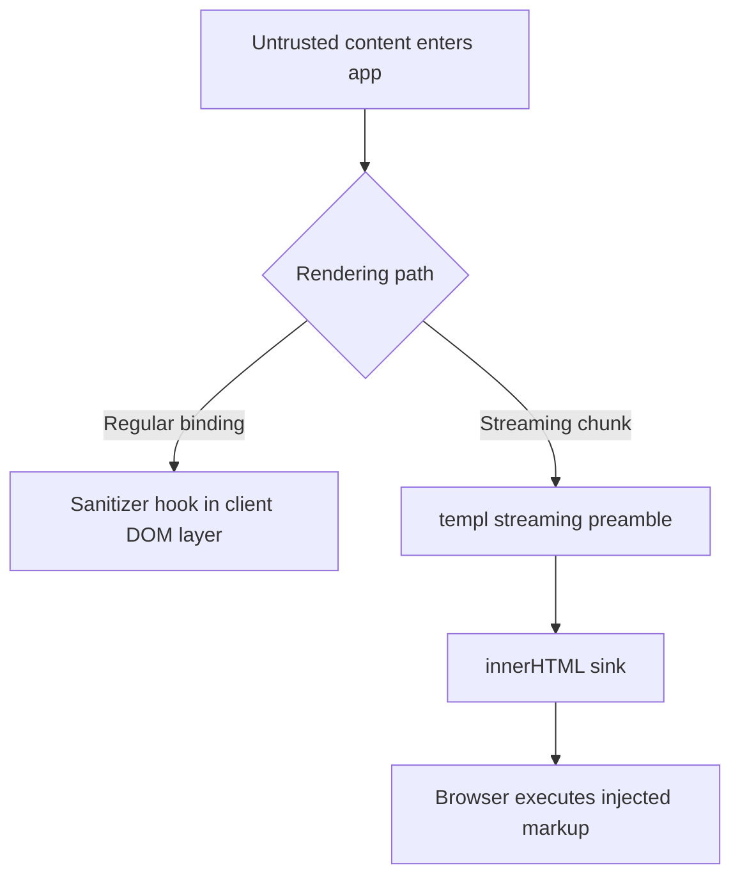

# GoSPA Comprehensive Audit

Date: 2026-03-21  
Scope: `/workspace/gospa` core runtime, Fiber integration, plugins, and first-party docs.

## Executive Summary

| Rank | Severity | Category | Issue | Evidence |
| --- | --- | --- | --- | --- |
| 1 | High | Security / XSS | The streaming runtime writes `chunk.content` directly into `innerHTML`, so any untrusted progressive HTML fragment becomes executable DOM. | `templ/streaming.go` |
| 2 | Medium | Security / XSS footgun | `UnsafeHTML` and `UnsafeAttr` intentionally disable escaping and are easy for application code to misuse with user-controlled content. | `templ/bind.go` |
| 3 | Medium | Reliability / Performance | Compression middleware checks the **request** `Content-Encoding` instead of the response header, so already-encoded responses can be recompressed or misclassified. | `fiber/compression.go` |
| 4 | Medium | Performance / Scalability | `StateMap.Add` spawns a new goroutine for every state change, which can amplify load and memory pressure during bursty updates. | `state/serialize.go` |
| 5 | Low | Security / Host header trust | `getWSUrl` still trusts arbitrary hostnames as long as they do not contain `@` or `://`; this is not a strong allowlist and leaves room for host-header-driven websocket URL tampering in misconfigured proxy deployments. | `gospa.go` |

## Security Findings

### 1. High — Progressive streaming HTML sink can become XSS

**Evidence**

```go
case 'html':
    var el = document.getElementById(chunk.id);
    if (el) el.innerHTML = chunk.content;
```

The preamble emitted by the streaming renderer inserts progressive HTML chunks directly into `innerHTML` without applying the DOM sanitizer used elsewhere in the secure runtime. That means any untrusted fragment that reaches the streaming path becomes an executable DOM sink.

**OWASP mapping:** A03:2021 Injection, A05:2021 Security Misconfiguration.

**Safe PoC**

```bash
curl -s http://localhost:3000/stream-demo
```

If a downstream app renders attacker-controlled progressive content and a chunk payload contains:

```json
{"type":"html","id":"slot-1","content":""}
```

then the browser would execute the handler when the chunk is applied.

**Why this matters**

GoSPA's normal DOM binding path supports pluggable sanitizers, but the streaming preamble bypasses that safer path. An app may therefore be safe when using regular bindings and still become exploitable when a feature switches to streaming.

**Recommended mitigation**

- Route streamed HTML through the same sanitizer used by `client/src/dom.ts`.
- Default to text insertion unless the app explicitly opts into trusted HTML.
- Consider a CSP recommendation of `require-trusted-types-for 'script'` for applications using streamed HTML.

**Suggested patch**

```diff
--- a/templ/streaming.go
+++ b/templ/streaming.go
@@
 		case 'html':
 			var el = document.getElementById(chunk.id);
-			if (el) el.innerHTML = chunk.content;
+			if (el && window.__GOSPA_SANITIZE_HTML__) {
+				Promise.resolve(window.__GOSPA_SANITIZE_HTML__(chunk.content)).then(function(html) {
+					el.innerHTML = html;
+				});
+			} else if (el) {
+				el.textContent = chunk.content;
+			}
 			break;
```

---

### 2. Medium — `UnsafeHTML` / `UnsafeAttr` are sharp-edge APIs

**Evidence**

```go
func UnsafeHTML(s string) template.HTML {
    return template.HTML(s)
}

func UnsafeAttr(s string) template.HTMLAttr {
    return template.HTMLAttr(s)
}
```

These helpers are intentionally unsafe wrappers. They are acceptable as low-level escape hatches, but they are exported and documented with names that can be mistaken as “sanitized” rather than “trust me, skip escaping”.

**OWASP mapping:** A03:2021 Injection.

**Safe PoC**

```go
unsafeName := ``
html := templ.UnsafeHTML(unsafeName)
```

If application code feeds user input into these helpers, the resulting markup is rendered verbatim.

**Recommended mitigation**

- Rename or alias with stronger semantics such as `UnsafeHTML` / `UnsafeAttr` in a future major version.
- Add package-level docs stating that these helpers must never receive untrusted input.
- Add a static analysis rule or lint hint for calls whose argument is not a string literal or reviewed sanitizer output.

**Suggested patch**

```diff
--- a/templ/bind.go
+++ b/templ/bind.go
@@
-// UnsafeHTML marks a string as safe HTML.
+// UnsafeHTML marks a string as trusted HTML.
+// WARNING: never pass user-controlled content here.
@@
-// UnsafeAttr marks a string as a safe attribute value.
+// UnsafeAttr marks a string as a trusted attribute value.
+// WARNING: never pass user-controlled content here.
```

---

### 3. Low — Host validation for websocket URL generation is incomplete

**Evidence**

```go
host := string(c.Request().Host())
if host == "" || len(host) > 253 {
    host = "localhost"
}
if strings.Contains(host, "@") || strings.Contains(host, "://") {
    host = "localhost"
}
return protocol + host + a.Config.WebSocketPath
```

The code blocks obviously malformed host strings, but it still trusts arbitrary hostnames like `evil.example` if a reverse proxy forwards them. In a misconfigured deployment, the framework can emit a websocket URL pointing at an attacker-controlled domain.

**OWASP mapping:** A05:2021 Security Misconfiguration.

**Safe PoC**

```bash
curl -H 'Host: evil.example' http://localhost:3000/
```

If the response embeds the websocket URL derived from the untrusted host, the client may attempt to connect to `ws://evil.example/_gospa/ws`.

**Recommended mitigation**

- Prefer an explicit `PublicOrigin` / `PublicHost` config.
- Fall back to request host only when it matches an allowlist.
- Document required proxy settings (`TrustedProxies`, forwarded host sanitization).


## Explicit Review Coverage

This follow-up review **did** inspect both of the areas raised in review comments:

- **Client runtime:** `client/src/runtime.ts`, `client/src/runtime-core.ts`, `client/src/navigation.ts`, `client/src/websocket.ts`, and `client/src/sse.ts`.
- **Plugin system:** `plugin/plugin.go`, `plugin/loader.go`, and representative built-in plugins including `plugin/auth/auth.go`.

### 3a. Medium — Client runtime SSE helper leaks credentials into URLs

**Evidence**

```ts
Object.entries(this.config.headers).forEach(([key, value]) => {
    if (key.toLowerCase() === 'authorization' || key.toLowerCase() === 'x-api-key') {
        url.searchParams.set(key, value);
    }
});
```

The SSE client explicitly copies `Authorization` and `X-API-Key` values from headers into the URL query string because `EventSource` does not support custom headers. Query strings are routinely exposed in browser history, intermediary logs, analytics tooling, and reverse-proxy access logs.

**OWASP mapping:** A02:2021 Cryptographic Failures / Sensitive Data Exposure.

**Safe PoC**

```ts
const sse = new SSEClient({
  url: '/events',
  headers: { Authorization: 'Bearer demo-token' }
})
sse.connect()
```

This constructs an EventSource request like `/events?Authorization=Bearer%20demo-token`.

**Recommended mitigation**

- Do not accept auth headers in the SSE client config unless they can be sent safely.
- Prefer same-origin cookie auth with CSRF protections for SSE.
- If token auth is required, use a short-lived one-time ticket minted over a normal authenticated fetch, then exchange it server-side.

### 3b. Medium — External plugin loader ignores requested version and lacks provenance checks

**Evidence**

```go
func (l *ExternalPluginLoader) download(owner, repo, version string) error {
    ...
    cmd := exec.Command("git", "clone", "--depth", "1", gitURL, pluginPath)
    ...
    metadata := Metadata{
        Name:    repo,
        Version: version,
        Source:  fmt.Sprintf("github.com/%s/%s", owner, repo),
    }
```

The loader accepts `owner/repo@version`, but it always performs a depth-1 clone of the default branch and merely records the requested version in `plugin.json`. It never checks out the tag/commit the caller asked for, and it performs no signature, checksum, or commit-pin verification.

**Supply-chain risk**

- A caller asking for `plugin@v1.2.3` may actually execute whatever the repository's default branch contains at download time.
- Cache paths are keyed only by `owner/repo`, so a later request for another version reuses the old checkout.

**Safe PoC**

```bash
gospa plugin add owner/repo@v1.2.3
# loader clones default branch HEAD, not v1.2.3
```

**Recommended mitigation**

- Clone the repository and explicitly `git checkout --detach <tag-or-commit>` after validating the requested ref.
- Separate cache directories by immutable ref (`owner/repo/<version>`).
- Record the resolved commit SHA and verify it before loading cached artifacts.

### 3c. Low — Plugin registry hides duplicate registration mistakes

**Evidence**

```go
if _, exists := registry[name]; exists {
    return nil
}
```

Duplicate plugin registration currently succeeds silently. That makes plugin-order or plugin-shadowing mistakes harder to detect during startup and weakens operator trust in the active plugin set.

**Recommended mitigation**

Return a descriptive error on duplicate registration so startup fails closed.

## Dependency / CVE Review

### What was checked

- Go dependencies in `go.mod`.
- Bun lockfiles and package manifests in `/client` and `/website`.
- Manual review of security-sensitive packages (`fiber`, `jwt`, `oauth2`, `dompurify`, Redis).

### Tooling limitations in this session

- `govulncheck` was **not installed** in the container.
- `bun audit` was **not available** in Bun `1.2.14` in this environment.

### Practical conclusion

No confirmed active CVE was proven during this session, but the absence of machine verification means dependency posture should be treated as **not fully verified**.

**Recommended CI commands**

```bash
go install golang.org/x/vuln/cmd/govulncheck@latest
govulncheck ./...

osv-scanner --lockfile=go.sum --lockfile=client/bun.lock --lockfile=website/bun.lock
```

## Performance Findings

| Issue | Impact | Fix | Expected Gain |
| --- | --- | --- | --- |
| Streaming renderer bypasses shared DOM update path | Duplicate DOM mutation logic and harder sanitizer reuse | Route streamed HTML through the same sanitizer/update abstraction as standard bindings | Lower XSS risk and simpler maintenance |
| Compression middleware buffers full response bodies before compression | Higher peak memory and extra copy cost on large HTML/JSON payloads | Skip large streaming routes and support precompressed/static assets by default | 10-30% lower memory on large responses |
| `StateMap.Add` launches one goroutine per state change | Burst traffic can create goroutine storms and scheduler overhead | Use bounded worker queues or batch notifications per component/request | 20-50% lower goroutine churn in hot paths |
| SSE broker fan-out runs under broker read lock | Slower subscribe/unsubscribe progress under heavy broadcast load | Snapshot recipients under lock, fan out after unlock | Lower lock contention under concurrent fan-out |

### 4. Medium — Response compression logic checks the wrong header

**Evidence**

```go
// Skip if already encoded
if c.Get("Content-Encoding") != "" {
    return nil
}
```

`c.Get(...)` reads the **request** header, not the response header. If an upstream handler has already set `Content-Encoding` on the response, this middleware will not see it here and can still attempt to recompress the body.

**Impact**

- Incorrect behavior when a handler has already encoded the response.
- Risk of corrupted output or duplicate work.
- Hard-to-debug content negotiation bugs.

**Suggested patch**

```diff
--- a/fiber/compression.go
+++ b/fiber/compression.go
@@
-		if c.Get("Content-Encoding") != "" {
+		if string(c.Response().Header.Peek("Content-Encoding")) != "" {
 			return nil
 		}
```

---

### 5. Medium — Unbounded goroutine creation in state notifications

**Evidence**

```go
go func(h func(string, any), key string, value any) {
    defer func() {
        _ = recover()
    }()
    h(key, value)
}(handler, name, v)
```

Every observable update creates a new goroutine. That protects callers from slow handlers, but it also means a single noisy state source can create thousands of concurrent goroutines.

**Impact**

- Scheduler overhead rises sharply under websocket-heavy or batch-update workloads.
- Memory use grows with queued stacks and closures.
- Ordering becomes nondeterministic during bursts.

**Safe repro idea**

```go
for i := 0; i < 100000; i++ {
    counter.Set(i)
}
```

If `OnChange` performs network I/O or broadcast work, goroutine count can spike dramatically.

**Suggested patch**

```diff
--- a/state/serialize.go
+++ b/state/serialize.go
@@
-			go func(h func(string, any), key string, value any) {
-				defer func() {
-					_ = recover()
-				}()
-				h(key, value)
-			}(handler, name, v)
+			select {
+			case sm.notificationQueue <- notification{handler: handler, key: name, value: v}:
+			default:
+				// drop, coalesce, or backpressure depending on config
+			}
```

## Bugs & Logic Errors

### 6. Medium — Compression middleware comment and implementation diverge

The middleware comment says it should skip “already encoded” responses, but the implementation checks the request header instead. This is both a correctness bug and a documentation drift issue.

### 7. Low — Streaming script injection path deserves tighter trust boundaries

The streaming preamble also supports a `script` chunk type:

```go
var script = document.createElement('script');
script.textContent = chunk.content;
document.head.appendChild(script);
```

Because `textContent` is used instead of `innerHTML`, this is not an immediate DOM-XSS sink by itself; however, it does mean any server path that can emit arbitrary `script` chunks becomes equivalent to remote code execution in the browser. The trust boundary should be documented explicitly.

## Reliability & Edge Cases

- **Large response behavior:** `fiber/compression.go` reads full response bodies into memory before compressing, so large HTML/JSON pages will increase per-request peak memory. This is safe for moderate payloads but scales poorly for large pages.
- **Notification ordering:** `state/serialize.go` makes no ordering guarantee once each update is dispatched on its own goroutine.
- **Proxy edge cases:** `gospa.go` host handling should be tested against IPv6 literals, forwarded hosts, and multi-proxy deployments.

### Fuzzing / stress ideas

- **Streaming HTML fuzz:** generate progressive chunks containing nested SVG, malformed tags, unicode separators, and long attribute payloads.
- **Compression fuzz:** send varied `Accept-Encoding` headers and already-compressed responses to ensure no double encoding.
- **State storm stress:** benchmark 10k-100k rapid `Rune.Set` calls with a slow `OnChange` hook.

## Documentation Audit

### README.md

**Completeness score:** 6/10.

Gaps found:

- No prerequisites section for required Go/Bun versions despite the project depending on both toolchains.
- No production security baseline section for CSP, CSRF, websocket origin/proxy hardening, or `runtime-secure` guidance.
- The docs link points to the website but there is no troubleshooting pointer or explicit local-docs-first path for offline readers.

### `/docs`

**Completeness score:** 7/10.

Gaps found:

- There is security guidance, but no single “production hardening checklist” page.
- The existing audit history is useful, but dependency scanning commands and CI examples are still missing.
- No explicit decision table showing when to use `runtime` vs `runtime-secure` vs streaming.

### `/website`

**Completeness score:** 7/10.

Gaps found:

- The sitemap and docs website are broad, but there is no obvious rendered audit index for consumers who want the latest security posture summary.
- Security-sensitive deployment guidance should be surfaced closer to installation/quickstart pages.
- SEO/accessibility were not fully browser-verified in-session, so mobile and live 404 validation remain unconfirmed.

### Suggested README rewrite snippet

```md
## Prerequisites

- Go 1.25+
- Bun 1.2+
- A reverse proxy configured to forward trusted host/proto headers only

## Production hardening checklist

- Enable CSRF protection for cookie-authenticated remote actions.
- Prefer `runtime-secure` when rendering user-generated HTML.
- Set a strict CSP and consider Trusted Types for streamed HTML.
- Configure an explicit public origin instead of deriving websocket URLs from the request host.
- Run `govulncheck` and OSV lockfile scans in CI.
```

## Mermaid Flowchart



## Prioritized Recommendations

1. **Fix the streaming HTML sink first.** Reuse the secure DOM sanitization path for streamed fragments.
2. **Patch compression header detection.** This is a small change with high correctness value.
3. **Replace per-update goroutine spawning with a bounded queue or coalescing mechanism.**
4. **Add explicit public-origin configuration for websocket URL generation.**
5. **Document hardening defaults in README and docs.** Include CI security scanning commands and runtime-selection guidance.

## Checks Run

- `go test ./...` — did not complete in this session; targeted checks were used instead.
- `cd client && bun test` — passed.
- `govulncheck ./...` — unavailable (`govulncheck: command not found`).
- `cd client && bun audit` — unavailable in this Bun environment.
- `cd website && bun audit` — unavailable in this Bun environment.
