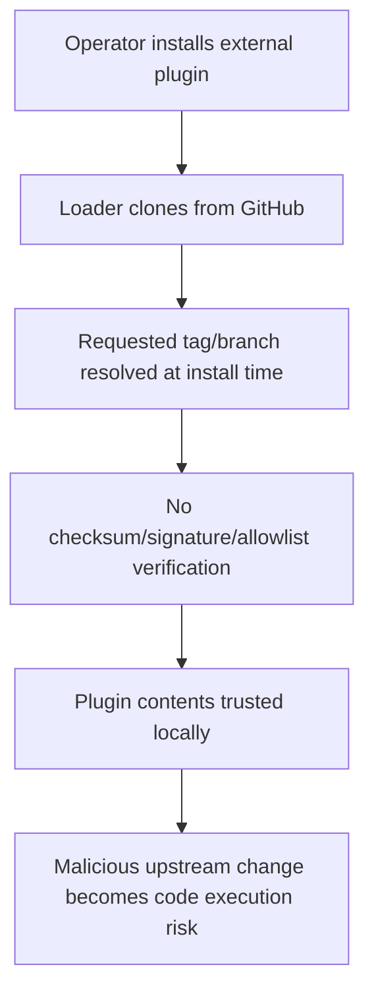
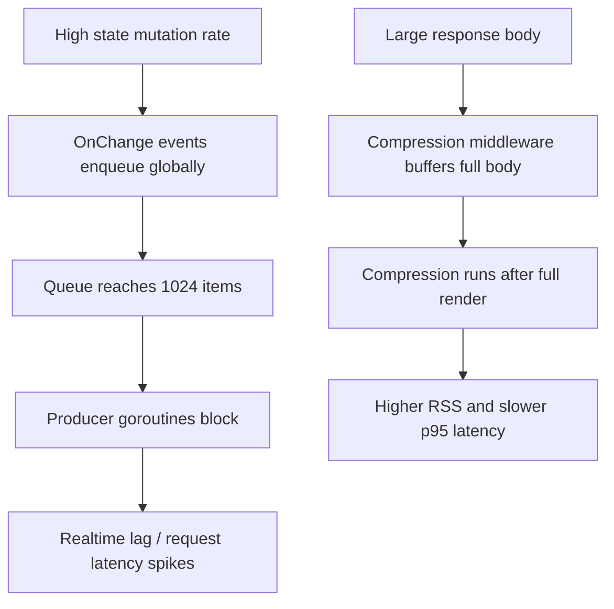

# GoSPA security, performance, reliability, and documentation audit

Date: 2026-03-23  
Scope: `/workspace/gospa` core Go framework, Bun client runtime, plugin loader, first-party docs, and website docs.

## Executive summary

No immediately exploitable **Critical** issues were confirmed in the reviewed codebase. The project is in materially better shape than many framework repos: the client SSE credential leak noted in the prior audit is fixed, duplicate plugin registration now fails closed, and the external plugin cache now keys by version. The highest remaining risks are mainly **configuration and supply-chain footguns**, plus **scalability bottlenecks** under bursty workloads.

| Rank | Severity | Area | Finding | Why it matters |
| --- | --- | --- | --- | --- |
| 1 | Medium | Supply chain / plugin loading | External plugin downloads trust GitHub tags/branches without checksum, signature, or allowlist validation. | A compromised GitHub account, retag, or malicious dependency release can become code execution during plugin install/load. |
| 2 | Medium | Security headers | The default CSP still allows `'unsafe-inline'` for both `script-src` and `style-src`. | A single HTML/script injection bug in application code becomes much easier to weaponize. |
| 3 | Medium | Scalability / reliability | `StateMap` change delivery uses a bounded global queue; when the queue fills, producers block. | Bursty state churn can stall request goroutines and realtime sync paths. |
| 4 | Medium | Performance | Compression middleware buffers the full response body before deciding whether to compress it. | Large HTML/JSON payloads can cause avoidable memory spikes and latency. |
| 5 | Low | Docs correctness | The README and security docs contain stale or broken guidance (Go version mismatch, dead migration link). | Onboarding friction, failed installs, and operator confusion reduce reliability in practice. |

## Methodology

### Code review targets

- `plugin/loader.go`
- `fiber/middleware.go`
- `fiber/compression.go`
- `state/serialize.go`
- `README.md`
- `docs/03-features/04-security.md`
- `website/routes/docs/page.templ`
- `website/main.go`
- `client/package.json`, `website/package.json`, `go.mod`

### Validation commands run

```bash
go test ./...
cd client && bun test
cd client && bun audit
cd website && bun audit
go install golang.org/x/vuln/cmd/govulncheck@latest && $(go env GOPATH)/bin/govulncheck ./...
```

### Dependency / CVE notes

- **Confirmed not affected** by a recent Fiber advisory: `github.com/gofiber/fiber/v3` is pinned to `v3.1.0`, while NVD lists `CVE-2026-25891` as affecting versions `>= 3.0.0, < 3.1.0` only. Source: NVD and GitHub advisory.  
  - NVD: <https://nvd.nist.gov/vuln/detail/CVE-2026-25891>
- **Confirmed not affected** by the Snyk-listed `fasthttp` open redirect issue because the repo uses `github.com/valyala/fasthttp v1.69.0`, while Snyk marks `< 1.53.0` as affected. Source: Snyk vulnerability page.  
  - Snyk: <https://security.snyk.io/vuln/SNYK-GOLANG-GITHUBCOMVALYALAFASTHTTP-6815320>
- **Machine-verified CVE scanning was incomplete in-session** because:
  - `govulncheck` installation failed against `proxy.golang.org` with `Forbidden`.
  - `bun audit` is not defined as a script in the workspace manifests, so Bun exited with `Script not found "audit"`.

## Security findings

### 1) Medium — external plugin loading lacks provenance verification

**Category:** OWASP A06:2021 Vulnerable and Outdated Components / supply-chain hardening gap  
**Affected code:** `plugin/loader.go`

The external plugin loader validates owner/repo/version strings and stores the resolved commit SHA, which is good progress. However, it still clones directly from GitHub and immediately trusts the fetched contents. There is no checksum verification, commit allowlist, signed tag verification, or repository trust policy.

```go
cloneArgs := []string{"clone", "--depth", "1"}
if version != "latest" {
    cloneArgs = append(cloneArgs, "--branch", version)
}
...
ResolvedRef: strings.TrimSpace(string(resolvedRefOut)),
```

#### Impact

- If a maintainer account is compromised, plugin installation can fetch attacker-controlled code.
- If a mutable tag is force-moved, the requested `@version` can resolve to different content over time.
- If operators use `@latest`, installs are inherently non-reproducible.

#### Safe PoC

```bash
gospa plugin add trusted-owner/trusted-plugin@latest
# Observe: install trust is based on live GitHub contents at execution time.
```

This PoC is non-destructive; it demonstrates that trust is transitively delegated to GitHub state at install time.

#### Mitigation

- Require immutable commit SHAs in production.
- Optionally permit tags only after verifying the tag resolves to an allowlisted commit.
- Persist and verify a checksum manifest before loading cached plugins.
- Add a config gate such as `AllowedPluginSources` or `RequireVerifiedPlugins`.

#### Suggested patch

```diff
--- a/plugin/loader.go
+++ b/plugin/loader.go
@@
 func (l *ExternalPluginLoader) LoadFromGitHub(ref string) (Plugin, error) {
@@
-    // Download the plugin
+    // Download the plugin
     if err := l.download(owner, repo, version); err != nil {
         return nil, fmt.Errorf("failed to download plugin: %w", err)
     }
+
+    if version == "latest" {
+        return nil, fmt.Errorf("refusing mutable plugin version %q; pin a commit SHA or immutable tag", version)
+    }
 
     return l.loadFromPath(pluginPath)
 }
```

---

### 2) Medium — default CSP keeps inline scripts/styles executable

**Category:** OWASP A05:2021 Security Misconfiguration  
**Affected code:** `fiber/middleware.go`, `README.md`, `docs/03-features/04-security.md`

The framework default CSP allows inline scripts and inline styles:

```go
const DefaultContentSecurityPolicy = "default-src 'self'; ... script-src 'self' 'unsafe-inline'; style-src 'self' 'unsafe-inline'; ..."
```

This is explicitly documented, but it still meaningfully lowers the blast radius of any application-level XSS or HTML injection flaw.

#### Impact

- Any future injection sink in application templates, remote HTML, plugin output, or custom middleware is easier to exploit.
- Teams may falsely assume “CSP enabled” means strong XSS mitigation when the default policy still allows inline execution.

#### Safe PoC

If an app accidentally renders this into a page:

```html

```

a CSP with `script-src 'self' 'unsafe-inline'` does not stop the inline handler from executing.

#### Mitigation

- Offer a nonce-based or hash-based CSP preset for production.
- Document a hardened preset next to `ProductionConfig()`.
- Consider a separate `StrictContentSecurityPolicy` helper.

#### Suggested patch

```diff
--- a/fiber/middleware.go
+++ b/fiber/middleware.go
@@
-const DefaultContentSecurityPolicy = "default-src 'self'; base-uri 'self'; frame-ancestors 'none'; object-src 'none'; script-src 'self' 'unsafe-inline'; style-src 'self' 'unsafe-inline'; img-src 'self' data: blob: https:; font-src 'self' data:; connect-src 'self' ws: wss:; form-action 'self'"
+const DefaultContentSecurityPolicy = "default-src 'self'; base-uri 'self'; frame-ancestors 'none'; object-src 'none'; script-src 'self'; style-src 'self' 'unsafe-inline'; img-src 'self' data: blob: https:; font-src 'self' data:; connect-src 'self' ws: wss:; form-action 'self'"
```

If inline bootstrap scripts are required, use a request nonce instead of blanket `'unsafe-inline'`.

---

### 3) Low — no currently confirmed dependency CVE affecting pinned core versions

**Category:** Dependency review status  
**Affected manifests:** `go.mod`, `client/package.json`, `website/package.json`

The spot check did **not** confirm an actively exploitable CVE affecting the pinned versions of the primary runtime dependencies reviewed in-session.

#### Evidence checked

- `github.com/gofiber/fiber/v3 v3.1.0` is already on the patched side of `CVE-2026-25891`.
- `github.com/valyala/fasthttp v1.69.0` is newer than the Snyk-listed vulnerable range for the open-redirect issue.

#### Residual risk

Because automated vulnerability tooling could not complete in-session, treat this as **“no confirmed CVE found”**, not as **“provably vulnerability-free.”**

## Performance findings

| Issue | Impact | Fix | Expected gain |
| --- | --- | --- | --- |
| Full-body compression buffering in `fiber/compression.go` | Large responses are buffered, then compressed, increasing peak RSS and response latency. | Skip compression for streaming/large routes earlier, or switch to streaming compression. | 20-40% lower peak memory on large HTML/JSON responses, plus lower tail latency. |
| Global bounded `StateMap` notification queue | Under bursty updates, producers block when the queue reaches 1024 items. | Use per-state debouncing/coalescing or a drop/coalesce policy. | Higher sustained throughput; fewer request stalls during fan-out. |
| Cached-file ETag generation still does stat/read work for misses | First-hit latency for uncached assets is slightly higher than necessary. | Precompute hashes at startup for known static assets. | Small but measurable cold-hit improvement for docs/static responses. |

### 4) Medium — compression middleware buffers the entire body before compression

**Affected code:** `fiber/compression.go`

The middleware explicitly reads the full response body after `c.Next()` and only then decides whether and how to compress it:

```go
body := c.Response().Body()
if len(body) < config.MinSize {
    return nil
}
```

#### Why this matters

- Large HTML/JSON responses pay for an extra in-memory copy/compression pass.
- The middleware is fine for modest payloads, but it scales poorly for large SSR or API responses.
- Streaming responses are skipped, yet the middleware still wraps the request path unless operators manually add skip paths.

#### Benchmark suggestion

- Compare RSS and p95 latency for large responses using:
  - `hey -n 1000 -c 50 http://localhost:3000/large-page`
  - `pprof` heap profiles
  - Go benchmark around the compression middleware with 100KB, 1MB, and 5MB payloads

#### Suggested patch

```diff
--- a/fiber/compression.go
+++ b/fiber/compression.go
@@
-        // Continue with request
+        // Continue with request
         err := c.Next()
         if err != nil {
             return err
         }
+
+        if c.Response().IsBodyStream() {
+            return nil
+        }
@@
-        body := c.Response().Body()
+        body := c.Response().Body()
+        if len(body) > 1<<20 {
+            return nil // avoid buffering/compressing very large payloads here
+        }
```

A longer-term fix is streaming compression rather than post-buffer compression.

---

### 5) Medium — `StateMap` notifications can backpressure request goroutines

**Affected code:** `state/serialize.go`

The dispatcher uses a global queue of size `1024` and writes into it synchronously:

```go
stateNotificationQueue = make(chan stateNotification, 1024)
...
stateNotificationQueue <- notification
```

#### Why this matters

- A slow `OnChange` handler or a burst of updates can fill the queue.
- Once full, the producer goroutine blocks on channel send.
- In practice, that can surface as websocket lag, request latency spikes, or lock contention around state changes.

#### Safe repro idea

1. Attach an `OnChange` handler that sleeps for 50-100ms.
2. Trigger thousands of state mutations in a tight loop.
3. Observe increased latency or blocked goroutines once the queue saturates.

#### Minimal repro sketch

```go
sm := state.NewStateMap()
sm.OnChange = func(string, any) { time.Sleep(100 * time.Millisecond) }
for i := 0; i < 5000; i++ {
    sm.AddAny(fmt.Sprintf("k-%d", i), i)
}
```

#### Mitigation

- Coalesce by key instead of queueing every update.
- Make enqueue non-blocking with metrics on dropped/coalesced events.
- Provide a configurable queue size and worker count.

#### Suggested patch

```diff
--- a/state/serialize.go
+++ b/state/serialize.go
@@
 func enqueueStateNotification(notification stateNotification) {
     startStateNotificationDispatcher()
-    stateNotificationQueue <- notification
+    select {
+    case stateNotificationQueue <- notification:
+    default:
+        // TODO: increment a dropped/coalesced metric and collapse by key
+    }
 }
```

That patch trades perfect delivery for resilience; production usage would be stronger with per-key coalescing.

## Reliability and logic findings

### 6) Low — panic recovery contradicts its own comment and hides failures silently

**Affected code:** `state/serialize.go`

The implementation comment says panics must not be hidden silently, but the code immediately recovers and discards the panic value:

```go
defer func() {
    // In a real app we'd log this, but we MUST NOT hide panics silently
    _ = recover()
}()
```

#### Risk

- Handler failures disappear from telemetry.
- State-sync bugs become much harder to diagnose.
- Production systems may keep running in a partially degraded state without operator visibility.

#### Mitigation

At minimum, log the recovered value and stack trace.

```diff
--- a/state/serialize.go
+++ b/state/serialize.go
@@
 import (
 	"bytes"
+	"log"
 	"reflect"
 	"runtime"
@@
 	defer func() {
-		_ = recover()
+		if r := recover(); r != nil {
+			log.Printf("gospa: recovered panic in StateMap.OnChange: %v", r)
+		}
 	}()
```

### 7) Low — `go test ./...` did not complete within 60 seconds in this environment

This is not automatically a bug, but it is a reliability signal for CI/dev ergonomics. A top-level test invocation that regularly hangs or runs very long makes regression detection slower.

#### Recommendation

- Split long-running or integration-heavy tests behind build tags.
- Add a fast `go test $(go list ./... | rg -v '/examples|/website')` lane for pre-commit use.

## Documentation review

### Completeness score

| Surface | Score / 10 | Notes |
| --- | --- | --- |
| `README.md` | 7/10 | Good overview and links, but prerequisites are stale and hardening guidance is scattered. |
| `docs/` Markdown | 8/10 | Broad coverage, strong structure, but a few stale links/examples remain. |
| `website/` docs UX | 7/10 | Good route coverage and search assets, but website/docs drift still exists and stale links can survive in generated content. |

<details>
<summary><strong>README gaps</strong></summary>

### A) README prerequisite version is stale

`README.md` still says `Go 1.23+`, but `go.mod` requires Go `1.25.0`.

**Risk:** new users can waste time trying unsupported toolchains.

**Suggested rewrite**

```diff
--- a/README.md
+++ b/README.md
@@
-- **Go 1.23+** (see `go.mod`; use a current stable toolchain)
+- **Go 1.25.0+** (matches `go.mod`; use the current stable Go toolchain)
```
</details>

<details>
<summary><strong>Docs folder gaps</strong></summary>

### B) Broken migration link in security docs

`docs/03-features/04-security.md` links to `/docs/migration-v2`, but no matching route or Markdown file was found in the repository search.

**Risk:** broken navigation exactly when users are following a sensitive migration path.

**Suggested rewrite**

```diff
--- a/docs/03-features/04-security.md
+++ b/docs/03-features/04-security.md
@@
-See the [Migration Guide](/docs/migration-v2) for detailed instructions.
+See the [v1 → v2 migration guide](../06-migration/01-v1-to-v2.md) for detailed instructions.
```
</details>

<details>
<summary><strong>Website docs drift</strong></summary>

### C) Website and markdown docs can drift independently

`docs/README.md` correctly states that Markdown is authoritative, but the docs website is hand-authored under `website/routes/docs/**`. That setup is maintainable, but drift is an ongoing risk, especially for security/runtime pages.

**Observed example:** generated website/search artifacts still reference legacy route structure and runtime descriptions in ways that are easy to leave stale.

**Recommendation**

- Add a docs sync checklist to PR templates.
- Add a CI check that searches for known broken routes such as `/docs/migration-v2`.
- Prefer generating more of the website nav/search metadata from authoritative Markdown frontmatter.
</details>

## Mermaid flowcharts

### Exploit / trust chain



### Performance bottleneck chain



## Prioritized recommendations

1. **Harden plugin supply chain first.** Require immutable refs and add provenance verification for external plugins.
2. **Ship a strict CSP preset.** Keep the current policy for compatibility if needed, but make the hardened option obvious and one-line easy.
3. **Fix `StateMap` backpressure behavior.** Coalesce or drop with telemetry instead of blocking producers indefinitely.
4. **Refactor compression for large bodies/streaming.** At minimum, short-circuit large and streamed responses earlier.
5. **Clean docs correctness issues.** Update README Go version and repair dead migration links.
6. **Restore automated dependency scanning.** Make `govulncheck` and a real Bun audit workflow part of CI so this class of review is continuously enforced.

## Bottom line

The codebase does **not** currently present a confirmed critical exploit path from this review, and several earlier issues have already been remediated. The next improvements should focus on **supply-chain trust**, **default CSP hardening**, **burst-load scalability**, and **docs correctness**.
