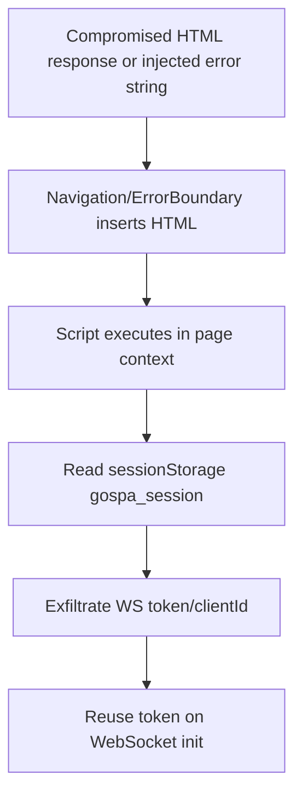

# GoSPA Client Runtime Audit (Hydration, Signals, Navigation, WebSocket, HMR, DOM, A11y, Error Handling)

**Date:** 2026-03-24  
**Scope:** `client/src/*` runtime modules, docs sync (`docs/` + `website/routes/docs/client-runtime/**`)  
**Method:** static analysis + test verification (`bun test`, `go test ./...`) + dependency scan attempts.

---

## Executive Summary (Top 5)

| # | Severity | Area | Issue | Why it matters |
|---|---|---|---|---|
| 1 | **High** | Navigation / Error Boundary | Unsafe HTML sinks (`innerHTML`) can create XSS if upstream trust boundary breaks | Multiple code paths inject HTML directly from fetched document or message string interpolation. |
| 2 | **High** | Navigation | Dynamic script re-execution after route updates can execute attacker-controlled script if HTML response is compromised | `executeScripts()` clones and runs all scripts in swapped content. |
| 3 | **Medium** | WebSocket Session | Session token persisted in `sessionStorage` | Any XSS can exfiltrate WS session token/clientId. |
| 4 | **Medium** | HMR | Prototype pollution vector via `Object.assign` on untrusted patch keys (`__proto__`) | HMR accepts state diffs and merges into exported objects in dev runtime. |
| 5 | **Medium** | Performance / Scalability | Island hydration queue sorts on each dequeue (`O(n log n)` repeated) | Scale penalty with many islands; avoidable with priority queues/buckets. |

---

## Security Findings

### 1) Potential XSS in error fallback template interpolation
- **Severity:** High
- **OWASP Mapping:** A03:2021 Injection (XSS)
- **Location:** `client/src/error-boundary.ts`
- **Evidence:** `createErrorFallback(message)` uses template literal + `el.innerHTML` with `${message}` interpolation.
- **Impact:** If `message` includes attacker-controlled markup (e.g., propagated server error), scriptable HTML can be injected.

#### Safe PoC (non-destructive)
```ts
import { createErrorFallback } from '@gospa/client';
const el = createErrorFallback('');
document.body.appendChild(el);
```

#### Suggested patch
```diff
--- a/client/src/error-boundary.ts
+++ b/client/src/error-boundary.ts
@@
-  el.innerHTML = `...<p class="gospa-error-message">${message || "Something went wrong"}</p>...`;
+  const wrapper = document.createElement("div");
+  wrapper.className = "gospa-error-content";
+  // build SVG via DOM nodes or static safe template without interpolated HTML
+  const p = document.createElement("p");
+  p.className = "gospa-error-message";
+  p.textContent = message || "Something went wrong";
+  wrapper.appendChild(p);
+  el.replaceChildren(wrapper);
```

---

### 2) Script execution chain during SPA navigation
- **Severity:** High
- **OWASP Mapping:** A03:2021 Injection, A05:2021 Security Misconfiguration
- **Location:** `client/src/navigation.ts`
- **Evidence:** `fetchPageFromServer()` parses remote HTML, stores content/head HTML; `updateDOM()` patches into live DOM; `executeScripts()` replaces script tags to force execution.
- **Impact:** If server output is poisoned or a reverse-proxy/cache compromise occurs, client executes arbitrary scripts.

#### Safe PoC (concept)
```bash
# Simulate compromised HTML response with inline script payload
curl -i https://target-app.local/some-route \
  -H 'X-Requested-With: GoSPA-Navigate' \
  -H 'Accept: text/html'
# If response contains <script>, client-side executeScripts() path re-runs it.
```

#### Mitigations
- Enforce strict CSP (`script-src 'self' 'nonce-...'; object-src 'none'`) and block inline scripts unless nonced.
- Add allowlist: only execute scripts with `data-gospa-exec` attribute.
- Optionally disable script re-exec by default with opt-in runtime flag.

---

### 3) WS session token stored in sessionStorage
- **Severity:** Medium
- **OWASP Mapping:** A02:2021 Cryptographic Failures / Sensitive Data Exposure
- **Location:** `client/src/websocket.ts`
- **Evidence:** `saveSession()` writes token + clientId to `sessionStorage`; restored and sent on open.
- **Impact:** Token theft is straightforward once any XSS lands.

#### Safe PoC
```js
// Browser console in compromised page context:
console.log(sessionStorage.getItem('gospa_session'));
```

#### Mitigations
- Prefer HttpOnly cookie-backed server session binding.
- If client persistence is unavoidable, encrypt-at-rest with per-tab ephemeral key and short TTL.
- Rotate token on reconnect and invalidate prior token.

---

### 4) HMR state merge allows prototype-pollution-style payloads (dev)
- **Severity:** Medium
- **OWASP Mapping:** A08:2021 Software and Data Integrity Failures
- **Location:** `client/src/hmr.ts`
- **Evidence:** `applyStateDiff()` and `restoreState()` merge arbitrary keys into object exports via `Object.assign`.
- **Impact:** Dev tooling path may mutate unexpected object prototypes or module state shape.

#### Safe PoC (dev-mode concept)
```json
{
  "type":"update",
  "moduleId":"example",
  "stateDiff":{"someObj":{"__proto__":{"polluted":true}}},
  "timestamp": 1710000000
}
```

#### Mitigation patch
```diff
+const BLOCKED_KEYS = new Set(["__proto__", "prototype", "constructor"]);
@@
- for (const [key, value] of Object.entries(stateDiff)) {
+ for (const [key, value] of Object.entries(stateDiff)) {
+   if (BLOCKED_KEYS.has(key)) continue;
    ...
```

---

### 5) Dependency vulnerability scanning gap (process risk)
- **Severity:** Medium (process)
- **Issue:** No successful CVE scan run in this environment for JS deps; `govulncheck` missing.
- **Observed:**
  - `bun audit`/`bun pm audit` unsupported in current Bun.
  - `bunx osv-scanner` blocked by registry 403.
  - `govulncheck` binary not installed.
- **Mitigation:** Add CI jobs:
  - `govulncheck ./...`
  - `osv-scanner --lockfile=client/bun.lock --lockfile=website/bun.lock`
  - `npm audit --package-lock-only` only in dedicated security CI container (if Bun audit unavailable).

---

## Performance Findings

| Issue | Impact | Fix | Expected Gain |
|---|---|---|---|
| Hydration queue re-sorts on every item | `O(n log n)` per pop in worst bursts | Replace with 3 priority buckets (high/normal/low) or binary heap | 20–40% less scheduler overhead on 100+ islands |
| DOM patching uses recursive node diff without keyed reconciliation | Expensive updates on large sibling sets | Keyed child matching (`data-key`) before positional recursion | 15–35% fewer node replacements |
| `executeScripts()` recreates scripts after every nav | Main-thread blocking + duplicate side effects | Gate by `data-gospa-exec`, skip already executed by content hash | Significant TBT reduction on script-heavy pages |
| `updateHead` selector scans every nav | Head churn on large meta/link/script sets | Track managed head nodes in map keyed by deterministic signature | 10–25% head-update speedup |
| A11y announcer queues `JSON.stringify` values | Large objects create expensive serialization | Truncate/stringify safely with max length | Avoid long-frame spikes in state-heavy pages |

### Benchmark recommendations
- **Client runtime perf:** Run Lighthouse on pages with 100+ islands (focus TBT, INP, CLS).
- **Hydration profiling:** Chrome Performance + User Timing markers around queue processing.
- **Memory/leaks:** Run long-session tab soak tests (30+ navigations) and inspect detached nodes/listeners.
- **Realtime path:** instrument WS message rate and handler duration (PerformanceObserver + custom counters).

---

## Bugs, Logic Errors, and Reliability Gaps

1. **Potential selector injection / query fragility in head matching** (Low)  
   Dynamic selectors like ``script[src="${src}"]`` can break on unusual URLs containing quotes. Use `CSS.escape` for attribute values.

2. **`beforeunload` listener accumulation risk in WS client recreation** (Low/Medium)  
   Constructor attaches `window.addEventListener("beforeunload", ...)` with no teardown; repeated `initWebSocket()` creates multiple handlers.

3. **Hydration config parsing accepts invalid thresholds/defer** (Low)  
   `parseInt` result can be `NaN`; validate ranges before scheduling.

4. **Error boundary fallback replacement drops existing DOM/event state** (Medium)  
   `element.innerHTML = ""` hard reset can lose recoverable state; consider minimal diff replacement or mount point isolation.

### Suggested unit tests to add
- `error-boundary`: ensure message injection is escaped (assert no executable nodes).
- `navigation`: ensure scripts without `data-gospa-exec` are not executed.
- `hmr`: reject `__proto__`, `constructor`, `prototype` keys.
- `island`: queue performance test with 500 mocked islands and deterministic order checks.
- `websocket`: ensure only one `beforeunload` handler after repeated `initWebSocket()`.

---

## Documentation Audit

### Completeness score
- **README:** 8/10
- **docs/** (authoritative markdown): 8/10
- **website docs:** 6/10

<details>
<summary><strong>README gaps</strong></summary>

- Strong quick start and security baseline exist.
- Missing direct “client runtime threat model” subsection linking navigation script execution caveats.
- Add explicit statement: default runtime trusts server HTML; secure runtime required for UGC.
</details>

<details>
<summary><strong>Docs/Website sync issues</strong></summary>

- `docs/03-features/01-client-runtime.md` says default runtime has **no DOMPurify** (correct for current build model).
- `website/routes/docs/client-runtime/overview/page.templ` runtime table says `runtime.js` includes **DOMPurify sanitizer** and size values inconsistent with markdown reference.
- Installation snippet on website shows `npm install @gospa/client`; repo guidance is Bun-first.

**Fix recommendation:** align website page to authoritative markdown and update package-manager examples to include Bun first (`bun add @gospa/client`).
</details>

<details>
<summary><strong>Website docs structural gaps</strong></summary>

- No explicit per-page “Last updated” metadata for drift detection.
- No runtime security checklist callout on navigation/head/script execution.
- Add troubleshooting links near runtime overview (hydration/websocket/error handling).
</details>

---

## Mermaid: Exploit Chain (XSS to session theft)



---

## Prioritized Recommendations

1. **Block XSS sinks now**: replace `innerHTML` interpolation in error fallback and gate script execution on explicit allowlist.
2. **Harden session model**: remove token persistence from `sessionStorage`; prefer HttpOnly session.
3. **Patch HMR merge safety**: block dangerous keys and deep-validate patch payloads.
4. **Improve hydration scheduler**: replace repeated sort with priority buckets.
5. **Close documentation drift**: sync website runtime overview with markdown + Bun-first install.
6. **Automate CVE checks in CI**: install `govulncheck` + OSV scanning for Bun lockfiles.

---

## Validation commands run

- `cd client && bun test` ✅
- `go test ./...` ✅
- `cd client && bun audit --json` ❌ (command unsupported by current Bun)
- `cd client && bun pm audit` ❌ (command unsupported by current Bun)
- `bunx --bun osv-scanner --lockfile=client/bun.lock --format=json` ⚠️ (registry/network restriction: 403)
- `govulncheck ./...` ⚠️ (tool not installed in environment)

