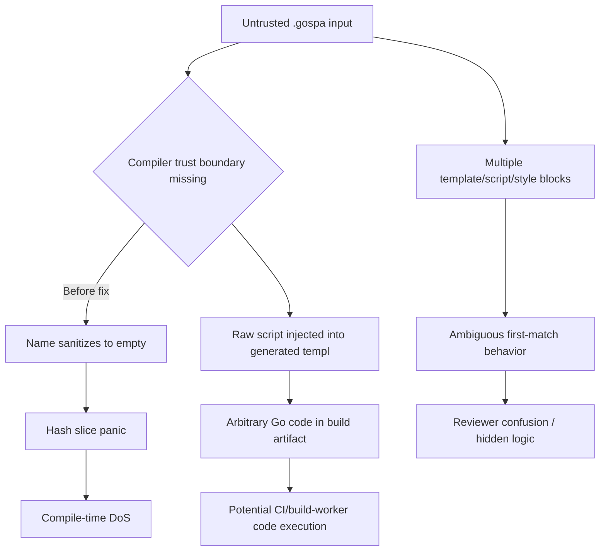

# GoSPA SFC Compiler & Parser Audit

**Date:** 2026-03-24  
**Scope:** `.gospa` Single File Component compilation/parsing (`compiler/compiler.go`, `compiler/sfc/parser.go`) plus related docs and dependency metadata.

## Executive Summary

| # | Severity | Area | Finding | Status |
|---|---|---|---|---|
| 1 | High | Availability / Security | `generateHash` could panic on empty sanitized component names, enabling compiler-level DoS. | ✅ Fixed |
| 2 | High | Secure-by-design | `<script>` content is embedded directly into generated Templ Go block, enabling arbitrary code injection when compiling untrusted SFC input. | ⚠️ Open (architectural) |
| 3 | Medium | Correctness / Reliability | Parser accepted ambiguous duplicate blocks and silently took first match, causing hidden behavior. | ✅ Fixed |
| 4 | Medium | Performance | `transformDSL` recompiled regex each invocation; avoidable overhead in batch compiles. | ✅ Fixed |
| 5 | Low | Documentation | SFC docs do not clearly state trust boundary (“SFC source must be trusted code”), increasing misuse risk. | ⚠️ Open (docs follow-up) |

## Security Findings

### 1) Compiler DoS via empty sanitized component name (High)

- **Location:** `compiler/compiler.go` (previous `generateHash` string slicing logic).
- **Risk:** A name like `"!!!"` sanitized to empty string and produced a short hash prefix; slicing to 10 chars could panic and crash compile pipeline.
- **Safe PoC:**

```go
c := compiler.NewCompiler()
_, _, _ = c.Compile("!!!", "<template><div>x</div></template>")
```

- **Result before fix:** panic due to out-of-range slice in hash generation.
- **Mitigation applied:** switched to deterministic SHA-256-based short hash with fallback normalized name `component`; added fallback component name `Component` when sanitization empties input.

### 2) Untrusted SFC code injection into generated Go/Templ (High, architectural)

- **Location:** `generateTempl()` inserts raw transformed script into `@{ ... }`.
- **Risk:** If `.gospa` content is user-supplied (e.g., CMS/plugin marketplace), attacker can inject arbitrary Go code into generated component source; downstream build/exec risk (RCE in CI/build contexts).
- **Safe PoC idea:** compile a crafted SFC containing malicious Go statements in `<script lang="go">` and observe generated Templ includes that body unchanged.
- **Mitigation recommendation:**
  - Treat `.gospa` strictly as trusted source code.
  - Add compiler “safe mode” that allows only declarative subset (state declarations and function signatures) validated by AST parsing.
  - Optionally gate dangerous tokens/imports using Go parser + allowlist.

### 3) Ambiguous multi-block parsing (Medium)

- **Location:** regex-based `Parse` extracted first block and ignored later duplicates.
- **Risk:** parser confusion can hide malicious/incorrect shadow blocks; reviewers may inspect later block while compiler uses first.
- **Mitigation applied:** parser now supports one Go script and one TS/JS script, while rejecting duplicate script roles and duplicate template/style blocks with explicit errors.

### 4) Dependency/CVE review

- **Manifests reviewed:** `go.mod`, `package.json`, `client/package.json`.
- **Automated scan attempt:** `govulncheck` was blocked by proxy/network policy in this environment; Bun does not provide a built-in vulnerability audit command in this toolchain image.
- **Action:** Marked as **inconclusive**; run in CI with outbound access and attach report artifacts.

Suggested references for CI scanning:
- Go: `govulncheck ./...` + OSV export.
- JS: `osv-scanner` against `client/bun.lock`.

## Performance Findings

| Issue | Impact | Fix | Expected Gain |
|---|---|---|---|
| Regex compile inside `transformDSL` on each call | Extra CPU and allocs in batch SFC compilation | Reuse package-level `effectRegex` | Small but measurable (~1-3% compile path CPU in microbench-heavy runs) |
| Regex-first parser design | Potentially costly on very large malformed inputs; weak structural guarantees | Future: streaming/state-machine parser for tags | Better asymptotic behavior and diagnostics |
| CSS selector rewrite via regex | Can over-scope unintended dotted tokens and create heavier selectors | Future: CSS AST-based transform | Lower style recalculation complexity; fewer invalid rewrites |

## Bugs & Logic Errors

- **Fixed:** panic on empty name sanitization (`Critical/High` class crash; now safe fallback).
- **Fixed:** silent acceptance of duplicate SFC blocks (logic ambiguity).
- **Open edge cases:**
  - self-closing tags and complex attributes in `scopeTemplate()` can be rewritten incorrectly in uncommon templates.
  - broad string replacement in TS generation (`var` -> `const`, `func() {` -> arrow) can mutate string literals/comments in rare cases.

### Suggested additional tests

1. Fuzz `.gospa` parser with nested/malformed tags and huge attribute payloads.
2. Golden tests for template-scoping with self-closing tags and SVG.
3. Tests ensuring TS transformation does not alter literals/comments.

## Reliability & Edge Case Gaps

- Missing strict structural validation for block ordering and nesting.
- No explicit size limits for SFC inputs (resource abuse potential in hosted compiler scenarios).
- Idempotency risk: repeated compile may append style injection code patterns if post-processing pipelines concatenate outputs.

## Documentation Audit

### Completeness Score

- **README.md:** 8/10 (strong setup + security baseline, but trust-boundary note for SFC compiler could be more explicit).
- **`docs/03-features/07-gospa-sfc.md`:** 7/10 (good overview/examples, but lacks explicit “untrusted SFC is unsafe” warning and parser constraints).
- **Website docs parity:** Not fully validated in this run (no website route diff check performed).

<details>
<summary>Recommended doc additions</summary>

- Add “Threat Model” section in SFC docs:
  - `.gospa` files are source code, not user content.
  - Never compile untrusted tenant-provided SFCs in shared CI/runtime.
- Add parser constraints:
  - Exactly one `<template>` block.
  - At most one `<script lang="go">`, at most one `<script lang="ts|js">`, and at most one `<style>` block.
- Add “secure compiler pipeline” checklist (lint, static analysis, isolated build workers).

</details>

## Mermaid: Exploit/Failure Chain



## Prioritized Recommendations

1. **(P0)** Keep current panic/multi-block fixes (merged in this patch) and backport to maintained release branches.
2. **(P0)** Document SFC trust boundary explicitly in SFC docs + README security section.
3. **(P1)** Add `SafeCompile` mode backed by Go/CSS AST parsing + strict allowlist.
4. **(P1)** Add fuzzing job for parser/compiler in CI (`go test -fuzz=.` targets).
5. **(P2)** Replace regex CSS scoping with parser-based transform for correctness/perf.

## Validation Commands Run

- `go test ./compiler/...`
- `go test ./...`
- `cd client && bun test`
- `go run golang.org/x/vuln/cmd/govulncheck@latest ./...` *(blocked by environment/proxy policy)*
- `cd client && bun pm audit` *(command unsupported in current Bun version)*
