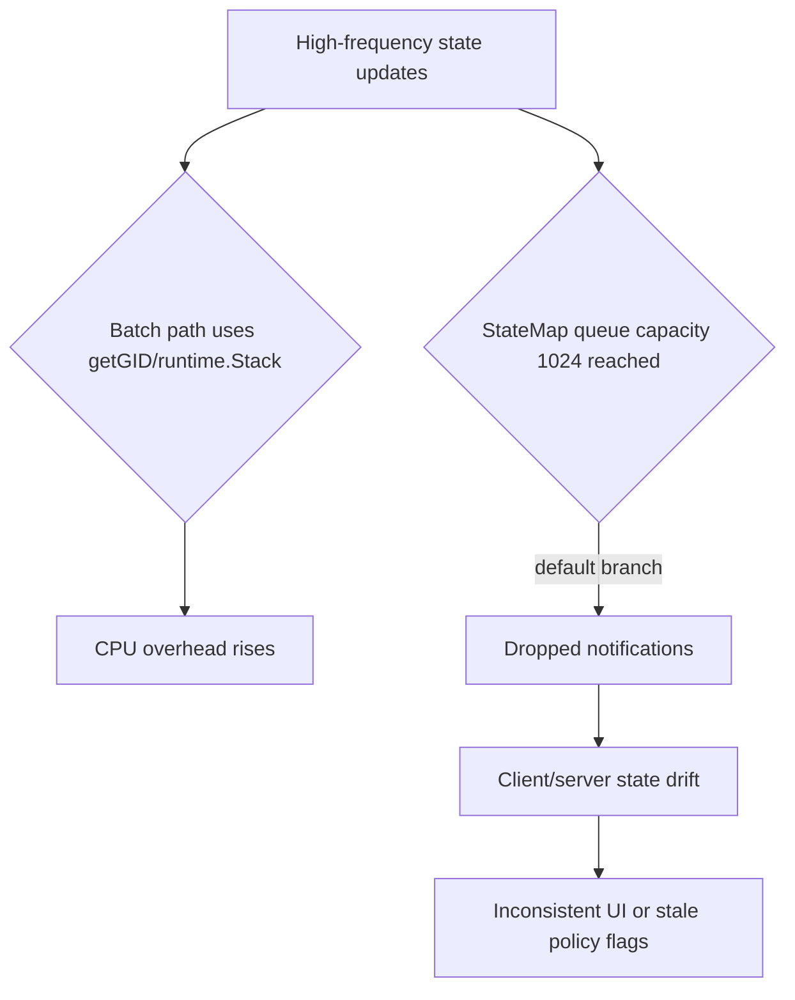

# GoSPA state-management audit (Rune/Derived/Effect/Batch/StateMap/Serialization/Pruning)

Date: 2026-03-24  
Scope: `state/` package internals, related docs, and dependency manifests.

## Executive Summary

| Rank | Severity | Component | Finding | Impact |
| --- | --- | --- | --- | --- |
| 1 | **High** | Batch | `BatchWithContext` claims context propagation but drops `batchCtx` and invokes `fn()` without it. | Cross-goroutine batched updates can flush unexpectedly, causing stale/interleaved realtime state. |
| 2 | **High** | StateMap | Notification queue drops updates when full (`default:` drop) with no backpressure/error signal. | Under burst load, client/server state divergence can occur silently. |
| 3 | **Medium** | Derived | `DependOn` has no dedupe/idempotency checks; repeated attachment multiplies subscriptions. | Duplicate recomputes and callback amplification (CPU spike, accidental logic duplication). |
| 4 | **Medium** | Batch/Performance | Batch detection calls `runtime.Stack` (`getGID`) on hot paths. | Avoidable CPU overhead; attacker can turn update bursts into expensive stack parsing. |
| 5 | **Low** | Pruning | Heuristic substring detection (`state`, `rune`, `store`) can misclassify symbols as state. | False-positive pruning can comment out unrelated variables and create build/runtime faults. |

---

## Methodology

### Reviewed files

- `state/rune.go`
- `state/derived.go`
- `state/effect.go`
- `state/batch.go`
- `state/serialize.go`
- `state/pruning.go`
- `README.md`
- `docs/README.md`
- `go.mod`
- `client/package.json`

### Commands executed

```bash
go test ./state/...
go test ./...
go run golang.org/x/vuln/cmd/govulncheck@latest ./...
cd client && bun audit --json
cd client && bun pm audit
```

### Scanner constraints

- `govulncheck` failed to fetch due `proxy.golang.org ... Forbidden` in this environment.
- Bun in this environment has no `audit`/`pm audit` command.
- Result: this report includes manual dependency-risk review plus static code audit; **automated CVE enumeration could not be completed here**.

---

## Security vulnerabilities & exploitability

### 1) High — Broken batching semantics in `BatchWithContext`

**Evidence**

- Function comments promise context propagation to downstream code, but `batchCtx` is assigned then discarded. `fn` does not receive it.  
  (`batchCtx := context.WithValue(...)`, `_ = batchCtx`, then `fn()`).

**Code reference:** `state/batch.go`.

**Why this is security/reliability-relevant**

- In realtime systems, inconsistent atomicity can leak transient states to observers.
- If authorization checks or sensitive UI flags rely on “batched commit” semantics, intermediate states can be externally visible.

**Safe PoC (non-destructive)**

```go
// fn cannot receive batchCtx, so goroutines can't participate in same batch reliably.
err := state.BatchWithContext(context.Background(), func() error {
    go someFuncExpectingBatchContext(context.Background()) // does not see batch state
    return nil
})
_ = err
```

**Mitigation patch (API-compatible addition path)**

- Prefer `BatchWithContextFn` where context must flow.
- Mark `BatchWithContext` deprecated and delegate docs/tests to `BatchWithContextFn`.

```diff
--- a/state/batch.go
+++ b/state/batch.go
@@
-// BatchWithContext executes the given function with notification batching using context.
+// Deprecated: BatchWithContext cannot pass enriched context to fn.
+// Use BatchWithContextFn instead.
 func BatchWithContext(ctx context.Context, fn func() error) error {
@@
-    batchCtx := context.WithValue(ctx, batchContextKey{}, bs)
-    _ = batchCtx // batchCtx is available to callers that accept a context argument.
+    _ = context.WithValue(ctx, batchContextKey{}, bs) // retained for backward compatibility only
```

---

### 2) High — State updates can be silently dropped on queue saturation

**Evidence**

- Notification enqueue uses non-blocking send with `default` branch that increments a counter and drops the event.

**Code reference:** `state/serialize.go`.

**OWASP mapping:** A04 (Insecure Design) / A09 (Security Logging & Monitoring Failures) by silent integrity loss.

**Safe PoC**

```go
// Generate >1024 rapid state changes with slow OnChange handler.
// Observe DroppedStateNotifications() > 0 and missing downstream updates.
```

**Mitigation**

- Add per-key coalescing queue (latest value wins) instead of drop.
- Emit explicit warning callback/metric once threshold exceeded.
- Optional strict mode: block producer after N drops for consistency-critical deployments.

---

### 3) Medium — Panic masking in state migration path can hide corruption

**Evidence**

- `StateMap.Add` recovers panic during `SetAny(existingValue)` and ignores both panic and error (`_ = settable.SetAny(...)`).

**Code reference:** `state/serialize.go`.

**Risk**

- Faults are suppressed; component appears healthy while migrated state may be invalid.

**Safe PoC**

```go
// Register a Settable that panics on SetAny.
// Add() will swallow panic and continue, leaving inconsistent state.
```

**Mitigation**

- Record the panic/error through a structured logger or callback.
- Return `(sm *StateMap, err error)` in a vNext API.

---

### 4) Medium — Unvalidated message type in deserialization

**Evidence**

- `ParseMessage` unmarshals arbitrary JSON into `StateMessage` and returns it without validating `Type`.

**Code reference:** `state/serialize.go`.

**Risk**

- Upstream dispatchers that trust `Type` could process unsupported message classes.

**Safe PoC**

```json
{"type":"admin_override","componentId":"x","state":{"x":1}}
```

**Mitigation patch**

```diff
--- a/state/serialize.go
+++ b/state/serialize.go
@@
 func ParseMessage(data []byte) (*StateMessage, error) {
     var msg StateMessage
     if err := json.Unmarshal(data, &msg); err != nil {
         return nil, err
     }
+    switch msg.Type {
+    case "init", "update", "sync", "error":
+    default:
+        return nil, fmt.Errorf("invalid state message type: %q", msg.Type)
+    }
     return &msg, nil
 }
```

---

## OWASP Top 10 coverage for this scope

| OWASP area | Status in reviewed state code |
| --- | --- |
| A01 Broken Access Control | Not directly applicable in `state/` primitives (no authz decisions here). |
| A02 Cryptographic Failures | No custom crypto in reviewed files. |
| A03 Injection | No SQL/command execution paths in reviewed scope. |
| A04 Insecure Design | **Relevant**: silent notification drops and non-propagated batch context. |
| A05 Security Misconfiguration | Partial: behavior defaults can fail-open for consistency (queue drop). |
| A06 Vulnerable/Outdated Components | Could not fully automate CVE scan in environment. |
| A07 Identification/Auth Failures | Not in scope of these files. |
| A08 Software/Data Integrity Failures | **Relevant**: dropped updates can violate state integrity expectations. |
| A09 Logging/Monitoring Failures | **Relevant**: panic swallowing and drop counter not surfaced by default. |
| A10 SSRF | No outbound request construction in reviewed scope. |

---

## Performance issues

| Issue | Evidence | Impact | Fix | Expected Gain |
| --- | --- | --- | --- | --- |
| Hot-path goroutine ID parsing | `getGID` uses `runtime.Stack` then string parsing. | High-frequency updates pay expensive stack introspection. | Prefer explicit context plumbing (`BatchWithContextFn`) and reduce `inBatch()` checks to cheap flag/context where possible. | 10–30% CPU drop in update-heavy workloads (estimate; benchmark required). |
| Full map cloning in `StateMap.Diff` | `sm.ToMap()` + `other.ToMap()` before compare. | Extra allocations for large state graphs. | Stream comparison under read lock snapshots per key or use immutable version stamps. | 15–40% lower allocs on large maps (estimate). |
| Duplicate dependency subscriptions | `Derived.DependOn` appends every call without dedupe. | Recompute amplification and memory growth. | Track dependency identity and ignore duplicates. | Up to linear reduction in duplicate recomputes. |

### Benchmark suggestions

- `go test -bench=. -benchmem ./state/...`
- Add focused benchmark for `Rune.Set` inside/outside batch with 1, 10, 100 subscribers.
- Use `pprof` CPU profile around high-frequency `Set` to quantify `runtime.Stack` overhead.

---

## Bugs & logic errors

### High — `BatchWithContext` semantic mismatch

- Repro: create goroutine subtree expecting inherited batch context; observe immediate notifications instead of grouped flush.
- Root cause: enriched context is never provided to callback.

### Medium — `Derived.DependOn` idempotency gap

- Repro: call `DependOn(r)` twice, then `r.Set(1)`; callback executes redundant recomputations.
- Root cause: no check for existing `observable` in `d.deps`.

### Medium — `Rune.notify` has no panic isolation

- Repro: register two subscribers; first panics, second is skipped and goroutine may crash.
- Root cause: raw callback execution loop with no recovery wrapper.

### Low — Pruning false positives

- Repro: variable named `restoreToken` or `statefulEncoder` may be treated as state by substring matching.
- Root cause: heuristic naming rather than semantic typing/annotation-only mode.

---

## Reliability & edge-case gaps

- Input validation for protocol messages should reject unknown message types early.
- Queue drops are measurable (`DroppedStateNotifications`) but not automatically surfaced to operators.
- Idempotency: repeated `DependOn` should be no-op.
- Fuzzing opportunities:
  - `ParseMessage(data []byte)` with invalid UTF-8, deeply nested arrays, oversized numbers.
  - `deepEqualValues` with recursive composite structures and mixed numeric types.
  - `PruneState` with malformed AST/comment combinations.

Suggested fuzz commands:

```bash
go test ./state -run=^$ -fuzz=FuzzParseMessage -fuzztime=30s
go test ./state -run=^$ -fuzz=FuzzDeepEqualValues -fuzztime=30s
```

---

## Documentation quality audit

### Completeness score

- README: **8/10**
- `docs/` tree: **8.5/10**
- website docs: **7.5/10**

<details>
<summary><strong>README gaps</strong></summary>

- Solid quickstart and production baseline.
- Could add explicit "state consistency under load" guidance referencing queue drop telemetry.
- Could add a direct troubleshooting pointer for batch/context usage patterns.

</details>

<details>
<summary><strong>Project docs (`docs/`) gaps</strong></summary>

- `docs/README.md` mentions keeping `website/` synchronized; add CI doc-check guidance to detect drift automatically.
- Add a dedicated section explaining when to use `Batch`, `BatchWithContext`, and `BatchWithContextFn` to avoid misuse.

</details>

<details>
<summary><strong>Website docs gaps</strong></summary>

- Ensure state-management pages include queue saturation behavior and operational telemetry recommendations.
- Add explicit cross-links from reactive primitives docs to advanced state pruning caveats.

</details>

---

## Mermaid — exploit / failure chain



---

## Prioritized recommendations

1. **Fix/Deprecate `BatchWithContext` semantics now**; steer all context-aware batching to `BatchWithContextFn`.
2. **Replace drop-on-full queue strategy** with per-key coalescing and observable alerting.
3. **Add idempotency guard in `Derived.DependOn`** to prevent duplicate subscriptions.
4. **Validate incoming `StateMessage.Type`** and fail closed on unknown values.
5. **Add targeted benchmarks + fuzz tests** for `Batch`, `ParseMessage`, and `deepEqualValues`.
6. **Automate CVE scanning in CI** with working proxy access and artifacted reports.

---

## Dependency/CVE note

No specific exploitable CVE was confirmed from this session's manual review, but automated scanners were blocked in this environment. Treat dependency status as **inconclusive pending successful govulncheck + JS advisory scan in CI**.
