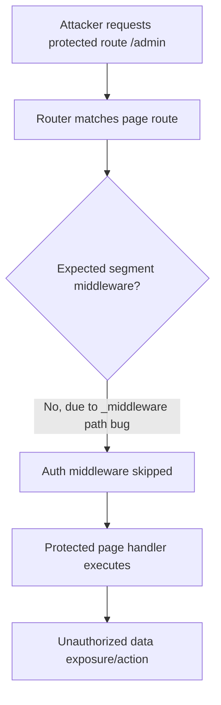

# GoSPA Audit (SFC Compiler/Parser + Routing + Rendering)

**Date:** 2026-03-25  
**Scope:** `.gospa` compiler/parser (`compiler/`), file-based routing (`routing/`), server rendering pipeline (`render*.go`, `render_utils.go`)  
**Method:** manual code review + focused test execution + dependency/vuln tooling checks.

---

## Executive Summary

| Rank | Severity | Area | Finding | Impact |
|---|---|---|---|---|
| 1 | **High** | Routing security | `_middleware.go` path normalization is broken, so middleware may never apply to intended route segments. | Access-control middleware can be silently bypassed on protected paths. |
| 2 | **High** | Routing logic | Non-optional trailing dynamic segments (`:id`) can match missing path segments due to permissive optional handling. | Route confusion/broken-auth patterns; handlers receive empty required params. |
| 3 | **Medium** | Sensitive data exposure | Raw internal `error.Error()` content is returned to clients in production error responses. | Stack/DB/internal details can leak to attackers. |
| 4 | **Medium** | Reliability/perf | Global ISR semaphore is lazily initialized without synchronization. | Data-race risk and non-deterministic throttling under concurrent startup/load. |
| 5 | **Medium** | Perf/scalability | Layout/middleware chain resolution rebuilds maps repeatedly per-request. | Avoidable allocations and CPU overhead at scale/high RPS. |

---

## Security Findings

### 1) `_middleware.go` route derivation bug enables middleware bypass (High)

**Where**
- `routing/auto.go` in `filePathToURLPath` trims file extension first, then checks for `_middleware.go` literal suffix.

**Why this is exploitable**
- For `routes/admin/_middleware.go`, extension stripping yields `admin/_middleware`.
- Later checks look for `_middleware.go`, not `_middleware`.
- Result: middleware route path is wrong (`/admin/_middleware`), so `ResolveMiddlewareChain` for `/admin/*` misses it.

**Safe PoC**
```bash
# route file layout
# routes/admin/_middleware.go      (auth check)
# routes/admin/page.templ          (protected page)

# expected: redirect/401
# observed with bug: middleware not hit, page can render
curl -i http://localhost:3000/admin
```

**Mitigation patch (concept)**
```go
// in filePathToURLPath, after ext removal:
case path == "_middleware" || strings.HasSuffix(path, "/_middleware"):
    if path == "_middleware" {
        path = ""
    } else {
        path = strings.TrimSuffix(path, "_middleware")
    }
```

---

### 2) Required params can become optional in matcher (High)

**Where**
- `routing/auto.go` in `matchRoute`.

**Issue**
- If `len(patternSegs) == len(pathSegs)+1` and final segment starts with `:`, matcher treats it as optional and sets empty param.
- This behavior is applied broadly to dynamic params, not just syntactic `[[param]]` optional routes.

**Safe PoC**
```bash
# route pattern: /users/:id
curl -i http://localhost:3000/users
# current logic can match and inject id="" instead of rejecting with 404
```

**Security consequence**
- Code paths relying on presence of `id` (authz, tenancy checks, resource scoping) may execute with invalid/empty identifiers.

**Mitigation patch (concept)**
- Preserve explicit metadata during parse for optional segments instead of inferring from trailing `:param`.
- Only allow missing segment when source segment was `[[param]]`.

---

### 3) Internal error message disclosure in rendered errors (Medium)

**Where**
- `render_utils.go` in `renderError`.

**Issue**
- Both fallback and error-component props include raw `errToDisplay.Error()`.
- No production gating/redaction.

**Safe PoC**
```bash
# trigger a server-side template/render error and inspect response body
curl -i http://localhost:3000/path-that-panics
```

**Observed risk**
- Internal implementation details (queries, storage keys, stack hints) can be exposed to end users.

**Mitigation patch (concept)**
```go
msg := "Internal Server Error"
if a.Config.DevMode {
    msg = errToDisplay.Error()
}
// use msg in response props/body
```

---

## Additional Reliability / Performance Findings

### 4) Unsynchronized global ISR semaphore init (Medium)

**Where**
- `render_isr.go` (`var isrSemaphore chan struct{}` + `initSemaphore`).

**Issue**
- Global mutable semaphore initialized via plain `if isrSemaphore == nil` with no lock/once.
- Concurrent first-use across goroutines/apps can race.

**Fix**
- Use `sync.Once` (or app-scoped semaphore field on `App`) to avoid shared global mutable state.

---

### 5) Recomputing chain maps per request (Medium)

**Where**
- `routing/auto.go`: `ResolveLayoutChain`, `ResolveMiddlewareChain`, `GetErrorRoute` build temporary maps on each call.

**Impact**
- Extra allocations and O(N) scan overhead on every route render.
- Under high cardinality routing tables + high RPS, this is avoidable tax.

**Fix**
- Build immutable indexes once at `Scan()` completion and use lock-free reads.

---

## OWASP Top-10 Coverage (focused to audited scope)

| OWASP Area | Status in scope | Notes |
|---|---|---|
| A01 Broken Access Control | **Risk found** | Middleware route bug can disable segment auth guards. |
| A03 Injection | No direct sink found in reviewed code | Depends on user templates/actions; not directly introduced by reviewed parser/router/render core. |
| A05 Security Misconfiguration | **Risk found** | Production error details are exposed by default path. |
| A06 Vulnerable/Outdated Components | **Partially assessed** | `govulncheck` blocked by local toolchain mismatch (`go1.24` runtime vs module `go1.25`). |
| A09 Logging/Monitoring failures | Partial | Errors logged, but no explicit security event classification/rate controls in reviewed area. |

---

## Dependency / CVE Notes

### Go dependencies
- Attempted: `go run golang.org/x/vuln/cmd/govulncheck@latest ./...`
- Result: scan failed due to environment Go toolchain mismatch (`application built with go1.24`, project requires `go1.25`).

### JS/Bun dependencies
- Attempted Bun-native audit commands (`bun audit`, `bun pm audit`), but current Bun in this environment does not provide an audit subcommand.

### Recommendation
- Run CVE gates in CI with matching toolchain:
  1. Go 1.25.x + `govulncheck ./...`
  2. Add OSV/Snyk/GitHub Advisory scan for lockfiles (`bun.lock`, `package-lock.json`)
- Reference feeds:
  - NVD: https://nvd.nist.gov/
  - OSV: https://osv.dev/
  - Snyk Vulnerability DB: https://security.snyk.io/

---

## Performance Table

| Issue | Impact | Fix | Expected Gain |
|---|---|---|---|
| Per-request route chain map rebuilds | Higher allocs/CPU at high RPS | Precompute indexes after `Scan()` | Lower p50/p99 CPU; fewer GC allocations |
| ISR semaphore global/shared | Non-deterministic throttle; race risk | App-scoped semaphore + `sync.Once` | More stable throughput under concurrent revalidation |
| Regex-heavy template/class transforms on each compile | Compile-time overhead for large SFCs | Cache/streamlined parsing for repeated builds | Faster build/generate loops |

---

## Bugs & Logic Errors

| Severity | File | Bug | Repro |
|---|---|---|---|
| High | `routing/auto.go` | `_middleware.go` mapping bug | Add segment middleware + call protected route; middleware not triggered |
| High | `routing/auto.go` | Required `:param` may match missing segment | Route `/x/:id` matches `/x` with empty id |
| Medium | `render_utils.go` | Internal errors exposed in response | Trigger render error and inspect body |
| Medium | `render_isr.go` | Global unsynchronized ISR semaphore init | Concurrent startup/load with race detector |

---

## Documentation Audit

### README / docs completeness score: **7/10**

<details>
<summary><strong>Gaps and inconsistencies</strong></summary>

1. Routing docs state `_middleware.go` is segment-scoped, but implementation currently cannot map `_middleware.go` correctly after extension stripping (behavior/documentation mismatch).
2. Optional segment semantics are under-specified relative to matcher behavior; docs imply explicit optional syntax, but matcher may make trailing dynamic params optional implicitly.
3. Security docs do not clearly state production redaction policy for runtime SSR errors.

</details>

---

## Mermaid: exploit/impact chain



---

## Prioritized Recommendations

1. **Fix `_middleware` normalization immediately** and add regression tests for root + nested middleware resolution.
2. **Correct optional-segment matching** by tracking optional metadata from source path syntax (`[[...]]` / `[[param]]`) rather than generic trailing `:param` inference.
3. **Redact production errors** in `renderError`; expose verbose details only in `DevMode`.
4. **Make ISR semaphore app-scoped + synchronized** to remove race potential.
5. **Precompute routing lookup indexes** after scan to reduce request-time allocations.
6. **Add CI vulnerability gates** with Go 1.25 and lockfile scanner integration.

