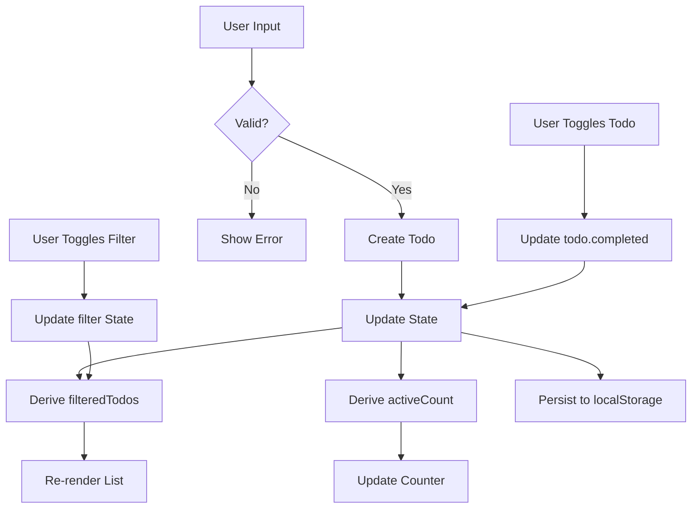

# Todo App Example - Implementation Plan

## Overview

A comprehensive todo app example demonstrating GoSPA's reactive state management, derived values, and real-time synchronization capabilities. This example showcases intermediate framework features beyond the basic counter demo.

## Architecture

### State Structure

```go
type Todo struct {
    ID        string `json:"id"`
    Text      string `json:"text"`
    Completed bool   `json:"completed"`
    CreatedAt int64  `json:"createdAt"`
}

type TodoState struct {
    Todos      []*Todo `json:"todos"`
    Filter     string  `json:"filter"`     // "all", "active", "completed"
    InputValue string  `json:"inputValue"`
}
```

### Derived Values

| Derived Value | Dependencies | Purpose |
|--------------|--------------|---------|
| `filteredTodos` | `todos`, `filter` | Display list based on filter |
| `activeCount` | `todos` | Count of incomplete items |
| `completedCount` | `todos` | Count of completed items |
| `allCompleted` | `todos` | Boolean for toggle-all state |

### File Structure

```
examples/todo/
├── main.go                    # Entry point
├── go.mod                     # Module definition
├── routes/
│   ├── layout.templ          # Base layout with styles
│   ├── page.templ            # Main todo page
│   └── components.templ      # Reusable components
└── static/
    └── todo.css              # Custom animations
```

## Features

### Core Functionality
- [ ] Add todos via input + Enter
- [ ] Toggle individual todo completion
- [ ] Delete individual todos
- [ ] Toggle all todos (complete/uncomplete all)
- [ ] Filter by: All / Active / Completed
- [ ] Clear all completed todos
- [ ] Persistent storage via localStorage

### UI Features
- [ ] Empty state illustration
- [ ] Strikethrough animation on completion
- [ ] Slide-out animation on deletion
- [ ] Filter tabs with active indicator
- [ ] Items left counter
- [ ] Checkbox morphing animations

### Technical Features
- [ ] Reactive state with `data-gospa-state`
- [ ] Derived values using client-side `Derived`
- [ ] Batch updates for toggle-all
- [ ] Effect for localStorage persistence
- [ ] Keyboard shortcuts (Enter to add, Escape to clear)

## Design System

### Color Palette

```css
--bg-void: #0a0a0f;
--bg-card: rgba(15, 23, 42, 0.6);
--border-glow: rgba(99, 102, 241, 0.3);
--accent-active: #22d3ee;   /* cyan-400 */
--accent-complete: #a78bfa; /* violet-400 */
--text-primary: #f8fafc;    /* slate-50 */
--text-secondary: #94a3b8;  /* slate-400 */
--text-muted: #64748b;      /* slate-500 */
```

### Typography

- Headers: Space Grotesk, 700 weight
- Body: IBM Plex Sans, 400/500 weight
- Todo items: 18px, line-height 1.5

### Spacing Scale

- Card padding: 2rem (32px)
- Todo item height: 64px
- Gap between items: 0.5rem (8px)
- Input padding: 1rem 1.25rem

### Animations

| Animation | Duration | Easing |
|-----------|----------|--------|
| Item enter | 300ms | cubic-bezier(0.4, 0, 0.2, 1) |
| Item exit | 200ms | cubic-bezier(0.4, 0, 1, 1) |
| Checkbox check | 200ms | cubic-bezier(0.34, 1.56, 0.64, 1) |
| Strikethrough | 250ms | ease-out |
| Filter underline | 200ms | ease-in-out |

## Implementation Steps

### Phase 1: Project Setup
1. Create `examples/todo/` directory structure
2. Initialize Go module with `go mod init todo`
3. Create `main.go` with basic GoSPA setup
4. Test server runs on `:3000`

### Phase 2: Layout & Styling
1. Create `layout.templ` with dark theme and glassmorphism
2. Add custom CSS for animations and transitions
3. Import Google Fonts (Space Grotesk, IBM Plex Sans)
4. Ensure responsive design (mobile-first)

### Phase 3: Core Components
1. Create `components.templ` with:
   - `TodoInput` - Input field with add button
   - `TodoItem` - Individual todo row with checkbox and delete
   - `TodoFilters` - Filter tabs (All/Active/Completed)
   - `TodoFooter` - Items left + Clear completed
2. Add `data-gospa-component` attributes for islands

### Phase 4: State Management
1. Define initial state in `page.templ`:
   ```json
   {
     "todos": [],
     "filter": "all",
     "inputValue": ""
   }
   ```
2. Implement state update handlers using `__GOSPA__` global
3. Add helper functions for todo operations

### Phase 5: Derived Values
1. Create client-side `Derived` for `filteredTodos`
2. Create `Derived` for `activeCount` and `completedCount`
3. Bind derived values to DOM using `data-bind`

### Phase 6: Persistence
1. Add `Effect` to sync state with localStorage
2. Load saved todos on component init
3. Handle localStorage errors gracefully

### Phase 7: Polish
1. Add keyboard shortcuts (Enter, Escape)
2. Implement empty state
3. Add loading skeleton (optional)
4. Test all interactions

## Code Patterns

### Adding a Todo

```javascript
// Get current state
const state = __GOSPA__.getState('todo-app');
if (!state) return;

// Get input value
const input = state.get('inputValue');
if (!input || !input.trim()) return;

// Create new todo
const newTodo = {
    id: Date.now().toString(36) + Math.random().toString(36).substr(2),
    text: input.trim(),
    completed: false,
    createdAt: Date.now()
};

// Update todos array
state.update('todos', todos => [...todos, newTodo]);
state.set('inputValue', ''); // Clear input
```

### Derived Value: Filtered Todos

```javascript
const filtered = new GoSPA.Derived(() => {
    const todos = state.get('todos');
    const filter = state.get('filter');
    
    switch (filter) {
        case 'active': return todos.filter(t => !t.completed);
        case 'completed': return todos.filter(t => t.completed);
        default: return todos;
    }
});
```

### localStorage Persistence

```javascript
new GoSPA.Effect(() => {
    const todos = state.get('todos');
    try {
        localStorage.setItem('gospa-todos', JSON.stringify(todos));
    } catch (e) {
        console.warn('Failed to save todos:', e);
    }
});
```

## Testing Checklist

- [ ] Can add todo by typing and pressing Enter
- [ ] Can add todo by clicking add button
- [ ] Empty todos cannot be added
- [ ] Can toggle todo completion
- [ ] Toggle all works with mixed state
- [ ] Can delete individual todos
- [ ] Filter tabs show correct counts
- [ ] Filter changes update displayed list
- [ ] Clear completed removes only completed
- [ ] Items left counter updates correctly
- [ ] Todos persist after page refresh
- [ ] Keyboard navigation works
- [ ] Mobile layout is usable
- [ ] Animations are smooth (60fps)

## Documentation

The example includes:
- Inline code comments explaining patterns
- README.md with setup instructions
- Reference to state primitives documentation

## Mermaid Diagram



## Notes

- Follow the counter example's pattern for consistency
- Use Tailwind CSS v4 via CDN for styling
- Keep JavaScript inline in templates for readability
- Ensure accessibility with proper ARIA attributes
- Comment complex reactive patterns for learning purposes
