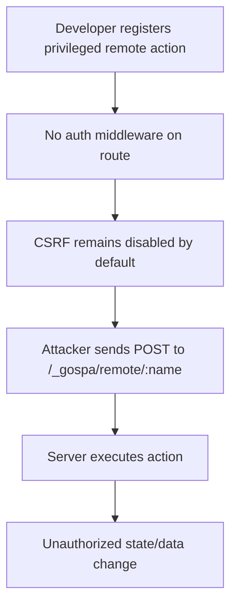

# Comprehensive Security, Performance, Reliability, and Documentation Audit

Date: 2026-03-10  
Scope: `github.com/aydenstechdungeon/gospa` (Go framework + client runtime + docs)

## Executive Summary

| Rank | Severity | Category | Finding | Affected Area |
|---|---|---|---|---|
| 1 | **High** | Security (A01 Broken Access Control / A05 Security Misconfiguration) | Remote actions are exposed by default without built-in auth guard and CSRF is opt-in. | `gospa.go` route/middleware wiring |
| 2 | **High** | Bug / Reliability | `EnableOTPHandler` can panic on missing `user` context due to unsafe type assertion. | `plugin/auth/auth.go` |
| 3 | **Medium** | Security (A07 Identification & Authentication Failures) | JWT validation does not enforce issuer/audience/subject policy checks after parse. | `plugin/auth/auth.go` |
| 4 | **Medium** | Performance | SPA navigation middleware performs avoidable body bytes→string→bytes copy for every navigated HTML response. | `fiber/middleware.go` |
| 5 | **Low** | Documentation / Supply-chain process | Dependency CVE scan automation is not documented/automated; `govulncheck` fetch blocked in environment. | repo-wide process/docs |

---

## Security Findings

### 1) Remote actions reachable without default auth guard (**High**)
**OWASP mapping:** A01 Broken Access Control, A05 Security Misconfiguration.

**Evidence**
- Remote action endpoint is always mounted as `POST /_gospa/remote/:name` with only rate limiting and input-size/content-type checks. No default auth/CSRF gate is attached at route level.  
- CSRF middleware is conditional (`EnableCSRF`), and default config does not set it to enabled.

**Safe PoC (framework-level misuse scenario)**
```bash
curl -i -X POST http://localhost:3000/_gospa/remote/deleteAccount \
  -H 'Content-Type: application/json' \
  --data '{"userId":"victim"}'
```
If an app developer registers a privileged remote action and forgets auth middleware, this endpoint is directly callable.

**Impact**
- Unauthorized action invocation if application developer omits explicit authorization checks.
- CSRF risk in cookie-auth deployments when `EnableCSRF` remains false.

**Mitigations**
1. Provide a global remote-action auth hook in framework config (e.g., `RemoteActionMiddleware`).
2. Consider secure-by-default mode: enable CSRF token validation for remote action POSTs by default.
3. Document mandatory auth checks in every remote action handler.

**Patch sketch**
```diff
 type Config struct {
+   RemoteActionMiddleware fiberpkg.Handler
 }
 
 // setupRoutes
-a.Fiber.Post(a.Config.RemotePrefix+"/:name", fiber.RemoteActionRateLimitMiddleware(), func(c *fiberpkg.Ctx) error {
+handlers := []fiberpkg.Handler{fiber.RemoteActionRateLimitMiddleware()}
+if a.Config.RemoteActionMiddleware != nil {
+    handlers = append(handlers, a.Config.RemoteActionMiddleware)
+}
+handlers = append(handlers, func(c *fiberpkg.Ctx) error {
   // existing handler
-})
+})
+a.Fiber.Post(a.Config.RemotePrefix+"/:name", handlers...)
```

---

### 2) OTP handler panic via unsafe type assertion (**High**)
**OWASP mapping:** A09 Security Logging/Monitoring Failures (availability angle), A05 Security Misconfiguration (middleware-order fragility).

**Evidence**
- `user := c.Locals("user").(*User)` is executed before nil/type checks.
- If `RequireAuth()` middleware is missing or altered, this panics and returns 500.

**Safe PoC**
```bash
# assuming route wired to EnableOTPHandler without RequireAuth
curl -i -X POST http://localhost:3000/auth/otp/enable
```
Expected: 401/403. Current behavior: panic/recovery path and 500.

**Mitigation patch**
```diff
 func (p *AuthPlugin) EnableOTPHandler() fiber.Handler {
   return func(c *fiber.Ctx) error {
-    user := c.Locals("user").(*User)
-    if user == nil {
+    userAny := c.Locals("user")
+    user, ok := userAny.(*User)
+    if !ok || user == nil {
       return c.Status(fiber.StatusUnauthorized).JSON(fiber.Map{"error": "unauthorized"})
     }
```

---

### 3) JWT claim policy checks are incomplete (**Medium**)
**OWASP mapping:** A07 Identification and Authentication Failures.

**Evidence**
- Token parse verifies signature and standard validity, but no explicit issuer/audience/subject enforcement beyond setting issuer at minting time.

**Safe PoC idea**
- Present a validly signed token from another service sharing the secret but with mismatched issuer/audience; policy should reject, but current code may accept if signature is valid and `token.Valid` passes base checks.

**Mitigation patch**
```diff
 if claims, ok := token.Claims.(*Claims); ok && token.Valid {
+   if claims.Issuer != p.config.Issuer {
+      return nil, fmt.Errorf("invalid issuer")
+   }
+   // optional: enforce Audience / Subject / NotBefore window
    return claims, nil
 }
```

---

### 4) OAuth callback returns provider token directly to client (**Medium**)
**OWASP mapping:** A02 Cryptographic Failures / token handling hygiene.

**Evidence**
- Callback returns raw OAuth token JSON response to the caller.

**Risk**
- Encourages exposing provider access tokens to browser/front-channel responses.

**Mitigation**
- Exchange token server-side and mint app session/JWT; never expose upstream provider token except in explicit trusted confidential-client flows.

---

### CVE / dependency review status
- Attempted `govulncheck` installation/run failed due module fetch forbidden by environment policy.
- Bun does not currently provide built-in `audit` command in this environment (`bun pm audit` unsupported).
- No confirmed CVE IDs were proven in this run; dependency vulnerability status remains **inconclusive** without an external advisory feed.

Recommended follow-up tooling in CI:
- Go: `govulncheck ./...` (or `go run golang.org/x/vuln/cmd/govulncheck@latest ./...`).
- JS/TS (bun projects): integrate OSV/Snyk/GitHub Dependabot over `client/bun.lock`.

---

## Performance Findings

| Issue | Impact | Fix | Expected Gain |
|---|---|---|---|
| SPA navigation middleware copies full HTML body (bytes→string→bytes). | Higher allocs/GC for every SPA nav response, amplified on large pages. | Set header without re-serializing body; avoid `string(body)` and `SetBodyString`. | 5-20% lower alloc pressure on nav-heavy pages (workload-dependent). |
| Linear CORS origin search per request. | Minor per-request overhead with large origin lists. | Precompute `map[string]struct{}` for exact matches at app init. | Small latency reduction under high QPS / many origins. |
| WebSocket hub registers client before first-message auth init completes. | Extra churn under connection floods (even with rate limiter). | Delay registration until init message validated. | Better resilience under malformed-connection storms. |

### Before/After diff (allocation reduction)
```diff
- body := c.Response().Body()
- if len(body) == 0 { return nil }
- bodyStr := string(body)
  c.Set("X-GoSPA-Partial", "true")
- c.Response().SetBodyString(bodyStr)
  return nil
```

---

## Bugs & Logic Errors

| Severity | Finding | Repro |
|---|---|---|
| High | Panic when `c.Locals("user")` missing in OTP enable handler. | Call endpoint without auth middleware. |
| Medium | JWT policy checks lack explicit issuer/audience enforcement. | Supply foreign-but-valid token under shared secret scenario. |
| Low | Docs/claim mismatch risk around “built-in CSRF” vs opt-in config defaults. | New adopters may deploy without turning on `EnableCSRF`. |

### Suggested unit tests (gaps)
1. OTP handler should return 401 (not panic) when no `user` local exists.
2. JWT validation should fail when `issuer` mismatches config.
3. Remote action endpoint should be rejected when security middleware is required (if added).

---

## Reliability & Edge-Case Observations

- Input validation is generally present for remote actions (name length, content type, JSON parse, size checks), but authorization is delegated to application code.
- WebSocket init requires first message within 10s; robust for idle abuse, but registration-before-auth can still add temporary server state churn.
- Fuzzing targets recommended:
  - `gospa` remote action body parser and action dispatch.
  - `fiber` WebSocket message decode/state sync payloads.
  - auth plugin request parsing for OTP endpoints.

Suggested fuzz commands:
```bash
go test -fuzz=Fuzz -run=^$ ./...
```
(Needs dedicated fuzz harnesses added around JSON/body parsing boundaries.)

---

## Documentation Audit

<details>
<summary><strong>README.md gaps</strong></summary>

- Informal line in top section (“pushing to main/master…”) reduces production-readiness signal.
- Security feature phrasing says “built-in CSRF protection” but default config leaves CSRF disabled unless explicitly enabled.
- Missing explicit security checklist in quick-start (CORS origins, CSRF enablement, auth middleware for remote actions).

</details>

<details>
<summary><strong>/docs gaps</strong></summary>

- Good breadth, but no single “production hardening checklist” page linking CSRF + CORS + auth middleware + CSP + dependency scan.
- No dedicated incident-response/troubleshooting page for auth/session abuse patterns.

</details>

<details>
<summary><strong>/website docs sync risk</strong></summary>

- Large generated `website/static/llms-full.md` appears to mirror docs but likely drifts without automation checks.
- Add docs sync CI check to ensure website snapshots update with source docs changes.

</details>

**Documentation completeness score:** **7/10**

---

## Mermaid: Exploit Chain (misconfiguration path)



---

## Prioritized Recommendations

1. **Immediate (P0):** Fix OTP panic guard (`Locals("user")` safe assertion).  
2. **Immediate (P0):** Add explicit remote action auth middleware hook and promote secure-by-default examples.  
3. **Near-term (P1):** Enforce issuer/audience checks in JWT validation.  
4. **Near-term (P1):** Remove avoidable HTML body copy in SPA navigation middleware.  
5. **Near-term (P1):** Add CI dependency vulnerability scanning (Go + JS lockfiles) and fail build on critical findings.  
6. **Medium-term (P2):** Add production hardening docs and docs-sync automation for website snapshot content.

