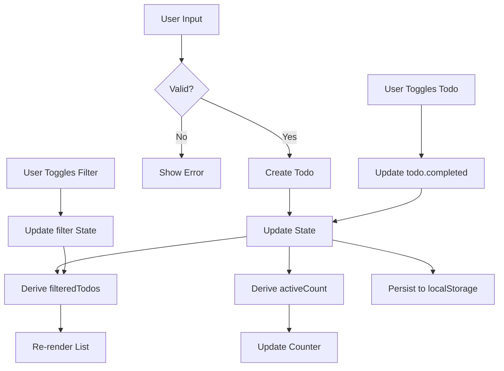

# Repository: https://github.com/aydenstechdungeon/gospa/
# Official website: https://gospa.onrender.com/
# Website's Docs: https://gospa.onrender.com/docs

<!-- FILE: README.md -->
================================================================================

# GoSPA

<div align="center">
  
  
</div>

GoSPA (Go Spa and Go S-P-A are the only valid pronunciations)  brings Svelte-like reactive primitives (`Runes`, `Effects`, `Derived`) to the Go ecosystem. It is a high-performance framework for building reactive SPAs with Templ, Fiber, file-based routing, and real-time state synchronization.

## Highlights

- **Native Reactivity** - `Rune`, `Derived`, `Effect` primitives that work exactly like Svelte 5.
- **WebSocket Sync** - Transparent client-server state synchronization with GZIP delta patching.
- **SFC System** - Single File Components (`.gospa`) with scoped CSS and Go-based logic.
- **File-Based Routing** - SvelteKit-style directory structure for `.templ` and `.gospa` files.
- **Hybrid Rendering** - Mix SSR, SSG, ISR, and PPR on a per-page basis.
- **Type-Safe RPC** - Call server functions directly from the client without boilerplate endpoints.
- **High Performance** - Integrated `go-json` and optional MessagePack for minimal overhead.

## Quick Start

### 0. Prerequisites
- **Go 1.25.0+** (matches `go.mod`; use a current stable toolchain)
- **Bun**: Required for the SPA build process (CSS extraction, Vite optimization, JS bundling).
- **`JWT_SECRET`**: Ensure this environment variable is set for production authentication contexts (when using the Auth plugin).

### 1. Install CLI
```bash
go install github.com/aydenstechdungeon/gospa/cmd/gospa@latest
```

### 2. Scaffold & Run
```bash
gospa create myapp
cd myapp
go mod tidy
gospa doctor
gospa dev
```

> For local client/runtime tooling, use Bun. The GoSPA client package and repo JS/TS workflows are Bun-first.

### 3. A Simple SFC
(.gospa is in alpha, try to use templs instead)
```svelte
// islands/Counter.gospa
<script lang="go">
  var count = $state(0)
  func increment() { count++ }
</script>

<template>
  <button on:click={increment}>
    Count is {count}
  </button>
</template>

<style>
  button { padding: 1rem; border-radius: 8px; }
</style>
```

GoSPA automatically compiles this to a reactive Templ component and a TypeScript hydration island.

## Comparison

| Feature | GoSPA | HTMX | Alpine | SvelteKit | MoonZoon |
| :-- | :--: | :--: | :--: | :--: | :--: |
| **Language** | Go | HTML | JS | JS/TS | Rust |
| **Runtime** | ~15KB | ~14KB | ~15KB | Varies | ~27KB |
| **App Speed** | Very High | High | High | Very High | Very High |
| **DX Speed** | High | Very High | Very High | High | Moderate |
| **Reactivity** | ✅ | ❌ | ✅ | ✅ | ✅ |
| **WS Sync** | ✅ | ❌ | ❌ | ✅ | ✅ |
| **File Routing** | ✅ | ❌ | ❌ | ✅ | ❌ |
| **Type Safety** | ✅ | ❌ | ❌ | ✅ | ✅ |

## Recommended Production Baseline

Start from `gospa.ProductionConfig()` and tighten only what your app needs:

```go
config := gospa.ProductionConfig()
config.AllowedOrigins = []string{"https://example.com"}
config.AppName = "myapp"
```

For prefork deployments, add external `Storage` and `PubSub` backends so state and realtime traffic stay consistent across workers.

## Security

- **Vulnerability scanning (Go):** run `govulncheck ./...` regularly; the repo's GitHub Actions workflow runs tests and govulncheck. For a full local gate, use `./scripts/quality-check.sh`.
- **Auth plugin:** set `JWT_SECRET` in production. Production is inferred from `GOSPA_ENV`, `ENV` / `APP_ENV` / `GO_ENV`, or legacy `GIN_MODE`—see [Security](docs/configuration/scaling.md#auth-plugin-jwt-and-production-detection).
- **CSP:** the compatibility default (`fiber.DefaultContentSecurityPolicy`) allows inline scripts and styles for typical GoSPA output. For tighter deployments, start from `fiber.StrictContentSecurityPolicy` and set `ContentSecurityPolicy` explicitly.
- **SFC trust boundary:** `.gospa` files are *source code*, not user content. The compiler embeds `<script>` blocks directly into generated Go source. **Never compile untrusted tenant-provided SFCs in a shared CI or runtime.** For semi-trusted sources, enable `SafeMode` on `CompileOptions`—see [SFC docs](docs/gospasfc/getting-started.md#security--trust-boundary).

## Documentation

- **Browse:** [gospa.onrender.com/docs](https://gospa.onrender.com/docs) (website)
- **Authoritative Markdown:** [`docs/README.md`](docs/README.md) (table of contents for the `docs/` tree)
- **Config & API:** [`docs/configuration.md`](docs/configuration.md), [`docs/api/core.md`](docs/api/core.md)
- **Production:** [Production checklist](docs/troubleshooting.md), [Security](docs/configuration/scaling.md)
- **Examples & Benchmarks:** [GospaSvKitBenchmark](https://github.com/aydenstechdungeon/GospaSvKitBenchmark) [not complete]

## Community & Support

- **Discussions**: [GitHub Discussions](https://github.com/aydenstechdungeon/gospa/discussions)
- **Issues**: [GitHub Issues](https://github.com/aydenstechdungeon/gospa/issues)

---

[Apache License 2.0](LICENSE)


<!-- FILE: docs/README.md -->
================================================================================

# GoSPA Documentation

This directory is the **authoritative** Markdown documentation for GoSPA. The [documentation website](https://gospa.onrender.com/docs) renders curated pages from the same topics; when in doubt, **edit files here** and keep examples aligned with the current `gospa` module API.

## How to use these docs

1. **Start:** [Quick start](getstarted/quickstart) → [Tutorial](getstarted/tutorial)
2. **Configure:** [Configuration reference](configuration) (all `gospa.Config` fields)
3. **API surface:** [Core API](api/core) (packages) + [CLI](cli) + [Plugins](plugins)
4. **Ship:** [Production checklist](troubleshooting), [Deployment](configuration/scaling), [Security](configuration/scaling)
5. **Debug:** [Troubleshooting](troubleshooting) (runtime, WebSocket, remote actions, build)

## Structure

```
docs/
├── getstarted/          # Install and first app
├── gospasfc/           # Single File Components
├── routing/            # File-based routing
├── state-management/    # Server and client state
├── client-runtime/     # Client engine details
├── configuration/      # Configuration reference
├── plugins/            # Ecosystem and extensions
├── api/                # Core packages reference
├── reactive-primitives/ # Primitives reference
└── troubleshooting.md   # Operational fixes
```

## Quick navigation

### Getting started
- [Quick start](getstarted/quickstart)
- [Tutorial](getstarted/tutorial)

### Core concepts
- [Rendering](rendering)
- [State](state-management/server)
- [Components](components)
- [Islands](islands)
- [Routing](routing)
- [Single File Components (.gospa)](gospasfc)

### Features
- [Client runtime](client-runtime/overview)
- [Runtime API (TypeScript)](reactive-primitives/js)
- [Realtime](websocket)
- [Security](configuration/scaling)
- [Dev tools](devtools)
- [Deployment](configuration/scaling)
- [Production checklist](troubleshooting)

### API reference
- [Core API (Go packages)](api/core)
- [Configuration (`gospa.Config`)](configuration)
- [CLI](cli)
- [Plugins](plugins)

### Advanced & migration
- [Error handling](errors)
- [State pruning](state-management/patterns)
- [v1 → v2 migration](faq)

### Troubleshooting
- [Runtime initialization](troubleshooting)
- [Remote actions](remote-actions)
- [WebSocket](websocket)
- [HMR / dev server](hmr)
- [Island hydration](troubleshooting)
- [State sync](troubleshooting)
- [Build & deployment](troubleshooting)

## Website (`/website`)

The site under `website/` serves a browsable docs UI. Topic pages are hand-authored in `website/routes/docs/**` (Templ). **Keep them consistent** with this folder: when you change defaults (e.g. `gospa.Config`, security behavior), update both Markdown and the relevant Templ page.

- Full narrative reference: **this `docs/` tree**
- Guided navigation & SEO: **`website/`** routes


<!-- FILE: docs/getstarted/tutorial.md -->
================================================================================

# Todo App Example - Implementation Plan

## Overview

A comprehensive todo app example demonstrating GoSPA's reactive state management, derived values, and real-time synchronization capabilities. This example showcases intermediate framework features beyond the basic counter demo.

## Architecture

### State Structure

```go
type Todo struct {
    ID        string `json:"id"`
    Text      string `json:"text"`
    Completed bool   `json:"completed"`
    CreatedAt int64  `json:"createdAt"`
}

type TodoState struct {
    Todos      []*Todo `json:"todos"`
    Filter     string  `json:"filter"`     // "all", "active", "completed"
    InputValue string  `json:"inputValue"`
}
```

### Derived Values

| Derived Value | Dependencies | Purpose |
|--------------|--------------|---------|
| `filteredTodos` | `todos`, `filter` | Display list based on filter |
| `activeCount` | `todos` | Count of incomplete items |
| `completedCount` | `todos` | Count of completed items |
| `allCompleted` | `todos` | Boolean for toggle-all state |

### File Structure

```
examples/todo/
├── main.go                    # Entry point
├── go.mod                     # Module definition
├── routes/
│   ├── layout.templ          # Base layout with styles
│   ├── page.templ            # Main todo page
│   └── components.templ      # Reusable components
└── static/
    └── todo.css              # Custom animations
```

## Features

### Core Functionality
- [x] Add todos via input + Enter
- [x] Toggle individual todo completion
- [x] Delete individual todos
- [x] Toggle all todos (complete/uncomplete all)
- [x] Filter by: All / Active / Completed
- [x] Clear all completed todos
- [x] Persistent storage via localStorage

### UI Features
- [x] Empty state illustration
- [x] Strikethrough animation on completion
- [x] Slide-out animation on deletion
- [x] Filter tabs with active indicator
- [x] Items left counter
- [x] Checkbox morphing animations

### Technical Features
- [x] Reactive state with `data-gospa-state`
- [x] Derived values using client-side `Derived`
- [x] Batch updates for toggle-all
- [x] Effect for localStorage persistence
- [x] Keyboard shortcuts (Enter to add, Escape to clear)

> **Note:** GoSPA uses `data-gospa-state` for initial state and `data-bind` for DOM bindings. Event handlers use standard `onclick` attributes with the `__GOSPA__` global API.

## Design System

### Color Palette

```css
--bg-void: #0a0a0f;
--bg-card: rgba(15, 23, 42, 0.6);
--border-glow: rgba(99, 102, 241, 0.3);
--accent-active: #22d3ee;   /* cyan-400 */
--accent-complete: #a78bfa; /* violet-400 */
--text-primary: #f8fafc;    /* slate-50 */
--text-secondary: #94a3b8;  /* slate-400 */
--text-muted: #64748b;      /* slate-500 */
```

### Typography

- Headers: Space Grotesk, 700 weight
- Body: IBM Plex Sans, 400/500 weight
- Todo items: 18px, line-height 1.5

### Spacing Scale

- Card padding: 2rem (32px)
- Todo item height: 64px
- Gap between items: 0.5rem (8px)
- Input padding: 1rem 1.25rem

### Animations

| Animation | Duration | Easing |
|-----------|----------|--------|
| Item enter | 300ms | cubic-bezier(0.4, 0, 0.2, 1) |
| Item exit | 200ms | cubic-bezier(0.4, 0, 1, 1) |
| Checkbox check | 200ms | cubic-bezier(0.34, 1.56, 0.64, 1) |
| Strikethrough | 250ms | ease-out |
| Filter underline | 200ms | ease-in-out |

## Implementation Steps

### Phase 1: Project Setup
1. Create `examples/todo/` directory structure
2. Initialize Go module with `go mod init todo`
3. Create `main.go` with basic GoSPA setup
4. Test server runs on `:3000`

### Phase 2: Layout & Styling
1. Create `layout.templ` with dark theme and glassmorphism
2. Add custom CSS for animations and transitions
3. Import Google Fonts (Space Grotesk, IBM Plex Sans)
4. Ensure responsive design (mobile-first)

### Phase 3: Core Components
1. Create `components.templ` with:
   - `TodoInput` - Input field with add button
   - `TodoItem` - Individual todo row with checkbox and delete
   - `TodoFilters` - Filter tabs (All/Active/Completed)
   - `TodoFooter` - Items left + Clear completed
2. Add `data-gospa-component` attributes for islands

### Phase 4: State Management
1. Define initial state in `page.templ`:
   ```json
   {
     "todos": [],
     "filter": "all",
     "inputValue": ""
   }
   ```
2. Implement state update handlers using `GoSPA` global
3. Add helper functions for todo operations

### Phase 5: Derived Values
1. Create client-side `Derived` for `filteredTodos`
2. Create `Derived` for `activeCount` and `completedCount`
3. Bind derived values to DOM using `data-bind`

### Phase 6: Persistence
1. Add `Effect` to sync state with localStorage
2. Load saved todos on component init
3. Handle localStorage errors gracefully

### Phase 7: Polish
1. Add keyboard shortcuts (Enter, Escape)
2. Implement empty state
3. Add loading skeleton (optional)
4. Test all interactions

## Code Patterns

### Adding a Todo

```javascript
import * as GoSPA from "/_gospa/runtime.js";

// Get the state for this component
const state = GoSPA.getState('todo-app');
if (!state) return;

// Get input value
const inputValue = state.get('inputValue');
if (!inputValue || !inputValue.trim()) return;

// Create new todo
const newTodo = {
    id: Date.now().toString(36) + Math.random().toString(36).substr(2),
    text: inputValue.trim(),
    completed: false,
    createdAt: Date.now()
};

// Update todos array
const todos = state.get('todos') || [];
state.set('todos', [...todos, newTodo]);
state.set('inputValue', ''); // Clear input
```

### Setting Initial State

In your Templ template, use `data-gospa-state` to set initial state:

```go
templ TodoPage() {
	<div 
		data-gospa-component="todo-app"
		data-gospa-state='{"todos":[],"filter":"all","inputValue":""}'
	>
		<!-- Component content -->
	</div>
}
```

### DOM Bindings

Use `data-bind` for reactive text and `data-bind:value` for two-way input binding:

```html
<!-- Display bound value -->
<span data-bind="count">0</span>

<!-- Two-way input binding -->
<input data-bind:value="inputValue" />
```

### localStorage Persistence

```javascript
import * as GoSPA from "/_gospa/runtime.js";

// Create effect for persistence
const state = GoSPA.getState('todo-app');
if (!state) return;

// Watch for changes and persist
const originalSet = state.set.bind(state);
state.set = function(key, value) {
    originalSet(key, value);
    if (key === 'todos') {
        try {
            localStorage.setItem('gospa-todos', JSON.stringify(value));
        } catch (e) {
            console.warn('Failed to save todos:', e);
        }
    }
};

// Load saved todos on init
try {
    const saved = localStorage.getItem('gospa-todos');
    if (saved) {
        state.set('todos', JSON.parse(saved));
    }
} catch (e) {
    console.warn('Failed to load todos:', e);
}
```

## Testing Checklist

- [ ] Can add todo by typing and pressing Enter
- [ ] Can add todo by clicking add button
- [ ] Empty todos cannot be added
- [ ] Can toggle todo completion
- [ ] Toggle all works with mixed state
- [ ] Can delete individual todos
- [ ] Filter tabs show correct counts
- [ ] Filter changes update displayed list
- [ ] Clear completed removes only completed
- [ ] Items left counter updates correctly
- [ ] Todos persist after page refresh
- [ ] Keyboard navigation works
- [ ] Mobile layout is usable
- [ ] Animations are smooth (60fps)

## Documentation

The example includes:
- Inline code comments explaining patterns
- README.md with setup instructions
- Reference to state primitives documentation

## Mermaid Diagram



## Notes

- Follow the counter example's pattern for consistency
- Use Tailwind CSS v4 via CDN for styling
- Keep JavaScript inline in templates for readability
- Ensure accessibility with proper ARIA attributes
- Comment complex reactive patterns for learning purposes


<!-- FILE: docs/getstarted/structure.md -->
================================================================================

# Getting Started from Scratch

While the easiest way to start a new GoSPA project is using the `gospa create` command, understanding how to construct a GoSPA application from scratch is crucial for diagnosing issues, customizing the build pipeline, and understanding the framework's architecture.

This guide outlines exactly what files and configurations are strictly required to boot a fully functional GoSPA App.

## 1. The Project Structure 

Your minimum project requires the Go module, an entry point (`main.go`), and a `routes/` directory containing your basic views. With GoSPA, you also need to set up a `package.json` to handle client-side tooling (Bun and Tailwind).

```bash
myapp/
├── go.mod
├── main.go
├── package.json
├── static/
│   └── css/
│       └── style.css
└── routes/
    ├── _error.templ
    ├── _middleware.go
    ├── root_layout.templ
    └── page.templ
```

## 2. Server Configuration (`main.go`)

The core server file initializes GoSPA with the file-based router.

```go
package main

import (
	"log"
	"os"

	_ "yourmodule/routes" // Import routes to trigger init()
	"github.com/aydenstechdungeon/gospa"
)

func main() {
	port := os.Getenv("PORT")
	if port == "" {
		port = "3000"
	}

	config := gospa.DefaultConfig()
	config.RoutesDir = "./routes"
	config.DevMode = true
	config.AppName = "My GoSPA App"

	app := gospa.New(config)
	if err := app.Run(":" + port); err != nil {
		log.Fatal(err)
	}
}
```

## 3. The Required Root Layout (`root_layout.templ`)
This file is critically important. It defines the `<html>` wrapper for your application and **must** insert three core pieces to enable GoSPA's reactivity engine:
- The base `runtime.js` script.
- The `data-gospa-islands` script block marking where dynamic island mounting happens.

```go
package routes

templ RootLayout(title string) {
	<!DOCTYPE html>
	<html lang="en" data-gospa-auto>
	<head>
		<meta charset="UTF-8"/>
		<meta name="viewport" content="width=device-width, initial-scale=1.0"/>
		<title>{ title }</title>
		<link rel="stylesheet" href="/static/css/style.css"/>
	</head>
	<body>
		{ children... }

		<!-- GoSPA core engine -->
		<script src="/_gospa/runtime.js"></script>
		<!-- Island hydration hook -->
		<script data-gospa-islands></script>
	</body>
	</html>
}
```
**Important:** If these tags are missing, your application will only render as raw HTML. Reactivity (*islands*) will fail to mount.

## 4. Frontend Tooling & Asset Bundling (`package.json`)

To compile TypeScript and CSS locally, you need a bundler. Bun is our native recommendation.

```json
{
	"name": "myapp",
	"type": "module",
	"scripts": {
		"build": "bun run build:css",
		"build:css": "tailwindcss -i ./static/css/style.css -o ./static/css/main.css"
	},
	"devDependencies": {
		"tailwindcss": "^4.0.0",
		"@tailwindcss/cli": "^4.0.0"
	}
}
```

### Common Gotcha: MIME Type Errors
If you see MIME type errors when the browser attempts to fetch island modules (e.g. `Refused to execute script from '/islands/button.js' because its MIME type ('text/plain') is not executable`), this usually indicates the server failed to interpret `.js` or `.ts` assets properly.
GoSPA natively patches this by setting `Content-Type: application/javascript` on the `/islands/` route locally, but you must ensure your `./generated` folder is transpiled properly if overriding the bundler pipeline.


<!-- FILE: docs/getstarted/quickstart.md -->
================================================================================

# Quick Start

Get your first reactive GoSPA application running in under five minutes.

## Prerequisites

- **Go 1.25.0+**
- **Bun** (for client-side builds)
- **Templ** CLI (`go install github.com/a-h/templ/cmd/templ@latest`)

## 1. Install GoSPA CLI

The CLI is the recommended way to manage GoSPA projects.

```bash
go install github.com/aydenstechdungeon/gospa/cmd/gospa@latest
```

## 2. Scaffold a Project

Create a new project using the `create` command. This sets up the directory structure and recommended configuration.

```bash
gospa create my-app
cd my-app
go mod tidy
```

## 3. Launch Development Server

GoSPA's dev server handles hot reloading, route generation, and runtime builds automatically.

```bash
gospa dev
```

Your app is now running at `http://localhost:3000`.

## 4. Create your first SFC

Single File Components (`.gospa`) co-locate your logic, template, and styles. Create `islands/Counter.gospa`:

```svelte
<script lang="go">
    var count = $state(0)
    func increment() { count++ }
</script>

<template>
    <div class="p-8 border rounded-2xl glass">
        <h2 class="text-2xl font-bold">Counter: {count}</h2>
        <button on:click={increment} class="mt-4 px-6 py-2 bg-[var(--accent-primary)] text-white rounded-full font-bold transition-all hover:scale-105">
            Increment
        </button>
    </div>
</template>

<style>
    div { transition: all 0.3s ease; }
    button { box-shadow: 0 4px 12px var(--accent-primary-alpha); }
</style>
```

### What's happening here?
1. **`<script lang="go">`**: Defines component logic and reactive state using the `$state` rune.
2. **`$state(0)`**: Creates a reactive variable that synchronized between server and client.
3. **`on:click={increment}`**: Binds the click event to your Go function.
4. **Scoping**: Styles in the `<style>` block are automatically scoped to this component.

## 5. Use the Component

Open `routes/page.templ` and import/use your new island:

```go
package routes

import "myapp/generated/islands"

templ Page() {
    <div class="p-12">
        <h1 class="text-4xl font-extrabold mb-8">Welcome to GoSPA</h1>
        @islands.Counter()
    </div>
}
```

## Next Steps

- **[Core Concepts: State](../state-management/server)** — Deep dive into Runes, Derived values, and Effects.
- **[Routing](../routing)** — Dynamic parameters and layout nesting.
- **[CLI Reference](../cli)** — Master the `gospa` command.


<!-- FILE: docs/getstarted/installation.md -->
================================================================================

# Installation

Install the GoSPA CLI and set up your environment for high-performance Go web development.

## Prerequisites

Before installing GoSPA, ensure you have the following tools installed:

- **Go 1.25+**: Required for the backend and Templ generation. [Download Go](https://go.dev/dl/)
- **Bun**: Required for client-side asset processing and fast TypeScript transpilation. [Install Bun](https://bun.sh/)
- **Templ CLI**: The core template engine for GoSPA.
  ```bash
  go install github.com/a-h/templ/cmd/templ@latest
  ```

## 1. Install GoSPA CLI

The GoSPA CLI is the central hub for your project lifecycle, from scaffolding to production builds.

```bash
go install github.com/aydenstechdungeon/gospa/cmd/gospa@latest
```

## 2. Verify Installation

Check if the CLI is correctly installed by running:

```bash
gospa version
```

## 3. Next Steps

Now that you have the CLI installed, you can:

- [Quick Start Guide](quickstart) - Build your first app in 5 minutes.
- [Project Structure](structure) - Learn about the file hierarchy.
- [CLI Reference](../cli) - Explore all available commands.


<!-- FILE: docs/gospasfc.md -->
================================================================================

# GoSPA SFC Overview
Modern, single-file component system for the GoSPA framework.
- [Getting Started](gospasfc/getting-started)
- [Templates](gospasfc/templates)
- [Reactivity](gospasfc/reactivity)


<!-- FILE: docs/gospasfc/examples.md -->
================================================================================

# SFC Examples

## Counter Island

```svelte
<script lang="go">
  var count = $state(0)
</script>

<template>
  <div class="counter">
    <p>Count: {count}</p>
    <button on:click={func() { count++ }}>+</button>
    <button on:click={func() { count-- }}>-</button>
  </div>
</template>

<style>
  .counter { border: 1px solid #ccc; padding: 1rem; }
</style>
```

## Form with Validation

```svelte
<script lang="go">
  var email = $state("")
  var error = $derived(len(email) < 5 && len(email) > 0)
</script>

<template>
  <form>
    <input type="email" bind:value={email} />
    {#if error}
      <span class="error">Email too short</span>
    {/if}
  </form>
</template>
```


<!-- FILE: docs/gospasfc/advanced.md -->
================================================================================

# SFC Advanced Usage

## Go -> TS Transpilation

The compiler transforms Go logic into efficient TypeScript.

### Type Mapping

- `int`, `float64` → `number`
- `string` → `string`
- `bool` → `boolean`
- `map[string]any` → `Record<string, any>`

### Expression Translation

- `fmt.Printf(...)` → `console.log(...)`
- `len(arr)` → `arr.length`
- `append(arr, item)` → `[...arr, item]`

## Security & Trust Boundary

> [!IMPORTANT]
> **.gospa files are source code, not user content.** Compile files only from trusted sources.

### SafeMode Compiler Option

For semi-trusted sources, enable `SafeMode` to perform AST validation and reject dangerous patterns (e.g., `os/exec`).

```go
compiler.Compile(compiler.CompileOptions{
    SafeMode: true,
}, input)
```

## Parser Constraints

- Exactly one `<template>`
- At most one Go script
- At most one TS/JS script
- At most one `<style>`
- Max size: 2 MB


<!-- FILE: docs/gospasfc/getting-started.md -->
================================================================================

# .gospa SFC Getting Started

The `.gospa` file format is a modern, single-file component system for the GoSPA framework. It allows you to define server-rendered HTML (Go/Templ), optional client-side reactivity (TypeScript), and component styles in a single file, following a syntax familiar to Svelte developers.

## Structure

A `.gospa` file is divided into four main sections: **Frontmatter** (optional), `<script>`, `<template>`, and `<style>`.

```svelte
---
type: island
hydrate: true
---

<script lang="go">
  // Go logic for server-side state and hydration
  var count = $state(0)
</script>

<template>
  <button on:click={func() { count++ }}>
    Count is {count}
  </button>
</template>

<style>
  button { padding: 1rem; border-radius: 8px; }
</style>
```

## Frontmatter Reference

Configure the compiler by adding a YAML block at the very top of your file.

| Parameter | Options | Default | Description |
|-----------|---------|---------|-------------|
| `type` | `island`, `page`, `layout`, `static`, `server` | `island` | Determines the hydration role and wrapper. |
| `hydrate` | `true`, `false` | `true` | Enables/disables TypeScript generation for `island`. |
| `server_only`| `true`, `false` | `false` | If true, skips TS generation even for islands. |
| `package` | string | (folder name) | Custom Go package name for the generated `.templ` file. |

## Component Types

- **`island`**: Interactive, hydrated UI components.
- **`page`**: Individual route pages.
- **`layout`**: Shared structure that wraps children.
- **`static`**: Pure server-rendered output with no JS.
- **`server`**: Logic-only components or fragments.


<!-- FILE: docs/gospasfc/reactivity.md -->
================================================================================

# SFC Reactivity: Runes

GoSPA SFC uses **Runes** to define reactive logic. These are available in the Go script block and translated to TypeScript.

## $state()

Declares a reactive state variable.

```go
var count = $state(0)
```

## $derived()

Computes a value from other states. It automatically updates when dependencies change.

```go
var first = $state("John")
var last = $state("Doe")
var full = $derived(first + " " + last)
```

## $effect()

Runs a side effect on the client whenever its dependencies change.

```go
$effect(func() {
    fmt.Printf("Count is now %d\n", count)
})
```

## $props()

Access component properties passed from the parent.

```go
var { title, initialCount } = $props()
```

## WebSocket Synchronization

Variables marked with `$state()` are automatically synchronized via WebSocket. Updates on the server are reflected in the client's runes automatically.


<!-- FILE: docs/gospasfc/styles.md -->
================================================================================

# SFC Styles

Styles in the `<style>` block are automatically scoped to the component.

## Scoped CSS

Selectors only affect elements within the component template.

```css
<style>
  h1 { color: red; } /* Only affects h1 in this component */
</style>
```

## Global Styles

Use `:global()` to define styles that affect the whole page:

```css
<style>
  :global(body) { background: #000; }
</style>
```

## Integration with Tailwind

You can use Tailwind classes directly in your templates. The compiler scans `.gospa` files for Tailwind classes.

```svelte
<template>
  <div class="p-4 bg-blue-500 text-white">
    Tailwind integrated!
  </div>
</template>
```


<!-- FILE: docs/gospasfc/templates.md -->
================================================================================

# SFC Templates

The `<template>` block uses Go's logic via **Templ** integration, with Svelte-aligned control flow syntax.

## Control Flow

### If Blocks

```svelte
{#if isAdmin}
  <button>Delete User</button>
{:else if isModerator}
  <button>Hide Post</button>
{:else}
  <span>No Actions</span>
{/if}
```

### Each Blocks

```svelte
<ul>
  {#each items as item, index}
    <li>{index + 1}: {item.Name}</li>
  {/each}
</ul>
```

### Await Blocks

```svelte
{#await promise}
  <p>Loading...</p>
{:then result}
  <p>Result: {result}</p>
{:catch error}
  <p>Error: {error.message}</p>
{/await}
```

## Event Handlers

Bind user interactions using `on:<event>`:

```svelte
<button on:click={handleClick}>Click Me</button>
<input on:input={func(e *gospa.Event) { value = e.Value }} />
```

## Expressions

Use standard curly braces for expressions: `{ variable }`. Go functions and variables are directly accessible.


<!-- FILE: docs/gospasfc/typescript.md -->
================================================================================

# SFC TypeScript and JavaScript

Add custom client-side logic using `<script lang="ts">` or `<script lang="js">`.

## Mixed Scripts

You can have both a Go script (for SSR/Runes) and a TS script for manual DOM logic.

```svelte
<script lang="go">
  var initialVersion = "1.0.0"
</script>

<script lang="ts">
  import { onMount } from '@gospa/client';
  
  onMount(() => {
    console.log("Component hydrated!");
  });
</script>
```

## Hydration Hooks

The generated TypeScript code includes lifecycle hooks for hydration.

- **`onMount`**: Runs after the component is hydrated in the DOM.
- **`onDestroy`**: Runs before the component is removed.

## Type Generation

The SFC compiler generates TypeScript interfaces corresponding to your Go state and props.


<!-- FILE: docs/routing.md -->
================================================================================

# Routing Overview
GoSPA's file-based routing system.
- [Layouts](routing/layouts)
- [Navigation](routing/navigation)
- [Dynamic Routing](routing/dynamic)


<!-- FILE: docs/routing/dynamic.md -->
================================================================================

# Dynamic Routing & Groups

GoSPA features a flexible routing system that supports dynamic segments, wildcards, and regex constraints.

## Dynamic Segments

Use underscores or brackets in filenames to create dynamic route parameters.

| Pattern | Filename | URL Example |
|---------|----------|-------------|
| `:id` | `_id/page.templ` | `/users/123` |
| `*path` | `*path/page.templ` | `/files/a/b/c` |

## Route Groups

Route groups allow you to organize routes into logical groups without affecting the URL path. Create groups by wrapping a folder name in parentheses: `(name)`.

```
routes/
├── (marketing)/
│   ├── about/page.templ      → /about
│   └── contact/page.templ    → /contact
├── (shop)/
│   ├── products/page.templ   → /products
│   └── cart/page.templ       → /cart
```

## Regex Constraints

You can define custom regex for parameters in your components or via manual registration:

```go
// Matches digits only
extractor := routing.NewParamExtractor("/users/{id:\\d+}")
```

## Performance

GoSPA uses a `matchRoute` cache to avoid redundant pattern matching. Exact path lookups are $O(1)$ after the first visit.


<!-- FILE: docs/routing/api.md -->
================================================================================

# Routing API Reference

Low-level API for parameter extraction, validation, and URL construction.

## Params

Type-safe parameter map with conversion methods.

```go
id := params.GetInt("id")
name := params.GetString("name")
isAdmin := params.GetBool("admin")
```

## QueryParams

Handle URL query string parameters.

```go
qp := routing.NewQueryParams(url.Query())
page := qp.GetInt("page")
search := qp.Get("q")
```

## PathBuilder

Construct safe URLs from patterns and parameters.

```go
builder := routing.NewPathBuilder("/users/:id/posts/:postId")
builder.Param("id", "1")
builder.Param("postId", "42")
path := builder.Build() // "/users/1/posts/42"
```

## Route Matching

### ParamExtractor

```go
extractor := routing.NewParamExtractor("/users/:id")
params, ok := extractor.Extract("/users/123")
```

## Generated Artifacts

### Go Route Registry (`routes/generated_routes.go`)

Automatically registers all routes from your file system.

### TS Routes (`generated/routes.ts`)

Provides `buildPath`, `matchRoute`, and `findRoute` on the client.


<!-- FILE: docs/routing/layouts.md -->
================================================================================

# Routing Layouts & Special Files

GoSPA uses special filenames within the `routes/` directory to construct the application layout, middleware chain, error boundaries, and loading states automatically.

## Special Routing Files

| Filename | Purpose | Scope |
|----------|---------|-------|
| `page.templ` / `page.gospa` | Renders the primary component for a route directory. | Current route |
| `layout.templ` / `layout.gospa` | Wraps all nested child pages inside a particular directory segment. | Segment and children |
| `root_layout.templ` | The outermost HTML wrapper (`<html>`, `<body>`). Must include the GoSPA scripts. | Global (root only) |
| `_middleware.go` | Segment-scoped middleware intercepting requests before they hit pages. | Segment and children |
| `_error.templ` / `_error.gospa` | Error boundary. If a page panics or returns an error during SSR, it falls back to this. | Segment and children |
| `_loading.templ` / `_loading.gospa` | Automatically compiled as the default static shell during PPR (Partial Page Rendering). | Segment and children |

## Root Layout (`root_layout.templ`)

The root layout is the entry point for your application's HTML. It must include the GoSPA runtime script:

```templ
package routes

import "github.com/aydenstechdungeon/gospa"

templ RootLayout(content templ.Component) {
    <!DOCTYPE html>
    <html lang="en">
        <head>
            <meta charset="UTF-8" />
            <title>My GoSPA App</title>
            @gospa.Scripts()
        </head>
        <body>
            <div data-gospa-root>
                @content
            </div>
        </body>
    </html>
}
```

## Nested Layouts (`layout.templ`)

Layouts wrap all pages in their directory. They receive the child page via the `children` prop.

# Middleware Files (`_middleware.go`)

Middleware files automatically apply their `Handler` to all routes in their directory and subdirectories.

```go
func init() {
    routing.RegisterMiddleware("/admin", func(c fiber.Ctx) error {
        if !isAdmin(c) {
            return c.Redirect().Status(302).To("/login")
        }
        return c.Next()
    })
}
```


<!-- FILE: docs/routing/navigation.md -->
================================================================================

# Client-side Navigation

GoSPA implements an "instant" navigation pattern by default using a high-performance client-side router.

## Instant Navigation

When a user clicks a `data-gospa-link`, the following happens immediately:

1.  **URL Update**: The browser's URL bar is updated via `pushState` or `replaceState` before any network request is made.
2.  **Active State Transformation**: Links with `data-gospa-active` are updated immediately.
3.  **Loading Indicator**: The main page container receives `data-gospa-loading="true"`.

## Navigation Configuration

Configure navigation behavior in `gospa.Config`:

```go
NavigationOptions: gospa.NavigationOptions{
    SpeculativePrefetching: &gospa.NavigationSpeculativePrefetchingConfig{
        Enabled: ptr(true),
        HoverDelay: ptr(80),
    },
    ViewTransitions: &gospa.NavigationViewTransitionsConfig{
        Enabled: ptr(true),
    },
    ProgressBar: &gospa.NavigationProgressBarConfig{
        Enabled: ptr(true),
        Color:   ptr("#22d3ee"),
    },
}
```

## Persistent Elements

Use `data-gospa-permanent` to preserve elements across navigations (e.g., video players, sidebar scroll state).

```html
<ul data-gospa-permanent>
    <!-- Managed by client-side JS -->
</ul>
```

## Programmatic Navigation

```typescript
import { navigate } from '@gospa/client';

navigate('/new-path', { 
    replace: true,
    scroll: false 
});
```


<!-- FILE: docs/state-management/client.md -->
================================================================================

# Client-side State Management

GoSPA's client-side state is powered by a high-performance signal-based system that mirrors the server's reactivity.

## Reactive Runes

The client runtime provides `$state`, `$derived`, and `$effect` for component-level state management.

```typescript
const count = $state(0);
const double = $derived(() => count.value * 2);
```

## Global Stores

Stores allow you to share reactive state across different islands and components without server round-trips.

```typescript
// Create or get a named global store
const auth = createStore('auth', { user: null, loading: true });

// Access in another island
const auth = getStore('auth');
```

## Auto-Batching

The client runtime automatically batches updates within microtasks to prevent layout thrashing and minimize WebSocket traffic.

## State Pruning

To keep the client-side memory footprint small, GoSPA supports automatic pruning of state that is no longer needed after a component is destroyed.


<!-- FILE: docs/state-management.md -->
================================================================================

# State Management Overview
Comprehensive guide to state management in GoSPA.
- [Server State](state-management/server)
- [Client State](state-management/client)
- [State Synchronization](state-management/sync)


<!-- FILE: docs/state-management/sync.md -->
================================================================================

# State Synchronization

GoSPA automatically synchronizes state between the server and the client using WebSockets.

## Snapshots and Diffs

1.  **Initial Snapshot**: When an island is first hydrated, the server sends a full snapshot of the `StateMap`.
2.  **Incremental Diffs**: When state changes on the server, a `StateDiff` message is sent with only the changed keys.
3.  **Automatic Patching**: The client runtime receives the diff and updates the corresponding reactive runes, triggering DOM updates.

## Message Format

```go
type StateMessage struct {
    Type        string      `json:"type"` // "init", "update", "sync", "error"
    ComponentID string      `json:"componentId,omitempty"`
    Key         string      `json:"key,omitempty"`
    Value       interface{} `json:"value,omitempty"`
    Timestamp   int64       `json:"timestamp"`
}
```

## Limitations

- **Max Message Size**: Large states should be optimized to fit within the `WSMaxMessageSize`.
- **Serialization**: Ensure your state objects are JSON-serializable and free of circular references.
- **Backpressure**: The server-side notification system uses a worker queue. Under extreme load, it falls back to synchronous delivery.


<!-- FILE: docs/state-management/server.md -->
================================================================================

# Server-side State Management

GoSPA provides a robust server-side state management system using reactive primitives and the `StateMap` container.

## Lifecycle of Server State

1.  **Request Initialization**: A new `StateMap` is typically created at the start of a request or within a component.
2.  **Initial Values**: Values are added using `Add` or `AddAny`.
3.  **Reactivity**: `Derived` and `Effect` primitives are used for server-side logic and validation.
4.  **Hydration**: The `StateMap` is serialized to JSON and sent to the client as part of the initial HTML.

## StateMap

The `StateMap` is the central container for component state. It manages a collection of `Observable` primitives.

```go
stateMap := state.NewStateMap()
stateMap.Add("count", countRune)
stateMap.AddAny("user", currentUser)
```

### Computed State

Add computed variables that depend on other keys in the map:

```go
stateMap.AddComputed("fullName", []string{"first", "last"}, func(vals map[string]any) any {
    return vals["first"].(string) + " " + vals["last"].(string)
})
```

## Batching

Server-side batching defers all state change notifications until the batch block completes, ensuring consistency and reducing redundant work.

```go
state.Batch(func() {
    runeA.Set(true)
    runeB.Set(false)
})
```


<!-- FILE: docs/state-management/patterns.md -->
================================================================================

# State Management Patterns

Best practices for building large-scale reactive applications with GoSPA.

## 1. Minimal Reactive Surface

Only mark variables as `$state()` if they actually change and need to trigger UI updates. Over-reactivity can lead to unnecessary processing.

## 2. Server-side Validation

Always validate state updates on the server. The `StateMap` provides an `OnChange` hook that is perfect for this.

```go
stateMap.OnChange = func(key string, value any) {
    if key == "email" {
        validateEmail(value.(string))
    }
}
```

## 3. Use Derived for Logic

Instead of manually updating multiple states, use `$derived()` to compute values from source state. This ensures your UI is always consistent with the underlying data.

## 4. Batch Complex Updates

When performing multiple related state changes, wrap them in a `Batch()` call to prevent intermediate, inconsistent states from being synchronized to the client.

## 5. Pruning and Cleanup

Dispose of `Derived` and `Effect` primitives when they are no longer needed to prevent memory leaks, especially in long-running server processes or complex client-side interactions.


<!-- FILE: docs/client-runtime/websocket.md -->
================================================================================

# WebSocket Client

Real-time state synchronization between server and client.

## WSClient

WebSocket client for real-time state synchronization with auto-reconnect and heartbeat support.

```typescript
import { initWebSocket, getWebSocketClient } from '@gospa/client';

// Initialize
const ws = initWebSocket({
  url: 'ws://localhost:3000/ws',
  reconnect: true,
  maxReconnectAttempts: 10,
  heartbeatInterval: 30000
});

// Connect
await ws.connect();
```

## Configuration Options

| Option | Type | Default | Description |
|--------|------|---------|-------------|
| `url` | string | - | WebSocket server URL |
| `reconnect` | boolean | true | Auto-reconnect on disconnect |
| `reconnectInterval` | number | 1000 | Base reconnection interval (ms) |
| `maxReconnectAttempts` | number | 10 | Maximum reconnection attempts |
| `heartbeatInterval` | number | 30000 | Heartbeat ping interval (ms) |

## Synced Rune

Create a rune that automatically syncs with the server.

```typescript
import { syncedRune } from '@gospa/client';

const count = syncedRune(0, {
  componentId: 'counter',
  key: 'count',
  debounce: 100
});

// Local update (optimistic)
count.set(5);
```

## Connection State

Monitor connection state changes.

```typescript
const ws = getWebSocketClient();

// State values: 'connecting' | 'connected' | 'disconnecting' | 'disconnected'
console.log('Current state:', ws.state);

// Listen for state changes
ws.onStateChange((newState) => {
  console.log('State changed to:', newState);
});
```


<!-- FILE: docs/client-runtime/dom-bindings.md -->
================================================================================

# DOM Bindings

How to connect your reactive state to the DOM using data attributes and programmatic APIs.

## DOM Attributes Reference

| Attribute | Description |
|-----------|-------------|
| `data-bind` | State binding (`key:type`) |
| `data-model` | Two-way binding (`key`) |
| `data-on` | Event handler (`event:action:args`) |
| `data-gospa-component` | Component ID |

## Binding Types

| Type | Description | Example |
|------|-------------|---------|
| `text` | `textContent` update | `data-bind="message:text"` |
| `html` | `innerHTML` (sanitized) | `data-bind="content:html"` |
| `style` | Inline style property | `data-bind="color:style:color"` |
| `class` | Toggle class name | `data-bind="isActive:class:active"` |
| `attr` | Any attribute | `data-bind="href:attr:href"` |
| `prop` | DOM property | `data-bind="checked:prop:checked"` |

## Programmatic Bindings

Bind runes to DOM elements manually for more complex scenarios.

```typescript
// TypeScript
import { bindElement, bindTwoWay, rune } from '@gospa/client';

const element = document.getElementById('count');
const textRune = rune('Hello');

// One-way bindings
bindElement(element, textRune);
bindElement(element, htmlRune, { type: 'html' });
bindElement(element, colorRune, { type: 'style', attribute: 'color' });

// Two-way binding
bindTwoWay(inputElement, textRune);
```

### bindElement()

Creates a one-way binding from a rune to a DOM element.

```typescript
import { bindElement, rune } from '@gospa/client';

const count = rune(0);

// Basic text binding
bindElement(document.getElementById('count'), count);

// Style binding
const color = rune('red');
bindElement(document.getElementById('box'), color, {
  type: 'style',
  attribute: 'backgroundColor'
});

// Class binding
const isActive = rune(true);
bindElement(document.getElementById('item'), isActive, {
  type: 'class',
  className: 'active'
});
```

### bindTwoWay()

Creates a two-way binding between an input element and a rune.

```typescript
import { bindTwoWay, rune } from '@gospa/client';

const name = rune('');

// Two-way binding with input
const input = document.querySelector('input[name="name"]');
bindTwoWay(input, name);

// Now name.get() reflects input value
// And input.value updates when name.set() is called
```

## Conditional Rendering

Render elements conditionally based on rune state.

```typescript
import { renderIf, rune } from '@gospa/client';

const isLoggedIn = rune(false);

// Show element only when condition is true
renderIf(document.getElementById('admin-panel'), isLoggedIn);

// With inverse condition
renderIf(document.getElementById('login-form'), isLoggedIn, { inverse: true });
```

## List Rendering

Render lists from reactive arrays with efficient DOM updates.

```typescript
import { renderList, rune } from '@gospa/client';

interface Todo {
  id: number;
  text: string;
}

const todos = rune<Todo[]>([]);

// Render list with key-based reconciliation
renderList(
  document.getElementById('todo-list'),
  todos,
  {
    key: (todo) => todo.id,
    render: (todo, index) => {
      const li = document.createElement('li');
      li.textContent = todo.text;
      return li;
    }
  }
);
```

## Sanitization

Configure HTML sanitization for safe innerHTML bindings.

```typescript
import { setSanitizer, getSanitizer } from '@gospa/client';

// Set custom sanitizer
setSanitizer((html: string) => {
  // Your sanitization logic
  return sanitizedHtml;
});

// Get current sanitizer
const sanitize = getSanitizer();
```

## Binding Registry

Internal binding management for cleanup and debugging.

```typescript
import { registerBinding, unregisterBinding } from '@gospa/client';

// Register a custom binding
const bindingId = registerBinding(element, rune, config);

// Unregister when cleaning up
unregisterBinding(bindingId);
```


<!-- FILE: docs/client-runtime/navigation-events.md -->
================================================================================

# Navigation & Events

Managing SPA navigation and advanced event handling in the GoSPA client runtime.

## Navigation API

Programmatic navigation for SPA behavior.

```typescript
import { navigate, back, forward, go } from '@gospa/client';

// Basic navigation
await navigate('/about');

// With options
await navigate('/dashboard', {
  replace: true,      // Replace history entry
  scrollToTop: true   // Scroll to top after navigation
});

// History navigation
back();              // Go back one page
forward();           // Go forward one page
go(-2);              // Go back 2 pages
```

## Prefetching

Preload pages for instant navigation.

```typescript
import { prefetch, prefetchLinks } from '@gospa/client';

// Prefetch a specific page
prefetch('/blog/hello-world');

// Prefetch multiple pages
prefetch(['/blog/post-1', '/blog/post-2']);

// Prefetch all links matching a selector
prefetchLinks('a[data-prefetch]');
```

## Navigation State

Track and manage navigation state reactively.

```typescript
import { createNavigationState } from '@gospa/client';

const nav = createNavigationState();

// Reactive properties
nav.currentPath;     // Current URL path
nav.isNavigating;    // True during navigation
nav.historyLength;   // Number of history entries
```

## Lifecycle Callbacks

Register callbacks that run before or after navigation.

```typescript
import { onBeforeNavigate, onAfterNavigate } from '@gospa/client';

// Before navigation (can cancel)
const unsubBefore = onBeforeNavigate((path) => {
  console.log('Starting navigation to:', path);
  if (path === '/admin' && !isLoggedIn) return false;
});

// After navigation
const unsubAfter = onAfterNavigate((path) => {
  console.log('Finished navigation to:', path);
});
```

## Global DOM Events

The runtime dispatches custom events on the document.

| Event | Detail | Description |
|-------|--------|-------------|
| `gospa:navigated` | `{path, state}` | After successful navigation |
| `gospa:navigation-start` | `{from, to}` | Before navigation starts |
| `gospa:navigation-error` | `{error, path}` | Navigation failed |

## Event Handling

Advanced event handling with modifiers and delegation.

```typescript
import { on, delegate, debounce, throttle } from '@gospa/client';

// Event with modifiers
on(form, 'submit:prevent', (e) => {
  console.log('Form submitted');
});

// Modifiers: :prevent, :stop, :once, :capture, :passive

// Event delegation
delegate(document.body, '.item', 'click', (e, target) => {
  console.log('Item clicked:', target);
});
```

## Keyboard Events

Keyboard shortcuts and key combinations.

```typescript
import { onKey, keys } from '@gospa/client';

// Single key
onKey(document, 'Escape', () => closeModal());

// Key combination
onKey(document, 'Ctrl+s', (e) => {
  e.preventDefault();
  saveDocument();
});
```

## Navigation Options

Configure navigation behavior at runtime via data attributes or JavaScript.

| Option | Default | Description |
|--------|---------|-------------|
| `data-gospa-progress` | `true` | Show/hide the progress bar |
| `data-gospa-prefetch` | `Enabled` | Prefetch links on hover/viewport entry |
| `data-gospa-view-transition` | `Enabled` | Enable native View Transitions |


<!-- FILE: docs/client-runtime/overview.md -->
================================================================================

# Client Runtime Overview

GoSPA provides multiple runtime variants to balance security, performance, and bundle size.

## Published npm packages

The **`@gospa/client`** package [exports](https://github.com/aydenstechdungeon/gospa/blob/main/client/package.json) only:

- `@gospa/client` → default runtime (`dist/runtime.js`)
- `@gospa/client/runtime-secure` → DOMPurify-enabled runtime (`dist/runtime-secure.js`)

Additional bundles (`runtime-core.js`, `runtime-micro.js`, `runtime-simple.js`) are built into `dist/` for **embedding** in the Go binary; they are **not** separate npm import paths unless you vendor the files.

## Runtime Variants

### Default Runtime (`@gospa/client`) — Recommended

The default runtime trusts server-rendered HTML (Templ auto-escapes all content). No DOMPurify bundle is included by default.

**File (build output):** `runtime.js`

**Features:**
- Trust-the-server security model
- All core features (WebSocket, Navigation, Transitions)
- Smallest bundle size
- CSP-first approach to security

**Size:**
- Uncompressed: ~15 KB
- Gzipped: ~6 KB

**When to use:**
- Most applications (recommended default)
- Server-rendered apps using Templ
- Apps without user-generated HTML content
- When you have a proper CSP configured

```typescript
// Browser-style (no bundler)
import * as GoSPA from "/_gospa/runtime.js";
GoSPA.init();

// npm style (with bundler)
import { init, Rune, navigate } from '@gospa/client';
init();
```

### Secure Runtime (`@gospa/client/runtime-secure`)

The secure runtime includes DOMPurify for HTML sanitization. Use this when displaying user-generated content.

**File (build output):** `runtime-secure.js`

**Features:**
- DOMPurify HTML sanitization
- Protection against XSS attacks
- Safe rendering of user-generated content
- All core features (WebSocket, Navigation, Transitions)

**Size:**
- Uncompressed: ~35 KB
- Gzipped: ~13 KB

**When to use:**
- Rendering user-generated HTML content
- Social media apps with comments
- Forums, wikis, CMS with rich text
- Any app displaying untrusted HTML

```typescript
// Browser-style (no bundler)
import * as GoSPA from "/_gospa/runtime-secure.js";
GoSPA.init();

// npm style (with bundler)
import { init, sanitize } from '@gospa/client/runtime-secure';
init();

// Sanitize user content
const cleanHtml = await GoSPA.sanitize(userComment);
```

## Security Model Comparison

| Import / bundle | Sanitizer | Trust model | Use case |
|-----------------|-----------|-------------|----------|
| `@gospa/client` | None (optional `setSanitizer`) | Trust server (Templ) | Most apps with CSP |
| `@gospa/client/runtime-secure` | DOMPurify | Sanitize UGC | User-generated HTML |
| Embedded `runtime-core` / `micro` | Varies | Custom | Workers, embeds |


<!-- FILE: docs/client-runtime/transitions.md -->
================================================================================

# Transitions

Animate elements as they enter or leave the DOM with built-in or custom transitions.

## Built-in Transitions

GoSPA provides several built-in transition functions.

| Function | Description | Example |
|----------|-------------|---------|
| `fade` | Smoothly transitions opacity from 0 to 1 | `fade(el, { duration: 400 })` |
| `fly` | Animates position (x, y) and opacity | `fly(el, { x: 100, y: 0 })` |
| `slide` | Slides the element vertically | `slide(el, { duration: 400 })` |
| `scale` | Scales the element from a starting point | `scale(el, { start: 0 })` |
| `blur` | Blurs the element in/out | `blur(el, { amount: 5 })` |

## Easing Functions

Control the timing curve of transitions. Available: `linear`, `cubicOut`, `cubicInOut`, `elasticOut`, `bounceOut`, etc.

```typescript
import { fly, cubicOut } from '@gospa/client';

fly(element, { 
  duration: 400, 
  easing: cubicOut 
});
```

## Attribute API

Use HTML attributes to declaratively apply transitions.

```html
<!-- Basic fade -->
<div data-transition="fade">I fade in/out</div>

<!-- Different in/out transitions -->
<div data-transition-in="fade" data-transition-out="slide">
  I fade in and slide out
</div>

<!-- With parameters -->
<div data-transition="fly" data-transition-params='{"x": 100, "duration": 500}'>
  I fly from the right
</div>
```

## Programmatic API

Control transitions programmatically with JavaScript.

```typescript
import { transitionIn, transitionOut, fade, fly } from '@gospa/client';

// Enter transition
transitionIn(element, fade, { duration: 300 });

// Exit transition with callback
transitionOut(element, fly, { x: -100 }, () => {
  element.remove();
});
```

## Custom Transitions

Create custom transition functions by returning an object with `css` or `tick` properties.

```typescript
function wiggle(element, { duration = 400, intensity = 10 }) {
  return {
    duration,
    css: (t) => {
      const x = Math.sin(t * Math.PI * 4) * intensity * (1 - t);
      return `transform: translateX(${x}px)`;
    }
  };
}
```


<!-- FILE: docs/configuration/websocket.md -->
================================================================================

# WebSocket and Performance Configuration

WebSocket settings and performance optimization options for GoSPA.

## WebSocket Options

| Option | Type | Default | Description |
|--------|------|---------|-------------|
| `EnableWebSocket` | `bool` | `true` | Enable real-time state synchronization via WebSocket |
| `WebSocketPath` | `string` | `"/_gospa/ws"` | Endpoint for WebSocket connections |
| `WebSocketMiddleware` | `fiber.Handler` | `nil` | Middleware to run before WebSocket upgrade |
| `WSReconnectDelay` | `time.Duration` | `0` | Delay before reconnecting; defaults to 1s in HTML |
| `WSMaxReconnect` | `int` | `0` | Max reconnection attempts; defaults to 10 in HTML |
| `WSHeartbeat` | `time.Duration` | `0` | Ping interval; defaults to 30s in HTML |
| `WSMaxMessageSize` | `int` | `65536` | Maximum payload size for WebSocket messages |
| `WSConnRateLimit` | `float64` | `1.5` | Refilling rate in connections per second |
| `WSConnBurst` | `float64` | `15.0` | Burst capacity for connection upgrades |

## Performance Options

| Option | Type | Default | Description |
|--------|------|---------|-------------|
| `CompressState` | `bool` | `false` | Enable zlib compression for WebSocket messages |
| `StateDiffing` | `bool` | `false` | Only send state diffs over WebSocket |
| `CacheTemplates` | `bool` | `false` | Enable template caching (recommended for production) |
| `SimpleRuntime` | `bool` | `false` | Use lightweight runtime without DOMPurify |
| `DisableSanitization` | `bool` | `false` | Trusts server-rendered HTML without DOMPurify |
| `NotificationBufferSize` | `int` | `1024` | Size of the state change notification queue |

## Example

```go
app := gospa.New(gospa.Config{
    EnableWebSocket:   true,
    WebSocketPath:     "/_gospa/ws",
    SerializationFormat: "msgpack",
    
    CompressState:  true,
    StateDiffing:   true,
    CacheTemplates: true,
})
```


<!-- FILE: docs/configuration/basic.md -->
================================================================================

# Basic and State Configuration

Core application settings and state configuration options for GoSPA.

## Basic Options

| Option | Type | Default | Description |
|--------|------|---------|-------------|
| `RoutesDir` | `string` | `"./routes"` | Directory containing route files |
| `RoutesFS` | `fs.FS` | `nil` | Filesystem for routes (takes precedence over RoutesDir) |
| `DevMode` | `bool` | `false` | Enable development features (logging, print routes) |
| `RuntimeScript` | `string` | `"/_gospa/runtime.js"` | Path to client runtime script |
| `StaticDir` | `string` | `"./static"` | Directory for static files |
| `StaticPrefix` | `string` | `"/static"` | URL prefix for static files |
| `AppName` | `string` | `"GoSPA App"` | Application name |
| `Logger` | `*slog.Logger` | `slog.Default()` | Structured logger |

## State Options

| Option | Type | Default | Description |
|--------|------|---------|-------------|
| `DefaultState` | `map[string]interface{}` | `{}` | Initial state for new sessions |
| `SerializationFormat` | `string` | `"json"` | Serialization for WebSocket: `"json"` or `"msgpack"` |
| `StateSerializer` | `StateSerializerFunc` | Auto | Overrides default outbound state serialization |
| `StateDeserializer` | `StateDeserializerFunc` | Auto | Overrides default inbound state deserialization |

## Example

```go
package main

import "github.com/aydenstechdungeon/gospa"

func main() {
    app := gospa.New(gospa.Config{
        RoutesDir: "./routes",
        AppName:   "My App",
        DevMode:   true,
        
        DefaultState: map[string]interface{}{
            "theme": "dark",
            "user":  nil,
        },
    })
    
    app.Run(":3000")
}
```


<!-- FILE: docs/configuration/scaling.md -->
================================================================================

# Scaling and Security Configuration

Distributed deployment, horizontal scaling, and security configuration.

## Distributed and Scaling Options

| Option | Type | Default | Description |
|--------|------|---------|-------------|
| `Prefork` | `bool` | `false` | Enables Fiber Prefork for multi-process performance |
| `Storage` | `store.Storage` | `memory` | External Key-Value store (e.g., Redis) for shared state |
| `PubSub` | `store.PubSub` | `memory` | External messaging broker (e.g., Redis PubSub) for broadcasts |
| `SSGCacheMaxEntries` | `int` | `500` | FIFO eviction limit for page caches |
| `SSGCacheTTL` | `time.Duration` | `0` | Expiration time for cache entries |

> [!CAUTION]
> **Prefork requires external storage.** When `Prefork: true` is enabled, you MUST provide external `Storage` and `PubSub` implementations to ensure state consistency across worker processes.

## ISR (Incremental Static Regeneration) Options

| Option | Type | Default | Description |
|--------|------|---------|-------------|
| `DefaultRevalidateAfter` | `time.Duration` | `0` | Global ISR TTL fallback |
| `ISRSemaphoreLimit` | `int` | `10` | Limits concurrent background ISR revalidations |
| `ISRTimeout` | `time.Duration` | `60s` | Maximum time allowed for a single background revalidation |

## Security Options

| Option | Type | Default | Description |
|--------|------|---------|-------------|
| `AllowedOrigins` | `[]string` | `[]` | Allowed CORS origins |
| `EnableCSRF` | `bool` | `true` | Enable automatic CSRF protection |
| `ContentSecurityPolicy` | `string` | built-in | Optional CSP header value |
| `PublicOrigin` | `string` | `""` | Public base URL for stable WebSocket URLs |
| `AllowInsecureWS` | `bool` | `false` | Allow `ws://` even on `https://` pages |

## Example (High Performance Cluster)

```go
import "github.com/aydenstechdungeon/gospa/store/redis"

app := gospa.New(gospa.Config{
    Prefork: true,
    Storage: redis.NewStore(rdb),
    PubSub:  redis.NewPubSub(rdb),
    SimpleRuntime:   true,
    CompressState:   true,
    CacheTemplates:  true,
    HydrationMode:   "lazy",
})
```


<!-- FILE: docs/configuration.md -->
================================================================================

# Configuration Overview
GoSPA is configured primarily through the \`gospa.Config\` struct in Go and the \`gospa.yaml\` file for CLI behavior.
- [Basic Configuration](configuration/basic)
- [WebSocket & Performance](configuration/websocket)
- [Scaling & Security](configuration/scaling)


<!-- FILE: docs/plugins/qrcode.md -->
================================================================================

# QR Code Plugin

Pure Go QR code generation plugin for URLs, OTP/TOTP setup, and general use.

## Installation

```bash
gospa add qrcode
```

## Usage

```go
import "github.com/aydenstechdungeon/gospa/plugin/qrcode"

// Generate a QR code as data URL
dataURL, _ := qrcode.GenerateDataURL("https://example.com")

// Generate for OTP/TOTP setup
qrDataURL, _ := qrcode.ForOTP(otpURL)
```


<!-- FILE: docs/plugins.md -->
================================================================================

# Plugins Overview
GoSPA features a powerful plugin system that allows you to extend and customize your development workflow.
- [Tailwind CSS](plugins/tailwind)
- [PostCSS](plugins/postcss)
- [Image Optimization](plugins/image)
- [Authentication](plugins/auth)


<!-- FILE: docs/plugins/validation.md -->
================================================================================

# Form Validation Plugin

Client and server-side form validation with Valibot and Go validator.

## Installation

```bash
gospa add validation
```

## Configuration

```yaml
plugins:
  validation:
    schemas_dir: ./schemas
    output_dir: ./generated/validation
```

## CLI Commands

| Command | Alias | Description |
|---------|-------|-------------|
| `validation:generate` | `vg` | Generate validation code |
| `validation:create` | `vc` | Create schema file |
| `validation:list` | `vl` | List all schemas |


<!-- FILE: docs/plugins/tailwind.md -->
================================================================================

# Tailwind CSS Plugin

Adds Tailwind CSS v4 support with CSS-first configuration, content scanning, and watch mode.

## Installation

```bash
gospa add:tailwind
```

## Configuration (`gospa.yaml`)

```yaml
plugins:
  tailwind:
    input: ./static/css/app.css
    output: ./static/dist/app.css
    content:
      - ./routes/**/*.templ
      - ./components/**/*.templ
    minify: true
```

## CLI Commands

| Command | Alias | Description |
|---------|-------|-------------|
| `add:tailwind` | `at` | Install Tailwind deps and create starter files |
| `tailwind:build` | `tb` | Build CSS for production |
| `tailwind:watch` | `tw` | Watch and rebuild CSS on changes |

## Usage

1. Run `gospa add:tailwind`.
2. Edit `static/css/app.css` using Tailwind v4 `@theme` syntax.
3. The plugin automatically runs during `gospa dev` and `gospa build`.


<!-- FILE: docs/plugins/seo.md -->
================================================================================

# SEO Optimization Plugin

Generate SEO assets including sitemap, meta tags, and structured data.

## Installation

```bash
gospa add seo
```

## Configuration

```yaml
plugins:
  seo:
    site_url: https://example.com
    site_name: My GoSPA Site
    generate_sitemap: true
    generate_robots: true
```

## CLI Commands

| Command | Alias | Description |
|---------|-------|-------------|
| `seo:generate` | `sg` | Generate sitemap and robots.txt |
| `seo:meta` | `sm` | Generate meta tags |
| `seo:structured` | `ss` | Generate JSON-LD |


<!-- FILE: docs/plugins/auth.md -->
================================================================================

# Authentication Plugin

Complete authentication solution with OAuth2, JWT, and OTP support.

## Installation

```bash
gospa add auth
```

## Configuration

```yaml
plugins:
  auth:
    jwt_secret: ${JWT_SECRET}
    jwt_expiry: 24
    oauth_providers: [google, github]
    otp_enabled: true
```

## Usage

```go
import "github.com/aydenstechdungeon/gospa/plugin/auth"

authPlugin := auth.New(&auth.Config{
    JWTSecret:  "your-secret",
    OTPEnabled: true,
})

token, _ := authPlugin.CreateToken(userID, userEmail, role)
```


<!-- FILE: docs/plugins/image.md -->
================================================================================

# Image Optimization Plugin

Optimize images for production with responsive sizes.

## Installation

```bash
gospa add image
```

## Configuration

```yaml
plugins:
  image:
    input: ./static/images
    output: ./static/images/optimized
    formats: [webp, avif, jpeg]
    widths: [320, 640, 1280]
    quality: 85
```

## CLI Commands

| Command | Alias | Description |
|---------|-------|-------------|
| `image:optimize` | `io` | Optimize all images |
| `image:clean` | `ic` | Clean optimized images |
| `image:sizes` | `is` | List available image sizes |

## Requirements

`cgo` must be enabled with `libwebp` and `libheif` installed on the system.


<!-- FILE: docs/plugins/postcss.md -->
================================================================================

# PostCSS Plugin

PostCSS processing with Tailwind CSS v4 integration and additional plugins.

## Installation

```bash
gospa add:postcss
```

## Configuration

```yaml
plugins:
  postcss:
    input: ./styles/main.css
    output: ./static/css/main.css
    plugins:
      typography: true
      forms: true
      autoprefixer: true
```

## Critical CSS

The PostCSS plugin supports critical CSS extraction to improve page load performance:

```yaml
plugins:
  postcss:
    criticalCSS:
      enabled: true
      criticalOutput: ./static/css/critical.css
      nonCriticalOutput: ./static/css/non-critical.css
```

### Usage in Layout

```templ
@templ.Raw("<style>" + postcss.CriticalCSS("./static/css/critical.css") + "</style>")
@templ.Raw(postcss.AsyncCSS("/static/css/non-critical.css"))
```

## Bundle Splitting

Split CSS into separate bundles for multi-page applications:

```yaml
plugins:
  postcss:
    bundles:
      - name: marketing
        input: ./styles/marketing.css
        content: [./routes/marketing/**/*.templ]
```


<!-- FILE: docs/reactive-primitives/js.md -->
================================================================================

# Reactive Primitives (JavaScript/TypeScript)

Client-side reactive primitives for the GoSPA runtime.

## SFC Primitives ($state, $derived, $effect)

Ergonomic global functions for use in `.gospa` Single File Components.

```typescript
const count = $state(0);
count.value++;

const double = $derived(() => count.value * 2);

$effect(() => {
  console.log(`Count: ${count.value}`);
});
```

## Low-level API

### Rune

```typescript
import { Rune } from '@gospa/client';

const count = new Rune(0);
count.set(1);
const val = count.get();
```

### Derived

```typescript
import { derived } from '@gospa/client';

const double = derived(() => count.get() * 2);
```

### Effect

```typescript
import { effect } from '@gospa/client';

effect(() => {
  console.log(count.get());
});
```

## Advanced Primitives

### Resource

Async data fetching with status tracking.

```typescript
const user = resource(async () => {
  const res = await fetch('/api/user');
  return res.json();
});
```

### StateMap

Collection of named runes.

```typescript
const states = new StateMap();
states.set('count', 0);
```


<!-- FILE: docs/reactive-primitives/advanced.md -->
================================================================================

# Advanced Reactive Patterns

Advanced usage of the GoSPA reactive system.

## Performance Optimization

### Batching (Client)

Batch multiple updates to minimize DOM reflows and WebSocket messages.

```typescript
import { batch } from '@gospa/client';

batch(() => {
  count.set(1);
  name.set('Updated');
});
```

### Untracking

Execute logic without creating a reactive dependency.

```typescript
import { untrack } from '@gospa/client';

$effect(() => {
  const c = count.value; // Tracked
  const t = untrack(() => other.value); // Not tracked
});
```

## Special Primitives

### RuneRaw

Shallow reactive state without deep proxying. Pros: faster for large objects. Cons: requires reassignment to trigger updates.

```typescript
const large = runeRaw({ data: [...] });
large.value = { data: [...] }; // Triggers update
```

### PreEffect

An effect that runs *before* the DOM is updated. Useful for reading current DOM state before it changes.

```typescript
new PreEffect(() => {
  const scroll = window.scrollY; // Read old scroll
});
```

## Internal Synchronization

GoSPA uses a bounded worker queue for server-side notifications to prevent bottlenecks. Notifications fall back to synchronous execution under heavy load (backpressure).


<!-- FILE: docs/reactive-primitives/go.md -->
================================================================================

# Reactive Primitives (Go)

Server-side reactive primitives for GoSPA, mirroring Svelte's rune system.

## Core Primitives

### Rune[T]

The base reactive primitive, similar to Svelte's `$state` rune.

```go
import "github.com/aydenstechdungeon/gospa/state"

count := state.NewRune(0)
value := count.Get()
count.Set(42)
count.Update(func(v int) int { return v + 1 })
```

### Derived[T]

Computed value that automatically updates when dependencies change.

```go
doubled := state.NewDerived(func() int {
    return count.Get() * 2
})
```

### Effect

Side effect that runs when dependencies change.

```go
effect := state.NewEffect(func() state.CleanupFunc {
    fmt.Println("Count:", count.Get())
    return func() { /* cleanup */ }
})
```

## Batch Updates

Execute multiple updates within a single notification cycle.

```go
state.Batch(func() {
    count.Set(10)
    name.Set("Updated")
})
```

## StateMap

A collection of named observables for component state management.

```go
sm := state.NewStateMap()
sm.Add("count", count)
sm.AddAny("name", "GoSPA")
```


<!-- FILE: docs/reactive-primitives.md -->
================================================================================

# Reactive Primitives Overview
Server and client-side reactive primitives for GoSPA.
- [Go Primitives](reactive-primitives/go)
- [JS Primitives](reactive-primitives/js)
- [Advanced Patterns](reactive-primitives/advanced)


<!-- FILE: docs/api.md -->
================================================================================

# API Reference
Complete reference for GoSPA's server and client APIs.
- [Core API](api/core)
- [Routing API](api/routing)


<!-- FILE: docs/api/client.md -->
================================================================================

# Client Runtime API


<!-- FILE: docs/api/core.md -->
================================================================================

# GoSPA API Reference

## Table of Contents

- [GoSPA Package](#gospa-package)
- [State Package](#state-package)
- [Routing Package](#routing-package)
- [Fiber Package](#fiber-package)
- [Templ Package](#templ-package)
- [Client Runtime](#client-runtime)

---

## GoSPA Package

`github.com/aydenstechdungeon/gospa`

### App

The main GoSPA application.

```go
// Create new app
app := gospa.New(config gospa.Config)

// Start server
err := app.Run(":3000")
err := app.RunTLS(":443", "cert.pem", "key.pem")

// Graceful shutdown
err := app.Shutdown()

// Routing & Middleware
app.Scan()            // Scans routes directory
app.RegisterRoutes()  // Registers Fiber routes
app.Use(middleware)   // Adds global middleware
group := app.Group("/api") // Creates route group

// Access internals
hub := app.GetHub()
router := app.GetRouter()
fiberApp := app.GetFiber()
logger := app.Logger() // Returns the configured slog.Logger

// Broadcast to all WebSocket clients
app.Broadcast([]byte("message"))
err := app.BroadcastState("key", value)

// Computed state - add a derived variable that auto-broadcasts
app.Computed(key string, depKeys []string, fn func(values map[string]interface{}) interface{})

// Add routes manually
app.Get("/path", handler)
app.Post("/path", handler)
app.Put("/path", handler)
app.Delete("/path", handler)

// Static files
app.Static("/static", "./public")
```

### `Config`

The `Config` struct is defined in [`gospa.go`](https://github.com/aydenstechdungeon/gospa/blob/main/gospa.go) as `type Config struct`. **Authoritative defaults, security notes, and examples** are in the **[Configuration reference](02-configuration.md)**.

Presets:

| Function | Purpose |
|----------|---------|
| `gospa.DefaultConfig()` | Sensible defaults (`EnableCSRF: true`, empty CSP → `fiber.DefaultContentSecurityPolicy`, etc.). |
| `gospa.ProductionConfig()` | `DefaultConfig()` plus `CacheTemplates`, explicit WebSocket reconnect/heartbeat defaults, SSG cache cap. |
| `gospa.MinimalConfig()` | WebSocket disabled; minimal transport for simple SSR apps. |

#### All `Config` fields (index)

| Field | Type |
|-------|------|
| `RoutesDir` | `string` |
| `RoutesFS` | `fs.FS` |
| `DevMode` | `bool` |
| `RuntimeScript` | `string` |
| `StaticDir` | `string` |
| `StaticPrefix` | `string` |
| `AppName` | `string` |
| `DefaultState` | `map[string]interface{}` |
| `EnableWebSocket` | `bool` |
| `WebSocketPath` | `string` |
| `WebSocketMiddleware` | `fiber.Handler` |
| `Logger` | `*slog.Logger` |
| `CompressState` | `bool` |
| `StateDiffing` | `bool` |
| `CacheTemplates` | `bool` |
| `SimpleRuntime` | `bool` |
| `SimpleRuntimeSVGs` | `bool` |
| `DisableSanitization` | `bool` |
| `WSReconnectDelay` | `time.Duration` |
| `WSMaxReconnect` | `int` |
| `WSHeartbeat` | `time.Duration` |
| `WSMaxMessageSize` | `int` |
| `WSConnRateLimit` | `float64` |
| `WSConnBurst` | `float64` |
| `HydrationMode` | `string` |
| `HydrationTimeout` | `int` |
| `SerializationFormat` | `string` (`json` / `msgpack`) |
| `StateSerializer` | `StateSerializerFunc` |
| `StateDeserializer` | `StateDeserializerFunc` |
| `DisableSPA` | `bool` |
| `DefaultRenderStrategy` | `routing.RenderStrategy` |
| `DefaultRevalidateAfter` | `time.Duration` |
| `MaxRequestBodySize` | `int` |
| `RemotePrefix` | `string` |
| `RemoteActionMiddleware` | `fiber.Handler` |
| `AllowUnauthenticatedRemoteActions` | `bool` |
| `AllowedOrigins` | `[]string` |
| `EnableCSRF` | `bool` |
| `ContentSecurityPolicy` | `string` |
| `PublicOrigin` | `string` |
| `SSGCacheMaxEntries` | `int` |
| `SSGCacheTTL` | `time.Duration` |
| `NotificationBufferSize` | `int` |
| `ISRSemaphoreLimit` | `int` |
| `ISRTimeout` | `time.Duration` |
| `Prefork` | `bool` |
| `Storage` | `store.Storage` |
| `PubSub` | `store.PubSub` |
| `NavigationOptions` | `NavigationOptions` |

#### Key options (summary)

- **`RoutesFS`**: Embed routes with `//go:embed`.
- **`CompressState` / `StateDiffing`**: Bandwidth optimizations for WebSocket state sync.
- **`SerializationFormat`**: `"json"` (default) or `"msgpack"` for WebSocket payloads.
- **`SimpleRuntime` / `SimpleRuntimeSVGs` / `DisableSanitization`**: Trade-offs for bundle size and trust model; see [Security](../configuration/scaling).
- **`WSReconnectDelay` / `WSMaxReconnect` / `WSHeartbeat`**: Passed to the client; if unset/zero at runtime, HTML injection applies **1s / 10 / 30s** defaults when embedding config.
- **`RemoteActionMiddleware`**: Required in production for remote actions unless `AllowUnauthenticatedRemoteActions` is set.
- **`EnableCSRF`**: Defaults to `true`; wired in `gospa.New`.
- **`ContentSecurityPolicy`**: Empty uses `fiber.DefaultContentSecurityPolicy` (compatibility policy for typical GoSPA apps). For stricter deployments, start from `fiber.StrictContentSecurityPolicy`.
- **`PublicOrigin`**: Stable WebSocket URL behind proxies (see [Configuration](02-configuration.md)).
- **`Prefork` + `Storage` + `PubSub`**: Required together for correct multi-process behavior.

```go
config := gospa.DefaultConfig()
config.AppName = "My App"
app := gospa.New(config)
```

---

## State Package

`github.com/aydenstechdungeon/gospa/state`

### Rune[T]

Core reactive primitive. Holds a value and notifies subscribers on changes.

```go
// Create
rune := state.NewRune[T](initial T)

// Read
rune.Get() T
rune.GetAny() any  // for Observable interface
rune.ID() string   // returns unique internal ID
// NOTE: rune.peek() does NOT exist — there is no non-tracking read on the server-side Rune.

// Write
rune.Set(value T)
rune.Update(fn func(T) T)
rune.SetAny(value any) error // for Settable interface

// Subscribe
unsubscribe := rune.Subscribe(func(newValue T) {})
unsubscribe := rune.SubscribeAny(func(newValue any) {})

// Serialization
data, err := rune.MarshalJSON()
```

**Interfaces**

```go
type Observable interface {
    GetAny() any
    SubscribeAny(func(any)) func()
}

type Settable interface {
    SetAny(value any) error
}
```

**Example**

```go
count := state.NewRune(0)

// Read
fmt.Println(count.Get()) // 0

// Write
count.Set(5)
count.Update(func(v int) int { return v + 1 })

// React
unsub := count.Subscribe(func(v int) {
    fmt.Println("Count:", v)
})
defer unsub()
```

---

### Derived[T]

Computed state that recalculates when dependencies change.

```go
// Create
derived := state.NewDerived[T](compute func() T)

// Read
derived.Get() T

// Subscribe
unsubscribe := derived.Subscribe(func(T) {})

// Lifecycle
derived.Dispose()
```

**Helper Functions**

```go
// Single dependency
d := state.DerivedFrom(rune, func(v T) U { ... })

// Two dependencies
d := state.Derived2(rune1, rune2, func(v1 T1, v2 T2) U { ... })

// Three dependencies
d := state.Derived3(rune1, rune2, rune3, func(v1 T1, v2 T2, v3 T3) U { ... })
```

**Example**

```go
count := state.NewRune(5)
doubled := state.NewDerived(func() int {
    return count.Get() * 2
})

fmt.Println(doubled.Get()) // 10
count.Set(10)
fmt.Println(doubled.Get()) // 20
```

---

### Effect

Side effects that run when dependencies change.

```go
// Create - returns cleanup function
cleanup := state.NewEffect(func() func() {
    // effect logic
    return func() {
        // cleanup logic
    }
})
```

**Helper Functions**

```go
// Single dependency
cleanup := state.EffectOn(rune, func(v T) { ... })

// Watch multiple
cleanup := state.Watch(rune1, rune2, func(v1 T1, v2 T2) { ... })
cleanup := state.Watch3(rune1, rune2, rune3, func(v1 T1, v2 T2, v3 T3) { ... })
```

**Example**

```go
count := state.NewRune(0)

cleanup := state.NewEffect(func() func() {
    fmt.Println("Count is:", count.Get())
    return func() {
        fmt.Println("Cleaning up")
    }
})
defer cleanup()

count.Set(1) // Prints: "Count is: 1"
```

---

### Batch

Batch multiple updates into single notification cycle.

```go
state.Batch(func() {
    count.Set(1)
    name.Set("Alice")
})
```

---

### StateMap

Collection of named reactive values.

```go
// Create
sm := state.NewStateMap()

// Add reactive value
sm.Add(key string, observable Observable)
sm.AddAny(key string, value any) error // Adds plain value as auto-rune
sm.AddComputed(name string, depKeys []string, fn func(values map[string]interface{}) interface{}) *StateMap

// Get value
obs, ok := sm.Get(key string)

// Remove
sm.Remove(key string) *StateMap

// Iteration
sm.ForEach(func(key string, value any) { ... })

// Conversion
m := sm.ToMap() // returns map[string]any

// Serialization
json, err := sm.ToJSON()
data, err := sm.MarshalJSON()
sm.FromJSON(data []byte)

// Diff - returns comparison between two StateMaps
diff := sm.Diff(other *StateMap) *StateMapComparison

// OnChange callback
sm.OnChange = func(key string, value any) { ... }
```

---

### StateValidator

Validates reactive state updates.

```go
validator := state.NewStateValidator()

// Register rules
validator.AddValidator("count", func(v any) error {
    if v.(int) < 0 { return errors.New("must be positive") }
    return nil
})

// Validate
err := validator.Validate("count", -1)
err := validator.ValidateAll(map[string]any{"count": 5})
```

---

### Serialization Types

```go
type StateMessage struct {
    Type        string      `json:"type"`
    ComponentID string      `json:"componentId"`
    State       interface{} `json:"state"`
    Timestamp   int64       `json:"timestamp"`
}

type StateSnapshot struct {
    ComponentID string
    State       StateMap
    Timestamp   int64
}

type StateMapComparison struct {
    Added   map[string]interface{} `json:"added"`
    Removed map[string]interface{} `json:"removed"`
    Changed map[string]interface{} `json:"changed"`
}

// StateDiff represents a single key change (used in messaging)
type StateDiff struct {
    ComponentID string      `json:"componentId"`
    Key         string      `json:"key"`
    OldValue    interface{} `json:"oldValue,omitempty"`
    NewValue    interface{} `json:"newValue"`
    Timestamp   int64       `json:"timestamp"`
}

// Constructors
msg := state.NewInitMessage(componentID string, state interface{})
msg := state.NewSyncMessage(componentID string, state interface{})
snapshot := state.NewSnapshot(componentID string, state StateMap)
```

---

## Routing Package

`github.com/aydenstechdungeon/gospa/routing`

### Router

File-based router that scans `.templ` files.

```go
// Create from directory
router := routing.NewRouter(routesDir string)

// Create from filesystem (hybrid approach)
router := routing.NewRouter(routesFS fs.FS)

// Scan routes directory
err := router.Scan()

// Match route
route, params := router.Match(path string)

// Match with layout chain
route, params, layouts := router.MatchWithLayout(path string)

// Get all routes
routes := router.GetRoutes()

// Get page routes only
pages := router.GetPages()

// Resolve layout chain for route
layouts := router.ResolveLayoutChain(route *Route)
```

**Route Structure**

```go
type Route struct {
    Path       string            // URL path
    File       string            // Source .templ file
    Params     []string          // Dynamic param names
    IsCatchAll bool              // [...rest] route
    Type       RouteType         // page, layout, error, api
    Meta       map[string]string // Custom metadata
}

type RouteType int
const (
    RouteTypePage RouteType = iota
    RouteTypeLayout
    RouteTypeError
    RouteTypeAPI
)
```

**File Convention**

```
routes/
├ root_layout.templ    → Base HTML shell
├ page.templ           → /
├ about/
│   └ page.templ       → /about
├ blog/
│   ├── layout.templ   → Layout for /blog/*
│   └ [id]/
│       └ page.templ   → /blog/:id
└ posts/
    └ [...rest]/
        └ page.templ   → /posts/*
```

---

### Manual Router

For programmatic route registration.

```go
router := routing.NewManualRouter()

// Register routes
router.GET(path string, handler Handler, middleware ...Middleware)
router.POST(path string, handler Handler, middleware ...Middleware)
router.PUT(path string, handler Handler, middleware ...Middleware)
router.DELETE(path string, handler Handler, middleware ...Middleware)
router.PATCH(path string, handler Handler, middleware ...Middleware)

// Get all routes
routes := router.GetRoutes()

// Create route group
group := router.Group(prefix string, middleware ...Middleware)
group.GET("/subpath", handler)

// Register all routes to Fiber
router.RegisterToFiber(fiberApp *fiber.App)
```

**Handler Type**

```go
type Handler func(c *fiber.Ctx) error
type Middleware func(c *fiber.Ctx) error
```

---

### Params

Route parameter extraction and typed access.

```go
type Params map[string]string

// Basic access
value := params.Get("id")
value := params.GetDefault("id", "default")
exists := params.Has("id")

// Writing
params.Set("id", "123")

// Typed access (returns (T, error))
intVal, err := params.Int("count")
int64Val, err := params.Int64("id")
floatVal, err := params.Float64("price")
boolVal, err := params.Bool("active")

// Slice (for catch-all params, splits by '/')
sliceVal := params.Slice("path")

// Utility functions
params := routing.ExtractParams(c *fiber.Ctx, paramKeys []string)
queryParams := routing.QueryParams(c *fiber.Ctx)
```

---

### Route Registry

Register page and layout components.

```go
// Defined types
// type ComponentFunc func(props map[string]interface{}) templ.Component
// type LayoutFunc func(children templ.Component, props map[string]interface{}) templ.Component
// type SlotFunc func(props map[string]interface{}) templ.Component

// Register page component
routing.RegisterPage(path string, fn ComponentFunc)
routing.RegisterPageWithOptions(path string, fn ComponentFunc, opts RouteOptions)

// Register layout component
routing.RegisterLayout(path string, fn LayoutFunc)

// Register root layout
routing.RegisterRootLayout(fn LayoutFunc)

// Get registered components
pageFunc := routing.GetPage(path string)
layoutFunc := routing.GetLayout(path string)
rootLayoutFunc := routing.GetRootLayout()

// Remote actions
routing.RegisterRemoteAction(name string, fn RemoteActionFunc)
fn, ok := routing.GetRemoteAction(name string)

// type RemoteActionFunc func(ctx context.Context, rc RemoteContext, input interface{}) (interface{}, error)
// type RemoteContext struct {
//     IP        string
//     UserAgent string
//     Headers   map[string]string
//     SessionID string
//     RequestID string
// }

// PPR slot registration
routing.RegisterSlot(pagePath string, slotName string, fn SlotFunc)
slotFn := routing.GetSlot(pagePath string, slotName string)
```

---

### Route Options

```go
type RouteOptions struct {
    // Strategy controls how the page is rendered and cached.
    // Values: StrategySSR (default), StrategySSG, StrategyISR, StrategyPPR.
    Strategy   RenderStrategy

    // ISR only: duration after which the cached page is considered stale.
    // On a stale hit, the old page is returned immediately and a background
    // goroutine re-renders and updates the cache (stale-while-revalidate).
    // Zero means always revalidate (behaves like SSR).
    RevalidateAfter time.Duration

    // PPR only: names of dynamic slots excluded from the cached static shell.
    // Each name must match a SlotFunc registered via RegisterSlot for this path.
    DynamicSlots []string

    // OOO Streaming: names of slots to be rendered asynchronously and streamed.
    DeferredSlots []string

    // RateLimit defines the per-route rate limit configuration (overrides global).
    RateLimit *RateLimitOptions
}

type RateLimitOptions struct {
    Max        int
    Expiration time.Duration
}

const (
    StrategySSR RenderStrategy = "ssr" // fresh render per request (default)
    StrategySSG RenderStrategy = "ssg" // render once, cache forever
    StrategyISR RenderStrategy = "isr" // render once, revalidate after TTL
    StrategyPPR RenderStrategy = "ppr" // static shell + per-request dynamic slots
)

// Get options for route
opts := routing.GetRouteOptions(path string)
```

---

## Fiber Package

`github.com/aydenstechdungeon/gospa/fiber`

### Middleware

```go
// SPA middleware - initializes state and component ID
app.Use(fiber.SPAMiddleware(config fiber.Config))

// Runtime script serving
app.Get("/_gospa/runtime.js", fiber.RuntimeMiddleware(simple bool))
app.Get("/_gospa/runtime.js", fiber.RuntimeMiddlewareWithContent(content []byte))

// SPA navigation detection
app.Use(fiber.SPANavigationMiddleware())
isSPA := fiber.IsSPANavigation(c *fiber.Ctx) bool

// CORS
app.Use(fiber.CORSMiddleware(allowedOrigins []string))

// Security headers
app.Use(fiber.SecurityHeadersMiddleware(app.Config.ContentSecurityPolicy))

// CSRF protection — use BOTH middlewares:
// 1. CSRFSetTokenMiddleware issues the cookie on GET responses
// 2. CSRFTokenMiddleware validates the token on POST/PUT/DELETE/PATCH
app.Use(fiber.CSRFSetTokenMiddleware()) // must come before CSRFTokenMiddleware
app.Use(fiber.CSRFTokenMiddleware())
```

---

### WebSocket Hub

```go
// Create hub
hub := fiber.NewWSHub()

// Start hub (run in goroutine)
go hub.Run()

// Broadcast to all clients
hub.Broadcast <- []byte(message)

// Broadcast to specific clients
hub.BroadcastTo(clientIDs []string, message []byte)

// Broadcast except one
hub.BroadcastExcept(exceptID string, message []byte)

// Get client
client, ok := hub.GetClient(id string)

// Client count
count := hub.ClientCount()
```

---

### WebSocket Client

```go
// Create client
client := fiber.NewWSClient(id string, conn *websocket.Conn)

// Properties
client.ID        string
client.SessionID string
client.Conn      *websocket.Conn
client.State     *state.StateMap

// Methods
client.SendJSON(v interface{}) error
client.SendError(message string)
client.SendState()
client.SendInitWithSession(sessionToken string)
client.Close() error

// Read/Write pumps
client.ReadPump(hub *WSHub, onMessage func(*WSClient, WSMessage))
client.WritePump()
```

---

### WebSocket Configuration

```go
config := fiber.WebSocketConfig{
    Hub:         hub,                    // WebSocket hub
    OnConnect:   func(*WSClient) {},     // Connect callback
    OnDisconnect: func(*WSClient) {},    // Disconnect callback
    OnMessage:   func(*WSClient, WSMessage) {}, // Message handler
    GenerateID:  func() string {},       // ID generator
}

// Create handler
handler := fiber.WebSocketHandler(config)
```

---

### Action Handlers

```go
// Register action handler
fiber.RegisterActionHandler(name string, handler func(*WSClient, json.RawMessage))

// Register connect handler
fiber.RegisterOnConnectHandler(handler func(*WSClient))

// Get action handler
handler, ok := fiber.GetActionHandler(name string)
```

**Example**

```go
fiber.RegisterActionHandler("increment", func(client *fiber.WSClient, payload json.RawMessage) {
    GlobalCounter.Count++
    fiber.BroadcastState(hub, "count", GlobalCounter.Count)
})
```

---

### Session Management

```go
// Session store - maps tokens to client IDs
sessionStore := fiber.NewSessionStore()
token, err := sessionStore.CreateSession(clientID)
if err != nil {
    // handle persistence failure
}
clientID, ok := sessionStore.ValidateSession(token string)
sessionStore.RemoveSession(token string)
sessionStore.RemoveClientSessions(clientID string)

// Client state store - persists state by client ID
stateStore := fiber.NewClientStateStore()
stateStore.Save(clientID string, state *state.StateMap)
state, ok := stateStore.Get(clientID string)
stateStore.Remove(clientID string)

// Global instances
fiber.globalSessionStore
fiber.globalClientStateStore
```

---

### Utility Functions

```go
// Broadcast state to all clients
fiber.BroadcastState(hub *WSHub, key string, value interface{}) error

// Send to specific client
fiber.SendToClient(hub *WSHub, clientID string, message interface{}) error

// State sync HTTP handler
handler := fiber.StateSyncHandler(hub *WSHub)

// Component rendering
fiber.RenderComponent(c *fiber.Ctx, config Config, component templ.Component, name string) error

// State access
stateMap := fiber.GetState(c *fiber.Ctx, config Config)
componentID := fiber.GetComponentID(c *fiber.Ctx, config Config)
sessionState := fiber.GetSessionState(c *fiber.Ctx, config Config)
fiber.SetSessionState(c *fiber.Ctx, config Config, key string, value interface{})

// Response helpers
fiber.JSONResponse(c *fiber.Ctx, status int, data interface{}) error
fiber.JSONError(c *fiber.Ctx, status int, message string) error
fiber.ParseBody(c *fiber.Ctx, v interface{}) error
```

---

## Templ Package

`github.com/aydenstechdungeon/gospa/templ`

### Reactive Bindings

```go
// Create data binding attribute
attrs := templ.Bind(componentID, key string) templ.Attributes

// Create multiple bindings
attrs := templ.BindAll(componentID string, keys ...string) templ.Attributes
```

**Example**

```templ
templ Counter(count int) {
    <div data-component="counter">
        <span { templ.Bind("counter", "count")... }>{ count }</span>
        <button { templ.On("click", "counter", "increment")... }>+</button>
    </div>
}
```

---

### Event Handlers

```go
// Create event handler attribute
attrs := templ.On(event, componentID, handler string) templ.Attributes

// With options
attrs := templ.OnWithOpts(event, componentID, handler string, opts templ.EventOptions) templ.Attributes

type EventOptions struct {
    PreventDefault  bool
    StopPropagation bool
    Debounce        int // milliseconds
    Throttle        int // milliseconds
}
```

**Example**

```templ
templ Button() {
    <button { templ.On("click", "counter", "increment")... }>
        Click me
    </button>

    <form { templ.OnWithOpts("submit", "form", "handleSubmit", templ.EventOptions{
        PreventDefault: true,
    })... }>
        <input type="text" name="value" />
        <button type="submit">Submit</button>
    </form>
}
```

---

### Component Helpers

```go
// Create component wrapper
comp := templ.NewComponent(name string, opts ...ComponentOption) *Component

// Options
templ.WithProps(props map[string]any) ComponentOption
templ.WithState(state *state.StateMap) ComponentOption

// Render
rendered := templ.RenderComponent(comp *Component, content templ.Component) templ.Component
```

---

## Client Runtime

### Rune Class

```javascript
const count = new GoSPA.Rune(0)

count.get()           // 0 (tracks dependencies)
count.peek()          // 0 (non-tracking read)
count.set(5)
count.update(v => v + 1)

const unsub = count.subscribe((value, oldValue) => {
    console.log('Count:', value)
})
unsub() // stop listening
```

---

### Derived Class

```javascript
const count = new GoSPA.Rune(5)
const doubled = new GoSPA.Derived(() => count.get() * 2)

doubled.get() // 10
count.set(10)
doubled.get() // 20
```

---

### Effect Class

```javascript
const count = new GoSPA.Rune(0)

const cleanup = new GoSPA.Effect(() => {
    console.log('Count:', count.get())
    return () => console.log('Cleanup')
})

cleanup() // stop effect
```

---

### StateMap Class

```javascript
const state = new GoSPA.StateMap()

state.set('count', 0)
state.get('count')     // Rune object
state.has('count')     // true
state.delete('count')
state.clear()

state.toJSON()         // { count: 0 }
state.fromJSON({ count: 5 })
```

---

### Batch Updates

```javascript
GoSPA.batch(() => {
    count.set(1)
    name.set('Alice')
})
```

---

### Watch

```javascript
// Watch single rune
const unsub = GoSPA.watch(count, (value, oldValue) => {
    console.log('Changed:', value)
})

// Watch multiple runes
const unsub = GoSPA.watch([count, name], (values, oldValues) => {
    console.log('Count:', values[0], 'Name:', values[1])
})
```

---

### Advanced State

```javascript
// Untrack - read without subscribing
const value = GoSPA.untrack(() => count.get())

// Raw rune - shallow reactivity
const raw = new GoSPA.RuneRaw({ name: 'Alice' })

// Snapshot - non-reactive copy
const snap = GoSPA.snapshot(count)

// Pre-effect - runs before DOM updates
const cleanup = new GoSPA.PreEffect(() => {
    console.log('Before DOM update')
})

// Effect root - manual lifecycle
const stop = GoSPA.effectRoot(() => {
    console.log('Effect running')
})

// Check if tracking
if (GoSPA.tracking()) { ... }
```

---

### Async State

```javascript
// Async derived
const data = new GoSPA.DerivedAsync(async () => {
    const res = await fetch('/api/data')
    return res.json()
})

data.get()       // undefined while loading
data.status      // 'idle' | 'pending' | 'success' | 'error'
data.isPending   // true/false
data.isSuccess   // true/false
data.isError     // true/false
data.error       // Error object if failed

// Resource
const res = new GoSPA.Resource(async () => {
    const response = await fetch('/api/data')
    return response.json()
})

await res.refetch()
res.reset()
res.data         // current data
res.status       // current status

// Reactive resource
const res = GoSPA.resourceReactive([userId], async () => {
    return fetch(`/api/users/${userId.get()}`).then(r => r.json())
})
```

---

### Debug

```javascript
// Inspect state changes (dev only)
GoSPA.inspect(count, name)
GoSPA.inspect(count).with((type, values) => {
    if (type === 'update') debugger
})

// Trace dependencies
GoSPA.inspect.trace('label')
```

---

### WebSocket Client

```javascript
// Initialize WebSocket
const ws = GoSPA.initWebSocket('ws://localhost:3000/_gospa/ws')

// Get client
const client = GoSPA.getWebSocketClient()

// Send action
GoSPA.sendAction('increment', { value: 1 })

// Synced rune (auto-syncs with server)
const count = GoSPA.syncedRune('count', 0)

// Apply state update
GoSPA.applyStateUpdate({ key: 'count', value: 5 })
```

---

### Navigation

```javascript
// Navigate
GoSPA.navigate('/about')
GoSPA.navigate('/about', { replace: true })

// History
GoSPA.back()
GoSPA.forward()
GoSPA.go(-2)  // Go back 2

// Prefetch
GoSPA.prefetch('/blog')      // Prefetch page into cache (30s TTL)

// State
GoSPA.getCurrentPath()
GoSPA.isNavigating()

// Events
GoSPA.onBeforeNavigate((from, to) => {
    // Return false to cancel
})
GoSPA.onAfterNavigate((from, to) => {
    console.log('Navigated to:', to)
})

// Initialize navigation
GoSPA.initNavigation()
GoSPA.destroyNavigation()

// Navigation state
const navState = GoSPA.createNavigationState()

// Global DOM Event (for vanilla JS)
document.addEventListener('gospa:navigated', (e) => {
    console.log('Navigated to:', e.detail.path)
})
```

---

### Transitions

```javascript
// Setup transitions on element
GoSPA.setupTransitions(element, {
    enter: 'fade',
    leave: 'slide'
})

// Built-in transitions
GoSPA.fade(element, { duration: 300 })
GoSPA.fly(element, { duration: 300, y: 50 })
GoSPA.slide(element, { duration: 300, direction: 'left' })
GoSPA.scale(element, { duration: 300, start: 0.8 })
GoSPA.blur(element, { duration: 300 })

// Crossfade between elements
GoSPA.crossfade(elementA, elementB, { duration: 300 })
```

---

### DOM Binding

```javascript
// Bind element to rune
GoSPA.bindElement('element-id', countRune)

// Two-way binding for inputs
GoSPA.bindTwoWay('input-id', nameRune)

// Conditional rendering
GoSPA.renderIf(conditionRune, element)

// List rendering
GoSPA.renderList(itemsRune, (item, index) => {
    return document.createElement('div')
})

// Register/unregister custom bindings
GoSPA.registerBinding('custom', (element, rune) => { ... })
GoSPA.unregisterBinding('custom')
```

---

### Events

```javascript
// Add event listener with auto-cleanup
GoSPA.on(element, 'click', handler)

// Remove all listeners
GoSPA.offAll(element)

// Debounce
const debounced = GoSPA.debounce(handler, 300)

// Throttle
const throttled = GoSPA.throttle(handler, 300)

// Event delegation
GoSPA.delegate(container, '.button', 'click', handler)

// Keyboard shortcuts
GoSPA.onKey(['ctrl', 's'], handler)
GoSPA.keys.ctrl  // Check if key is pressed
GoSPA.keys.all   // Set of all pressed keys

// Event transformers
GoSPA.transformers.preventDefault
GoSPA.transformers.stopPropagation
```

---

### Event Handling Patterns

GoSPA sanitizes HTML during SPA navigation using DOMPurify, which strips inline event handlers (`onclick`, `onmouseover`, etc.) for security. Use these patterns instead:

**Inside Components (data-on):**

```html
<div data-gospa-component="counter">
    <button data-on="click:increment">+</button>
    <span data-bind="count">0</span>
</div>
```

**Outside Components (data-action with global delegation):**

For elements outside `data-gospa-component` (like layouts, static content), use `data-action` attributes with global event delegation:

```html
<!-- In your template -->
<button data-action="copy-code">Copy</button>
<button data-action="toggle-menu">Menu</button>
```

```javascript
import * as GoSPA from "/_gospa/runtime.js";

// In your root layout or main script
document.addEventListener('click', (e) => {
    const target = e.target.closest('[data-action]');
    if (!target) return;
    
    const action = target.getAttribute('data-action');
    
    switch (action) {
        case 'copy-code':
            const code = target.parentElement.querySelector('code');
            navigator.clipboard.writeText(code.innerText);
            break;
        case 'toggle-menu':
            const menu = document.getElementById('menu');
            if (menu) menu.classList.toggle('hidden');
            break;
    }
});
```

This pattern survives SPA navigation because the handler is attached at document level, not on individual elements.

---

### Component API

```javascript
import * as GoSPA from "/_gospa/runtime.js";

// Initialize component
GoSPA.init({
    wsUrl: 'ws://localhost:3000/_gospa/ws',
    debug: true,
    hydration: {
        mode: 'immediate',  // 'immediate' | 'lazy' | 'visible'
        timeout: 5000
    }
})

// Create component
const comp = GoSPA.createComponent('counter', {
    count: new GoSPA.Rune(0)
})

// Get component
const comp = GoSPA.getComponent('counter')

// State access
const state = GoSPA.getState('counter')
GoSPA.setState('counter', { count: 5 })

// Call action
GoSPA.callAction('increment', { value: 1 })

// Destroy component
GoSPA.destroyComponent('counter')

// Auto-initialize from DOM
GoSPA.autoInit()
```

---

### Partial Hydration

```html
<div data-gospa-static>
    <!-- No bindings or event listeners -->
    <p>Static content</p>
</div>
```

---

### Transitions

```html
<!-- Single transition -->
<div data-transition="fade" data-transition-params='{"duration": 300}'>
    Content
</div>

<!-- Separate in/out -->
<div data-transition-in="fly" data-transition-out="slide">
    Content
</div>
```

Available transitions: `fade`, `fly`, `slide`, `scale`, `blur`

---

### Local State Mode

Components with client-only state (no server sync).

```html
<div data-gospa-component="counter" data-gospa-local>
    <span data-bind="count">0</span>
    <button data-on="click:increment">+</button>
</div>
```

Local state handlers run entirely in the browser without WebSocket communication.

---

## Islands & Partial Hydration

See [ISLANDS.md](ISLANDS.md) for full documentation.

```typescript
import { initIslands, hydrateIsland, getIslandManager } from './island.ts';

// Initialize — auto-discovers [data-gospa-island] elements
const manager = initIslands({
    moduleBasePath: '/islands',    // Where island JS files are served from
    defaultTimeout: 30000,
    debug: false,
});

// Manually hydrate a lazy island
await hydrateIsland('Counter');  // by name or DOM id

// Check status
manager.isHydrated('counter-1');
manager.getIslands();       // all discovered islands
manager.discoverIslands();  // re-scan DOM (use after SPA nav)
manager.destroy();          // clean up observers

// Priority Scheduling
import { getPriorityScheduler } from './priority.ts';
const scheduler = getPriorityScheduler();

scheduler.registerPlan({
  id: 'island-1',
  priority: 100, // critical
  mode: 'immediate'
});

await scheduler.forceHydrate('island-1');
console.log(scheduler.getStats());

// Streaming SSR
import { initStreaming, getStreamingManager } from './streaming.ts';
const streamer = initStreaming({
  enableLogging: true,
  hydrationTimeout: 5000
});

streamer.isHydrated('island-1');
const islands = streamer.getIslands();
```

### Hydration Modes (via `data-gospa-mode`)

| Mode | Trigger |
|------|---------|
| `immediate` | On discovery (default) |
| `visible` | Enters viewport (IntersectionObserver) |
| `idle` | Browser idle (requestIdleCallback) |
| `interaction` | mouseenter / touchstart / focusin / click |
| `lazy` | Manual call only |

### Island Module Shape

```typescript
// Both default export and named export are supported.
export default {
    hydrate(element: Element, props: Record<string, unknown>, state: Record<string, unknown>) {
        // Mount your UI here
    }
}
// OR
export function hydrate(element, props, state) { ... }
export function mount(element, props, state) { ... }  // alias for hydrate
```

---

## HMR (Hot Module Replacement)

See [HMR.md](HMR.md) for full documentation.

```go
// Server setup
hmr := fiber.InitHMR(fiber.HMRConfig{
    Enabled:      true,
    WatchPaths:   []string{"./routes", "./static"},
    IgnorePaths:  []string{"node_modules", ".git"},
    DebounceTime: 500 * time.Millisecond, // default
})
hmr.Start()
defer hmr.Stop()

// Register endpoints
app.Get("/__hmr", hmr.HMREndpoint())  // WebSocket upgrades
app.Use(hmr.HMRMiddleware())           // Inject client script into HTML

// State preservation (for modules that need it)
hmr.PreserveState(moduleID string, state any)
state, exists := hmr.GetState(moduleID string)
hmr.ClearState(moduleID string)

// Global accessor
hmr := fiber.GetHMR()
```

### HMRConfig Fields

| Field | Type | Default | Description |
|-------|------|---------|-------------|
| `Enabled` | bool | false | Master switch |
| `WatchPaths` | []string | — | Dirs to poll for changes |
| `IgnorePaths` | []string | — | Path substrings to skip |
| `DebounceTime` | Duration | 500ms | Min time between updates for same file |
| `BroadcastAll` | bool | false | Broadcast to all clients regardless of path |


<!-- FILE: docs/api/fiber.md -->
================================================================================

# Fiber Integration API


<!-- FILE: docs/api/routing.md -->
================================================================================

# Routing API Reference

Low-level API for parameter extraction, validation, and URL construction.

## Params

Type-safe parameter map with conversion methods.

```go
id := params.GetInt("id")
name := params.GetString("name")
isAdmin := params.GetBool("admin")
```

## QueryParams

Handle URL query string parameters.

```go
qp := routing.NewQueryParams(url.Query())
page := qp.GetInt("page")
search := qp.Get("q")
```

## PathBuilder

Construct safe URLs from patterns and parameters.

```go
builder := routing.NewPathBuilder("/users/:id/posts/:postId")
builder.Param("id", "1")
builder.Param("postId", "42")
path := builder.Build() // "/users/1/posts/42"
```

## Route Matching

### ParamExtractor

```go
extractor := routing.NewParamExtractor("/users/:id")
params, ok := extractor.Extract("/users/123")
```

## Generated Artifacts

### Go Route Registry (`routes/generated_routes.go`)

Automatically registers all routes from your file system.

### TS Routes (`generated/routes.ts`)

Provides `buildPath`, `matchRoute`, and `findRoute` on the client.


<!-- FILE: docs/api/state.md -->
================================================================================

# State Management API


<!-- FILE: docs/troubleshooting.md -->
================================================================================

# Troubleshooting Runtime Initialization

## "GoSPA is not defined" Error

### Problem
When calling `GoSPA.remote()` or other GoSPA functions from inline scripts or event handlers, you get:

```
Uncaught ReferenceError: GoSPA is not defined
```

### Cause
The GoSPA runtime hasn't been initialized yet. The `window.GoSPA` global is created by the runtime's `init()` function, which is called automatically when the page loads if properly configured.

### Solution

#### 1. Ensure `data-gospa-auto` is on your `<html>` tag

The runtime checks for this attribute to auto-initialize:

```html
<!DOCTYPE html>
<html lang="en" data-gospa-auto>
<head>
    <title>My App</title>
</head>
<body>
    <!-- Your content -->
</body>
</html>
```

#### 2. Use GoSPA's root layout

If using a custom layout, ensure it includes the runtime script. The default root layout handles this automatically:

```templ
package routes

templ RootLayout() {
    <!DOCTYPE html>
    <html data-gospa-auto>
        <head>
            <title>My App</title>
        </head>
        <body>
            { children... }
            <!-- Runtime script is auto-injected here by GoSPA -->
        </body>
    </html>
}
```

#### 3. Manual initialization (advanced)

If not using `data-gospa-auto`, manually initialize in a module script:

```html
<script type="module">
    import * as GoSPA from '/_gospa/runtime.js';
    GoSPA.init({
        wsUrl: 'ws://localhost:3000/_gospa/ws',
        debug: false
    });
</script>
```

#### 4. Wait for DOM ready

If calling from a regular script tag, ensure the runtime has loaded:

```html
<script>
    // Wait for GoSPA to be available
    function waitForGoSPA(callback, maxAttempts = 50) {
        let attempts = 0;
        const check = () => {
            if (typeof GoSPA !== 'undefined') {
                callback();
            } else if (attempts < maxAttempts) {
                attempts++;
                setTimeout(check, 100);
            } else {
                console.error('GoSPA failed to load');
            }
        };
        check();
    }

    waitForGoSPA(() => {
        // Now safe to use GoSPA
        GoSPA.remote('myAction', {});
    });
</script>
```

### How GoSPA is Created

The `window.GoSPA` object is created in `client/src/runtime-core.ts` when `init()` is called:

```typescript
// Create the public GoSPA global object
const GoSPA = {
    config,
    components,
    globalState,
    init,
    createComponent,
    destroyComponent,
    getComponent,
    getState,
    setState,
    callAction,
    bind,
    autoInit,
    // Remote actions
    remote,
    remoteAction,
    configureRemote,
    getRemotePrefix,
    // State primitives
    get Rune() { return Rune; },
    get Derived() { return Derived; },
    get Effect() { return Effect; },
    // Utility functions
    batch,
    effect,
    watch,
    // Events
    get on() { return on; },
    get offAll() { return offAll; },
    get debounce() { return debounce; },
    get throttle() { return throttle; }
};

// Expose to window as the primary public API
(window as any).GoSPA = GoSPA;
```

## "__GOSPA__ is not defined" vs "GoSPA is not defined"

There are two different globals:

- **`window.GoSPA`** - The public API (what you should use)
- **`window.__GOSPA__`** - Internal debugging object (same content, different name)

Always use `GoSPA` (without underscores) in your application code.

## ES Module Alternative

Instead of relying on the global, import directly from the runtime:

```html
<script type="module">
    import * as GoSPA from '/_gospa/runtime.js';
    
    // No need for GoSPA global
    const result = await GoSPA.remote('myAction', {});
</script>
```
This approach:
- Works immediately (no waiting for init)
- Is tree-shakeable
- Works better with TypeScript
- Doesn't pollute global scope

## Checking Runtime Status

To verify the runtime loaded correctly:

```javascript
// In browser console
console.log(typeof GoSPA);  // Should print "object"
console.log(Object.keys(GoSPA));  // Should list available methods
```

## Common Mistakes

### Mistake 1: Calling before DOM is ready

```javascript
// BAD - Script runs before runtime loads
goSPA.remote('action', {});  // Note: wrong case too!

// GOOD - Wait for page to load
window.addEventListener('DOMContentLoaded', () => {
    GoSPA.remote('action', {});
});
```

### Mistake 2: Wrong case

```javascript
// BAD - Wrong case
goSPA.remote('action', {});
Gospa.remote('action', {});

// GOOD
GoSPA.remote('action', {});
```

### Mistake 3: Script type="module" without import

```html
<!-- BAD - Module scripts don't see globals automatically -->
<script type="module">
    GoSPA.remote('action', {});  // May fail
</script>

<!-- GOOD - Either import or use regular script -->
<script type="module">
    import * as GoSPA from '/_gospa/runtime.js';
    GoSPA.remote('action', {});
</script>

<!-- Or -->
<script>
    GoSPA.remote('action', {});
</script>
```
# Troubleshooting Remote Actions

## "ACTION_NOT_FOUND" Error

### Problem
Calling a remote action returns:

```json
{
    "error": "Remote action not found",
    "code": "ACTION_NOT_FOUND"
}
```

### Cause
The action hasn't been registered on the server yet.

### Solution

#### 1. Ensure action is registered in `init()` or package-level

```go
package routes

import (
    "context"
    "github.com/aydenstechdungeon/gospa/routing"
)

func init() {
    routing.RegisterRemoteAction("saveData", func(ctx context.Context, rc routing.RemoteContext, input any) (any, error) {
        return "saved", nil
    })
}
```

The `init()` function runs automatically when the package is imported. Make sure your routes package is imported in `main.go`:

```go
package main

import (
    _ "yourapp/routes"  // Import for side effects (init)
)
```

#### 2. Check action name matches exactly

```javascript
// Client calls 'saveData'
GoSPA.remote('saveData', {})

// Server must register 'saveData' (case-sensitive)
routing.RegisterRemoteAction("saveData", ...)
```

Names are case-sensitive. `saveData` ≠ `SaveData` ≠ `savedata`.

#### 3. Verify registration order

Remote actions must be registered before the server starts. Register them in `init()` functions which run before `main()`.

## "INVALID_JSON" Error

### Problem
```json
{
    "error": "Invalid input JSON",
    "code": "INVALID_JSON"
}
```

### Cause
The request body isn't valid JSON (parse error), or the body failed decoding after the nesting check.

### Solution
Ensure you're sending proper JSON:

```javascript
// BAD - Manually stringifying json which causes double stringification
GoSPA.remote('action', '{"name": "value"}')

// GOOD - This is automatically handled by GoSPA
GoSPA.remote('action', { name: "value" })

// If calling manually with fetch:
fetch('/_gospa/remote/action', {
    method: 'POST',
    headers: { 'Content-Type': 'application/json' },
    body: JSON.stringify({ name: "value" })  // Must stringify!
})
```

## "JSON_TOO_DEEP" Error

### Problem
```json
{
    "error": "JSON nesting too deep",
    "code": "JSON_TOO_DEEP"
}
```

### Cause
The remote action JSON body exceeds the maximum nesting depth (framework limit; currently **64** levels). Deeply nested objects are rejected before your handler runs.

### Solution
- Flatten payloads or split data across multiple actions.
- Do not send adversarial or accidentally recursive JSON structures.

## "REMOTE_AUTH_REQUIRED" Error (production)

### Problem
```json
{
    "error": "Remote actions require RemoteActionMiddleware in production",
    "code": "REMOTE_AUTH_REQUIRED"
}
```

### Cause
With `DevMode: false`, GoSPA blocks remote actions unless you either configure **`RemoteActionMiddleware`** or set **`AllowUnauthenticatedRemoteActions: true`** (intentionally public endpoints only).

### Solution
```go
app := gospa.New(gospa.Config{
    DevMode: false,
    RemoteActionMiddleware: func(c *fiber.Ctx) error {
        // your auth / session check
        return c.Next()
    },
})
```

## "REQUEST_TOO_LARGE" Error

### Problem
```json
{
    "error": "Request body too large",
    "code": "REQUEST_TOO_LARGE"
}
```

### Cause
The request body exceeds `MaxRequestBodySize` (default: 4MB).

### Solution
Increase the limit in your config:

```go
app := gospa.New(gospa.Config{
    MaxRequestBodySize: 10 * 1024 * 1024,  // 10MB
})
```

Or reduce your payload size by:
- Sending file uploads via direct POST instead of remote actions
- Compressing data before sending
- Chunking large payloads

## CSRF Token Errors

### Problem
```json
{
    "error": "CSRF token mismatch"
}
```

### Cause
CSRF protection is enabled but the token is missing/invalid.

### Solution

#### 1. Ensure middleware is in correct order

```go
app := gospa.New(gospa.Config{
    EnableCSRF: true,
})
```

With `EnableCSRF: true`, GoSPA wires the middleware automatically. You only need to add `CSRFSetTokenMiddleware()` and `CSRFTokenMiddleware()` yourself if you are building a custom Fiber stack outside the default app setup.

#### 2. Check cookies are enabled

The client reads the `csrf_token` cookie. If cookies are disabled, remote actions will fail.

#### 3. Verify token is being sent

Check browser dev tools:
1. Look for `csrf_token` cookie in Application → Cookies
2. Check that `X-CSRF-Token` header is sent in the request. The built-in `remote()` helper sends it automatically for same-origin requests.


## "unauthorized" Error (Global Remote Middleware)

### Problem
Your **`RemoteActionMiddleware`** returned an unauthorized response (exact JSON depends on your handler).

### Cause
A `RemoteActionMiddleware` blocked the request before the action handler ran (e.g. missing session).

### Solution
Make sure your middleware allows authenticated requests to continue:

```go
app := gospa.New(gospa.Config{
    RemoteActionMiddleware: func(c *fiber.Ctx) error {
        if c.Locals("user") == nil {
            return c.Status(fiber.StatusUnauthorized).JSON(fiber.Map{"error": "unauthorized"})
        }
        return c.Next()
    },
})
```

## "ACTION_FAILED" Error

### Problem
```json
{
    "error": "Internal server error",
    "code": "ACTION_FAILED"
}
```

### Cause
Your action handler returned an error.

### Solution
Add logging to your action:

```go
routing.RegisterRemoteAction("processData", func(ctx context.Context, rc routing.RemoteContext, input any) (any, error) {
    log.Printf("Received input: %+v from IP: %s", input, rc.IP)
    
    data, ok := input.(map[string]any)
    if !ok {
        return nil, fmt.Errorf("expected object, got %T", input)
    }
    
    result, err := process(data)
    if err != nil {
        log.Printf("Process failed: %v", err)
        return nil, fmt.Errorf("processing failed: %w", err)
    }
    
    return result, nil
})
```

## Network Errors (status: 0)

### Problem
```javascript
{
    ok: false,
    status: 0,
    code: "NETWORK_ERROR",
    error: "Failed to fetch"
}
```

### Causes & Solutions

#### 1. Server is not running
Check that your Go server is running and accessible.

#### 2. Wrong URL/path
Default remote actions path is `/_gospa/remote/:name`:

```go
app := gospa.New(gospa.Config{
    RemotePrefix: "/_gospa/remote",  // Default
})
```

If you change this, ensure the client knows:

```javascript
import { configureRemote } from '@gospa/client';

configureRemote({ prefix: '/api/rpc' });
```

#### 3. CORS issues
If calling from a different origin:

```go
app := gospa.New(gospa.Config{
    AllowedOrigins: []string{"https://example.com"},
})
```

#### 4. Ad blockers
Some ad blockers may block requests to `/_gospa/*`. Try:
- Using a custom `RemotePrefix` without "gospa"
- Testing with ad blockers disabled

## Input Type Handling

### Problem
JSON numbers become `float64`, not `int`:

```go
routing.RegisterRemoteAction("add", func(ctx context.Context, rc routing.RemoteContext, input any) (any, error) {
    // BAD - This will panic!
    num := input.(int)  // JSON numbers are float64
    
    // GOOD - Handle float64
    num, ok := input.(float64)
    if !ok {
        return nil, errors.New("expected number")
    }
    return int(num) + 1, nil
})
```

### Solution
Use a struct with proper JSON tags:

```go
type AddInput struct {
    A int `json:"a"`
    B int `json:"b"`
}

routing.RegisterRemoteAction("add", func(ctx context.Context, rc routing.RemoteContext, input any) (any, error) {
    var data AddInput
    
    // Convert map to struct
    if err := mapstructure.Decode(input, &data); err != nil {
        return nil, err
    }
    
    return data.A + data.B, nil
})
```

## Timeouts

### Problem
```javascript
{
    ok: false,
    status: 0,
    code: "TIMEOUT",
    error: "Request timeout"
}
```

### Solution
Increase the timeout:

```javascript
const result = await GoSPA.remote('slowAction', data, {
    timeout: 60000  // 60 seconds (default is 30s)
});
```

Or make your action faster by:
- Moving heavy work to goroutines
- Using background jobs for long operations
- Returning immediately and polling for results

## Debugging Remote Actions

### Enable Debug Logging (Server)

```go
app := gospa.New(gospa.Config{
    DevMode: true,  // Enables request logging
})
```

### Log All Remote Action Calls

Wrap your actions with logging:

```go
func loggedAction(name string, fn routing.RemoteActionFunc) routing.RemoteActionFunc {
    return func(ctx context.Context, rc routing.RemoteContext, input any) (any, error) {
        log.Printf("[RemoteAction:%s] IP: %s Input: %+v", name, rc.IP, input)
        start := time.Now()
        
        result, err := fn(ctx, rc, input)
        
        log.Printf("[RemoteAction:%s] Duration: %v, Error: %v", 
            name, time.Since(start), err)
        return result, err
    }
}

routing.RegisterRemoteAction("process", loggedAction("process", func(ctx context.Context, rc routing.RemoteContext, input any) (any, error) {
    // Your logic here
    return nil, nil
}))
```

### Check Browser DevTools

1. **Network tab**: Look for the POST request to `/_gospa/remote/*`
2. **Console**: Look for JavaScript errors
3. **Application > Cookies**: Verify `csrf_token` exists

## Common Mistakes

### Mistake 1: Not handling context cancellation

```go
// BAD - May hang indefinitely
routing.RegisterRemoteAction("slow", func(ctx context.Context, rc routing.RemoteContext, input any) (any, error) {
    result := slowOperation()  // No timeout handling
    return result, nil
})

// GOOD - Respect context
routing.RegisterRemoteAction("slow", func(ctx context.Context, rc routing.RemoteContext, input any) (any, error) {
    done := make(chan any)
    go func() {
        done <- slowOperation()
    }()
    
    select {
    case result := <-done:
        return result, nil
    case <-ctx.Done():
        return nil, ctx.Err()
    }
})
```

### Mistake 2: Not validating authorization

```go
// BAD - No auth check
routing.RegisterRemoteAction("deleteUser", func(ctx context.Context, rc routing.RemoteContext, input any) (any, error) {
    return deleteUser(input.(string)), nil
})

// GOOD - Check permissions (could check rc.SessionID or context)
routing.RegisterRemoteAction("deleteUser", func(ctx context.Context, rc routing.RemoteContext, input any) (any, error) {
    user := auth.GetUser(ctx)  // Extract from context
    if !user.IsAdmin {
        return nil, errors.New("unauthorized")
    }
    return deleteUser(input.(string)), nil
})
```
# Troubleshooting WebSocket & Real-Time Connections

## "WebSocket Connection Failed" Error

### Problem
The browser console shows:

```
WebSocket connection failed
Connection refused
```

Or the connection state remains `disconnected`.

### Cause
WebSocket support isn't enabled or properly configured on the server.

### Solution

#### 1. Enable WebSocket in Config

```go
app := gospa.New(gospa.Config{
    WebSocket: true,  // Enable WebSocket support
    WSPath: "/_gospa/ws",  // WebSocket endpoint path
})
```

#### 2. Ensure Middleware is Applied

```go
// Apply WebSocket middleware before starting server
app.Use(fiber.WebSocketMiddleware())
```

#### 3. Check Client Configuration

```javascript
import { initWebSocket } from '@gospa/runtime';

const ws = initWebSocket({
    url: 'ws://localhost:3000/_gospa/ws',
    reconnect: true,
    reconnectInterval: 1000,
    maxReconnectAttempts: 10,
});

await ws.connect();
```

---

## "Max Reconnect Attempts Reached"

### Problem
WebSocket repeatedly tries to connect but fails after max attempts:

```
[HMR] Disconnected
[HMR] Reconnecting... (1/10)
...
Max reconnect attempts reached
```

### Causes & Solutions

#### 1. Server Not Running
Ensure your Go server is started and listening on the correct port:

```bash
go run main.go
```

#### 2. Wrong URL/Path
Verify the WebSocket URL matches your server config:

```javascript
// Check your config
const wsUrl = window.location.protocol === 'https:' 
    ? 'wss://localhost:3000/_gospa/ws'  // HTTPS
    : 'ws://localhost:3000/_gospa/ws';   // HTTP
```

#### 3. Proxy/Router Blocking WebSocket
If behind Nginx or a load balancer, ensure WebSocket upgrade is allowed:

```nginx
# Nginx config
location /_gospa/ws {
    proxy_pass http://localhost:3000;
    proxy_http_version 1.1;
    proxy_set_header Upgrade $http_upgrade;
    proxy_set_header Connection "upgrade";
    proxy_set_header Host $host;
}
```

#### 4. Firewall Blocking Port
Check that the WebSocket port (usually same as HTTP) isn't blocked:

```bash
# Test WebSocket connection
curl -i -N -H "Connection: Upgrade" \
     -H "Upgrade: websocket" \
     -H "Host: localhost:3000" \
     http://localhost:3000/_gospa/ws
```

---

## WebSocket Works on HTTP but Not HTTPS

### Problem
WebSocket connects fine on `http://localhost` but fails on `https://` production.

### Solution
Use `wss://` (secure WebSocket) for HTTPS sites:

```javascript
const protocol = window.location.protocol === 'https:' ? 'wss:' : 'ws:';
const wsUrl = `${protocol}//${window.location.host}/_gospa/ws`;

const ws = initWebSocket({ url: wsUrl });
```

For self-signed certificates in development, you may need to accept the certificate first by visiting the HTTPS URL in your browser.

---

## Allow Insecure WebSockets in Production/Testing

### Problem
You see "CRITICAL: PublicOrigin must be set in production" errors, or WebSocket connection to `ws://...` fails because the browser blocks insecure connections on secure pages.

### Solution

In some testing or special production environments (e.g., local preview of a build), you may want to allow insecure `ws://` connections even when the framework thinks it's in production.

#### 1. Configuration (Recommended for specific builds)
Set `AllowInsecureWS: true` in your `gospa.Config`:

```go
app := gospa.New(gospa.Config{
    // ... other config
    AllowInsecureWS: true, // Allow ws:// even if not in DevMode
})
```

#### 2. Environment Variable (Quick override)
Set `GOSPA_WS_INSECURE=1` before starting your server:

```bash
# Run the built binary with insecure WebSocket allowed
GOSPA_WS_INSECURE=1 ./dist/server
```

#### 3. Allow Specific Ports (New in v0.1.32)

By default, GoSPA allows insecure `ws://` connections on port **3000** even if the page is served over HTTPS. You can configure this list:

```go
app := gospa.New(gospa.Config{
    // Allow insecure WS on port 3000 (default) and 8080
    AllowPortsWithInsecureWS: []int{3000, 8080},
})
```

This is particularly useful when using a service like Localtunnel or Ngrok that provides an HTTPS URL for your application, but your WebSocket connection is still being made to your local development machine.

---

## "WebSocket is already in CONNECTING or OPEN state"

### Problem
Calling `connect()` multiple times throws an error or logs a warning.

### Solution
Check connection state before connecting:

```javascript
import { getWebSocket } from '@gospa/runtime';

const ws = getWebSocket();

// Only connect if not already connecting or connected
if (!ws || ws.getState() === 'disconnected') {
    await ws.connect();
}
```

Or use the singleton pattern:

```javascript
let wsPromise = null;

function ensureWebSocket() {
    if (!wsPromise) {
        wsPromise = initWebSocket({ url: 'ws://localhost:3000/_gospa/ws' })
            .connect();
    }
    return wsPromise;
}
```

---

## Messages Not Being Received

### Problem
WebSocket connects but no messages arrive from the server.

### Causes & Solutions

#### 1. Not Subscribed to Events

```javascript
const ws = initWebSocket({
    url: 'ws://localhost:3000/_gospa/ws',
    onMessage: (message) => {
        console.log('Received:', message);
    },
});
```

#### 2. Server Not Broadcasting
Ensure server is broadcasting messages:

```go
// Broadcast to all clients
app.Broadcast(map[string]interface{}{
    "type": "notification",
    "message": "Hello everyone!",
})

// Or broadcast state update
app.BroadcastState("counter", count.Get())
```

#### 3. Message Format Mismatch
Server and client must agree on message format:

```go
// Server sends
type StateMessage struct {
    Type        string      `json:"type"`
    ComponentID string      `json:"componentId,omitempty"`
    Key         string      `json:"key,omitempty"`
    Value       interface{} `json:"value,omitempty"`
}

app.Broadcast(StateMessage{
    Type:  "update",
    Key:   "count",
    Value: 42,
})
```

```javascript
// Client receives
ws.onMessage = (msg) => {
    if (msg.type === 'update' && msg.key === 'count') {
        console.log('Count is now:', msg.value);
    }
};
```

---

## Heartbeat/Keep-Alive Timeout

### Problem
Connection drops after periods of inactivity.

### Solution
Enable heartbeat in client config:

```javascript
const ws = initWebSocket({
    url: 'ws://localhost:3000/_gospa/ws',
    heartbeatInterval: 30000,  // Send ping every 30s
    heartbeatTimeout: 5000,    // Wait 5s for pong
});
```

Server-side configuration:

```go
app := gospa.New(gospa.Config{
    WebSocket:         true,
    WSHeartbeat:       30 * time.Second,
    WSHeartbeatTimeout: 10 * time.Second,
})
```

---

## Server-Sent Events (SSE) Not Working

### Problem
SSE connections fail or don't receive events.

### Solution

#### 1. Enable SSE in Config

```go
app := gospa.New(gospa.Config{
    EnableSSE: true,
    SSEPath:   "/_sse",
})
```

#### 2. Correct Client Usage

```javascript
const clientId = crypto.randomUUID();
const es = new EventSource(`/_sse/connect?clientId=${clientId}`);

es.onopen = () => console.log('SSE connected');

es.onmessage = (ev) => {
    console.log('Message:', JSON.parse(ev.data));
};

es.onerror = (err) => {
    console.error('SSE error:', err);
};

// Listen for named events
es.addEventListener('notification', (ev) => {
    const data = JSON.parse(ev.data);
    showToast(data.message);
});
```

#### 3. Check Event Format

```go
// Server must send proper SSE format
routing.SendToClient(clientId, routing.SSEEvent{
    Event: "notification",  // Event name (optional)
    Data:  map[string]string{"message": "Hello!"},
})
```

---

## WebSocket Authentication Issues

### Problem
WebSocket connects but server rejects messages due to authentication.

### Solution

#### 1. Use Middleware for Auth

```go
app.Use(func(c *fiber.Ctx) error {
    // Skip WebSocket upgrade path
    if strings.HasPrefix(c.Path(), "/_gospa/ws") {
        return c.Next()
    }
    
    // Regular auth check
    return authMiddleware(c)
})

// WebSocket-specific auth
app.Use(fiber.WebSocketMiddlewareWithAuth(func(token string) (bool, string) {
    userID, err := validateToken(token)
    return err == nil, userID
}))
```

#### 2. Send Auth Token on Connect

```javascript
const ws = initWebSocket({
    url: 'ws://localhost:3000/_gospa/ws',
    onOpen: () => {
        // Send auth token as first message
        ws.send({
            type: 'auth',
            token: localStorage.getItem('authToken'),
        });
    },
});
```

---

## Debugging WebSocket Connections

### Enable Debug Logging

```javascript
const ws = initWebSocket({
    url: 'ws://localhost:3000/_gospa/ws',
    debug: true,  // Logs all events to console
});
```

### Monitor in DevTools

1. **Network Tab**: Filter by `WS` to see WebSocket frames
2. **Console**: Look for `[GoSPA]` prefixed logs
3. **Application > Storage**: Check `sessionStorage` for queued messages

### Server-Side Logging

```go
app := gospa.New(gospa.Config{
    DevMode: true,  // Logs all WebSocket activity
})
```

---

## Common Mistakes

### Mistake 1: Blocking the Event Loop

```javascript
// BAD - Blocks other messages
ws.onMessage = (msg) => {
    heavyComputation(msg);  // Synchronous, blocks
};

// GOOD - Use async or yield
ws.onMessage = async (msg) => {
    await heavyComputation(msg);  // Non-blocking
};
```

### Mistake 2: Not Handling Reconnect

```javascript
// BAD - No reconnect logic
ws.onClose = () => {
    console.log('Connection closed');
};

// GOOD - Auto-reconnect enabled
const ws = initWebSocket({
    url: 'ws://localhost:3000/_gospa/ws',
    reconnect: true,
    maxReconnectAttempts: 10,
    onDisconnect: () => showReconnectingUI(),
    onConnect: () => hideReconnectingUI(),
});
```

### Mistake 3: Sending Before Connected

```javascript
// BAD - May fail if not connected yet
ws.send({ type: 'action', data: {} });

// GOOD - Wait for connection
await ws.connect();
ws.send({ type: 'action', data: {} });

// Or use queue (automatic in GoSPA)
const ws = initWebSocket({
    url: 'ws://localhost:3000/_gospa/ws',
    queueMessages: true,  // Queue until connected
});
```
# Troubleshooting HMR & Development Server

## "[HMR] Disconnected" or Connection Issues

### Problem
Browser console shows:

```
[HMR] Disconnected
[HMR] Reconnecting... (1/10)
Max reconnect attempts reached
```

### Causes & Solutions

#### 1. Dev Server Not Running

Ensure you're running in development mode:

```bash
go run main.go  # Dev mode is default
gospa dev       # Using CLI
```

#### 2. Wrong HMR Port/Path

Check your HMR configuration:

```go
app := gospa.New(gospa.Config{
    DevMode: true,
    HMR: gospa.HMRConfig{
        Enabled: true,
        WSPath:  "/_gospa/hmr/ws",
    },
})
```

Client automatically detects the path, but verify in DevTools Network tab.

#### 3. HTTPS/WSS Mismatch

For HTTPS development sites, ensure WSS is used:

```javascript
// Automatically handled by GoSPA, but verify:
const protocol = window.location.protocol === 'https:' ? 'wss:' : 'ws:';
const hmrUrl = `${protocol}//${window.location.host}/_gospa/hmr/ws`;
```

---

## Full Page Reload Instead of Hot Update

### Problem
Changes trigger a full browser reload instead of seamless hot update.

### Causes & Solutions

| Symptom | Cause | Fix |
|---------|-------|-----|
| `.go` or `.templ` file changed | Requires server rebuild | Expected - Go templates need re-render |
| State lost on reload | No state preservation hook | Implement `window.__gospaPreserveState` |
| CSS changes reload page | File in `IgnorePaths` | Check HMR config |

#### Implementing State Preservation

```javascript
// In your app initialization
window.__gospaPreserveState = () => {
    // Return serializable state
    return {
        formData: document.getElementById('myForm').value,
        scrollPosition: window.scrollY,
    };
};

window.__gospaRestoreState = (state) => {
    // Restore after reload
    if (state.formData) {
        document.getElementById('myForm').value = state.formData;
    }
    if (state.scrollPosition) {
        window.scrollTo(0, state.scrollPosition);
    }
};
```

---

## CSS/Style Changes Not Applying

### Problem
Modifying CSS files doesn't trigger updates, or styles don't refresh.

### Solutions

#### 1. Check CSS is Being Watched

```go
app := gospa.New(gospa.Config{
    DevMode: true,
    HMR: gospa.HMRConfig{
        Enabled:     true,
        WatchPaths:  []string{"./static/css", "./styles"},
        IgnorePaths: []string{"./node_modules"},
    },
})
```

#### 2. Verify CSS Link Tag

Ensure CSS is linked directly (not via JS injection):

```html
<!-- Good - HMR can detect this -->
<link rel="stylesheet" href="/static/css/app.css">

<!-- Bad - HMR may miss this -->
<script>
    document.head.appendChild(Object.assign(
        document.createElement('link'),
        { rel: 'stylesheet', href: '/static/css/app.css' }
    ));
</script>
```

#### 3. Hard Reload if Needed

Sometimes cached styles interfere. Force clear:

```bash
# Clear browser cache
Ctrl+Shift+R  # Chrome/Windows
Cmd+Shift+R   # Chrome/Mac
```

---

## HMR Works for Some Files but Not Others

### Problem
Some file types update, others don't.

### Solutions

#### 1. Check File Extensions

GoSPA HMR watches these by default:
- `.go` - Server files (triggers rebuild)
- `.templ` - Template files (triggers rebuild)
- `.css` - Styles (hot update)
- `.js`, `.ts` - JavaScript (hot update)

Add custom extensions:

```go
app := gospa.New(gospa.Config{
    HMR: gospa.HMRConfig{
        Extensions: []string{".go", ".templ", ".css", ".scss", ".js", ".ts"},
    },
})
```

#### 2. Verify File is in Watched Directory

```go
// Add additional watch paths
app := gospa.New(gospa.Config{
    HMR: gospa.HMRConfig{
        WatchPaths: []string{
            "./routes",
            "./components",
            "./static",
            "./assets",  // Add custom paths
        },
    },
})
```

---

## Dev Server Port Already in Use

### Problem

```
listen tcp :3000: bind: address already in use
```

### Solutions

#### 1. Change Port in Config

```go
app := gospa.New(gospa.Config{
    Port: 3001,  // Use different port
})
```

#### 2. Kill Existing Process

```bash
# Find and kill process on port 3000
lsof -ti:3000 | xargs kill -9  # macOS/Linux
netstat -ano | findstr :3000   # Windows (then taskkill /PID <id>)
```

---

## Slow Dev Server Startup

### Problem
Development server takes too long to start.

### Solutions

#### 1. Disable Unused Features

```go
app := gospa.New(gospa.Config{
    DevMode:     true,
    WebSocket:   false,  // Disable if not needed
    EnableSSE:   false,  // Disable if not needed
    EnableCSRF:  false,  // Disable in dev
    CompressState: false, // Disable compression
})
```

#### 2. Reduce Watch Scope

```go
app := gospa.New(gospa.Config{
    HMR: gospa.HMRConfig{
        WatchPaths: []string{"./routes"},  // Narrow scope
        IgnorePaths: []string{
            "./node_modules",
            "./.git",
            "./tmp",
            "./vendor",
        },
    },
})
```

---

## "Too Many Open Files" Error

### Problem

```
fatal error: pipe failed: too many open files
```

### Solution
Increase file descriptor limit:

```bash
# macOS
ulimit -n 10240

# Linux (temporary)
ulimit -n 65536

# Linux (permanent) - add to /etc/security/limits.conf
* soft nofile 65536
* hard nofile 65536
```

---

## Template Changes Not Reflecting

### Problem
Modifying `.templ` files doesn't show changes.

### Solutions

#### 1. Ensure Templ is Installed

```bash
go install github.com/a-h/templ/cmd/templ@latest
```

#### 2. Regenerate Templates

```bash
templ generate  # Or use gospa CLI which handles this
gospa generate
```

#### 3. Check Generated Files Are Being Watched

```go
app := gospa.New(gospa.Config{
    HMR: gospa.HMRConfig{
        WatchPaths: []string{
            "./routes",
            "./_templ",  // Generated templates
        },
    },
})
```

---

## DevTools Shows No HMR WebSocket

### Problem
Can't find HMR WebSocket connection in DevTools.

### Debugging Steps

1. **Check Console for `[HMR]` logs**
   - Should see `[HMR] Connected` on successful connection

2. **Network Tab > WS Filter**
   - Look for WebSocket to `/_gospa/hmr/ws`
   - Check messages being sent/received

3. **Verify DevMode is Enabled**

```javascript
// In browser console
console.log(window.__GOSPA_HMR__);  // Should show HMR state
```

4. **Check for Errors**

```javascript
// Enable debug logging
window.__GOSPA_DEBUG__ = true;
```

---

## Environment Variables Not Reloading

### Problem
Changes to `.env` files require full server restart.

### Solution

This is expected behavior. GoSPA doesn't hot-reload environment variables. Use a restart:

```bash
# Use air for auto-restart on .env changes
air --build.cmd "go run main.go" --build.include_ext "go,templ,env"
```

Or implement config hot-reload:

```go
// Custom config watcher
func watchConfig(app *gospa.Application) {
    watcher, _ := fsnotify.NewWatcher()
    watcher.Add(".env")
    
    go func() {
        for event := range watcher.Events {
            if event.Op&fsnotify.Write == fsnotify.Write {
                // Reload config
                loadConfig()
            }
        }
    }()
}
```

---

## Common Mistakes

### Mistake 1: Production Build in Dev Mode

```go
// BAD - Forces dev mode even in production
app := gospa.New(gospa.Config{
    DevMode: true,  // Never hardcode in committed code
})

// GOOD - Use environment variable
app := gospa.New(gospa.Config{
    DevMode: os.Getenv("ENV") == "development",
})
```

### Mistake 2: Watching Node Modules

```go
// BAD - Watches too much
app := gospa.New(gospa.Config{
    HMR: gospa.HMRConfig{
        WatchPaths: []string{"."},  // Watches everything!
    },
})

// GOOD - Be specific
app := gospa.New(gospa.Config{
    HMR: gospa.HMRConfig{
        WatchPaths:  []string{"./routes", "./static"},
        IgnorePaths: []string{"./node_modules", "./.git"},
    },
})
```

### Mistake 3: Not Handling HMR Errors

```javascript
// BAD - Silent failures
import { initHMR } from '@gospa/runtime';
initHMR();

// GOOD - Handle errors
import { initHMR } from '@gospa/runtime';
initHMR({
    onError: (error) => {
        console.error('[HMR] Error:', error);
        // Optionally show user notification
    },
    onConnect: () => console.log('[HMR] Ready'),
    onDisconnect: () => console.warn('[HMR] Lost connection'),
});
```
# Troubleshooting Island Hydration & Components

## Island Not Hydrating

### Problem
The island element appears in the DOM but never becomes interactive. No `gospa:hydrated` event fires.

### Causes & Solutions

#### 1. Missing `data-gospa-island` Attribute

```html
<!-- BAD - No island attribute -->
<div id="counter">
    <button>Count: 0</button>
</div>

<!-- GOOD - Properly marked island -->
<div data-gospa-island="Counter" id="counter">
    <button>Count: 0</button>
</div>
```

#### 2. Missing Island Module

Ensure the island module exists at the expected path:

```javascript
// Default: /islands/{name}.js
// For data-gospa-island="Counter", expects:
// GET /islands/Counter.js
```

Check browser Network tab for 404 errors on island module requests.

#### 3. Island Manager Not Initialized

```javascript
// Ensure islands are initialized
import { initIslands } from '@gospa/runtime';

// Auto-initialization with data-gospa-auto on <html>
// Or manual:
const manager = initIslands({
    moduleBasePath: '/islands',
    defaultTimeout: 30000,
});
```

#### 4. JavaScript Error in Island Module

Check console for errors in the island's `hydrate` function:

```javascript
// /islands/Counter.js
export default {
    hydrate(element, props, state) {
        console.log('Hydrating counter:', element, props, state);
        // Check for errors here
    }
};
```

---

## "Island Hydration Timeout"

### Problem
Island takes too long to hydrate and times out.

### Causes & Solutions

#### 1. Large Module Size

```javascript
// BAD - Heavy imports blocking hydration
import { HeavyLibrary } from 'heavy-lib';

export default {
    async hydrate(element, props, state) {
        const lib = new HeavyLibrary();  // Slow initialization
    }
};

// GOOD - Lazy load heavy code
export default {
    async hydrate(element, props, state) {
        const { HeavyLibrary } = await import('heavy-lib');
        const lib = new HeavyLibrary();
    }
};
```

#### 2. Slow Network

Increase timeout for slow connections:

```javascript
const manager = initIslands({
    defaultTimeout: 60000,  // 60 seconds
});
```

Or for specific islands:

```html
<div 
    data-gospa-island="Chart" 
    data-gospa-timeout="60000"
>
```

---

## Island Hydrates Multiple Times

### Problem
Island `hydrate` function runs more than once, causing duplicate event listeners or state issues.

### Solution
Check if already hydrated before running:

```javascript
export default {
    hydrate(element, props, state) {
        // Prevent double hydration
        if (element.dataset.hydrated) return;
        element.dataset.hydrated = 'true';
        
        // Your hydration logic
        const button = element.querySelector('button');
        let count = state.count || 0;
        
        button.addEventListener('click', () => {
            count++;
            button.textContent = `Count: ${count}`;
        });
    }
};
```

Or use GoSPA's built-in protection:

```javascript
import { hydrateIsland } from '@gospa/runtime';

// This is idempotent - only hydrates once
await hydrateIsland('counter');
```

---

## Island Not Found in Lazy Mode

### Problem
Calling `hydrateIsland()` returns `null` or throws "Island not found".

### Causes & Solutions

#### 1. Wrong ID or Name

```javascript
// HTML
<div data-gospa-island="Counter" id="my-counter">

// JavaScript - Can use either:
await hydrateIsland('my-counter');  // By ID
await hydrateIsland('Counter');      // By island name
```

#### 2. Island Not in DOM

Ensure island exists before calling:

```javascript
import { getIslandManager } from '@gospa/runtime';

const manager = getIslandManager();
const island = manager.getIsland('my-counter');

if (island) {
    await manager.hydrateIsland(island);
} else {
    console.error('Island not found');
}
```

#### 3. Discover Islands After DOM Changes

For dynamically added islands:

```javascript
// Add new island to DOM
container.innerHTML = `
    <div data-gospa-island="DynamicChart" id="chart-1">
        <canvas></canvas>
    </div>
`;

// Re-scan for new islands
const manager = getIslandManager();
manager.discoverIslands();

// Now hydrate
await hydrateIsland('chart-1');
```

---

## Hydration Mode Not Working

### Problem
`data-gospa-mode` doesn't behave as expected (e.g., `visible` hydrates immediately).

### Solutions

#### Visible Mode Not Triggering

```html
<!-- Ensure element is initially in viewport or has threshold -->
<div 
    data-gospa-island="LazyImage"
    data-gospa-mode="visible"
    data-gospa-threshold="100"  <!-- Trigger 100px before visible -->
>
```

Check if `IntersectionObserver` is supported (polyfill for older browsers).

#### Idle Mode Never Triggering

```html
<!-- Add delay if needed -->
<div 
    data-gospa-island="Analytics"
    data-gospa-mode="idle"
    data-gospa-defer="1000"  <!-- Wait 1s after idle -->
>
```

Note: `requestIdleCallback` may never fire on busy main thread. Use with caution for critical UI.

#### Interaction Mode Issues

```html
<!-- Works with: mouseenter, touchstart, focusin, click -->
<div 
    data-gospa-island="Tooltip"
    data-gospa-mode="interaction"
>
```

If not triggering, check CSS doesn't block events:

```css
/* BAD - Blocks interaction events */
[data-gospa-island] {
    pointer-events: none;
}

/* GOOD - Allow events through */
[data-gospa-island] {
    pointer-events: auto;
}
```

---

## Props Not Available in Hydrate

### Problem
`props` parameter is empty or undefined in `hydrate()`.

### Solutions

#### 1. Check JSON Format

```html
<!-- BAD - Invalid JSON (single quotes) -->
<div data-gospa-props="{'initial': 10}">

<!-- GOOD - Valid JSON -->
<div data-gospa-props='{"initial": 10}'>
```

#### 2. Escape Quotes Properly

```html
<!-- In templ templates, use proper escaping -->
<div data-gospa-props={ fmt.Sprintf(`{"message": "%s"}`, escapedMessage) }>
```

#### 3. Access Props Safely

```javascript
export default {
    hydrate(element, props = {}, state = {}) {
        const initial = props.initial ?? 0;
        const message = props.message ?? 'Default';
        
        console.log('Props:', props);
        console.log('State:', state);
    }
};
```

---

## State Not Persisting Across Navigation

### Problem
Island state resets when navigating between pages.

### Solutions

#### 1. Use State Prop

```html
<div 
    data-gospa-island="Counter"
    data-gospa-state='{"count": 5}'
>
```

#### 2. Store in URL or Session

```javascript
export default {
    hydrate(element, props, state) {
        // Restore from URL
        const params = new URLSearchParams(window.location.search);
        let count = parseInt(params.get('count')) || state.count || 0;
        
        const button = element.querySelector('button');
        button.addEventListener('click', () => {
            count++;
            updateURL();
            render();
        });
        
        function updateURL() {
            const url = new URL(window.location);
            url.searchParams.set('count', count);
            window.history.replaceState({}, '', url);
        }
        
        function render() {
            button.textContent = `Count: ${count}`;
        }
        
        render();
    }
};
```

#### 3. Use Global State

```javascript
import { getState } from '@gospa/runtime';

export default {
    hydrate(element, props, state) {
        // Access global state that persists across navigation
        const globalCount = getState('counter');
    }
};
```

---

## Server-Only Island Still Tries to Hydrate

### Problem
`data-gospa-server-only` island attempts hydration anyway.

### Solution
Verify attribute value:

```html
<!-- These all work -->
<div data-gospa-island="Static" data-gospa-server-only></div>
<div data-gospa-island="Static" data-gospa-server-only="true"></div>
<div data-gospa-island="Static" data-gospa-server-only="1"></div>

<!-- Check island manager config -->
<script>
    initIslands({
        respectServerOnly: true,  // Default
    });
</script>
```

---

## Priority Queue Not Working

### Problem
`data-gospa-priority` doesn't affect hydration order.

### Solution
Priority only affects `immediate` mode islands:

```html
<!-- High priority - hydrates first -->
<div 
    data-gospa-island="Navigation"
    data-gospa-priority="high"
    data-gospa-mode="immediate"
>

<!-- Low priority - hydrates last -->
<div 
    data-gospa-island="FooterWidget"
    data-gospa-priority="low"
    data-gospa-mode="immediate"
>
```

Non-immediate modes (`visible`, `idle`, `interaction`, `lazy`) are not affected by priority.

---

## Common Mistakes

### Mistake 1: Modifying Props During Hydration

```javascript
// BAD - Props should be immutable
export default {
    hydrate(element, props) {
        props.count = 10;  // Don't modify props!
    }
};

// GOOD - Use local state
export default {
    hydrate(element, props) {
        let count = props.count || 0;  // Copy to local variable
        count = 10;  // OK to modify local
    }
};
```

### Mistake 2: Not Cleaning Up Event Listeners

```javascript
// BAD - Memory leak on re-hydration
export default {
    hydrate(element) {
        element.addEventListener('click', handler);
    }
};

// GOOD - Track for cleanup
export default {
    hydrate(element) {
        if (element._cleanup) element._cleanup();
        
        const handler = () => console.log('clicked');
        element.addEventListener('click', handler);
        
        element._cleanup = () => {
            element.removeEventListener('click', handler);
        };
    }
};
```

### Mistake 3: Expecting Island Before DOM Ready

```javascript
// BAD - May run before island is registered
document.addEventListener('DOMContentLoaded', () => {
    hydrateIsland('counter');  // Might fail
});

// GOOD - Wait for manager ready
import { initIslands } from '@gospa/runtime';

const manager = initIslands();
manager.ready().then(() => {
    hydrateIsland('counter');
});
```
# Troubleshooting State Synchronization

## State Changes Not Syncing to Client

### Problem
Server state changes (Runes) don't appear on the client.

### Causes & Solutions

#### 1. WebSocket Not Enabled

```go
app := gospa.New(gospa.Config{
    WebSocket: true,  // Required for real-time sync
})
```

#### 2. Component Not Registered for Sync

```go
// Register component state for synchronization
stateMap := state.NewStateMap()
stateMap.Add("count", count)
stateMap.Add("user", userRune)

// In your handler, use SyncState
func HandlePage(c *routing.Context) error {
    return c.RenderWithState("page", data, stateMap)
}
```

#### 3. Not Broadcasting Changes

```go
// BAD - Set without broadcast
count.Set(42)

// GOOD - Broadcast to all clients
app.BroadcastState("count", count.Get())

// Or use automatic sync
count.Set(42)
app.SyncComponentState("counter-component", stateMap)
```

---

## Client Changes Not Reaching Server

### Problem
Client state updates don't propagate to the server.

### Solutions

#### 1. Use Synced Rune

```javascript
import { syncedRune, getWebSocket } from '@gospa/runtime';

const ws = getWebSocket();
const count = syncedRune('count', 0, ws);

// This automatically sends to server
count.set(5);
```

#### 2. Manual State Sync

```javascript
import { getWebSocket } from '@gospa/runtime';

const ws = getWebSocket();

function updateServerState(key, value) {
    ws.send({
        type: 'state:update',
        key: key,
        value: value,
        componentId: 'my-component',
    });
}

// Usage
updateServerState('count', 42);
```

#### 3. Check WebSocket Connection

```javascript
const ws = getWebSocket();

if (!ws.isConnected()) {
    console.error('WebSocket not connected, state will not sync');
    await ws.connect();
}
```

---

## "State Message Too Large" Error

### Problem
WebSocket closes with error about message size.

### Cause
State exceeds 64KB limit (WebSocket frame limit).

### Solutions

#### 1. Enable State Diffing

```go
app := gospa.New(gospa.Config{
    WebSocket:   true,
    StateDiffing: true,  // Only send changes, not full state
})
```

#### 2. Prune Large Fields

```go
type User struct {
    ID       string `json:"id"`
    Name     string `json:"name"`
    Avatar   string `json:"avatar,omitempty"`
    // Exclude large fields from sync
    History  []Action `json:"-"`  // Don't sync
}

// Or use a DTO for sync
type UserSyncDTO struct {
    ID   string `json:"id"`
    Name string `json:"name"`
}
```

#### 3. Compress State

```go
app := gospa.New(gospa.Config{
    WebSocket:     true,
    CompressState: true,  // Compress before sending
})
```

#### 4. Paginate Large Lists

```go
// BAD - Sync entire list
items := state.NewRune(allItems)  // 1000+ items

// GOOD - Sync paginated view
pageItems := state.NewRune(allItems[:20])
totalPages := state.NewRune(len(allItems) / 20)
```

---

## Circular Reference Errors

### Problem
State fails to serialize due to circular references.

### Error
```
json: unsupported value: encountered a cycle
```

### Solutions

#### 1. Use JSON Tags to Exclude

```go
type Node struct {
    ID       string  `json:"id"`
    Value    int     `json:"value"`
    Parent   *Node   `json:"-"`  // Exclude from JSON
    Children []*Node `json:"children"`
}
```

#### 2. Create DTOs for Sync

```go
// Domain model with circular refs
type Category struct {
    ID       string
    Parent   *Category
    Children []*Category
}

// DTO for synchronization
type CategoryDTO struct {
    ID       string   `json:"id"`
    ParentID string   `json:"parentId"`
    Children []string `json:"children"` // Just IDs
}

// Convert before setting state
categoryRune.Set(toDTO(category))
```

#### 3. Use Custom Marshal

```go
type SafeNode struct {
    *Node
}

func (n SafeNode) MarshalJSON() ([]byte, error) {
    // Custom serialization that avoids cycles
    type nodeJSON struct {
        ID       string      `json:"id"`
        Value    int         `json:"value"`
        Children []nodeJSON  `json:"children"`
    }
    
    var convert func(*Node) nodeJSON
    convert = func(n *Node) nodeJSON {
        if n == nil {
            return nodeJSON{}
        }
        children := make([]nodeJSON, len(n.Children))
        for i, c := range n.Children {
            children[i] = convert(c)
        }
        return nodeJSON{
            ID:       n.ID,
            Value:    n.Value,
            Children: children,
        }
    }
    
    return json.Marshal(convert(n.Node))
}
```

---

## Race Conditions in State Updates

### Problem
Multiple simultaneous updates cause inconsistent state.

### Solutions

#### 1. Use Server-Side Batching

```go
state.Batch(func() {
    count.Set(1)
    name.Set("updated")
    items.Set(newItems)
    // All sent as single atomic update
})
```

#### 2. Optimistic Updates with Rollback

```javascript
import { optimisticUpdate } from '@gospa/runtime';

// Apply immediately, rollback on error
optimisticUpdate(count, 5, {
    onConfirm: () => console.log('Server confirmed'),
    onRollback: (error) => {
        console.error('Update failed, rolled back:', error);
    },
});
```

#### 3. Version Your State

```go
type VersionedState struct {
    Version int         `json:"version"`
    Data    interface{} `json:"data"`
}

func (v *VersionedState) Update(fn func(interface{}) interface{}) error {
    newData := fn(v.Data)
    
    // Check for conflicts
    if v.Version != currentVersion {
        return errors.New("state conflict detected")
    }
    
    v.Version++
    v.Data = newData
    return nil
}
```

---

## State Out of Sync After Reconnection

### Problem
Client reconnects to WebSocket but state is stale.

### Solutions

#### 1. Request Full Sync on Connect

```javascript
const ws = initWebSocket({
    url: 'ws://localhost:3000/_gospa/ws',
    onConnect: () => {
        // Request current state from server
        ws.send({ type: 'state:sync:request' });
    },
});
```

Server-side handler:

```go
func HandleStateSyncRequest(client *Client) {
    state := getCurrentState()
    client.Send(StateMessage{
        Type:  "state:sync:full",
        State: state,
    })
}
```

#### 2. Use Version Vectors

```go
type SyncState struct {
    Data    interface{}       `json:"data"`
    Version int64             `json:"version"`
    Vector  map[string]int64  `json:"vector"`  // Per-client versions
}

// On reconnect, client sends its last known version
// Server sends only changes since that version
```

---

## Memory Leaks from Subscriptions

### Problem
Component unmounts but subscriptions remain active.

### Solutions

#### 1. Always Unsubscribe

```javascript
import { getState } from '@gospa/runtime';

const count = getState('count');

// Subscribe
const unsubscribe = count.subscribe((value) => {
    updateUI(value);
});

// Cleanup on unmount
window.addEventListener('beforeunload', unsubscribe);

// Or in component lifecycle
function destroy() {
    unsubscribe();
}
```

#### 2. Use Effect for Auto-Cleanup

```javascript
import { Effect } from '@gospa/runtime';

const effect = new Effect(() => {
    console.log('Count:', count.get());
    
    // Cleanup function
    return () => {
        console.log('Effect cleaned up');
    };
});

effect.dependOn(count);

// Later
effect.dispose();  // Cleans up subscription
```

#### 3. WeakMap for Component State

```javascript
// Use WeakMap so state is GC'd when component is
const componentStates = new WeakMap();

function mountComponent(element) {
    const state = createComponentState();
    componentStates.set(element, state);
}

function unmountComponent(element) {
    // No need to manually delete - GC handles it
    // when element is removed from DOM
}
```

---

## Type Errors in State Values

### Problem
State value type differs between server and client.

### Solutions

#### 1. Consistent Types

```go
// Server - Use specific types, not interface{}
count := state.NewRune(0)  // int, not float64
```

```javascript
// Client - Match the type
const count = new Rune(0);  // number, default 0
```

#### 2. Validate on Receive

```javascript
ws.onMessage = (msg) => {
    if (msg.type === 'state:update') {
        const schema = stateSchemas[msg.key];
        const validated = schema.validate(msg.value);
        
        if (!validated.valid) {
            console.error('Invalid state received:', validated.errors);
            return;
        }
        
        updateState(msg.key, validated.value);
    }
};
```

#### 3. Use TypeScript

```typescript
// Define shared types
interface AppState {
    count: number;
    user: {
        id: string;
        name: string;
    } | null;
}

// Type-safe state access
function getState<K extends keyof AppState>(key: K): AppState[K] {
    return stateMap.get(key) as AppState[K];
}
```

---

## Common Mistakes

### Mistake 1: Mutating State Directly

```javascript
// BAD - Mutates without notification
const items = getState('items');
items.push(newItem);  // No notification!

// GOOD - Immutable update
const items = getState('items');
setState('items', [...items, newItem]);
```

### Mistake 2: Not Handling Disconnection

```javascript
// BAD - Updates fail silently when disconnected
function increment() {
    count.set(count.get() + 1);
}

// GOOD - Queue or notify
function increment() {
    if (!ws.isConnected()) {
        // Queue for later
        pendingUpdates.push({ key: 'count', value: count.get() + 1 });
        showOfflineWarning();
        return;
    }
    count.set(count.get() + 1);
}
```

### Mistake 3: Syncing Everything

```go
// BAD - Syncs all state including ephemeral
type ComponentState struct {
    User      User      // Sync
    FormDraft FormData  // Don't sync - ephemeral
    UIState   UIConfig  // Don't sync - client-only
}

// GOOD - Selective sync
type ComponentState struct {
    User User `json:"user"`  // Only sync user
    // Other fields excluded with `json:"-"`
}
```

### Mistake 4: Ignoring Conflicts

```go
// BAD - Last write wins
func UpdateState(key string, value interface{}) {
    state.Set(key, value)  // Ignores conflicts
}

// GOOD - Check for conflicts
func UpdateState(key string, value interface{}, clientVersion int) error {
    currentVersion := getVersion(key)
    
    if clientVersion < currentVersion {
        return fmt.Errorf("conflict: server has newer version %d vs %d", 
            currentVersion, clientVersion)
    }
    
    state.Set(key, value)
    incrementVersion(key)
    return nil
}
```
# Troubleshooting Build & Deployment

## Build Fails with "templ not found"

### Problem

```
exec: "templ": executable file not found in $PATH
```

### Solution

Install the templ CLI:

```bash
go install github.com/a-h/templ/cmd/templ@latest

# Verify installation
templ version
```

Ensure `$GOPATH/bin` is in your PATH:

```bash
# Add to ~/.bashrc, ~/.zshrc, etc.
export PATH=$PATH:$(go env GOPATH)/bin
```

---

## "undefined: gospa.Config" or Import Errors

### Problem
Build fails with undefined symbols or import errors.

### Causes & Solutions

#### 1. Missing go.mod Entry

```bash
# Ensure gospa is in go.mod
go get github.com/aydenstechdungeon/gospa

# Tidy dependencies
go mod tidy
```

#### 2. Wrong Package Name

```go
// BAD - Wrong import path
import "github.com/aydenstechdungeon/gospa/pkg/gospa"

// GOOD - Correct import
import "github.com/aydenstechdungeon/gospa"
```

#### 3. Version Mismatch

```bash
# Check installed version
go list -m github.com/aydenstechdungeon/gospa

# Update to latest
go get -u github.com/aydenstechdungeon/gospa
```

---

## Binary Size Too Large

### Problem
Compiled binary is hundreds of megabytes.

### Solutions

#### 1. Strip Debug Info

```bash
go build -ldflags="-s -w" -o app .
```

#### 2. Disable DWARF

```bash
CGO_ENABLED=0 go build -ldflags="-s -w" -o app .
```

#### 3. Use UPX Compression (Optional)

```bash
# Install UPX
apt-get install upx  # Debian/Ubuntu
brew install upx     # macOS

# Compress binary
upx --best -o app-compressed app
```

#### 4. Remove Unused Features

```go
app := gospa.New(gospa.Config{
    // Disable unused features
    WebSocket:     false,
    EnableSSE:     false,
    EnableCSRF:    false,
    SimpleRuntime: true,  // Use lighter runtime
})
```

---

## Template Not Found in Production

### Problem
App works in dev but templates fail in production build.

### Causes & Solutions

#### 1. Templates Not Generated

```bash
# Generate templates before build
templ generate

# Or use go:generate
//go:generate templ generate
```

#### 2. Missing Embedded Files

```go
// Ensure embed directive includes templates
//go:embed routes/*.templ
var templates embed.FS
```

#### 3. Template Path Issues

```go
// Use relative paths that work in both dev and production
app := gospa.New(gospa.Config{
    TemplateDir: "./routes",  // Relative to working dir
})

// Or use embed.FS for production
app := gospa.New(gospa.Config{
    TemplateFS: templates,
})
```

---

## Environment Variables Not Loading

### Problem
`os.Getenv()` returns empty in production.

### Solutions

#### 1. Load .env File

```go
import "github.com/joho/godotenv"

func init() {
    // Load .env in development only
    if os.Getenv("ENV") != "production" {
        godotenv.Load()
    }
}
```

#### 2. Set Variables in Production

```bash
# Systemd service
[Service]
Environment="DATABASE_URL=postgres://..."
Environment="PORT=8080"

# Docker
ENV DATABASE_URL=postgres://...
ENV PORT=8080

# Kubernetes
env:
  - name: DATABASE_URL
    valueFrom:
      secretKeyRef:
        name: db-secret
        key: url
```

---

## Static Assets 404 in Production

### Problem
CSS/JS files return 404 after deployment.

### Solutions

#### 1. Correct Static File Path

```go
// BAD - Relative path may not work
app.Static("/static", "./static")

// GOOD - Absolute path or embed
app.Static("/static", "/app/static")

// Or use embed
//go:embed static/*
var staticFiles embed.FS

app.StaticFS("/static", staticFiles)
```

#### 2. Check File Permissions

```bash
# Ensure files are readable
chmod -R 755 ./static

# Verify ownership
chown -R www-data:www-data ./static
```

#### 3. Configure CDN (if applicable)

```go
app := gospa.New(gospa.Config{
    StaticURL: "https://cdn.example.com",  // CDN URL
})
```

---

## Port Already in Use (Production)

### Problem

```
bind: address already in use
```

### Solutions

#### 1. Use Environment Port

```go
port := os.Getenv("PORT")
if port == "" {
    port = "3000"
}

app := gospa.New(gospa.Config{
    Port: port,
})
```

#### 2. Graceful Shutdown

```go
// Handle SIGTERM properly
quit := make(chan os.Signal, 1)
signal.Notify(quit, syscall.SIGINT, syscall.SIGTERM)

go func() {
    <-quit
    log.Println("Shutting down...")
    app.Shutdown()
}()
```

#### 3. Kill Existing Process

```bash
# Find process using port
lsof -i :8080

# Kill it
kill -9 <PID>
```

---

## Docker Build Issues

### Problem
Docker build fails or image is too large.

### Solutions

#### 1. Multi-Stage Build

```dockerfile
# Build stage
FROM golang:1.22-alpine AS builder
WORKDIR /app
COPY go.mod go.sum ./
RUN go mod download
COPY . .
RUN go generate ./...
RUN CGO_ENABLED=0 GOOS=linux go build -ldflags="-s -w" -o main .

# Runtime stage
FROM alpine:latest
RUN apk --no-cache add ca-certificates
WORKDIR /root/
COPY --from=builder /app/main .
COPY --from=builder /app/static ./static
EXPOSE 8080
CMD ["./main"]
```

#### 2. BuildKit for Faster Builds

```bash
DOCKER_BUILDKIT=1 docker build -t myapp .
```

#### 3. Cache Dependencies

```dockerfile
# Copy only dependency files first
COPY go.mod go.sum ./
RUN go mod download

# Then copy source (cache layer reused if deps unchanged)
COPY . .
```

---

## WebSocket Fails Behind Load Balancer

### Problem
WebSocket connections fail in production behind Nginx/ALB.

### Solutions

#### 1. Nginx Configuration

```nginx
location /_gospa/ws {
    proxy_pass http://backend;
    proxy_http_version 1.1;
    proxy_set_header Upgrade $http_upgrade;
    proxy_set_header Connection "upgrade";
    proxy_set_header Host $host;
    proxy_set_header X-Real-IP $remote_addr;
    proxy_set_header X-Forwarded-For $proxy_add_x_forwarded_for;
    proxy_set_header X-Forwarded-Proto $scheme;
    
    # Timeout settings
    proxy_read_timeout 86400;
    proxy_send_timeout 86400;
}
```

#### 2. AWS ALB Configuration

```yaml
# Target group settings
ProtocolVersion: HTTP/1.1
HealthCheckProtocol: HTTP
Stickiness: 
  Enabled: true
  Type: lb_cookie
```

#### 3. Enable Proxy Trust

```go
app := gospa.New(gospa.Config{
    EnableProxy: true,  // Trust X-Forwarded-* headers
})
```

---

## SSL/TLS Certificate Issues

### Problem
HTTPS fails or shows certificate warnings.

### Solutions

#### 1. Auto HTTPS (Let's Encrypt)

```go
app := gospa.New(gospa.Config{
    AutoTLS: true,
    TLSDomains: []string{"example.com", "www.example.com"},
})
```

#### 2. Custom Certificates

```go
app := gospa.New(gospa.Config{
    TLSCert: "/path/to/cert.pem",
    TLSKey:  "/path/to/key.pem",
})
```

#### 3. Reverse Proxy SSL (Nginx)

```nginx
server {
    listen 443 ssl http2;
    server_name example.com;
    
    ssl_certificate /path/to/cert.pem;
    ssl_certificate_key /path/to/key.pem;
    
    location / {
        proxy_pass http://localhost:3000;
        proxy_set_header X-Forwarded-Proto https;
    }
}
```

---

## Memory Leaks in Production

### Problem
Memory usage grows continuously.

### Solutions

#### 1. Enable Pprof

```go
import _ "net/http/pprof"

func init() {
    go func() {
        log.Println(http.ListenAndServe("localhost:6060", nil))
    }()
}

# Analyze
# go tool pprof http://localhost:6060/debug/pprof/heap
```

#### 2. Limit Concurrent Connections

```go
app := gospa.New(gospa.Config{
    MaxConnections: 1000,
    ReadTimeout:    30 * time.Second,
    WriteTimeout:   30 * time.Second,
})
```

#### 3. Clean Up WebSocket Clients

```go
// Set ping interval to detect dead connections
app := gospa.New(gospa.Config{
    WSHeartbeat:       30 * time.Second,
    WSHeartbeatTimeout: 10 * time.Second,
})
```

---

## "too many open files" in Production

### Problem
Server crashes with file descriptor limit errors.

### Solution

#### 1. Increase System Limits

```bash
# /etc/security/limits.conf
* soft nofile 65536
* hard nofile 65536

# Or in systemd service
[Service]
LimitNOFILE=65536
```

#### 2. Reduce Keep-Alive

```go
app := gospa.New(gospa.Config{
    IdleTimeout: 60 * time.Second,
})
```

---

## Database Connection Issues

### Problem
Database connections fail or timeout in production.

### Solutions

#### 1. Connection Pooling

```go
db, err := sql.Open("postgres", dsn)
if err != nil {
    log.Fatal(err)
}

// Configure pool
db.SetMaxOpenConns(25)
db.SetMaxIdleConns(10)
db.SetConnMaxLifetime(5 * time.Minute)
```

#### 2. Health Checks

```go
app.Get("/health", func(c *routing.Context) error {
    if err := db.Ping(); err != nil {
        return c.Status(503).JSON(map[string]string{
            "status": "unhealthy",
            "error": err.Error(),
        })
    }
    return c.JSON(map[string]string{"status": "healthy"})
})
```

---

## Common Mistakes

### Mistake 1: Hardcoded Development Values

```go
// BAD
app := gospa.New(gospa.Config{
    DevMode: true,  // Never in production!
    Port:    "3000",
})

// GOOD
app := gospa.New(gospa.Config{
    DevMode: os.Getenv("ENV") == "development",
    Port:    getEnv("PORT", "8080"),
})
```

### Mistake 2: No Request Timeouts

```go
// BAD - No timeouts
app := gospa.New(gospa.Config{})

// GOOD - Always set timeouts
app := gospa.New(gospa.Config{
    ReadTimeout:  30 * time.Second,
    WriteTimeout: 30 * time.Second,
    IdleTimeout:  120 * time.Second,
})
```

### Mistake 3: Logging Sensitive Data

```go
// BAD
log.Printf("User login: %s, password: %s", email, password)

// GOOD
log.Printf("User login attempt: %s", email)
// Never log passwords, tokens, or PII
```

### Mistake 4: Not Handling Panics

```go
// BAD - Panic crashes server
app.Get("/api/data", func(c *routing.Context) error {
    result := riskyOperation()  // May panic
    return c.JSON(result)
})

// GOOD - Recover from panics
app.Use(func(c *routing.Context) error {
    defer func() {
        if r := recover(); r != nil {
            log.Printf("Panic recovered: %v", r)
            c.Status(500).JSON(map[string]string{
                "error": "Internal server error",
            })
        }
    }()
    return c.Next()
})
```


---

## Running Quality & Security Checks Before Deploy

Use the repository script to run Bun + Go checks in one command:

```bash
./scripts/quality-check.sh
```

Default checks:
- `bun check` (root script)
- `gofmt` check
- `go vet`
- `staticcheck`
- `golangci-lint`
- `govulncheck`
- `go build`
- `go test`

Examples:

```bash
# Include race detector
./scripts/quality-check.sh --with-race

# Skip tools not installed in local env
./scripts/quality-check.sh --skip-golangci --skip-vulncheck --skip-staticcheck
```


<!-- FILE: docs/faq.md -->
================================================================================

# FAQ


<!-- FILE: docs/sse.md -->
================================================================================

# Server-Sent Events


<!-- FILE: docs/errors.md -->
================================================================================

# Error Handling


<!-- FILE: docs/components.md -->
================================================================================

# GoSPA Component System

The component system provides a structured way to build reusable, composable UI components with lifecycle management, props validation, and state handling.

## Overview

GoSPA components are built using the `component` package which provides:

- **BaseComponent**: Foundation for all components
- **ComponentTree**: Hierarchical component management
- **Lifecycle**: Component lifecycle hooks
- **Props**: Type-safe property handling with validation

---

## BaseComponent

The `BaseComponent` is the foundation for all GoSPA components.

### Creating a Component

```go
import "github.com/aydenstechdungeon/gospa/component"

// Create a basic component
comp := component.NewBaseComponent("my-component")

// Create with options
comp := component.NewBaseComponent("my-component",
    component.WithProps(component.Props{
        "title": "Hello",
        "count": 0,
    }),
    component.WithState(stateMap),
    component.WithChildren(childComponent),
)
```

### Methods

| Method | Signature | Description |
|--------|-----------|-------------|
| `ID()` | `string` | Returns unique component identifier |
| `Name()` | `string` | Returns component name |
| `State()` | `*state.StateMap` | Returns component state |
| `Props()` | `Props` | Returns component props |
| `Children()` | `[]Component` | Returns child components |
| `Parent()` | `Component` | Returns parent component |
| `AddChild()` | `AddChild(child Component)` | Adds a child component |
| `RemoveChild()` | `RemoveChild(child Component)` | Removes a child component |
| `GetSlot()` | `GetSlot(name string) templ.Component` | Gets a named slot |
| `SetSlot()` | `SetSlot(name string, comp templ.Component)` | Sets a named slot |
| `Context()` | `context.Context` | Returns component context |
| `SetContext()` | `SetContext(ctx context.Context)` | Sets component context |
| `ToJSON()` | `([]byte, error)` | Serializes component to JSON |
| `Clone()` | `Component` | Creates a deep copy |

### Component Options

```go
// Props option
component.WithProps(component.Props{
    "title": "My Title",
    "visible": true,
})

// State option
component.WithState(stateMap)

// Children option
component.WithChildren(child1, child2, child3)

// Parent option
component.WithParent(parentComponent)

// Context option
component.WithContext(context.Background())

// Slots option
component.WithSlots(map[string]templ.Component{
    "header": headerComponent,
    "footer": footerComponent,
})
```

---

## Component Interface

```go
type Component interface {
    ID() string
    Name() string
    State() *state.StateMap
    Props() Props
    Children() []Component
    Parent() Component
    AddChild(child Component)
    RemoveChild(child Component)
    GetSlot(name string) templ.Component
    SetSlot(name string, comp templ.Component)
    Context() context.Context
    SetContext(ctx context.Context)
    ToJSON() ([]byte, error)
    Clone() Component
}
```

---

## ComponentTree

Manages hierarchical component relationships.

### Creating a Tree

```go
// Create with root component
tree := component.NewComponentTree(rootComponent)

// Get root
root := tree.Root()

// Get component by ID
comp := tree.Get("component-id")

// Add component to tree
tree.Add(parent, child)

// Remove component from tree
tree.Remove(component)
```

### Tree Methods

| Method | Signature | Description |
|--------|-----------|-------------|
| `Root()` | `Component` | Returns root component |
| `Get()` | `Get(id string) Component` | Get component by ID |
| `Add()` | `Add(parent, child Component)` | Add child to parent |
| `Remove()` | `Remove(component Component)` | Remove from tree |
| `OnMount()` | `OnMount(fn func(Component))` | Register mount callback |
| `OnUpdate()` | `OnUpdate(fn func(Component))` | Register update callback |
| `OnDestroy()` | `OnDestroy(fn func(Component))` | Register destroy callback |
| `Mount()` | `Mount()` | Trigger mount lifecycle |
| `Update()` | `Update()` | Trigger update lifecycle |
| `Walk()` | `Walk(fn func(Component) bool)` | Walk tree depth-first |
| `Find()` | `Find(fn func(Component) bool) Component` | Find first matching |
| `FindAll()` | `FindAll(fn func(Component) bool) []Component` | Find all matching |
| `FindByName()` | `FindByName(name string) Component` | Find by component name |
| `FindByProp()` | `FindByProp(key string, value any) Component` | Find by prop value |

### Walking the Tree

```go
// Walk all components
tree.Walk(func(comp Component) bool {
    fmt.Println("Component:", comp.Name())
    return true // continue walking
})

// Find specific component
found := tree.Find(func(comp Component) bool {
    return comp.Name() == "target-component"
})

// Find all matching
all := tree.FindAll(func(comp Component) bool {
    props := comp.Props()
    return props.GetBool("active")
})
```

---

## Lifecycle

The `Lifecycle` type manages component lifecycle phases and hooks.

### Lifecycle Phases

```go
const (
    PhaseCreated   LifecyclePhase = iota // Component created
    PhaseMounting                        // Component mounting
    PhaseMounted                         // Component mounted
    PhaseUpdating                        // Component updating
    PhaseUpdated                         // Component updated
    PhaseDestroying                      // Component destroying
    PhaseDestroyed                       // Component destroyed
)
```

### Creating a Lifecycle

```go
lc := component.NewLifecycle()

// Check current phase
phase := lc.Phase()

// Check if mounted
if lc.IsMounted() {
    // Component is mounted
}
```

### Registering Hooks

```go
// Before mount
lc.OnBeforeMount(func() {
    fmt.Println("About to mount")
})

// On mount
lc.OnMount(func() {
    fmt.Println("Mounted")
})

// Before update
lc.OnBeforeUpdate(func() {
    fmt.Println("About to update")
})

// On update
lc.OnUpdate(func() {
    fmt.Println("Updated")
})

// Before destroy
lc.OnBeforeDestroy(func() {
    fmt.Println("About to destroy")
})

// On destroy
lc.OnDestroy(func() {
    fmt.Println("Destroyed")
})

// Cleanup (runs after destroy)
lc.OnCleanup(func() {
    fmt.Println("Cleanup")
})
```

### Triggering Lifecycle Events

```go
// Trigger mount
lc.Mount()

// Trigger update
lc.Update()

// Trigger destroy
lc.Destroy()

// Clear all hooks
lc.ClearHooks()
```

### Lifecycle-Aware Components

```go
type LifecycleAware interface {
    OnBeforeMount()
    OnMount()
    OnBeforeUpdate()
    OnUpdate()
    OnBeforeDestroy()
    OnDestroy()
}
```

### Helper Functions

```go
// Mount a component with lifecycle
err := component.MountComponent(comp)

// Update a component with lifecycle
err := component.UpdateComponent(comp)

// Destroy a component with lifecycle
err := component.DestroyComponent(comp)
```

---

## Props

Type-safe property handling with validation.

### Basic Usage

```go
// Create props
props := component.Props{
    "title": "Hello",
    "count": 42,
    "active": true,
}

// Get values
title := props.Get("title")           // any
titleStr := props.GetString("title")  // string
count := props.GetInt("count")        // int
count64 := props.GetInt64("count")    // int64
price := props.GetFloat64("price")    // float64
active := props.GetBool("active")     // bool
items := props.GetSlice("items")      // []any
config := props.GetMap("config")      // map[string]any

// Get with default
title := props.GetDefault("title", "Default Title")

// Set value
props.Set("newKey", "newValue")

// Check existence
if props.Has("title") {
    // Key exists
}

// Delete key
props.Delete("oldKey")

// Get all keys
keys := props.Keys()

// Get all values
values := props.Values()

// Clone props
cloned := props.Clone()

// Merge props
props.Merge(otherProps)

// JSON serialization
json, err := props.ToJSON()

// Compare props
if props.Equals(otherProps) {
    // Props are equal
}
```

### Props Methods

| Method | Signature | Description |
|--------|-----------|-------------|
| `Get()` | `Get(key string) any` | Get prop value |
| `Set()` | `Set(key string, value any)` | Set prop value |
| `GetDefault()` | `GetDefault(key string, def any) any` | Get with default |
| `GetString()` | `GetString(key string) string` | Get as string |
| `GetInt()` | `GetInt(key string) int` | Get as int |
| `GetInt64()` | `GetInt(key string) int64` | Get as int64 |
| `GetFloat64()` | `GetFloat64(key string) float64` | Get as float64 |
| `GetBool()` | `GetBool(key string) bool` | Get as bool |
| `GetSlice()` | `GetSlice(key string) []any` | Get as slice |
| `GetMap()` | `GetMap(key string) map[string]any` | Get as map |
| `Has()` | `Has(key string) bool` | Check if exists |
| `Delete()` | `Delete(key string)` | Delete prop |
| `Keys()` | `Keys() []string` | Get all keys |
| `Values()` | `Values() []any` | Get all values |
| `Clone()` | `Clone() Props` | Clone props |
| `Merge()` | `Merge(other Props)` | Merge props |
| `ToJSON()` | `ToJSON() ([]byte, error)` | JSON serialization |
| `Equals()` | `Equals(other Props) bool` | Compare props |

---

## PropSchema

Define and validate prop schemas.

### Creating a Schema

```go
schema := component.NewPropSchema()

// Define props
schema.Define("title", reflect.String).
       Define("count", reflect.Int).
       Define("active", reflect.Bool)

// Define with validator
schema.DefineWithValidator("email", func(value any) error {
    str, ok := value.(string)
    if !ok {
        return errors.New("email must be string")
    }
    if !strings.Contains(str, "@") {
        return errors.New("invalid email format")
    }
    return nil
})
```

### PropDefinition

```go
type PropDefinition struct {
    Name         string            // Prop name
    Type         reflect.Kind      // Expected type
    DefaultValue any               // Default value
    Required     bool              // Is required
    Validator    func(any) error   // Custom validator
}
```

### Validation

```go
// Validate props
err := schema.Validate(props)

// Apply defaults
propsWithDefaults := schema.ApplyDefaults(props)

// Validate and apply
validated, err := schema.ValidateAndApply(props)

// Get definition
def := schema.GetDefinition("title")

// Get all definitions
defs := schema.Definitions()
```

---

## BindableProp

Two-way bindable properties.

### Creating Bindable Props

```go
// Create bindable prop
bp := component.NewBindableProp("count", 0)

// Get value
value := bp.Get()

// Set value
bp.Set(42)

// Get name
name := bp.Name()

// On change callback
bp.OnChange(func(newValue any) {
    fmt.Println("Value changed to:", newValue)
})

// Set validator
bp.SetValidator(func(value any) error {
    if value.(int) < 0 {
        return errors.New("count cannot be negative")
    }
    return nil
})

// Two-way bind to another prop
bp.Bind(otherBindableProp)
```

### BindableProps Collection

```go
// Create collection
bps := component.NewBindableProps()

// Add bindable
bps.Add(component.NewBindableProp("count", 0))

// Get bindable
bp := bps.Get("count")

// Remove bindable
bps.Remove("count")

// Get all names
names := bps.Names()

// Convert to Props
props := bps.ToProps()
```

---

## Complete Example

```go
package main

import (
    "context"
    "fmt"
    
    "github.com/aydenstechdungeon/gospa/component"
    "github.com/aydenstechdungeon/gospa/state"
)

// Custom component
type ButtonComponent struct {
    *component.BaseComponent
    lifecycle *component.Lifecycle
}

func NewButtonComponent(text string, onClick func()) *ButtonComponent {
    btn := &ButtonComponent{
        BaseComponent: component.NewBaseComponent("button",
            component.WithProps(component.Props{
                "text":    text,
                "onClick": onClick,
            }),
        ),
        lifecycle: component.NewLifecycle(),
    }
    
    // Setup lifecycle hooks
    btn.lifecycle.OnMount(func() {
        fmt.Println("Button mounted")
    })
    
    btn.lifecycle.OnDestroy(func() {
        fmt.Println("Button destroyed")
    })
    
    return btn
}

func main() {
    // Create state
    sm := state.NewStateMap()
    sm.Add("counter", state.NewRune(0))
    
    // Create component tree
    root := component.NewBaseComponent("app",
        component.WithState(sm),
    )
    
    tree := component.NewComponentTree(root)
    
    // Add child components
    button := NewButtonComponent("Click Me", func() {
        counter := sm.Get("counter").(*state.Rune[int])
        counter.Set(counter.Get() + 1)
    })
    
    tree.Add(root, button)
    
    // Mount tree
    tree.Mount()
    
    // Walk tree
    tree.Walk(func(comp component.Component) bool {
        fmt.Printf("Component: %s (ID: %s)\n", comp.Name(), comp.ID())
        return true
    })
    
    // Cleanup
    tree.Destroy()
}
```


<!-- FILE: docs/cli.md -->
================================================================================

# GoSPA CLI Reference

The GoSPA CLI provides commands for creating, building, and developing GoSPA applications.

## Installation

```bash
go install github.com/aydenstechdungeon/gospa/cmd/gospa@latest
```

## Commands Overview

| Command | Alias | Description |
|---------|-------|-------------|
| `create` | - | Create a new GoSPA project |
| `dev` | - | Start development server with hot reload |
| `build` | - | Build for production |
| `generate` | - | Generate route registration code |
| `doctor` | - | Validate local project/tooling setup |
| `prune` | - | Remove unused state from state stores |
| `clean` | - | Remove generated/build artifacts |
| `add` | - | Add a feature (Experimental) |
| `version` | `-v`, `--version` | Show GoSPA version |
| `help` | `-h`, `--help` | Show help message |

---

## `gospa create`

Creates a new GoSPA project with all necessary files and directory structure.

```bash
gospa create <project-name> [options]
```

### Options

| Flag | Short | Default | Description |
|------|-------|---------|-------------|
| `--module` | `-m` | `<project-name>` | Go module name for the project |
| `--output` | `-o` | `<project-name>` | Output directory for the project |
| `--no-git` | - | `false` | Skip creation of `.gitignore` file |
| `--docker` | - | `false` | Add a default `Dockerfile` to the project |
| `--help` | `-h` | - | Show help for this command |

### Generated Project Structure

```
myapp/
├── main.go              # Application entry point
├── go.mod               # Go module file
├── routes/              # Route components
│   ├── layout.templ     # Root layout component
│   └── page.templ       # Home page component
├── components/          # Reusable components
├── lib/                 # Shared libraries
└── static/              # Static assets
```

### Generated main.go

```go
package main

import (
    "log"

    "github.com/aydenstechdungeon/gospa"
    _ "myapp/routes" // Import routes to trigger init()
)

func main() {
    app := gospa.New(gospa.Config{
        RoutesDir:   "./routes",
        DevMode:     true,
        AppName:     "myapp",
    })

    if err := app.Run(":3000"); err != nil {
        log.Fatal(err)
    }
}
```

### Examples

```bash
# Create a new project
gospa create myapp

# Navigate to project
cd myapp

# Install dependencies
go mod tidy

# Generate templ files
templ generate

# Generate GoSPA routes
gospa generate

# Start development server
gospa dev
```

---

## `gospa dev`

Starts the development server with hot reload. Watches for file changes and automatically regenerates templates.

```bash
gospa dev [options]
```

### Options

| Flag | Short | Default | Description |
|------|-------|---------|-------------|
| `--port` | `-p` | `3000` | Server port |
| `--host` | `-H` | `localhost` | Server host |
| `--routes` | `-r` | `./routes` | Routes directory to watch |
| `--components` | `-c` | `./components` | Components directory to watch |
| `--help` | `-h` | - | Show help for this command |

### Behavior

1. Checks for `go.mod` and `routes/` directory (must be in a GoSPA project)
2. Triggers `BeforeDev` plugin hooks
3. Generates initial templ files
4. Generates TypeScript types and routes
5. Starts file watcher for:
   - `.templ`, `.gospa` files → regenerate templates/islands, restart server
   - `.go` files → restart server
   - `.css`, `.js` files → browser reload (no restart)
6. Runs server with `GOSPA_DEV=1` environment variable

### Default Configuration

| Setting | Value |
|---------|-------|
| Port | 3000 |
| Host | localhost |
| Routes Directory | ./routes |
| Components Directory | ./components |
| Watch Interval | 500ms |

### File Watching

The dev server watches these directories:
- `./routes`
- `./components`

Ignored files:
- `generated_routes.go` (prevents infinite loops)
- Files starting with `_` (underscore prefix)

### Hot Reload Events

| Event Type | Trigger | Action |
|------------|---------|--------|
| `create` | New file created | Regenerate, restart |
| `modify` | File modified | Regenerate, restart |
| `delete` | File deleted | Restart |

### Examples

```bash
# Start dev server (default port 3000)
gospa dev

# Server will be available at http://localhost:3000
```

---

## `gospa build`

Builds the application for production deployment.

```bash
gospa build [options]
```

### Options

| Flag | Short | Default | Description |
|------|-------|---------|-------------|
| `--output` | `-o` | `dist` | Output directory for built files |
| `--platform` | `-p` | `runtime.GOOS` | Target platform (OS) |
| `--arch` | `-a` | `runtime.GOARCH` | Target architecture |
| `--env` | `-e` | `production` | Build environment |
| `--no-minify` | - | `false` | Disable JavaScript minification |
| `--no-compress` | - | `false` | Disable asset pre-compression (gzip) |
| `--no-static` | - | `false` | Skip copying static assets |
| `--all` | - | `false` | Build for all platforms (linux/darwin/windows, amd64/arm64) |
| `--help` | `-h` | - | Show help for this command |

### Build Process

1. Triggers `BeforeBuild` plugin hooks
2. Generates templ files (`templ generate`)
3. Generates TypeScript types
4. Builds client runtime with bun (if `client/` directory exists)
5. Builds Go binary with optimizations:
   - `-ldflags "-s -w"` (strip debug info)
   - `CGO_ENABLED=0` (static binary)
6. Copies static assets to `dist/static/`
7. Pre-compresses assets with gzip
8. Triggers `AfterBuild` plugin hooks

### Default Configuration

| Setting | Value |
|---------|-------|
| Output Directory | `./dist` |
| Platform | Current OS (`runtime.GOOS`) |
| Architecture | Current Arch (`runtime.GOARCH`) |
| Static Assets | true (embedded) |
| Minify | true |
| Compress | true |
| Environment | production |

### Output Structure

```
dist/
├── server              # Executable (server.exe on Windows)
└── static/
    ├── js/
    │   └── runtime.js  # Minified client runtime
    │   └── runtime.js.gz
    ├── css/
    └── ...
```

### Cross-Compilation

The build uses Go's cross-compilation support via `GOOS` and `GOARCH` environment variables.

### Examples

```bash
# Build for current platform
gospa build

# Output: dist/server
```

---

## `gospa generate`

Generates TypeScript route definitions and types from Go source code.

```bash
gospa generate [options]
```

### Options

| Flag | Short | Default | Description |
|------|-------|---------|-------------|
| `--input-dir` | - | `.` | Input directory to scan |
| `--output` | `-o` | `./generated` | Output directory for generated files |
| `--type` | - | `island` | Default `.gospa` component type (`island`, `page`, `layout`, `static`, `server`) |

### Component Types

| Type | Hydration | Routing | Purpose |
|------|-----------|---------|---------|
| `island` | ✅ Yes | No | Interactive client-side components (default). |
| `page` | ❌ No | ✅ Yes | Main route entry points in the `routes/` directory. |
| `layout` | ❌ No | ✅ Yes | Wrappers for nested routes (uses `{ children }`). |
| `static` | ❌ No | No | Pure server-rendered HTML with zero client-side JS. |
| `server` | ❌ No | No | Logic-only components or fragments without a wrapper. |
| `--help` | `-h` | - | Show help for this command |

### What Gets Generated

1. **Go Route Registry** (`routes/generated_routes.go`)
   - Auto-registers all routes from `.templ` and `.gospa` files
   - Generated by `routing/generator`

2. **TypeScript Types** (`generated/types.ts`)
   - Interfaces from Go structs with `State` or `Props` suffix
   - Structs with `gospa:state` comment

3. **TypeScript Routes** (`generated/routes.ts`)
   - Route definitions with paths, params, and metadata
   - Helper functions: `getRoute()`, `buildPath()`

4. **TypeScript Actions** (`generated/actions.ts`)
   - Type definitions for all registered `RemoteActions`
   - Typed helper: `remoteAction()`

5. **Compiled SFC Artifacts** (for `.gospa` files)
   - Generates `generated_<name>.templ` beside each source `.gospa`
   - Generates `<output>/<unique-name>.ts` only for hydrated islands

### Generated TypeScript Types

Go structs are converted to TypeScript interfaces:

```go
// Go source
// gospa:state
type CounterState struct {
    Count int    `json:"count"`
    Label string `json:"label"`
}
```

```typescript
// Generated types.ts
export interface CounterState {
  count: number;
  label: string;
}
```

### Type Mappings

| Go Type | TypeScript Type |
|---------|-----------------|
| `string` | `string` |
| `int`, `int8`, `int16`, `int32`, `int64` | `number` |
| `uint`, `uint8`, `uint16`, `uint32`, `uint64` | `number` |
| `float32`, `float64` | `number` |
| `bool` | `boolean` |
| `any` | `any` |
| `[]T` | `Array<T>` |
| `map[K]V` | `Record<K, V>` |
| `*T` | `T` (marked optional) |

### Generated Routes

```typescript
// generated/routes.ts
export interface Route {
  path: string;
  file: string;
  params: string[];
  isDynamic: boolean;
  isCatchAll: boolean;
}

export const routes: Route[] = [
  { path: "/", file: "routes/page.templ", params: [], isDynamic: false, isCatchAll: false },
  { path: "/users/[id]", file: "routes/users/[id]/page.templ", params: ["id"], isDynamic: true, isCatchAll: false },
];

export function getRoute(path: string): Route | undefined;
export function buildPath(route: Route, params: Record<string, string>): string;
```

### Route Path Conventions

| File Path | Route Path | Type |
|-----------|------------|------|
| `routes/page.templ` / `page.gospa` | `/` | Static |
| `routes/about/page.gospa` | `/about` | Static |
| `routes/users/[id]/page.templ` | `/users/[id]` | Dynamic |
| `routes/docs/[...slug]/page.gospa` | `/docs/[...slug]` | Catch-all |

### Examples

```bash
# Generate route code from source files (.templ and .gospa)
gospa generate
```

---

## `gospa add`

Adds a feature to the project via plugins.

```bash
gospa add <feature>
```

### Available Features

| Feature | Description |
|---------|-------------|
| `tailwind` | Adds Tailwind CSS support |
| `postcss` | Adds PostCSS with Tailwind extensions |
| `image` | Adds image optimization |
| `validation` | Adds form validation (Valibot + Go validator) |
| `seo` | Adds SEO optimization (sitemap, meta tags, JSON-LD) |
| `auth` | Adds authentication (OAuth2, JWT, OTP) |

### Examples

```bash
# Add Tailwind CSS (Experimental)
gospa add tailwind
```

---

## Plugin Commands

Plugins can provide custom CLI commands. Below are the commands provided by built-in plugins.

### PostCSS Plugin

| Command | Alias | Description |
|---------|-------|-------------|
| `postcss:process` | `pp` | Process CSS with PostCSS |
| `postcss:watch` | `pw` | Watch and process CSS files |

```bash
# Process CSS once
gospa postcss:process

# Watch for changes
gospa postcss:watch
```

### Image Plugin

| Command | Alias | Description |
|---------|-------|-------------|
| `image:optimize` | `io` | Optimize images in a directory |
| `image:resize` | `ir` | Resize images to specified dimensions |

```bash
# Optimize all images in static/
gospa image:optimize

# Resize images to specific widths
gospa image:resize --widths 320,640.1.140
```

### Validation Plugin

| Command | Alias | Description |
|---------|-------|-------------|
| `validation:generate` | `vg` | Generate validation code from schema |
| `validation:schema` | `vs` | Generate Valibot schema from JSON |

```bash
# Generate validation code
gospa validation:generate

# Generate schema from JSON
gospa validation:schema schema.json
```

### SEO Plugin

| Command | Alias | Description |
|---------|-------|-------------|
| `seo:generate` | `sg` | Generate SEO files (sitemap, robots.txt) |
| `seo:meta` | `sm` | Generate meta tags for a page |
| `seo:structured` | `ss` | Generate structured data (JSON-LD) |

```bash
# Generate sitemap and robots.txt
gospa seo:generate

# Generate meta tags for a page
gospa seo:meta /about

# Generate JSON-LD for Organization
gospa seo:structured Organization
```

### Auth Plugin

| Command | Alias | Description |
|---------|-------|-------------|
| `auth:generate` | `ag` | Generate authentication code |
| `auth:secret` | `as` | Generate a secure JWT secret |
| `auth:otp` | `ao` | Generate OTP secret and QR code URL |
| `auth:backup` | `ab` | Generate backup codes for 2FA |
| `auth:verify` | `av` | Verify an OTP code against a secret |

```bash
# Generate auth code
gospa auth:generate

# Generate JWT secret
gospa auth:secret

# Generate OTP setup for user
gospa auth:otp user@example.com

# Generate backup codes
gospa auth:backup 10

# Verify OTP code
gospa auth:verify <secret> <code>
```

---

## `gospa prune`

Removes unused component state from state stores to prevent memory leaks in long-running applications. This is particularly important for applications using WebSocket state synchronization with high component churn.

```bash
gospa prune [options]
```

### Options

| Flag | Short | Default | Description |
|------|-------|---------|-------------|
| `--root-dir` | - | `.` | Project root directory to scan |
| `--output-dir` | - | `""` | Optional output directory for rewritten files |
| `--report-file` | - | `""` | Write pruning report to a file |
| `--exclude` | - | `""` | Comma-separated exclude glob patterns |
| `--include` | - | `""` | Comma-separated include glob patterns |
| `--dry-run` | - | `false` | Analyze and report without modifying files |
| `--keep-unused` | - | `false` | Keep unused state variables (analysis mode) |
| `--aggressive` | - | `false` | Enable more aggressive pruning heuristics |
| `--verbose` | - | `false` | Print detailed report output |
| `--json` | - | `false` | Emit report in JSON format |

### When to Use

- **Memory Management**: Long-running servers with many short-lived components
- **WebSocket Cleanup**: Remove stale WebSocket connection state
- **Session Cleanup**: Clean up expired or abandoned session data
- **Before Deployments**: Clean slate for major version updates

### Examples

```bash
# Dry run to see what would be pruned
gospa prune --dry-run

# Write a detailed report
gospa prune --dry-run --verbose --report-file pruning-report.json

# Exclude generated folders
gospa prune --exclude "generated/**,vendor/**"

# Aggressive prune with JSON output
gospa prune --aggressive --json
```

### Operational Notes

- `gospa prune` is a manual maintenance command.
- The current `gospa.Config` type does not expose automatic state-pruning fields.

---

## `gospa doctor`

Inspects the current project for common setup issues, missing dependencies, or misconfigured entrypoints.

```bash
gospa doctor [options]
```

### Options

| Flag | Short | Default | Description |
|------|-------|---------|-------------|
| `--routes-dir` | - | `./routes` | Routes directory to validate |
| `--help` | `-h` | - | Show help for this command |

### What it checks

1. **Environment**: `go` and `bun` availability.
2. **Project Layout**: `go.mod`, `main.go`, and routes directory existence.
3. **Runtime**: Presence of client runtime entrypoints (`src/runtime.ts`, etc.).
4. **Dependencies**: `package.json` for Bun and system libraries like `libwebp`/`libheif` (via `pkg-config`).

### Examples

```bash
# Run standard check
gospa doctor

# Validate custom routes directory
gospa doctor --routes-dir ./src/routes
```

---

## `gospa clean`

Removes build artifacts and generated files to ensure a clean state.

```bash
gospa clean
```

### What it removes

1. **Build Artifacts**: The `dist/` directory.
2. **Dependencies**: The `node_modules/` directory.
3. **Generated Code**: All `_templ.go` and `_templ.txt` files recursively.

### Examples

```bash
# Clean project
gospa clean
```

---

## Plugin System

The CLI supports a plugin system with hooks for extending functionality.

### Available Hooks

| Hook | When | Context |
|------|------|---------|
| `BeforeDev` | Before dev server starts | `nil` |
| `AfterDev` | After dev server stops | `nil` |
| `BeforeBuild` | Before production build | `{"config": *BuildConfig}` |
| `AfterBuild` | After production build | `{"config": *BuildConfig}` |
| `BeforeGenerate` | Before code generation | `nil` |
| `AfterGenerate` | After code generation | `nil` |

### Built-in Plugins

| Plugin | Description | Dependencies |
|--------|-------------|--------------|
| **Tailwind** | Tailwind CSS v4 support | `tailwindcss` (bun) |
| **PostCSS** | PostCSS with Tailwind extensions | `postcss`, `@tailwindcss/postcss` (bun) |
| **Image** | Image optimization (WebP, AVIF, JPEG, PNG) | `golang.org/x/image` (go), `libwebp` + `libheif` (system, cgo) |
| **Validation** | Form validation (Valibot + Go validator) | `github.com/go-playground/validator/v10` (go), `valibot` (bun) |
| **SEO** | SEO optimization (sitemap, meta, JSON-LD) | None (stdlib) |
| **Auth** | Authentication (OAuth2, JWT, OTP) | `github.com/golang-jwt/jwt/v5`, `golang.org/x/oauth2`, `github.com/pquerna/otp` (go) |

### Plugin Configuration

Plugins can be configured via `gospa.yaml`:

```yaml
# gospa.yaml
plugins:
  tailwind:
    input: ./styles/main.css
    output: ./static/css/main.css
  
  image:
    input: ./static/images
    output: ./static/images/optimized
    formats: [webp, avif, jpeg, png]
    widths: [320, 640, 1280]
  
  seo:
    site_url: https://example.com
    site_name: My GoSPA Site
    generate_sitemap: true
  
  auth:
    jwt_secret: ${JWT_SECRET}
    jwt_expiry: 24
    oauth_providers: [google, github]
    otp_enabled: true
```

### Creating Custom Plugins

Plugins implement the `Plugin` interface:

```go
type Plugin interface {
    Name() string
    Init() error
    Dependencies() []Dependency
}

type CLIPlugin interface {
    Plugin
    OnHook(hook Hook, ctx map[string]interface{}) error
    Commands() []Command
}
```

See [`04-plugins.md`](docs/plugins) for the detailed plugin development guide.

---

## Environment Variables

| Variable | Description |
|----------|-------------|
| `GOSPA_DEV` | Set to `1` when running in dev mode |
| `GOSPA_ENV` | Set during build (`production`) |
| `GOOS` | Target OS for cross-compilation |
| `GOARCH` | Target architecture for cross-compilation |
| `CGO_ENABLED` | Set to `0` for static binaries |

---

## Output Formatting

The CLI provides colored output for different message types:

| Type | Color | Prefix |
|------|-------|--------|
| Success | Green | ✓ |
| Error | Red | ✗ |
| Warning | Yellow | ⚠ |
| Info | Cyan | ℹ |
| Step | Blue | `N/M` |

---

## Exit Codes

| Code | Description |
|------|-------------|
| `0` | Success |
| `1` | General error |
| `2` | Invalid arguments |

---

## Development Workflow

```bash
# 1. Create new project
gospa create myapp
cd myapp

# 2. Install dependencies
go mod tidy

# 3. Generate templ files (first time)
templ generate

# 4. Generate GoSPA routes
gospa generate

# 5. Start development
gospa dev

# 6. Build for production
gospa build

# 7. Run production binary
./dist/server
```


<!-- FILE: docs/root.md -->
================================================================================

# Root Documentation


<!-- FILE: docs/runtime.md -->
================================================================================

# Runtime Core


<!-- FILE: docs/devtools.md -->
================================================================================

# DevTools Integration


<!-- FILE: docs/rendering.md -->
================================================================================

# Rendering Strategies

GoSPA supports four per-page rendering strategies that can be mixed freely across routes. Each strategy controls how and when a page is rendered and how its HTTP `Cache-Control` header is set.

## Strategy Overview

| Strategy | When to Use | Cache-Control |
|----------|-------------|---------------|
| `StrategySSR` | Auth-gated pages, real-time data, per-user content | `no-store` |
| `StrategySSG` | Fully static content: marketing pages, docs, landing pages | `public, max-age=31536000, immutable` |
| `StrategyISR` | Mostly static, acceptable to serve stale for N minutes | `public, s-maxage=<TTL>, stale-while-revalidate=<TTL>` |
| `StrategyPPR` | "App shell" pages with a static outer frame and dynamic inner sections | `no-store` (slots rendered per-request) |

All four strategies share the same rendering pipeline (file-based routing, layout chain, root layout). The strategy only affects **caching and when re-rendering occurs**.

---

## SSR — Server-Side Rendering (default)

Every request triggers a fresh render. This is the default and requires no extra configuration.

```go
// Default — no options needed
routing.RegisterPage("/dashboard", dashboardPage)

// Or explicitly:
routing.RegisterPageWithOptions("/dashboard", dashboardPage, routing.RouteOptions{
    Strategy: routing.StrategySSR,
})
```

**HTTP header:** `Cache-Control: no-store`  
**Requires `CacheTemplates`:** No

---

## SSG — Static Site Generation

The page is rendered **once** on first request and cached until `SSGCacheTTL` expires or it is evicted by FIFO policy or server restart. Subsequent requests are served instantly from the in-memory cache.

> **Warning:** If `SSGCacheTTL` is set to `0` (the default), SSG caches forever without expiring, making it susceptible to stale content and memory pressure over time. **For most use-cases, we strongly recommend using ISR (Incremental Static Regeneration) instead**, which provides the exact same performance but allows pages to expire.

```go
routing.RegisterPageWithOptions("/about", aboutPage, routing.RouteOptions{
    Strategy: routing.StrategySSG,
})
```

**Enable the cache** in your app config:

```go
app := gospa.New(gospa.Config{
    CacheTemplates:     true,
    SSGCacheMaxEntries: 500, // FIFO eviction at 500 entries (default for in-memory)
    SSGCacheTTL:        1 * time.Hour, // Optional expiration time for static pages
    // Optional: Configure an external store like Redis to share cache across processes
    Storage: redisstore.NewStore(redisClient),
})
```

**HTTP header:** `Cache-Control: public, max-age=31536000, immutable`  
**Requires `CacheTemplates`:** Yes

> **Note:** If `CacheTemplates` is `false`, SSG pages fall back to per-request SSR rendering. No error is raised.

---

## ISR — Incremental Static Regeneration

ISR is an extension of SSG with a **TTL (Time-To-Live)**. On first request the page is rendered and cached. Subsequent requests within the TTL are served from cache. When a request arrives **after** the TTL has expired, the **stale** cached version is returned immediately (zero added latency) and a background goroutine re-renders the page to update the cache. This is known as the **stale-while-revalidate** pattern.

```go
routing.RegisterPageWithOptions("/blog", blogIndexPage, routing.RouteOptions{
    Strategy:        routing.StrategyISR,
    RevalidateAfter: 5 * time.Minute,
})
```

**App config:**
```go
app := gospa.New(gospa.Config{
    CacheTemplates:         true,
    DefaultRevalidateAfter: 10 * time.Minute, // ISR TTL fallback for pages that don't set it
})
```

**HTTP header:** `Cache-Control: public, s-maxage=300, stale-while-revalidate=300`  
**Requires `CacheTemplates`:** Yes

### ISR Behaviour Details

| Scenario | Result |
|----------|--------|
| Cache miss (first request) | Render synchronously, store, respond |
| Cache hit, age < TTL | Serve from cache immediately |
| Cache hit, age ≥ TTL | Serve stale cache immediately; background goroutine re-renders and updates cache |
| Multiple simultaneous stale requests | Only **one** background goroutine is launched (deduplicated via `sync.Map`) |

> **Prefork warning:** By default, ISR cache is in-memory and per-process. With `Prefork: true` each child process maintains its own cache. TTL-based revalidation still works correctly per process, but cache entries are not shared between processes. For shared ISR, configure an external `Storage` backend (e.g., Redis).

---

## PPR — Partial Prerendering

PPR renders a **static shell** of the page (header, nav, footer, skeleton layout) once and caches it. Per-request only the **named dynamic slots** (e.g. a user feed, notification list, or live data widget) are re-rendered and merged into the cached shell before responding.

This gives you the performance of SSG for the page frame and SSR freshness for dynamic content sections, without the overhead of re-rendering the entire page tree on every request.

### Step 1 — Register the page with slot names

```go
routing.RegisterPageWithOptions("/dashboard", dashboardPage, routing.RouteOptions{
    Strategy:     routing.StrategyPPR,
    DynamicSlots: []string{"feed", "notifications"},
})

// Register each slot's render function
routing.RegisterSlot("/dashboard", "feed", feedSlot)
routing.RegisterSlot("/dashboard", "notifications", notificationsSlot)
```

### Step 2 — Use `DynamicSlot` in your templ component

```go
// routes/dashboard/page.templ
package dashboard

import "github.com/aydenstechdungeon/gospa/templ"

templ Page(props map[string]interface{}) {
    <div class="dashboard">
        <header>...</header>  // ← rendered into the cached shell
        <nav>...</nav>        // ← rendered into the cached shell

        // This slot is excluded from the shell and re-rendered per-request
        @templ.DynamicSlot("feed", FeedComponent(props))

        // This slot is also per-request
        @templ.DynamicSlot("notifications", NotificationsComponent(props))

        <footer>...</footer>  // ← rendered into the cached shell
    </div>
}
```

During the first request (shell build), `DynamicSlot` emits `<!--gospa-slot:feed-->` and `<!--gospa-slot:notifications-->` into the cached HTML. On each subsequent request, the server renders each slot function and replaces the placeholder comment with the live `<div data-gospa-slot="...">` fragment.

**App config:**
```go
app := gospa.New(gospa.Config{
    CacheTemplates: true,
})
```

**HTTP header:** `Cache-Control: no-store` (slots are per-request)  
**Requires `CacheTemplates`:** Yes

### PPR API Reference

```go
// templ package — use in .templ files
templ.DynamicSlot(name string, content templ.Component) templ.Component

// Context helpers (used internally by the framework)
templ.WithPPRShellBuild(ctx context.Context) context.Context
templ.IsPPRShellBuild(ctx context.Context) bool

// routing package — register slot render functions
routing.RegisterSlot(pagePath, slotName string, fn routing.SlotFunc)
routing.GetSlot(pagePath, slotName string) routing.SlotFunc

// SlotFunc signature
type SlotFunc func(props map[string]interface{}) templ.Component
```

---

## Per-Page Strategy Selector

### Option A — Inline `init()` (recommended, works today)

Register strategy directly in your route file's `init()` function:

```go
// routes/blog/page.templ or a companion .go file
func init() {
    routing.RegisterPageWithOptions("/blog", blogPage, routing.RouteOptions{
        Strategy:        routing.StrategyISR,
        RevalidateAfter: 5 * time.Minute,
    })
}
```

### Option B — `page.options.go` convention (used by code generator)

Place a companion file next to your `page.templ`:

```go
// routes/blog/page.options.go
package blog

import (
    "time"
    "github.com/aydenstechdungeon/gospa/routing"
)

var PageOptions = routing.RouteOptions{
    Strategy:        routing.StrategyISR,
    RevalidateAfter: 5 * time.Minute,
}
```

The code generator (`gospa generate`) reads `PageOptions` and emits `RegisterPageWithOptions` in `generated/routes.go`.

---

## Global Strategy Defaults

Set defaults in `gospa.Config` for pages that don't specify their own strategy:

```go
app := gospa.New(gospa.Config{
    CacheTemplates:         true,
    DefaultRenderStrategy:  routing.StrategyISR,  // default for all pages
    DefaultRevalidateAfter: 10 * time.Minute,     // ISR TTL default
    SSGCacheMaxEntries:     1000,                 // shared FIFO limit for SSG+ISR+PPR
})
```

Per-page `RouteOptions` always take precedence over these defaults.

---

## Cache Sizing and Eviction

All three caching strategies (SSG, ISR, PPR shells) share a unified **FIFO eviction** policy controlled by `SSGCacheMaxEntries`:

- Default: `500`
- Set to `-1` for unbounded (not recommended in production)
- SSG and ISR pages share the same pool; PPR shells share the same pool

---

## Interaction with Prefork

In Prefork mode (`Prefork: true`), if no external `Storage` is configured, each child process has its own independent in-memory cache. Cache entries are not shared between processes. ISR TTLs fire independently per process.

To support shared SSG, ISR, and PPR caching across Prefork child processes or horizontally scaled clusters, configure the `Storage` option in `gospa.Config` with a distributed backend such as Redis. This ensures consistent cache hits and dedicates a single background revalidation per route across the entire cluster.

---

## Quick Reference

```go
import (
    "time"
    "github.com/aydenstechdungeon/gospa/routing"
    gospatmpl "github.com/aydenstechdungeon/gospa/templ"
)

// SSR (default)
routing.RegisterPage("/", indexPage)

// SSG
routing.RegisterPageWithOptions("/about", aboutPage, routing.RouteOptions{
    Strategy: routing.StrategySSG,
})

// ISR with 5-minute TTL
routing.RegisterPageWithOptions("/blog", blogPage, routing.RouteOptions{
    Strategy:        routing.StrategyISR,
    RevalidateAfter: 5 * time.Minute,
})

// PPR with two dynamic slots
routing.RegisterPageWithOptions("/dashboard", dashboardPage, routing.RouteOptions{
    Strategy:     routing.StrategyPPR,
    DynamicSlots: []string{"feed", "notifications"},
})
routing.RegisterSlot("/dashboard", "feed",          feedSlot)
routing.RegisterSlot("/dashboard", "notifications", notificationsSlot)
```

---

## Out-of-Order (OOO) Streaming

Out-of-Order Streaming allows you to defer the rendering of slow components while still delivering the initial app shell immediately. Unlike PPR, which is synchronous on the server, OOO streaming renders components in the background and sends them to the client as soon as they are ready, swapping them into designated placeholders.

### Step 1 — Register Deferred Slots

```go
routing.RegisterPageWithOptions("/slow-page", slowPage, routing.RouteOptions{
    DeferredSlots: []string{"heavy-data", "external-api"},
})

// Register the slot render functions (same as PPR)
routing.RegisterSlot("/slow-page", "heavy-data", heavyDataComponent)
routing.RegisterSlot("/slow-page", "external-api", apiComponent)
```

### Step 2 — Use `DeferredSlot` in your component

```go
// routes/slow-page/page.templ
import "github.com/aydenstechdungeon/gospa/templ"

templ Page(props map[string]interface{}) {
    <div class="page">
        <h1>Slow Page</h1>
        
        // This renders a placeholder immediately and streams the real content later
        @templ.DeferredSlot("heavy-data", SkeletonLoader())
        
        @templ.DeferredSlot("external-api", Spinner())
    </div>
}
```

### How it Works

1. The server sends the initial HTML with placeholders like `<div id="gospa-deferred-heavy-data">...</div>`.
2. The server continues the connection and starts background goroutines for each deferred slot.
3. As each slot completes, the server streams a `<template>` chunk and a script that calls `__GOSPA_STREAM__` to swap the placeholder's content.
4. The client runtime handles the replacement seamlessly, maintaining scroll position and focus where possible.

### Comparison: PPR vs OOO Streaming

| Feature | PPR (Partial Prerendering) | OOO (Out-of-Order) Streaming |
|---------|---------------------------|----------------------------|
| Rendering | Synchronous on server | Asynchronous/Parallel on server |
| Shell | Cached (SSG/ISR) | Any (SSR/SSG/ISR) |
| Latency | Per-request render of slots | Zero-latency initial shell response |
| Use Case | Mixed static/dynamic content | Slow data sources, high-latency APIs |


<!-- FILE: docs/remote-actions.md -->
================================================================================

# Remote Actions


<!-- FILE: docs/params.md -->
================================================================================

# URL Parameters


<!-- FILE: docs/README.md -->
================================================================================

# GoSPA Documentation

This directory is the **authoritative** Markdown documentation for GoSPA. The [documentation website](https://gospa.onrender.com/docs) renders curated pages from the same topics; when in doubt, **edit files here** and keep examples aligned with the current `gospa` module API.

## How to use these docs

1. **Start:** [Quick start](getstarted/quickstart) → [Tutorial](getstarted/tutorial)
2. **Configure:** [Configuration reference](configuration) (all `gospa.Config` fields)
3. **API surface:** [Core API](api/core) (packages) + [CLI](cli) + [Plugins](plugins)
4. **Ship:** [Production checklist](troubleshooting), [Deployment](configuration/scaling), [Security](configuration/scaling)
5. **Debug:** [Troubleshooting](troubleshooting) (runtime, WebSocket, remote actions, build)

## Structure

```
docs/
├── getstarted/          # Install and first app
├── gospasfc/           # Single File Components
├── routing/            # File-based routing
├── state-management/    # Server and client state
├── client-runtime/     # Client engine details
├── configuration/      # Configuration reference
├── plugins/            # Ecosystem and extensions
├── api/                # Core packages reference
├── reactive-primitives/ # Primitives reference
└── troubleshooting.md   # Operational fixes
```

## Quick navigation

### Getting started
- [Quick start](getstarted/quickstart)
- [Tutorial](getstarted/tutorial)

### Core concepts
- [Rendering](rendering)
- [State](state-management/server)
- [Components](components)
- [Islands](islands)
- [Routing](routing)
- [Single File Components (.gospa)](gospasfc)

### Features
- [Client runtime](client-runtime/overview)
- [Runtime API (TypeScript)](reactive-primitives/js)
- [Realtime](websocket)
- [Security](configuration/scaling)
- [Dev tools](devtools)
- [Deployment](configuration/scaling)
- [Production checklist](troubleshooting)

### API reference
- [Core API (Go packages)](api/core)
- [Configuration (`gospa.Config`)](configuration)
- [CLI](cli)
- [Plugins](plugins)

### Advanced & migration
- [Error handling](errors)
- [State pruning](state-management/patterns)
- [v1 → v2 migration](faq)

### Troubleshooting
- [Runtime initialization](troubleshooting)
- [Remote actions](remote-actions)
- [WebSocket](websocket)
- [HMR / dev server](hmr)
- [Island hydration](troubleshooting)
- [State sync](troubleshooting)
- [Build & deployment](troubleshooting)

## Website (`/website`)

The site under `website/` serves a browsable docs UI. Topic pages are hand-authored in `website/routes/docs/**` (Templ). **Keep them consistent** with this folder: when you change defaults (e.g. `gospa.Config`, security behavior), update both Markdown and the relevant Templ page.

- Full narrative reference: **this `docs/` tree**
- Guided navigation & SEO: **`website/`** routes


<!-- FILE: docs/hmr.md -->
================================================================================

# Hot Module Replacement


<!-- FILE: docs/islands.md -->
================================================================================

# Island Hydration & Streaming SSR

GoSPA implements a partial hydration (Islands Architecture) system, allowing you to ship static HTML by default and selectively hydrate interactive components based on viewport visibility, idle time, or user interaction.

---

## Islands Architecture

An **island** is an interactive component that is loaded and hydrated on the client. The server renders the HTML placeholder; the client loads the JavaScript module and calls its `hydrate` or `mount` function.

### DOM Attributes

Mark an element as an island using `data-gospa-island`:

```html
<div
  data-gospa-island="Counter"
  data-gospa-mode="visible"
  data-gospa-priority="high"
  data-gospa-props='{"initial": 10}'
  data-gospa-state='{"count": 0}'
  data-gospa-threshold="200"
  id="my-counter"
>
  <!-- Server-rendered placeholder content here -->
  <p>Loading...</p>
</div>
```

| Attribute | Type | Description |
|-----------|------|-------------|
| `data-gospa-island` | string | **Required.** Island name — maps to `/islands/{name}.js` |
| `data-gospa-mode` | string | Hydration mode (see below, default: `immediate`) |
| `data-gospa-priority` | string | Queue priority: `high`, `normal`, `low` (default: `normal`) |
| `data-gospa-threshold` | number | Intersection margin in px for `visible` mode (default: 200) |
| `data-gospa-defer` | number | ms delay for `idle` mode (default: 2000) |
| `data-gospa-client-only` | boolean | Skip server rendering entirely |
| `data-gospa-server-only` | boolean | Never hydrate — render only |

> [!NOTE]
> Initial props and state are now served via a centralized `window.__GOSPA_DATA__` registry to reduce DOM bloat. Individual `data-gospa-props` attributes are deprecated but still supported for manually injected islands.

### Hydration Modes

| Mode | Description |
|------|-------------|
| `immediate` | (Default) Hydrate when the island is discovered |
| `visible` | Hydrate when the element enters the viewport (uses `IntersectionObserver`) |
| `idle` | Hydrate when the browser is idle (uses `requestIdleCallback`, falls back to `setTimeout`) |
| `interaction` | Hydrate on first user event: `mouseenter`, `touchstart`, `focusin`, or `click` |
| `lazy` | Never auto-hydrate — call `hydrateIsland(id)` manually |

### Priority Queue

When multiple islands are scheduled for `immediate` hydration, they are processed in priority order:

| Priority | Use Case |
|----------|----------|
| `high` | Navigation, purchase buttons, search — hydrate first |
| `normal` | (Default) General interactive components |
| `low` | Below-the-fold, non-essential widgets |

---

## Island Module Convention

Island modules must be ES modules served at `/islands/{name}.js` (configurable via `moduleBasePath`).

```typescript
// /islands/Counter.ts
export default {
    hydrate(element: Element, props: Record<string, unknown>, state: Record<string, unknown>) {
        const btn = element.querySelector('button')!;
        let count = (state.count as number) ?? (props.initial as number) ?? 0;

        const render = () => btn.textContent = `Count: ${count}`;
        render();
        btn.addEventListener('click', () => { count++; render(); });
    }
}
```

Both `hydrate` and `mount` are accepted (either on the default export or as named exports). `hydrate` takes precedence.

---

## Event Delegation

GoSPA uses **root-level event delegation** for island events. This means `on:click`, `on:input`, etc., do not attach listeners to individual DOM nodes. Instead, a single listener at the root manages all island events.

Benefits:
- **Zero Listener Overhead**: Memory usage stays flat regardless of component count.
- **Instant Interaction**: Events work even before specific island JS has loaded (if handlers are globally registered).
- **Smooth Hydration**: No need to re-bind listeners after DOM updates.

---

## Client API

### `initIslands(config?) → IslandManager`

Initializes the global island manager. Auto-discovers all `[data-gospa-island]` elements in the DOM.

```typescript
import { initIslands } from './island.ts';

const manager = initIslands({
    moduleBasePath: '/islands',   // Where to load island JS from
    defaultTimeout: 30000,        // ms until hydration times out
    debug: true,                  // Enable console logging
    // Custom loader for bundlers that handle imports differently:
    moduleLoader: async (name) => import(`./islands/${name}`),
});
```

### `getIslandManager() → IslandManager | null`

Returns the global island manager.

### `hydrateIsland(idOrName) → Promise<IslandHydrationResult | null>`

Manually triggers hydration for a specific island (by DOM `id` or island name):

```typescript
import { hydrateIsland } from './island.ts';

// Hydrate the lazy island when user clicks "Show chart"
document.getElementById('show-chart')?.addEventListener('click', async () => {
    const result = await hydrateIsland('Chart');
    if (!result?.success) console.error('Chart hydration failed:', result?.error);
});
```

### `IslandManager` Methods

```typescript
manager.discoverIslands()               // Scan DOM for new islands
manager.hydrateIsland(data)             // Hydrate a specific island data object
manager.hydrate(idOrName)               // Hydrate by id or name string
manager.isHydrated(id)                  // Check if an island is already hydrated
manager.getIslands()                    // All discovered islands
manager.getIsland(id)                   // Get island data by id
manager.destroy()                       // Clean up observers and listeners
```

### Browser Globals

```js
// Available at runtime when island.ts is loaded
window.__GOSPA_ISLAND_MANAGER__.init(config?)   // == initIslands
window.__GOSPA_ISLAND_MANAGER__.get()           // == getIslandManager
window.__GOSPA_ISLAND_MANAGER__.hydrate(name)   // == hydrateIsland
```

### Events

```typescript
// Fired on the island element when hydration completes
element.addEventListener('gospa:hydrated', (ev: CustomEvent) => {
    console.log('hydrated:', ev.detail.island); // IslandElementData
});
```

---

## Streaming SSR

GoSPA's `StreamingManager` handles progressive hydration from server-streamed HTML chunks. It is usually initialized automatically; each chunk type triggers a different action:

| Chunk Type | Action |
|------------|--------|
| `html` | Updates a specific DOM element by `id` with new innerHTML |
| `island` | Registers and schedules the island for hydration per its mode |
| `script` | Dynamically injects and executes a `<script>` tag |
| `state` | Merges the payload into the global `__GOSPA_STATE__` |
| `error` | Logs a server-side rendering error to the console |

### Manual Setup

```typescript
import { initStreaming } from './streaming.ts';

const streamer = initStreaming({
    hydrationTimeout: 5000,  // ms before island hydration times out
    enableLogging: true,
});

// Manually hydrate an island that arrived via streaming
await streamer.hydrate('IslandId');

// Check hydration status
console.log(streamer.getHydratedIslands()); // Set<string>
console.log(streamer.isHydrated('IslandId')); // boolean
```

---

## Auto-Initialize

If a `<script data-gospa-islands>` tag is present, `initIslands()` is called automatically when the DOM is ready. Otherwise, call it manually before the page finishes loading.

---

## Notes

- Islands do **not** require a framework. They can be Svelte, Preact, Vanilla JS, or any library that runs in a browser `<script type="module">`.
- Islands discovered after `initIslands()` (e.g. via SPA navigation) can be re-scanned with `manager.discoverIslands()`.
- Setting `data-gospa-server-only="true"` skips hydration entirely — useful for purely decorative server-rendered components.


<!-- FILE: docs/websocket.md -->
================================================================================

# WebSocket Synchronization


