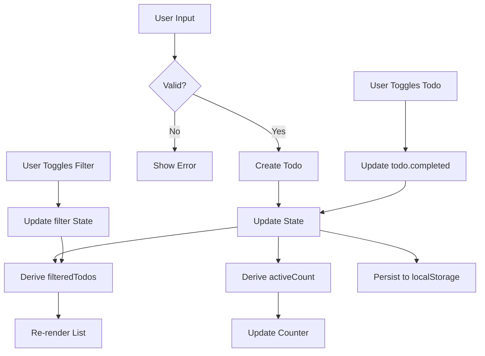

# Repository: https://github.com/aydenstechdungeon/gospa/
# Official website: https://gospa.onrender.com/
# Website's Docs: https://gospa.onrender.com/docs

<!-- FILE: README.md -->
================================================================================

# GoSPA

<div align="center">
  
  
</div>

GoSPA brings Svelte-like reactive primitives (`Runes`, `Effects`, `Derived`) to the Go ecosystem. It is a high-performance framework for building reactive SPAs with Templ, Fiber, file-based routing, and real-time state synchronization.

## Highlights

- **Native Reactivity** - `Rune`, `Derived`, `Effect` primitives that work exactly like Svelte 5.
- **WebSocket Sync** - Transparent client-server state synchronization with GZIP delta patching.
- **File-Based Routing** - SvelteKit-style directory structure for `.templ` files.
- **Hybrid Rendering** - Mix SSR, SSG, ISR, and PPR on a per-page basis.
- **Type-Safe RPC** - Call server functions directly from the client without boilerplate endpoints.
- **High Performance** - Integrated `go-json` and optional MessagePack for minimal overhead.

## Quick Start

### 1. Install CLI
```bash
go install github.com/aydenstechdungeon/gospa/cmd/gospa@latest
```

### 2. Scaffold & Run
```bash
gospa create myapp
cd myapp
go mod tidy
gospa dev
```

### 3. A Simple Page
```templ
// routes/page.templ
package routes

templ Page() {
    <div data-gospa-component="counter" data-gospa-state='{"count":0}'>
        <h1 data-bind="text:count">0</h1>
        <button data-on="click:increment">+</button>
    </div>
}
```

## Comparison

| Feature | GoSPA | HTMX | Alpine | SvelteKit |
| :-- | :--: | :--: | :--: | :--: |
| **Language** | Go | HTML | JS | JS/TS |
| **Runtime** | ~15KB | ~14KB | ~15KB | Varies |
| **Reactivity** | ✅ | ❌ | ✅ | ✅ |
| **WS Sync** | ✅ | ❌ | ❌ | ✅ |
| **File Routing** | ✅ | ❌ | ❌ | ✅ |
| **Type Safety** | ✅ | ❌ | ❌ | ✅ |

## Documentation

Full guides and API reference are available at [gospa.onrender.com](https://gospa.onrender.com/docs) or in the `/docs` directory.

---

[Apache License 2.0](LICENSE)


<!-- FILE: docs/README.md -->
================================================================================

# GoSPA Documentation

This directory contains the complete documentation for GoSPA. The documentation is organized to guide users from their first steps through advanced topics.

## Structure

```
docs/
├── 01-getting-started/     # Installation and first steps
├── 02-core-concepts/       # Essential concepts
├── 03-features/            # Feature guides
├── 04-api-reference/       # API documentation
├── 05-advanced/            # Advanced topics
├── 06-migration/           # Version migration guides
├── 07-troubleshooting/     # Common production and developer issues
└── 08-audits/              # Security and performance audit history
```

## Quick Navigation

### Getting Started
- [Quick Start](01-getting-started/01-quick-start.md) - Installation and first app
- [Tutorial](01-getting-started/02-tutorial.md) - Build a todo app

### Core Concepts
- [Rendering](02-core-concepts/02-rendering.md) - SSR, SPA, and islands
- [State](02-core-concepts/03-state.md) - Reactive state management
- [Components](02-core-concepts/04-components.md) - Component system
- [Islands](02-core-concepts/05-islands.md) - Partial hydration
- [Routing](02-core-concepts/06-routing.md) - Route parameters and navigation

### Features
- [Client Runtime](03-features/01-client-runtime.md) - Runtime variants and selection
- [Runtime API](03-features/02-runtime-api.md) - Client-side API reference
- [Realtime](03-features/03-realtime.md) - SSE and WebSocket
- [Security](03-features/04-security.md) - Security model and CSP
- [Dev Tools](03-features/05-dev-tools.md) - HMR and debugging

### API Reference
- [Core API](04-api-reference/01-core-api.md) - Go API documentation
- [Configuration](04-api-reference/02-configuration.md) - Config options
- [CLI](04-api-reference/03-cli.md) - Command line interface
- [Plugins](04-api-reference/04-plugins.md) - Plugin system

### Advanced
- [Error Handling](05-advanced/01-error-handling.md)
- [State Pruning](05-advanced/02-state-pruning.md)

### Migration
- [v1 to v2](06-migration/01-v1-to-v2.md) - Migrating from v1.x to v2.0

### Troubleshooting
- [Remote Actions](07-troubleshooting/02-remote-actions.md)
- [WebSocket Connections](07-troubleshooting/03-websocket-connections.md)
- [Build & Deployment](07-troubleshooting/07-build-deployment.md)

### Audits
- [2026-03-12 Security & Performance Audit](08-audits/2026-03-12-security-performance-audit.md)

## Website Integration

This documentation structure is designed to be consumed by the GoSPA website. Each folder represents a documentation section, and files are ordered by their numerical prefix.

To render these docs on the website:
1. Read `README.md` for structure
2. Parse each section folder
3. Render markdown files in numerical order
4. Use frontmatter (if present) for metadata


<!-- FILE: docs/01-getting-started/01-quick-start.md -->
================================================================================

# Getting Started with GoSPA

Complete guide to building reactive single-page applications with GoSPA.

## What is GoSPA?

GoSPA is a Go-based SPA framework that brings Svelte-like reactive primitives to server-side rendering. It combines:

- **Go + Templ** for server-side rendering
- **TypeScript Runtime** for client-side reactivity
- **WebSocket Sync** for real-time state synchronization
- **File-based Routing** with automatic code generation

## Prerequisites

- Go 1.21 or later
- Node.js 18+ (for client-side tooling)
- Basic understanding of Go and TypeScript

## Installation

### Install the CLI

```bash
go install github.com/aydenstechdungeon/gospa/cmd/gospa@latest
```

### Create a New Project

```bash
gospa create myapp
cd myapp
go mod tidy
```

### Project Structure

```
myapp/
├── main.go                 # Application entry point
├── gospa.yaml              # Application configuration
├── go.mod                  # Go dependencies
├── routes/                 # Route definitions
│   ├── root_layout.templ   # Root HTML shell (optional)
│   ├── layout.templ        # Root-level layout (optional)
│   ├── page.templ          # Home page
│   └── generated_routes.go # Auto-generated routing
├── components/             # Reusable .templ components (optional)
├── lib/                    # Shared Go code (optional)
├── static/                 # Static assets
└── .gospa/                 # Framework cache
```

#### Layout Files

GoSPA uses two types of layout files with different purposes:

| File | Purpose | Scope |
|------|---------|-------|
| `root_layout.templ` | Outer HTML shell (`<html>`, `<head>`, `<body>`) | Entire application |
| `layout.templ` | Nested layouts for sections | Route segment and children |

**`root_layout.templ`** — Place this at `routes/root_layout.templ` to define the outermost HTML document structure. It must include the GoSPA runtime script and is registered specially via `routing.RegisterRootLayout()`. Only one root layout exists per app.

**`layout.templ`** — Regular layouts that wrap pages. Create these in subdirectories (e.g., `routes/blog/layout.templ`) to wrap all pages in that section. Multiple nested layouts are supported.

**Layout Hierarchy Example:**
```
routes/
├── root_layout.templ     # Wraps entire app
├── layout.templ          # Optional: additional root wrapper
├── page.templ            # Home page
├── about/
│   └── page.templ        # About page (wrapped by root_layout)
└── dashboard/
    ├── layout.templ      # Dashboard sidebar/header
    └── page.templ        # Dashboard home
```

In this example, the dashboard page is wrapped first by `dashboard/layout.templ`, then by `root_layout.templ`.

## Development Workflow

### Start Development Server

```bash
gospa dev
```

This starts:
- Go server with hot reload
- TypeScript generation on file changes
- WebSocket server for state sync

### Build for Production

```bash
gospa build
```

Creates optimized production build.

## Your First Page

### Create a Route

Create `routes/about.templ`:

```go
package routes

templ AboutPage() {
	<div>
		<h1>About</h1>
		<p>This is the about page.</p>
	</div>
}
```

### Add Interactive State

Create `routes/counter.templ`:

```go
package routes

templ CounterPage() {
	<div
		data-gospa-component="counter"
		data-gospa-state='{"count":0}'
	>
		<h1>Counter</h1>
		<p data-bind="count">0</p>
		<button
			onclick="var r=__GOSPA__.getState('counter','count');r&&__GOSPA__.setState('counter','count',r.get()+1)"
		>
			+1
		</button>
	</div>
}
```

## Client-Side Reactivity

### The Runtime

GoSPA includes a TypeScript runtime that provides Svelte-like reactivity:

```typescript
import { Rune, Derived, Effect, StateMap } from '@gospa/runtime'

// Get or create a state instance
const state = __GOSPA__.getState('counter')
if (!state) return

// Get current value
const count = state.get('count')

// Set new value
state.set('count', count + 1)

// Or use the convenience method directly
__GOSPA__.setState('counter', 'count', newValue)
```

### DOM Bindings

The runtime automatically handles DOM bindings using `data-bind`:

```html
<!-- Bind text content -->
<p data-bind="count">0</p>

<!-- Two-way binding with input -->
<input data-bind:value="inputValue" />
```

Event handlers use standard onclick:

```html
<button onclick="...">Click</button>
```

## Routing

### File-Based Routing

Routes are defined by files in the `routes/` directory:

| File | URL | Description |
|------|-----|-------------|
| `page.templ` | `/` | Home page |
| `about.templ` | `/about` | About page |
| `blog/index.templ` | `/blog` | Blog index |
| `blog/[slug].templ` | `/blog/:slug` | Dynamic route |
| `(auth)/login.templ` | `/login` | Grouped route |
| `layout.templ` | N/A | Layout wrapper |

### Layouts

Create `routes/layout.templ` for a root layout:

```go
package routes

templ Layout(content templ.Component) {
	<!DOCTYPE html>
	<html>
		<head>
			<title>My App</title>
			<script src="/static/runtime.js"></script>
		</head>
		<body>
			<nav>
				<a href="/">Home</a>
				<a href="/about">About</a>
			</nav>
			<main>
				@content
			</main>
		</body>
	</html>
}
```

### Dynamic Routes

Create `routes/blog/[slug].templ`:

```go
package routes

templ BlogPost(slug string) {
	<article>
		<h1>Post: { slug }</h1>
	</article>
}
```

Access via `/blog/my-post` - `slug` will be `"my-post"`.

### Route Parameters

Access URL parameters in your templates:

```go
package routes

import "github.com/aydenstechdungeon/gospa/routing"

templ SearchPage(params routing.Params) {
	<div>
		<h1>Search: { params.Get("q") }</h1>
	</div>
}
```

## State Management

### Server-Side State

Use Go's state primitives for server-side state:

```go
package routes

import "github.com/aydenstechdungeon/gospa/state"

templ TodoPage() *state.StateMap {
	sm := state.NewStateMap()
	sm.AddAny("items", []string{})
	sm.AddAny("newItem", "")
	return sm
}
```

### Client-Side State

The client runtime mirrors server primitives:

```typescript
import { Rune, StateMap, batch } from '@gospa/runtime'

// Create state map
const state = new StateMap()
state.add('count', new Rune(0))
state.add('items', new Rune<string[]>([]))

// Batch updates
batch(() => {
  state.get('count')?.set(0)
  state.get('items')?.set([])
})
```

### WebSocket Sync

Enable real-time state sync:

```typescript
import { WSClient, syncedRune } from '@gospa/runtime'

const ws = new WSClient({
  url: 'ws://localhost:3000/ws',
  onConnect: () => console.log('Connected'),
  onDisconnect: () => console.log('Disconnected')
})

// Create synced rune
const count = syncedRune('count', 0, ws)
```

## Events

### Server-Side Events

Define event handlers:

```go
package routes

templ ButtonEvents() map[string]interface{} {
	return map[string]interface{}{
		"click": func(e templ.Event) {
			// Handle click
		},
	}
}
```

### Client-Side Events

The runtime handles events automatically:

```typescript
import { on, delegate, debounce, throttle } from '@gospa/runtime'

// Direct event
const unsub = on(button, 'click', (e) => {
  console.log('Clicked')
})

// Delegated events
delegate(document, 'click', '.btn', (e) => {
  console.log('Button clicked')
})

// Debounced handler
const debouncedClick = debounce((e) => {
  console.log('Debounced')
}, 300)
```

## Transitions

Add animations with the transition system:

```typescript
import { fade, fly, slide, scale, blur } from '@gospa/runtime'

// Apply transition
const element = document.querySelector('.fade-in')
fade(element, { duration: 300, delay: 0 })

// Available transitions
fly(element, { y: 50, duration: 400 })
slide(element, { direction: 'left', duration: 300 })
scale(element, { from: 0.5, duration: 200 })
blur(element, { from: 10, duration: 300 })
```

## Configuration

### Application Config

Create `gospa.yaml`:

```yaml
app:
  name: myapp
  port: 3000

performance:
  compress_state: true
  state_diffing: true

runtime:
  simple: false
  websocket: true
```

### Runtime Selection

Choose between full and minimal runtime:

**Full Runtime** (~17KB):
- DOMPurify sanitization
- Full reactive primitives
- WebSocket client
- Transitions

**Minimal Runtime** (~11KB):
- Basic reactivity
- No sanitization
- No WebSocket
- No transitions

```json
{
  "runtime": {
    "mode": "minimal"
  }
}
```

## CLI Commands

| Command | Description |
|---------|-------------|
| `gospa create <name>` | Create new project |
| `gospa dev` | Start development server |
| `gospa build` | Build for production |
| `gospa generate` | Generate routes and types |
| `gospa add <feature>` | Add plugins (tailwind, postcss, image, validation, seo, auth) |
| `gospa prune` | Remove unused state |
| `gospa clean` | Remove build artifacts |
| `gospa watch` | Build and watch for changes |

## Next Steps

1. **[Configuration Reference](./04-api-reference/02-configuration.md)** - All configuration options
2. **[Client Runtime API](./03-features/02-runtime-api.md)** - Complete TypeScript API
3. **[Core Concepts - State](./02-core-concepts/03-state.md)** - Go reactive primitives
4. **[CLI Reference](./04-api-reference/03-cli.md)** - All CLI commands
5. **[Client Runtime](./03-features/01-client-runtime.md)** - Choose the right runtime

## Common Patterns

### Counter Component

```go
// routes/counter.templ
package routes

templ CounterPage() {
	<div
		data-gospa-component="counter"
		data-gospa-state='{"count":0}'
	>
		<h2>Counter</h2>
		<p>Count: <span data-bind="count">0</span></p>
		<button
			onclick="var r=__GOSPA__.getState('counter','count');r&&__GOSPA__.setState('counter','count',r.get()-1)"
		>
			-
		</button>
		<button
			onclick="var r=__GOSPA__.getState('counter','count');r&&__GOSPA__.setState('counter','count',r.get()+1)"
		>
			+
		</button>
	</div>
}
```

### Todo List

```go
// routes/todos.templ
package routes

templ TodosPage() {
	<div
		data-gospa-component="todos"
		data-gospa-state='{"todos":[],"newTodo":""}'
	>
		<h2>Todos</h2>
		<input
			type="text"
			data-bind:value="newTodo"
			placeholder="Add todo..."
		/>
		<button
			onclick="var s=__GOSPA__.getState('todos');if(!s)return;var v=s.get('newTodo');if(!v)return;var t=s.get('todos')||[];s.set('todos',[...t,{id:Date.now(),text:v,completed:false}]);s.set('newTodo','')"
		>
			Add
		</button>
		<ul data-bind="list:todos">
			<li>{ todo.text }</li>
		</ul>
	</div>
}
```

### Form Handling

```go
// routes/contact.templ
package routes

templ ContactPage() {
	<form
		data-gospa-component="contact-form"
		data-gospa-state='{"name":"","email":"","message":""}'
	>
		<input
			type="text"
			name="name"
			data-bind:value="name"
			required
		/>
		<input
			type="email"
			name="email"
			data-bind:value="email"
			required
		/>
		<textarea
			name="message"
			data-bind:value="message"
		></textarea>
		<button
			type="submit"
			onclick="console.log('Form submitted')"
		>
			Send
		</button>
	</form>
}
```

## Troubleshooting

### Port Already in Use

```bash
# Kill process on port 3000
lsof -i :3000 | grep LISTEN | awk '{print $2}' | xargs kill -9
```

### Types Not Generated

```bash
# Regenerate types
gospa generate
```

### WebSocket Connection Failed

Check that WebSocket is enabled in config:

```json
{
  "runtime": {
    "websocket": true
  }
}
```

### Hot Reload Not Working

Ensure you're running `gospa dev` not `go run main.go`.


<!-- FILE: docs/01-getting-started/02-tutorial.md -->
================================================================================

# Todo App Example - Implementation Plan

## Overview

A comprehensive todo app example demonstrating GoSPA's reactive state management, derived values, and real-time synchronization capabilities. This example showcases intermediate framework features beyond the basic counter demo.

## Architecture

### State Structure

```go
type Todo struct {
    ID        string `json:"id"`
    Text      string `json:"text"`
    Completed bool   `json:"completed"`
    CreatedAt int64  `json:"createdAt"`
}

type TodoState struct {
    Todos      []*Todo `json:"todos"`
    Filter     string  `json:"filter"`     // "all", "active", "completed"
    InputValue string  `json:"inputValue"`
}
```

### Derived Values

| Derived Value | Dependencies | Purpose |
|--------------|--------------|---------|
| `filteredTodos` | `todos`, `filter` | Display list based on filter |
| `activeCount` | `todos` | Count of incomplete items |
| `completedCount` | `todos` | Count of completed items |
| `allCompleted` | `todos` | Boolean for toggle-all state |

### File Structure

```
examples/todo/
├── main.go                    # Entry point
├── go.mod                     # Module definition
├── routes/
│   ├── layout.templ          # Base layout with styles
│   ├── page.templ            # Main todo page
│   └── components.templ      # Reusable components
└── static/
    └── todo.css              # Custom animations
```

## Features

### Core Functionality
- [x] Add todos via input + Enter
- [x] Toggle individual todo completion
- [x] Delete individual todos
- [x] Toggle all todos (complete/uncomplete all)
- [x] Filter by: All / Active / Completed
- [x] Clear all completed todos
- [x] Persistent storage via localStorage

### UI Features
- [x] Empty state illustration
- [x] Strikethrough animation on completion
- [x] Slide-out animation on deletion
- [x] Filter tabs with active indicator
- [x] Items left counter
- [x] Checkbox morphing animations

### Technical Features
- [x] Reactive state with `data-gospa-state`
- [x] Derived values using client-side `Derived`
- [x] Batch updates for toggle-all
- [x] Effect for localStorage persistence
- [x] Keyboard shortcuts (Enter to add, Escape to clear)

> **Note:** GoSPA uses `data-gospa-state` for initial state and `data-bind` for DOM bindings. Event handlers use standard `onclick` attributes with the `__GOSPA__` global API.

## Design System

### Color Palette

```css
--bg-void: #0a0a0f;
--bg-card: rgba(15, 23, 42, 0.6);
--border-glow: rgba(99, 102, 241, 0.3);
--accent-active: #22d3ee;   /* cyan-400 */
--accent-complete: #a78bfa; /* violet-400 */
--text-primary: #f8fafc;    /* slate-50 */
--text-secondary: #94a3b8;  /* slate-400 */
--text-muted: #64748b;      /* slate-500 */
```

### Typography

- Headers: Space Grotesk, 700 weight
- Body: IBM Plex Sans, 400/500 weight
- Todo items: 18px, line-height 1.5

### Spacing Scale

- Card padding: 2rem (32px)
- Todo item height: 64px
- Gap between items: 0.5rem (8px)
- Input padding: 1rem 1.25rem

### Animations

| Animation | Duration | Easing |
|-----------|----------|--------|
| Item enter | 300ms | cubic-bezier(0.4, 0, 0.2, 1) |
| Item exit | 200ms | cubic-bezier(0.4, 0, 1, 1) |
| Checkbox check | 200ms | cubic-bezier(0.34, 1.56, 0.64, 1) |
| Strikethrough | 250ms | ease-out |
| Filter underline | 200ms | ease-in-out |

## Implementation Steps

### Phase 1: Project Setup
1. Create `examples/todo/` directory structure
2. Initialize Go module with `go mod init todo`
3. Create `main.go` with basic GoSPA setup
4. Test server runs on `:3000`

### Phase 2: Layout & Styling
1. Create `layout.templ` with dark theme and glassmorphism
2. Add custom CSS for animations and transitions
3. Import Google Fonts (Space Grotesk, IBM Plex Sans)
4. Ensure responsive design (mobile-first)

### Phase 3: Core Components
1. Create `components.templ` with:
   - `TodoInput` - Input field with add button
   - `TodoItem` - Individual todo row with checkbox and delete
   - `TodoFilters` - Filter tabs (All/Active/Completed)
   - `TodoFooter` - Items left + Clear completed
2. Add `data-gospa-component` attributes for islands

### Phase 4: State Management
1. Define initial state in `page.templ`:
   ```json
   {
     "todos": [],
     "filter": "all",
     "inputValue": ""
   }
   ```
2. Implement state update handlers using `__GOSPA__` global
3. Add helper functions for todo operations

### Phase 5: Derived Values
1. Create client-side `Derived` for `filteredTodos`
2. Create `Derived` for `activeCount` and `completedCount`
3. Bind derived values to DOM using `data-bind`

### Phase 6: Persistence
1. Add `Effect` to sync state with localStorage
2. Load saved todos on component init
3. Handle localStorage errors gracefully

### Phase 7: Polish
1. Add keyboard shortcuts (Enter, Escape)
2. Implement empty state
3. Add loading skeleton (optional)
4. Test all interactions

## Code Patterns

### Adding a Todo

```javascript
// Get the state for this component
const state = __GOSPA__.getState('todo-app');
if (!state) return;

// Get input value
const inputValue = state.get('inputValue');
if (!inputValue || !inputValue.trim()) return;

// Create new todo
const newTodo = {
    id: Date.now().toString(36) + Math.random().toString(36).substr(2),
    text: inputValue.trim(),
    completed: false,
    createdAt: Date.now()
};

// Update todos array
const todos = state.get('todos') || [];
state.set('todos', [...todos, newTodo]);
state.set('inputValue', ''); // Clear input
```

### Setting Initial State

In your Templ template, use `data-gospa-state` to set initial state:

```go
templ TodoPage() {
	<div
		data-gospa-component="todo-app"
		data-gospa-state='{"todos":[],"filter":"all","inputValue":""}'
	>
		<!-- Component content -->
	</div>
}
```

### DOM Bindings

Use `data-bind` for reactive text and `data-bind:value` for two-way input binding:

```html
<!-- Display bound value -->
<span data-bind="count">0</span>

<!-- Two-way input binding -->
<input data-bind:value="inputValue" />
```

### localStorage Persistence

```javascript
// Create effect for persistence
const state = __GOSPA__.getState('todo-app');
if (!state) return;

// Watch for changes and persist
const originalSet = state.set.bind(state);
state.set = function(key, value) {
    originalSet(key, value);
    if (key === 'todos') {
        try {
            localStorage.setItem('gospa-todos', JSON.stringify(value));
        } catch (e) {
            console.warn('Failed to save todos:', e);
        }
    }
};

// Load saved todos on init
try {
    const saved = localStorage.getItem('gospa-todos');
    if (saved) {
        state.set('todos', JSON.parse(saved));
    }
} catch (e) {
    console.warn('Failed to load todos:', e);
}
```

## Testing Checklist

- [ ] Can add todo by typing and pressing Enter
- [ ] Can add todo by clicking add button
- [ ] Empty todos cannot be added
- [ ] Can toggle todo completion
- [ ] Toggle all works with mixed state
- [ ] Can delete individual todos
- [ ] Filter tabs show correct counts
- [ ] Filter changes update displayed list
- [ ] Clear completed removes only completed
- [ ] Items left counter updates correctly
- [ ] Todos persist after page refresh
- [ ] Keyboard navigation works
- [ ] Mobile layout is usable
- [ ] Animations are smooth (60fps)

## Documentation

The example includes:
- Inline code comments explaining patterns
- README.md with setup instructions
- Reference to state primitives documentation

## Mermaid Diagram



## Notes

- Follow the counter example's pattern for consistency
- Use Tailwind CSS v4 via CDN for styling
- Keep JavaScript inline in templates for readability
- Ensure accessibility with proper ARIA attributes
- Comment complex reactive patterns for learning purposes


<!-- FILE: docs/02-core-concepts/02-rendering.md -->
================================================================================

# Rendering Strategies

GoSPA supports four per-page rendering strategies that can be mixed freely across routes. Each strategy controls how and when a page is rendered and how its HTTP `Cache-Control` header is set.

## Strategy Overview

| Strategy | When to Use | Cache-Control |
|----------|-------------|---------------|
| `StrategySSR` | Auth-gated pages, real-time data, per-user content | `no-store` |
| `StrategySSG` | Fully static content: marketing pages, docs, landing pages | `public, max-age=31536000, immutable` |
| `StrategyISR` | Mostly static, acceptable to serve stale for N minutes | `public, s-maxage=<TTL>, stale-while-revalidate=<TTL>` |
| `StrategyPPR` | "App shell" pages with a static outer frame and dynamic inner sections | `no-store` (slots rendered per-request) |

All four strategies share the same rendering pipeline (file-based routing, layout chain, root layout). The strategy only affects **caching and when re-rendering occurs**.

---

## SSR — Server-Side Rendering (default)

Every request triggers a fresh render. This is the default and requires no extra configuration.

```go
// Default — no options needed
routing.RegisterPage("/dashboard", dashboardPage)

// Or explicitly:
routing.RegisterPageWithOptions("/dashboard", dashboardPage, routing.RouteOptions{
    Strategy: routing.StrategySSR,
})
```

**HTTP header:** `Cache-Control: no-store`
**Requires `CacheTemplates`:** No

---

## SSG — Static Site Generation

The page is rendered **once** on first request and cached until `SSGCacheTTL` expires or it is evicted by FIFO policy or server restart. Subsequent requests are served instantly from the in-memory cache.

> **Warning:** If `SSGCacheTTL` is set to `0` (the default), SSG caches forever without expiring, making it susceptible to stale content and memory pressure over time. **For most use-cases, we strongly recommend using ISR (Incremental Static Regeneration) instead**, which provides the exact same performance but allows pages to expire.

```go
routing.RegisterPageWithOptions("/about", aboutPage, routing.RouteOptions{
    Strategy: routing.StrategySSG,
})
```

**Enable the cache** in your app config:

```go
app := gospa.New(gospa.Config{
    CacheTemplates:     true,
    SSGCacheMaxEntries: 500, // FIFO eviction at 500 entries (default for in-memory)
    SSGCacheTTL:        1 * time.Hour, // Optional expiration time for static pages
    // Optional: Configure an external store like Redis to share cache across processes
    Storage: redisstore.NewStore(redisClient),
})
```

**HTTP header:** `Cache-Control: public, max-age=31536000, immutable`
**Requires `CacheTemplates`:** Yes

> **Note:** If `CacheTemplates` is `false`, SSG pages fall back to per-request SSR rendering. No error is raised.

---

## ISR — Incremental Static Regeneration

ISR is an extension of SSG with a **TTL (Time-To-Live)**. On first request the page is rendered and cached. Subsequent requests within the TTL are served from cache. When a request arrives **after** the TTL has expired, the **stale** cached version is returned immediately (zero added latency) and a background goroutine re-renders the page to update the cache. This is known as the **stale-while-revalidate** pattern.

```go
routing.RegisterPageWithOptions("/blog", blogIndexPage, routing.RouteOptions{
    Strategy:        routing.StrategyISR,
    RevalidateAfter: 5 * time.Minute,
})
```

**App config:**
```go
app := gospa.New(gospa.Config{
    CacheTemplates:         true,
    DefaultRevalidateAfter: 10 * time.Minute, // ISR TTL fallback for pages that don't set it
})
```

**HTTP header:** `Cache-Control: public, s-maxage=300, stale-while-revalidate=300`
**Requires `CacheTemplates`:** Yes

### ISR Behaviour Details

| Scenario | Result |
|----------|--------|
| Cache miss (first request) | Render synchronously, store, respond |
| Cache hit, age < TTL | Serve from cache immediately |
| Cache hit, age ≥ TTL | Serve stale cache immediately; background goroutine re-renders and updates cache |
| Multiple simultaneous stale requests | Only **one** background goroutine is launched (deduplicated via `sync.Map`) |

> **Prefork warning:** By default, ISR cache is in-memory and per-process. With `Prefork: true` each child process maintains its own cache. TTL-based revalidation still works correctly per process, but cache entries are not shared between processes. For shared ISR, configure an external `Storage` backend (e.g., Redis).

---

## PPR — Partial Prerendering

PPR renders a **static shell** of the page (header, nav, footer, skeleton layout) once and caches it. Per-request only the **named dynamic slots** (e.g. a user feed, notification list, or live data widget) are re-rendered and merged into the cached shell before responding.

This gives you the performance of SSG for the page frame and SSR freshness for dynamic content sections, without the overhead of re-rendering the entire page tree on every request.

### Step 1 — Register the page with slot names

```go
routing.RegisterPageWithOptions("/dashboard", dashboardPage, routing.RouteOptions{
    Strategy:     routing.StrategyPPR,
    DynamicSlots: []string{"feed", "notifications"},
})

// Register each slot's render function
routing.RegisterSlot("/dashboard", "feed", feedSlot)
routing.RegisterSlot("/dashboard", "notifications", notificationsSlot)
```

### Step 2 — Use `DynamicSlot` in your templ component

```go
// routes/dashboard/page.templ
package dashboard

import "github.com/aydenstechdungeon/gospa/templ"

templ Page(props map[string]interface{}) {
    <div class="dashboard">
        <header>...</header>  // ← rendered into the cached shell
        <nav>...</nav>        // ← rendered into the cached shell

        // This slot is excluded from the shell and re-rendered per-request
        @templ.DynamicSlot("feed", FeedComponent(props))

        // This slot is also per-request
        @templ.DynamicSlot("notifications", NotificationsComponent(props))

        <footer>...</footer>  // ← rendered into the cached shell
    </div>
}
```

During the first request (shell build), `DynamicSlot` emits `<!--gospa-slot:feed-->` and `<!--gospa-slot:notifications-->` into the cached HTML. On each subsequent request, the server renders each slot function and replaces the placeholder comment with the live `<div data-gospa-slot="...">` fragment.

**App config:**
```go
app := gospa.New(gospa.Config{
    CacheTemplates: true,
})
```

**HTTP header:** `Cache-Control: no-store` (slots are per-request)
**Requires `CacheTemplates`:** Yes

### PPR API Reference

```go
// templ package — use in .templ files
templ.DynamicSlot(name string, content templ.Component) templ.Component

// Context helpers (used internally by the framework)
templ.WithPPRShellBuild(ctx context.Context) context.Context
templ.IsPPRShellBuild(ctx context.Context) bool

// routing package — register slot render functions
routing.RegisterSlot(pagePath, slotName string, fn routing.SlotFunc)
routing.GetSlot(pagePath, slotName string) routing.SlotFunc

// SlotFunc signature
type SlotFunc func(props map[string]interface{}) templ.Component
```

---

## Per-Page Strategy Selector

### Option A — Inline `init()` (recommended, works today)

Register strategy directly in your route file's `init()` function:

```go
// routes/blog/page.templ or a companion .go file
func init() {
    routing.RegisterPageWithOptions("/blog", blogPage, routing.RouteOptions{
        Strategy:        routing.StrategyISR,
        RevalidateAfter: 5 * time.Minute,
    })
}
```

### Option B — `page.options.go` convention (used by code generator)

Place a companion file next to your `page.templ`:

```go
// routes/blog/page.options.go
package blog

import (
    "time"
    "github.com/aydenstechdungeon/gospa/routing"
)

var PageOptions = routing.RouteOptions{
    Strategy:        routing.StrategyISR,
    RevalidateAfter: 5 * time.Minute,
}
```

The code generator (`gospa generate`) reads `PageOptions` and emits `RegisterPageWithOptions` in `generated/routes.go`.

---

## Global Strategy Defaults

Set defaults in `gospa.Config` for pages that don't specify their own strategy:

```go
app := gospa.New(gospa.Config{
    CacheTemplates:         true,
    DefaultRenderStrategy:  routing.StrategyISR,  // default for all pages
    DefaultRevalidateAfter: 10 * time.Minute,     // ISR TTL default
    SSGCacheMaxEntries:     1000,                 // shared FIFO limit for SSG+ISR+PPR
})
```

Per-page `RouteOptions` always take precedence over these defaults.

---

## Cache Sizing and Eviction

All three caching strategies (SSG, ISR, PPR shells) share a unified **FIFO eviction** policy controlled by `SSGCacheMaxEntries`:

- Default: `500`
- Set to `-1` for unbounded (not recommended in production)
- SSG and ISR pages share the same pool; PPR shells share the same pool

---

## Interaction with Prefork

In Prefork mode (`Prefork: true`), if no external `Storage` is configured, each child process has its own independent in-memory cache. Cache entries are not shared between processes. ISR TTLs fire independently per process.

To support shared SSG, ISR, and PPR caching across Prefork child processes or horizontally scaled clusters, configure the `Storage` option in `gospa.Config` with a distributed backend such as Redis. This ensures consistent cache hits and dedicates a single background revalidation per route across the entire cluster.

---

## Quick Reference

```go
import (
    "time"
    "github.com/aydenstechdungeon/gospa/routing"
    gospatmpl "github.com/aydenstechdungeon/gospa/templ"
)

// SSR (default)
routing.RegisterPage("/", indexPage)

// SSG
routing.RegisterPageWithOptions("/about", aboutPage, routing.RouteOptions{
    Strategy: routing.StrategySSG,
})

// ISR with 5-minute TTL
routing.RegisterPageWithOptions("/blog", blogPage, routing.RouteOptions{
    Strategy:        routing.StrategyISR,
    RevalidateAfter: 5 * time.Minute,
})

// PPR with two dynamic slots
routing.RegisterPageWithOptions("/dashboard", dashboardPage, routing.RouteOptions{
    Strategy:     routing.StrategyPPR,
    DynamicSlots: []string{"feed", "notifications"},
})
routing.RegisterSlot("/dashboard", "feed",          feedSlot)
routing.RegisterSlot("/dashboard", "notifications", notificationsSlot)
```


<!-- FILE: docs/02-core-concepts/03-state.md -->
================================================================================

# Go State Primitives Reference

Server-side reactive primitives for GoSPA, mirroring Svelte's rune system for server-side state management.

## Overview

The `state` package provides Svelte rune-like reactive primitives for Go. These primitives enable reactive state management on the server side, with automatic change notification and dependency tracking.

```go
import "github.com/aydenstechdungeon/gospa/state"
```

## Core Types

### Rune[T]

The base reactive primitive, similar to Svelte's `$state` rune. Holds a value and notifies subscribers on changes.

#### Constructor

```go
func NewRune[T any](initial T) *Rune[T]
```

Creates a new Rune with the given initial value.

**Example:**
```go
count := state.NewRune(0)
name := state.NewRune("hello")
items := state.NewRune([]string{})
```

#### Methods

##### Get

```go
func (r *Rune[T]) Get() T
```

Returns the current value. Thread-safe for concurrent access.

**Example:**
```go
value := count.Get()
fmt.Println("Current count:", value)
```

##### Set

```go
func (r *Rune[T]) Set(value T)
```

Updates the value and notifies all subscribers. Skips notification if value unchanged. Defers notification in batch mode.

**Example:**
```go
count.Set(42)
name.Set("updated")
```

##### Update

```go
func (r *Rune[T]) Update(fn func(T) T)
```

Applies a function to the current value and sets the result. Useful for updates that depend on current value.

**Example:**
```go
count.Update(func(v int) int {
    return v + 1
})

items.Update(func(v []string) []string {
    return append(v, "new item")
})
```

##### Subscribe

```go
func (r *Rune[T]) Subscribe(fn Subscriber[T]) Unsubscribe
```

Registers a callback invoked on value changes. Returns unsubscribe function.

**Example:**
```go
unsub := count.Subscribe(func(v int) {
    fmt.Println("Count changed to:", v)
})
defer unsub()
```

##### ID

```go
func (r *Rune[T]) ID() string
```

Returns unique identifier for client-side synchronization.

##### MarshalJSON

```go
func (r *Rune[T]) MarshalJSON() ([]byte, error)
```

Implements `json.Marshaler` for serialization to client.

---

### Derived[T]

Computed value that automatically updates when dependencies change. Similar to Svelte's `$derived` rune.

#### Constructor

```go
func NewDerived[T any](compute func() T) *Derived[T]
```

Creates a derived value from a compute function. Called immediately for initial value.

**Example:**
```go
count := state.NewRune(5)
doubled := state.NewDerived(func() int {
    return count.Get() * 2
})
```

#### Methods

##### Get

```go
func (d *Derived[T]) Get() T
```

Returns current computed value. Recomputes if dependencies changed.

##### Subscribe

```go
func (d *Derived[T]) Subscribe(fn Subscriber[T]) Unsubscribe
```

Registers callback for derived value changes.

##### DependOn

```go
func (d *Derived[T]) DependOn(o Observable)
```

Adds an observable as a dependency. When it changes, derived value marked dirty.

**Example:**
```go
count := state.NewRune(5)
doubled := state.NewDerived(func() int {
    return count.Get() * 2
})
doubled.DependOn(count) // Auto-recompute when count changes
```

##### Dispose

```go
func (d *Derived[T]) Dispose()
```

Cleans up all subscriptions to dependencies. Call when no longer needed.

##### ID

```go
func (d *Derived[T]) ID() string
```

Returns unique identifier.

---

### Effect

Reactive side effect that runs when dependencies change. Similar to Svelte's `$effect` rune.

#### Constructor

```go
func NewEffect(fn EffectFn) *Effect
```

Where `EffectFn` is:
```go
type EffectFn func() CleanupFunc
```

Creates effect that runs immediately. Return cleanup function for resource cleanup.

**Example:**
```go
count := state.NewRune(0)
effect := state.NewEffect(func() state.CleanupFunc {
    fmt.Println("Count is:", count.Get())
    return func() {
        fmt.Println("Cleaning up")
    }
})
defer effect.Dispose()
```

#### Methods

##### DependOn

```go
func (e *Effect) DependOn(o Observable)
```

Adds observable as dependency. Effect re-runs when it changes.

**Example:**
```go
effect := state.NewEffect(func() state.CleanupFunc {
    fmt.Println("Count:", count.Get())
    return nil
})
effect.DependOn(count)
```

##### IsActive

```go
func (e *Effect) IsActive() bool
```

Returns whether effect is currently active.

##### Pause

```go
func (e *Effect) Pause()
```

Temporarily stops effect from running.

##### Resume

```go
func (e *Effect) Resume()
```

Reactivates a paused effect. Re-runs if was inactive.

##### Dispose

```go
func (e *Effect) Dispose()
```

Permanently stops effect and cleans up resources.

---

## Convenience Functions

### DerivedFrom

```go
func DerivedFrom[T any](compute func() T, observables ...Observable) *Derived[T]
```

Creates derived value with automatic dependency setup.

**Example:**
```go
count := state.NewRune(5)
doubled := state.DerivedFrom(func() int {
    return count.Get() * 2
}, count)
```

### Derived2

```go
func Derived2[A, B, T any](a *Rune[A], b *Rune[B], combine func(A, B) T) *Derived[T]
```

Creates derived from two runes.

**Example:**
```go
firstName := state.NewRune("John")
lastName := state.NewRune("Doe")
fullName := state.Derived2(firstName, lastName, func(a, b string) string {
    return a + " " + b
})
```

### Derived3

```go
func Derived3[A, B, C, T any](a *Rune[A], b *Rune[B], c *Rune[C], combine func(A, B, C) T) *Derived[T]
```

Creates derived from three runes.

### EffectOn

```go
func EffectOn(fn EffectFn, observables ...Observable) *Effect
```

Creates effect with automatic dependency setup.

**Example:**
```go
effect := state.EffectOn(func() state.CleanupFunc {
    fmt.Println("Count:", count.Get())
    return nil
}, count)
defer effect.Dispose()
```

### Watch

```go
func Watch[T any](r *Rune[T], callback func(T)) Unsubscribe
```

Watches a single rune with callback.

**Example:**
```go
unsub := state.Watch(count, func(v int) {
    fmt.Println("Count changed to:", v)
})
defer unsub()
```

### Watch2

```go
func Watch2[A, B any](a *Rune[A], b *Rune[B], callback func(A, B)) Unsubscribe
```

Watches two runes.

### Watch3

```go
func Watch3[A, B, C any](a *Rune[A], b *Rune[B], c *Rune[C], callback func(A, B, C)) Unsubscribe
```

Watches three runes.

---

## Interfaces

### Observable

Type-erased interface for state primitives. Allows storing mixed-type Runes in single collection.

```go
type Observable interface {
    SubscribeAny(func(any)) Unsubscribe
    GetAny() any
}
```

### Settable

Extends Observable for types that can be updated.

```go
type Settable interface {
    Observable
    SetAny(any) error
}
```

### Serializable

Values that can be serialized to JSON.

```go
type Serializable interface {
    Serialize() ([]byte, error)
}
```

---

## StateMap

Collection of observables for component state management.

### Constructor

```go
func NewStateMap() *StateMap
```

### Methods

#### Add

```go
func (sm *StateMap) Add(name string, obs Observable) *StateMap
```

Adds observable to collection. Returns self for chaining.

**Example:**
```go
stateMap := state.NewStateMap()
stateMap.Add("count", count).Add("name", name)
```

#### AddAny

```go
func (sm *StateMap) AddAny(name string, value interface{}) *StateMap
```

Adds primitive value as rune.

**Example:**
```go
stateMap.AddAny("initialized", true)
stateMap.AddAny("items", []string{"a", "b"})
```

#### Get

```go
func (sm *StateMap) Get(name string) (Observable, bool)
```

Retrieves observable by name.

#### ForEach

```go
func (sm *StateMap) ForEach(fn func(key string, value any))
```

Iterates over all observables.

#### ToMap

```go
func (sm *StateMap) ToMap() map[string]any
```

Returns all state values as plain map.

#### MarshalJSON

```go
func (sm *StateMap) MarshalJSON() ([]byte, error)
```

Serializes state map to JSON.

#### ToJSON

```go
func (sm *StateMap) ToJSON() (string, error)
```

Returns state as JSON string.

### OnChange Callback

```go
stateMap.OnChange = func(key string, value any) {
    fmt.Printf("State changed: %s = %v\n", key, value)
}
```
> **Note for OnChange:** The `OnChange` callback runs as a background goroutine entirely outside the `StateMap` mutex bounds, meaning it is **100% safe** to call `Add()`, `Remove()`, `Set()`, or `Clear()` on the very same `StateMap` without risking a deadlock.

---

## Batch Updates

### Batch

```go
func Batch(fn func())
```

Executes function within a batch context. Server-side batching ensures proper synchronization ordering but does NOT defer notifications (unlike client-side). Notifications are dispatched synchronously for thread safety.

> **Server vs Client Behavior Difference:**
> - **Server (Go)**: `Batch()` executes synchronously with immediate notifications. Used for grouping related updates for atomicity and proper lock ordering.
> - **Client (TypeScript)**: `batch()` defers notifications to the next microtask, coalescing multiple updates into a single DOM render.

**Example:**
```go
state.Batch(func() {
    count.Set(1)
    name.Set("updated")
    // Notifications dispatched immediately for server thread safety
})
```

### BatchResult

```go
func BatchResult[T any](fn func() T) T
```

Batch with return value.

**Example:**
```go
result := state.BatchResult(func() int {
    count.Set(10)
    multiplier.Set(2)
    return count.Get() * multiplier.Get()
})
```

### BatchError

```go
func BatchError(fn func() error) error
```

Batch with error return.

**Example:**
```go
err := state.BatchError(func() error {
    if err := validate(data); err != nil {
        return err
    }
    count.Set(data.Count)
    name.Set(data.Name)
    return nil
})

---

## Auto-Batching (Client-Side)

The client-side state system automatically batches rapid synchronous updates to minimize DOM reflows and improve performance. When multiple state changes occur within the same event loop tick, they are automatically coalesced into a single update.

### How It Works

```javascript
const count = new GoSPA.Rune(0);

// These three updates will be batched into a single DOM update
count.set(1);
count.set(2);
count.set(3);
// DOM only updates once with the final value (3)
```

### When Batching Occurs

Auto-batching triggers for:
- Multiple `set()` calls in the same synchronous block
- Rapid updates within event handlers
- State changes during component initialization

### Disabling Batching

For cases where immediate updates are required, you can flush the batch queue:

```javascript
// Force immediate sync
GoSPA.flushBatch();

// Or use the low-level API for synchronous updates
GoSPA.scheduleUpdate(() => {
    // This runs immediately, bypassing batch
});
```

### Performance Benefits

- **Reduced DOM Reflows**: Multiple state changes result in a single DOM update
- **Better Frame Rates**: Batched updates prevent layout thrashing
- **Server Sync Efficiency**: WebSocket messages are debounced during batch operations

### Comparison: With vs Without Batching

```javascript
// Without batching - 3 DOM updates, 3 WebSocket messages
for (let i = 0; i < 3; i++) {
    count.set(i);
}

// With batching - 1 DOM update, 1 WebSocket message
GoSPA.batch(() => {
    for (let i = 0; i < 3; i++) {
        count.set(i);
    }
});
```

> **Note**: Server-side batching behavior differs from client-side. The Go `Batch()` function provides pass-through semantics for thread safety, while the client-side auto-batching uses microtask-based deferred updates for performance.

---

## Serialization

### SerializeState

```go
func SerializeState(runes map[string]interface{}) ([]byte, error)
```

Serializes multiple runes into JSON object.

**Example:**
```go
data, err := state.SerializeState(map[string]interface{}{
    "count": count,
    "name":  name,
})
```

---

## State Messages

### StateSnapshot

Snapshot of component state at a point in time.

```go
type StateSnapshot struct {
    ComponentID string                 `json:"componentId"`
    State       map[string]interface{} `json:"state"`
    Timestamp   int64                  `json:"timestamp"`
}
```

#### Constructor

```go
func NewSnapshot(componentID string, state map[string]interface{}) *StateSnapshot
```

### StateDiff

Represents a change in state.

```go
type StateDiff struct {
    ComponentID string      `json:"componentId"`
    Key         string      `json:"key"`
    OldValue    interface{} `json:"oldValue,omitempty"`
    NewValue    interface{} `json:"newValue"`
    Timestamp   int64       `json:"timestamp"`
}
```

#### Constructor

```go
func NewStateDiff(componentID, key string, oldValue, newValue interface{}) *StateDiff
```

### StateMessage

Message sent between server and client.

```go
type StateMessage struct {
    Type        string      `json:"type"` // "init", "update", "sync", "error"
    ComponentID string      `json:"componentId,omitempty"`
    Key         string      `json:"key,omitempty"`
    Value       interface{} `json:"value,omitempty"`
    State       interface{} `json:"state,omitempty"`
    Error       string      `json:"error,omitempty"`
    Timestamp   int64       `json:"timestamp"`
}
```

#### Message Constructors

```go
func NewInitMessage(componentID string, state interface{}) *StateMessage
func NewUpdateMessage(componentID, key string, value interface{}) *StateMessage
func NewSyncMessage(componentID string, state interface{}) *StateMessage
func NewErrorMessage(componentID, errMsg string) *StateMessage
```

#### ParseMessage

```go
func ParseMessage(data []byte) (*StateMessage, error)
```

Parses JSON message.

### Sync Limitations

When using WebSocket state synchronization between client and server, keep the following limitations in mind:
- **Max Message Size:** The default WebSocket message limit is `64KB`, but you can change it with `WSMaxMessageSize` in `gospa.Config`. Payload states larger than the configured limit will cause the WebSocket connection to close with an error. Use `StateDiffing` in `gospa.Config` to mitigate this for large objects.
- **Circular References:** The built-in state JSON serialization does **not** support circular references in your structs/maps. Attempting to sync circular state will result in serialization failures.

---

## Validation

### StateValidator

Validates state values.

```go
validator := state.NewStateValidator()
validator.AddValidator("age", func(v interface{}) error {
    if age, ok := v.(int); !ok || age < 0 {
        return fmt.Errorf("invalid age")
    }
    return nil
})

err := validator.Validate("age", 25)
err := validator.ValidateAll(map[string]interface{}{
    "age": 25,
    "name": "John",
})
```

---

## Type Definitions

### Unsubscribe

```go
type Unsubscribe func()
```

Function returned by Subscribe to remove subscription.

### Subscriber

```go
type Subscriber[T any] func(T)
```

Callback function that receives value updates.

### CleanupFunc

```go
type CleanupFunc func()
```

Returned by effects for cleanup.

### Validator

```go
type Validator func(interface{}) error
```

Validates a state value.

---

## Thread Safety

All primitives are thread-safe:
- `Rune[T]` uses `sync.RWMutex` for concurrent access
- `Derived[T]` uses `sync.RWMutex` for concurrent access
- `Effect` uses `sync.RWMutex` and `sync.Mutex` for safe execution
- `StateMap` uses `sync.RWMutex` for concurrent access

---

## Complete Example

```go
package main

import (
    "fmt"
    "github.com/aydenstechdungeon/gospa/state"
)

func main() {
    // Create reactive state
    count := state.NewRune(0)
    name := state.NewRune("World")

    // Create derived value
    greeting := state.DerivedFrom(func() string {
        return fmt.Sprintf("Hello, %s! Count: %d", name.Get(), count.Get())
    }, count, name)

    // Watch for changes
    unsubGreeting := greeting.Subscribe(func(v string) {
        fmt.Println("Greeting:", v)
    })
    defer unsubGreeting()

    // Effect with cleanup
    effect := state.EffectOn(func() state.CleanupFunc {
        fmt.Printf("Effect: count=%d, name=%s\n", count.Get(), name.Get())
        return func() {
            fmt.Println("Effect cleanup")
        }
    }, count, name)
    defer effect.Dispose()

    // State map for component
    stateMap := state.NewStateMap()
    stateMap.Add("count", count)
    stateMap.Add("name", name)
    stateMap.OnChange = func(key string, value any) {
        fmt.Printf("State changed: %s = %v\n", key, value)
    }

    // Update state
    count.Set(1)
    name.Set("GoSPA")
    count.Update(func(v int) int { return v + 1 })

    // Serialize state
    json, _ := stateMap.ToJSON()
    fmt.Println("State JSON:", json)
}
```

---

## Comparison with Client-Side Primitives

| Feature | Go Server | TypeScript Client |
|---------|-----------|-------------------|
| Basic State | `Rune[T]` | `Rune<T>` |
| Computed | `Derived[T]` | `Derived<T>` |
| Side Effects | `Effect` | `Effect` |
| Batch Updates | `Batch()` | `batch()` |
| State Collection | `StateMap` | `StateMap` |
| Async Resources | Manual | `Resource<T>` |
| Raw State | N/A | `RuneRaw<T>` |
| Pre-Effects | N/A | `PreEffect` |

The Go implementation focuses on server-side concerns:
- Thread safety for concurrent requests
- JSON serialization for client sync
- No async primitives (use goroutines directly)
- No DOM-related features


<!-- FILE: docs/02-core-concepts/04-components.md -->
================================================================================

# GoSPA Component System

The component system provides a structured way to build reusable, composable UI components with lifecycle management, props validation, and state handling.

## Overview

GoSPA components are built using the `component` package which provides:

- **BaseComponent**: Foundation for all components
- **ComponentTree**: Hierarchical component management
- **Lifecycle**: Component lifecycle hooks
- **Props**: Type-safe property handling with validation

---

## BaseComponent

The `BaseComponent` is the foundation for all GoSPA components.

### Creating a Component

```go
import "github.com/gospa/gospa/component"

// Create a basic component
comp := component.NewBaseComponent("my-component")

// Create with options
comp := component.NewBaseComponent("my-component",
    component.WithProps(component.Props{
        "title": "Hello",
        "count": 0,
    }),
    component.WithState(stateMap),
    component.WithChildren(childComponent),
)
```

### Methods

| Method | Signature | Description |
|--------|-----------|-------------|
| `ID()` | `string` | Returns unique component identifier |
| `Name()` | `string` | Returns component name |
| `State()` | `*state.StateMap` | Returns component state |
| `Props()` | `Props` | Returns component props |
| `Children()` | `[]Component` | Returns child components |
| `Parent()` | `Component` | Returns parent component |
| `AddChild()` | `AddChild(child Component)` | Adds a child component |
| `RemoveChild()` | `RemoveChild(child Component)` | Removes a child component |
| `GetSlot()` | `GetSlot(name string) templ.Component` | Gets a named slot |
| `SetSlot()` | `SetSlot(name string, comp templ.Component)` | Sets a named slot |
| `Context()` | `context.Context` | Returns component context |
| `SetContext()` | `SetContext(ctx context.Context)` | Sets component context |
| `ToJSON()` | `([]byte, error)` | Serializes component to JSON |
| `Clone()` | `Component` | Creates a deep copy |

### Component Options

```go
// Props option
component.WithProps(component.Props{
    "title": "My Title",
    "visible": true,
})

// State option
component.WithState(stateMap)

// Children option
component.WithChildren(child1, child2, child3)

// Parent option
component.WithParent(parentComponent)

// Context option
component.WithContext(context.Background())

// Slots option
component.WithSlots(map[string]templ.Component{
    "header": headerComponent,
    "footer": footerComponent,
})
```

---

## Component Interface

```go
type Component interface {
    ID() string
    Name() string
    State() *state.StateMap
    Props() Props
    Children() []Component
    Parent() Component
    AddChild(child Component)
    RemoveChild(child Component)
    GetSlot(name string) templ.Component
    SetSlot(name string, comp templ.Component)
    Context() context.Context
    SetContext(ctx context.Context)
    ToJSON() ([]byte, error)
    Clone() Component
}
```

---

## ComponentTree

Manages hierarchical component relationships.

### Creating a Tree

```go
// Create with root component
tree := component.NewComponentTree(rootComponent)

// Get root
root := tree.Root()

// Get component by ID
comp := tree.Get("component-id")

// Add component to tree
tree.Add(parent, child)

// Remove component from tree
tree.Remove(component)
```

### Tree Methods

| Method | Signature | Description |
|--------|-----------|-------------|
| `Root()` | `Component` | Returns root component |
| `Get()` | `Get(id string) Component` | Get component by ID |
| `Add()` | `Add(parent, child Component)` | Add child to parent |
| `Remove()` | `Remove(component Component)` | Remove from tree |
| `OnMount()` | `OnMount(fn func(Component))` | Register mount callback |
| `OnUpdate()` | `OnUpdate(fn func(Component))` | Register update callback |
| `OnDestroy()` | `OnDestroy(fn func(Component))` | Register destroy callback |
| `Mount()` | `Mount()` | Trigger mount lifecycle |
| `Update()` | `Update()` | Trigger update lifecycle |
| `Walk()` | `Walk(fn func(Component) bool)` | Walk tree depth-first |
| `Find()` | `Find(fn func(Component) bool) Component` | Find first matching |
| `FindAll()` | `FindAll(fn func(Component) bool) []Component` | Find all matching |
| `FindByName()` | `FindByName(name string) Component` | Find by component name |
| `FindByProp()` | `FindByProp(key string, value any) Component` | Find by prop value |

### Walking the Tree

```go
// Walk all components
tree.Walk(func(comp Component) bool {
    fmt.Println("Component:", comp.Name())
    return true // continue walking
})

// Find specific component
found := tree.Find(func(comp Component) bool {
    return comp.Name() == "target-component"
})

// Find all matching
all := tree.FindAll(func(comp Component) bool {
    props := comp.Props()
    return props.GetBool("active")
})
```

---

## Lifecycle

The `Lifecycle` type manages component lifecycle phases and hooks.

### Lifecycle Phases

```go
const (
    PhaseCreated   LifecyclePhase = iota // Component created
    PhaseMounting                        // Component mounting
    PhaseMounted                         // Component mounted
    PhaseUpdating                        // Component updating
    PhaseUpdated                         // Component updated
    PhaseDestroying                      // Component destroying
    PhaseDestroyed                       // Component destroyed
)
```

### Creating a Lifecycle

```go
lc := component.NewLifecycle()

// Check current phase
phase := lc.Phase()

// Check if mounted
if lc.IsMounted() {
    // Component is mounted
}
```

### Registering Hooks

```go
// Before mount
lc.OnBeforeMount(func() {
    fmt.Println("About to mount")
})

// On mount
lc.OnMount(func() {
    fmt.Println("Mounted")
})

// Before update
lc.OnBeforeUpdate(func() {
    fmt.Println("About to update")
})

// On update
lc.OnUpdate(func() {
    fmt.Println("Updated")
})

// Before destroy
lc.OnBeforeDestroy(func() {
    fmt.Println("About to destroy")
})

// On destroy
lc.OnDestroy(func() {
    fmt.Println("Destroyed")
})

// Cleanup (runs after destroy)
lc.OnCleanup(func() {
    fmt.Println("Cleanup")
})
```

### Triggering Lifecycle Events

```go
// Trigger mount
lc.Mount()

// Trigger update
lc.Update()

// Trigger destroy
lc.Destroy()

// Clear all hooks
lc.ClearHooks()
```

### Lifecycle-Aware Components

```go
type LifecycleAware interface {
    OnBeforeMount()
    OnMount()
    OnBeforeUpdate()
    OnUpdate()
    OnBeforeDestroy()
    OnDestroy()
}
```

### Helper Functions

```go
// Mount a component with lifecycle
err := component.MountComponent(comp)

// Update a component with lifecycle
err := component.UpdateComponent(comp)

// Destroy a component with lifecycle
err := component.DestroyComponent(comp)
```

---

## Props

Type-safe property handling with validation.

### Basic Usage

```go
// Create props
props := component.Props{
    "title": "Hello",
    "count": 42,
    "active": true,
}

// Get values
title := props.Get("title")           // any
titleStr := props.GetString("title")  // string
count := props.GetInt("count")        // int
count64 := props.GetInt64("count")    // int64
price := props.GetFloat64("price")    // float64
active := props.GetBool("active")     // bool
items := props.GetSlice("items")      // []any
config := props.GetMap("config")      // map[string]any

// Get with default
title := props.GetDefault("title", "Default Title")

// Set value
props.Set("newKey", "newValue")

// Check existence
if props.Has("title") {
    // Key exists
}

// Delete key
props.Delete("oldKey")

// Get all keys
keys := props.Keys()

// Get all values
values := props.Values()

// Clone props
cloned := props.Clone()

// Merge props
props.Merge(otherProps)

// JSON serialization
json, err := props.ToJSON()

// Compare props
if props.Equals(otherProps) {
    // Props are equal
}
```

### Props Methods

| Method | Signature | Description |
|--------|-----------|-------------|
| `Get()` | `Get(key string) any` | Get prop value |
| `Set()` | `Set(key string, value any)` | Set prop value |
| `GetDefault()` | `GetDefault(key string, def any) any` | Get with default |
| `GetString()` | `GetString(key string) string` | Get as string |
| `GetInt()` | `GetInt(key string) int` | Get as int |
| `GetInt64()` | `GetInt(key string) int64` | Get as int64 |
| `GetFloat64()` | `GetFloat64(key string) float64` | Get as float64 |
| `GetBool()` | `GetBool(key string) bool` | Get as bool |
| `GetSlice()` | `GetSlice(key string) []any` | Get as slice |
| `GetMap()` | `GetMap(key string) map[string]any` | Get as map |
| `Has()` | `Has(key string) bool` | Check if exists |
| `Delete()` | `Delete(key string)` | Delete prop |
| `Keys()` | `Keys() []string` | Get all keys |
| `Values()` | `Values() []any` | Get all values |
| `Clone()` | `Clone() Props` | Clone props |
| `Merge()` | `Merge(other Props)` | Merge props |
| `ToJSON()` | `ToJSON() ([]byte, error)` | JSON serialization |
| `Equals()` | `Equals(other Props) bool` | Compare props |

---

## PropSchema

Define and validate prop schemas.

### Creating a Schema

```go
schema := component.NewPropSchema()

// Define props
schema.Define("title", reflect.String).
       Define("count", reflect.Int).
       Define("active", reflect.Bool)

// Define with validator
schema.DefineWithValidator("email", func(value any) error {
    str, ok := value.(string)
    if !ok {
        return errors.New("email must be string")
    }
    if !strings.Contains(str, "@") {
        return errors.New("invalid email format")
    }
    return nil
})
```

### PropDefinition

```go
type PropDefinition struct {
    Name         string            // Prop name
    Type         reflect.Kind      // Expected type
    DefaultValue any               // Default value
    Required     bool              // Is required
    Validator    func(any) error   // Custom validator
}
```

### Validation

```go
// Validate props
err := schema.Validate(props)

// Apply defaults
propsWithDefaults := schema.ApplyDefaults(props)

// Validate and apply
validated, err := schema.ValidateAndApply(props)

// Get definition
def := schema.GetDefinition("title")

// Get all definitions
defs := schema.Definitions()
```

---

## BindableProp

Two-way bindable properties.

### Creating Bindable Props

```go
// Create bindable prop
bp := component.NewBindableProp("count", 0)

// Get value
value := bp.Get()

// Set value
bp.Set(42)

// Get name
name := bp.Name()

// On change callback
bp.OnChange(func(newValue any) {
    fmt.Println("Value changed to:", newValue)
})

// Set validator
bp.SetValidator(func(value any) error {
    if value.(int) < 0 {
        return errors.New("count cannot be negative")
    }
    return nil
})

// Two-way bind to another prop
bp.Bind(otherBindableProp)
```

### BindableProps Collection

```go
// Create collection
bps := component.NewBindableProps()

// Add bindable
bps.Add(component.NewBindableProp("count", 0))

// Get bindable
bp := bps.Get("count")

// Remove bindable
bps.Remove("count")

// Get all names
names := bps.Names()

// Convert to Props
props := bps.ToProps()
```

---

## Complete Example

```go
package main

import (
    "context"
    "fmt"

    "github.com/gospa/gospa/component"
    "github.com/gospa/gospa/state"
)

// Custom component
type ButtonComponent struct {
    *component.BaseComponent
    lifecycle *component.Lifecycle
}

func NewButtonComponent(text string, onClick func()) *ButtonComponent {
    btn := &ButtonComponent{
        BaseComponent: component.NewBaseComponent("button",
            component.WithProps(component.Props{
                "text":    text,
                "onClick": onClick,
            }),
        ),
        lifecycle: component.NewLifecycle(),
    }

    // Setup lifecycle hooks
    btn.lifecycle.OnMount(func() {
        fmt.Println("Button mounted")
    })

    btn.lifecycle.OnDestroy(func() {
        fmt.Println("Button destroyed")
    })

    return btn
}

func main() {
    // Create state
    sm := state.NewStateMap()
    sm.Add("counter", state.NewRune(0))

    // Create component tree
    root := component.NewBaseComponent("app",
        component.WithState(sm),
    )

    tree := component.NewComponentTree(root)

    // Add child components
    button := NewButtonComponent("Click Me", func() {
        counter := sm.Get("counter").(*state.Rune[int])
        counter.Set(counter.Get() + 1)
    })

    tree.Add(root, button)

    // Mount tree
    tree.Mount()

    // Walk tree
    tree.Walk(func(comp component.Component) bool {
        fmt.Printf("Component: %s (ID: %s)\n", comp.Name(), comp.ID())
        return true
    })

    // Cleanup
    tree.Destroy()
}
```


<!-- FILE: docs/02-core-concepts/05-islands.md -->
================================================================================

# Island Hydration & Streaming SSR

GoSPA implements a partial hydration (Islands Architecture) system, allowing you to ship static HTML by default and selectively hydrate interactive components based on viewport visibility, idle time, or user interaction.

---

## Islands Architecture

An **island** is an interactive component that is loaded and hydrated on the client. The server renders the HTML placeholder; the client loads the JavaScript module and calls its `hydrate` or `mount` function.

### DOM Attributes

Mark an element as an island using `data-gospa-island`:

```html
<div
  data-gospa-island="Counter"
  data-gospa-mode="visible"
  data-gospa-priority="high"
  data-gospa-props='{"initial": 10}'
  data-gospa-state='{"count": 0}'
  data-gospa-threshold="200"
  id="my-counter"
>
  <!-- Server-rendered placeholder content here -->
  <p>Loading...</p>
</div>
```

| Attribute | Type | Description |
|-----------|------|-------------|
| `data-gospa-island` | string | **Required.** Island name — maps to `/islands/{name}.js` |
| `data-gospa-mode` | string | Hydration mode (see below, default: `immediate`) |
| `data-gospa-priority` | string | Queue priority: `high`, `normal`, `low` (default: `normal`) |
| `data-gospa-props` | JSON | Props passed to `hydrate(element, props, state)` |
| `data-gospa-state` | JSON | State passed to `hydrate(element, props, state)` |
| `data-gospa-threshold` | number | Intersection margin in px for `visible` mode (default: 200) |
| `data-gospa-defer` | number | ms delay for `idle` mode (default: 2000) |
| `data-gospa-client-only` | boolean | Skip server rendering entirely |
| `data-gospa-server-only` | boolean | Never hydrate — render only |

### Hydration Modes

| Mode | Description |
|------|-------------|
| `immediate` | (Default) Hydrate when the island is discovered |
| `visible` | Hydrate when the element enters the viewport (uses `IntersectionObserver`) |
| `idle` | Hydrate when the browser is idle (uses `requestIdleCallback`, falls back to `setTimeout`) |
| `interaction` | Hydrate on first user event: `mouseenter`, `touchstart`, `focusin`, or `click` |
| `lazy` | Never auto-hydrate — call `hydrateIsland(id)` manually |

### Priority Queue

When multiple islands are scheduled for `immediate` hydration, they are processed in priority order:

| Priority | Use Case |
|----------|----------|
| `high` | Navigation, purchase buttons, search — hydrate first |
| `normal` | (Default) General interactive components |
| `low` | Below-the-fold, non-essential widgets |

---

## Island Module Convention

Island modules must be ES modules served at `/islands/{name}.js` (configurable via `moduleBasePath`).

```typescript
// /islands/Counter.ts
export default {
    hydrate(element: Element, props: Record<string, unknown>, state: Record<string, unknown>) {
        const btn = element.querySelector('button')!;
        let count = (state.count as number) ?? (props.initial as number) ?? 0;

        const render = () => btn.textContent = `Count: ${count}`;
        render();
        btn.addEventListener('click', () => { count++; render(); });
    }
}
```

Both `hydrate` and `mount` are accepted (either on the default export or as named exports). `hydrate` takes precedence.

---

## Client API

### `initIslands(config?) → IslandManager`

Initializes the global island manager. Auto-discovers all `[data-gospa-island]` elements in the DOM.

```typescript
import { initIslands } from './island.ts';

const manager = initIslands({
    moduleBasePath: '/islands',   // Where to load island JS from
    defaultTimeout: 30000,        // ms until hydration times out
    debug: true,                  // Enable console logging
    // Custom loader for bundlers that handle imports differently:
    moduleLoader: async (name) => import(`./islands/${name}`),
});
```

### `getIslandManager() → IslandManager | null`

Returns the global island manager.

### `hydrateIsland(idOrName) → Promise<IslandHydrationResult | null>`

Manually triggers hydration for a specific island (by DOM `id` or island name):

```typescript
import { hydrateIsland } from './island.ts';

// Hydrate the lazy island when user clicks "Show chart"
document.getElementById('show-chart')?.addEventListener('click', async () => {
    const result = await hydrateIsland('Chart');
    if (!result?.success) console.error('Chart hydration failed:', result?.error);
});
```

### `IslandManager` Methods

```typescript
manager.discoverIslands()               // Scan DOM for new islands
manager.hydrateIsland(data)             // Hydrate a specific island data object
manager.hydrate(idOrName)               // Hydrate by id or name string
manager.isHydrated(id)                  // Check if an island is already hydrated
manager.getIslands()                    // All discovered islands
manager.getIsland(id)                   // Get island data by id
manager.destroy()                       // Clean up observers and listeners
```

### Browser Globals

```js
// Available at runtime when island.ts is loaded
window.__GOSPA_ISLAND_MANAGER__.init(config?)   // == initIslands
window.__GOSPA_ISLAND_MANAGER__.get()           // == getIslandManager
window.__GOSPA_ISLAND_MANAGER__.hydrate(name)   // == hydrateIsland
```

### Events

```typescript
// Fired on the island element when hydration completes
element.addEventListener('gospa:hydrated', (ev: CustomEvent) => {
    console.log('hydrated:', ev.detail.island); // IslandElementData
});
```

---

## Streaming SSR

GoSPA's `StreamingManager` handles progressive hydration from server-streamed HTML chunks. It is usually initialized automatically; each chunk type triggers a different action:

| Chunk Type | Action |
|------------|--------|
| `html` | Updates a specific DOM element by `id` with new innerHTML |
| `island` | Registers and schedules the island for hydration per its mode |
| `script` | Dynamically injects and executes a `<script>` tag |
| `state` | Merges the payload into the global `__GOSPA_STATE__` |
| `error` | Logs a server-side rendering error to the console |

### Manual Setup

```typescript
import { initStreaming } from './streaming.ts';

const streamer = initStreaming({
    hydrationTimeout: 5000,  // ms before island hydration times out
    enableLogging: true,
});

// Manually hydrate an island that arrived via streaming
await streamer.hydrate('IslandId');

// Check hydration status
console.log(streamer.getHydratedIslands()); // Set<string>
console.log(streamer.isHydrated('IslandId')); // boolean
```

---

## Auto-Initialize

If a `<script data-gospa-islands>` tag is present, `initIslands()` is called automatically when the DOM is ready. Otherwise, call it manually before the page finishes loading.

---

## Notes

- Islands do **not** require a framework. They can be Svelte, Preact, Vanilla JS, or any library that runs in a browser `<script type="module">`.
- Islands discovered after `initIslands()` (e.g. via SPA navigation) can be re-scanned with `manager.discoverIslands()`.
- Setting `data-gospa-server-only="true"` skips hydration entirely — useful for purely decorative server-rendered components.


<!-- FILE: docs/02-core-concepts/06-routing.md -->
================================================================================

# GoSPA Routing & Parameters

GoSPA provides a comprehensive file-based routing system with special file conventions, alongside robust route parameter handling for extracting, validating, and building URLs with path and query parameters.

## Special Routing Files

GoSPA uses special filenames within the `routes/` directory to construct the application layout, middleware chain, error boundaries, and loading states automatically.

| Filename | Purpose | Scope |
|----------|---------|-------|
| `page.templ` | Renders the primary component for a route directory. | Current route |
| `layout.templ` | Wraps all nested child pages inside a particular directory segment. | Segment and children |
| `root_layout.templ` | The outermost HTML wrapper (`<html>`, `<body>`). Must include the GoSPA scripts. | Global (root only) |
| `_middleware.go` | Segment-scoped middleware intercepting requests before they hit pages. | Segment and children |
| `_error.templ` | Error boundary. If a page panics or returns an error during SSR, it falls back to this. | Segment and children |
| `_loading.templ` | Automatically compiled as the default static shell during PPR (Partial Page Rendering) if no dynamic slots are provided. | Segment and children |

### Middleware Files (`_middleware.go`)

Middleware files automatically apply their `Handler` to all routes in their directory and subdirectories. They are executed in a top-down hierarchy.

```go
// routes/admin/_middleware.go
package admin

import (
    "github.com/aydenstechdungeon/gospa/routing"
    "github.com/gofiber/fiber/v3"
)

func init() {
    routing.RegisterMiddleware("/admin", func(c fiber.Ctx) error {
        if !isAdmin(c) {
            return c.Redirect().Status(302).To("/login")
        }
        return c.Next()
    })
}
```

### Error Boundaries (`_error.templ`)

Error boundaries catch rendering errors and panics that occur during the SSR phase. They receive the error message, HTTP status code, and current path.

```templ
// routes/admin/_error.templ
package admin

templ Error(props map[string]any) {
    <div class="error-boundary">
        <h2>Something went wrong in the admin panel!</h2>
        <p>Error: { props["error"].(string) }</p>
        <p>Code: { fmt.Sprint(props["code"]) }</p>
    </div>
}
```

### Loading Shells (`_loading.templ`)

When using Partial Page Rendering (`routing.StrategyPPR`), the `_loading.templ` template serves as the initial HTML shell sent to the client while the dynamic content generates in the background.

```templ
// routes/dashboard/_loading.templ
package dashboard

templ Loading(props map[string]any) {
    <div class="skeleton-loader">
        <div class="skeleton-header"></div>
        <div class="skeleton-content"></div>
    </div>
}
```

---

## Route Parameters

The parameter system in `routing/params.go` provides:

- **Params**: Type-safe parameter map with conversion methods
- **QueryParams**: Query string parameter handling
- **ParamExtractor**: Route matching and parameter extraction
- **PathBuilder**: URL path construction with parameters

---

## Params

The `Params` type is a map for storing route parameters with type-safe accessors.

### Basic Usage

```go
import "github.com/aydenstechdungeon/gospa/routing"

// Create params
params := routing.Params{
    "id":    "123",
    "name":  "john",
    "admin": "true",
}

// Get value
id := params.Get("id")  // "123"

// Get with default
name := params.GetDefault("nickname", "anonymous")  // "anonymous" if not found

// Check existence
if params.Has("id") {
    // Parameter exists
}

// Set value
params.Set("email", "john@example.com")

// Delete value
params.Delete("temp")

// Clone
cloned := params.Clone()

// Merge
otherParams := routing.Params{"role": "admin"}
params.Merge(otherParams)
```

### Type Conversion Methods

```go
// String
name := params.GetString("name")  // string

// Integer
id := params.GetInt("id")         // int
id64 := params.GetInt64("id")     // int64

// Float
price := params.GetFloat64("price")  // float64

// Boolean
admin := params.GetBool("admin")  // bool

// Slice (comma-separated)
tags := params.GetSlice("tags")   // []any

// JSON
json, err := params.ToJSON()      // []byte
```

### All Methods

| Method | Signature | Description |
|--------|-----------|-------------|
| `Get()` | `Get(key string) any` | Get parameter value |
| `GetDefault()` | `GetDefault(key string, def any) any` | Get with default |
| `GetString()` | `GetString(key string) string` | Get as string |
| `GetInt()` | `GetInt(key string) int` | Get as int |
| `GetInt64()` | `GetInt64(key string) int64` | Get as int64 |
| `GetFloat64()` | `GetFloat64(key string) float64` | Get as float64 |
| `GetBool()` | `GetBool(key string) bool` | Get as bool |
| `GetSlice()` | `GetSlice(key string) []any` | Get as slice |
| `Has()` | `Has(key string) bool` | Check if exists |
| `Set()` | `Set(key string, value any)` | Set parameter |
| `Delete()` | `Delete(key string)` | Delete parameter |
| `Clone()` | `Clone() Params` | Clone params |
| `Merge()` | `Merge(other Params)` | Merge params |
| `ToJSON()` | `ToJSON() ([]byte, error)` | Serialize to JSON |
| `Keys()` | `Keys() []string` | Get all keys |
| `Values()` | `Values() []any` | Get all values |

---

## QueryParams

Handle URL query string parameters.

### Creating QueryParams

```go
// From URL
url, _ := url.Parse("https://example.com/search?q=gospa&page=2")
queryParams := routing.NewQueryParams(url.Query())

// From map
queryParams := routing.NewQueryParamsFromMap(map[string][]string{
    "q":    {"gospa"},
    "page": {"2"},
})

// Empty
queryParams := routing.NewQueryParamsEmpty()
```

### Methods

```go
// Get first value
q := queryParams.Get("q")  // "gospa"

// Get all values (for multi-value params)
tags := queryParams.GetAll("tags")  // []string

// Get with default
page := queryParams.GetDefault("page", "1")  // "2" or "1" if not found

// Type conversions
page := queryParams.GetInt("page")        // int
price := queryParams.GetFloat64("price")  // float64
active := queryParams.GetBool("active")   // bool

// Check existence
if queryParams.Has("q") {
    // Query param exists
}

// Set value
queryParams.Set("sort", "desc")

// Add value (for multi-value params)
queryParams.Add("filter", "active")
queryParams.Add("filter", "pending")  // filter=active&filter=pending

// Delete
queryParams.Del("temp")

// Encode to string
encoded := queryParams.Encode()  // "q=gospa&page=2"

// Clone
cloned := queryParams.Clone()

// To URL values
values := queryParams.Values()  // url.Values
```

### QueryParams Methods Table

| Method | Signature | Description |
|--------|-----------|-------------|
| `Get()` | `Get(key string) string` | Get first value |
| `GetAll()` | `GetAll(key string) []string` | Get all values |
| `GetDefault()` | `GetDefault(key, def string) string` | Get with default |
| `GetInt()` | `GetInt(key string) int` | Get as int |
| `GetInt64()` | `GetInt64(key string) int64` | Get as int64 |
| `GetFloat64()` | `GetFloat64(key string) float64` | Get as float64 |
| `GetBool()` | `GetBool(key string) bool` | Get as bool |
| `Has()` | `Has(key string) bool` | Check if exists |
| `Set()` | `Set(key, value string)` | Set value |
| `Add()` | `Add(key, value string)` | Add value |
| `Del()` | `Del(key string)` | Delete key |
| `Encode()` | `Encode() string` | Encode to string |
| `Clone()` | `Clone() QueryParams` | Clone params |
| `Values()` | `Values() url.Values` | Get as url.Values |

---

## ParamExtractor

Extract parameters from routes during matching.

### Creating an Extractor

```go
// Create an extractor for a specific pattern
extractor := routing.NewParamExtractor("/users/:id")

// Match and extract
params, ok := extractor.Extract("/users/123")
if ok {
    id := params.Get("id")  // "123"
}
```

### Extracting Parameters

```go
// Match with wildcard
extractor = routing.NewParamExtractor("/files/*filepath")
params, ok = extractor.Extract("/files/docs/readme.txt")
if ok {
    filepath := params.Get("filepath")  // "docs/readme.txt"
}
```

### RouteMatch

```go
type RouteMatch struct {
    Pattern string  // Matched pattern
    Params  Params  // Extracted parameters
    Handler any     // Associated handler
}
```

### Pattern Syntax

| Pattern | Description | Example |
|---------|-------------|---------|
| `:name` | Named parameter | `/users/:id` matches `/users/123` |
| `*name` | Wildcard (greedy) | `/files/*path` matches `/files/a/b/c` |
| `{name:regex}` | Regex constraint | `/users/{id:\\d+}` matches digits only |

---

## Route Groups

Route groups allow you to organize routes into logical groups without affecting the URL path. This is useful for:

- Grouping related routes together
- Applying layouts to specific sections
- Keeping feature areas separated

### Syntax

Route groups are created by wrapping a folder name in parentheses: `(name)`

```
routes/
├── (marketing)/
│   ├── about/
│   │   └── page.templ      → /about
│   └── contact/
│       └── page.templ      → /contact
├── (shop)/
│   ├── products/
│   │   └── page.templ      → /products
│   └── cart/
│       └── page.templ      → /cart
└── page.templ              → /
```

### How It Works

When a folder is named with parentheses:

1. The folder name is **not** included in the URL path
2. Routes inside the group behave as if they were at the parent level
3. Multiple groups can exist at the same level

### Example Structure

```
routes/
├── (docs)/
│   ├── layout.templ        → Layout for /docs/* routes
│   ├── getting-started/
│   │   └── page.templ      → /getting-started
│   └── api/
│       └── page.templ      → /api
├── (auth)/
│   ├── login/
│   │   └── page.templ      → /login
│   └── register/
│       └── page.templ      → /register
└── page.templ              → /
```

### Benefits

1. **Organization**: Keep related routes together without URL bloat
2. **Layouts**: Apply layouts to groups of routes
3. **Clean URLs**: Maintain clean URL structures while organizing code

### Comparison with Other Patterns

| Pattern | URL Impact | Use Case |
|---------|------------|----------|
| `(name)` | Not included in URL | Organizational grouping |
| `_name` | Becomes `:name` | Dynamic parameter |
| `[name]` | Becomes `:name` | Dynamic parameter (bracket syntax) |
| `name` | Included as `/name` | Static path segment |

### Methods

| Method | Signature | Description |
|--------|-----------|-------------|
| `AddPattern()` | `AddPattern(pattern string)` | Add route pattern |
| `Match()` | `Match(path string) *RouteMatch` | Match path and extract |
| `MatchPattern()` | `MatchPattern(pattern, path string) *RouteMatch` | Match specific pattern |
| `Extract()` | `Extract(pattern, path string) Params` | Extract params only |
| `Patterns()` | `Patterns() []string` | Get all patterns |

---

## PathBuilder

Build URL paths with parameters.

### Creating a PathBuilder

```go
builder := routing.NewPathBuilder("/users/:userId/posts/:postId")
builder.Param("userId", "1")
builder.Param("postId", "42")
path := builder.Build()
// Result: "/users/1/posts/42"
```

### With Query Parameters

```go
builder = routing.NewPathBuilder("/search")
builder.Query("q", "gospa")
builder.Query("page", "1")
path = builder.Build()
// Result: "/search?q=gospa&page=1"
```

### URL Encoding

```go
// Automatic URL encoding
path := builder.Build("/search/:q", routing.Params{
    "q": "hello world",
})
// Result: "/search/hello%20world"
```

### Methods

| Method | Signature | Description |
|--------|-----------|-------------|
| `Build()` | `Build(pattern string, params Params) string` | Build path |
| `BuildWithQuery()` | `BuildWithQuery(pattern string, params Params, query QueryParams) string` | Build with query |
| `SetStrictSlash()` | `SetStrictSlash(strict bool) *PathBuilder` | Enable/disable trailing slash |
| `SetURLEncoding()` | `SetURLEncoding(enabled bool) *PathBuilder` | Enable/disable URL encoding |

---

## Complete Example

```go
package main

import (
    "fmt"
    "net/url"

    "github.com/aydenstechdungeon/gospa/routing"
)

func main() {
    // Create param extractor
    extractor := routing.NewParamExtractor("/users/:id")

    // Match routes
    params, ok := extractor.Extract("/users/123")
    if ok {
        fmt.Printf("User ID: %s\n", params.Get("id"))
    }

    // Match with wildcard
    extractor = routing.NewParamExtractor("/api/:version/*path")
    params, ok = extractor.Extract("/api/v1/users/123/profile")
    if ok {
        fmt.Printf("Version: %s\n", params.Get("version"))
        fmt.Printf("Path: %s\n", params.Get("path"))
    }

    // Build paths
    builder := routing.NewPathBuilder("/users/:id/posts/:postId")
    builder.Param("id", "1")
    builder.Param("postId", "42")
    path := builder.Build()
    fmt.Println("Built path:", path)

    // With query params
    builder = routing.NewPathBuilder("/search")
    builder.Query("q", "gospa")
    builder.Query("page", "1")
    fullPath := builder.Build()
    fmt.Println("Full path:", fullPath)

    // Parse and use query params
    u, _ := url.Parse("https://example.com/search?q=gospa&page=2&filter=active&filter=pending")
    qp := routing.NewQueryParams(u.Query())

    fmt.Println("Query:", qp.Get("q"))
    fmt.Println("Page:", qp.GetInt("page"))
    fmt.Println("Filters:", qp.GetAll("filter"))
}
```

---

## Integration with Fiber

```go
func GetUser(c *fiber.Ctx) error {
    // Get path params
    id := c.Params("id")

    // Get query params
    qp := routing.NewQueryParams(c.Request().URI().QueryArgs())
    page := qp.GetDefault("page", "1")

    // Type-safe access
    pageNum := qp.GetInt("page")
    active := qp.GetBool("active")

    // ...
}

func Search(c *fiber.Ctx) error {
    // Build URL for redirect
    builder := routing.NewPathBuilder()
    redirectURL := builder.BuildWithQuery("/results", nil, routing.QueryParams{
        "q":    []string{c.Query("q")},
        "page": []string{"1"},
    })

    return c.Redirect(redirectURL)
}
```

---

## Best Practices

1. **Use type-safe accessors**: Always use `GetInt`, `GetBool`, etc. for type conversion
2. **Provide defaults**: Use `GetDefault` for optional parameters
3. **Validate parameters**: Check existence with `Has` before processing
4. **URL encode**: Let PathBuilder handle URL encoding
5. **Clone when modifying**: Clone params before modification if original needed
6. **Use wildcards sparingly**: Wildcards are greedy, use specific patterns when possible

---

## Navigation Options Configuration

GoSPA now supports a `NavigationOptions` config block (server-side in `gospa.Config`) that is forwarded to the client router.

```go
app := gospa.New(gospa.Config{
    NavigationOptions: gospa.NavigationOptions{
        SpeculativePrefetching: &gospa.NavigationSpeculativePrefetchingConfig{
            Enabled:        ptr(true),
            TTL:            ptr(30000),
            HoverDelay:     ptr(80),
            ViewportMargin: ptr(200),
        },
        URLParsingCache: &gospa.NavigationURLParsingCacheConfig{
            Enabled: ptr(true),
            MaxSize: ptr(100),
            TTL: ptr(30000),
        },
        IdleCallbackBatchUpdates: &gospa.NavigationIdleCallbackBatchUpdatesConfig{
            Enabled: ptr(true),
            FallbackToMicrotask: ptr(true),
        },
        LazyRuntimeInitialization: &gospa.NavigationLazyRuntimeInitializationConfig{
            Enabled: ptr(true),
            DeferBindings: ptr(true),
        },
        ServiceWorkerNavigationCaching: &gospa.NavigationServiceWorkerCachingConfig{
            Enabled: ptr(true),
            CacheName: "gospa-navigation-cache",
            Path: "/gospa-navigation-sw.js",
        },
        ViewTransitions: &gospa.NavigationViewTransitionsConfig{
            Enabled: ptr(true),
            FallbackToClassic: ptr(true),
        },
        ProgressBar: &gospa.NavigationProgressBarConfig{
            Enabled: ptr(true),
            Color:   ptr("#22d3ee"),
            Height:  ptr("3px"),
        },
    },
})
```

### What each optimization does

- **Speculative prefetching**: prefetches likely next pages via viewport observation and hover intent.
- **Optimized click handling**: routes through delegated container listeners and `event.composedPath()`.
- **Incremental DOM patching**: updates changed nodes/attributes while keeping existing listeners where possible.
- **URL parsing cache**: uses an LRU-style URL cache with configurable TTL.
- **Idle head updates**: defers non-critical head reconciliation with `requestIdleCallback`.
- **Lazy runtime initialization**: initializes critical event wiring first, defers bindings.
- **Service worker navigation caching**: enables offline-friendly HTML fallback cache.
- **View Transitions API**: uses native transitions where supported, with graceful fallback.
- **Progress Bar**: shows a visual indicator at the top of the page during navigation.

> `ptr` above is a helper for pointer literals (e.g. `func ptr[T any](v T) *T { return &v }`).

---

## Persistent Elements

Sometimes you want specific DOM elements to persist across SPA navigations without being cleared or patched by the server's response. This is useful for:

- Elements managed entirely by client-side scripts (e.g., dynamic Table of Contents, sidebars with scroll state)
- Video players that should continue playing
- Third-party widgets (e.g., chat bots, maps)

### `data-gospa-permanent`

Add the `data-gospa-permanent` attribute to any element to tell the GoSPA router to skip patching it during navigation.

```html
<nav id="toc">
    <ul data-gospa-permanent>
        <!-- This content is managed by client-side JS and won't be cleared on navigation -->
    </ul>
</nav>
```

When the router navigates to a new page, it will:
1. Identify the element in the existing DOM.
2. See the `data-gospa-permanent` attribute.
3. Skip the patching process for this element and its children.

> [!TIP]
> Use this for elements that you populate via `document.addEventListener('gospa:navigated', ...)` to prevent them from flickering or disappearing briefly during route changes.


<!-- FILE: docs/03-features/01-client-runtime.md -->
================================================================================

# GoSPA Runtime Selection Guide

GoSPA provides multiple runtime variants to balance security, performance, and bundle size. This guide helps you choose the right one.

## Runtime Variants

### Default Runtime (`gospa`) — Recommended

The default runtime trusts server-rendered HTML (Templ auto-escapes all content). No client-side sanitization is included by default.

**File:** `runtime.js`

**Features:**
- Trust-the-server security model
- All core features (WebSocket, Navigation, Transitions)
- Smallest bundle size
- CSP-first approach to security

**Size:**
- Uncompressed: ~15 KB
- Gzipped: ~6 KB

**When to use:**
- Most applications (recommended default)
- Server-rendered apps using Templ
- Apps without user-generated HTML content
- When you have a proper CSP configured

```typescript
import { init, Rune, navigate } from '@gospa/client';

init();
```

### Secure Runtime (`gospa/runtime-secure`)

The secure runtime includes DOMPurify for HTML sanitization. Use this when displaying user-generated content.

**File:** `runtime-secure.js`

**Features:**
- DOMPurify HTML sanitization
- Protection against XSS attacks
- Safe rendering of user-generated content
- All core features (WebSocket, Navigation, Transitions)

**Size:**
- Uncompressed: ~35 KB
- Gzipped: ~13 KB

**When to use:**
- Rendering user-generated HTML content
- Social media apps with comments
- Forums, wikis, CMS with rich text
- Any app displaying untrusted HTML

```typescript
import { init, sanitize } from '@gospa/client/runtime-secure';

init();

// Sanitize user content
const cleanHtml = await sanitize(userComment);
```

### Core Runtime (`gospa/core`)

Minimal runtime without extra features. Use for custom implementations.

**File:** `runtime-core.js`

**Features:**
- Reactive primitives only
- No WebSocket, Navigation, or Transitions
- No sanitization

**Size:**
- Uncompressed: ~12 KB
- Gzipped: ~5 KB

**When to use:**
- Custom runtime implementations
- Library authors
- When you need only reactive state

### Micro Runtime (`gospa/micro`)

Ultra-lightweight runtime for state-only applications.

**File:** `runtime-micro.js`

**Features:**
- Reactive primitives only
- No DOM operations
- No sanitization

**Size:**
- Uncompressed: ~3 KB
- Gzipped: ~1.5 KB

**When to use:**
- Web Workers
- Node.js scripts
- State-only applications

### Simple Runtime (`gospa/simple`) — Deprecated

⚠️ **DEPRECATED**: This runtime is deprecated and will be removed in v2.0. Use `gospa` (default) instead.

---

## Security Model Comparison

| Runtime | Sanitizer | Trust Model | Use Case |
|---------|-----------|-------------|----------|
| `gospa` (default) | None | Trust server (Templ) | Most apps with CSP |
| `gospa/runtime-secure` | DOMPurify | Sanitize UGC | Apps with user-generated HTML |
| `gospa/core` | None | Custom | Library authors |
| `gospa/micro` | None | Custom | State-only |

## When Do You Need Each Runtime?

### Use `gospa` (default) when:
- Building a typical server-rendered app
- Using Templ for all templates
- Content comes from your database (trusted)
- You have a CSP configured
- No user-generated HTML (just text/JSON)

### Use `gospa/runtime-secure` when:
- Users can submit HTML content
- Running a forum, wiki, or social app
- Displaying rich text from untrusted sources
- Embedding third-party HTML widgets

### Example scenarios:

| App Type | Recommended Runtime |
|----------|---------------------|
| E-commerce store | `gospa` |
| Dashboard (internal) | `gospa` |
| Blog | `gospa` |
| Forum / Community | `gospa/runtime-secure` |
| Social media app | `gospa/runtime-secure` |
| Wiki | `gospa/runtime-secure` |
| SaaS app | `gospa` |
| Comment system | `gospa/runtime-secure` |

---

## Using DOMPurify with the Default Runtime

Even with the default runtime, you can add DOMPurify manually for specific components:

```typescript
import { init, setSanitizer } from '@gospa/client';
import DOMPurify from 'dompurify';

init();

// Set custom sanitizer for UGC sections
setSanitizer((html) => DOMPurify.sanitize(html));
```

Or use the secure runtime import:

```typescript
import { sanitize } from '@gospa/client/runtime-secure';

// Use only where needed
const clean = await sanitize(dirtyHtml);
```

---

## Client-Side Usage

All runtimes export the same core API:

```typescript
import {
    // Core
    init,
    createComponent,
    destroyComponent,
    getComponent,
    getState,
    setState,
    callAction,
    bind,
    autoInit,

    // State Primitives
    Rune,
    Derived,
    Effect,
    StateMap,
    batch,
    effect,
    watch,

    // DOM Bindings
    bindElement,
    bindTwoWay,
    renderIf,
    renderList,

    // Events
    on,
    offAll,
    debounce,
    throttle,
    delegate,
    onKey,

    // WebSocket
    getWebSocket,
    sendAction,
    syncedRune,

    // Navigation
    getNavigation,
    navigate,
    back,
    forward,

    // Transitions
    getTransitions,
    fade,
    fly,
    slide,
    scale,
} from '@gospa/client'; // or '@gospa/client/runtime-secure'
```

---

## Migration from v1.x

If you're upgrading from GoSPA v1.x:

### Before (v1.x):
```go
// Server config
app := gospa.New(gospa.Config{
    SimpleRuntime: true,  // Use lightweight runtime
})
```

### After (v2.x):
```typescript
// Client - no changes needed for most apps
import { init } from '@gospa/client';  // Default runtime (trusts server)
init();

// Only change if you have user-generated content:
import { init } from '@gospa/client/runtime-secure';
init();
```

### Key changes:
1. `SimpleRuntime` config option removed (no longer needed)
2. Default runtime no longer includes DOMPurify
3. Added `gospa/runtime-secure` for UGC scenarios
4. `runtime-simple.js` is deprecated

---

## Troubleshooting

### Content Not Rendering User HTML

If user HTML content is being escaped instead of rendered:

1. **Check your runtime**: Use `gospa/runtime-secure` for user-generated HTML
2. **Use `type: 'html'` binding**: `bindElement(el, content, { type: 'html' })`
3. **Sanitize manually**: Use `sanitize()` from `gospa/runtime-secure`

### Bundle Size Too Large

If your bundle is larger than expected:

1. **Check imports**: Ensure you're importing from `gospa`, not `gospa/runtime-secure`
2. **Tree shaking**: Use named imports to enable tree shaking
3. **Verify runtime**: Check Network tab to see which runtime file is loaded

### Security Warnings

If security tools flag content:

1. **Use secure runtime**: Switch to `gospa/runtime-secure` for UGC
2. **Add CSP headers**: Configure strict Content-Security-Policy
3. **Server-side validation**: Validate all user input on the server


<!-- FILE: docs/03-features/02-runtime-api.md -->
================================================================================

# GoSPA Client Runtime API Reference

Complete reference for the GoSPA client-side TypeScript runtime. The runtime provides reactive primitives, DOM bindings, navigation, events, WebSocket synchronization, and transitions.

## Table of Contents

- [GoSPA Client Runtime API Reference](#gospa-client-runtime-api-reference)
  - [Table of Contents](#table-of-contents)
  - [Installation](#installation)
    - [Manual Import (for advanced usage)](#manual-import-for-advanced-usage)
  - [Runtime Variants](#runtime-variants)
    - [Default Runtime (`gospa`)](#default-runtime-gospa)
    - [Secure Runtime (`gospa/runtime-secure`)](#secure-runtime-gosparuntime-secure)
    - [When to use each:](#when-to-use-each)
    - [Security Model](#security-model)
  - [Reactive Primitives](#reactive-primitives)
    - [Rune](#rune)
      - [Constructor](#constructor)
      - [Properties](#properties)
      - [Methods](#methods)
      - [Example: Object State](#example-object-state)
    - [Derived](#derived)
      - [Constructor](#constructor-1)
      - [Properties](#properties-1)
      - [Methods](#methods-1)
      - [Example: Multi-dependency](#example-multi-dependency)
    - [Effect](#effect)
      - [Constructor](#constructor-2)
      - [Methods](#methods-2)
      - [Example: DOM Effect](#example-dom-effect)
    - [StateMap](#statemap)
      - [Constructor](#constructor-3)
      - [Methods](#methods-3)
    - [Resource](#resource)
      - [Constructor](#constructor-4)
      - [Properties](#properties-2)
      - [Methods](#methods-4)
      - [Reactive Resource](#reactive-resource)
    - [DerivedAsync](#derivedasync)
      - [Constructor](#constructor-5)
      - [Properties](#properties-3)
    - [RuneRaw](#runeraw)
      - [Constructor](#constructor-6)
      - [Methods](#methods-5)
    - [PreEffect](#preeffect)
      - [Constructor](#constructor-7)
    - [EffectRoot](#effectroot)
      - [Constructor](#constructor-8)
      - [Methods](#methods-6)
  - [Utility Functions](#utility-functions)
    - [batch](#batch)
    - [untrack](#untrack)
    - [snapshot](#snapshot)
    - [tracking](#tracking)
    - [watch](#watch)
    - [watchPath](#watchpath)
    - [derivedPath](#derivedpath)
    - [inspect](#inspect)
  - [DOM Bindings](#dom-bindings)
    - [bindElement](#bindelement)
      - [Signature](#signature)
    - [bindDerived](#bindderived)
    - [bindTwoWay](#bindtwoway)
    - [renderIf](#renderif)
    - [renderList](#renderlist)
    - [createElement](#createelement)
    - [setSanitizer](#setsanitizer)
  - [Navigation](#navigation)
    - [navigate](#navigate)
      - [Signature](#signature-1)
    - [back/forward/go](#backforwardgo)
    - [prefetch](#prefetch)
    - [createNavigationState](#createnavigationstate)
    - [setNavigationOptions](#setnavigationoptions)
    - [Navigation Callbacks](#navigation-callbacks)
      - [Global DOM Event](#global-dom-event)
  - [Event Handling](#event-handling)
    - [on](#on)
      - [Available Modifiers](#available-modifiers)
    - [offAll](#offall)
    - [debounce](#debounce)
    - [throttle](#throttle)
    - [delegate](#delegate)
    - [onKey](#onkey)
    - [transformers](#transformers)
  - [WebSocket Client](#websocket-client)
    - [WSClient](#wsclient)
    - [syncedRune](#syncedrune)
    - [syncBatch](#syncbatch)
    - [applyStateUpdate](#applystateupdate)
  - [Transitions](#transitions)
    - [Built-in Transitions](#built-in-transitions)
    - [Easing Functions](#easing-functions)
    - [transitionIn/transitionOut](#transitionintransitionout)
    - [setupTransitions](#setuptransitions)
      - [HTML Attributes](#html-attributes)
  - [Core Runtime](#core-runtime)
    - [init](#init)
      - [RuntimeConfig Options](#runtimeconfig-options)
    - [createComponent](#createcomponent)
    - [destroyComponent](#destroycomponent)
    - [getComponent](#getcomponent)
    - [getState/setState](#getstatesetstate)
    - [callAction](#callaction)
    - [bind](#bind)
    - [autoInit](#autoinit)
      - [HTML Structure](#html-structure)
      - [Hydration Modes](#hydration-modes)
  - [DOM Attributes Reference](#dom-attributes-reference)
  - [Global API](#global-api)
  - [TypeScript Types](#typescript-types)

---

## Installation

The runtime is automatically injected into your pages by the GoSPA server. No manual installation required.

### Manual Import (for advanced usage)

```typescript
// Default runtime - trusts server-rendered HTML
import { Rune, Effect, navigate } from '@gospa/client';

// Secure runtime - includes DOMPurify for user-generated content
import { Rune, Effect, navigate, sanitize } from '@gospa/client/runtime-secure';

// Core runtime - reactive primitives only
import { Rune, Effect } from '@gospa/client/core';

// Micro runtime - state-only, no DOM
import { Rune, Derived } from '@gospa/client/micro';
```

---

## Runtime Variants

| Variant | Size | Sanitizer | Use Case |
|---------|------|-----------|----------|
| `gospa` (default) | ~15KB | None (trusts server) | Most apps - server-rendered with Templ |
| `gospa/runtime-secure` | ~35KB | DOMPurify | Apps with user-generated HTML content |
| `gospa/core` | ~12KB | None | Custom implementations - primitives only |
| `gospa/micro` | ~3KB | None | State-only, no DOM operations |

### Default Runtime (`gospa`)
Trusts server-rendered HTML (Templ auto-escapes). Use for most applications.

```typescript
import { init } from '@gospa/client';
init();
```

### Secure Runtime (`gospa/runtime-secure`)
Includes DOMPurify for sanitizing user-generated content.

```typescript
import { init, sanitize } from '@gospa/client/runtime-secure';
init();

// Sanitize untrusted HTML
const clean = await sanitize(userComment);
```

### When to use each:
- **Default (`gospa`)**: Most apps, server-rendered content, with CSP
- **Secure (`runtime-secure`)**: Forums, social apps, wikis, any UGC
- **Core (`core`)**: Library authors, custom runtime implementations
- **Micro (`micro`)**: Web Workers, Node.js scripts, state-only apps

### Security Model
GoSPA follows a "trust the server" model:
1. Templ auto-escapes all dynamic content at the server
2. Client-side sanitization is opt-in (for UGC only)
3. CSP is the primary XSS defense

This is similar to SvelteKit and other modern frameworks.

---

## Reactive Primitives

### Rune

Core reactive state container. Similar to Svelte's `$state` rune.

```typescript
import { Rune, rune } from '@gospa/runtime';

// Create
const count = new Rune(0);
const name = rune('initial'); // factory function

// Read
console.log(count.value);  // 0
console.log(count.get());  // 0

// Write
count.value = 1;
count.set(2);
count.update(n => n + 1);

// Subscribe
const unsubscribe = count.subscribe((value, oldValue) => {
  console.log(`Changed: ${oldValue} -> ${value}`);
});

// Cleanup
unsubscribe();
```

#### Constructor

```typescript
new Rune<T>(initialValue: T)
```

#### Properties

| Property | Type | Description |
|----------|------|-------------|
| `value` | `T` | Get/set the current value (tracks dependencies) |

#### Methods

| Method | Signature | Description |
|--------|-----------|-------------|
| `get()` | `() => T` | Get value (tracks dependencies) |
| `set()` | `(value: T) => void` | Set new value |
| `update()` | `(fn: (current: T) => T) => void` | Update using function |
| `subscribe()` | `(fn: Subscriber<T>) => Unsubscribe` | Subscribe to changes |
| `peek()` | `() => T` | Get value without tracking dependency |
| `toString()`| `() => string` | String representation |
| `valueOf()` | `() => T` | Primitive value |
| `ID()` | `() => string` | Unique internal identifier |
| `toJSON()` | `() => { id: string; value: T }` | Serialize for JSON |

#### Example: Object State

```typescript
interface User {
  name: string;
  email: string;
}

const user = new Rune<User>({ name: '', email: '' });

// Update nested property
user.update(u => ({ ...u, name: 'John' }));
```

---

### Derived

Computed reactive value that recalculates when dependencies change.

```typescript
import { Derived, derived } from '@gospa/runtime';

const count = new Rune(5);
const doubled = new Derived(() => count.get() * 2);
const summary = derived(() => `Count: ${count.get()}`);

// Read
console.log(doubled.value); // 10

// Subscribe
doubled.subscribe(v => console.log('Doubled:', v));

// Cleanup
doubled.dispose();
```

#### Constructor

```typescript
new Derived<T>(compute: () => T)
```

#### Properties

| Property | Type | Description |
|----------|------|-------------|
| `value` | `T` | Get computed value (lazy, caches result) |

#### Methods

| Method | Signature | Description |
|--------|-----------|-------------|
| `get()` | `() => T` | Get computed value |
| `subscribe()` | `(fn: Subscriber<T>) => Unsubscribe` | Subscribe to changes |
| `peek()` | `() => T` | Get value without tracking dependency |
| `dispose()` | `() => void` | Cleanup and release dependencies |
| `toJSON()` | `() => T` | Result of computation |

#### Example: Multi-dependency

```typescript
const a = new Rune(1);
const b = new Rune(2);
const sum = derived(() => a.get() + b.get());

console.log(sum.value); // 3
a.set(5);
console.log(sum.value); // 7
```

---

### Effect

Side effects that re-run when dependencies change.

```typescript
import { Effect, effect } from '@gospa/runtime';

const count = new Rune(0);

// Create effect
const myEffect = new Effect(() => {
  console.log('Count changed:', count.get());

  // Optional cleanup function
  return () => {
    console.log('Cleanup before next run');
  };
});

// Or use factory
const myEffect2 = effect(() => {
  document.title = `Count: ${count.get()}`;
});

// Control
myEffect.pause();   // Stop reacting
myEffect.resume();  // Resume reacting
myEffect.dispose(); // Permanently cleanup
```

#### Constructor

```typescript
new Effect(fn: () => void | (() => void))
```

The function can return a cleanup function that runs before the next effect execution or on dispose.

#### Methods

| Method | Signature | Description |
|--------|-----------|-------------|
| `isActive` | `boolean` | (Property) Returns if effect is currently active |
| `pause()` | `() => void` | Stop reacting to changes |
| `resume()` | `() => void` | Resume reacting (immediately re-runs) |
| `dispose()` | `() => void` | Permanently cleanup |

#### Example: DOM Effect

```typescript
const theme = new Rune<'light' | 'dark'>('light');

effect(() => {
  document.body.className = theme.get();

  return () => {
    document.body.className = '';
  };
});
```

---

### StateMap

Collection of named runes for managing multiple state values.

```typescript
import { StateMap, stateMap } from '@gospa/runtime';

const states = new StateMap();

// Set (creates or updates)
states.set('count', 0);
states.set('name', 'GoSPA');

// Get
const countRune = states.get<number>('count');
console.log(countRune?.get()); // 0

// Check
states.has('count'); // true

// Delete
states.delete('name');

// Serialize
const json = states.toJSON(); // { count: 0 }

// Deserialize
states.fromJSON({ count: 5, name: 'Restored' });

// Clear all
states.clear();
```

#### Constructor

```typescript
new StateMap()
```

#### Methods

| Method | Signature | Description |
|--------|-----------|-------------|
| `size` | `number` | (Property) Number of runes in map |
| `set()` | `<T>(key: string, value: T) => Rune<T>` | Create or update rune |
| `get()` | `<T>(key: string) => Rune<T> \| undefined` | Get rune by key |
| `has()` | `(key: string) => boolean` | Check if key exists |
| `delete()` | `(key: string) => boolean` | Delete rune by key |
| `clear()` | `() => void` | Remove all runes |
| `keys()` | `() => IterableIterator<string>` | Iterator for keys |
| `values()` | `() => IterableIterator<Rune<any>>` | Iterator for runes |
| `entries()`| `() => IterableIterator<[string, Rune<any>]>`| Iterator for pairs |
| `toJSON()` | `() => Record<string, unknown>` | Serialize all values |
| `fromJSON()` | `(data: Record<string, unknown>) => void` | Restore from JSON |

---

### Resource

Async data fetching with loading/error states.

```typescript
import { Resource, resource, resourceReactive } from '@gospa/runtime';

// Create resource
const userResource = new Resource(async () => {
  const res = await fetch('/api/user');
  return res.json();
});

// Or use factory
const dataResource = resource(async () => fetchData());

// Check status
console.log(userResource.status);     // 'idle' | 'pending' | 'success' | 'error'
console.log(userResource.isPending);  // boolean
console.log(userResource.isSuccess);  // boolean
console.log(userResource.isError);    // boolean
console.log(userResource.data);       // T | undefined
console.log(userResource.error);      // E | undefined

// Fetch/refetch
await userResource.refetch();

// Reset to idle
userResource.reset();
```

#### Constructor

```typescript
new Resource<T, E = Error>(fetcher: () => Promise<T>)
```

#### Properties

| Property | Type | Description |
|----------|------|-------------|
| `data` | `T \| undefined` | The fetched data |
| `error` | `E \| undefined` | Error if fetch failed |
| `status` | `ResourceStatus` | Current status |
| `isIdle` | `boolean` | Status is 'idle' |
| `isPending` | `boolean` | Status is 'pending' |
| `isSuccess` | `boolean` | Status is 'success' |
| `isError` | `boolean` | Status is 'error' |

#### Methods

| Method | Signature | Description |
|--------|-----------|-------------|
| `refetch()` | `() => Promise<void>` | Fetch or refetch data |
| `reset()` | `() => void` | Reset to idle state |

#### Reactive Resource

Auto-refetch when dependencies change:

```typescript
const userId = new Rune(1);

const userResource = resourceReactive(
  [userId], // Dependencies
  async () => {
    const res = await fetch(`/api/user/${userId.get()}`);
    return res.json();
  }
);
```

---

### DerivedAsync

Async computed values with loading/error states.

```typescript
import { DerivedAsync, derivedAsync } from '@gospa/runtime';

const userId = new Rune(1);

const userDetails = new DerivedAsync(async () => {
  const res = await fetch(`/api/user/${userId.get()}`);
  return res.json();
});

// Or factory
const userDetails2 = derivedAsync(async () => fetchUser());

// Status
console.log(userDetails.status);     // 'pending' | 'success' | 'error'
console.log(userDetails.isPending);  // boolean
console.log(userDetails.value);      // T | undefined
console.log(userDetails.error);      // E | undefined

// Cleanup
userDetails.dispose();
```

#### Constructor

```typescript
new DerivedAsync<T, E = Error>(compute: () => Promise<T>)
```

#### Properties

| Property | Type | Description |
|----------|------|-------------|
| `value` | `T \| undefined` | The computed value |
| `error` | `E \| undefined` | Error if computation failed |
| `status` | `ResourceStatus` | Current status |
| `isPending` | `boolean` | Status is 'pending' |
| `isSuccess` | `boolean` | Status is 'success' |
| `isError` | `boolean` | Status is 'error' |

---

### RuneRaw

Shallow reactive state without deep proxying. Updates require reassignment.

```typescript
import { RuneRaw, runeRaw } from '@gospa/runtime';

const person = new RuneRaw({ name: 'John', age: 30 });

// Read
console.log(person.value); // { name: 'John', age: 30 }

// Update (must reassign entire value)
person.value = { ...person.value, age: 31 };

// Create snapshot (non-reactive copy)
const snapshot = person.snapshot();

// Subscribe
person.subscribe((value, oldValue) => {
  console.log('Changed:', value);
});
```

#### Constructor

```typescript
new RuneRaw<T>(initialValue: T)
```

#### Methods

| Method | Signature | Description |
|--------|-----------|-------------|
| `snapshot()` | `() => T` | Create non-reactive shallow copy |

---

### PreEffect

Effect that runs BEFORE DOM updates. Useful for reading DOM state.

```typescript
import { PreEffect, preEffect } from '@gospa/runtime';

const show = new Rune(true);

// Runs before DOM updates
new PreEffect(() => {
  const scrollY = window.scrollY; // Read before DOM changes
  console.log('Scroll position:', scrollY);
});
```

#### Constructor

```typescript
new PreEffect(fn: () => void | (() => void))
```

---

### EffectRoot

Manual effect lifecycle control. Effect doesn't auto-dispose.

```typescript
import { EffectRoot, effectRoot } from '@gospa/runtime';

const root = new EffectRoot(() => {
  console.log('Effect running');
});

// Control
root.stop();     // Stop effect
root.restart();  // Restart effect
root.dispose();  // Permanently cleanup

// Or use factory for cleanup function
const cleanup = effectRoot(() => {
  console.log('Effect running');
});
cleanup(); // Dispose
```

#### Constructor

```typescript
new EffectRoot(fn: () => void | (() => void))
```

#### Methods

| Method | Signature | Description |
|--------|-----------|-------------|
| `stop()` | `() => void` | Stop the effect |
| `restart()` | `() => void` | Restart the effect |
| `dispose()` | `() => void` | Permanently cleanup |

---

## Utility Functions

### batch

Batch multiple updates into a single notification.

```typescript
import { batch } from '@gospa/runtime';

const a = new Rune(1);
const b = new Rune(2);

// Without batch: two separate updates
a.set(2);
b.set(3);

// With batch: single update after all changes
batch(() => {
  a.set(10);
  b.set(20);
});
```

---

### untrack

Execute function without tracking dependencies.

```typescript
import { untrack } from '@gospa/runtime';

const count = new Rune(0);
const tracked = new Rune(0);

effect(() => {
  // This tracks count
  console.log('Count:', count.get());

  // This does NOT track tracked
  untrack(() => {
    console.log('Tracked (untracked):', tracked.get());
  });
});
```

---

### snapshot

Create non-reactive plain copy of a value.

```typescript
import { snapshot } from '@gospa/runtime';

const person = new Rune({ name: 'John', age: 30 });
const copy = snapshot(person); // Plain object, not reactive
```

---

### tracking

Check if currently inside a reactive tracking context.

```typescript
import { tracking } from '@gospa/runtime';

console.log(tracking()); // false

effect(() => {
  console.log(tracking()); // true
});
```

---

### watch

Watch one or more runes for changes.

```typescript
import { watch } from '@gospa/runtime';

const a = new Rune(1);
const b = new Rune(2);

// Single rune
const unsub1 = watch(a, (value, oldValue) => {
  console.log(`a: ${oldValue} -> ${value}`);
});

// Multiple runes
const unsub2 = watch([a, b], (values, oldValues) => {
  console.log('Changed:', values, oldValues);
});

// Cleanup
unsub1();
unsub2();
```

---

### watchPath

Watch a specific path in an object rune.

```typescript
import { watchPath } from '@gospa/runtime';

const user = new Rune({
  profile: { name: 'John', email: 'john@example.com' }
});

const unsub = watchPath(user, 'profile.name', (value, oldValue) => {
  console.log(`Name: ${oldValue} -> ${value}`);
});
```

---

### derivedPath

Create derived value from a specific path.

```typescript
import { derivedPath } from '@gospa/runtime';

const user = new Rune({
  profile: { name: 'John' }
});

const name = derivedPath(user, 'profile.name');
console.log(name.get()); // 'John'
```

---

### inspect

Debug helper for observing state changes (dev only).

```typescript
import { inspect } from '@gospa/runtime';

const count = new Rune(0);

// Log changes
inspect(count);

// Custom callback
inspect(count).with((type, value) => {
  if (type === 'update') {
    console.log('Updated to:', value);
  }
});

// Trace dependencies in effect
effect(() => {
  inspect.trace('myEffect');
  console.log('Count:', count.get());
});
```

---

## DOM Bindings

### bindElement

Bind a rune to an element's content or attribute.

```typescript
import { bindElement } from '@gospa/runtime';

const text = new Rune('Hello');
const count = new Rune(5);

// Text content (default)
bindElement(document.getElementById('output'), text);

// HTML content
bindElement(element, htmlRune, { type: 'html' });

// Value
bindElement(input, valueRune, { type: 'value' });

// Checked
bindElement(checkbox, checkedRune, { type: 'checked' });

// Class (toggle)
bindElement(element, activeRune, { type: 'class', attribute: 'active' });

// Class (string/object/array)
bindElement(element, classRune, { type: 'class' });

// Style property
bindElement(element, colorRune, { type: 'style', attribute: 'color' });

// Style object
bindElement(element, stylesRune, { type: 'style' });

// Attribute
bindElement(element, disabledRune, { type: 'attr', attribute: 'disabled' });

// Property
bindElement(element, customRune, { type: 'prop', attribute: 'customProp' });

// With transform
bindElement(element, count, {
  type: 'text',
  transform: v => `Count: ${v}`
});
```

#### Signature

```typescript
function bindElement<T>(
  element: Element,
  rune: Rune<T>,
  options?: {
    type?: 'text' | 'html' | 'value' | 'checked' | 'class' | 'style' | 'attr' | 'prop';
    key?: string;
    attribute?: string;
    transform?: (value: unknown) => unknown;
  }
): () => void // cleanup function
```

---

### bindDerived

Bind a derived value to an element.

```typescript
import { bindDerived } from '@gospa/runtime';

const count = new Rune(5);
const doubled = derived(() => count.get() * 2);

bindDerived(element, doubled, { type: 'text' });
```

---

### bindTwoWay

Two-way binding for form elements.

```typescript
import { bindTwoWay } from '@gospa/runtime';

const text = new Rune('');
const number = new Rune(0);
const checked = new Rune(false);

// Text input
bindTwoWay(textInput, text);

// Number input
bindTwoWay(numberInput, number);

// Checkbox
bindTwoWay(checkbox, checked);

// Returns cleanup function
const cleanup = bindTwoWay(input, text);
cleanup(); // Remove binding
```

---

### renderIf

Conditional rendering helper.

```typescript
import { renderIf } from '@gospa/runtime';

const show = new Rune(true);

const { element, cleanup } = renderIf(
  show,
  () => document.createElement('div'), // true render
  () => document.createElement('span') // false render (optional)
);

// element is the current rendered element or null
// cleanup removes subscription
```

---

### renderList

List rendering with key tracking for efficient updates.

```typescript
import { renderList } from '@gospa/runtime';

interface Item {
  id: number;
  text: string;
}

const items = new Rune<Item[]>([
  { id: 1, text: 'First' },
  { id: 2, text: 'Second' }
]);

const { container, cleanup } = renderList(
  items,
  (item, index) => {
    const el = document.createElement('li');
    el.textContent = item.text;
    return el;
  },
  (item) => item.id // key function
);

// container is the wrapper element
// cleanup removes all subscriptions
```

---

### createElement

Create element with bindings support.

```typescript
import { createElement } from '@gospa/runtime';

const active = new Rune(true);

const div = createElement('div', {
  class: { active }, // Reactive class
  style: { color: 'red' },
  'data-id': '123',
  onclick: () => console.log('clicked')
}, ['Hello', ' World']);

document.body.appendChild(div);
```

---

### setSanitizer

Configure a custom HTML sanitizer for the runtime. The default runtime (`gospa`) does not include a sanitizer - it trusts server-rendered HTML.

```typescript
import { setSanitizer } from '@gospa/client';
import DOMPurify from 'dompurify';

// Set custom sanitizer (use only with user-generated content)
setSanitizer((html) => DOMPurify.sanitize(html, {
  ALLOWED_TAGS: ['b', 'i', 'em', 'strong', 'p'],
  ALLOWED_ATTR: []
}));
```

**Using the Secure Runtime:**

For apps with user-generated content, use `gospa/runtime-secure` which includes DOMPurify:

```typescript
import {
  sanitize,           // Async sanitization with DOMPurify
  sanitizeSync,       // Sync sanitization (requires preloading)
  isSanitizerReady,   // Check if DOMPurify is loaded
  preloadSanitizer,   // Preload DOMPurify during idle time
} from '@gospa/client/runtime-secure';

// Preload for faster first use
preloadSanitizer();

// Check readiness
if (isSanitizerReady()) {
  const clean = sanitizeSync(dirtyHtml);
}

// Async (always works)
const clean = await sanitize(dirtyHtml);
```

**Security Model:**
- **Default runtime (`gospa`)**: Trusts server-rendered HTML (Templ auto-escapes). No client-side sanitization needed for server content.
- **Secure runtime (`runtime-secure`)**: Includes DOMPurify for sanitizing user-generated content.
- Use the secure runtime only when displaying HTML from untrusted sources (comments, wikis, etc.).

**When you need sanitization:**
- User comments with HTML formatting
- Rich text editors (WYSIWYG)
- Wikis or knowledge bases
- Forums or discussion boards
- Any user-generated HTML content

**When you DON'T need sanitization:**
- Server-rendered Templ templates
- Text content from your database
- JSON data
- Any content already escaped by Templ on the server

---

## Navigation

### navigate

SPA-style navigation without full page reload.

```typescript
import { navigate } from '@gospa/runtime';

// Basic navigation
await navigate('/about');

// With options
await navigate('/dashboard', {
  replace: true,       // Use history.replaceState
  scrollToTop: false,  // Don't scroll to top
  preserveState: true  // Keep current state
});

// Returns true on success, false on failure
const success = await navigate('/new-page');
```

#### Signature

```typescript
function navigate(path: string, options?: NavigationOptions): Promise<boolean>

interface NavigationOptions {
  replace?: boolean;
  scrollToTop?: boolean;
  preserveState?: boolean;
}
```

---

### back/forward/go

Navigation history methods.

```typescript
import { back, forward, go } from '@gospa/runtime';

back();      // Equivalent to history.back()
forward();   // Equivalent to history.forward()
go(-2);      // Equivalent to history.go(-2)
```

History navigation.

```typescript
import { back, forward, go } from '@gospa/runtime';

back();       // history.back()
forward();    // history.forward()
go(-2);       // history.go(-2)
```

---

### prefetch

Prefetch a page for faster navigation.

```typescript
import { prefetch } from '@gospa/runtime';

// Prefetch on hover
document.querySelector('a[href="/about"]')
  .addEventListener('mouseenter', () => prefetch('/about'));
```

Prefetched pages are cached for 30 seconds.

---

### createNavigationState

Create reactive navigation state object.

```typescript
import { createNavigationState } from '@gospa/runtime';

const nav = createNavigationState();

console.log(nav.path);         // Current path
console.log(nav.isNavigating); // Is currently navigating

await nav.navigate('/new');
nav.back();
```

---

### setNavigationOptions

Configure client-side navigation behavior, including the built-in progress bar.

```typescript
import { setNavigationOptions } from '@gospa/runtime';

setNavigationOptions({
  progressBar: {
    enabled: true,
    color: '#22d3ee',
    height: '3px'
  },
  speculativePrefetching: {
    enabled: true,
    hoverDelay: 80
  },
  viewTransitions: {
    enabled: true
  }
});
```

#### ProgressBar Configuration

| Property | Type | Default | Description |
|----------|------|---------|-------------|
| `enabled` | `boolean` | `true` | Show/hide the progress bar during navigation |
| `color` | `string` | `"#3b82f6"` | CSS color for the progress bar |
| `height` | `string` | `"2px"` | CSS height for the progress bar |
```
nav.forward();
nav.go(-1);
nav.prefetch('/prefetch-me');
```

---

### Navigation Callbacks

Register callbacks for navigation events.

```typescript
import { onBeforeNavigate, onAfterNavigate } from '@gospa/runtime';

// Before navigation
const unsub1 = onBeforeNavigate((path) => {
  console.log('Navigating to:', path);
  // Can show loading indicator
});

// After navigation
const unsub2 = onAfterNavigate((path) => {
  console.log('Navigated to:', path);
  // Can hide loading indicator, update analytics
});

// Cleanup
unsub1();
unsub2();
```

#### Global DOM Event

For scripts outside the GoSPA lifecycle (like simple script tags), a global `gospa:navigated` event is dispatched on the `document` whenever a navigation completes.

```javascript
document.addEventListener('gospa:navigated', (event) => {
  const { path } = event.detail;
  console.log('DOM informed of navigation to:', path);
});
```


---


## Event Handling

### on

Add event listener with modifiers.

```typescript
import { on } from '@gospa/runtime';

// Basic
const unsub1 = on(button, 'click', (e) => {
  console.log('Clicked');
});

// With modifiers (colon-separated)
const unsub2 = on(form, 'submit:prevent', (e) => {
  // preventDefault() called automatically
  console.log('Submitted');
});

// Multiple modifiers
const unsub3 = on(element, 'click:prevent:stop:once', (e) => {
  // preventDefault(), stopPropagation(), runs once
});

// Cleanup
unsub1();
```

#### Available Modifiers

| Modifier | Description |
|----------|-------------|
| `prevent` | Calls `event.preventDefault()` |
| `stop` | Calls `event.stopPropagation()` |
| `capture` | Use capture phase |
| `once` | Run only once |
| `passive` | Passive listener |
| `self` | Only trigger if `event.target === event.currentTarget` |

---

### offAll

Remove all event listeners registered via `on()`.

```typescript
import { offAll } from '@gospa/runtime';

offAll();
```

Remove all event listeners from a target.

```typescript
import { offAll } from '@gospa/runtime';

offAll(element); // Removes all listeners registered via on()
```

---

### debounce

Create debounced event handler.

```typescript
import { debounce, on } from '@gospa/runtime';

const handleSearch = debounce((e: Event) => {
  console.log('Search:', (e.target as HTMLInputElement).value);
}, 300);

on(input, 'input', handleSearch);
```

---

### throttle

Create throttled event handler.

```typescript
import { throttle, on } from '@gospa/runtime';

const handleScroll = throttle((e: Event) => {
  console.log('Scroll position:', window.scrollY);
}, 100);

on(window, 'scroll', handleScroll);
```

---

### delegate

Event delegation for dynamic elements.

```typescript
import { delegate } from '@gospa/runtime';

const unsub = delegate(
  document.body,
  '.dynamic-button',
  'click:prevent',
  (e) => {
    console.log('Button clicked:', e.target);
  }
);
```

---

### onKey

Create keyboard event handler for specific keys.

```typescript
import { onKey, on } from '@gospa/runtime';

const handleKeys = onKey(['Enter', 'Escape'], (e) => {
  if (e.key === 'Enter') console.log('Enter pressed');
  if (e.key === 'Escape') console.log('Escape pressed');
});

on(input, 'keydown', handleKeys);

// With preventDefault
const handleEnter = onKey('Enter', handleSubmit, { preventDefault: true });
```

---

### transformers

Common event value transformers.

```typescript
import { transformers, on } from '@gospa/runtime';

// Get input value
on(input, 'input', (e) => {
  const value = transformers.value(e);
});

// Get checkbox checked
on(checkbox, 'change', (e) => {
  const checked = transformers.checked(e);
});

// Get number value
on(numberInput, 'input', (e) => {
  const num = transformers.numberValue(e);
});

// Get files
on(fileInput, 'change', (e) => {
  const files = transformers.files(e);
});

// Get form data (calls preventDefault)
on(form, 'submit', (e) => {
  const formData = transformers.formData(e);
});
```

---

## WebSocket Client

### WSClient

WebSocket client for real-time state synchronization.

```typescript
import { WSClient, initWebSocket, getWebSocketClient } from '@gospa/runtime';

// Initialize
const ws = initWebSocket({
  url: 'ws://localhost:3000/ws',
  reconnect: true,              // Auto-reconnect (default: true)
  reconnectInterval: 1000,      // Base interval (default: 1000ms)
  maxReconnectAttempts: 10,     // Max attempts (default: 10)
  heartbeatInterval: 30000,     // Ping interval (default: 30s)
  onOpen: () => console.log('Connected'),
  onClose: (e) => console.log('Disconnected'),
  onError: (e) => console.error('Error'),
  onMessage: (msg) => console.log('Message:', msg)
});

// Connect
await ws.connect();

// Check state
console.log(ws.state);        // 'connecting' | 'connected' | 'disconnecting' | 'disconnected'
console.log(ws.isConnected);  // boolean

// Send message
ws.send({ type: 'update', payload: { key: 'value' } });

// Send with response
const response = await ws.sendWithResponse({ type: 'init', componentId: 'my-component' });

// Request state sync
ws.requestSync();

// Send action
ws.sendAction('increment', { amount: 1 });

// Disconnect
ws.disconnect();

// Get singleton instance
const client = getWebSocketClient();
```

---

### syncedRune

Create a rune that syncs with server.

```typescript
import { syncedRune } from '@gospa/runtime';

const count = syncedRune(0, {
  componentId: 'counter',
  key: 'count',
  debounce: 100 // Optional debounce
});

// Local update (optimistic)
count.set(5);

// Server will be notified
// If server rejects, value rolls back
```

---

### syncBatch

Batch sync multiple runes.

```typescript
import { syncBatch, Rune } from '@gospa/runtime';

const states = {
  name: new Rune(''),
  email: new Rune('')
};

syncBatch('user-form', states);
```

---

### applyStateUpdate

Apply server state updates to runes.

```typescript
import { applyStateUpdate } from '@gospa/runtime';

const states = {
  count: new Rune(0),
  name: new Rune('')
};

applyStateUpdate(states, {
  count: 10,
  name: 'Updated'
});
```

---

## Transitions

### Built-in Transitions

```typescript
import { fade, fly, slide, scale, blur, crossfade } from '@gospa/runtime';

// Fade
fade(element, { delay: 0, duration: 400 });

// Fly
fly(element, { x: 100, y: 0, opacity: 0, duration: 400 });

// Slide
slide(element, { duration: 400 });

// Scale
scale(element, { start: 0, opacity: 0, duration: 400 });

// Blur
blur(element, { amount: 5, opacity: 0, duration: 400 });

// Crossfade
crossfade(element, { duration: 400 });
```

---

### Easing Functions

```typescript
import { linear, cubicOut, cubicInOut, elasticOut, bounceOut } from '@gospa/runtime';

// Use in transitions
fly(element, { easing: cubicOut });
```

---

### transitionIn/transitionOut

Programmatic transitions.

```typescript
import { transitionIn, transitionOut, fade } from '@gospa/runtime';

// Enter transition
transitionIn(element, fade, { duration: 300 });

// Exit transition with callback
transitionOut(element, fade, { duration: 300 }, () => {
  element.remove();
});
```

---

### setupTransitions

Auto-setup transitions from DOM attributes.

```typescript
import { setupTransitions } from '@gospa/runtime';

// Setup on document.body
setupTransitions();

// Setup on specific root
setupTransitions(document.getElementById('app'));
```

#### HTML Attributes

```html
<!-- Enter transition -->
<div data-transition="fade">Fades in</div>
<div data-transition-in="fly">Flies in</div>

<!-- Exit transition -->
<div data-transition-out="slide">Slides out</div>

<!-- Both -->
<div data-transition="fade" data-transition-out="slide">Custom transitions</div>

<!-- With parameters -->
<div data-transition="fly" data-transition-params='{"x": 100, "duration": 500}'>
  Custom params
</div>
```

---

## Core Runtime

### init

Initialize the GoSPA runtime.

```typescript
import { init } from '@gospa/runtime';

init({
  wsUrl: 'ws://localhost:3000/ws',
  debug: true,
  onConnectionError: (err) => console.error('WS error:', err),
  hydration: {
    mode: 'immediate', // 'immediate' | 'lazy' | 'visible' | 'idle'
    timeout: 2000
  },
  simpleRuntimeSVGs: false  // Enable SVG support in simple runtime (deprecated)
});
```

#### RuntimeConfig Options

| Option | Type | Description |
|--------|------|-------------|
| `wsUrl` | `string` | WebSocket server URL |
| `debug` | `boolean` | Enable debug logging |
| `onConnectionError` | `(error: Error) => void` | WebSocket error handler |
| `hydration.mode` | `'immediate' \| 'lazy' \| 'visible' \| 'idle'` | Component hydration strategy |
| `hydration.timeout` | `number` | Hydration timeout in milliseconds |
| `simpleRuntimeSVGs` | `boolean` | Allow SVGs in simple runtime (security risk) |
| `disableSanitization` | `boolean` | Disable client-side HTML sanitization |

**Note on `disableSanitization`**: When enabled, GoSPA trusts server-rendered HTML without DOMPurify filtering during SPA navigation. This provides maximum compatibility with third-party libraries but requires careful handling of user-generated content. Only disable sanitization if you trust your content or properly escape user input server-side using Templ's auto-escaping.

---

### createComponent

Create a component instance.

```typescript
import { createComponent } from '@gospa/runtime';

const instance = createComponent({
  id: 'counter',
  name: 'Counter',
  state: {
    count: 0,
    step: 1
  },
  actions: {
    increment() {
      const count = instance.states.get('count');
      count?.set(count.get() + instance.states.get('step')?.get());
    }
  },
  computed: {
    doubled() {
      return instance.states.get('count')?.get() * 2;
    }
  },
  watch: {
    count(value, oldValue) {
      console.log(`Count: ${oldValue} -> ${value}`);
    }
  },
  mount() {
    console.log('Mounted');
    return () => console.log('Cleanup');
  },
  destroy() {
    console.log('Destroyed');
  }
}, element, isLocal);
```

---

### destroyComponent

Destroy a component instance.

```typescript
import { destroyComponent } from '@gospa/runtime';

destroyComponent('counter');
```

---

### getComponent

Get a component instance by ID.

```typescript
import { getComponent } from '@gospa/runtime';

const instance = getComponent('counter');
if (instance) {
  console.log(instance.states.toJSON());
}
```

---

### getState/setState

Get or set state values.

```typescript
import { getState, setState } from '@gospa/runtime';

// Get
const countRune = getState('counter', 'count');
console.log(countRune?.get());

// Set (also syncs with server)
await setState('counter', 'count', 10);
```

---

### callAction

Call a component action.

```typescript
import { callAction } from '@gospa/runtime';

callAction('counter', 'increment');
callAction('counter', 'add', 5); // With arguments
```

---

### bind

Bind element to component state.

```typescript
import { bind } from '@gospa/runtime';

// One-way binding
bind('counter', element, 'text', 'count');

// Two-way binding
bind('counter', input, 'value', 'count', { twoWay: true });

// With transform
bind('counter', element, 'text', 'count', {
  transform: v => `Count: ${v}`
});
```

---

### autoInit

Auto-initialize components from DOM.

```typescript
import { autoInit } from '@gospa/runtime';

// Call after DOM ready
autoInit();
```

#### HTML Structure

```html
<div data-gospa-component="counter"
     data-gospa-state='{"count": 0}'
     data-gospa-local>
  <!-- Local component (persisted to localStorage) -->
</div>

<div data-gospa-component="synced-counter"
     data-gospa-state='{"count": 0}'
     data-gospa-hydrate="visible">
  <!-- Hydrate when visible -->
</div>

<!-- Auto-init when data-gospa-auto attribute on <html> -->
<html data-gospa-auto>
```

#### Hydration Modes

| Mode | Description |
|------|-------------|
| `immediate` | Initialize immediately (default) |
| `lazy` | Defer initialization |
| `visible` | Initialize when element enters viewport |
| `idle` | Initialize during browser idle time |

---

## DOM Attributes Reference

| Attribute | Description |
|-----------|-------------|
| `data-gospa-component` | Component ID |
| `data-gospa-state` | Initial state (JSON) |
| `data-gospa-local` | Persist to localStorage |
| `data-gospa-auto` | Auto-init runtime |
| `data-gospa-hydrate` | Hydration mode |
| `data-gospa-root` | Navigation content root |
| `data-gospa-spa` | SPA mode enabled |
| `data-gospa-static` | Skip transition setup |
| `data-bind` | State binding (`key:type`) |
| `data-model` | Two-way binding (`key`) |
| `data-on` | Event handler (`event:action:args`) |
| `data-transform` | Transform function name |
| `data-transition` | Transition type |
| `data-transition-in` | Enter transition |
| `data-transition-out` | Exit transition |
| `data-transition-params` | Transition params (JSON) |
| `data-external` | Disable SPA navigation |
| `data-gospa-head` | Managed head element |

---

## Global API

The runtime exposes a global `__GOSPA__` object for debugging:

```typescript
window.__GOSPA__ = {
  config,           // Runtime configuration
  components,       // Component registry Map
  globalState,      // Global StateMap
  init,             // init function
  createComponent,  // createComponent function
  destroyComponent, // destroyComponent function
  getComponent,     // getComponent function
  getState,         // getState function
  setState,         // setState function
  callAction,       // callAction function
  bind,             // bind function
  autoInit          // autoInit function
};
```

---

## TypeScript Types

All types are exported:

```typescript
import type {
  Unsubscribe,
  Subscriber,
  EffectFn,
  ComputeFn,
  ResourceStatus,
  ConnectionState,
  MessageType,
  StateMessage,
  Binding,
  BindingType,
  EventConfig,
  EventModifier,
  EventHandler,
  ModifierHandler,
  NavigationOptions,
  RuntimeConfig,
  ComponentDefinition,
  ComponentInstance
} from '@gospa/runtime';
```
  ComponentDefinition,
  ComponentInstance
} from '@gospa/runtime';
```


<!-- FILE: docs/03-features/03-realtime.md -->
================================================================================

# Realtime: SSE and WebSockets

GoSPA provides two primary realtime communication mechanisms: **Server-Sent Events (SSE)** for one-way server-to-client updates, and **WebSockets** for full-duplex state synchronization.

---

## Server-Sent Events (SSE)

---

## Server-Side API

### `SSEConfig`

```go
type SSEConfig struct {
    // EventBufferSize is the channel buffer for pending events per client (default: 100)
    EventBufferSize int
    // HeartbeatInterval is how often a keepalive comment is sent (default: 30s; 0 = disable)
    HeartbeatInterval time.Duration
    // OnConnect is called when a client connects
    OnConnect func(client *SSEClient)
    // OnDisconnect is called when a client disconnects
    OnDisconnect func(client *SSEClient)
}
```

### `NewSSEBroker(config *SSEConfig) *SSEBroker`

Creates a new SSE broker. Pass `nil` to use defaults.

### `SetupSSE(app *fiber.App, broker *SSEBroker, prefix string, middleware ...fiber.Handler)`

Registers all SSE routes under a path prefix:

| Route | Handler | Description |
|-------|---------|-------------|
| `GET  {prefix}/connect` | `SSEHandler` | Client opens EventSource connection |
| `POST {prefix}/subscribe` | `SSESubscribeHandler` | Subscribe client to topics |
| `POST {prefix}/unsubscribe` | `SSEUnsubscribeHandler` | Unsubscribe client from topics |

```go
broker := fiber.NewSSEBroker(&fiber.SSEConfig{
    HeartbeatInterval: 30 * time.Second,
    OnConnect: func(c *fiber.SSEClient) {
        log.Printf("SSE client connected: %s", c.ID)
    },
})

fiber.SetupSSE(app.Fiber, broker, "/_sse")
```

### `SSEClient`

```go
type SSEClient struct {
    ID       string            // Unique client ID (UUID)
    Topics   []string          // Currently subscribed topics
    Metadata map[string]string // Arbitrary metadata (e.g. user ID, set on connect)
}
```

### Broker Methods

```go
// Subscribe clientID to one or more topics
broker.Subscribe(clientID string, topics ...string)

// Unsubscribe clientID from one or more topics
broker.Unsubscribe(clientID string, topics ...string)

// Send an event to a single client
broker.Send(clientID string, event SSEEvent) error

// Broadcast an event to all connected clients
broker.Broadcast(event SSEEvent)

// Broadcast an event to all clients subscribed to a topic
broker.BroadcastToTopic(topic string, event SSEEvent)

// Disconnect a client
broker.Disconnect(clientID string)
```

### `SSEEvent`

```go
type SSEEvent struct {
    ID    string // Optional event ID (for client reconnect resume)
    Event string // Event type (e.g. "notification", "update")
    Data  any    // Payload — will be JSON-encoded
    Retry int    // Optional retry delay (ms)
}
```

### `SSEHelper` (High-Level)

```go
helper := fiber.NewSSEHelper(broker)

// Send a notification
helper.Notify(clientID, map[string]string{"message": "Hello!"})

// Broadcast to all clients
helper.NotifyAll("System maintenance in 5 minutes")

// Send a state update
helper.Update(clientID, "count", 42)

// Send an alert
helper.Alert(clientID, "warning", "Low disk space")

// Report progress (0–100)
helper.Progress(clientID, 75, "Uploading...")
```

---

## Security

> **IMPORTANT:** `SSESubscribeHandler` verifies that the target `clientId` is connected, but does **NOT** verify that the HTTP requester is that client. Any caller who knows another client's ID can subscribe it to arbitrary topics.
>
> Always place `SSESubscribeHandler` behind authentication middleware that validates the session identity matches the requested `clientId`:
>
> ```go
> fiber.SetupSSE(app.Fiber, broker, "/_sse", myAuthMiddleware)
> ```

---

## Client-Side

The browser uses the native `EventSource` API to connect and receive events. GoSPA does not ship a client-side SSE wrapper — the native API is sufficient:

```typescript
const clientId = crypto.randomUUID();

// Connect
const es = new EventSource(`/_sse/connect?clientId=${clientId}`);

// Generic message
es.onmessage = (ev) => console.log('message:', ev.data);

// Named event
es.addEventListener('notification', (ev) => {
    const data = JSON.parse(ev.data);
    showToast(data.message);
});

es.addEventListener('error', () => {
    console.warn('SSE connection lost, browser will reconnect automatically');
});
```

### Topic Subscription from Client

```typescript
// Subscribe to topics after connecting
await fetch('/_sse/subscribe', {
    method: 'POST',
    headers: { 'Content-Type': 'application/json' },
    body: JSON.stringify({ clientId, topics: ['alerts', 'updates'] }),
});
```

---

## Full Example

```go
package main

import (
    "fmt"
    "time"
    "github.com/aydenstechdungeon/gospa"
    "github.com/aydenstechdungeon/gospa/fiber"
)

func main() {
    app := gospa.New(gospa.Config{RoutesDir: "./routes"})

    broker := fiber.NewSSEBroker(&fiber.SSEConfig{
        HeartbeatInterval: 30 * time.Second,
        OnConnect: func(c *fiber.SSEClient) {
            fmt.Printf("Client connected: %s\n", c.ID)
        },
    })

    fiber.SetupSSE(app.Fiber, broker, "/_sse")

    // Push an event from a background task
    go func() {
        for {
            time.Sleep(5 * time.Second)
            broker.Broadcast(fiber.SSEEvent{
                Event: "tick",
                Data:  map[string]int{"count": int(time.Now().Unix())},
            })
        }
    }()

    app.Listen(":3000")
}
```

---

## Heartbeat

When `HeartbeatInterval > 0`, the broker sends a comment line (`: heartbeat`) at the configured interval. This keeps proxies from closing idle connections. The browser `EventSource` ignores comment lines; they are invisible to `onmessage` handlers.

---

## WebSockets

WebSockets in GoSPA are primarily used for **State Synchronization**. When enabled, any state object marked as synced will automatically replicate changes between the server and all connected clients.

### High-Performance Serialization

GoSPA uses specialized serialization libraries to ensure minimal latency and CPU overhead:

1. **JSON (Default)**: Powered by `goccy/go-json`, which is significantly faster than the Go standard library's `encoding/json`.
2. **MessagePack**: A binary serialization format that reduces payload sizes and improves parsing performance. Enable it with:

```go
app := gospa.New(gospa.Config{
    SerializationFormat: "msgpack",
})
```

### Bandwidth Optimization

For large state objects or frequent updates, GoSPA provides built-in optimizations:

- **State Diffing**: Only transmits changed keys instead of the entire object.
- **GZIP Compression**: Automatically compresses large payloads using the browser's `DecompressionStream` API.

```go
app := gospa.New(gospa.Config{
    StateDiffing:  true,
    CompressState: true,
})
```

### Stability and Reliability

The GoSPA WebSocket client includes:
- **Auto-Reconnect**: Exponential backoff on connection loss.
- **Message Batching**: Coalesces rapid state changes into single network frames.
- **Binary Tags**: Strict field mapping for MessagePack ensures cross-language compatibility.


<!-- FILE: docs/03-features/04-security.md -->
================================================================================

# Security Policy for GoSPA

## Supported Versions

Currently, only the latest version of GoSPA is supported with security updates.

| Version | Supported          |
| ------- | ------------------ |
| v0.x    | :white_check_mark: |

## Security Philosophy: Trust the Server

GoSPA follows a **"trust the server"** security model, similar to SvelteKit and other modern frameworks. This means:

1. **Templ auto-escapes all content** during server-side rendering
2. **Client-side sanitization is opt-in**, not required by default
3. **Content Security Policy (CSP)** is the primary XSS defense
4. **User-generated content** is the only scenario requiring DOMPurify

### Why No Default Sanitization?

Traditional SPAs need client-side sanitization because they render untrusted HTML directly in the browser. GoSPA uses Templ, which:

- Auto-escapes all dynamic content at the server
- Prevents XSS at the source, not as an afterthought
- Renders clean HTML that doesn't need re-sanitization on the client

## XSS Protection Layers

### Layer 1: Templ Auto-Escaping (Always Active)

Templ automatically escapes all dynamic content:

```go
// In your Templ component
@templ.Component {
    // This is safe - userInput is auto-escaped
    <div>{ userInput }</div>
}
```

Output: `<div><script>alert(1)</script></div>`

### Layer 2: Content Security Policy (Recommended)

Configure strict CSP headers as your primary defense:

```http
Content-Security-Policy:
  default-src 'self';
  script-src 'self';
  style-src 'self' 'unsafe-inline';
  img-src 'self' data: https:;
  connect-src 'self' wss:;
```

### Layer 3: DOMPurify (User-Generated Content Only)

Use DOMPurify only when displaying **untrusted user-generated content**:

```typescript
// Use the secure runtime for UGC scenarios
import { sanitize } from '@gospa/runtime-secure';

const clean = await sanitize(untrustedHtml);
```

## Runtime Variants and Security

Choose the appropriate runtime based on your needs:

| Runtime | Size | Sanitizer | Use Case |
|---------|------|-----------|----------|
| `@gospa/client` (default) | ~15KB | None (trust server) | **Recommended**: Server-rendered apps with CSP |
| `@gospa/client/runtime-secure` | ~35KB | DOMPurify (full) | Apps with user-generated content (comments, wikis) |

Only these two entrypoints are exported by the current package manifest. Internal runtime bundles such as `runtime-simple`, `runtime-core`, and `runtime-micro` exist in the source tree but are not public import paths.

### Default Runtime (`gospa`)

```typescript
import { init } from '@gospa/client';

// No sanitization - trusts server-rendered HTML
// Bundle size: ~15KB
init();
```

**Security model:**
- Trusts all HTML from your server
- Relies on Templ's auto-escaping for XSS prevention
- CSP is your primary defense
- Perfect for apps without user-generated HTML content

### Secure Runtime (`gospa/runtime-secure`)

```typescript
import { init, sanitize } from '@gospa/client/runtime-secure';

// Includes DOMPurify for user-generated content
// Bundle size: ~35KB
init();

// Sanitize untrusted HTML
const clean = await sanitize(userComment);
```

**Security model:**
- Same as default, plus DOMPurify for UGC
- Use only when displaying HTML from untrusted sources
- Social media apps, comment systems, wikis, forums

## When Do You Need DOMPurify?

| Scenario | Needs DOMPurify? | Reason |
|----------|-----------------|--------|
| Server-rendered Templ components | No | Templ auto-escapes |
| Client-side HTML bindings with server data | No | Data already escaped by Templ |
| Displaying user comments with HTML | **Yes** | Users can submit malicious HTML |
| Rich text editors (WYSIWYG) | **Yes** | Users control HTML content |
| Markdown rendering | Maybe | Depends on your markdown parser |
| Embedding third-party widgets | **Yes** | External content is untrusted |

## HTML Sanitization API

### Using DOMPurify (Secure Runtime)

```typescript
import { sanitize, sanitizeSync, isSanitizerReady, preloadSanitizer } from '@gospa/client/runtime-secure';

// Async sanitization (recommended)
const clean = await sanitize(untrustedHtml);

// Preload during idle time for faster first use
if (typeof window !== 'undefined') {
  requestIdleCallback(() => preloadSanitizer());
}

// Sync sanitization (only if already loaded)
if (isSanitizerReady()) {
  const clean = sanitizeSync(untrustedHtml);
}
```

### Custom Sanitizer Configuration

The current public runtime API does not export a `setSanitizer()` hook. If you need custom sanitization rules today, sanitize HTML before passing it into GoSPA or use [`@gospa/client/runtime-secure`](client/package.json) with your own wrapper module around DOMPurify.

## DOM Clobbering Protection

When using DOMPurify (via `runtime-secure`), GoSPA prevents DOM Clobbering attacks:

- `name` attributes are stripped from all elements
- `form` attributes are removed
- `id` attributes are sanitized to prevent property shadowing
- `SANITIZE_DOM: true` and `SANITIZE_NAMED_PROPS: true` are enabled

## CSRF Protection Setup

GoSPA enables CSRF protection by default (`EnableCSRF: true`) and installs both CSRF middlewares automatically.

If you intentionally need to disable CSRF for a trusted internal environment, set `EnableCSRF: false` explicitly.

If you need to wire them manually in a custom Fiber stack, GoSPA uses a **two-middleware pattern** for CSRF protection:

```go
app.Use(fiber.CSRFSetTokenMiddleware())
app.Use(fiber.CSRFTokenMiddleware())
```

### Important: Middleware Order Matters

Place `CSRFSetTokenMiddleware` BEFORE `CSRFTokenMiddleware`:

```go
// CORRECT: Set token first, then validate
app.Use(fiber.CSRFSetTokenMiddleware())  // Sets cookie on GET
app.Use(fiber.CSRFTokenMiddleware())     // Validates on POST/PUT/DELETE

// INCORRECT: Don't reverse the order!
// app.Use(gospa.CSRFTokenMiddleware(csrfConfig))   // Validation will fail
// app.Use(gospa.CSRFSetTokenMiddleware(csrfConfig))
```

### Prefork Mode Warning

When using Prefork mode (`Prefork: true`), each worker process has **isolated memory**. CSRF tokens stored in memory will not be shared across workers, causing validation failures. You must use an external session store (Redis, database) for CSRF state in Prefork deployments.

### Client-Side Integration

Fetch the CSRF token from the cookie and include it in requests:

```javascript
// Get token from cookie
const csrfToken = document.cookie
  .split('; ')
  .find(row => row.startsWith('csrf_token='))
  ?.split('=')[1];

// Include in request headers
fetch('/api/action', {
  method: 'POST',
  headers: {
    'X-CSRF-Token': csrfToken,
    'Content-Type': 'application/json',
  },
  body: JSON.stringify(data)
});
```

## Configuration Hardening Guidelines

For production environments:

- Set `DevMode: false`. Development mode leaks stack traces.
- Configure `AllowedOrigins` for CORS. Avoid wildcard `*` domains.
- Never place session identifiers in URL query parameters.
- Rate-limit Action routes.
- Use HTTPS in production with HSTS headers.
- Implement a strict CSP (see examples above).

## Migration from v1.x

If you're upgrading from GoSPA v1.x:

1. **Default runtime no longer includes DOMPurify**
   - Most apps don't need to change anything (Templ already protects you)
   - If you display user-generated HTML, switch to `@gospa/client/runtime-secure`

2. **Legacy internal runtime bundles are not public imports**
   - Use `@gospa/client` for the default trust-the-server runtime
   - Use `@gospa/client/runtime-secure` if you need sanitization

3. **Remove `DisableSanitization: true` from server config**
   - It's no longer needed (and no longer exists)
   - The default runtime now trusts the server by default

See the [Migration Guide](/docs/migration-v2) for detailed instructions.

## Security Update Policy

Critical and High severity vulnerabilities are patched immediately with out-of-band hotfix releases. Regular security updates are included in minor version releases.

## Reporting a Vulnerability

If you discover a security vulnerability, please report it privately:

- Email: security@gospa.dev
- GitHub Security Advisories

You'll receive an acknowledgment within 48 hours with an estimated resolution timeline.

## Known Limitations

1. **Trusted Types**: GoSPA supports Trusted Types API when available, but falls back to string-based sanitization in unsupported browsers.

2. **SVG Support**: SVG elements are disabled by default in DOMPurify due to XSS risks. Enable only if you understand the risks.

3. **WebSocket Security**: Use WSS (WebSocket Secure) in production. The runtime does not enforce this.


<!-- FILE: docs/03-features/05-dev-tools.md -->
================================================================================

# Hot Module Replacement (HMR)

GoSPA includes a built-in Hot Module Replacement (HMR) system that watches files for changes and notifies connected browser clients in real-time — without losing application state.

---

## How It Works

The HMR system has three parts:

1. **`HMRFileWatcher`** — polls the file system every 500ms for `.templ`, `.go`, `.ts`, `.js`, `.css`, `.html`, `.svelte`, `.vue`, `.jsx`, `.tsx` changes.
2. **`HMRManager`** — debounces change events, determines the update type, and broadcasts `HMRMessage` payloads over WebSocket to connected clients.
3. **Client script** — injected automatically by `HMRMiddleware`, connects over WebSocket and applies updates or triggers a full reload.

> **Note:** The file watcher uses polling (not `fsnotify`). For faster feedback loops, set `DebounceTime` to a lower value or replace the watcher with an inotify-based solution.

---

## Server-Side API

### `HMRConfig`

```go
type HMRConfig struct {
    Enabled      bool          // Enable the HMR system
    WatchPaths   []string      // Directories to watch (e.g. []string{"./routes", "./static"})
    IgnorePaths  []string      // Path substrings to ignore (e.g. []string{"node_modules", ".git"})
    DebounceTime time.Duration // Min time between two updates for the same file (default: 500ms)
    BroadcastAll bool          // Broadcast all updates, not just matching clients (unused currently)
}
```

### `NewHMRManager(config HMRConfig) *HMRManager`

Creates a new HMR manager. Does not start watching; call `Start()` to begin.

### `(*HMRManager) Start()`

Starts the file watcher and the change-processing goroutine.

### `(*HMRManager) Stop()`

Stops the file watcher and closes the change channel. Safe to call multiple times.

### `(*HMRManager) HMREndpoint() fiber.Handler`

Returns a Fiber handler that upgrades WebSocket connections for HMR clients. Register this at `/__hmr`.

```go
app.Get("/__hmr", hmr.HMREndpoint())
```

### `(*HMRManager) HMRMiddleware() fiber.Handler`

Returns middleware that injects the HMR client script into HTML responses. Must be used **after** the route handlers so the body is available.

```go
app.Use(hmr.HMRMiddleware())
```

### State Preservation

Clients can push state before a reload and retrieve it after:

```go
// Server: preserve module state sent from client
hmr.PreserveState(moduleID string, state any)

// Server: retrieve preserved state for a module
state, exists := hmr.GetState(moduleID string)

// Server: clear preserved state for a module
hmr.ClearState(moduleID string)
```

The client script sends `state-preserve` messages automatically via `window.__gospaPreserveState()` on `beforeunload`.

### `InitHMR(config HMRConfig) *HMRManager`

Initializes and stores a global HMR manager instance.

### `GetHMR() *HMRManager`

Returns the global HMR manager set by `InitHMR`.

---

## Message Types

| Type | Direction | Meaning |
|------|-----------|---------|
| `connected` | Server → Client | Welcome message on connect |
| `update` | Server → Client | A file changed; contains `path`, `moduleId`, `event`, `timestamp` |
| `reload` | Server → Client | Full page reload required |
| `error` | Server → Client | A server-side HMR error |
| `state-preserve` | Client → Server | Client is saving module state before reload |
| `state-request` | Client → Server | Client requests previously saved state |
| `error` | Client → Server | Client-side HMR error logged to server |

---

## Complete Setup Example

```go
package main

import (
    "time"
    "github.com/aydenstechdungeon/gospa"
    "github.com/aydenstechdungeon/gospa/fiber"
)

func main() {
    app := gospa.New(gospa.Config{
        RoutesDir: "./routes",
        DevMode:   true,
    })

    if app.Config.DevMode {
        hmr := fiber.InitHMR(fiber.HMRConfig{
            Enabled:      true,
            WatchPaths:   []string{"./routes", "./static"},
            IgnorePaths:  []string{"node_modules", ".git", "_templ.go"},
            DebounceTime: 500 * time.Millisecond,
        })
        hmr.Start()
        defer hmr.Stop()

        // WebSocket endpoint for HMR clients
        app.Fiber.Get("/__hmr", hmr.HMREndpoint())

        // Inject HMR script into HTML pages
        app.Fiber.Use(hmr.HMRMiddleware())
    }

    app.Listen(":3000")
}
```

---

## Troubleshooting

| Symptom | Cause | Fix |
|---------|-------|-----|
| Full reload instead of hot update | `.go` or `.templ` file changed requiring rebuild | Expected — Go templates require re-render |
| HMR doesn't connect over HTTPS | Script used `ws://` (now fixed — uses `wss://` on HTTPS) | Ensure you're on a recent GoSPA version |
| Changes not detected | File not in `WatchPaths` or path matches `IgnorePaths` | Review config; check console for `[HMR] Connected` |
| State lost across reload | `window.__gospaPreserveState` not implemented | Implement the state preservation hook |


<!-- FILE: docs/03-features/06-deployment.md -->
================================================================================

# Deployment Guide

Deploying a GoSPA application to production is very simple because GoSPA compiles your backend and HTML generators directly into a single lightweight Go executable.

This guide details best practices to run securely at scale.

## 1. Building the Application

GoSPA incorporates a CLI pipeline to handle both your frontend typescript compilation and your backend templ/go files.

To prepare a production build, run:
```bash
gospa build
```

This compiles `templ` outputs, executes client build tasks, outputs it inside your binary (if opted using `go:embed`), and constructs a standalone Go binary usually ending up at `bin/app`.

## 2. Environment Considerations

Always ensure `/bin/app` executes with explicit Production variables. A standard production context limits detailed error overlays.

Ensure you enable HSTS flags and run your application exclusively over TLS / HTTPS.

## 3. Production Deployment with Docker

Most apps running GoSPA thrive via Docker. Below is an optimal lightweight multi-stage `Dockerfile`:

```dockerfile
# Stage 1: Build
FROM golang:1.24-alpine AS builder

WORKDIR /app
COPY go.mod go.sum ./
RUN go mod download

COPY . .
# We assume gospa build has run, or you can integrate it locally
RUN go build -o main .

# Stage 2: Prod
FROM alpine:latest
WORKDIR /root/
COPY --from=builder /app/main .
EXPOSE 3000

CMD ["./main"]
```

## 4. Production WebSockets and CDN Handling

When hooking GoSPA behind Nginx, standard cloud balancing setups (AWS/GCP), or an edge CDN (Cloudflare), remember to proxy WebSocket upgrades continuously.

Additionally, handle rate limits. GoSPA will natively enforce per-IP WebSocket and action limits, but large ingress networks spoof IPs unless you actively forward using `X-Forwarded-For`.


<!-- FILE: docs/04-api-reference/01-core-api.md -->
================================================================================

# GoSPA API Reference

## Table of Contents

- [GoSPA Package](#gospa-package)
- [State Package](#state-package)
- [Routing Package](#routing-package)
- [Fiber Package](#fiber-package)
- [Templ Package](#templ-package)
- [Client Runtime](#client-runtime)

---

## GoSPA Package

`github.com/aydenstechdungeon/gospa`

### App

The main GoSPA application.

```go
// Create new app
app := gospa.New(config gospa.Config)

// Start server
err := app.Run(":3000")
err := app.RunTLS(":443", "cert.pem", "key.pem")

// Graceful shutdown
err := app.Shutdown()

// Routing & Middleware
app.Scan()            // Scans routes directory
app.RegisterRoutes()  // Registers Fiber routes
app.Use(middleware)   // Adds global middleware
group := app.Group("/api") // Creates route group

// Access internals
hub := app.GetHub()
router := app.GetRouter()
fiberApp := app.GetFiber()
logger := app.Logger() // Returns the configured slog.Logger

// Broadcast to all WebSocket clients
app.Broadcast([]byte("message"))
err := app.BroadcastState("key", value)

// Add routes manually
app.Get("/path", handler)
app.Post("/path", handler)
app.Put("/path", handler)
app.Delete("/path", handler)

// Static files
app.Static("/static", "./public")
```

### `Config`
The `Config` struct defines the application's configuration.

```go
type Config struct {
	// RoutesDir is the directory containing route files.
	RoutesDir string
	// RoutesFS is the filesystem containing route files (optional).
	RoutesFS fs.FS
	// DevMode enables development features.
	DevMode bool
	// RuntimeScript is the path to the client runtime script.
	RuntimeScript string
	// StaticDir is the directory for static files.
	StaticDir string
	// StaticPrefix is the URL prefix for static files.
	StaticPrefix string
	// AppName is the application name.
	AppName string
	// DefaultState is the initial state for new sessions.
	DefaultState map[string]interface{}
	// EnableWebSocket enables WebSocket support.
	EnableWebSocket bool
	// WebSocketPath is the WebSocket endpoint path.
	WebSocketPath string
	// WebSocketMiddleware allows injecting middleware before WebSocket upgrade.
	WebSocketMiddleware fiberpkg.Handler

	// Performance Options
	CompressState  bool // Gzip-compress outbound state payloads; client must decompress via DecompressionStream
	StateDiffing   bool // Only send changed state keys (patch messages) after the initial full snapshot
	CacheTemplates bool // Cache compiled templates
	SimpleRuntime  bool // Use lightweight runtime without DOMPurify

	// WebSocket Options
	WSReconnectDelay time.Duration // Initial reconnect delay (default 1s), passed to client runtime
	WSMaxReconnect   int           // Max reconnect attempts (default 10), passed to client runtime
	WSHeartbeat      time.Duration // Heartbeat ping interval (default 30s), passed to client runtime

	// Hydration Options
	HydrationMode    string // "immediate" | "lazy" | "visible" | "idle" (default: "immediate")
	HydrationTimeout int    // ms before force hydrate

	// Serialization Options
	StateSerializer   StateSerializerFunc // Custom serialization for outbound state
	StateDeserializer StateDeserializerFunc // Custom deserialization for inbound state

	// Routing Options
	DisableSPA bool // Disable SPA navigation completely

	// Remote Action Options
	MaxRequestBodySize      int            // Maximum allowed size for remote action request bodies
	RemotePrefix            string         // Prefix for remote action endpoints
	RemoteActionMiddleware  fiber.Handler  // Optional middleware run before remote actions
	AllowUnauthenticatedRemoteActions bool // Opt-out of production remote-action auth guard

	// Security Options
	AllowedOrigins []string // Allowed CORS origins
	EnableCSRF     bool     // Enable CSRF (requires CSRFSetTokenMiddleware + CSRFTokenMiddleware)
	ContentSecurityPolicy string // Optional CSP header. Empty uses the secure default

	// Cache Options
	SSGCacheMaxEntries int // Max SSG cache entries (default 500; -1 = unbounded)

	// Distributed & Scaling Options
	Prefork bool          // Enables Fiber Prefork. WARNING: If true, you MUST use external Storage/PubSub to share state.
	Storage store.Storage // External Key-Value store (e.g., Redis) for Session and ClientState. Default is memory.
	PubSub  store.PubSub  // External messaging broker (e.g., Redis PubSub) for WebSocket broadcasting. Default is memory.
}
```

#### Key Options:
- `RoutesFS`: Allows embedding routes using `go:embed`.
- `CompressState`: Enables gzip+base64 compression of outbound WebSocket state payloads. Client decodes with the `DecompressionStream` browser API.
- `StateDiffing`: Sends only changed state keys as `"patch"` WebSocket messages after the initial full snapshot — reduces bandwidth for large states.
- `StateSerializer` / `StateDeserializer`: Custom hooks replacing JSON for WebSocket state encoding/decoding.
- `SimpleRuntime`: Reduces client bundle size by ~6KB by removing DOMPurify. ⚠️ Security Risk: Only enable SimpleRuntime for fully trusted content.
- `SimpleRuntimeSVGs`: Allows SVG elements in the simple runtime sanitizer. ⚠️ Security Risk: Only enable SimpleRuntimeSVGs for fully trusted content.
- `HydrationMode`: Controls when components become interactive. Values: `"immediate"` (default), `"lazy"`, `"visible"`, `"idle"`.
- `WSReconnectDelay`: Initial reconnect delay passed to the client WebSocket runtime. Default: 1s.
- `WSMaxReconnect`: Maximum reconnect attempts passed to the client. Default: 10.
- `WSHeartbeat`: Heartbeat ping interval passed to the client. Default: 30s.
- `RemoteActionMiddleware`: Apply global auth/tenant/policy checks for every remote action request before the action handler runs.
- `AllowUnauthenticatedRemoteActions`: Defaults to `false`. If set to `true`, disables the production guard that blocks unauthenticated remote actions without middleware.
- `EnableCSRF`: Defaults to `true` and enables automatic CSRF setup in `gospa.New(...)`. Add CSRF middleware manually only when building a custom Fiber stack outside default app setup.
- `SSGCacheMaxEntries`: Caps the SSG page cache with FIFO eviction. Default 500.
- `Prefork`, `Storage`, `PubSub`: Used for horizontal scaling. See `store/redis` for the Redis implementation.

```go
// Default configuration
config := gospa.DefaultConfig()

---

## State Package

`github.com/aydenstechdungeon/gospa/state`

### Rune[T]

Core reactive primitive. Holds a value and notifies subscribers on changes.

```go
// Create
rune := state.NewRune[T](initial T)

// Read
rune.Get() T
rune.GetAny() any  // for Observable interface
rune.ID() string   // returns unique internal ID
// NOTE: rune.peek() does NOT exist — there is no non-tracking read on the server-side Rune.

// Write
rune.Set(value T)
rune.Update(fn func(T) T)
rune.SetAny(value any) error // for Settable interface

// Subscribe
unsubscribe := rune.Subscribe(func(newValue T) {})
unsubscribe := rune.SubscribeAny(func(newValue any) {})

// Serialization
data, err := rune.MarshalJSON()
```

**Interfaces**

```go
type Observable interface {
    GetAny() any
    SubscribeAny(func(any)) func()
}

type Settable interface {
    SetAny(value any) error
}
```

**Example**

```go
count := state.NewRune(0)

// Read
fmt.Println(count.Get()) // 0

// Write
count.Set(5)
count.Update(func(v int) int { return v + 1 })

// React
unsub := count.Subscribe(func(v int) {
    fmt.Println("Count:", v)
})
defer unsub()
```

---

### Derived[T]

Computed state that recalculates when dependencies change.

```go
// Create
derived := state.NewDerived[T](compute func() T)

// Read
derived.Get() T

// Subscribe
unsubscribe := derived.Subscribe(func(T) {})

// Lifecycle
derived.Dispose()
```

**Helper Functions**

```go
// Single dependency
d := state.DerivedFrom(rune, func(v T) U { ... })

// Two dependencies
d := state.Derived2(rune1, rune2, func(v1 T1, v2 T2) U { ... })

// Three dependencies
d := state.Derived3(rune1, rune2, rune3, func(v1 T1, v2 T2, v3 T3) U { ... })
```

**Example**

```go
count := state.NewRune(5)
doubled := state.NewDerived(func() int {
    return count.Get() * 2
})

fmt.Println(doubled.Get()) // 10
count.Set(10)
fmt.Println(doubled.Get()) // 20
```

---

### Effect

Side effects that run when dependencies change.

```go
// Create - returns cleanup function
cleanup := state.NewEffect(func() func() {
    // effect logic
    return func() {
        // cleanup logic
    }
})
```

**Helper Functions**

```go
// Single dependency
cleanup := state.EffectOn(rune, func(v T) { ... })

// Watch multiple
cleanup := state.Watch(rune1, rune2, func(v1 T1, v2 T2) { ... })
cleanup := state.Watch3(rune1, rune2, rune3, func(v1 T1, v2 T2, v3 T3) { ... })
```

**Example**

```go
count := state.NewRune(0)

cleanup := state.NewEffect(func() func() {
    fmt.Println("Count is:", count.Get())
    return func() {
        fmt.Println("Cleaning up")
    }
})
defer cleanup()

count.Set(1) // Prints: "Count is: 1"
```

---

### Batch

Batch multiple updates into single notification cycle.

```go
state.Batch(func() {
    count.Set(1)
    name.Set("Alice")
})
```

---

### StateMap

Collection of named reactive values.

```go
// Create
sm := state.NewStateMap()

// Add reactive value
sm.Add(key string, observable Observable)
sm.AddAny(key string, value any) error // Adds plain value as auto-rune

// Get value
obs, ok := sm.Get(key string)

// Remove
sm.Remove(key string) *StateMap

// Iteration
sm.ForEach(func(key string, value any) { ... })

// Conversion
m := sm.ToMap() // returns map[string]any

// Serialization
json, err := sm.ToJSON()
data, err := sm.MarshalJSON()
sm.FromJSON(data []byte)

// Diff - returns comparison between two StateMaps
diff := sm.Diff(other *StateMap) *StateMapComparison

// OnChange callback
sm.OnChange = func(key string, value any) { ... }
```

---

### StateValidator

Validates reactive state updates.

```go
validator := state.NewStateValidator()

// Register rules
validator.AddValidator("count", func(v any) error {
    if v.(int) < 0 { return errors.New("must be positive") }
    return nil
})

// Validate
err := validator.Validate("count", -1)
err := validator.ValidateAll(map[string]any{"count": 5})
```

---

### Serialization Types

```go
type StateMessage struct {
    Type        string      `json:"type"`
    ComponentID string      `json:"componentId"`
    State       interface{} `json:"state"`
    Timestamp   int64       `json:"timestamp"`
}

type StateSnapshot struct {
    ComponentID string
    State       StateMap
    Timestamp   int64
}

type StateMapComparison struct {
    Added   map[string]interface{} `json:"added"`
    Removed map[string]interface{} `json:"removed"`
    Changed map[string]interface{} `json:"changed"`
}

// StateDiff represents a single key change (used in messaging)
type StateDiff struct {
    ComponentID string      `json:"componentId"`
    Key         string      `json:"key"`
    OldValue    interface{} `json:"oldValue,omitempty"`
    NewValue    interface{} `json:"newValue"`
    Timestamp   int64       `json:"timestamp"`
}

// Constructors
msg := state.NewInitMessage(componentID string, state interface{})
msg := state.NewSyncMessage(componentID string, state interface{})
snapshot := state.NewSnapshot(componentID string, state StateMap)
```

---

## Routing Package

`github.com/aydenstechdungeon/gospa/routing`

### Router

File-based router that scans `.templ` files.

```go
// Create from directory
router := routing.NewRouter(routesDir string)

// Create from filesystem (hybrid approach)
router := routing.NewRouter(routesFS fs.FS)

// Scan routes directory
err := router.Scan()

// Match route
route, params := router.Match(path string)

// Match with layout chain
route, params, layouts := router.MatchWithLayout(path string)

// Get all routes
routes := router.GetRoutes()

// Get page routes only
pages := router.GetPages()

// Resolve layout chain for route
layouts := router.ResolveLayoutChain(route *Route)
```

**Route Structure**

```go
type Route struct {
    Path       string            // URL path
    File       string            // Source .templ file
    Params     []string          // Dynamic param names
    IsCatchAll bool              // [...rest] route
    Type       RouteType         // page, layout, error, api
    Meta       map[string]string // Custom metadata
}

type RouteType int
const (
    RouteTypePage RouteType = iota
    RouteTypeLayout
    RouteTypeError
    RouteTypeAPI
)
```

**File Convention**

```
routes/
├ root_layout.templ    → Base HTML shell
├ page.templ           → /
├ about/
│   └ page.templ       → /about
├ blog/
│   ├── layout.templ   → Layout for /blog/*
│   └ [id]/
│       └ page.templ   → /blog/:id
└ posts/
    └ [...rest]/
        └ page.templ   → /posts/*
```

---

### Manual Router

For programmatic route registration.

```go
router := routing.NewManualRouter()

// Register routes
router.GET(path string, handler Handler, middleware ...Middleware)
router.POST(path string, handler Handler, middleware ...Middleware)
router.PUT(path string, handler Handler, middleware ...Middleware)
router.DELETE(path string, handler Handler, middleware ...Middleware)
router.PATCH(path string, handler Handler, middleware ...Middleware)

// Get all routes
routes := router.GetRoutes()

// Create route group
group := router.Group(prefix string, middleware ...Middleware)
group.GET("/subpath", handler)

// Register all routes to Fiber
router.RegisterToFiber(fiberApp *fiber.App)
```

**Handler Type**

```go
type Handler func(c *fiber.Ctx) error
type Middleware func(c *fiber.Ctx) error
```

---

### Params

Route parameter extraction and typed access.

```go
type Params map[string]string

// Basic access
value := params.Get("id")
value := params.GetDefault("id", "default")
exists := params.Has("id")

// Writing
params.Set("id", "123")

// Typed access (returns (T, error))
intVal, err := params.Int("count")
int64Val, err := params.Int64("id")
floatVal, err := params.Float64("price")
boolVal, err := params.Bool("active")

// Slice (for catch-all params, splits by '/')
sliceVal := params.Slice("path")

// Utility functions
params := routing.ExtractParams(c *fiber.Ctx, paramKeys []string)
queryParams := routing.QueryParams(c *fiber.Ctx)
```

---

### Route Registry

Register page and layout components.

```go
// Defined types
// type ComponentFunc func(props map[string]interface{}) templ.Component
// type LayoutFunc func(children templ.Component, props map[string]interface{}) templ.Component
// type SlotFunc func(props map[string]interface{}) templ.Component

// Register page component
routing.RegisterPage(path string, fn ComponentFunc)
routing.RegisterPageWithOptions(path string, fn ComponentFunc, opts RouteOptions)

// Register layout component
routing.RegisterLayout(path string, fn LayoutFunc)

// Register root layout
routing.RegisterRootLayout(fn LayoutFunc)

// Get registered components
pageFunc := routing.GetPage(path string)
layoutFunc := routing.GetLayout(path string)
rootLayoutFunc := routing.GetRootLayout()

// Remote actions
routing.RegisterRemoteAction(name string, fn RemoteActionFunc)
fn, ok := routing.GetRemoteAction(name string)

// type RemoteActionFunc func(ctx context.Context, rc RemoteContext, input interface{}) (interface{}, error)
// type RemoteContext struct {
//     IP        string
//     UserAgent string
//     Headers   map[string]string
//     SessionID string
//     RequestID string
// }

// PPR slot registration
routing.RegisterSlot(pagePath string, slotName string, fn SlotFunc)
slotFn := routing.GetSlot(pagePath string, slotName string)
```

---

### Route Options

```go
type RouteOptions struct {
    // Strategy controls how the page is rendered and cached.
    // Values: StrategySSR (default), StrategySSG, StrategyISR, StrategyPPR.
    Strategy   RenderStrategy

    // ISR only: duration after which the cached page is considered stale.
    // On a stale hit, the old page is returned immediately and a background
    // goroutine re-renders and updates the cache (stale-while-revalidate).
    // Zero means always revalidate (behaves like SSR).
    RevalidateAfter time.Duration

    // PPR only: names of dynamic slots excluded from the cached static shell.
    // Each name must match a SlotFunc registered via RegisterSlot for this path.
    DynamicSlots []string

    // RateLimit defines the per-route rate limit configuration (overrides global).
    RateLimit *RateLimitOptions
}

type RateLimitOptions struct {
    Max        int
    Expiration time.Duration
}

const (
    StrategySSR RenderStrategy = "ssr" // fresh render per request (default)
    StrategySSG RenderStrategy = "ssg" // render once, cache forever
    StrategyISR RenderStrategy = "isr" // render once, revalidate after TTL
    StrategyPPR RenderStrategy = "ppr" // static shell + per-request dynamic slots
)

// Get options for route
opts := routing.GetRouteOptions(path string)
```

---

## Fiber Package

`github.com/aydenstechdungeon/gospa/fiber`

### Middleware

```go
// SPA middleware - initializes state and component ID
app.Use(fiber.SPAMiddleware(config fiber.Config))

// Runtime script serving
app.Get("/_gospa/runtime.js", fiber.RuntimeMiddleware(simple bool))
app.Get("/_gospa/runtime.js", fiber.RuntimeMiddlewareWithContent(content []byte))

// SPA navigation detection
app.Use(fiber.SPANavigationMiddleware())
isSPA := fiber.IsSPANavigation(c *fiber.Ctx) bool

// CORS
app.Use(fiber.CORSMiddleware(allowedOrigins []string))

// Security headers
app.Use(fiber.SecurityHeadersMiddleware(app.Config.ContentSecurityPolicy))

// CSRF protection — use BOTH middlewares:
// 1. CSRFSetTokenMiddleware issues the cookie on GET responses
// 2. CSRFTokenMiddleware validates the token on POST/PUT/DELETE/PATCH
app.Use(fiber.CSRFSetTokenMiddleware()) // must come before CSRFTokenMiddleware
app.Use(fiber.CSRFTokenMiddleware())
```

---

### WebSocket Hub

```go
// Create hub
hub := fiber.NewWSHub()

// Start hub (run in goroutine)
go hub.Run()

// Broadcast to all clients
hub.Broadcast <- []byte(message)

// Broadcast to specific clients
hub.BroadcastTo(clientIDs []string, message []byte)

// Broadcast except one
hub.BroadcastExcept(exceptID string, message []byte)

// Get client
client, ok := hub.GetClient(id string)

// Client count
count := hub.ClientCount()
```

---

### WebSocket Client

```go
// Create client
client := fiber.NewWSClient(id string, conn *websocket.Conn)

// Properties
client.ID        string
client.SessionID string
client.Conn      *websocket.Conn
client.State     *state.StateMap

// Methods
client.SendJSON(v interface{}) error
client.SendError(message string)
client.SendState()
client.SendInitWithSession(sessionToken string)
client.Close() error

// Read/Write pumps
client.ReadPump(hub *WSHub, onMessage func(*WSClient, WSMessage))
client.WritePump()
```

---

### WebSocket Configuration

```go
config := fiber.WebSocketConfig{
    Hub:         hub,                    // WebSocket hub
    OnConnect:   func(*WSClient) {},     // Connect callback
    OnDisconnect: func(*WSClient) {},    // Disconnect callback
    OnMessage:   func(*WSClient, WSMessage) {}, // Message handler
    GenerateID:  func() string {},       // ID generator
}

// Create handler
handler := fiber.WebSocketHandler(config)
```

---

### Action Handlers

```go
// Register action handler
fiber.RegisterActionHandler(name string, handler func(*WSClient, json.RawMessage))

// Register connect handler
fiber.RegisterOnConnectHandler(handler func(*WSClient))

// Get action handler
handler, ok := fiber.GetActionHandler(name string)
```

**Example**

```go
fiber.RegisterActionHandler("increment", func(client *fiber.WSClient, payload json.RawMessage) {
    GlobalCounter.Count++
    fiber.BroadcastState(hub, "count", GlobalCounter.Count)
})
```

---

### Session Management

```go
// Session store - maps tokens to client IDs
sessionStore := fiber.NewSessionStore()
token, err := sessionStore.CreateSession(clientID)
if err != nil {
    // handle persistence failure
}
clientID, ok := sessionStore.ValidateSession(token string)
sessionStore.RemoveSession(token string)
sessionStore.RemoveClientSessions(clientID string)

// Client state store - persists state by client ID
stateStore := fiber.NewClientStateStore()
stateStore.Save(clientID string, state *state.StateMap)
state, ok := stateStore.Get(clientID string)
stateStore.Remove(clientID string)

// Global instances
fiber.globalSessionStore
fiber.globalClientStateStore
```

---

### Utility Functions

```go
// Broadcast state to all clients
fiber.BroadcastState(hub *WSHub, key string, value interface{}) error

// Send to specific client
fiber.SendToClient(hub *WSHub, clientID string, message interface{}) error

// State sync HTTP handler
handler := fiber.StateSyncHandler(hub *WSHub)

// Component rendering
fiber.RenderComponent(c *fiber.Ctx, config Config, component templ.Component, name string) error

// State access
stateMap := fiber.GetState(c *fiber.Ctx, config Config)
componentID := fiber.GetComponentID(c *fiber.Ctx, config Config)
sessionState := fiber.GetSessionState(c *fiber.Ctx, config Config)
fiber.SetSessionState(c *fiber.Ctx, config Config, key string, value interface{})

// Response helpers
fiber.JSONResponse(c *fiber.Ctx, status int, data interface{}) error
fiber.JSONError(c *fiber.Ctx, status int, message string) error
fiber.ParseBody(c *fiber.Ctx, v interface{}) error
```

---

## Templ Package

`github.com/aydenstechdungeon/gospa/templ`

### Reactive Bindings

```go
// Create data binding attribute
attrs := templ.Bind(componentID, key string) templ.Attributes

// Create multiple bindings
attrs := templ.BindAll(componentID string, keys ...string) templ.Attributes
```

**Example**

```templ
templ Counter(count int) {
    <div data-component="counter">
        <span { templ.Bind("counter", "count")... }>{ count }</span>
        <button { templ.On("click", "counter", "increment")... }>+</button>
    </div>
}
```

---

### Event Handlers

```go
// Create event handler attribute
attrs := templ.On(event, componentID, handler string) templ.Attributes

// With options
attrs := templ.OnWithOpts(event, componentID, handler string, opts templ.EventOptions) templ.Attributes

type EventOptions struct {
    PreventDefault  bool
    StopPropagation bool
    Debounce        int // milliseconds
    Throttle        int // milliseconds
}
```

**Example**

```templ
templ Button() {
    <button { templ.On("click", "counter", "increment")... }>
        Click me
    </button>

    <form { templ.OnWithOpts("submit", "form", "handleSubmit", templ.EventOptions{
        PreventDefault: true,
    })... }>
        <input type="text" name="value" />
        <button type="submit">Submit</button>
    </form>
}
```

---

### Component Helpers

```go
// Create component wrapper
comp := templ.NewComponent(name string, opts ...ComponentOption) *Component

// Options
templ.WithProps(props map[string]any) ComponentOption
templ.WithState(state *state.StateMap) ComponentOption

// Render
rendered := templ.RenderComponent(comp *Component, content templ.Component) templ.Component
```

---

## Client Runtime

### Rune Class

```javascript
const count = new GoSPA.Rune(0)

count.get()           // 0
count.set(5)
count.update(v => v + 1)

const unsub = count.subscribe((value, oldValue) => {
    console.log('Count:', value)
})
unsub() // stop listening
```

---

### Derived Class

```javascript
const count = new GoSPA.Rune(5)
const doubled = new GoSPA.Derived(() => count.get() * 2)

doubled.get() // 10
count.set(10)
doubled.get() // 20
```

---

### Effect Class

```javascript
const count = new GoSPA.Rune(0)

const cleanup = new GoSPA.Effect(() => {
    console.log('Count:', count.get())
    return () => console.log('Cleanup')
})

cleanup() // stop effect
```

---

### StateMap Class

```javascript
const state = new GoSPA.StateMap()

state.set('count', 0)
state.get('count')     // Rune object
state.has('count')     // true
state.delete('count')
state.clear()

state.toJSON()         // { count: 0 }
state.fromJSON({ count: 5 })
```

---

### Batch Updates

```javascript
GoSPA.batch(() => {
    count.set(1)
    name.set('Alice')
})
```

---

### Watch

```javascript
// Watch single rune
const unsub = GoSPA.watch(count, (value, oldValue) => {
    console.log('Changed:', value)
})

// Watch multiple runes
const unsub = GoSPA.watch([count, name], (values, oldValues) => {
    console.log('Count:', values[0], 'Name:', values[1])
})
```

---

### Advanced State

```javascript
// Untrack - read without subscribing
const value = GoSPA.untrack(() => count.get())

// Raw rune - shallow reactivity
const raw = new GoSPA.RuneRaw({ name: 'Alice' })

// Snapshot - non-reactive copy
const snap = GoSPA.snapshot(count)

// Pre-effect - runs before DOM updates
const cleanup = new GoSPA.PreEffect(() => {
    console.log('Before DOM update')
})

// Effect root - manual lifecycle
const stop = GoSPA.effectRoot(() => {
    console.log('Effect running')
})

// Check if tracking
if (GoSPA.tracking()) { ... }
```

---

### Async State

```javascript
// Async derived
const data = new GoSPA.DerivedAsync(async () => {
    const res = await fetch('/api/data')
    return res.json()
})

data.get()       // undefined while loading
data.status      // 'idle' | 'pending' | 'success' | 'error'
data.isPending   // true/false
data.isSuccess   // true/false
data.isError     // true/false
data.error       // Error object if failed

// Resource
const res = new GoSPA.Resource(async () => {
    const response = await fetch('/api/data')
    return response.json()
})

await res.refetch()
res.reset()
res.data         // current data
res.status       // current status

// Reactive resource
const res = GoSPA.resourceReactive([userId], async () => {
    return fetch(`/api/users/${userId.get()}`).then(r => r.json())
})
```

---

### Debug

```javascript
// Inspect state changes (dev only)
GoSPA.inspect(count, name)
GoSPA.inspect(count).with((type, values) => {
    if (type === 'update') debugger
})

// Trace dependencies
GoSPA.inspect.trace('label')
```

---

### WebSocket Client

```javascript
// Initialize WebSocket
const ws = GoSPA.initWebSocket('ws://localhost:3000/_gospa/ws')

// Get client
const client = GoSPA.getWebSocketClient()

// Send action
GoSPA.sendAction('increment', { value: 1 })

// Synced rune (auto-syncs with server)
const count = GoSPA.syncedRune('count', 0)

// Apply state update
GoSPA.applyStateUpdate({ key: 'count', value: 5 })
```

---

### Navigation

```javascript
// Navigate
GoSPA.navigate('/about')
GoSPA.navigate('/about', { replace: true })

// History
GoSPA.back()
GoSPA.forward()
GoSPA.go(-2)  // Go back 2

// Prefetch
GoSPA.prefetch('/blog')      // Prefetch page into cache (30s TTL)

// State
GoSPA.getCurrentPath()
GoSPA.isNavigating()

// Events
GoSPA.onBeforeNavigate((from, to) => {
    // Return false to cancel
})
GoSPA.onAfterNavigate((from, to) => {
    console.log('Navigated to:', to)
})

// Initialize navigation
GoSPA.initNavigation()
GoSPA.destroyNavigation()

// Navigation state
const navState = GoSPA.createNavigationState()

// Global DOM Event (for vanilla JS)
document.addEventListener('gospa:navigated', (e) => {
    console.log('Navigated to:', e.detail.path)
})
```

---

### Transitions

```javascript
// Setup transitions on element
GoSPA.setupTransitions(element, {
    enter: 'fade',
    leave: 'slide'
})

// Built-in transitions
GoSPA.fade(element, { duration: 300 })
GoSPA.fly(element, { duration: 300, y: 50 })
GoSPA.slide(element, { duration: 300, direction: 'left' })
GoSPA.scale(element, { duration: 300, start: 0.8 })
GoSPA.blur(element, { duration: 300 })

// Crossfade between elements
GoSPA.crossfade(elementA, elementB, { duration: 300 })
```

---

### DOM Binding

```javascript
// Bind element to rune
GoSPA.bindElement('element-id', countRune)

// Two-way binding for inputs
GoSPA.bindTwoWay('input-id', nameRune)

// Conditional rendering
GoSPA.renderIf(conditionRune, element)

// List rendering
GoSPA.renderList(itemsRune, (item, index) => {
    return document.createElement('div')
})

// Register/unregister custom bindings
GoSPA.registerBinding('custom', (element, rune) => { ... })
GoSPA.unregisterBinding('custom')
```

---

### Events

```javascript
// Add event listener with auto-cleanup
GoSPA.on(element, 'click', handler)

// Remove all listeners
GoSPA.offAll(element)

// Debounce
const debounced = GoSPA.debounce(handler, 300)

// Throttle
const throttled = GoSPA.throttle(handler, 300)

// Event delegation
GoSPA.delegate(container, '.button', 'click', handler)

// Keyboard shortcuts
GoSPA.onKey(['ctrl', 's'], handler)
GoSPA.keys.ctrl  // Check if key is pressed
GoSPA.keys.all   // Set of all pressed keys

// Event transformers
GoSPA.transformers.preventDefault
GoSPA.transformers.stopPropagation
```

---

### Event Handling Patterns

GoSPA sanitizes HTML during SPA navigation using DOMPurify, which strips inline event handlers (`onclick`, `onmouseover`, etc.) for security. Use these patterns instead:

**Inside Components (data-on):**

```html
<div data-gospa-component="counter">
    <button data-on="click:increment">+</button>
    <span data-bind="count">0</span>
</div>
```

**Outside Components (data-action with global delegation):**

For elements outside `data-gospa-component` (like layouts, static content), use `data-action` attributes with global event delegation:

```html
<!-- In your template -->
<button data-action="copy-code">Copy</button>
<button data-action="toggle-menu">Menu</button>
```

```javascript
// In your root layout or main script
document.addEventListener('click', (e) => {
    const target = e.target.closest('[data-action]');
    if (!target) return;

    const action = target.getAttribute('data-action');

    switch (action) {
        case 'copy-code':
            const code = target.parentElement.querySelector('code');
            navigator.clipboard.writeText(code.innerText);
            break;
        case 'toggle-menu':
            document.getElementById('menu').classList.toggle('hidden');
            break;
    }
});
```

This pattern survives SPA navigation because the handler is attached at document level, not on individual elements.

---

### Component API

```javascript
// Initialize component
GoSPA.init({
    wsUrl: 'ws://localhost:3000/_gospa/ws',
    debug: true,
    hydration: {
        mode: 'immediate',  // 'immediate' | 'lazy' | 'visible'
        timeout: 5000
    }
})

// Create component
const comp = GoSPA.createComponent('counter', {
    count: new GoSPA.Rune(0)
})

// Get component
const comp = GoSPA.getComponent('counter')

// State access
const state = GoSPA.getState('counter')
GoSPA.setState('counter', { count: 5 })

// Call action
GoSPA.callAction('increment', { value: 1 })

// Destroy component
GoSPA.destroyComponent('counter')

// Auto-initialize from DOM
GoSPA.autoInit()
```

---

### Partial Hydration

```html
<div data-gospa-static>
    <!-- No bindings or event listeners -->
    <p>Static content</p>
</div>
```

---

### Transitions

```html
<!-- Single transition -->
<div data-transition="fade" data-transition-params='{"duration": 300}'>
    Content
</div>

<!-- Separate in/out -->
<div data-transition-in="fly" data-transition-out="slide">
    Content
</div>
```

Available transitions: `fade`, `fly`, `slide`, `scale`, `blur`

---

### Local State Mode

Components with client-only state (no server sync).

```html
<div data-gospa-component="counter" data-gospa-local>
    <span data-bind="count">0</span>
    <button data-on="click:increment">+</button>
</div>
```

Local state handlers run entirely in the browser without WebSocket communication.

---

## Islands & Partial Hydration

See [ISLANDS.md](ISLANDS.md) for full documentation.

```typescript
import { initIslands, hydrateIsland, getIslandManager } from './island.ts';

// Initialize — auto-discovers [data-gospa-island] elements
const manager = initIslands({
    moduleBasePath: '/islands',    // Where island JS files are served from
    defaultTimeout: 30000,
    debug: false,
    moduleLoader: async (name) => import(`./islands/${name}`), // optional custom loader
});

// Manually hydrate a lazy island
await hydrateIsland('Counter');  // by name or DOM id

// Check status
manager.isHydrated('counter-1');
manager.getIslands();       // all discovered islands
manager.discoverIslands();  // re-scan DOM (use after SPA nav)
manager.destroy();          // clean up observers

// Browser globals (available when island.ts is loaded)
window.__GOSPA_ISLAND_MANAGER__.init(config)
window.__GOSPA_ISLAND_MANAGER__.get()
window.__GOSPA_ISLAND_MANAGER__.hydrate(name)

// DOM event — fired on the island element after hydration
element.addEventListener('gospa:hydrated', (ev) => {
    console.log(ev.detail.island); // IslandElementData
});
```

### Hydration Modes (via `data-gospa-mode`)

| Mode | Trigger |
|------|---------|
| `immediate` | On discovery (default) |
| `visible` | Enters viewport (IntersectionObserver) |
| `idle` | Browser idle (requestIdleCallback) |
| `interaction` | mouseenter / touchstart / focusin / click |
| `lazy` | Manual call only |

### Island Module Shape

```typescript
// Both default export and named export are supported.
export default {
    hydrate(element: Element, props: Record<string, unknown>, state: Record<string, unknown>) {
        // Mount your UI here
    }
}
// OR
export function hydrate(element, props, state) { ... }
export function mount(element, props, state) { ... }  // alias for hydrate
```

---

## HMR (Hot Module Replacement)

See [HMR.md](HMR.md) for full documentation.

```go
// Server setup
hmr := fiber.InitHMR(fiber.HMRConfig{
    Enabled:      true,
    WatchPaths:   []string{"./routes", "./static"},
    IgnorePaths:  []string{"node_modules", ".git"},
    DebounceTime: 500 * time.Millisecond, // default
})
hmr.Start()
defer hmr.Stop()

// Register endpoints
app.Get("/__hmr", hmr.HMREndpoint())  // WebSocket upgrades
app.Use(hmr.HMRMiddleware())           // Inject client script into HTML

// State preservation (for modules that need it)
hmr.PreserveState(moduleID string, state any)
state, exists := hmr.GetState(moduleID string)
hmr.ClearState(moduleID string)

// Global accessor
hmr := fiber.GetHMR()
```

### HMRConfig Fields

| Field | Type | Default | Description |
|-------|------|---------|-------------|
| `Enabled` | bool | false | Master switch |
| `WatchPaths` | []string | — | Dirs to poll for changes |
| `IgnorePaths` | []string | — | Path substrings to skip |
| `DebounceTime` | Duration | 500ms | Min time between updates for same file |
| `BroadcastAll` | bool | false | Broadcast to all clients regardless of path |


<!-- FILE: docs/04-api-reference/02-configuration.md -->
================================================================================

# GoSPA Configuration Reference

Complete reference for all `gospa.Config` options. This is the single source of truth for configuring your GoSPA application.

## Quick Reference

```go
app := gospa.New(gospa.Config{
    RoutesDir: "./routes",
    DevMode:   true,
    AppName:   "My App",
})
```

## All Configuration Options

### Basic Options

| Option | Type | Default | Description |
|--------|------|---------|-------------|
| `RoutesDir` | `string` | `"./routes"` | Directory containing route files |
| `RoutesFS` | `fs.FS` | `nil` | Filesystem for routes (takes precedence over RoutesDir) |
| `DevMode` | `bool` | `false` | Enable development features (logging, print routes) |
| `RuntimeScript` | `string` | `"/_gospa/runtime.js"` | Path to client runtime script |
| `StaticDir` | `string` | `"./static"` | Directory for static files |
| `StaticPrefix` | `string` | `"/static"` | URL prefix for static files |
| `AppName` | `string` | `"GoSPA App"` | Application name (used in default layout) |

### State Options

| Option | Type | Default | Description |
|--------|------|---------|-------------|
| `DefaultState` | `map[string]interface{}` | `{}` | Initial state for new sessions |
| `SerializationFormat` | `string` | `"json"` | Serialization for WebSocket: `"json"` (goccy/go-json) or `"msgpack"` |
| `StateSerializer` | `StateSerializerFunc` | Auto | Overrides default outbound state serialization |
| `StateDeserializer` | `StateDeserializerFunc` | Auto | Overrides default inbound state deserialization |

### WebSocket Options

| Option | Type | Default | Description |
|--------|------|---------|-------------|
| `EnableWebSocket` | `bool` | `true` | Enable real-time state synchronization via WebSocket |
| `WebSocketPath` | `string` | `"/_gospa/ws"` | Endpoint for WebSocket connections |
| `WebSocketMiddleware` | `fiber.Handler` | `nil` | Middleware to run before WebSocket upgrade (for auth/sessions) |
| `WSReconnectDelay` | `time.Duration` | `0` | Initial delay before reconnecting on failure |
| `WSMaxReconnect` | `int` | `0` | Maximum number of reconnect attempts (0 for unlimited) |
| `WSHeartbeat` | `time.Duration` | `0` | Interval for heartbeat messages to keep connection alive |
| `WSMaxMessageSize` | `int` | `65536` | Maximum payload size for WebSocket messages (default 64KB) |
| `WSConnRateLimit` | `float64` | `1.5` | Refilling rate in connections per second for WebSocket upgrades |
| `WSConnBurst` | `float64` | `15.0` | Burst capacity for WebSocket connection upgrades |

### Performance Options

| Option | Type | Default | Description |
|--------|------|---------|-------------|
| `CompressState` | `bool` | `false` | Enable zlib compression for WebSocket messages |
| `StateDiffing` | `bool` | `false` | Only send state diffs over WebSocket to save bandwidth |
| `CacheTemplates` | `bool` | `false` | Enable template caching for SSG, ISR, and PPR pages (recommended for production) |
| `SimpleRuntime` | `bool` | `false` | Use lightweight ~11KB runtime without DOMPurify |
| `SimpleRuntimeSVGs` | `bool` | `false` | Allow SVG/math elements in simple runtime (security risk for untrusted content) |
| `DisableSanitization` | `bool` | `false` | Trusts server-rendered HTML without DOMPurify (SvelteKit-like model) |
| `SSGCacheMaxEntries` | `int` | `500` | FIFO eviction limit shared by SSG, ISR, and PPR shell caches. `-1` = unbounded. |
| `SSGCacheTTL` | `time.Duration` | `0` | Expiration time for SSG cache entries. `0` means cache forever. |

### Rendering Strategy Options

| Option | Type | Default | Description |
|--------|------|---------|-------------|
| `DefaultRenderStrategy` | `routing.RenderStrategy` | `""` (StrategySSR) | Fallback strategy for pages that don't explicitly call `RegisterPageWithOptions` |
| `DefaultRevalidateAfter` | `time.Duration` | `0` | ISR TTL fallback for ISR pages that don't set `RouteOptions.RevalidateAfter` |

### Hydration Options

| Option | Type | Default | Description |
|--------|------|---------|-------------|
| `HydrationMode` | `string` | `""` | Hydration strategy: `"immediate"`, `"lazy"`, `"visible"`, `"idle"` |
| `HydrationTimeout` | `int` | `0` | Milliseconds before force hydrate |

### Routing Options

| Option | Type | Default | Description |
|--------|------|---------|-------------|
| `DisableSPA` | `bool` | `false` | Disable SPA navigation completely |

### Distributed & Scaling Options

| Option | Type | Default | Description |
|--------|------|---------|-------------|
| `Prefork` | `bool` | `false` | Enables Fiber Prefork. **CRITICAL**: Without external storage, state is isolated per process. |
| `Storage` | `store.Storage` | `memory` | External Key-Value store (e.g., Redis) for Session, ClientState, and caching of SSG/ISR/PPR pages. |
| `PubSub` | `store.PubSub` | `memory` | External messaging broker (e.g., Redis PubSub) for WebSocket broadcasting. |

### Remote Action Options

| Option | Type | Default | Description |
|--------|------|---------|-------------|
| `MaxRequestBodySize` | `int` | `4194304` (4MB) | Max size for remote action request bodies |
| `RemotePrefix` | `string` | `"/_gospa/remote"` | Prefix for remote action endpoints |
| `RemoteActionMiddleware` | `fiber.Handler` | `nil` | Optional middleware to enforce global auth/policy checks before remote actions |
| `AllowUnauthenticatedRemoteActions` | `bool` | `false` | If `true`, disables the production guard that blocks remote actions when no `RemoteActionMiddleware` is configured |

### Security Options

| Option | Type | Default | Description |
|--------|------|---------|-------------|
| `AllowedOrigins` | `[]string` | `[]` | Allowed CORS origins |
| `EnableCSRF` | `bool` | `true` | Enable automatic CSRF protection (wired by gospa.New) |
| `ContentSecurityPolicy` | `string` | secure default | Optional CSP header; empty uses GoSPA's default policy |
| `NavigationOptions` | `NavigationOptions` | Default | Advanced client-side navigation tuning |

---

## Detailed Option Descriptions

### RoutesDir

Directory containing your `.templ` route files. GoSPA scans this directory to build the route tree.

```go
RoutesDir: "./routes"
```

### RoutesFS

Alternative: provide an `fs.FS` filesystem for routes. Takes precedence over `RoutesDir` if provided. Useful for embedding routes in the binary.

```go
//go:embed routes
var routesFS embed.FS

app := gospa.New(gospa.Config{
    RoutesFS: routesFS,
})
```

### DevMode

Enables development features:
- Request logging
- Route printing on startup
- Debug mode in client runtime

```go
DevMode: true
```

### RuntimeScript

Path to the client runtime script. Defaults to the embedded runtime. Override to use a custom build.

```go
RuntimeScript: "/static/js/runtime.js"
```

### StaticDir & StaticPrefix

Configure static file serving:

```go
StaticDir:    "./public",     // Directory containing static files
StaticPrefix: "/assets",      // Serve at /assets/*
```

### DefaultState

Initial state for new sessions. This state is synced to the client on initial load.

```go
DefaultState: map[string]interface{}{
    "user":    nil,
    "theme":   "light",
    "counter": 0,
}
```

### SerializationFormat

Sets the underlying format for all WebSocket communications.

- `"json"` (Default): Uses the high-performance `goccy/go-json` library for 2-3x faster serialization than standard library.
- `"msgpack"`: binary MessagePack format for even smaller payloads and faster parsing on supported clients.

```go
SerializationFormat: "msgpack"
```

### StateSerializer / StateDeserializer

Custom serialization for state. Overrides the default selected by `SerializationFormat`.

```go
StateSerializer: func(state interface{}) ([]byte, error) {
    return json.Marshal(state)
},

StateDeserializer: func(data []byte, target interface{}) error {
    return json.Unmarshal(data, target)
},
```

### WebSocketPath

WebSocket endpoint path. Must match client configuration.

```go
WebSocketPath: "/_gospa/ws"
```

### WebSocketMiddleware

Middleware that runs before WebSocket upgrade. Use for authentication, session validation, etc.

```go
WebSocketMiddleware: func(c *fiber.Ctx) error {
    // Check session/auth before upgrade
    token := c.Get("Authorization")
    if !validateToken(token) {
        return c.Status(401).SendString("Unauthorized")
    }
    return c.Next()
},
```

### WSReconnectDelay

Initial delay before reconnecting after WebSocket disconnect. The delay increases exponentially with each failed attempt.

```go
WSReconnectDelay: 100 * time.Millisecond,
```

### WSMaxReconnect

Maximum number of reconnection attempts. Set to 0 for unlimited attempts.

```go
WSMaxReconnect: 10,  // Give up after 10 attempts
```

### WSHeartbeat

Interval for sending heartbeat/ping messages to keep the connection alive.

```go
WSHeartbeat: 30 * time.Second,
```

### Rate Limiting (Built-in)

GoSPA includes an automatic, non-configurable token bucket rate limiter for WebSocket upgrades to prevent DoS attacks. The default limits are:
- **Burst Capacity:** 15 concurrent connection requests per IP
- **Refill Rate:** 1.5 tokens per second (~1 connection every 0.67 seconds)

If an IP exceeds this limit, they will receive a `429 Too Many Requests` response.

### CompressState

Enable compression for WebSocket messages. Reduces bandwidth for large state updates.

```go
CompressState: true,
```

### StateDiffing

Only send state differences over WebSocket instead of full state. Reduces bandwidth when state changes are small.

```go
StateDiffing: true,
```

### CacheTemplates

Cache compiled templates in memory. Enables SSG, ISR, and PPR page caching. Required for all three strategies to operate; without it every request is rendered fresh (SSR behaviour).

```go
CacheTemplates: true,
```

### SimpleRuntime

Use the lightweight runtime without DOMPurify sanitization. **Faster but less secure.** Only use when you control all HTML content.

```go
SimpleRuntime: true,  // ~30% smaller runtime, no DOMPurify
```

See [Runtime Selection Guide](./RUNTIME.md) for details.

### DisableSanitization

Disables client-side HTML sanitization for SPA navigation. When enabled, GoSPA trusts server-rendered HTML (which is auto-escaped by Templ) without running it through DOMPurify. This provides a SvelteKit-like security model and slightly better performance.

```go
DisableSanitization: true
```

> ⚠️ **Warning**: You must manually ensure any user-generated content is sanitized on the server if you disable this option.

### SimpleRuntimeSVGs

Allow SVG and math elements in the simple runtime sanitizer. **Only use when you control ALL HTML content.**

```go
SimpleRuntime:    true,
SimpleRuntimeSVGs: true,  // Allow SVG/math elements in simple runtime
```

> ⚠️ **Security Warning**: SVG elements can contain embedded JavaScript and event handlers (e.g., `<svg onload="alert('xss')">`). Only enable this option if you completely trust all HTML content being rendered. Never enable when rendering user-generated content. This option has no effect when using the full runtime (when `SimpleRuntime: false`).

### HydrationMode

Control when components hydrate (become interactive):

- `"immediate"` - Hydrate as soon as possible (default)
- `"lazy"` - Hydrate during browser idle time
- `"visible"` - Hydrate when component enters viewport
- `"idle"` - Hydrate when browser is idle (uses requestIdleCallback)

```go
HydrationMode: "visible",  // Hydrate when scrolled into view
```

### HydrationTimeout

Milliseconds before forcing hydration. Used with `"lazy"` and `"idle"` modes to ensure hydration happens even if the browser never becomes idle.

```go
HydrationMode:    "idle",
HydrationTimeout: 2000,  // Force hydrate after 2 seconds
```

### DisableSPA

Disable SPA navigation completely. All navigation will trigger full page loads.

```go
DisableSPA: true,  // Traditional multi-page app behavior
```


### Prefork, Storage, and PubSub

Used for horizontal scaling and multi-core utilization via Fiber's `Prefork`.

> **⚠️ CRITICAL WARNING: Prefork Requires External Storage**
>
> When `Prefork: true` is enabled, GoSPA spawns multiple worker processes. Each process has **isolated memory**, meaning:
> - In-memory sessions are NOT shared between workers (users may lose login state)
> - WebSocket broadcasts only reach clients connected to the same worker
> - CSRF tokens stored in memory will fail validation across workers
> - SSG/ISR/PPR page caches are duplicated per worker instead of shared
>
> **You MUST provide external Storage and PubSub implementations** (e.g., Redis) when using Prefork:

```go
import "github.com/aydenstechdungeon/gospa/store/redis"

app := gospa.New(gospa.Config{
    Prefork: true,
    Storage: redis.NewStore(rdb),    // Required: shared session/state storage
    PubSub:  redis.NewPubSub(rdb),   // Required: cross-worker WebSocket broadcasts
})
```

Without external storage, your application will exhibit unpredictable behavior in production as requests are routed to different workers.

### MaxRequestBodySize

Maximum allowed size for remote action request bodies in bytes.

```go
MaxRequestBodySize: 10 * 1024 * 1024,  // 10MB
```

### RemotePrefix

URL prefix for remote action endpoints.

```go
RemotePrefix: "/api/remote",  // Remote actions at /api/remote/:name
```

### RemoteActionMiddleware

Optional middleware executed for all remote action requests before the action handler. Use this for global authorization, tenant checks, and request policy enforcement.

In production (`DevMode: false`), GoSPA now blocks remote action calls if this middleware is not configured (secure-by-default). Set `AllowUnauthenticatedRemoteActions: true` only for explicitly public APIs.

```go
RemoteActionMiddleware: func(c *fiber.Ctx) error {
    // Example: enforce authenticated user context
    if c.Locals("user") == nil {
        return c.Status(fiber.StatusUnauthorized).JSON(fiber.Map{"error": "unauthorized"})
    }
    return c.Next()
},
```

### AllowUnauthenticatedRemoteActions

By default, remote actions require `RemoteActionMiddleware` in production. This flag opts out of that guard.

```go
AllowUnauthenticatedRemoteActions: true, // Only for intentionally public remote actions
```

### AllowedOrigins

CORS allowed origins. Set to allow cross-origin requests.

```go
AllowedOrigins: []string{
    "https://example.com",
    "https://app.example.com",
},
```

### EnableCSRF

Enable automatic CSRF protection (wired by gospa.New). This is enabled by default and validates mutating requests (`POST/PUT/PATCH/DELETE`).

```go
EnableCSRF: true,
```

### NavigationOptions

Fine-tune client-side navigation behavior for maximum performance.

```go
NavigationOptions: gospa.NavigationOptions{
    SpeculativePrefetching: &gospa.NavigationSpeculativePrefetchingConfig{
        Enabled: ptr(true),
        TTL:     ptr(45000), // 45 seconds
    },
    URLParsingCache: &gospa.NavigationURLParsingCacheConfig{
        Enabled: ptr(true),
        MaxSize: ptr(500),
    },
    ProgressBar: &gospa.NavigationProgressBarConfig{
        Enabled: ptr(true),
        Color:   ptr("#22d3ee"),
        Height:  ptr("3px"),
    },
}
```

Available sub-configs:
- `SpeculativePrefetching`: Fetches links on hover/viewport entry.
- `URLParsingCache`: Caches internal URL parsing results.
- `IdleCallbackBatchUpdates`: Batches state updates during browser idle time.
- `LazyRuntimeInitialization`: Defers boot logic until first interaction.
- `ServiceWorkerNavigationCaching`: Offloads page caching to a Service Worker.
- `ViewTransitions`: Enables the View Transitions API for smooth page fades.
- `ProgressBar`: Configures the navigation progress bar (color, height, etc).

### ProgressBar Options

| Option | Type | Default | Description |
|--------|------|---------|-------------|
| `Enabled` | `bool` | `true` | Show/hide the progress bar during navigation |
| `Color` | `string` | `"#3b82f6"` | CSS color for the progress bar |
| `Height` | `string` | `"2px"` | CSS height for the progress bar |

---

## Complete Example

```go
package main

import (
    "time"

    "github.com/aydenstechdungeon/gospa"
)

func main() {
    app := gospa.New(gospa.Config{
        // Basic
        RoutesDir: "./routes",
        AppName:   "My Application",
        DevMode:   true,

        // State
        DefaultState: map[string]interface{}{
            "theme": "dark",
            "user":  nil,
        },

        // WebSocket
        EnableWebSocket:    true,
        WebSocketPath:      "/_gospa/ws",
        WSReconnectDelay:   100 * time.Millisecond,
        WSMaxReconnect:     10,
        WSHeartbeat:        30 * time.Second,

        // Performance
        CompressState:  true,
        StateDiffing:   true,
        CacheTemplates: true,
        SimpleRuntime:  false,  // Use full runtime with DOMPurify

        // Rendering Strategy Defaults
        DefaultRenderStrategy:  routing.StrategyISR,
        DefaultRevalidateAfter: 10 * time.Minute,
        SSGCacheMaxEntries:     1000,

        // Hydration
        HydrationMode:    "visible",
        HydrationTimeout: 3000,

        // Security
        AllowedOrigins: []string{"https://myapp.com"},
        EnableCSRF:     true,

        // Remote Actions
        MaxRequestBodySize: 8 * 1024 * 1024,  // 8MB
    })

    if err := app.Run(":3000"); err != nil {
        panic(err)
    }
}
```

---

## Default Configuration

The `DefaultConfig()` function returns sensible defaults:

```go
config := gospa.DefaultConfig()
// Returns:
// - RoutesDir: "./routes"
// - RuntimeScript: "/_gospa/runtime.js"
// - StaticDir: "./static"
// - StaticPrefix: "/static"
// - AppName: "GoSPA App"
// - EnableWebSocket: true
// - WebSocketPath: "/_gospa/ws"
// - RemotePrefix: "/_gospa/remote"
// - MaxRequestBodySize: 4MB
```

---

## Environment-Specific Configuration

### Development

```go
app := gospa.New(gospa.Config{
    DevMode:     true,
    AppName:     "My App (Dev)",
    RoutesDir:   "./routes",
    SimpleRuntime: false,  // Full sanitization for dev
})
```

### Production

```go
app := gospa.New(gospa.Config{
    DevMode:         false,
    AppName:         "My App",
    RoutesDir:       "./routes",
    CompressState:   true,
    StateDiffing:    true,
    CacheTemplates:  true,
    EnableCSRF:      true,
    AllowedOrigins:  []string{"https://myapp.com"},
    WSHeartbeat:     30 * time.Second,
})
```

### High-Performance

```go
app := gospa.New(gospa.Config{
    DevMode:         false,
    SimpleRuntime:   true,   // No DOMPurify - only if you control all content!
    CompressState:   true,
    StateDiffing:    true,
    CacheTemplates:  true,
    HydrationMode:   "lazy",
})
```


<!-- FILE: docs/04-api-reference/03-cli.md -->
================================================================================

# GoSPA CLI Reference

The GoSPA CLI provides commands for creating, building, and developing GoSPA applications.

## Installation

```bash
go install github.com/aydenstechdungeon/gospa/cmd/gospa@latest
```

## Commands Overview

| Command | Alias | Description |
|---------|-------|-------------|
| `create` | - | Create a new GoSPA project |
| `dev` | - | Start development server with hot reload |
| `build` | - | Build for production |
| `generate` | - | Generate route registration code |
| `prune` | - | Remove unused state from state stores |
| `add` | - | Add a feature (e.g., tailwind) |
| `version` | `-v`, `--version` | Show GoSPA version |
| `help` | `-h`, `--help` | Show help message |

---

## `gospa create`

Creates a new GoSPA project with all necessary files and directory structure.

```bash
gospa create <project-name> [options]
```

### Options

| Flag | Short | Default | Description |
|------|-------|---------|-------------|
| `--module` | `-m` | `<project-name>` | Go module name for the project |
| `--output` | `-o` | `<project-name>` | Output directory for the project |
| `--no-git` | - | `false` | Skip creation of `.gitignore` file |
| `--docker` | - | `false` | Add a default `Dockerfile` to the project |
| `--help` | `-h` | - | Show help for this command |

### Generated Project Structure

```
myapp/
├── main.go              # Application entry point
├── go.mod               # Go module file
├── routes/              # Route components
│   ├── layout.templ     # Root layout component
│   └── page.templ       # Home page component
├── components/          # Reusable components
├── lib/                 # Shared libraries
└── static/              # Static assets
```

### Generated main.go

```go
package main

import (
    "log"

    "github.com/aydenstechdungeon/gospa"
    _ "myapp/routes" // Import routes to trigger init()
)

func main() {
    app := gospa.New(gospa.Config{
        RoutesDir:   "./routes",
        DevMode:     true,
        AppName:     "myapp",
    })

    if err := app.Run(":3000"); err != nil {
        log.Fatal(err)
    }
}
```

### Examples

```bash
# Create a new project
gospa create myapp

# Navigate to project
cd myapp

# Install dependencies
go mod tidy

# Generate templ files
templ generate

# Generate GoSPA routes
gospa generate

# Start development server
gospa dev
```

---

## `gospa dev`

Starts the development server with hot reload. Watches for file changes and automatically regenerates templates.

```bash
gospa dev [options]
```

### Options

| Flag | Short | Default | Description |
|------|-------|---------|-------------|
| `--port` | `-p` | `3000` | Server port |
| `--host` | `-H` | `localhost` | Server host |
| `--routes` | `-r` | `./routes` | Routes directory to watch |
| `--components` | `-c` | `./components` | Components directory to watch |
| `--help` | `-h` | - | Show help for this command |

### Behavior

1. Checks for `go.mod` and `routes/` directory (must be in a GoSPA project)
2. Triggers `BeforeDev` plugin hooks
3. Generates initial templ files
4. Generates TypeScript types and routes
5. Starts file watcher for:
   - `.templ` files → regenerate templates, restart server
   - `.go` files → restart server
   - `.css`, `.js` files → browser reload (no restart)
6. Runs server with `GOSPA_DEV=1` environment variable

### Default Configuration

| Setting | Value |
|---------|-------|
| Port | 3000 |
| Host | localhost |
| Routes Directory | ./routes |
| Components Directory | ./components |
| Watch Interval | 500ms |

### File Watching

The dev server watches these directories:
- `./routes`
- `./components`

Ignored files:
- `generated_routes.go` (prevents infinite loops)
- Files starting with `_` (underscore prefix)

### Hot Reload Events

| Event Type | Trigger | Action |
|------------|---------|--------|
| `create` | New file created | Regenerate, restart |
| `modify` | File modified | Regenerate, restart |
| `delete` | File deleted | Restart |

### Examples

```bash
# Start dev server (default port 3000)
gospa dev

# Server will be available at http://localhost:3000
```

---

## `gospa build`

Builds the application for production deployment.

```bash
gospa build [options]
```

### Options

| Flag | Short | Default | Description |
|------|-------|---------|-------------|
| `--output` | `-o` | `dist` | Output directory for built files |
| `--platform` | `-p` | `runtime.GOOS` | Target platform (OS) |
| `--arch` | `-a` | `runtime.GOARCH` | Target architecture |
| `--env` | `-e` | `production` | Build environment |
| `--no-minify` | - | `false` | Disable JavaScript minification |
| `--no-compress` | - | `false` | Disable asset pre-compression (gzip) |
| `--no-static` | - | `false` | Skip copying static assets |
| `--all` | - | `false` | Build for all platforms (linux/darwin/windows, amd64/arm64) |
| `--help` | `-h` | - | Show help for this command |

### Build Process

1. Triggers `BeforeBuild` plugin hooks
2. Generates templ files (`templ generate`)
3. Generates TypeScript types
4. Builds client runtime with bun (if `client/` directory exists)
5. Builds Go binary with optimizations:
   - `-ldflags "-s -w"` (strip debug info)
   - `CGO_ENABLED=0` (static binary)
6. Copies static assets to `dist/static/`
7. Pre-compresses assets with gzip
8. Triggers `AfterBuild` plugin hooks

### Default Configuration

| Setting | Value |
|---------|-------|
| Output Directory | `./dist` |
| Platform | Current OS (`runtime.GOOS`) |
| Architecture | Current Arch (`runtime.GOARCH`) |
| Static Assets | true (embedded) |
| Minify | true |
| Compress | true |
| Environment | production |

### Output Structure

```
dist/
├── server              # Executable (server.exe on Windows)
└── static/
    ├── js/
    │   └── runtime.js  # Minified client runtime
    │   └── runtime.js.gz
    ├── css/
    └── ...
```

### Cross-Compilation

The build uses Go's cross-compilation support via `GOOS` and `GOARCH` environment variables.

### Examples

```bash
# Build for current platform
gospa build

# Output: dist/server
```

---

## `gospa generate`

Generates TypeScript route definitions and types from Go source code.

```bash
gospa generate [options]
```

### Options

| Flag | Short | Default | Description |
|------|-------|---------|-------------|
| `--input` | `-i` | `.` | Input directory to scan |
| `--output` | `-o` | `./generated` | Output directory for generated files |
| `--help` | `-h` | - | Show help for this command |

### What Gets Generated

1. **Go Route Registry** (`routes/generated_routes.go`)
   - Auto-registers all routes from `.templ` files
   - Generated by `routing/generator`

2. **TypeScript Types** (`generated/types.ts`)
   - Interfaces from Go structs with `State` or `Props` suffix
   - Structs with `gospa:state` comment

3. **TypeScript Routes** (`generated/routes.ts`)
   - Route definitions with paths, params, and metadata
   - Helper functions: `getRoute()`, `buildPath()`

### Generated TypeScript Types

Go structs are converted to TypeScript interfaces:

```go
// Go source
// gospa:state
type CounterState struct {
    Count int    `json:"count"`
    Label string `json:"label"`
}
```

```typescript
// Generated types.ts
export interface CounterState {
  count: number;
  label: string;
}
```

### Type Mappings

| Go Type | TypeScript Type |
|---------|-----------------|
| `string` | `string` |
| `int`, `int8`, `int16`, `int32`, `int64` | `number` |
| `uint`, `uint8`, `uint16`, `uint32`, `uint64` | `number` |
| `float32`, `float64` | `number` |
| `bool` | `boolean` |
| `any` | `any` |
| `[]T` | `Array<T>` |
| `map[K]V` | `Record<K, V>` |
| `*T` | `T` (marked optional) |

### Generated Routes

```typescript
// generated/routes.ts
export interface Route {
  path: string;
  file: string;
  params: string[];
  isDynamic: boolean;
  isCatchAll: boolean;
}

export const routes: Route[] = [
  { path: "/", file: "routes/page.templ", params: [], isDynamic: false, isCatchAll: false },
  { path: "/users/[id]", file: "routes/users/[id]/page.templ", params: ["id"], isDynamic: true, isCatchAll: false },
];

export function getRoute(path: string): Route | undefined;
export function buildPath(route: Route, params: Record<string, string>): string;
```

### Route Path Conventions

| File Path | Route Path | Type |
|-----------|------------|------|
| `routes/page.templ` | `/` | Static |
| `routes/about/page.templ` | `/about` | Static |
| `routes/users/[id]/page.templ` | `/users/[id]` | Dynamic |
| `routes/docs/[...slug]/page.templ` | `/docs/[...slug]` | Catch-all |

### Examples

```bash
# Generate route code from .templ files
gospa generate
```

---

## `gospa add`

Adds a feature to the project via plugins.

```bash
gospa add <feature>
```

### Available Features

| Feature | Description |
|---------|-------------|
| `tailwind` | Adds Tailwind CSS support |
| `postcss` | Adds PostCSS with Tailwind extensions |
| `image` | Adds image optimization |
| `validation` | Adds form validation (Valibot + Go validator) |
| `seo` | Adds SEO optimization (sitemap, meta tags, JSON-LD) |
| `auth` | Adds authentication (OAuth2, JWT, OTP) |

### Examples

```bash
# Add Tailwind CSS
gospa add tailwind

# Add authentication
gospa add auth

# Add SEO optimization
gospa add seo
```

---

## Plugin Commands

Plugins can provide custom CLI commands. Below are the commands provided by built-in plugins.

### PostCSS Plugin

| Command | Alias | Description |
|---------|-------|-------------|
| `postcss:process` | `pp` | Process CSS with PostCSS |
| `postcss:watch` | `pw` | Watch and process CSS files |

```bash
# Process CSS once
gospa postcss:process

# Watch for changes
gospa postcss:watch
```

### Image Plugin

| Command | Alias | Description |
|---------|-------|-------------|
| `image:optimize` | `io` | Optimize images in a directory |
| `image:resize` | `ir` | Resize images to specified dimensions |

```bash
# Optimize all images in static/
gospa image:optimize

# Resize images to specific widths
gospa image:resize --widths 320,640.1.140
```

### Validation Plugin

| Command | Alias | Description |
|---------|-------|-------------|
| `validation:generate` | `vg` | Generate validation code from schema |
| `validation:schema` | `vs` | Generate Valibot schema from JSON |

```bash
# Generate validation code
gospa validation:generate

# Generate schema from JSON
gospa validation:schema schema.json
```

### SEO Plugin

| Command | Alias | Description |
|---------|-------|-------------|
| `seo:generate` | `sg` | Generate SEO files (sitemap, robots.txt) |
| `seo:meta` | `sm` | Generate meta tags for a page |
| `seo:structured` | `ss` | Generate structured data (JSON-LD) |

```bash
# Generate sitemap and robots.txt
gospa seo:generate

# Generate meta tags for a page
gospa seo:meta /about

# Generate JSON-LD for Organization
gospa seo:structured Organization
```

### Auth Plugin

| Command | Alias | Description |
|---------|-------|-------------|
| `auth:generate` | `ag` | Generate authentication code |
| `auth:secret` | `as` | Generate a secure JWT secret |
| `auth:otp` | `ao` | Generate OTP secret and QR code URL |
| `auth:backup` | `ab` | Generate backup codes for 2FA |
| `auth:verify` | `av` | Verify an OTP code against a secret |

```bash
# Generate auth code
gospa auth:generate

# Generate JWT secret
gospa auth:secret

# Generate OTP setup for user
gospa auth:otp user@example.com

# Generate backup codes
gospa auth:backup 10

# Verify OTP code
gospa auth:verify <secret> <code>
```

---

## `gospa prune`

Removes unused component state from state stores to prevent memory leaks in long-running applications. This is particularly important for applications using WebSocket state synchronization with high component churn.

```bash
gospa prune [options]
```

### Options

| Flag | Short | Default | Description |
|------|-------|---------|-------------|
| `--dry-run` | `-d` | `false` | Show what would be pruned without removing |
| `--older-than` | `-o` | `1h` | Remove state older than duration (e.g., `30m`, `2h`, `1d`) |
| `--all` | `-a` | `false` | Remove all state (use with caution) |
| `--store` | `-s` | `all` | Target specific store: `session`, `client`, or `all` |
| `--help` | `-h` | - | Show help for this command |

### When to Use

- **Memory Management**: Long-running servers with many short-lived components
- **WebSocket Cleanup**: Remove stale WebSocket connection state
- **Session Cleanup**: Clean up expired or abandoned session data
- **Before Deployments**: Clean slate for major version updates

### Examples

```bash
# Dry run to see what would be pruned
gospa prune --dry-run

# Prune state older than 2 hours
gospa prune --older-than 2h

# Prune only session store
gospa prune --store session

# Prune everything (dangerous - use with caution)
gospa prune --all
```

### Operational Notes

- `gospa prune` is a manual maintenance command.
- The current `gospa.Config` type does not expose automatic state-pruning fields.

---

## Plugin System

The CLI supports a plugin system with hooks for extending functionality.

### Available Hooks

| Hook | When | Context |
|------|------|---------|
| `BeforeDev` | Before dev server starts | `nil` |
| `AfterDev` | After dev server stops | `nil` |
| `BeforeBuild` | Before production build | `{"config": *BuildConfig}` |
| `AfterBuild` | After production build | `{"config": *BuildConfig}` |
| `BeforeGenerate` | Before code generation | `nil` |
| `AfterGenerate` | After code generation | `nil` |

### Built-in Plugins

| Plugin | Description | Dependencies |
|--------|-------------|--------------|
| **Tailwind** | Tailwind CSS v4 support | `tailwindcss` (bun) |
| **PostCSS** | PostCSS with Tailwind extensions | `postcss`, `@tailwindcss/postcss` (bun) |
| **Image** | Image optimization (WebP, AVIF, JPEG, PNG) | `golang.org/x/image` (go), `libwebp` + `libheif` (system, cgo) |
| **Validation** | Form validation (Valibot + Go validator) | `github.com/go-playground/validator/v10` (go), `valibot` (bun) |
| **SEO** | SEO optimization (sitemap, meta, JSON-LD) | None (stdlib) |
| **Auth** | Authentication (OAuth2, JWT, OTP) | `github.com/golang-jwt/jwt/v5`, `golang.org/x/oauth2`, `github.com/pquerna/otp` (go) |

### Plugin Configuration

Plugins can be configured via `gospa.yaml`:

```yaml
# gospa.yaml
plugins:
  tailwind:
    input: ./styles/main.css
    output: ./static/css/main.css

  image:
    input: ./static/images
    output: ./static/images/optimized
    formats: [webp, avif, jpeg, png]
    widths: [320, 640, 1280]

  seo:
    site_url: https://example.com
    site_name: My GoSPA Site
    generate_sitemap: true

  auth:
    jwt_secret: ${JWT_SECRET}
    jwt_expiry: 24
    oauth_providers: [google, github]
    otp_enabled: true
```

### Creating Custom Plugins

Plugins implement the `Plugin` interface:

```go
type Plugin interface {
    Name() string
    Init() error
    Dependencies() []Dependency
}

type CLIPlugin interface {
    Plugin
    OnHook(hook Hook, ctx map[string]interface{}) error
    Commands() []Command
}
```

See [`04-plugins.md`](docs/04-api-reference/04-plugins.md) for the detailed plugin development guide.

---

## Environment Variables

| Variable | Description |
|----------|-------------|
| `GOSPA_DEV` | Set to `1` when running in dev mode |
| `GOSPA_ENV` | Set during build (`production`) |
| `GOOS` | Target OS for cross-compilation |
| `GOARCH` | Target architecture for cross-compilation |
| `CGO_ENABLED` | Set to `0` for static binaries |

---

## Output Formatting

The CLI provides colored output for different message types:

| Type | Color | Prefix |
|------|-------|--------|
| Success | Green | ✓ |
| Error | Red | ✗ |
| Warning | Yellow | ⚠ |
| Info | Cyan | ℹ |
| Step | Blue | `N/M` |

---

## Exit Codes

| Code | Description |
|------|-------------|
| `0` | Success |
| `1` | General error |
| `2` | Invalid arguments |

---

## Development Workflow

```bash
# 1. Create new project
gospa create myapp
cd myapp

# 2. Install dependencies
go mod tidy

# 3. Generate templ files (first time)
templ generate

# 4. Generate GoSPA routes
gospa generate

# 5. Start development
gospa dev

# 6. Build for production
gospa build

# 7. Run production binary
./dist/server
```


<!-- FILE: docs/04-api-reference/04-plugins.md -->
================================================================================

# GoSPA Plugin System

GoSPA features a powerful plugin system that allows you to extend and customize your development workflow. Plugins can hook into the build process, add CLI commands, and integrate with the runtime.

## Table of Contents

- [Architecture Overview](#architecture-overview)
- [Plugin Types](#plugin-types)
- [Built-in Plugins](#built-in-plugins)
- [Plugin Configuration](#plugin-configuration)
- [Creating Custom Plugins](#creating-custom-plugins)
- [External Plugin Loading](#external-plugin-loading)
- [Plugin API Reference](#plugin-api-reference)

## Architecture Overview

The GoSPA plugin system is built around interfaces that define how plugins interact with the CLI, build process, and runtime.

### Core Interfaces

```go
// Plugin is the base interface all plugins must implement
type Plugin interface {
    Name() string        // Returns the plugin name
    Init() error         // Called when plugin is loaded
    Dependencies() []Dependency  // Returns required dependencies
}

// CLIPlugin extends Plugin with hook and command support
type CLIPlugin interface {
    Plugin
    OnHook(hook Hook, ctx map[string]interface{}) error  // Handle lifecycle hooks
    Commands() []Command                                  // Provide CLI commands
}

// RuntimePlugin extends Plugin with runtime integration capabilities
type RuntimePlugin interface {
    Plugin
    Config() PluginConfig                      // Plugin configuration schema
    Middlewares() []interface{}                // Fiber handlers to inject
    TemplateFuncs() map[string]interface{}      // Template functions
}
```

### Lifecycle Hooks

Plugins can respond to lifecycle events:

| Hook | When | Context |
|------|------|---------|
| `BeforeGenerate` | Before code generation | `nil` |
| `AfterGenerate` | After code generation | `nil` |
| `BeforeDev` | Before dev server starts | `nil` |
| `AfterDev` | After dev server stops | `nil` |
| `BeforeBuild` | Before production build | `{"config": *BuildConfig}` |
| `AfterBuild` | After production build | `{"config": *BuildConfig}` |
| `BeforeServe` | Before HTTP server starts | `{"fiber": *fiber.App}` |
| `AfterServe` | After HTTP server starts | `{"fiber": *fiber.App}` |
| `BeforePrune` | Before state pruning/cleanup | `nil` |
| `AfterPrune` | After state pruning/cleanup | `nil` |
| `OnError` | When an error occurs | `{"error": string}` |

### Dependency Types

Plugins declare their dependencies with type information:

```go
type DependencyType string

const (
    DepGo  DependencyType = "go"  // Go module dependency
    DepBun DependencyType = "bun" // Bun/JavaScript dependency
)

type Dependency struct {
    Type    DependencyType
    Name    string    // Package name (e.g., "github.com/example/pkg")
    Version string    // Version constraint (e.g., "v1.2.3", "^4.0.0")
}
```

## Plugin Types

GoSPA supports three types of plugins:

### 1. Base Plugin
The minimal plugin type that provides name, initialization, and dependencies.

```go
type MyPlugin struct{}

func (p *MyPlugin) Name() string        { return "myplugin" }
func (p *MyPlugin) Init() error         { return nil }
func (p *MyPlugin) Dependencies() []plugin.Dependency {
    return []plugin.Dependency{}
}
```

### 2. CLI Plugin
Extends base plugin with CLI hooks and commands.

```go
type MyCLIPlugin struct{}

func (p *MyCLIPlugin) OnHook(hook plugin.Hook, ctx map[string]interface{}) error {
    switch hook {
    case plugin.BeforeBuild:
        // Run before production build
    }
    return nil
}

func (p *MyCLIPlugin) Commands() []plugin.Command {
    return []plugin.Command{
        {Name: "my:command", Alias: "mc", Description: "My command"},
    }
}
```

### 3. Runtime Plugin
Extends base plugin with runtime integration capabilities (middleware, template functions).

```go
type MyRuntimePlugin struct{}

func (p *MyRuntimePlugin) Config() plugin.PluginConfig {
    return plugin.PluginConfig{
        Schema: map[string]plugin.FieldSchema{
            "option1": {Type: "string", Description: "An option"},
        },
        Defaults: map[string]interface{}{"option1": "default"},
    }
}

func (p *MyRuntimePlugin) Middlewares() []interface{} {
    return []interface{}{
        func(c *fiber.Ctx) error { return c.Next() },
    }
}

func (p *MyRuntimePlugin) TemplateFuncs() map[string]interface{} {
    return map[string]interface{}{
        "myHelper": func() string { return "helper output" },
    }
}
```

## Built-in Plugins

### Tailwind CSS

Adds Tailwind CSS v4 support with CSS-first configuration, content scanning, and watch mode.

**Installation:**
```bash
gospa add tailwind
# or
gospa add:tailwind
```

**Configuration (`gospa.yaml`):**
```yaml
plugins:
  tailwind:
    input: ./styles/main.css      # Input CSS file (default: ./styles/main.css)
    output: ./static/css/main.css # Output CSS file (default: ./static/css/main.css)
    content:                      # Content paths for class scanning
      - ./routes/**/*.templ
      - ./components/**/*.templ
      - ./views/**/*.go
    minify: true                  # Minify in production (default: true)
```

**CLI Commands:**
| Command | Alias | Description |
|---------|-------|-------------|
| `add:tailwind` | `at` | Install Tailwind deps and create starter files |
| `tailwind:build` | `tb` | Build CSS for production (with minification) |
| `tailwind:watch` | `tw` | Watch and rebuild CSS on changes |

**Usage:**
1. Run `gospa add:tailwind` to install dependencies and create starter files
2. Create `styles/main.css`:
```css
@import 'tailwindcss';

@theme {
    --font-display: 'Satoshi', sans-serif;
    --color-primary: oklch(0.6 0.2 250);
}
```
3. The plugin automatically runs during `gospa dev` (watch mode) and `gospa build` (production)

**Lifecycle Hooks:**
- `BeforeDev`: Starts Tailwind CLI in watch mode
- `BeforeBuild`: Builds minified CSS for production
- `AfterDev`: Stops the watch process gracefully

**Dependencies:**
- `@tailwindcss/cli` (bun) - Tailwind CSS v4 CLI

---

### PostCSS

PostCSS processing with Tailwind CSS v4 integration and additional plugins.

**Installation:**
```bash
gospa add postcss
# or
gospa add:postcss
```

**Configuration:**
```yaml
plugins:
  postcss:
    input: ./styles/main.css      # Input CSS file (default: ./styles/main.css)
    output: ./static/css/main.css # Output CSS file (default: ./static/css/main.css)
    watch: true                   # Watch mode in dev (default: true)
    minify: true                  # Minify in production (default: true)
    sourceMap: false              # Generate source maps (default: false)
    plugins:                      # PostCSS plugins to enable
      typography: true            # @tailwindcss/typography
      forms: true                 # @tailwindcss/forms
      aspectRatio: true           # @tailwindcss/aspect-ratio
      autoprefixer: true          # Add vendor prefixes
      cssnano: false              # Advanced minification
      postcssNested: true         # Nested CSS support
```

### Critical CSS and Async Loading

The PostCSS plugin supports critical CSS extraction to improve page load performance:

1. **Critical CSS** - Above-the-fold styles that are inlined directly in the HTML `<head>`
2. **Non-critical CSS** - Below-the-fold styles that are loaded asynchronously

**Setup:**

1. Enable critical CSS in your `gospa.yaml`:
```yaml
plugins:
  postcss:
    criticalCSS:
      enabled: true
      criticalOutput: ./static/css/critical.css      # Inlined in HTML head
      nonCriticalOutput: ./static/css/non-critical.css  # Loaded asynchronously
      inlineMaxSize: 14336        # Max bytes for inline CSS (14KB = single round-trip)
```

2. Extract critical CSS:
```bash
gospa postcss:critical
```

3. Import the postcss package in your layout:
```go
import (
    "github.com/aydenstechdungeon/gospa/plugin/postcss"
    // ... other imports
)
```

4. Use the helper functions in your templ files:
```templ
<!-- Inlined Critical CSS (render-blocking, single round-trip) -->
@templ.Raw("<style>" + postcss.CriticalCSS("./static/css/critical.css") + "</style>")

<!-- Async load non-critical CSS (non-blocking) -->
@templ.Raw(postcss.AsyncCSS("/static/css/non-critical.css"))
```

**How it works:**
The `CriticalCSS` helper reads the critical CSS file and returns its content as a string for inlining. The `AsyncCSS` helper generates a preload link that loads the non-critical CSS asynchronously:

```html
<link rel="preload" href="/static/css/non-critical.css" as="style" onload="this.onload=null;this.rel='stylesheet'">
<noscript><link rel="stylesheet" href="/static/css/non-critical.css"></noscript>
```

**Performance:** The 14KB default `inlineMaxSize` ensures critical CSS fits within a single TCP round-trip (HTTP/2 initial window), minimising render-blocking time.
**CSS-safe extraction:** The splitter always cuts at a complete CSS rule boundary (`}`), never mid-declaration.

**Helper Function Reference:**

| Function | Signature | Description |
|----------|-----------|-------------|
| `CriticalCSS` | `func CriticalCSS(path string) string` | Reads critical CSS file; returns empty string if file not found |
| `CriticalCSSWithFallback` | `func CriticalCSSWithFallback(path, fallback string) string` | Like `CriticalCSS` but returns `fallback` if file not found (useful in dev) |
| `AsyncCSS` | `func AsyncCSS(path string) string` | Returns HTML string for async CSS loading with preload + noscript fallback |
| `GenerateCriticalCSSHelper` | `func GenerateCriticalCSSHelper(projectDir, criticalCSSPath string) (string, error)` | Reads critical CSS relative to `projectDir`; returns error on failure |
| `GenerateAsyncCSSScript` | `func GenerateAsyncCSSScript(cssPath string) string` | Low-level helper that generates the preload/noscript HTML string |

### CSS Bundle Splitting

For multi-page applications, you can split CSS into separate bundles to reduce per-page payload:

```yaml
plugins:
  postcss:
    bundles:
      - name: marketing
        input: ./styles/marketing.css
        output: ./static/css/marketing.css
        content:
          - ./routes/marketing/**/*.templ
      - name: app
        input: ./styles/app.css
        output: ./static/css/app.css
        content:
          - ./routes/app/**/*.templ
```

Each bundle:
- Scans only its specified content paths for Tailwind class detection
- Can have its own critical CSS extraction
- Is built independently with `gospa postcss:bundles`

**Usage:**
1. Run `gospa add:postcss` to install dependencies and create `postcss.config.js`
2. The plugin automatically processes CSS during `gospa dev` and `gospa build`

**Generated `postcss.config.js`:**
```javascript
export default {
  plugins: {
    '@tailwindcss/postcss': {},
  },
};
```

**Lifecycle Hooks:**
- `BeforeDev`: Starts PostCSS in watch mode
- `BeforeBuild`: Processes CSS for production
- `AfterDev`: Stops the watch process gracefully

**Dependencies:**
- `postcss` (bun)
- `@tailwindcss/postcss` (bun)
- `@tailwindcss/typography` (bun, optional)
- `@tailwindcss/forms` (bun, optional)

---

### Image Optimization

Optimize images for production with responsive sizes.

**Installation:**
```bash
gospa add image
```

**Configuration:**
```yaml
plugins:
  image:
    input: ./static/images
    output: ./static/images/optimized
    formats:
      - webp
      - avif
      - jpeg
      - png
    widths: [320, 640, 1280, 1920]
    quality: 85
    on_the_fly: false  # Enable runtime optimization
```

**Requirements:** `cgo` enabled with system libraries `libwebp` and `libheif` installed.

**CLI Commands:**
| Command | Alias | Description |
|---------|-------|-------------|
| `image:optimize` | `io` | Optimize all images |
| `image:clean` | `ic` | Clean optimized images |
| `image:sizes` | `is` | List image sizes |

---

### Form Validation

Client and server-side form validation with Valibot and Go validator.

**Installation:**
```bash
gospa add validation
```

**Configuration:**
```yaml
plugins:
  validation:
    schemas_dir: ./schemas
    output_dir: ./generated/validation
```

**CLI Commands:**
| Command | Alias | Description |
|---------|-------|-------------|
| `validation:generate` | `vg` | Generate validation code |
| `validation:create` | `vc` | Create schema file |
| `validation:list` | `vl` | List all schemas |

---

### SEO Optimization

Generate SEO assets including sitemap, meta tags, and structured data.

**Installation:**
```bash
gospa add seo
```

**Configuration:**
```yaml
plugins:
  seo:
    site_url: https://example.com
    site_name: My GoSPA Site
    site_description: A modern web application
    generate_sitemap: true
    generate_robots: true
    default_image: /images/og-default.png
```

**CLI Commands:**
| Command | Alias | Description |
|---------|-------|-------------|
| `seo:generate` | `sg` | Generate sitemap and robots.txt |
| `seo:meta` | `sm` | Generate meta tags |
| `seo:structured` | `ss` | Generate JSON-LD |

---

### Authentication

Complete authentication solution with OAuth2, JWT, and OTP support.

**Installation:**
```bash
gospa add auth
```

**Configuration:**
```yaml
plugins:
  auth:
    jwt_secret: ${JWT_SECRET}  # Use environment variable
    jwt_expiry: 24             # Hours
    oauth_providers:
      - google
      - github
    otp_enabled: true
    otp_issuer: MyGoSPAApp
```

**Usage:**
```go
import "github.com/aydenstechdungeon/gospa/plugin/auth"

// Initialize auth
authPlugin := auth.New(&auth.Config{
    JWTSecret:  "your-secret",
    JWTExpiry:  24,
    OTPEnabled: true,
})

// Create JWT token
token, err := authPlugin.CreateToken(userID, userEmail, role)

// Validate token (includes issuer validation)
claims, err := authPlugin.ValidateToken(token)

// Generate OTP for 2FA
otpSecret, qrURL, err := authPlugin.GenerateOTP(userEmail)

// Verify OTP code
valid := authPlugin.VerifyOTP(secret, code)
```

---

### QR Code

Pure Go QR code generation plugin for URLs, OTP/TOTP setup, and general use.

**Installation:**
```bash
gospa add qrcode
```

**Usage:**

```go
import "github.com/aydenstechdungeon/gospa/plugin/qrcode"

// Generate a QR code as data URL (for HTML img src)
dataURL, err := qrcode.GenerateDataURL("https://example.com")

// Generate for OTP/TOTP setup
otpURL := "otpauth://totp/MyApp:user@example.com?secret=JBSWY3DPEHPK3PXP&issuer=MyApp"
qrDataURL, err := qrcode.ForOTP(otpURL)
```

## Plugin Configuration

Plugins are configured via `gospa.yaml` in your project root:

```yaml
# gospa.yaml

# Global plugin settings
plugins_dir: ./plugins

# Plugin configurations
plugins:
  tailwind:
    input: ./styles/main.css
    output: ./static/css/main.css

  image:
    input: ./static/images
    output: ./static/images/optimized
    formats: [webp, avif, jpeg, png]
    widths: [320, 640, 1280]

  seo:
    site_url: https://example.com
    site_name: My Site
    generate_sitemap: true

  auth:
    jwt_secret: ${JWT_SECRET}
    jwt_expiry: 24
    oauth_providers: [google, github]
    otp_enabled: true
```

### Environment Variables

Use `${VAR_NAME}` syntax to reference environment variables:

```yaml
plugins:
  auth:
    jwt_secret: ${JWT_SECRET}
    github_client_id: ${GITHUB_CLIENT_ID}
```

## Creating Custom Plugins

### Basic Plugin Structure

```go
package myplugin

import (
    "github.com/aydenstechdungeon/gospa/plugin"
)

type MyPlugin struct {
    config Config
}

type Config struct {
    Option1 string `yaml:"option1"`
    Option2 bool   `yaml:"option2"`
}

func New(config Config) *MyPlugin {
    return &MyPlugin{config: config}
}

func (p *MyPlugin) Name() string {
    return "myplugin"
}

func (p *MyPlugin) Init() error {
    // Initialize plugin
    return nil
}

func (p *MyPlugin) Dependencies() []plugin.Dependency {
    return []plugin.Dependency{
        {Type: plugin.DepGo, Name: "github.com/example/pkg", Version: "v1.0.0"},
    }
}
```

### CLI Plugin with Hooks

```go
package myplugin

import (
    "github.com/aydenstechdungeon/gospa/plugin"
)

type MyCLIPlugin struct {
    MyPlugin
}

func (p *MyCLIPlugin) OnHook(hook plugin.Hook, ctx map[string]interface{}) error {
    switch hook {
    case plugin.BeforeBuild:
        // Run before production build
        return p.beforeBuild(ctx)
    case plugin.AfterBuild:
        // Run after production build
        return p.afterBuild(ctx)
    case plugin.BeforeServe:
        // Run before HTTP server starts
        return p.beforeServe(ctx)
    case plugin.OnError:
        // Handle errors
        if err, ok := ctx["error"].(string); ok {
            return p.handleError(err)
        }
    }
    return nil
}

func (p *MyCLIPlugin) Commands() []plugin.Command {
    return []plugin.Command{
        {
            Name:        "myplugin:run",
            Alias:       "mr",
            Description: "Run my plugin",
            Action:      p.runCommand,
        },
    }
}
```

### Runtime Plugin with Middlewares

```go
package myplugin

import (
    "github.com/aydenstechdungeon/gospa/plugin"
    "github.com/gofiber/fiber/v3"
)

type MyRuntimePlugin struct{}

func (p *MyRuntimePlugin) Config() plugin.PluginConfig {
    return plugin.PluginConfig{
        Schema: map[string]plugin.FieldSchema{
            "apiKey": {
                Type:        "string",
                Description: "API key for the service",
                Required:    true,
            },
        },
        Defaults: map[string]interface{}{
            "apiKey": "",
        },
    }
}

func (p *MyRuntimePlugin) Middlewares() []interface{} {
    return []interface{}{
        func(c fiber.Ctx) error {
            // Custom middleware logic
            return c.Next()
        },
    }
}

func (p *MyRuntimePlugin) TemplateFuncs() map[string]interface{} {
    return map[string]interface{}{
        "formatDate": func(date interface{}) string {
            // Custom date formatting
            return "formatted"
        },
    }
}
```

### Registering Plugins

You can register plugins in two ways:

**1. Using the global registry (for CLI plugins):**

```go
import (
    "github.com/aydenstechdungeon/gospa/plugin"
    "your-project/plugins/myplugin"
)

func init() {
    plugin.Register(myplugin.New(myplugin.Config{
        Option1: "value",
        Option2: true,
    }))
}
```

**2. Using App-level registration (recommended for runtime plugins):**

```go
import (
    "github.com/aydenstechdungeon/gospa"
    "your-project/plugins/myplugin"
)

func main() {
    app := gospa.New(config)

    // Register a single plugin
    if err := app.UsePlugin(myplugin.New(myplugin.Config{
        Option1: "value",
    })); err != nil {
        log.Fatal(err)
    }

    // Or register multiple plugins at once
    app.UsePlugins(plugin1, plugin2, plugin3)

    // Run the application
    app.Run(":3000")
}
```

### Plugin State Management

Plugins can be enabled/disabled at runtime:

```go
// Enable a plugin
plugin.Enable("myplugin")

// Disable a plugin
plugin.Disable("myplugin")

// Or via App methods
app.GetPlugin("myplugin")  // Get plugin instance
app.ListPlugins()          // List all registered plugins
```

## External Plugin Loading

GoSPA supports loading plugins from external GitHub repositories:

```go
import "github.com/aydenstechdungeon/gospa/plugin"

// Create a loader
loader := plugin.NewExternalPluginLoader()

// Load a plugin from GitHub
// Supported formats:
// - github.com/owner/repo
// - github.com/owner/repo@version
// - owner/repo
// - owner/repo@version
p, err := loader.LoadFromGitHub("github.com/username/gospa-plugin-example")

// Or use the convenience functions
err := plugin.InstallPlugin("username/gospa-plugin-example")
err := plugin.UninstallPlugin("username/gospa-plugin-example")

// List installed plugins
entries, err := plugin.ListInstalledPlugins()

// Discover available plugins
entries, err := plugin.DiscoverPlugins()

// Search plugins
results, err := plugin.SearchPlugins("tailwind")
```

External plugins are cached in `~/.gospa/plugins/` by default.

## Plugin API Reference

### Plugin Interface

```go
type Plugin interface {
    Name() string
    Init() error
    Dependencies() []Dependency
}
```

### RuntimePlugin Interface

```go
type RuntimePlugin interface {
    Plugin
    Config() PluginConfig
    Middlewares() []interface{}
    TemplateFuncs() map[string]interface{}
}
```

### CLIPlugin Interface

```go
type CLIPlugin interface {
    Plugin
    OnHook(hook Hook, ctx map[string]interface{}) error
    Commands() []Command
}
```

### Command Structure

```go
type Command struct {
    Name        string
    Alias       string
    Description string
    Action      func(args []string) error
    Flags       []Flag
}

type Flag struct {
    Name        string
    Shorthand   string
    Description string
    Default     interface{}
}
```

### Hook Types

```go
type Hook string

const (
    BeforeGenerate Hook = "before:generate"
    AfterGenerate  Hook = "after:generate"
    BeforeDev      Hook = "before:dev"
    AfterDev       Hook = "after:dev"
    BeforeBuild    Hook = "before:build"
    AfterBuild     Hook = "after:build"
    BeforeServe    Hook = "before:serve"
    AfterServe     Hook = "after:serve"
    BeforePrune    Hook = "before:prune"
    AfterPrune     Hook = "after:prune"
    OnError        Hook = "on:error"
)
```

### Plugin State

```go
type PluginState int

const (
    StateEnabled  PluginState = iota  // Plugin is active
    StateDisabled                     // Plugin is loaded but inactive
    StateError                        // Plugin failed to load
)

type PluginInfo struct {
    Name        string
    Version     string
    Description string
    Author      string
    State       PluginState
}
```

### Plugin Configuration Schema

```go
type PluginConfig struct {
    Schema   map[string]FieldSchema
    Defaults map[string]interface{}
}

type FieldSchema struct {
    Type        string
    Description string
    Required    bool
    Default     interface{}
}
```

### Registry Functions

```go
// Register/unregister plugins
func Register(p Plugin) error
func Unregister(name string)

// Get plugins
func GetPlugin(name string) Plugin
func GetPlugins() []Plugin
func GetPluginInfo(name string) (PluginInfo, bool)
func GetAllPluginInfo() []PluginInfo

// Get plugins by type
func GetCLIPlugins() []CLIPlugin
func GetRuntimePlugins() []RuntimePlugin

// Plugin state
func Enable(name string) error
func Disable(name string) error

// Trigger hooks
func TriggerHook(hook Hook, ctx map[string]interface{}) error
func TriggerHookForPlugin(name string, hook Hook, ctx map[string]interface{}) error

// Run commands
func RunCommand(name string, args []string) (bool, error)

// Dependencies
func GetAllDependencies() []Dependency
func ResolveDependencies() error
```

### App Plugin Methods

```go
func (a *App) UsePlugin(p plugin.Plugin) error
func (a *App) UsePlugins(plugins ...plugin.Plugin) error
func (a *App) GetPlugin(name string) (plugin.Plugin, bool)
func (a *App) ListPlugins() []plugin.PluginInfo
```

## Best Practices

1. **Keep plugins focused**: Each plugin should do one thing well
2. **Document configuration**: Provide clear YAML configuration examples
3. **Handle errors gracefully**: Return meaningful error messages
4. **Use semantic versioning**: Follow semver for plugin versions
5. **Test with multiple GoSPA versions**: Ensure compatibility
6. **Minimize dependencies**: Only include necessary dependencies
7. **Provide CLI commands**: Make common tasks accessible via CLI
8. **Support environment variables**: Allow sensitive values via env vars
9. **Implement RuntimePlugin**: For runtime integration, implement Middlewares() and TemplateFuncs()
10. **Use App registration**: Prefer `app.UsePlugin()` over global `plugin.Register()` for runtime plugins

## Troubleshooting

### Plugin Not Loading

1. Check plugin is registered in `init()` function or via `app.UsePlugin()`
2. Verify dependencies are installed
3. Check `gospa.yaml` configuration
4. Review the CLI output for plugin initialization errors

### Dependency Issues

```bash
# Install Go dependencies
go get github.com/example/pkg@v1.0.0

# Install Bun dependencies
bun add package-name
```

### Hook Not Firing

1. Ensure plugin implements `CLIPlugin` interface
2. Check hook is registered correctly
3. Verify plugin is loaded before hook fires

### Configuration Not Applied

1. Check YAML syntax is correct
2. Verify environment variables are set
3. Re-run the command and inspect any configuration parsing errors


<!-- FILE: docs/05-advanced/01-error-handling.md -->
================================================================================

# GoSPA Error Handling

GoSPA provides a comprehensive error handling system with typed error codes, structured error responses, and middleware for consistent error management.

## Overview

The error handling system in `fiber/errors.go` provides:

- **AppError**: Structured application errors with codes
- **ErrorCode**: Typed error codes for categorization
- **ErrorHandler**: Middleware for consistent error responses
- **Error Boundaries**: File-based `_error.templ` boundaries for robust UI recovery

---

## Error Boundaries (`_error.templ`)

GoSPA supports React-style Error Boundaries via the `_error.templ` file convention. When placed in any `routes/` directory, it will automatically catch any panics or errors that occur during the Server-Side Rendering (SSR) of that route or its children.

### Creating an Error Boundary

Simply create a `_error.templ` file in your route segment:

```templ
// routes/admin/_error.templ
package admin

import "fmt"

templ Error(props map[string]any) {
    <div class="error-boundary bg-red-100 p-4 rounded text-red-900">
        <h2 class="text-xl font-bold">Something went wrong in the admin panel!</h2>
        <p class="mt-2"><strong>Error:</strong> { props["error"].(string) }</p>
        <p><strong>Status Code:</strong> { fmt.Sprint(props["code"]) }</p>
        <p><strong>Path:</strong> { props["path"].(string) }</p>
    </div>
}
```

### How it works

If `page.templ` inside `/admin` panics during rendering or returns an error during data fetching, the router catches it, halts the broken response stream, and seamlessly renders the nearest `_error.templ` file instead. The `props` map is automatically injected with the `error` string, HTTP `code`, and request `path`.

---

## ErrorCode

Error codes categorize errors for consistent handling.

### Available Error Codes

```go
const (
    ErrorCodeInternal    ErrorCode = "internal_error"    // 500
    ErrorCodeNotFound    ErrorCode = "not_found"         // 404
    ErrorCodeBadRequest  ErrorCode = "bad_request"       // 400
    ErrorCodeUnauthorized ErrorCode = "unauthorized"     // 401
    ErrorCodeForbidden   ErrorCode = "forbidden"         // 403
    ErrorCodeConflict    ErrorCode = "conflict"          // 409
    ErrorCodeValidation  ErrorCode = "validation_error"  // 422
    ErrorCodeTimeout     ErrorCode = "timeout"           // 408
    ErrorCodeUnavailable ErrorCode = "service_unavailable" // 503
)
```

### HTTP Status Mapping

| ErrorCode | HTTP Status |
|-----------|-------------|
| `ErrorCodeInternal` | 500 |
| `ErrorCodeNotFound` | 404 |
| `ErrorCodeBadRequest` | 400 |
| `ErrorCodeUnauthorized` | 401 |
| `ErrorCodeForbidden` | 403 |
| `ErrorCodeConflict` | 409 |
| `ErrorCodeValidation` | 422 |
| `ErrorCodeTimeout` | 408 |
| `ErrorCodeUnavailable` | 503 |

---

## AppError

The main error type for application errors.

### Creating Errors

```go
import "github.com/gospa/gospa/fiber"

// Basic error
err := fiber.NewAppError(fiber.ErrorCodeNotFound, "User not found")

// With details
err := fiber.NewAppError(fiber.ErrorCodeValidation, "Invalid input").
    WithDetails(map[string]any{
        "field": "email",
        "value": "invalid-email",
    })

// With stack trace (dev mode)
err := fiber.NewAppError(fiber.ErrorCodeInternal, "Database error").
    WithStack(debug.Stack())

// With recovery info
err := fiber.NewAppError(fiber.ErrorCodeInternal, "Panic recovered").
    WithRecover(recoveredValue)
```

### AppError Structure

```go
type AppError struct {
    Code      ErrorCode  `json:"code"`
    Message   string     `json:"message"`
    Details   any        `json:"details,omitempty"`
    Stack     []byte     `json:"-"`              // Not serialized
    Recover   any        `json:"-"`              // Panic recovery info
    Timestamp time.Time  `json:"timestamp"`
    RequestID string     `json:"requestId,omitempty"`
}
```

### Methods

| Method | Signature | Description |
|--------|-----------|-------------|
| `Error()` | `string` | Implements error interface |
| `WithDetails()` | `WithDetails(details any) *AppError` | Add error details |
| `WithStack()` | `WithStack(stack []byte) *AppError` | Add stack trace |
| `WithRecover()` | `WithRecover(r any) *AppError` | Add recovery info |
| `StatusCode()` | `int` | Get HTTP status code |
| `ToJSON()` | `([]byte, error)` | Serialize to JSON |

---

## Pre-defined Errors

```go
var (
    ErrInternal    = NewAppError(ErrorCodeInternal, "Internal server error")
    ErrNotFound    = NewAppError(ErrorCodeNotFound, "Resource not found")
    ErrBadRequest  = NewAppError(ErrorCodeBadRequest, "Bad request")
    ErrUnauthorized = NewAppError(ErrorCodeUnauthorized, "Unauthorized")
    ErrForbidden   = NewAppError(ErrorCodeForbidden, "Forbidden")
    ErrConflict    = NewAppError(ErrorCodeConflict, "Conflict")
    ErrValidation  = NewAppError(ErrorCodeValidation, "Validation error")
    ErrTimeout     = NewAppError(ErrorCodeTimeout, "Request timeout")
    ErrUnavailable = NewAppError(ErrorCodeUnavailable, "Service unavailable")
)
```

### Usage

```go
// Return pre-defined error
return fiber.ErrNotFound

// Clone with custom message
return fiber.ErrNotFound.WithDetails(map[string]any{
    "resource": "user",
    "id": userId,
})
```

---

## Validation Errors

### Single Field Error

```go
err := fiber.ValidationError("email", "Invalid email format")
// Returns AppError with code "validation_error"
```

### Multiple Field Errors

```go
errors := map[string]string{
    "email": "Invalid email format",
    "password": "Password must be at least 8 characters",
    "name": "Name is required",
}
err := fiber.ValidationErrors(errors)
// Returns AppError with all errors in details
```

### Example Response

```json
{
    "code": "validation_error",
    "message": "Validation error",
    "details": {
        "email": "Invalid email format",
        "password": "Password must be at least 8 characters",
        "name": "Name is required"
    },
    "timestamp": "2024-01-15T10:30:00Z"
}
```

---

## Error Handler Middleware

### Configuration

```go
type ErrorHandlerConfig struct {
    DevMode         bool                     // Include stack traces
    StateKey        string                   // State key for error pages
    CustomErrorPages map[int]templ.Component // Custom error pages
    OnError         func(*AppError)          // Error callback
    RecoverState    bool                     // Recover state on error
}
```

### Setup

```go
// Basic setup
app.Use(fiber.ErrorHandler(fiber.ErrorHandlerConfig{
    DevMode: config.DevMode,
}))

// With custom error pages
app.Use(fiber.ErrorHandler(fiber.ErrorHandlerConfig{
    DevMode:  config.DevMode,
    StateKey: "error",
    CustomErrorPages: map[int]templ.Component{
        404: NotFoundPage(),
        500: ServerErrorPage(),
    },
    OnError: func(err *fiber.AppError) {
        log.Printf("Error: %s - %s", err.Code, err.Message)
    },
}))
```

### Error Response Format

```json
{
    "code": "not_found",
    "message": "User not found",
    "details": {
        "userId": "123"
    },
    "timestamp": "2024-01-15T10:30:00Z",
    "requestId": "req-abc123"
}
```

---

## Not Found Handler

```go
// 404 handler
app.Use(fiber.NotFoundHandler())
```

Returns 404 for unmatched routes with proper error format.

---

## Panic Handler

Recover from panics and return structured errors.

```go
// Panic recovery middleware
app.Use(fiber.PanicHandler())
```

### Example

```go
app.Get("/panic", func(c *fiber.Ctx) error {
    panic("something went wrong")
    // PanicHandler catches this and returns:
    // {
    //   "code": "internal_error",
    //   "message": "Internal server error",
    //   "timestamp": "..."
    // }
})
```

---

## Helper Functions

### IsAppError

Check if an error is an AppError.

```go
if fiber.IsAppError(err) {
    // Handle as AppError
}
```

### AsAppError

Convert error to AppError.

```go
appErr, ok := fiber.AsAppError(err)
if ok {
    fmt.Println("Code:", appErr.Code)
    fmt.Println("Message:", appErr.Message)
}
```

### WrapError

Wrap any error as an AppError.

```go
err := someFunction()
if err != nil {
    return fiber.WrapError(err, fiber.ErrorCodeInternal)
}
```

---

## Custom Error Pages

### Creating Custom Pages

```go
// Define custom error page
func NotFoundPage() templ.Component {
    return templ.ComponentFunc(func(ctx context.Context, w io.Writer) error {
        _, err := fmt.Fprintf(w, `
            <html>
                <body>
                    <h1>404 - Page Not Found</h1>
                    <p>The page you're looking for doesn't exist.</p>
                    <a href="/">Go Home</a>
                </body>
            </html>
        `)
        return err
    })
}

// Register with error handler
app.Use(fiber.ErrorHandler(fiber.ErrorHandlerConfig{
    CustomErrorPages: map[int]templ.Component{
        404: NotFoundPage(),
        500: ServerErrorPage(),
        401: UnauthorizedPage(),
        403: ForbiddenPage(),
    },
}))
```

### Using State in Error Pages

```go
func ErrorPage() templ.Component {
    return templ.ComponentFunc(func(ctx context.Context, w io.Writer) error {
        // Get error from state
        state := ctx.Value("state").(*state.StateMap)
        errData := state.Get("error")

        // Render error page with data
        // ...
    })
}
```

---

## Error Handling Patterns

### In Route Handlers

```go
func GetUser(c *fiber.Ctx) error {
    id := c.Params("id")

    user, err := db.FindUser(id)
    if err != nil {
        if errors.Is(err, ErrUserNotFound) {
            return fiber.ErrNotFound.WithDetails(map[string]any{
                "userId": id,
            })
        }
        return fiber.WrapError(err, fiber.ErrorCodeInternal)
    }

    return c.JSON(user)
}
```

### With Validation

```go
func CreateUser(c *fiber.Ctx) error {
    var input CreateUserInput
    if err := c.BodyParser(&input); err != nil {
        return fiber.ErrBadRequest.WithDetails(map[string]any{
            "error": "Invalid JSON body",
        })
    }

    // Validate input
    errors := validateInput(input)
    if len(errors) > 0 {
        return fiber.ValidationErrors(errors)
    }

    // Create user...
}
```

### With Context

```go
func ProtectedRoute(c *fiber.Ctx) error {
    user := c.Locals("user")
    if user == nil {
        return fiber.ErrUnauthorized.WithDetails(map[string]any{
            "reason": "Authentication required",
        })
    }

    // Handle request...
}
```

---

## Error Logging

```go
app.Use(fiber.ErrorHandler(fiber.ErrorHandlerConfig{
    OnError: func(err *fiber.AppError) {
        // Log to external service
        logger.Error("Application error",
            "code", err.Code,
            "message", err.Message,
            "requestId", err.RequestID,
            "details", err.Details,
        )

        // Send to error tracking
        sentry.CaptureException(err)
    },
}))
```

---

## Best Practices

1. **Use appropriate error codes**: Match error codes to HTTP semantics
2. **Include helpful details**: Add context for debugging
3. **Don't expose internals**: Sanitize error messages in production
4. **Log errors**: Always log errors for debugging
5. **Use custom pages**: Provide user-friendly error pages
6. **Handle panics**: Always use PanicHandler in production
7. **Validate early**: Return validation errors before processing
8. **Use typed errors**: Create domain-specific error types


<!-- FILE: docs/05-advanced/02-state-pruning.md -->
================================================================================

# StatePruner — API Reference

`github.com/aydenstechdungeon/gospa/state`

## Overview

`StatePruner` automatically removes stale `Rune` values from a `StateMap` when they haven't changed for a configurable duration. This prevents unbounded state map growth in long-lived applications where keys are added dynamically.

---

## Types

```go
// StatePruner periodically removes stale entries from a StateMap.
type StatePruner struct {
    // ...
}

// PrunerConfig configures the StatePruner.
type PrunerConfig struct {
    // Interval is how often the pruner runs (default: 5m).
    Interval time.Duration
    // MaxAge is how long a value must be unchanged before it is pruned (default: 30m).
    MaxAge time.Duration
    // OnPrune is an optional callback fired for each pruned key.
    OnPrune func(key string)
}
```

---

## Constructor

### `NewStatePruner(sm *StateMap, config PrunerConfig) *StatePruner`

Creates a new `StatePruner` targeting the given `StateMap`. Does not start pruning until `Start()` is called.

**Example:**

```go
sm := state.NewStateMap()

pruner := state.NewStatePruner(sm, state.PrunerConfig{
    Interval: 10 * time.Minute,
    MaxAge:   1 * time.Hour,
    OnPrune: func(key string) {
        log.Printf("Pruned stale key: %s", key)
    },
})
pruner.Start()
defer pruner.Stop()
```

---

## Methods

### `(*StatePruner) Start()`

Begins the background pruning loop. Safe to call multiple times (no-op if already running).

### `(*StatePruner) Stop()`

Stops the background pruning loop and blocks until it exits. Safe to call multiple times.

### `(*StatePruner) Prune() int`

Runs a single pruning pass immediately (outside the normal interval). Returns the number of keys pruned.

---

## Behavior Notes

- The pruner tracks the last modification time of each Rune via a subscription. It does **not** poll Rune values directly.
- Keys added after `Start()` are automatically tracked.
- Pruned keys are deleted from the `StateMap`. The corresponding Rune is also disposed if it implements `Disposable`.
- The `OnPrune` callback is invoked synchronously during the prune pass. Keep it fast; heavy work should be dispatched asynchronously.
- The pruner does **not** protect against re-adding pruned keys — if code adds them back, they will be tracked again.

---

## Interaction with `WebSocket` state sync

If you use a `StateMap` for per-session WebSocket state, attach a pruner to avoid unbounded growth of per-user keys as sessions expire:

```go
// Per-session state example
sessionState := state.NewStateMap()

pruner := state.NewStatePruner(sessionState, state.PrunerConfig{
    Interval: 5 * time.Minute,
    MaxAge:   fiber.SessionTTL, // match session TTL from websocket package
})
pruner.Start()
defer pruner.Stop()
```

---

## See Also

- [`StateMap`](API.md#statemap)
- [`Rune`](API.md#runet)
- [`SessionTTL`](API.md#websocket-hub) in `fiber` package


<!-- FILE: docs/06-migration/01-v1-to-v2.md -->
================================================================================

# Migration Guide: v1.x to v2.0

GoSPA v2.0 introduces significant changes to the client-side security model. This guide helps you migrate your applications.

## Breaking Changes

### 1. DOMPurify is Now Optional

**Before (v1.x):**
- DOMPurify was a required dependency
- Client-side HTML sanitization was mandatory
- Added ~20KB to bundle size

**After (v2.0):**
- DOMPurify moved to `optionalDependencies`
- Default runtime trusts server-rendered content
- DOMPurify only loaded when explicitly needed

### 2. Runtime Import Changes

**Before (v1.x):**
```javascript
// Standard runtime with mandatory sanitization
import { init } from 'gospa';

// "Simple" runtime without sanitization (deprecated)
import { init } from 'gospa/simple';
```

**After (v2.0):**
```javascript
// Default runtime - trusts server, no sanitization (~15KB)
import { init } from 'gospa';

// Secure runtime - includes DOMPurify (~35KB)
import { init } from '@gospa/client/runtime-secure';

// gospa/simple is DEPRECATED - will be removed in v3.0
```

### 3. Security Model Change

**Before (v1.x):**
- Defense-in-depth: Server sanitization (Templ) + Client sanitization (DOMPurify)
- HTML bindings were automatically sanitized on client

**After (v2.0):**
- Trust-the-server model (like SvelteKit, HTMX)
- Server sanitization only (Templ's auto-escaping)
- Client sanitization is opt-in via `@gospa/client/runtime-secure`

## Migration Steps

### For Most Applications

**No changes required.** The default runtime now trusts your server-rendered content, which is already safe due to Templ's auto-escaping. Your bundle size will automatically decrease by ~20KB.

```javascript
// This continues to work - just without unnecessary client-side sanitization
import { init } from '@gospa/client';
init();
```

### For Applications Displaying User-Generated Content

If your app displays untrusted HTML (e.g., comments, rich text from users):

**Option A: Use the Secure Runtime (Recommended)**
```javascript
// Change your import to use the secure runtime
import { init } from '@gospa/client/runtime-secure';
init();
```

**Option B: Configure DOMPurify Manually**
```javascript
import { init, setSanitizer } from 'gospa';
import DOMPurify from 'dompurify';

setSanitizer((html) => DOMPurify.sanitize(html, {
  ALLOWED_TAGS: ['b', 'i', 'em', 'strong', 'a'],
  ALLOWED_ATTR: ['href']
}));

init();
```

**Option C: Server-Side Sanitization (Best)**
Sanitize user content on the server before storing/displaying:
```go
import "github.com/microcosm-cc/bluemonday"

func sanitizeUserContent(input string) string {
    p := bluemonday.UGCPolicy()
    return p.Sanitize(input)
}
```

### For Applications Using `gospa/simple`

**The simple runtime is deprecated and will be removed in v3.0.**

**Before (v1.x):**
```javascript
import { init } from 'gospa/simple';
init();
```

**After (v2.0):**
```javascript
// Use the default runtime instead
import { init } from 'gospa';
init();
```

A deprecation warning will appear in the console until you update.

## Security Considerations

### Why This Change?

1. **Templ Already Protects You**: Go templates with Templ auto-escape all dynamic content
2. **Server Navigation is Safe**: When navigating via `data-link`, the server renders fresh HTML
3. **CSP is Better**: Content Security Policy prevents XSS more effectively than sanitization
4. **Bundle Size Matters**: 20KB less JavaScript improves performance

### When You Still Need DOMPurify

- **Rich text editors** with user-generated HTML
- **Markdown rendering** to HTML on the client
- **Third-party widget embeds** (iframes, scripts)
- **Legacy applications** without proper server-side escaping

### Security Checklist

- [ ] All user input is escaped by Templ on the server
- [ ] No `rawHTML` or `@templ.Raw` with untrusted content
- [ ] CSP headers are configured (`script-src 'self'`)
- [ ] If displaying user HTML, use `gospa/secure` or sanitize server-side

## Bundle Size Comparison

| Runtime | v1.x Size | v2.0 Size | Change |
|---------|-----------|-----------|--------|
| `gospa` | ~35KB | ~15KB | **-57%** |
| `gospa/secure` | N/A | ~35KB | New |
| `gospa/simple` | ~15KB | ~15KB | Deprecated |

## Troubleshooting

### Console Warning: "gospa/simple is deprecated"

Update your import:
```javascript
// Change from:
import { init } from 'gospa/simple';

// To:
import { init } from 'gospa';
```

### HTML Not Rendering

If you were relying on DOMPurify to allow certain HTML, either:
1. Switch to `gospa/secure`
2. Configure a custom sanitizer with `setSanitizer()`
3. Ensure your server sends properly escaped HTML

### DOMPurify Not Found

If using `gospa/secure`:
```bash
npm install dompurify
```

## Need Help?

- Review [Security Documentation](SECURITY.md)
- Check [Client Runtime Guide](CLIENT_RUNTIME.md)
- Open an issue on GitHub


<!-- FILE: docs/07-troubleshooting/01-runtime-initialization.md -->
================================================================================

# Troubleshooting Runtime Initialization

## "GoSPA is not defined" Error

### Problem
When calling `GoSPA.remote()` or other GoSPA functions from inline scripts or event handlers, you get:

```
Uncaught ReferenceError: GoSPA is not defined
```

### Cause
The GoSPA runtime hasn't been initialized yet. The `window.GoSPA` global is created by the runtime's `init()` function, which is called automatically when the page loads if properly configured.

### Solution

#### 1. Ensure `data-gospa-auto` is on your `<html>` tag

The runtime checks for this attribute to auto-initialize:

```html
<!DOCTYPE html>
<html lang="en" data-gospa-auto>
<head>
    <title>My App</title>
</head>
<body>
    <!-- Your content -->
</body>
</html>
```

#### 2. Use GoSPA's root layout

If using a custom layout, ensure it includes the runtime script. The default root layout handles this automatically:

```templ
package routes

templ RootLayout() {
    <!DOCTYPE html>
    <html data-gospa-auto>
        <head>
            <title>My App</title>
        </head>
        <body>
            { children... }
            <!-- Runtime script is auto-injected here by GoSPA -->
        </body>
    </html>
}
```

#### 3. Manual initialization (advanced)

If not using `data-gospa-auto`, manually initialize in a module script:

```html
<script type="module">
    import { init } from '/_gospa/runtime.js';
    init({
        wsUrl: 'ws://localhost:3000/_gospa/ws',
        debug: false
    });
</script>
```

#### 4. Wait for DOM ready

If calling from a regular script tag, ensure the runtime has loaded:

```html
<script>
    // Wait for GoSPA to be available
    function waitForGoSPA(callback, maxAttempts = 50) {
        let attempts = 0;
        const check = () => {
            if (typeof GoSPA !== 'undefined') {
                callback();
            } else if (attempts < maxAttempts) {
                attempts++;
                setTimeout(check, 100);
            } else {
                console.error('GoSPA failed to load');
            }
        };
        check();
    }

    waitForGoSPA(() => {
        // Now safe to use GoSPA
        GoSPA.remote('myAction', {});
    });
</script>
```

### How GoSPA is Created

The `window.GoSPA` object is created in `client/src/runtime-core.ts` when `init()` is called:

```typescript
// Create the public GoSPA global object
const GoSPA = {
    config,
    components,
    globalState,
    init,
    createComponent,
    destroyComponent,
    getComponent,
    getState,
    setState,
    callAction,
    bind,
    autoInit,
    // Remote actions
    remote,
    remoteAction,
    configureRemote,
    getRemotePrefix,
    // State primitives
    get Rune() { return Rune; },
    get Derived() { return Derived; },
    get Effect() { return Effect; },
    // Utility functions
    batch,
    effect,
    watch,
    // Events
    get on() { return on; },
    get offAll() { return offAll; },
    get debounce() { return debounce; },
    get throttle() { return throttle; }
};

// Expose to window as the primary public API
(window as any).GoSPA = GoSPA;
```

## "__GOSPA__ is not defined" vs "GoSPA is not defined"

There are two different globals:

- **`window.GoSPA`** - The public API (what you should use)
- **`window.__GOSPA__`** - Internal debugging object (same content, different name)

Always use `GoSPA` (without underscores) in your application code.

## ES Module Alternative

Instead of relying on the global, import directly from the runtime:

```html
<script type="module">
    import { remote } from '/_gospa/runtime.js';

    // No need for GoSPA global
    const result = await remote('myAction', {});
</script>
```

This approach:
- Works immediately (no waiting for init)
- Is tree-shakeable
- Works better with TypeScript
- Doesn't pollute global scope

## Checking Runtime Status

To verify the runtime loaded correctly:

```javascript
// In browser console
console.log(typeof GoSPA);  // Should print "object"
console.log(Object.keys(GoSPA));  // Should list available methods
```

## Common Mistakes

### Mistake 1: Calling before DOM is ready

```javascript
// BAD - Script runs before runtime loads
goSPA.remote('action', {});  // Note: wrong case too!

// GOOD - Wait for page to load
window.addEventListener('DOMContentLoaded', () => {
    GoSPA.remote('action', {});
});
```

### Mistake 2: Wrong case

```javascript
// BAD - Wrong case
goSPA.remote('action', {});
Gospa.remote('action', {});

// GOOD
goSPA.remote('action', {});
```

### Mistake 3: Script type="module" without import

```html
<!-- BAD - Module scripts don't see globals automatically -->
<script type="module">
    GoSPA.remote('action', {});  // May fail
</script>

<!-- GOOD - Either import or use regular script -->
<script type="module">
    import { remote } from '/_gospa/runtime.js';
    remote('action', {});
</script>

<!-- Or -->
<script>
    GoSPA.remote('action', {});
</script>
```


<!-- FILE: docs/07-troubleshooting/02-remote-actions.md -->
================================================================================

# Troubleshooting Remote Actions

## "ACTION_NOT_FOUND" Error

### Problem
Calling a remote action returns:

```json
{
    "error": "Remote action not found",
    "code": "ACTION_NOT_FOUND"
}
```

### Cause
The action hasn't been registered on the server yet.

### Solution

#### 1. Ensure action is registered in `init()` or package-level

```go
package routes

import (
    "context"
    "github.com/aydenstechdungeon/gospa/routing"
)

func init() {
    routing.RegisterRemoteAction("saveData", func(ctx context.Context, rc routing.RemoteContext, input any) (any, error) {
        return "saved", nil
    })
}
```

The `init()` function runs automatically when the package is imported. Make sure your routes package is imported in `main.go`:

```go
package main

import (
    _ "yourapp/routes"  // Import for side effects (init)
)
```

#### 2. Check action name matches exactly

```javascript
// Client calls 'saveData'
GoSPA.remote('saveData', {})

// Server must register 'saveData' (case-sensitive)
routing.RegisterRemoteAction("saveData", ...)
```

Names are case-sensitive. `saveData` ≠ `SaveData` ≠ `savedata`.

#### 3. Verify registration order

Remote actions must be registered before the server starts. Register them in `init()` functions which run before `main()`.

## "INVALID_JSON" Error

### Problem
```json
{
    "error": "Invalid input JSON",
    "code": "INVALID_JSON"
}
```

### Cause
The request body isn't valid JSON.

### Solution
Ensure you're sending proper JSON:

```javascript
// BAD - Manually stringifying json which causes double stringification
GoSPA.remote('action', '{"name": "value"}')

// GOOD - This is automatically handled by GoSPA
GoSPA.remote('action', { name: "value" })

// If calling manually with fetch:
fetch('/_gospa/remote/action', {
    method: 'POST',
    headers: { 'Content-Type': 'application/json' },
    body: JSON.stringify({ name: "value" })  // Must stringify!
})
```

## "REQUEST_TOO_LARGE" Error

### Problem
```json
{
    "error": "Request body too large",
    "code": "REQUEST_TOO_LARGE"
}
```

### Cause
The request body exceeds `MaxRequestBodySize` (default: 4MB).

### Solution
Increase the limit in your config:

```go
app := gospa.New(gospa.Config{
    MaxRequestBodySize: 10 * 1024 * 1024,  // 10MB
})
```

Or reduce your payload size by:
- Sending file uploads via direct POST instead of remote actions
- Compressing data before sending
- Chunking large payloads

## CSRF Token Errors

### Problem
```json
{
    "error": "CSRF token mismatch"
}
```

### Cause
CSRF protection is enabled but the token is missing/invalid.

### Solution

#### 1. Ensure middleware is in correct order

```go
app := gospa.New(gospa.Config{
    EnableCSRF: true,
})
```

With `EnableCSRF: true`, GoSPA wires the middleware automatically. You only need to add `CSRFSetTokenMiddleware()` and `CSRFTokenMiddleware()` yourself if you are building a custom Fiber stack outside the default app setup.

#### 2. Check cookies are enabled

The client reads the `csrf_token` cookie. If cookies are disabled, remote actions will fail.

#### 3. Verify token is being sent

Check browser dev tools:
1. Look for `csrf_token` cookie in Application → Cookies
2. Check that `X-CSRF-Token` header is sent in the request. The built-in `remote()` helper sends it automatically for same-origin requests.


## "unauthorized" Error (Global Remote Middleware)

### Problem
```json
{
    "error": "unauthorized"
}
```

### Cause
A `RemoteActionMiddleware` blocked the request before the action handler ran.

### Solution
Make sure your middleware allows authenticated requests to continue:

```go
app := gospa.New(gospa.Config{
    RemoteActionMiddleware: func(c *fiber.Ctx) error {
        if c.Locals("user") == nil {
            return c.Status(fiber.StatusUnauthorized).JSON(fiber.Map{"error": "unauthorized"})
        }
        return c.Next()
    },
})
```

## "ACTION_FAILED" Error

### Problem
```json
{
    "error": "Internal server error",
    "code": "ACTION_FAILED"
}
```

### Cause
Your action handler returned an error.

### Solution
Add logging to your action:

```go
routing.RegisterRemoteAction("processData", func(ctx context.Context, rc routing.RemoteContext, input any) (any, error) {
    log.Printf("Received input: %+v from IP: %s", input, rc.IP)

    data, ok := input.(map[string]any)
    if !ok {
        return nil, fmt.Errorf("expected object, got %T", input)
    }

    result, err := process(data)
    if err != nil {
        log.Printf("Process failed: %v", err)
        return nil, fmt.Errorf("processing failed: %w", err)
    }

    return result, nil
})
```

## Network Errors (status: 0)

### Problem
```javascript
{
    ok: false,
    status: 0,
    code: "NETWORK_ERROR",
    error: "Failed to fetch"
}
```

### Causes & Solutions

#### 1. Server is not running
Check that your Go server is running and accessible.

#### 2. Wrong URL/path
Default remote actions path is `/_gospa/remote/:name`:

```go
app := gospa.New(gospa.Config{
    RemotePrefix: "/_gospa/remote",  // Default
})
```

If you change this, ensure the client knows:

```javascript
import { configureRemote } from '@gospa/client';

configureRemote({ prefix: '/api/rpc' });
```

#### 3. CORS issues
If calling from a different origin:

```go
app := gospa.New(gospa.Config{
    AllowedOrigins: []string{"https://example.com"},
})
```

#### 4. Ad blockers
Some ad blockers may block requests to `/_gospa/*`. Try:
- Using a custom `RemotePrefix` without "gospa"
- Testing with ad blockers disabled

## Input Type Handling

### Problem
JSON numbers become `float64`, not `int`:

```go
routing.RegisterRemoteAction("add", func(ctx context.Context, rc routing.RemoteContext, input any) (any, error) {
    // BAD - This will panic!
    num := input.(int)  // JSON numbers are float64

    // GOOD - Handle float64
    num, ok := input.(float64)
    if !ok {
        return nil, errors.New("expected number")
    }
    return int(num) + 1, nil
})
```

### Solution
Use a struct with proper JSON tags:

```go
type AddInput struct {
    A int `json:"a"`
    B int `json:"b"`
}

routing.RegisterRemoteAction("add", func(ctx context.Context, rc routing.RemoteContext, input any) (any, error) {
    var data AddInput

    // Convert map to struct
    if err := mapstructure.Decode(input, &data); err != nil {
        return nil, err
    }

    return data.A + data.B, nil
})
```

## Timeouts

### Problem
```javascript
{
    ok: false,
    status: 0,
    code: "TIMEOUT",
    error: "Request timeout"
}
```

### Solution
Increase the timeout:

```javascript
const result = await GoSPA.remote('slowAction', data, {
    timeout: 60000  // 60 seconds (default is 30s)
});
```

Or make your action faster by:
- Moving heavy work to goroutines
- Using background jobs for long operations
- Returning immediately and polling for results

## Debugging Remote Actions

### Enable Debug Logging (Server)

```go
app := gospa.New(gospa.Config{
    DevMode: true,  // Enables request logging
})
```

### Log All Remote Action Calls

Wrap your actions with logging:

```go
func loggedAction(name string, fn routing.RemoteActionFunc) routing.RemoteActionFunc {
    return func(ctx context.Context, rc routing.RemoteContext, input any) (any, error) {
        log.Printf("[RemoteAction:%s] IP: %s Input: %+v", name, rc.IP, input)
        start := time.Now()

        result, err := fn(ctx, rc, input)

        log.Printf("[RemoteAction:%s] Duration: %v, Error: %v",
            name, time.Since(start), err)
        return result, err
    }
}

routing.RegisterRemoteAction("process", loggedAction("process", func(ctx context.Context, rc routing.RemoteContext, input any) (any, error) {
    // Your logic here
    return nil, nil
}))
```

### Check Browser DevTools

1. **Network tab**: Look for the POST request to `/_gospa/remote/*`
2. **Console**: Look for JavaScript errors
3. **Application > Cookies**: Verify `csrf_token` exists

## Common Mistakes

### Mistake 1: Not handling context cancellation

```go
// BAD - May hang indefinitely
routing.RegisterRemoteAction("slow", func(ctx context.Context, rc routing.RemoteContext, input any) (any, error) {
    result := slowOperation()  // No timeout handling
    return result, nil
})

// GOOD - Respect context
routing.RegisterRemoteAction("slow", func(ctx context.Context, rc routing.RemoteContext, input any) (any, error) {
    done := make(chan any)
    go func() {
        done <- slowOperation()
    }()

    select {
    case result := <-done:
        return result, nil
    case <-ctx.Done():
        return nil, ctx.Err()
    }
})
```

### Mistake 2: Not validating authorization

```go
// BAD - No auth check
routing.RegisterRemoteAction("deleteUser", func(ctx context.Context, rc routing.RemoteContext, input any) (any, error) {
    return deleteUser(input.(string)), nil
})

// GOOD - Check permissions (could check rc.SessionID or context)
routing.RegisterRemoteAction("deleteUser", func(ctx context.Context, rc routing.RemoteContext, input any) (any, error) {
    user := auth.GetUser(ctx)  // Extract from context
    if !user.IsAdmin {
        return nil, errors.New("unauthorized")
    }
    return deleteUser(input.(string)), nil
})
```


<!-- FILE: docs/07-troubleshooting/03-websocket-connections.md -->
================================================================================

# Troubleshooting WebSocket & Real-Time Connections

## "WebSocket Connection Failed" Error

### Problem
The browser console shows:

```
WebSocket connection failed
Connection refused
```

Or the connection state remains `disconnected`.

### Cause
WebSocket support isn't enabled or properly configured on the server.

### Solution

#### 1. Enable WebSocket in Config

```go
app := gospa.New(gospa.Config{
    WebSocket: true,  // Enable WebSocket support
    WSPath: "/_gospa/ws",  // WebSocket endpoint path
})
```

#### 2. Ensure Middleware is Applied

```go
// Apply WebSocket middleware before starting server
app.Use(fiber.WebSocketMiddleware())
```

#### 3. Check Client Configuration

```javascript
import { initWebSocket } from '@gospa/runtime';

const ws = initWebSocket({
    url: 'ws://localhost:3000/_gospa/ws',
    reconnect: true,
    reconnectInterval: 1000,
    maxReconnectAttempts: 10,
});

await ws.connect();
```

---

## "Max Reconnect Attempts Reached"

### Problem
WebSocket repeatedly tries to connect but fails after max attempts:

```
[HMR] Disconnected
[HMR] Reconnecting... (1/10)
...
Max reconnect attempts reached
```

### Causes & Solutions

#### 1. Server Not Running
Ensure your Go server is started and listening on the correct port:

```bash
go run main.go
```

#### 2. Wrong URL/Path
Verify the WebSocket URL matches your server config:

```javascript
// Check your config
const wsUrl = window.location.protocol === 'https:'
    ? 'wss://localhost:3000/_gospa/ws'  // HTTPS
    : 'ws://localhost:3000/_gospa/ws';   // HTTP
```

#### 3. Proxy/Router Blocking WebSocket
If behind Nginx or a load balancer, ensure WebSocket upgrade is allowed:

```nginx
# Nginx config
location /_gospa/ws {
    proxy_pass http://localhost:3000;
    proxy_http_version 1.1;
    proxy_set_header Upgrade $http_upgrade;
    proxy_set_header Connection "upgrade";
    proxy_set_header Host $host;
}
```

#### 4. Firewall Blocking Port
Check that the WebSocket port (usually same as HTTP) isn't blocked:

```bash
# Test WebSocket connection
curl -i -N -H "Connection: Upgrade" \
     -H "Upgrade: websocket" \
     -H "Host: localhost:3000" \
     http://localhost:3000/_gospa/ws
```

---

## WebSocket Works on HTTP but Not HTTPS

### Problem
WebSocket connects fine on `http://localhost` but fails on `https://` production.

### Solution
Use `wss://` (secure WebSocket) for HTTPS sites:

```javascript
const protocol = window.location.protocol === 'https:' ? 'wss:' : 'ws:';
const wsUrl = `${protocol}//${window.location.host}/_gospa/ws`;

const ws = initWebSocket({ url: wsUrl });
```

For self-signed certificates in development, you may need to accept the certificate first by visiting the HTTPS URL in your browser.

---

## "WebSocket is already in CONNECTING or OPEN state"

### Problem
Calling `connect()` multiple times throws an error or logs a warning.

### Solution
Check connection state before connecting:

```javascript
import { getWebSocket } from '@gospa/runtime';

const ws = getWebSocket();

// Only connect if not already connecting or connected
if (!ws || ws.getState() === 'disconnected') {
    await ws.connect();
}
```

Or use the singleton pattern:

```javascript
let wsPromise = null;

function ensureWebSocket() {
    if (!wsPromise) {
        wsPromise = initWebSocket({ url: 'ws://localhost:3000/_gospa/ws' })
            .connect();
    }
    return wsPromise;
}
```

---

## Messages Not Being Received

### Problem
WebSocket connects but no messages arrive from the server.

### Causes & Solutions

#### 1. Not Subscribed to Events

```javascript
const ws = initWebSocket({
    url: 'ws://localhost:3000/_gospa/ws',
    onMessage: (message) => {
        console.log('Received:', message);
    },
});
```

#### 2. Server Not Broadcasting
Ensure server is broadcasting messages:

```go
// Broadcast to all clients
app.Broadcast(map[string]interface{}{
    "type": "notification",
    "message": "Hello everyone!",
})

// Or broadcast state update
app.BroadcastState("counter", count.Get())
```

#### 3. Message Format Mismatch
Server and client must agree on message format:

```go
// Server sends
type StateMessage struct {
    Type        string      `json:"type"`
    ComponentID string      `json:"componentId,omitempty"`
    Key         string      `json:"key,omitempty"`
    Value       interface{} `json:"value,omitempty"`
}

app.Broadcast(StateMessage{
    Type:  "update",
    Key:   "count",
    Value: 42,
})
```

```javascript
// Client receives
ws.onMessage = (msg) => {
    if (msg.type === 'update' && msg.key === 'count') {
        console.log('Count is now:', msg.value);
    }
};
```

---

## Heartbeat/Keep-Alive Timeout

### Problem
Connection drops after periods of inactivity.

### Solution
Enable heartbeat in client config:

```javascript
const ws = initWebSocket({
    url: 'ws://localhost:3000/_gospa/ws',
    heartbeatInterval: 30000,  // Send ping every 30s
    heartbeatTimeout: 5000,    // Wait 5s for pong
});
```

Server-side configuration:

```go
app := gospa.New(gospa.Config{
    WebSocket:         true,
    WSHeartbeat:       30 * time.Second,
    WSHeartbeatTimeout: 10 * time.Second,
})
```

---

## Server-Sent Events (SSE) Not Working

### Problem
SSE connections fail or don't receive events.

### Solution

#### 1. Enable SSE in Config

```go
app := gospa.New(gospa.Config{
    EnableSSE: true,
    SSEPath:   "/_sse",
})
```

#### 2. Correct Client Usage

```javascript
const clientId = crypto.randomUUID();
const es = new EventSource(`/_sse/connect?clientId=${clientId}`);

es.onopen = () => console.log('SSE connected');

es.onmessage = (ev) => {
    console.log('Message:', JSON.parse(ev.data));
};

es.onerror = (err) => {
    console.error('SSE error:', err);
};

// Listen for named events
es.addEventListener('notification', (ev) => {
    const data = JSON.parse(ev.data);
    showToast(data.message);
});
```

#### 3. Check Event Format

```go
// Server must send proper SSE format
routing.SendToClient(clientId, routing.SSEEvent{
    Event: "notification",  // Event name (optional)
    Data:  map[string]string{"message": "Hello!"},
})
```

---

## WebSocket Authentication Issues

### Problem
WebSocket connects but server rejects messages due to authentication.

### Solution

#### 1. Use Middleware for Auth

```go
app.Use(func(c *fiber.Ctx) error {
    // Skip WebSocket upgrade path
    if strings.HasPrefix(c.Path(), "/_gospa/ws") {
        return c.Next()
    }

    // Regular auth check
    return authMiddleware(c)
})

// WebSocket-specific auth
app.Use(fiber.WebSocketMiddlewareWithAuth(func(token string) (bool, string) {
    userID, err := validateToken(token)
    return err == nil, userID
}))
```

#### 2. Send Auth Token on Connect

```javascript
const ws = initWebSocket({
    url: 'ws://localhost:3000/_gospa/ws',
    onOpen: () => {
        // Send auth token as first message
        ws.send({
            type: 'auth',
            token: localStorage.getItem('authToken'),
        });
    },
});
```

---

## Debugging WebSocket Connections

### Enable Debug Logging

```javascript
const ws = initWebSocket({
    url: 'ws://localhost:3000/_gospa/ws',
    debug: true,  // Logs all events to console
});
```

### Monitor in DevTools

1. **Network Tab**: Filter by `WS` to see WebSocket frames
2. **Console**: Look for `[GoSPA]` prefixed logs
3. **Application > Storage**: Check `sessionStorage` for queued messages

### Server-Side Logging

```go
app := gospa.New(gospa.Config{
    DevMode: true,  // Logs all WebSocket activity
})
```

---

## Common Mistakes

### Mistake 1: Blocking the Event Loop

```javascript
// BAD - Blocks other messages
ws.onMessage = (msg) => {
    heavyComputation(msg);  // Synchronous, blocks
};

// GOOD - Use async or yield
ws.onMessage = async (msg) => {
    await heavyComputation(msg);  // Non-blocking
};
```

### Mistake 2: Not Handling Reconnect

```javascript
// BAD - No reconnect logic
ws.onClose = () => {
    console.log('Connection closed');
};

// GOOD - Auto-reconnect enabled
const ws = initWebSocket({
    url: 'ws://localhost:3000/_gospa/ws',
    reconnect: true,
    maxReconnectAttempts: 10,
    onDisconnect: () => showReconnectingUI(),
    onConnect: () => hideReconnectingUI(),
});
```

### Mistake 3: Sending Before Connected

```javascript
// BAD - May fail if not connected yet
ws.send({ type: 'action', data: {} });

// GOOD - Wait for connection
await ws.connect();
ws.send({ type: 'action', data: {} });

// Or use queue (automatic in GoSPA)
const ws = initWebSocket({
    url: 'ws://localhost:3000/_gospa/ws',
    queueMessages: true,  // Queue until connected
});
```


<!-- FILE: docs/07-troubleshooting/04-hmr-dev-server.md -->
================================================================================

# Troubleshooting HMR & Development Server

## "[HMR] Disconnected" or Connection Issues

### Problem
Browser console shows:

```
[HMR] Disconnected
[HMR] Reconnecting... (1/10)
Max reconnect attempts reached
```

### Causes & Solutions

#### 1. Dev Server Not Running

Ensure you're running in development mode:

```bash
go run main.go  # Dev mode is default
gospa dev       # Using CLI
```

#### 2. Wrong HMR Port/Path

Check your HMR configuration:

```go
app := gospa.New(gospa.Config{
    DevMode: true,
    HMR: gospa.HMRConfig{
        Enabled: true,
        WSPath:  "/_gospa/hmr/ws",
    },
})
```

Client automatically detects the path, but verify in DevTools Network tab.

#### 3. HTTPS/WSS Mismatch

For HTTPS development sites, ensure WSS is used:

```javascript
// Automatically handled by GoSPA, but verify:
const protocol = window.location.protocol === 'https:' ? 'wss:' : 'ws:';
const hmrUrl = `${protocol}//${window.location.host}/_gospa/hmr/ws`;
```

---

## Full Page Reload Instead of Hot Update

### Problem
Changes trigger a full browser reload instead of seamless hot update.

### Causes & Solutions

| Symptom | Cause | Fix |
|---------|-------|-----|
| `.go` or `.templ` file changed | Requires server rebuild | Expected - Go templates need re-render |
| State lost on reload | No state preservation hook | Implement `window.__gospaPreserveState` |
| CSS changes reload page | File in `IgnorePaths` | Check HMR config |

#### Implementing State Preservation

```javascript
// In your app initialization
window.__gospaPreserveState = () => {
    // Return serializable state
    return {
        formData: document.getElementById('myForm').value,
        scrollPosition: window.scrollY,
    };
};

window.__gospaRestoreState = (state) => {
    // Restore after reload
    if (state.formData) {
        document.getElementById('myForm').value = state.formData;
    }
    if (state.scrollPosition) {
        window.scrollTo(0, state.scrollPosition);
    }
};
```

---

## CSS/Style Changes Not Applying

### Problem
Modifying CSS files doesn't trigger updates, or styles don't refresh.

### Solutions

#### 1. Check CSS is Being Watched

```go
app := gospa.New(gospa.Config{
    DevMode: true,
    HMR: gospa.HMRConfig{
        Enabled:     true,
        WatchPaths:  []string{"./static/css", "./styles"},
        IgnorePaths: []string{"./node_modules"},
    },
})
```

#### 2. Verify CSS Link Tag

Ensure CSS is linked directly (not via JS injection):

```html
<!-- Good - HMR can detect this -->
<link rel="stylesheet" href="/static/css/app.css">

<!-- Bad - HMR may miss this -->
<script>
    document.head.appendChild(Object.assign(
        document.createElement('link'),
        { rel: 'stylesheet', href: '/static/css/app.css' }
    ));
</script>
```

#### 3. Hard Reload if Needed

Sometimes cached styles interfere. Force clear:

```bash
# Clear browser cache
Ctrl+Shift+R  # Chrome/Windows
Cmd+Shift+R   # Chrome/Mac
```

---

## HMR Works for Some Files but Not Others

### Problem
Some file types update, others don't.

### Solutions

#### 1. Check File Extensions

GoSPA HMR watches these by default:
- `.go` - Server files (triggers rebuild)
- `.templ` - Template files (triggers rebuild)
- `.css` - Styles (hot update)
- `.js`, `.ts` - JavaScript (hot update)

Add custom extensions:

```go
app := gospa.New(gospa.Config{
    HMR: gospa.HMRConfig{
        Extensions: []string{".go", ".templ", ".css", ".scss", ".js", ".ts"},
    },
})
```

#### 2. Verify File is in Watched Directory

```go
// Add additional watch paths
app := gospa.New(gospa.Config{
    HMR: gospa.HMRConfig{
        WatchPaths: []string{
            "./routes",
            "./components",
            "./static",
            "./assets",  // Add custom paths
        },
    },
})
```

---

## Dev Server Port Already in Use

### Problem

```
listen tcp :3000: bind: address already in use
```

### Solutions

#### 1. Change Port in Config

```go
app := gospa.New(gospa.Config{
    Port: 3001,  // Use different port
})
```

#### 2. Kill Existing Process

```bash
# Find and kill process on port 3000
lsof -ti:3000 | xargs kill -9  # macOS/Linux
netstat -ano | findstr :3000   # Windows (then taskkill /PID <id>)
```

---

## Slow Dev Server Startup

### Problem
Development server takes too long to start.

### Solutions

#### 1. Disable Unused Features

```go
app := gospa.New(gospa.Config{
    DevMode:     true,
    WebSocket:   false,  // Disable if not needed
    EnableSSE:   false,  // Disable if not needed
    EnableCSRF:  false,  // Disable in dev
    CompressState: false, // Disable compression
})
```

#### 2. Reduce Watch Scope

```go
app := gospa.New(gospa.Config{
    HMR: gospa.HMRConfig{
        WatchPaths: []string{"./routes"},  // Narrow scope
        IgnorePaths: []string{
            "./node_modules",
            "./.git",
            "./tmp",
            "./vendor",
        },
    },
})
```

---

## "Too Many Open Files" Error

### Problem

```
fatal error: pipe failed: too many open files
```

### Solution
Increase file descriptor limit:

```bash
# macOS
ulimit -n 10240

# Linux (temporary)
ulimit -n 65536

# Linux (permanent) - add to /etc/security/limits.conf
* soft nofile 65536
* hard nofile 65536
```

---

## Template Changes Not Reflecting

### Problem
Modifying `.templ` files doesn't show changes.

### Solutions

#### 1. Ensure Templ is Installed

```bash
go install github.com/a-h/templ/cmd/templ@latest
```

#### 2. Regenerate Templates

```bash
templ generate  # Or use gospa CLI which handles this
gospa generate
```

#### 3. Check Generated Files Are Being Watched

```go
app := gospa.New(gospa.Config{
    HMR: gospa.HMRConfig{
        WatchPaths: []string{
            "./routes",
            "./_templ",  // Generated templates
        },
    },
})
```

---

## DevTools Shows No HMR WebSocket

### Problem
Can't find HMR WebSocket connection in DevTools.

### Debugging Steps

1. **Check Console for `[HMR]` logs**
   - Should see `[HMR] Connected` on successful connection

2. **Network Tab > WS Filter**
   - Look for WebSocket to `/_gospa/hmr/ws`
   - Check messages being sent/received

3. **Verify DevMode is Enabled**

```javascript
// In browser console
console.log(window.__GOSPA_HMR__);  // Should show HMR state
```

4. **Check for Errors**

```javascript
// Enable debug logging
window.__GOSPA_DEBUG__ = true;
```

---

## Environment Variables Not Reloading

### Problem
Changes to `.env` files require full server restart.

### Solution

This is expected behavior. GoSPA doesn't hot-reload environment variables. Use a restart:

```bash
# Use air for auto-restart on .env changes
air --build.cmd "go run main.go" --build.include_ext "go,templ,env"
```

Or implement config hot-reload:

```go
// Custom config watcher
func watchConfig(app *gospa.Application) {
    watcher, _ := fsnotify.NewWatcher()
    watcher.Add(".env")

    go func() {
        for event := range watcher.Events {
            if event.Op&fsnotify.Write == fsnotify.Write {
                // Reload config
                loadConfig()
            }
        }
    }()
}
```

---

## Common Mistakes

### Mistake 1: Production Build in Dev Mode

```go
// BAD - Forces dev mode even in production
app := gospa.New(gospa.Config{
    DevMode: true,  // Never hardcode in committed code
})

// GOOD - Use environment variable
app := gospa.New(gospa.Config{
    DevMode: os.Getenv("ENV") == "development",
})
```

### Mistake 2: Watching Node Modules

```go
// BAD - Watches too much
app := gospa.New(gospa.Config{
    HMR: gospa.HMRConfig{
        WatchPaths: []string{"."},  // Watches everything!
    },
})

// GOOD - Be specific
app := gospa.New(gospa.Config{
    HMR: gospa.HMRConfig{
        WatchPaths:  []string{"./routes", "./static"},
        IgnorePaths: []string{"./node_modules", "./.git"},
    },
})
```

### Mistake 3: Not Handling HMR Errors

```javascript
// BAD - Silent failures
import { initHMR } from '@gospa/runtime';
initHMR();

// GOOD - Handle errors
import { initHMR } from '@gospa/runtime';
initHMR({
    onError: (error) => {
        console.error('[HMR] Error:', error);
        // Optionally show user notification
    },
    onConnect: () => console.log('[HMR] Ready'),
    onDisconnect: () => console.warn('[HMR] Lost connection'),
});
```


<!-- FILE: docs/07-troubleshooting/05-island-hydration.md -->
================================================================================

# Troubleshooting Island Hydration & Components

## Island Not Hydrating

### Problem
The island element appears in the DOM but never becomes interactive. No `gospa:hydrated` event fires.

### Causes & Solutions

#### 1. Missing `data-gospa-island` Attribute

```html
<!-- BAD - No island attribute -->
<div id="counter">
    <button>Count: 0</button>
</div>

<!-- GOOD - Properly marked island -->
<div data-gospa-island="Counter" id="counter">
    <button>Count: 0</button>
</div>
```

#### 2. Missing Island Module

Ensure the island module exists at the expected path:

```javascript
// Default: /islands/{name}.js
// For data-gospa-island="Counter", expects:
// GET /islands/Counter.js
```

Check browser Network tab for 404 errors on island module requests.

#### 3. Island Manager Not Initialized

```javascript
// Ensure islands are initialized
import { initIslands } from '@gospa/runtime';

// Auto-initialization with data-gospa-auto on <html>
// Or manual:
const manager = initIslands({
    moduleBasePath: '/islands',
    defaultTimeout: 30000,
});
```

#### 4. JavaScript Error in Island Module

Check console for errors in the island's `hydrate` function:

```javascript
// /islands/Counter.js
export default {
    hydrate(element, props, state) {
        console.log('Hydrating counter:', element, props, state);
        // Check for errors here
    }
};
```

---

## "Island Hydration Timeout"

### Problem
Island takes too long to hydrate and times out.

### Causes & Solutions

#### 1. Large Module Size

```javascript
// BAD - Heavy imports blocking hydration
import { HeavyLibrary } from 'heavy-lib';

export default {
    async hydrate(element, props, state) {
        const lib = new HeavyLibrary();  // Slow initialization
    }
};

// GOOD - Lazy load heavy code
export default {
    async hydrate(element, props, state) {
        const { HeavyLibrary } = await import('heavy-lib');
        const lib = new HeavyLibrary();
    }
};
```

#### 2. Slow Network

Increase timeout for slow connections:

```javascript
const manager = initIslands({
    defaultTimeout: 60000,  // 60 seconds
});
```

Or for specific islands:

```html
<div
    data-gospa-island="Chart"
    data-gospa-timeout="60000"
>
```

---

## Island Hydrates Multiple Times

### Problem
Island `hydrate` function runs more than once, causing duplicate event listeners or state issues.

### Solution
Check if already hydrated before running:

```javascript
export default {
    hydrate(element, props, state) {
        // Prevent double hydration
        if (element.dataset.hydrated) return;
        element.dataset.hydrated = 'true';

        // Your hydration logic
        const button = element.querySelector('button');
        let count = state.count || 0;

        button.addEventListener('click', () => {
            count++;
            button.textContent = `Count: ${count}`;
        });
    }
};
```

Or use GoSPA's built-in protection:

```javascript
import { hydrateIsland } from '@gospa/runtime';

// This is idempotent - only hydrates once
await hydrateIsland('counter');
```

---

## Island Not Found in Lazy Mode

### Problem
Calling `hydrateIsland()` returns `null` or throws "Island not found".

### Causes & Solutions

#### 1. Wrong ID or Name

```javascript
// HTML
<div data-gospa-island="Counter" id="my-counter">

// JavaScript - Can use either:
await hydrateIsland('my-counter');  // By ID
await hydrateIsland('Counter');      // By island name
```

#### 2. Island Not in DOM

Ensure island exists before calling:

```javascript
import { getIslandManager } from '@gospa/runtime';

const manager = getIslandManager();
const island = manager.getIsland('my-counter');

if (island) {
    await manager.hydrateIsland(island);
} else {
    console.error('Island not found');
}
```

#### 3. Discover Islands After DOM Changes

For dynamically added islands:

```javascript
// Add new island to DOM
container.innerHTML = `
    <div data-gospa-island="DynamicChart" id="chart-1">
        <canvas></canvas>
    </div>
`;

// Re-scan for new islands
const manager = getIslandManager();
manager.discoverIslands();

// Now hydrate
await hydrateIsland('chart-1');
```

---

## Hydration Mode Not Working

### Problem
`data-gospa-mode` doesn't behave as expected (e.g., `visible` hydrates immediately).

### Solutions

#### Visible Mode Not Triggering

```html
<!-- Ensure element is initially in viewport or has threshold -->
<div
    data-gospa-island="LazyImage"
    data-gospa-mode="visible"
    data-gospa-threshold="100"  <!-- Trigger 100px before visible -->
>
```

Check if `IntersectionObserver` is supported (polyfill for older browsers).

#### Idle Mode Never Triggering

```html
<!-- Add delay if needed -->
<div
    data-gospa-island="Analytics"
    data-gospa-mode="idle"
    data-gospa-defer="1000"  <!-- Wait 1s after idle -->
>
```

Note: `requestIdleCallback` may never fire on busy main thread. Use with caution for critical UI.

#### Interaction Mode Issues

```html
<!-- Works with: mouseenter, touchstart, focusin, click -->
<div
    data-gospa-island="Tooltip"
    data-gospa-mode="interaction"
>
```

If not triggering, check CSS doesn't block events:

```css
/* BAD - Blocks interaction events */
[data-gospa-island] {
    pointer-events: none;
}

/* GOOD - Allow events through */
[data-gospa-island] {
    pointer-events: auto;
}
```

---

## Props Not Available in Hydrate

### Problem
`props` parameter is empty or undefined in `hydrate()`.

### Solutions

#### 1. Check JSON Format

```html
<!-- BAD - Invalid JSON (single quotes) -->
<div data-gospa-props="{'initial': 10}">

<!-- GOOD - Valid JSON -->
<div data-gospa-props='{"initial": 10}'>
```

#### 2. Escape Quotes Properly

```html
<!-- In templ templates, use proper escaping -->
<div data-gospa-props={ fmt.Sprintf(`{"message": "%s"}`, escapedMessage) }>
```

#### 3. Access Props Safely

```javascript
export default {
    hydrate(element, props = {}, state = {}) {
        const initial = props.initial ?? 0;
        const message = props.message ?? 'Default';

        console.log('Props:', props);
        console.log('State:', state);
    }
};
```

---

## State Not Persisting Across Navigation

### Problem
Island state resets when navigating between pages.

### Solutions

#### 1. Use State Prop

```html
<div
    data-gospa-island="Counter"
    data-gospa-state='{"count": 5}'
>
```

#### 2. Store in URL or Session

```javascript
export default {
    hydrate(element, props, state) {
        // Restore from URL
        const params = new URLSearchParams(window.location.search);
        let count = parseInt(params.get('count')) || state.count || 0;

        const button = element.querySelector('button');
        button.addEventListener('click', () => {
            count++;
            updateURL();
            render();
        });

        function updateURL() {
            const url = new URL(window.location);
            url.searchParams.set('count', count);
            window.history.replaceState({}, '', url);
        }

        function render() {
            button.textContent = `Count: ${count}`;
        }

        render();
    }
};
```

#### 3. Use Global State

```javascript
import { getState } from '@gospa/runtime';

export default {
    hydrate(element, props, state) {
        // Access global state that persists across navigation
        const globalCount = getState('counter');
    }
};
```

---

## Server-Only Island Still Tries to Hydrate

### Problem
`data-gospa-server-only` island attempts hydration anyway.

### Solution
Verify attribute value:

```html
<!-- These all work -->
<div data-gospa-island="Static" data-gospa-server-only></div>
<div data-gospa-island="Static" data-gospa-server-only="true"></div>
<div data-gospa-island="Static" data-gospa-server-only="1"></div>

<!-- Check island manager config -->
<script>
    initIslands({
        respectServerOnly: true,  // Default
    });
</script>
```

---

## Priority Queue Not Working

### Problem
`data-gospa-priority` doesn't affect hydration order.

### Solution
Priority only affects `immediate` mode islands:

```html
<!-- High priority - hydrates first -->
<div
    data-gospa-island="Navigation"
    data-gospa-priority="high"
    data-gospa-mode="immediate"
>

<!-- Low priority - hydrates last -->
<div
    data-gospa-island="FooterWidget"
    data-gospa-priority="low"
    data-gospa-mode="immediate"
>
```

Non-immediate modes (`visible`, `idle`, `interaction`, `lazy`) are not affected by priority.

---

## Common Mistakes

### Mistake 1: Modifying Props During Hydration

```javascript
// BAD - Props should be immutable
export default {
    hydrate(element, props) {
        props.count = 10;  // Don't modify props!
    }
};

// GOOD - Use local state
export default {
    hydrate(element, props) {
        let count = props.count || 0;  // Copy to local variable
        count = 10;  // OK to modify local
    }
};
```

### Mistake 2: Not Cleaning Up Event Listeners

```javascript
// BAD - Memory leak on re-hydration
export default {
    hydrate(element) {
        element.addEventListener('click', handler);
    }
};

// GOOD - Track for cleanup
export default {
    hydrate(element) {
        if (element._cleanup) element._cleanup();

        const handler = () => console.log('clicked');
        element.addEventListener('click', handler);

        element._cleanup = () => {
            element.removeEventListener('click', handler);
        };
    }
};
```

### Mistake 3: Expecting Island Before DOM Ready

```javascript
// BAD - May run before island is registered
document.addEventListener('DOMContentLoaded', () => {
    hydrateIsland('counter');  // Might fail
});

// GOOD - Wait for manager ready
import { initIslands } from '@gospa/runtime';

const manager = initIslands();
manager.ready().then(() => {
    hydrateIsland('counter');
});
```


<!-- FILE: docs/07-troubleshooting/06-state-synchronization.md -->
================================================================================

# Troubleshooting State Synchronization

## State Changes Not Syncing to Client

### Problem
Server state changes (Runes) don't appear on the client.

### Causes & Solutions

#### 1. WebSocket Not Enabled

```go
app := gospa.New(gospa.Config{
    WebSocket: true,  // Required for real-time sync
})
```

#### 2. Component Not Registered for Sync

```go
// Register component state for synchronization
stateMap := state.NewStateMap()
stateMap.Add("count", count)
stateMap.Add("user", userRune)

// In your handler, use SyncState
func HandlePage(c *routing.Context) error {
    return c.RenderWithState("page", data, stateMap)
}
```

#### 3. Not Broadcasting Changes

```go
// BAD - Set without broadcast
count.Set(42)

// GOOD - Broadcast to all clients
app.BroadcastState("count", count.Get())

// Or use automatic sync
count.Set(42)
app.SyncComponentState("counter-component", stateMap)
```

---

## Client Changes Not Reaching Server

### Problem
Client state updates don't propagate to the server.

### Solutions

#### 1. Use Synced Rune

```javascript
import { syncedRune, getWebSocket } from '@gospa/runtime';

const ws = getWebSocket();
const count = syncedRune('count', 0, ws);

// This automatically sends to server
count.set(5);
```

#### 2. Manual State Sync

```javascript
import { getWebSocket } from '@gospa/runtime';

const ws = getWebSocket();

function updateServerState(key, value) {
    ws.send({
        type: 'state:update',
        key: key,
        value: value,
        componentId: 'my-component',
    });
}

// Usage
updateServerState('count', 42);
```

#### 3. Check WebSocket Connection

```javascript
const ws = getWebSocket();

if (!ws.isConnected()) {
    console.error('WebSocket not connected, state will not sync');
    await ws.connect();
}
```

---

## "State Message Too Large" Error

### Problem
WebSocket closes with error about message size.

### Cause
State exceeds 64KB limit (WebSocket frame limit).

### Solutions

#### 1. Enable State Diffing

```go
app := gospa.New(gospa.Config{
    WebSocket:   true,
    StateDiffing: true,  // Only send changes, not full state
})
```

#### 2. Prune Large Fields

```go
type User struct {
    ID       string `json:"id"`
    Name     string `json:"name"`
    Avatar   string `json:"avatar,omitempty"`
    // Exclude large fields from sync
    History  []Action `json:"-"`  // Don't sync
}

// Or use a DTO for sync
type UserSyncDTO struct {
    ID   string `json:"id"`
    Name string `json:"name"`
}
```

#### 3. Compress State

```go
app := gospa.New(gospa.Config{
    WebSocket:     true,
    CompressState: true,  // Compress before sending
})
```

#### 4. Paginate Large Lists

```go
// BAD - Sync entire list
items := state.NewRune(allItems)  // 1000+ items

// GOOD - Sync paginated view
pageItems := state.NewRune(allItems[:20])
totalPages := state.NewRune(len(allItems) / 20)
```

---

## Circular Reference Errors

### Problem
State fails to serialize due to circular references.

### Error
```
json: unsupported value: encountered a cycle
```

### Solutions

#### 1. Use JSON Tags to Exclude

```go
type Node struct {
    ID       string  `json:"id"`
    Value    int     `json:"value"`
    Parent   *Node   `json:"-"`  // Exclude from JSON
    Children []*Node `json:"children"`
}
```

#### 2. Create DTOs for Sync

```go
// Domain model with circular refs
type Category struct {
    ID       string
    Parent   *Category
    Children []*Category
}

// DTO for synchronization
type CategoryDTO struct {
    ID       string   `json:"id"`
    ParentID string   `json:"parentId"`
    Children []string `json:"children"` // Just IDs
}

// Convert before setting state
categoryRune.Set(toDTO(category))
```

#### 3. Use Custom Marshal

```go
type SafeNode struct {
    *Node
}

func (n SafeNode) MarshalJSON() ([]byte, error) {
    // Custom serialization that avoids cycles
    type nodeJSON struct {
        ID       string      `json:"id"`
        Value    int         `json:"value"`
        Children []nodeJSON  `json:"children"`
    }

    var convert func(*Node) nodeJSON
    convert = func(n *Node) nodeJSON {
        if n == nil {
            return nodeJSON{}
        }
        children := make([]nodeJSON, len(n.Children))
        for i, c := range n.Children {
            children[i] = convert(c)
        }
        return nodeJSON{
            ID:       n.ID,
            Value:    n.Value,
            Children: children,
        }
    }

    return json.Marshal(convert(n.Node))
}
```

---

## Race Conditions in State Updates

### Problem
Multiple simultaneous updates cause inconsistent state.

### Solutions

#### 1. Use Server-Side Batching

```go
state.Batch(func() {
    count.Set(1)
    name.Set("updated")
    items.Set(newItems)
    // All sent as single atomic update
})
```

#### 2. Optimistic Updates with Rollback

```javascript
import { optimisticUpdate } from '@gospa/runtime';

// Apply immediately, rollback on error
optimisticUpdate(count, 5, {
    onConfirm: () => console.log('Server confirmed'),
    onRollback: (error) => {
        console.error('Update failed, rolled back:', error);
    },
});
```

#### 3. Version Your State

```go
type VersionedState struct {
    Version int         `json:"version"`
    Data    interface{} `json:"data"`
}

func (v *VersionedState) Update(fn func(interface{}) interface{}) error {
    newData := fn(v.Data)

    // Check for conflicts
    if v.Version != currentVersion {
        return errors.New("state conflict detected")
    }

    v.Version++
    v.Data = newData
    return nil
}
```

---

## State Out of Sync After Reconnection

### Problem
Client reconnects to WebSocket but state is stale.

### Solutions

#### 1. Request Full Sync on Connect

```javascript
const ws = initWebSocket({
    url: 'ws://localhost:3000/_gospa/ws',
    onConnect: () => {
        // Request current state from server
        ws.send({ type: 'state:sync:request' });
    },
});
```

Server-side handler:

```go
func HandleStateSyncRequest(client *Client) {
    state := getCurrentState()
    client.Send(StateMessage{
        Type:  "state:sync:full",
        State: state,
    })
}
```

#### 2. Use Version Vectors

```go
type SyncState struct {
    Data    interface{}       `json:"data"`
    Version int64             `json:"version"`
    Vector  map[string]int64  `json:"vector"`  // Per-client versions
}

// On reconnect, client sends its last known version
// Server sends only changes since that version
```

---

## Memory Leaks from Subscriptions

### Problem
Component unmounts but subscriptions remain active.

### Solutions

#### 1. Always Unsubscribe

```javascript
import { getState } from '@gospa/runtime';

const count = getState('count');

// Subscribe
const unsubscribe = count.subscribe((value) => {
    updateUI(value);
});

// Cleanup on unmount
window.addEventListener('beforeunload', unsubscribe);

// Or in component lifecycle
function destroy() {
    unsubscribe();
}
```

#### 2. Use Effect for Auto-Cleanup

```javascript
import { Effect } from '@gospa/runtime';

const effect = new Effect(() => {
    console.log('Count:', count.get());

    // Cleanup function
    return () => {
        console.log('Effect cleaned up');
    };
});

effect.dependOn(count);

// Later
effect.dispose();  // Cleans up subscription
```

#### 3. WeakMap for Component State

```javascript
// Use WeakMap so state is GC'd when component is
const componentStates = new WeakMap();

function mountComponent(element) {
    const state = createComponentState();
    componentStates.set(element, state);
}

function unmountComponent(element) {
    // No need to manually delete - GC handles it
    // when element is removed from DOM
}
```

---

## Type Errors in State Values

### Problem
State value type differs between server and client.

### Solutions

#### 1. Consistent Types

```go
// Server - Use specific types, not interface{}
count := state.NewRune(0)  // int, not float64
```

```javascript
// Client - Match the type
const count = new Rune(0);  // number, default 0
```

#### 2. Validate on Receive

```javascript
ws.onMessage = (msg) => {
    if (msg.type === 'state:update') {
        const schema = stateSchemas[msg.key];
        const validated = schema.validate(msg.value);

        if (!validated.valid) {
            console.error('Invalid state received:', validated.errors);
            return;
        }

        updateState(msg.key, validated.value);
    }
};
```

#### 3. Use TypeScript

```typescript
// Define shared types
interface AppState {
    count: number;
    user: {
        id: string;
        name: string;
    } | null;
}

// Type-safe state access
function getState<K extends keyof AppState>(key: K): AppState[K] {
    return stateMap.get(key) as AppState[K];
}
```

---

## Common Mistakes

### Mistake 1: Mutating State Directly

```javascript
// BAD - Mutates without notification
const items = getState('items');
items.push(newItem);  // No notification!

// GOOD - Immutable update
const items = getState('items');
setState('items', [...items, newItem]);
```

### Mistake 2: Not Handling Disconnection

```javascript
// BAD - Updates fail silently when disconnected
function increment() {
    count.set(count.get() + 1);
}

// GOOD - Queue or notify
function increment() {
    if (!ws.isConnected()) {
        // Queue for later
        pendingUpdates.push({ key: 'count', value: count.get() + 1 });
        showOfflineWarning();
        return;
    }
    count.set(count.get() + 1);
}
```

### Mistake 3: Syncing Everything

```go
// BAD - Syncs all state including ephemeral
type ComponentState struct {
    User      User      // Sync
    FormDraft FormData  // Don't sync - ephemeral
    UIState   UIConfig  // Don't sync - client-only
}

// GOOD - Selective sync
type ComponentState struct {
    User User `json:"user"`  // Only sync user
    // Other fields excluded with `json:"-"`
}
```

### Mistake 4: Ignoring Conflicts

```go
// BAD - Last write wins
func UpdateState(key string, value interface{}) {
    state.Set(key, value)  // Ignores conflicts
}

// GOOD - Check for conflicts
func UpdateState(key string, value interface{}, clientVersion int) error {
    currentVersion := getVersion(key)

    if clientVersion < currentVersion {
        return fmt.Errorf("conflict: server has newer version %d vs %d",
            currentVersion, clientVersion)
    }

    state.Set(key, value)
    incrementVersion(key)
    return nil
}
```


<!-- FILE: docs/07-troubleshooting/07-build-deployment.md -->
================================================================================

# Troubleshooting Build & Deployment

## Build Fails with "templ not found"

### Problem

```
exec: "templ": executable file not found in $PATH
```

### Solution

Install the templ CLI:

```bash
go install github.com/a-h/templ/cmd/templ@latest

# Verify installation
templ version
```

Ensure `$GOPATH/bin` is in your PATH:

```bash
# Add to ~/.bashrc, ~/.zshrc, etc.
export PATH=$PATH:$(go env GOPATH)/bin
```

---

## "undefined: gospa.Config" or Import Errors

### Problem
Build fails with undefined symbols or import errors.

### Causes & Solutions

#### 1. Missing go.mod Entry

```bash
# Ensure gospa is in go.mod
go get github.com/aydenstechdungeon/gospa

# Tidy dependencies
go mod tidy
```

#### 2. Wrong Package Name

```go
// BAD - Wrong import path
import "github.com/aydenstechdungeon/gospa/pkg/gospa"

// GOOD - Correct import
import "github.com/aydenstechdungeon/gospa"
```

#### 3. Version Mismatch

```bash
# Check installed version
go list -m github.com/aydenstechdungeon/gospa

# Update to latest
go get -u github.com/aydenstechdungeon/gospa
```

---

## Binary Size Too Large

### Problem
Compiled binary is hundreds of megabytes.

### Solutions

#### 1. Strip Debug Info

```bash
go build -ldflags="-s -w" -o app .
```

#### 2. Disable DWARF

```bash
CGO_ENABLED=0 go build -ldflags="-s -w" -o app .
```

#### 3. Use UPX Compression (Optional)

```bash
# Install UPX
apt-get install upx  # Debian/Ubuntu
brew install upx     # macOS

# Compress binary
upx --best -o app-compressed app
```

#### 4. Remove Unused Features

```go
app := gospa.New(gospa.Config{
    // Disable unused features
    WebSocket:     false,
    EnableSSE:     false,
    EnableCSRF:    false,
    SimpleRuntime: true,  // Use lighter runtime
})
```

---

## Template Not Found in Production

### Problem
App works in dev but templates fail in production build.

### Causes & Solutions

#### 1. Templates Not Generated

```bash
# Generate templates before build
templ generate

# Or use go:generate
//go:generate templ generate
```

#### 2. Missing Embedded Files

```go
// Ensure embed directive includes templates
//go:embed routes/*.templ
var templates embed.FS
```

#### 3. Template Path Issues

```go
// Use relative paths that work in both dev and production
app := gospa.New(gospa.Config{
    TemplateDir: "./routes",  // Relative to working dir
})

// Or use embed.FS for production
app := gospa.New(gospa.Config{
    TemplateFS: templates,
})
```

---

## Environment Variables Not Loading

### Problem
`os.Getenv()` returns empty in production.

### Solutions

#### 1. Load .env File

```go
import "github.com/joho/godotenv"

func init() {
    // Load .env in development only
    if os.Getenv("ENV") != "production" {
        godotenv.Load()
    }
}
```

#### 2. Set Variables in Production

```bash
# Systemd service
[Service]
Environment="DATABASE_URL=postgres://..."
Environment="PORT=8080"

# Docker
ENV DATABASE_URL=postgres://...
ENV PORT=8080

# Kubernetes
env:
  - name: DATABASE_URL
    valueFrom:
      secretKeyRef:
        name: db-secret
        key: url
```

---

## Static Assets 404 in Production

### Problem
CSS/JS files return 404 after deployment.

### Solutions

#### 1. Correct Static File Path

```go
// BAD - Relative path may not work
app.Static("/static", "./static")

// GOOD - Absolute path or embed
app.Static("/static", "/app/static")

// Or use embed
//go:embed static/*
var staticFiles embed.FS

app.StaticFS("/static", staticFiles)
```

#### 2. Check File Permissions

```bash
# Ensure files are readable
chmod -R 755 ./static

# Verify ownership
chown -R www-data:www-data ./static
```

#### 3. Configure CDN (if applicable)

```go
app := gospa.New(gospa.Config{
    StaticURL: "https://cdn.example.com",  // CDN URL
})
```

---

## Port Already in Use (Production)

### Problem

```
bind: address already in use
```

### Solutions

#### 1. Use Environment Port

```go
port := os.Getenv("PORT")
if port == "" {
    port = "3000"
}

app := gospa.New(gospa.Config{
    Port: port,
})
```

#### 2. Graceful Shutdown

```go
// Handle SIGTERM properly
quit := make(chan os.Signal, 1)
signal.Notify(quit, syscall.SIGINT, syscall.SIGTERM)

go func() {
    <-quit
    log.Println("Shutting down...")
    app.Shutdown()
}()
```

#### 3. Kill Existing Process

```bash
# Find process using port
lsof -i :8080

# Kill it
kill -9 <PID>
```

---

## Docker Build Issues

### Problem
Docker build fails or image is too large.

### Solutions

#### 1. Multi-Stage Build

```dockerfile
# Build stage
FROM golang:1.22-alpine AS builder
WORKDIR /app
COPY go.mod go.sum ./
RUN go mod download
COPY . .
RUN go generate ./...
RUN CGO_ENABLED=0 GOOS=linux go build -ldflags="-s -w" -o main .

# Runtime stage
FROM alpine:latest
RUN apk --no-cache add ca-certificates
WORKDIR /root/
COPY --from=builder /app/main .
COPY --from=builder /app/static ./static
EXPOSE 8080
CMD ["./main"]
```

#### 2. BuildKit for Faster Builds

```bash
DOCKER_BUILDKIT=1 docker build -t myapp .
```

#### 3. Cache Dependencies

```dockerfile
# Copy only dependency files first
COPY go.mod go.sum ./
RUN go mod download

# Then copy source (cache layer reused if deps unchanged)
COPY . .
```

---

## WebSocket Fails Behind Load Balancer

### Problem
WebSocket connections fail in production behind Nginx/ALB.

### Solutions

#### 1. Nginx Configuration

```nginx
location /_gospa/ws {
    proxy_pass http://backend;
    proxy_http_version 1.1;
    proxy_set_header Upgrade $http_upgrade;
    proxy_set_header Connection "upgrade";
    proxy_set_header Host $host;
    proxy_set_header X-Real-IP $remote_addr;
    proxy_set_header X-Forwarded-For $proxy_add_x_forwarded_for;
    proxy_set_header X-Forwarded-Proto $scheme;

    # Timeout settings
    proxy_read_timeout 86400;
    proxy_send_timeout 86400;
}
```

#### 2. AWS ALB Configuration

```yaml
# Target group settings
ProtocolVersion: HTTP/1.1
HealthCheckProtocol: HTTP
Stickiness:
  Enabled: true
  Type: lb_cookie
```

#### 3. Enable Proxy Trust

```go
app := gospa.New(gospa.Config{
    EnableProxy: true,  // Trust X-Forwarded-* headers
})
```

---

## SSL/TLS Certificate Issues

### Problem
HTTPS fails or shows certificate warnings.

### Solutions

#### 1. Auto HTTPS (Let's Encrypt)

```go
app := gospa.New(gospa.Config{
    AutoTLS: true,
    TLSDomains: []string{"example.com", "www.example.com"},
})
```

#### 2. Custom Certificates

```go
app := gospa.New(gospa.Config{
    TLSCert: "/path/to/cert.pem",
    TLSKey:  "/path/to/key.pem",
})
```

#### 3. Reverse Proxy SSL (Nginx)

```nginx
server {
    listen 443 ssl http2;
    server_name example.com;

    ssl_certificate /path/to/cert.pem;
    ssl_certificate_key /path/to/key.pem;

    location / {
        proxy_pass http://localhost:3000;
        proxy_set_header X-Forwarded-Proto https;
    }
}
```

---

## Memory Leaks in Production

### Problem
Memory usage grows continuously.

### Solutions

#### 1. Enable Pprof

```go
import _ "net/http/pprof"

func init() {
    go func() {
        log.Println(http.ListenAndServe("localhost:6060", nil))
    }()
}

# Analyze
# go tool pprof http://localhost:6060/debug/pprof/heap
```

#### 2. Limit Concurrent Connections

```go
app := gospa.New(gospa.Config{
    MaxConnections: 1000,
    ReadTimeout:    30 * time.Second,
    WriteTimeout:   30 * time.Second,
})
```

#### 3. Clean Up WebSocket Clients

```go
// Set ping interval to detect dead connections
app := gospa.New(gospa.Config{
    WSHeartbeat:       30 * time.Second,
    WSHeartbeatTimeout: 10 * time.Second,
})
```

---

## "too many open files" in Production

### Problem
Server crashes with file descriptor limit errors.

### Solution

#### 1. Increase System Limits

```bash
# /etc/security/limits.conf
* soft nofile 65536
* hard nofile 65536

# Or in systemd service
[Service]
LimitNOFILE=65536
```

#### 2. Reduce Keep-Alive

```go
app := gospa.New(gospa.Config{
    IdleTimeout: 60 * time.Second,
})
```

---

## Database Connection Issues

### Problem
Database connections fail or timeout in production.

### Solutions

#### 1. Connection Pooling

```go
db, err := sql.Open("postgres", dsn)
if err != nil {
    log.Fatal(err)
}

// Configure pool
db.SetMaxOpenConns(25)
db.SetMaxIdleConns(10)
db.SetConnMaxLifetime(5 * time.Minute)
```

#### 2. Health Checks

```go
app.Get("/health", func(c *routing.Context) error {
    if err := db.Ping(); err != nil {
        return c.Status(503).JSON(map[string]string{
            "status": "unhealthy",
            "error": err.Error(),
        })
    }
    return c.JSON(map[string]string{"status": "healthy"})
})
```

---

## Common Mistakes

### Mistake 1: Hardcoded Development Values

```go
// BAD
app := gospa.New(gospa.Config{
    DevMode: true,  // Never in production!
    Port:    "3000",
})

// GOOD
app := gospa.New(gospa.Config{
    DevMode: os.Getenv("ENV") == "development",
    Port:    getEnv("PORT", "8080"),
})
```

### Mistake 2: No Request Timeouts

```go
// BAD - No timeouts
app := gospa.New(gospa.Config{})

// GOOD - Always set timeouts
app := gospa.New(gospa.Config{
    ReadTimeout:  30 * time.Second,
    WriteTimeout: 30 * time.Second,
    IdleTimeout:  120 * time.Second,
})
```

### Mistake 3: Logging Sensitive Data

```go
// BAD
log.Printf("User login: %s, password: %s", email, password)

// GOOD
log.Printf("User login attempt: %s", email)
// Never log passwords, tokens, or PII
```

### Mistake 4: Not Handling Panics

```go
// BAD - Panic crashes server
app.Get("/api/data", func(c *routing.Context) error {
    result := riskyOperation()  // May panic
    return c.JSON(result)
})

// GOOD - Recover from panics
app.Use(func(c *routing.Context) error {
    defer func() {
        if r := recover(); r != nil {
            log.Printf("Panic recovered: %v", r)
            c.Status(500).JSON(map[string]string{
                "error": "Internal server error",
            })
        }
    }()
    return c.Next()
})
```


---

## Running Quality & Security Checks Before Deploy

Use the repository script to run Bun + Go checks in one command:

```bash
./scripts/quality-check.sh
```

Default checks:
- `bun check` (root script)
- `gofmt` check
- `go vet`
- `staticcheck`
- `golangci-lint`
- `govulncheck`
- `go build`
- `go test`

Examples:

```bash
# Include race detector
./scripts/quality-check.sh --with-race

# Skip tools not installed in local env
./scripts/quality-check.sh --skip-golangci --skip-vulncheck --skip-staticcheck
```


<!-- FILE: docs/08-audits/2026-03-12-security-performance-audit.md -->
================================================================================

# GoSPA Comprehensive Audit (Security, Performance, Reliability, Docs)

Date: 2026-03-12
Scope: `/workspace/gospa` (core framework, client runtime, plugins, docs)

## Executive Summary (Top 5)

| Rank | Severity | Category | Issue | Location |
|---|---|---|---|---|
| 1 | Medium | Broken Access Control | Public remote actions still possible if `AllowUnauthenticatedRemoteActions` is explicitly enabled. | `gospa.go` |
| 2 | Low | CSRF | CSRF can be disabled by config (`EnableCSRF: false`) for trusted environments. | `gospa.go` |
| 3 | Low | Reliability/Perf | Redis PubSub now supports context-aware cancellation; handlers still need bounded work. | `store/redis/redis.go` |
| 4 | Low | Performance/Scalability | Rate limiter lock scope reduced for storage backends; remaining optimization is per-key atomic updates. | `fiber/websocket.go` |
| 5 | Medium | Security (XSS footgun) | `SafeHTML`/`SafeAttr` intentionally bypass escaping and can be misused by app code. | `templ/bind.go` |

## Security Findings

### 1) Remote action authorization guard now secure-by-default (Fixed)
- **Status:** Fixed. In production, GoSPA now rejects remote action calls when `RemoteActionMiddleware` is not configured unless `AllowUnauthenticatedRemoteActions` is explicitly set.
- **Residual risk:** teams can still opt out of protection.
- **Safe PoC:**

```bash
curl -i -X POST http://localhost:3000/_gospa/remote/deleteAccount \
  -H 'content-type: application/json' \
  -d '{"userId":"victim"}'
```

- **Mitigation:** keep `AllowUnauthenticatedRemoteActions` at default `false` and always define `RemoteActionMiddleware`.

**Suggested patch (conceptual):**
```diff
@@ func (a *App) setupRoutes() {
- remoteHandlers := []fiberpkg.Handler{fiber.RemoteActionRateLimitMiddleware()}
+ remoteHandlers := []fiberpkg.Handler{fiber.RemoteActionRateLimitMiddleware()}
+ if !a.Config.DevMode && a.Config.RemoteActionMiddleware == nil {
+   remoteHandlers = append(remoteHandlers, func(c fiberpkg.Ctx) error {
+     return c.Status(fiberpkg.StatusUnauthorized).JSON(fiberpkg.Map{"error": "remote actions require auth middleware"})
+   })
+ }
```

### 2) CSRF default now enabled (Fixed)
- **Status:** Fixed. `EnableCSRF` default is now `true` in `DefaultConfig()`.
- **Residual risk:** setting `EnableCSRF: false` re-introduces exposure.
- **Safe PoC (if cookie auth exists):**

```html
<form action="https://target.example/_gospa/remote/transferFunds" method="POST">
  <input name='{"to":"attacker","amount":1}' />
</form>
<script>document.forms[0].submit()</script>
```

- **Mitigation:** keep CSRF enabled, and only disable for fully trusted internal traffic.

### 3) Unsafe HTML helper footgun (Medium)
- **Risk (OWASP A03 Injection / XSS):** `SafeHTML` and `SafeAttr` disable escaping intentionally.
- **Impact:** if app developers pass untrusted input to these helpers, stored/reflected XSS becomes trivial.
- **Safe PoC:**

```go
templ.Raw(templ.SafeHTML("") )
```

- **Mitigation:** retain API but add strong warning docs + linter hook + optional runtime guard in dev mode.

### 4) Potential sensitive header overexposure to handlers (Low)
- **Risk:** all request headers are copied into `RemoteContext.Headers`; this can propagate secrets to logs/telemetry in downstream code.
- **Mitigation:** pass allowlisted headers only (`X-Request-Id`, tracing ids, etc.).

## Dependency/CVE Posture

- `govulncheck` was not available in the current environment.
- `bun` has no built-in `audit` subcommand in this environment (`bun pm audit` unsupported).
- Manual review indicates mostly modern pinned versions (`fiber/v3`, `jwt/v5`, `oauth2`) but no machine-verified CVE report was possible in-session.
- Recommended CI additions:
  - `go install golang.org/x/vuln/cmd/govulncheck@latest && govulncheck ./...`
  - `osv-scanner --lockfile=client/bun.lock --lockfile=website/bun.lock --lockfile=go.sum`

## Performance Findings

| Issue | Impact | Fix | Expected Gain |
|---|---|---|---|
| Storage I/O under lock in rate limiter | **Improved**: storage I/O moved out of global lock in storage-backed path | optional per-key atomic update/Lua script for strict distributed consistency | 10-20% additional p95 gain possible |
| Header map copies per remote request | Extra allocs and GC churn | allowlist headers + pre-size map | 5-15% fewer allocs for hot remote APIs |
| Redis pubsub goroutines never cancellable | **Fixed**: `SubscribeWithContext` now supports cancellation lifecycle | adopt context-managed subscriptions in app lifecycles | Prevents memory growth over uptime |

## Reliability & Logic Findings

1. **Double-close panic risk** in rate limiter `Close()` if called multiple times.
   - Fix with `sync.Once`.
2. **Silent failure path**: `CreateSession` returns empty string on RNG/storage errors without structured error propagation.
   - Fix by returning `(string, error)`.
3. **Input-edge cases to add tests for:**
   - Remote action body at exact `MaxRequestBodySize` boundary.
   - Missing/invalid `Content-Type` with non-empty body.
   - Long action names (`>256`) and Unicode action names.

## Documentation Audit

### README.md
- Missing security hardening checklist (CSP, CSRF, auth middleware defaults).
- Informal statement in intro (`pushing to main/master ...`) reduces production readiness signal.
- Missing quick troubleshooting matrix and compatibility table (Go/Bun versions).

### /docs
- Good breadth, but no consolidated “production security baseline” page with copy/paste config.
- No dedicated dependency scanning section with CI examples.

### /website docs parity
- Needs explicit mapping from runtime variants (`default` vs `secure`) to threat model and sanitizer guidance.

**Documentation completeness score:** **7/10**.

## Exploit Chain (Mermaid)

```mermaid
flowchart TD
    A[Victim logged in via cookie auth] --> B[Attacker website submits POST]
    B --> C[/_gospa/remote/:name endpoint]
    C --> D{EnableCSRF?}
    D -- No --> E[Action executes]
    D -- Yes --> F[Blocked without token]
    E --> G[State-changing operation]
```

## Prioritized Recommendations

1. **Secure defaults first**: require auth middleware for remote actions in production mode.
2. **Enable CSRF by default** for mutating endpoints when cookies are used.
3. **Refactor rate limiter locking** to avoid I/O while holding global mutex.
4. **Add cancellable subscription APIs** in Redis pubsub layer.
5. **Add CI security scanning** (govulncheck + OSV lockfile scan).
6. **Expand docs** with a production hardening checklist and secure deployment examples.


<!-- FILE: docs/README.md -->
================================================================================

# GoSPA Documentation

This directory contains the complete documentation for GoSPA. The documentation is organized to guide users from their first steps through advanced topics.

## Structure

```
docs/
├── 01-getting-started/     # Installation and first steps
├── 02-core-concepts/       # Essential concepts
├── 03-features/            # Feature guides
├── 04-api-reference/       # API documentation
├── 05-advanced/            # Advanced topics
├── 06-migration/           # Version migration guides
├── 07-troubleshooting/     # Common production and developer issues
└── 08-audits/              # Security and performance audit history
```

## Quick Navigation

### Getting Started
- [Quick Start](01-getting-started/01-quick-start.md) - Installation and first app
- [Tutorial](01-getting-started/02-tutorial.md) - Build a todo app

### Core Concepts
- [Rendering](02-core-concepts/02-rendering.md) - SSR, SPA, and islands
- [State](02-core-concepts/03-state.md) - Reactive state management
- [Components](02-core-concepts/04-components.md) - Component system
- [Islands](02-core-concepts/05-islands.md) - Partial hydration
- [Routing](02-core-concepts/06-routing.md) - Route parameters and navigation

### Features
- [Client Runtime](03-features/01-client-runtime.md) - Runtime variants and selection
- [Runtime API](03-features/02-runtime-api.md) - Client-side API reference
- [Realtime](03-features/03-realtime.md) - SSE and WebSocket
- [Security](03-features/04-security.md) - Security model and CSP
- [Dev Tools](03-features/05-dev-tools.md) - HMR and debugging

### API Reference
- [Core API](04-api-reference/01-core-api.md) - Go API documentation
- [Configuration](04-api-reference/02-configuration.md) - Config options
- [CLI](04-api-reference/03-cli.md) - Command line interface
- [Plugins](04-api-reference/04-plugins.md) - Plugin system

### Advanced
- [Error Handling](05-advanced/01-error-handling.md)
- [State Pruning](05-advanced/02-state-pruning.md)

### Migration
- [v1 to v2](06-migration/01-v1-to-v2.md) - Migrating from v1.x to v2.0

### Troubleshooting
- [Remote Actions](07-troubleshooting/02-remote-actions.md)
- [WebSocket Connections](07-troubleshooting/03-websocket-connections.md)
- [Build & Deployment](07-troubleshooting/07-build-deployment.md)

### Audits
- [2026-03-12 Security & Performance Audit](08-audits/2026-03-12-security-performance-audit.md)

## Website Integration

This documentation structure is designed to be consumed by the GoSPA website. Each folder represents a documentation section, and files are ordered by their numerical prefix.

To render these docs on the website:
1. Read `README.md` for structure
2. Parse each section folder
3. Render markdown files in numerical order
4. Use frontmatter (if present) for metadata


