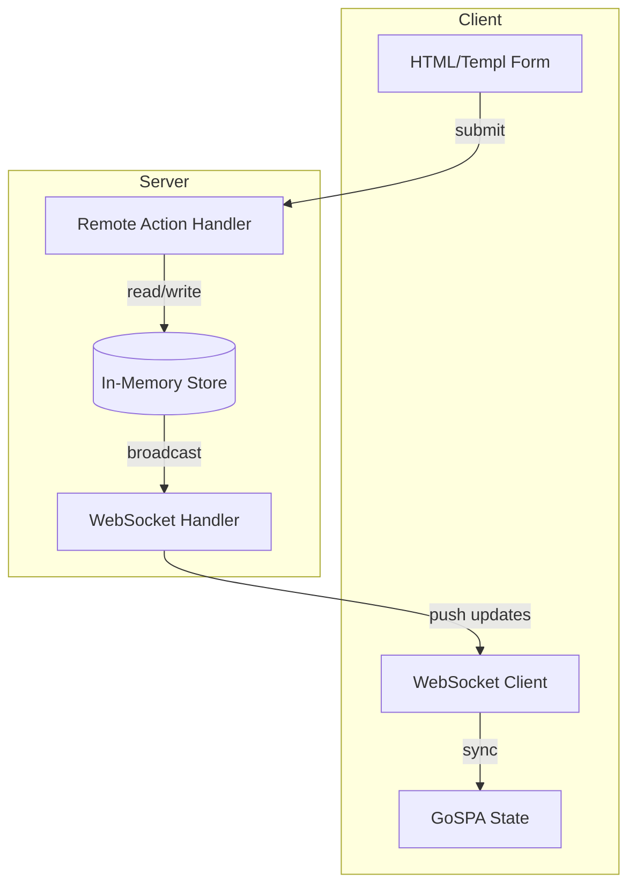

# Plan: Form Submission with Remote Actions, In-Memory Store, WebSocket & Pagination

## Overview

Create a GoSPA example demonstrating:
1. Form submission via remote action
2. In-memory server-side data store
3. Data persistence across page reloads
4. Real-time WebSocket updates
5. Pagination for displayed data

Example location: `examples/form-remote/`

---

## Architecture



---

## Implementation Steps

### 1. Project Setup

- [ ] Create `examples/form-remote/` directory
- [ ] Create `go.mod` with gospa dependency
- [ ] Create `main.go` with gospa app configuration
- [ ] Configure: WebSocket enabled, DevMode enabled

### 2. In-Memory Store Implementation

- [ ] Create `store.go` with thread-safe in-memory data structure
- [ ] Define `Message` struct with ID, Name, Content, Timestamp
- [ ] Implement:
  - `AddMessage(msg Message) error`
  - `GetMessages(page, pageSize int) ([]Message, int)`
  - `GetTotalCount() int`

### 3. Remote Action Registration

- [ ] Register `submitMessage` remote action in `init()` function
- [ ] Input: JSON with Name and Content fields
- [ ] Output: Created message with ID and timestamp
- [ ] Broadcast update via WebSocket after successful submission

### 4. Frontend - Form Component

- [ ] Create `routes/page.templ`
- [ ] Form with:
  - Name input field
  - Message textarea
  - Submit button
- [ ] Client-side JS to call remote action on submit
- [ ] Handle response and update UI

### 5. Frontend - Message List with Pagination

- [ ] Display messages in a list/grid
- [ ] Pagination controls (Previous, Next, page numbers)
- [ ] Initial state loaded from server
- [ ] Client-side state management for pagination

### 6. WebSocket Integration

- [ ] Enable WebSocket in gospa config
- [ ] Server broadcasts new messages to all connected clients
- [ ] Client receives and updates message list in real-time
- [ ] Show connection status indicator

### 7. Data Persistence on Reload

- [ ] Page load fetches current messages via remote action
- [ ] Initial page render includes message data in state
- [ ] Pagination state preserved across navigation

---

## File Structure

```
examples/form-remote/
├── go.mod
├── main.go
└── routes/
    ├── layout.templ
    ├── page.templ
    └── store.go
```

---

## Key Technical Decisions

### Store Implementation
- Use `sync.RWMutex` for thread-safe access
- Slice with prepend for newest-first ordering
- Pagination with offset calculation

### Remote Action Design
- Action name: `submitMessage`
- Input: `{ "name": string, "content": string }`
- Output: `{ "id": int, "name": string, "content": string, "timestamp": string }`

### WebSocket Broadcast
- Broadcast to all clients on new message
- Message type: `new_message`
- Client updates state and re-renders

### Pagination
- Page size: 5 messages per page
- Client maintains current page in state
- Remote action returns paginated results + total count

---

## UI/UX Design

- Dark theme with solid colors and clean lines
- Form card with input fields
- Message list with timestamps
- Pagination controls at bottom
- Real-time indicator when connected
- Smooth transitions for new messages
