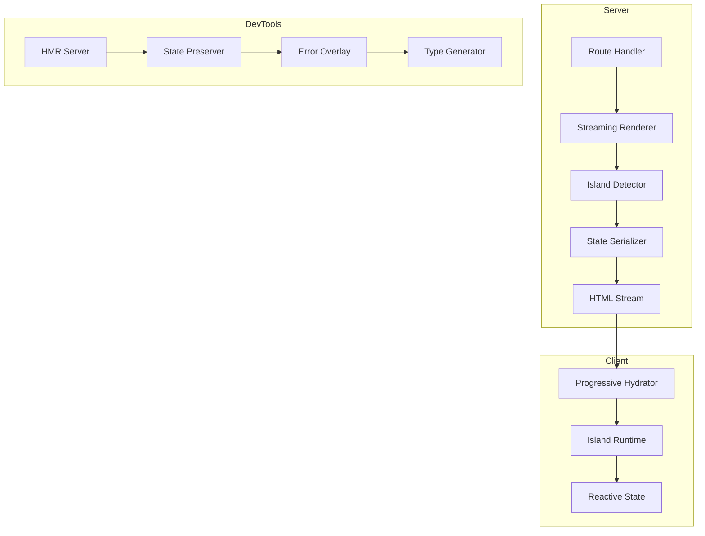

# GoSPA Framework Enhancement Plan

## Overview

This plan outlines the implementation of 10 major features to enhance the GoSPA framework:

1. Streaming SSR with Progressive Hydration
2. Auto-Detection of Reactive Boundaries
3. Formal Islands Architecture
4. Hot Module Replacement (HMR) with State Preservation
5. Type-Safe Route Helpers
6. Enhanced Error Overlay
7. Priority-Based Selective Hydration
8. Build-Time State Pruning
9. Starter Component Library/Plugin
10. Server-Sent Events (SSE) Support

---

## Architecture Overview



---

## Feature 1: Streaming SSR with Progressive Hydration

### Goal
Stream HTML to the client as it renders, enabling faster TTFB and progressive enhancement.

### Implementation Steps

#### 1.1 Server-Side Streaming Renderer
**File**: `templ/stream.go`

```go
// StreamConfig configures streaming SSR
type StreamConfig struct {
    EnableStreaming   bool
    FlushInterval     time.Duration
    BoundaryMarkers   bool
    AsyncComponents   bool
}

// StreamWriter handles streaming HTML output
type StreamWriter struct {
    w          http.ResponseWriter
    flusher    http.Flusher
    buffer     *bytes.Buffer
    boundaries []StreamBoundary
}

// StreamBoundary marks a streaming boundary
type StreamBoundary struct {
    ID       string
    Priority int
    Status   string // pending, ready, error
}
```

**Tasks**:
- [ ] Create `templ/stream.go` with StreamWriter struct
- [ ] Implement chunked HTML rendering with flush points
- [ ] Add boundary markers for component boundaries
- [ ] Integrate with Fiber's streaming response API

#### 1.2 Client-Side Progressive Hydrator
**File**: `client/src/hydration.ts`

```typescript
// Hydration scheduler with priority queue
class HydrationScheduler {
  private queue: HydrationTask[] = [];
  private priorities = { high: 0, medium: 1, low: 2 };
  
  schedule(component: ComponentDefinition, priority: Priority) {
    this.queue.push({ component, priority });
    this.flush();
  }
  
  private flush() {
    // Use requestIdleCallback for low priority
    // Use requestAnimationFrame for medium
    // Execute immediately for high priority
  }
}
```

**Tasks**:
- [ ] Create `client/src/hydration.ts` with HydrationScheduler
- [ ] Implement priority-based hydration queue
- [ ] Add intersection observer for viewport-based hydration
- [ ] Support idle callback for deferred hydration

#### 1.3 Template Integration
**File**: `templ/render.go` modifications

- Add `StreamComponent` function for async components
- Add `SuspenseBoundary` for loading states
- Integrate with existing `SPAPage` function

**Tasks**:
- [ ] Add streaming helpers to `templ/render.go`
- [ ] Create `templ/suspense.go` for async boundaries
- [ ] Update route generator to support streaming routes

---

## Feature 2: Auto-Detection of Reactive Boundaries

### Goal
Automatically detect which components need client-side reactivity based on usage patterns.

### Implementation Steps

#### 2.1 Static Analysis Engine
**File**: `routing/generator/analyzer.go`

```go
// BoundaryAnalyzer analyzes templates for reactive patterns
type BoundaryAnalyzer struct {
    patterns []ReactivePattern
}

// ReactivePattern defines a pattern that indicates reactivity
type ReactivePattern struct {
    Type       string // event, bind, state, effect
    Attribute  string
    Severity   int    // 1=definitely reactive, 2=likely, 3=maybe
}

// AnalysisResult contains detected boundaries
type AnalysisResult struct {
    ComponentID   string
    IsReactive    bool
    Boundaries    []Boundary
    Confidence    float64
}
```

**Detection Rules**:
1. `data-bind` attribute → reactive
2. `data-on` attribute → reactive
3. `data-model` attribute → reactive
4. `data-gospa-component` with state → reactive
5. Event handlers in template → reactive

**Tasks**:
- [ ] Create `routing/generator/analyzer.go`
- [ ] Implement pattern matching for reactive attributes
- [ ] Add AST analysis for templ files
- [ ] Generate boundary metadata in route info

#### 2.2 Runtime Detection
**File**: `client/src/detection.ts`

```typescript
// Detects reactive boundaries at runtime
function detectReactiveBoundaries(root: Element): Boundary[] {
  const boundaries: Boundary[] = [];
  
  // Query for reactive markers
  const reactiveElements = root.querySelectorAll(
    '[data-bind], [data-on], [data-model], [data-gospa-state]'
  );
  
  reactiveElements.forEach(el => {
    boundaries.push({
      element: el,
      type: detectBoundaryType(el),
      priority: inferPriority(el)
    });
  });
  
  return boundaries;
}
```

**Tasks**:
- [ ] Create `client/src/detection.ts`
- [ ] Implement DOM-based boundary detection
- [ ] Add heuristics for priority inference
- [ ] Integrate with hydration scheduler

---

## Feature 3: Formal Islands Architecture

### Goal
Implement a formal islands architecture where only interactive components are hydrated.

### Implementation Steps

#### 3.1 Island Definition
**File**: `component/island.go`

```go
// Island represents an interactive component
type Island struct {
    ID           string
    Component    templ.Component
    State        map[string]any
    Hydration    HydrationStrategy
    Priority     int
    Dependencies []string
}

// HydrationStrategy defines how an island hydrates
type HydrationStrategy string

const (
    HydrationImmediate HydrationStrategy = "immediate"
    HydrationVisible   HydrationStrategy = "visible"
    HydrationIdle      HydrationStrategy = "idle"
    HydrationLazy      HydrationStrategy = "lazy"
)

// IslandRegistry tracks all islands
type IslandRegistry struct {
    islands map[string]*Island
}
```

**Tasks**:
- [ ] Create `component/island.go` with Island struct
- [ ] Implement IslandRegistry for tracking
- [ ] Add island serialization for client transfer

#### 3.2 Island Template Helpers
**File**: `templ/island.go`

```go
// Island creates an island component
func Island(id string, component templ.Component, opts ...IslandOption) templ.Component {
    return templ.ComponentFunc(func(ctx context.Context, w io.Writer) error {
        // Render island wrapper with data attributes
        fmt.Fprintf(w, `<div data-gospa-island="%s" data-gospa-hydrate="%s">`, id, strategy)
        component.Render(ctx, w)
        fmt.Fprint(w, `</div>`)
        return nil
    })
}

// IslandState embeds initial state for an island
func IslandState(id string, state map[string]any) templ.Component
```

**Tasks**:
- [ ] Create `templ/island.go` with Island helper
- [ ] Add IslandState for state embedding
- [ ] Create IslandLazy for code-split islands

#### 3.3 Client Island Runtime
**File**: `client/src/island.ts`

```typescript
// IslandRuntime manages island lifecycle
class IslandRuntime {
  private islands: Map<string, IslandInstance> = new Map();
  
  async hydrate(id: string, strategy: HydrationStrategy) {
    const island = await this.loadIsland(id);
    const instance = this.createInstance(island);
    this.islands.set(id, instance);
  }
  
  private async loadIsland(id: string): Promise<IslandModule> {
    // Dynamic import for code-split islands
    return import(`/islands/${id}.js`);
  }
}
```

**Tasks**:
- [ ] Create `client/src/island.ts` with IslandRuntime
- [ ] Implement lazy loading for islands
- [ ] Add island-to-island communication

---

## Feature 4: Hot Module Replacement (HMR) with State Preservation

### Goal
Enable hot reloading during development while preserving component state.

### Implementation Steps

#### 4.1 HMR Server
**File**: `fiber/hmr.go`

```go
// HMRServer handles hot module replacement
type HMRServer struct {
    clients   map[string]*websocket.Conn
    watcher   *fsnotify.Watcher
    state     *StatePreserver
    moduleMap map[string]string // file -> module ID
}

// HMRUpdate represents an update message
type HMRUpdate struct {
    Type      string // full-reload, update, prune
    ModuleID  string
    URL       string
    Timestamp int64
    State     map[string]any // preserved state
}
```

**Tasks**:
- [ ] Create `fiber/hmr.go` with HMRServer
- [ ] Implement file watching with fsnotify
- [ ] Add WebSocket-based update propagation
- [ ] Integrate with existing dev server

#### 4.2 State Preservation
**File**: `fiber/state_preserve.go`

```go
// StatePreserver saves and restores component state
type StatePreserver struct {
    snapshots map[string]StateSnapshot
}

// StateSnapshot captures component state
type StateSnapshot struct {
    ComponentID string
    State       map[string]any
    Timestamp   time.Time
    Version     string
}

// Preserve captures current state before HMR
func (s *StatePreserver) Preserve(componentID string, state map[string]any)

// Restore returns preserved state after HMR
func (s *StatePreserver) Restore(componentID string) map[string]any
```

**Tasks**:
- [ ] Create `fiber/state_preserve.go`
- [ ] Implement state snapshot mechanism
- [ ] Add state versioning for compatibility

#### 4.3 Client HMR Runtime
**File**: `client/src/hmr.ts`

```typescript
// HMRClient handles hot updates
class HMRClient {
  private ws: WebSocket;
  private state: Map<string, any> = new Map();
  
  connect() {
    this.ws = new WebSocket('/_gospa/hmr');
    this.ws.onmessage = (e) => this.handleUpdate(JSON.parse(e.data));
  }
  
  private async handleUpdate(update: HMRUpdate) {
    // Save current state
    this.preserveState();
    
    // Apply update
    if (update.type === 'update') {
      await this.applyUpdate(update);
    } else if (update.type === 'full-reload') {
      location.reload();
    }
    
    // Restore state
    this.restoreState(update.state);
  }
}
```

**Tasks**:
- [ ] Create `client/src/hmr.ts` with HMRClient
- [ ] Implement module replacement logic
- [ ] Add state preservation/restoration

---

## Feature 5: Type-Safe Route Helpers

### Goal
Generate TypeScript types for routes, enabling type-safe navigation and data fetching.

### Implementation Steps

#### 5.1 Enhanced TypeScript Generator
**File**: `routing/generator/tsgen.go` (enhance existing)

```go
// TypeScriptGenerator generates type-safe route helpers
type TypeScriptGenerator struct {
    routes []RouteInfo
}

// GenerateRouteTypes creates TypeScript types for all routes
func (g *TypeScriptGenerator) GenerateRouteTypes() string {
    // Generate:
    // - RouteParams type for each route
    // - RouteQuery type for query params
    // - RouteData type for page data
    // - Typed navigate function
    // - Typed Link component
}

// Generate output:
// type Routes = '/' | '/blog/:id' | '/admin/users';
// type RouteParams<T extends Routes> = T extends '/blog/:id' 
//   ? { id: string } : {};
// function navigate<T extends Routes>(route: T, params?: RouteParams<T>): Promise<void>;
```

**Tasks**:
- [ ] Enhance `routing/generator/tsgen.go`
- [ ] Generate route parameter types
- [ ] Generate typed navigate function
- [ ] Generate typed Link component props

#### 5.2 Client Navigation Types
**File**: `client/src/navigation.ts` (enhance existing)

```typescript
// Type-safe navigation
export function navigate<T extends Routes>(
  route: T,
  params?: RouteParams<T>,
  options?: NavigateOptions
): Promise<void>;

// Type-safe Link component
export function Link<T extends Routes>(props: {
  to: T;
  params?: RouteParams<T>;
  children: ReactNode;
}): JSX.Element;
```

**Tasks**:
- [ ] Add type-safe navigate function
- [ ] Create typed Link component
- [ ] Add route data fetching types

---

## Feature 6: Enhanced Error Overlay

### Goal
Provide a rich development error overlay with source maps and component stack.

### Implementation Steps

#### 6.1 Error Collector
**File**: `fiber/errors.go` (enhance existing)

```go
// ErrorCollector gathers error information
type ErrorCollector struct {
    errors   []ErrorInfo
    sourceMap *SourceMapCache
}

// ErrorInfo contains detailed error information
type ErrorInfo struct {
    ID           string
    Message      string
    Stack        []StackFrame
    Component    string
    Source       string
    Line         int
    Column       int
    Suggestions  []string
    Timestamp    time.Time
}

// StackFrame represents a stack trace frame
type StackFrame struct {
    File     string
    Line     int
    Column   int
    Function string
    Source   string // source code snippet
}
```

**Tasks**:
- [ ] Enhance `fiber/errors.go` with ErrorCollector
- [ ] Implement source map parsing
- [ ] Add error suggestion engine

#### 6.2 Error Overlay UI
**File**: `client/src/overlay.ts`

```typescript
// ErrorOverlay displays errors in development
class ErrorOverlay {
  private container: HTMLElement;
  
  show(error: ErrorInfo) {
    // Create overlay with:
    // - Error message
    // - Component stack
    // - Source code context
    // - Suggested fixes
    // - Actions (dismiss, copy, open in editor)
  }
  
  private renderSourceContext(frame: StackFrame): HTMLElement {
    // Show source code with syntax highlighting
    // Highlight error line
    // Show surrounding context
  }
}
```

**Tasks**:
- [ ] Create `client/src/overlay.ts` with ErrorOverlay
- [ ] Implement source code display
- [ ] Add syntax highlighting
- [ ] Add open-in-editor functionality

---

## Feature 7: Priority-Based Selective Hydration

### Goal
Hydrate components based on priority for optimal perceived performance.

### Implementation Steps

#### 7.1 Priority System
**File**: `client/src/priority.ts`

```typescript
// Priority levels for hydration
enum Priority {
  Critical = 0,  // Above fold, interactive
  High = 1,      // User will interact soon
  Medium = 2,    // Below fold, visible
  Low = 3,       // Deferred until idle
  Deferred = 4   // May never hydrate
}

// PriorityResolver determines component priority
class PriorityResolver {
  resolve(element: Element): Priority {
    // Factors:
    // - data-gospa-priority attribute
    // - Position in viewport
    // - Component type (interactive vs static)
    // - User interaction likelihood
  }
}
```

**Tasks**:
- [ ] Create `client/src/priority.ts` with Priority enum
- [ ] Implement PriorityResolver
- [ ] Add viewport-based priority adjustment

#### 7.2 Hydration Scheduler
**File**: `client/src/scheduler.ts`

```typescript
// HydrationScheduler manages hydration order
class HydrationScheduler {
  private queues: Map<Priority, HydrationTask[]> = new Map();
  private isProcessing = false;
  
  schedule(task: HydrationTask) {
    const priority = task.priority;
    this.queues.get(priority)?.push(task);
    this.scheduleFlush();
  }
  
  private flush() {
    // Process critical immediately
    // Process high on next frame
    // Process medium on idle
    // Process low when nothing else pending
  }
}
```

**Tasks**:
- [ ] Create `client/src/scheduler.ts`
- [ ] Implement priority queues
- [ ] Add requestIdleCallback integration
- [ ] Add hydration budget management

---

## Feature 8: Build-Time State Pruning

### Goal
Remove unused state from the client bundle at build time.

### Implementation Steps

#### 8.1 State Analyzer
**File**: `state/analyzer.go`

```go
// StateAnalyzer analyzes state usage
type StateAnalyzer struct {
    usedState  map[string]bool
    allState   map[string]StateDef
}

// AnalyzeResult contains pruning information
type AnalyzeResult struct {
    UsedState    []string
    UnusedState  []string
    Savings      int64 // bytes saved
}

// Analyze determines which state is actually used
func (a *StateAnalyzer) Analyze(routes []RouteInfo) AnalyzeResult
```

**Tasks**:
- [ ] Create `state/analyzer.go`
- [ ] Implement state usage tracking
- [ ] Add dead code elimination

#### 8.2 Build Integration
**File**: `cli/build.go` (enhance existing)

```go
// Add state pruning step to build process
func (b *Builder) pruneState() error {
    analyzer := state.NewAnalyzer()
    result := analyzer.Analyze(b.routes)
    
    // Generate pruned state initialization
    // Remove unused state from client bundle
    // Report savings
}
```

**Tasks**:
- [ ] Enhance `cli/build.go` with pruning step
- [ ] Add state usage reporting
- [ ] Integrate with TypeScript generator

---

## Feature 9: Starter Component Library/Plugin

### Goal
Provide a starter plugin with common UI components. Modern inspired by mostly shadcn, some by BitsUI.

### Implementation Steps

#### 9.1 Plugin Structure
**Directory**: `plugin/starter/`

```
plugin/starter/
├── starter.go          # Plugin registration
├── components/
│   ├── button.templ    # Button component
│   ├── input.templ     # Input component
│   ├── card.templ      # Card component
│   ├── modal.templ     # Modal component
│   ├── dropdown.templ  # Dropdown component
│   └── toast.templ     # Toast notification
└── styles/
    └── components.css  # Base styles
```

**Tasks**:
- [ ] Create `plugin/starter/starter.go`
- [ ] Create Button component
- [ ] Create Input component
- [ ] Create Card component
- [ ] Create Modal component
- [ ] Create Dropdown component
- [ ] Create Toast component

#### 9.2 Component Examples
**File**: `plugin/starter/components/button.templ`

```templ
package components

// ButtonProps defines button properties
type ButtonProps struct {
    Variant string // primary, secondary, ghost, danger
    Size    string // sm, md, lg
    Disabled bool
    Loading  bool
}

// Button renders a styled button
templ Button(props ButtonProps) {
    <button
        class={ fmt.Sprintf("btn btn-%s btn-%s", props.Variant, props.Size) }
        if props.Disabled { disabled }
        data-gospa-component="button"
    >
        if props.Loading {
            <span class="spinner"></span>
        }
        { children... }
    </button>
}
```

**Tasks**:
- [ ] Implement each component with variants
- [ ] Add accessibility attributes
- [ ] Add keyboard navigation
- [ ] Create documentation

---

## Feature 10: Server-Sent Events (SSE) Support

### Goal
Provide SSE as a lighter alternative to WebSocket for server-to-client updates.

### Implementation Steps

#### 10.1 SSE Server
**File**: `fiber/sse.go`

```go
// SSEServer handles Server-Sent Events
type SSEServer struct {
    clients   map[string]*SSEClient
    broadcast chan SSEMessage
    mu        sync.RWMutex
}

// SSEClient represents an SSE connection
type SSEClient struct {
    ID        string
    Send      chan []byte
    Quit      chan struct{}
    LastEvent string
}

// SSEMessage represents an SSE event
type SSEMessage struct {
    Event string
    Data  interface{}
    ID    string
}

// SSEHandler returns a Fiber handler for SSE
func (s *SSEServer) SSEHandler() fiber.Handler {
    return func(c *fiber.Ctx) error {
        c.Set("Content-Type", "text/event-stream")
        c.Set("Cache-Control", "no-cache")
        c.Set("Connection", "keep-alive")
        c.Set("X-Accel-Buffering", "no")
        
        // Stream events to client
        c.Context().SetBodyStreamWriter(func(w *bufio.Writer) {
            // Event loop
        })
    }
}
```

**Tasks**:
- [ ] Create `fiber/sse.go` with SSEServer
- [ ] Implement SSE handler for Fiber
- [ ] Add heartbeat mechanism
- [ ] Add reconnection support

#### 10.2 SSE Client
**File**: `client/src/sse.ts`

```typescript
// SSEClient handles Server-Sent Events
export class SSEClient {
  private es: EventSource | null = null;
  private reconnectDelay = 1000;
  private maxReconnectDelay = 30000;
  private handlers: Map<string, Set<(data: any) => void>> = new Map();
  
  constructor(private url: string) {}
  
  connect() {
    this.es = new EventSource(this.url);
    
    this.es.onmessage = (e) => {
      const msg = JSON.parse(e.data);
      this.handlers.get(msg.event)?.forEach(h => h(msg.data));
    };
    
    this.es.onerror = () => {
      this.es?.close();
      setTimeout(() => this.connect(), this.reconnectDelay);
      this.reconnectDelay = Math.min(
        this.reconnectDelay * 2, 
        this.maxReconnectDelay
      );
    };
  }
  
  on(event: string, handler: (data: any) => void) {
    if (!this.handlers.has(event)) {
      this.handlers.set(event, new Set());
    }
    this.handlers.get(event)!.add(handler);
  }
  
  close() {
    this.es?.close();
  }
}
```

**Tasks**:
- [ ] Create `client/src/sse.ts` with SSEClient
- [ ] Implement reconnection logic
- [ ] Add event subscription API

#### 10.3 Template Integration
**File**: `templ/sse.go`

```go
// SSEScript returns the SSE client script
func SSEScript() templ.Component

// SSEComponent marks a component for SSE updates
func SSEComponent(id string, component templ.Component) templ.Component
```

**Tasks**:
- [ ] Create `templ/sse.go` with SSE helpers
- [ ] Add SSE component wrapper
- [ ] Integrate with existing state sync

---

## Implementation Order

### Phase 1: Core Infrastructure
1. Feature 3: Islands Architecture (foundation for others)
2. Feature 1: Streaming SSR
3. Feature 2: Auto-Detection

### Phase 2: Developer Experience
4. Feature 4: HMR with State Preservation
5. Feature 6: Enhanced Error Overlay
6. Feature 5: Type-Safe Route Helpers

### Phase 3: Performance
7. Feature 7: Priority-Based Hydration
8. Feature 8: Build-Time State Pruning

### Phase 4: Ecosystem
9. Feature 10: SSE Support
10. Feature 9: Starter Component Library

---

## Testing Strategy

Each feature should include:

1. **Unit Tests**: Core functionality
2. **Integration Tests**: Feature interactions
3. **E2E Tests**: User-facing behavior
4. **Performance Tests**: Benchmarks for critical paths
5. **Documentation**: API docs and examples

---

## Breaking Changes

| Feature | Breaking Change | Migration Path |
|---------|-----------------|----------------|
| Islands | New attribute format | Auto-migration tool |
| Streaming | Response format change | Feature flag |
| HMR | Dev server changes | Transparent |
| Types | Generated file location | Update imports |

---

## Configuration

```go
// Config additions for new features
type Config struct {
    // ... existing config
    
    // Streaming
    Streaming   StreamingConfig
    
    // Islands
    Islands     IslandsConfig
    
    // HMR
    HMR         HMRConfig
    
    // SSE
    SSE         SSEConfig
}
```

---

## Next Steps

1. Review and approve this plan
2. Switch to Code mode for implementation
3. Implement features in the specified order
4. Create documentation for each feature
5. Update website with new feature docs
