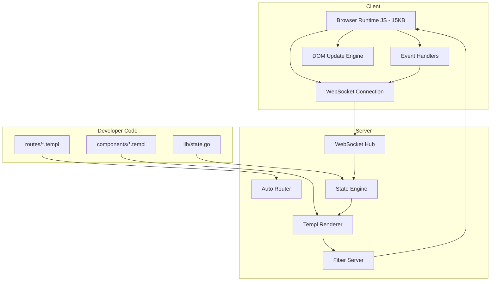
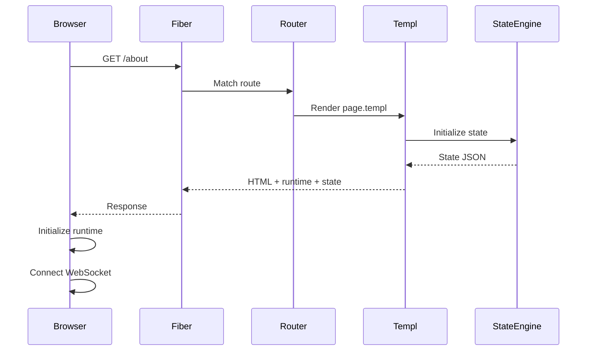
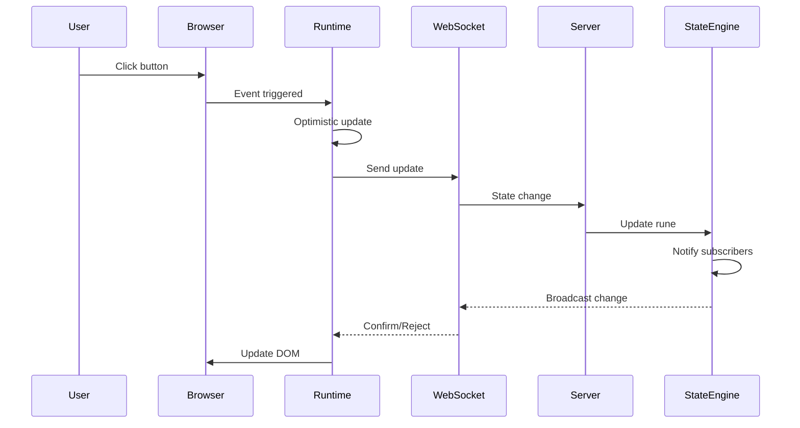

# GoSPA Framework Architecture Plan

## Overview

GoSPA is a modern SPA framework for Go that brings Svelte-like reactivity to server-side rendering with Fiber and Templ. This document outlines the complete architecture and implementation plan.

## High-Level Architecture



## Package Structure

```
gospa/
├── state/              # Reactive state primitives
│   ├── rune.go         # Core Rune[T] type
│   ├── derived.go      # Derived[T] computed state
│   ├── effect.go       # Side effects
│   ├── batch.go        # Batch update support
│   └── serialize.go    # JSON serialization
├── templ/              # Templ integration helpers
│   ├── bind.go         # Reactive bindings
│   ├── events.go       # Event handlers
│   ├── component.go    # Component initialization
│   └── render.go       # Rendering helpers
├── routing/            # File-based and manual routing
│   ├── auto.go         # Auto-routing from filesystem
│   ├── manual.go       # Manual route registration
│   ├── params.go       # Route parameter extraction
│   └── layout.go       # Layout nesting
├── fiber/              # Fiber integration
│   ├── middleware.go   # SPA middleware
│   ├── websocket.go    # WebSocket handler
│   ├── errors.go       # Error handling
│   └── dev.go          # Development tools
├── client/             # TypeScript runtime
│   ├── src/
│   │   ├── runtime.ts  # Main runtime
│   │   ├── state.ts    # Client-side state
│   │   ├── dom.ts      # DOM updates
│   │   ├── events.ts   # Event handling
│   │   └── websocket.ts# WebSocket client
│   └── dist/
│       └── runtime.js  # Compiled bundle
├── component/          # Component system
│   ├── base.go         # Base component
│   ├── props.go        # Props handling
│   ├── slots.go        # Slot support
│   └── lifecycle.go    # Lifecycle hooks
└── cli/                # CLI tool
    ├── main.go         # Entry point
    ├── create.go       # Project scaffolding
    ├── generate.go     # Type generation
    ├── dev.go          # Dev server
    └── build.go        # Production build
```

## Core Components Detail

### 1. State Management Engine - state/

#### Rune[T] - Base Reactive Primitive

```go
// rune.go
package state

type Rune[T any] struct {
    value       T
    subscribers []func(T)
    mu          sync.RWMutex
}

func NewRune[T any](initial T) *Rune[T]
func (r *Rune[T]) Set(value T)
func (r *Rune[T]) Get() T
func (r *Rune[T]) Subscribe(fn func(T)) Unsubscribe
func (r *Rune[T]) Notify()
```

#### Derived[T] - Computed State

```go
// derived.go
package state

type Derived[T any] struct {
    compute     func() T
    value       T
    deps        []*Rune[any]
    subscribers []func(T)
}

func NewDerived[T any](compute func() T, deps ...*Rune[any]) *Derived[T]
func (d *Derived[T]) Get() T
func (d *Derived[T]) Subscribe(fn func(T)) Unsubscribe
```

#### Effect - Side Effects

```go
// effect.go
package state

type Effect struct {
    fn       func()
    deps     []any
    active   bool
}

func NewEffect(fn func(), deps ...any) *Effect
func (e *Effect) Run()
func (e *Effect) Dispose()
```

#### Batch Updates

```go
// batch.go
package state

type BatchContext struct {
    pending   map[*Rune[any]]any
    flushing  bool
}

func Batch(fn func())
func (b *BatchContext) Queue(rune *Rune[T], value T)
func (b *BatchContext) Flush()
```

### 2. Client Runtime - client/

#### Core Runtime Structure

```typescript
// runtime.ts
interface GoSPARuntime {
  state: Map<string, ReactiveState>;
  components: Map<string, Component>;
  ws: WebSocketConnection;
  dom: DOMEngine;
  events: EventManager;
}

interface ReactiveState<T = unknown> {
  value: T;
  subscribers: Set<Subscriber<T>>;
  set: (value: T) => void;
  subscribe: (fn: Subscriber<T>) => () => void;
}

interface Component {
  id: string;
  state: Record<string, ReactiveState>;
  mounted: boolean;
  element: HTMLElement | null;
}
```

#### DOM Update Engine

```typescript
// dom.ts
class DOMEngine {
  updateAttribute(element: Element, name: string, value: unknown): void;
  updateText(element: Text, value: string): void;
  updateClass(element: Element, classes: Record<string, boolean>): void;
  updateStyle(element: HTMLElement, styles: Record<string, string>): void;
  conditionalRender(condition: boolean, template: string, target: Element): void;
  listRender<T>(items: T[], keyFn: (item: T) => string, renderFn: (item: T) => string): void;
}
```

#### WebSocket Synchronization

```typescript
// websocket.ts
class WebSocketConnection {
  private ws: WebSocket;
  private pending: Map<string, PendingUpdate>;
  private debounceMs: number;
  
  connect(url: string): void;
  sendStateUpdate(componentId: string, key: string, value: unknown): void;
  receiveUpdate(data: ServerMessage): void;
  optimisticUpdate<T>(key: string, newValue: T, rollback: T): void;
}
```

### 3. Templ Integration - templ/

#### Reactive Bindings

```go
// bind.go
package templ

import "github.com/a-h/templ"

// Bind creates a data-bind attribute for reactive binding
func Bind(componentID, key string) templ.Component

// BindValue creates a two-way value binding
func BindValue(componentID, key string) templ.Component

// BindChecked creates a checkbox binding
func BindChecked(componentID, key string) templ.Component

// BindClass creates a class binding
func BindClass(componentID, key string, classes map[string]bool) templ.Component
```

#### Event Handlers

```go
// events.go
package templ

// On creates an event handler attribute
func On(event, componentID, handler string) templ.Component

// OnClick shorthand for click events
func OnClick(componentID, handler string) templ.Component

// OnInput shorthand for input events with debounce
func OnInput(componentID, handler string, debounceMs int) templ.Component

// OnSubmit handles form submissions
func OnSubmit(componentID, handler string) templ.Component
```

#### Component Initialization

```go
// component.go
package templ

// Component creates a component wrapper with state
func Component(id, name string, state map[string]any, content templ.Component) templ.Component

// InitScript injects the runtime and initial state
func InitScript(state map[string]any) templ.Component

// StateJSON serializes state for client
func StateJSON(state map[string]any) string
```

### 4. Auto-Routing System - routing/

#### Route Scanner

```go
// auto.go
package routing

import "github.com/gofiber/fiber/v2"

type Route struct {
    Path       string
    Component  templ.Component
    Layouts    []templ.Component
    Params     []string
    IsCatchAll bool
}

type Router struct {
    routes    map[string]*Route
    layouts   map[string]templ.Component
    fiber     *fiber.App
}

// ScanDirectory scans routes/ for .templ files
func (r *Router) ScanDirectory(root string) error

// parseRoutePath converts file path to URL pattern
// routes/page.templ -> /
// routes/about/page.templ -> /about
// routes/blog/[id]/page.templ -> /blog/:id
// routes/posts/[...rest]/page.templ -> /posts/*
func parseRoutePath(filePath string) string

// RegisterRoutes registers all scanned routes with Fiber
func (r *Router) RegisterRoutes() error
```

#### Layout Nesting

```go
// layout.go
package routing

// LayoutStack manages nested layouts
type LayoutStack struct {
    layouts []templ.Component
}

// FindLayouts finds all layout.templ files for a route
func FindLayouts(routePath string) []templ.Component

// RenderWithLayouts renders a page with its layout chain
func RenderWithLayouts(page templ.Component, layouts []templ.Component) templ.Component
```

#### Route Parameters

```go
// params.go
package routing

// ExtractParams extracts URL params from request
func ExtractParams(c *fiber.Ctx, route *Route) map[string]string

// ParamMatcher validates route parameters
type ParamMatcher interface {
    Match(value string) bool
}

// RegisterMatcher registers a custom param matcher
func RegisterMatcher(name string, matcher ParamMatcher)
```

### 5. Fiber Integration - fiber/

#### SPA Middleware

```go
// middleware.go
package fiber

import "github.com/gofiber/fiber/v2"

type SPAMiddleware struct {
    runtimeJS  []byte
    devMode    bool
}

// SPA injects runtime scripts and handles SPA routing
func SPA(config Config) fiber.Handler

// InjectRuntime adds the client runtime to responses
func InjectRuntime(c *fiber.Ctx) error

// HandleSPA fallback for client-side routing
func HandleSPA(c *fiber.Ctx) error
```

#### WebSocket Handler

```go
// websocket.go
package fiber

import "github.com/gofiber/fiber/v2/middleware/websocket"

type WSMessage struct {
    Type        string `json:"type"`
    ComponentID string `json:"componentId"`
    Key         string `json:"key"`
    Value       any    `json:"value"`
}

type WSHub struct {
    clients    map[*websocket.Conn]bool
    broadcast  chan WSMessage
    register   chan *websocket.Conn
    unregister chan *websocket.Conn
}

// NewWSHub creates a WebSocket hub for state sync
func NewWSHub() *WSHub

// Run starts the hub
func (h *WSHub) Run()

// WebSocket handler for Fiber
func WebSocketHandler(hub *WSHub) fiber.Handler
```

### 6. Component System - component/

#### Base Component

```go
// base.go
package component

type BaseComponent struct {
    ID         string
    State      map[string]*state.Rune[any]
    Props      Props
    Lifecycle  LifecycleHooks
}

func NewBaseComponent(id string) *BaseComponent
func (c *BaseComponent) Mount()
func (c *BaseComponent) Update()
func (c *BaseComponent) Destroy()
```

#### Props System

```go
// props.go
package component

type Props map[string]any

// Prop retrieves a prop with type safety
func Prop[T any](p Props, key string, defaultValue ...T) T

// RequiredProp retrieves a required prop
func RequiredProp[T any](p Props, key string) (T, error)
```

#### Lifecycle Hooks

```go
// lifecycle.go
package component

type LifecycleHooks struct {
    OnMount   func()
    OnUpdate  func()
    OnDestroy func()
}

func OnMount(c *BaseComponent, fn func())
func OnUpdate(c *BaseComponent, fn func())
func OnDestroy(c *BaseComponent, fn func())
```

### 7. CLI Tool - cli/

#### Commands

```go
// main.go
package main

// gospa create <name> - Scaffold new project
// gospa generate - Generate types and routes
// gospa dev - Development server with hot reload
// gospa build - Production build
```

#### Project Template

```
myapp/
├── routes/
│   ├── page.templ
│   └── about/
│       └── page.templ
├── components/
├── lib/
│   └── state.go
├── main.go
├── go.mod
└── gospa.config.yaml
```

## Data Flow

### Initial Page Load



### State Update Flow



## API Examples

### Counter Component

```go
// components/counter.templ
package components

import "github.com/aydenstechdungeon/gospa/templ"

templ Counter(id string) {
    @templ.Component(id, "Counter", map[string]any{
        "count": 0,
    }) {
        <div data-component={ id }>
            <button @templ.OnClick(id, "decrement")>-</button>
            <span @templ.Bind(id, "count")>{ templ.State("count") }</span>
            <button @templ.OnClick(id, "increment")>+</button>
        </div>
    }
}
```

### Page with State

```go
// routes/blog/[id]/page.templ
package blog

import "github.com/aydenstechdungeon/gospa/templ"

templ Page(params map[string]string) {
    @templ.Component("blog-"+params["id"], "BlogPost", map[string]any{
        "post": nil,
        "loading": true,
    }) {
        <article data-component={ "blog-"+params["id"] }>
            if templ.StateBool("loading") {
                <p>Loading...</p>
            } else {
                <h1>{ templ.StateString("post.title") }</h1>
                <p>{ templ.StateString("post.content") }</p>
            }
        </article>
    }
}
```

### Server-Side Handler

```go
// main.go
package main

import (
    "github.com/gofiber/fiber/v2"
    "github.com/aydenstechdungeon/gospa/fiber"
    "github.com/aydenstechdungeon/gospa/routing"
)

func main() {
    app := fiber.New()
    
    // Auto-scan routes directory
    router := routing.NewRouter(app)
    router.ScanDirectory("./routes")
    router.RegisterRoutes()
    
    // SPA middleware
    app.Use(fiber.SPA(fiber.Config{
        DevMode: true,
    }))
    
    // WebSocket for state sync
    hub := fiber.NewWSHub()
    go hub.Run()
    app.Get("/ws", fiber.WebSocketHandler(hub))
    
    app.Listen(":3000")
}
```

## Implementation Phases

### Phase 1: Core State Engine
1. Implement `Rune[T]` with subscriptions
2. Implement `Derived[T]` with dependency tracking
3. Implement `Effect` with cleanup
4. Implement batch updates
5. Add JSON serialization

### Phase 2: Client Runtime
1. Create TypeScript project structure
2. Implement reactive state primitives
3. Implement DOM update engine
4. Implement WebSocket client
5. Implement event handling
6. Build and optimize to <15KB

### Phase 3: Templ Integration
1. Create binding helpers
2. Create event handler helpers
3. Create component wrapper
4. Create state injection

### Phase 4: Routing System
1. Implement file scanner
2. Implement route parser
3. Implement layout nesting
4. Implement param extraction
5. Add manual routing API

### Phase 5: Fiber Integration
1. Create SPA middleware
2. Create WebSocket handler
3. Create error handling
4. Add dev tools

### Phase 6: Component System
1. Implement base component
2. Implement props system
3. Implement lifecycle hooks
4. Add slot support

### Phase 7: CLI Tool
1. Implement create command
2. Implement generate command
3. Implement dev command
4. Implement build command

### Phase 8: Examples & Docs
1. Counter example
2. Todo list example
3. Blog example
4. Chat example
5. API documentation
6. Getting started guide

## Performance Targets

- Client runtime: <15KB gzipped
- First paint: <100ms
- Time to interactive: <200ms
- WebSocket latency: <50ms
- Memory per component: <1KB

## Security Considerations

- XSS prevention: All bindings are escaped by default
- CSRF protection: Built into WebSocket handshake
- Input validation: Server-side validation required
- State isolation: Components have isolated state

## Testing Strategy

- Unit tests for state engine (>80% coverage)
- Integration tests for routing
- E2E tests for examples
- Performance benchmarks
