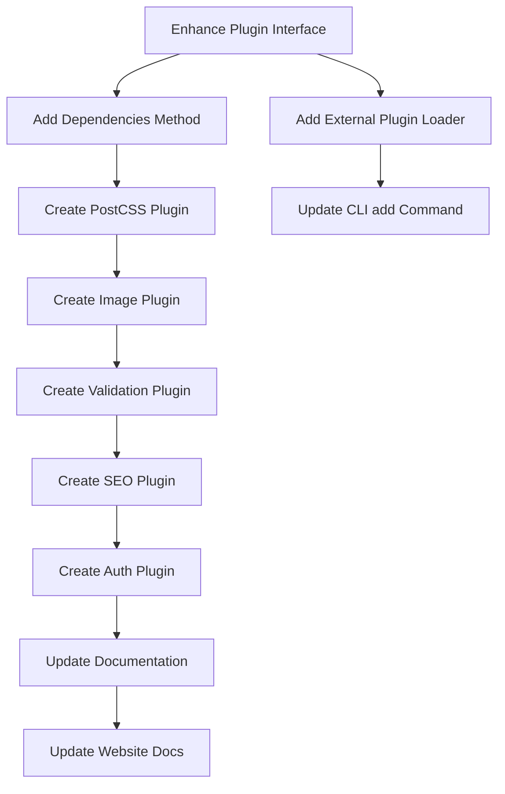

# GoSPA Plugin System Enhancement Plan

## Overview

This plan outlines the enhancement of GoSPA's plugin system to support a richer ecosystem of plugins with dependency management, external plugin loading, and comprehensive documentation.

## Current State Analysis

### Existing Plugin Interface ([`plugin/plugin.go`](plugin/plugin.go))

```go
type Plugin interface {
    Name() string
    Init() error
}

type CLIPlugin interface {
    Plugin
    OnHook(hook Hook, ctx map[string]interface{}) error
    Commands() []Command
}
```

### Existing Hooks
- `BeforeGenerate` / `AfterGenerate`
- `BeforeDev` / `AfterDev`
- `BeforeBuild` / `AfterBuild`

### Existing Plugin: Tailwind v4 ([`plugin/tailwind/tailwind.go`](plugin/tailwind/tailwind.go))
- Installs: `tailwindcss @tailwindcss/postcss postcss`
- Creates `static/css/app.css` with `@import "tailwindcss"`
- Creates `postcss.config.js`
- Provides `add:tailwind` command

---

## Proposed Architecture

### 1. Enhanced Plugin Interface

```go
// Dependency represents a package dependency
type Dependency struct {
    Name     string // Package name e.g. "@tailwindcss/typography"
    Version  string // Version constraint e.g. "^1.0.0" or "latest"
    Dev      bool   // Is this a dev dependency?
}

// Plugin interface with dependency support
type Plugin interface {
    Name() string
    Init() error
    Dependencies() []Dependency  // NEW: Declare NPM dependencies
}

// CLIPlugin with enhanced capabilities
type CLIPlugin interface {
    Plugin
    OnHook(hook Hook, ctx map[string]interface{}) error
    Commands() []Command
    Config() map[string]interface{} // NEW: Plugin configuration schema
}
```

### 2. External Plugin Support

```go
// ExternalPluginLoader handles loading plugins from GitHub
type ExternalPluginLoader struct {
    cacheDir string
}

// LoadFromGitHub downloads and loads a plugin from a GitHub URL
// Format: github.com/owner/repo@version or github.com/owner/repo
func (l *ExternalPluginLoader) LoadFromGitHub(url string) (CLIPlugin, error)
```

### 3. Plugin Registry Enhancement

```go
// InstallDependencies installs all dependencies for registered plugins
func InstallDependencies() error

// GetPluginDeps returns combined dependencies from all plugins
func GetPluginDeps() []Dependency
```

---

## New Plugins

### 1. PostCSS Plugin (`plugin/postcss/`)

**Purpose**: Extend Tailwind with official extensions and CSS processing.

**Dependencies**:
```json
[
  {"name": "@tailwindcss/typography", "dev": true},
  {"name": "@tailwindcss/forms", "dev": true},
  {"name": "@tailwindcss/aspect-ratio", "dev": true},
  {"name": "cssnano", "dev": true}
]
```

**Commands**:
- `add:postcss` - Install PostCSS with Tailwind extensions

**Files Created**:
- Updates `postcss.config.js` with plugins
- Creates `static/css/app.css` with `@plugin` directives

**Usage in CSS**:
```css
@import "tailwindcss";
@plugin "@tailwindcss/typography";
@plugin "@tailwindcss/forms";
@plugin "@tailwindcss/aspect-ratio";
```

---

### 2. Image Optimization Plugin (`plugin/image/`)

**Purpose**: Auto-optimize images with modern formats and responsive srcset.

**Dependencies**:
```json
[
  {"name": "sharp", "dev": true}
]
```

**Commands**:
- `add:image` - Install image optimization tooling

**Features**:
- Auto WebP/AVIF conversion during build (70-90%, maybe 85%  by default, of course adjustable in a config some way)
- Responsive srcset generation
- Image component helper for templates

**Hooks**:
- `AfterBuild`: Process images in `static/images/`

---

### 3. Form Validation Plugin (`plugin/validation/`)

**Purpose**: Go validator integration with Valibot for client-side validation.

**Dependencies**:
```json
[
  {"name": "valibot", "dev": false}  // ~1.5KB gzipped (vs Zod's ~12KB)
]
```

**Go Dependencies**:
```go
github.com/go-playground/validator/v10
```

**Commands**:
- `add:validation` - Setup validation scaffolding

**Features**:
- Go struct tag parsing for validation rules
- Valibot schema generation from Go structs
- Server-side validation middleware for Fiber
- Client-side validation with Valibot (optional, lightweight)

**Generated Example**:
```go
// Go struct
type UserForm struct {
    Email string `validate:"required,email" json:"email"`
    Age   int    `validate:"min=18" json:"age"`
}
```

```typescript
// Generated Valibot schema
import * as v from 'valibot';
export const UserFormSchema = v.object({
  email: v.pipe(v.string(), v.minLength(1), v.email()),
  age: v.pipe(v.number(), v.minValue(18))
});
export type UserForm = v.InferOutput<typeof UserFormSchema>;
```

**Why Valibot?**
- ~1.5KB gzipped vs Zod's ~12KB (8x smaller)
- Same TypeScript-first API
- Tree-shakeable (only import what you use)
- Works with Standard Schema spec

---

### 4. SEO Plugin (`plugin/seo/`)

**Purpose**: Sitemap generation, Open Graph, and JSON-LD support.

**Dependencies**: None (pure Go)

**Commands**:
- `add:seo` - Configure SEO helpers

**Features**:
- Sitemap.xml generation from routes
- Open Graph meta tag helpers
- JSON-LD structured data components

**Hooks**:
- `AfterBuild`: Generate sitemap.xml

**Templ Components**:
```go
// SEO component helpers
templ OpenGraph(title, description, image string)
templ JSONLD(data any)
templ SitemapEntry(path string, lastMod time.Time)
```

---

### 5. Auth Plugin (`plugin/auth/`)

**Purpose**: OAuth2, JWT, OTP, and session management.

**Dependencies**: None (uses Go stdlib + golang.org/x/oauth2)

**Go Dependencies**:
```go
golang.org/x/oauth2
github.com/golang-jwt/jwt/v5
github.com/pquerna/otp  // TOTP/HOTP support
```

**Commands**:
- `add:auth` - Setup authentication scaffolding

**Features**:
- **OAuth2 providers** (Google, Facebook, GitHub, Microsoft, Discord)
- JWT token generation/validation
- **OTP/TOTP support** (Google Authenticator, Authy compatible)
- Backup codes generation
- Session middleware for Fiber
- Protected route helpers

**Generated Files**:
```
lib/auth/
├── auth.go       # Core auth functions
├── oauth.go      # OAuth2 handlers
├── providers/    # Provider-specific configs
│   ├── google.go
│   ├── facebook.go
│   ├── github.go
│   ├── microsoft.go
│   └── discord.go
├── jwt.go        # JWT utilities
├── otp.go        # TOTP/HOTP + QR code generation
├── backup.go     # Backup codes generation/validation
└── middleware.go # Fiber middleware
```

**OAuth Providers**:
- Google (OAuth2)
- Facebook (OAuth2)
- GitHub (OAuth2)
- Microsoft (OAuth2)
- Discord (OAuth2)

**OTP Features**:
- TOTP (Time-based One-Time Password) - RFC 6238
- QR code generation for authenticator apps
- Backup codes (single-use recovery codes)
- Rate limiting for OTP verification
- Configurable code length (6 or 8 digits)

**Usage Example**:
```go
// Generate TOTP secret + QR code
secret, qrURL, _ := otp.GenerateTOTP("user@example.com", "MyApp")

// Verify TOTP code
valid := otp.VerifyTOTP(secret, userCode)

// Generate backup codes
backupCodes := backup.Generate(10) // 10 single-use codes
```

---

## CLI Commands Update

### `gospa add` Command

```
gospa add <feature>     Add a feature via plugin

Available Features:
  tailwind    Add Tailwind CSS v4
  postcss     Add PostCSS with Tailwind extensions
  image       Add image optimization
  validation  Add form validation with Zod
  seo         Add SEO helpers
  auth        Add authentication scaffolding

External Plugins:
  gospa add github.com/owner/gospa-plugin-name
```

### New Commands

```
gospa plugin list              List installed plugins
gospa plugin deps              Show all plugin dependencies
gospa plugin install           Install all plugin dependencies
```

---

## Documentation Updates

### docs/CLI.md Updates
- Add all new `gospa add` commands
- Document plugin hooks
- Add external plugin usage

### docs/PLUGINS.md (New)
- Plugin architecture overview
- Creating custom plugins
- Plugin API reference
- Hook reference

### README.md Updates
- Add plugin ecosystem section
- List available plugins
- Link to plugin documentation

### Website Docs
- Create `website/routes/docs/plugins/` page
- Update sidebar with Plugins link

---

## Implementation Order



---

## File Structure

```
plugin/
├── plugin.go           # Enhanced interface
├── loader.go           # NEW: External plugin loader
├── tailwind/
│   └── tailwind.go     # Existing
├── postcss/
│   └── postcss.go      # NEW
├── image/
│   └── image.go        # NEW
├── validation/
│   └── validation.go   # NEW
├── seo/
│   └── seo.go          # NEW
└── auth/
    └── auth.go         # NEW

docs/
├── CLI.md              # Update
├── PLUGINS.md          # NEW
└── ...

website/routes/docs/
├── plugins/            # NEW
│   └── page.templ
└── ...
```

---

## Questions for User

1. **Auth Plugin Scope**: Should the auth plugin support multiple OAuth providers out of the box, or start with a single provider (e.g., GitHub)?

2. **Image Plugin**: Should image optimization happen on-the-fly during dev or only during build?

3. **Validation Plugin**: Should this integrate with a specific Go validation library (go-playground/validator) or be agnostic?

4. **External Plugins**: Should external plugins be cached locally? If so, where (`~/.gospa/plugins/` or within project)?

5. **Plugin Configuration**: Should plugins support configuration files (e.g., `gospa.yaml`)?
