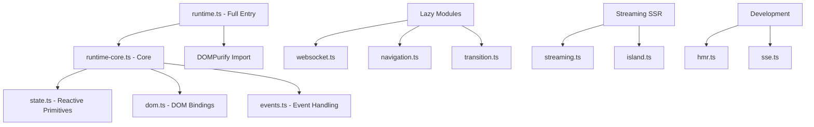
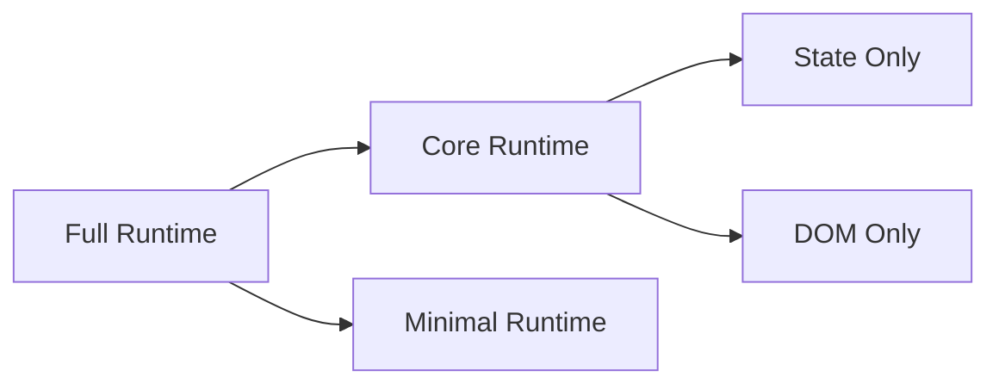

# GoSPA Runtime Performance Optimization Plan

## Executive Summary

This plan outlines a comprehensive strategy to optimize the GoSPA runtime environment for minimal initial load times and maximum execution speed. The optimization spans three phases: profiling and analysis, implementation, and validation.

## Current Architecture Analysis

### Client Runtime Structure



### Existing Optimizations

| Feature | Implementation | Status |
|---------|---------------|--------|
| Code Splitting | Bun `--splitting` flag | Active |
| Lazy Loading | Dynamic imports for WS/Nav/Transition | Active |
| Cache Busting | SHA256 hash in filename | Active |
| Compression | Fiber compress middleware | Active |
| Long-term Caching | max-age=31536000, immutable | Active |
| Streaming SSR | SetBodyStreamWriter | Active |
| Hydration Strategies | immediate/visible/idle/interaction/lazy | Active |
| Runtime Variants | full/core/simple | Active |

### Identified Bottlenecks

1. **Bundle Size**: No tree-shaking validation, potential dead code
2. **Initial Parse Time**: Full state.ts included in core bundle
3. **WebSocket Connection**: No connection pooling or multiplexing
4. **State Serialization**: JSON.stringify without optimization
5. **Memory Leaks**: Potential in reactive subscriptions without cleanup
6. **Critical Path**: DOMPurify loaded synchronously in full runtime

---

## Phase 1: Profiling and Analysis

### 1.1 Bundle Analysis Setup

**Objective**: Establish baseline metrics and identify optimization targets.

**Tasks**:
- [ ] Add bundle analyzer to build process
- [ ] Generate source maps for production builds
- [ ] Create bundle size regression test
- [ ] Document current bundle sizes per entry point

**Implementation**:
```json
// client/package.json - Add analyze script
{
  "scripts": {
    "analyze": "bun build ./src/runtime.ts --outdir ./dist --target browser --splitting --format esm --sourcemap && bunx bundle-analyzer ./dist"
  }
}
```

**Metrics to Track**:
- Total bundle size (gzipped)
- Individual chunk sizes
- Dependency tree depth
- Duplicate code percentage

### 1.2 Runtime Performance Profiling

**Objective**: Measure execution speed and identify hot paths.

**Tasks**:
- [ ] Add performance marks to critical initialization paths
- [ ] Create benchmark suite for reactive primitives
- [ ] Profile hydration time across strategies
- [ ] Measure WebSocket message throughput

**Key Metrics**:
- Time to Interactive (TTI)
- First Contentful Paint (FCP)
- Hydration completion time
- State update latency

### 1.3 Memory Profiling

**Objective**: Identify memory leaks and optimization opportunities.

**Tasks**:
- [ ] Add memory profiling to reactive primitives
- [ ] Test subscription cleanup on component destroy
- [ ] Profile long-running WebSocket connections
- [ ] Measure island hydration memory impact

---

## Phase 2: Implementation Steps

### 2.1 Code Splitting Enhancements

**Objective**: Reduce initial bundle size through strategic code splitting.

#### 2.1.1 Extract Debug Utilities

```typescript
// client/src/state.ts - Move debug utilities to separate module
// BEFORE: Debug utilities in state.ts
// AFTER: Lazy-loaded debug module

// client/src/debug.ts - New file
export function inspect<T>(rune: Rune<T>): void { ... }
export function tracking(): boolean { ... }
export function watchPath(...): void { ... }
```

**Impact**: Reduces core bundle by ~2KB

#### 2.1.2 Create Micro-Runtimes



**Tasks**:
- [ ] Create `runtime-state.ts` - State primitives only
- [ ] Create `runtime-dom.ts` - DOM bindings only  
- [ ] Create `runtime-island.ts` - Island hydration only
- [ ] Update Go server to serve appropriate runtime variant

#### 2.1.3 Lazy Load DOMPurify

```typescript
// client/src/dom.ts - Lazy load sanitizer
let dompurifyModule: Promise<typeof DOMPurify> | null = null;

async function getSanitizer(): Promise<(html: string) => string> {
  if (!dompurifyModule) {
    dompurifyModule = import('dompurify').then(m => m.default);
  }
  const purify = await dompurifyModule;
  return (html: string) => purify.sanitize(html);
}
```

### 2.2 Lazy Loading Improvements

**Objective**: Defer non-critical module loading.

#### 2.2.1 Preload Hints Integration

```go
// gospa.go - Add preload headers for critical chunks
func (a *App) setupRoutes() {
    // Add Link header for preload hints
    a.Fiber.Use(func(c *fiberpkg.Ctx) error {
        c.Set("Link", fmt.Sprintf(
            "<%s>; rel=modulepreload",
            a.getRuntimePath(),
        ))
        return c.Next()
    })
}
```

#### 2.2.2 Intelligent Module Preloading

```typescript
// client/src/runtime-core.ts - Predictive preloading
let preloadedModules = new Set<string>();

export function preloadModule(module: 'ws' | 'nav' | 'transition'): void {
  if (preloadedModules.has(module)) return;
  preloadedModules.add(module);
  
  switch (module) {
    case 'ws':
      import('./websocket.ts');
      break;
    case 'nav':
      import('./navigation.ts');
      break;
    case 'transition':
      import('./transition.ts');
      break;
  }
}

// Preload navigation on hover
document.addEventListener('mouseover', (e) => {
  const link = (e.target as Element).closest('a[href]');
  if (link) preloadModule('nav');
}, { passive: true, capture: true });
```

### 2.3 Asset Compression Optimization

**Objective**: Maximize compression efficiency.

#### 2.3.1 Brotli Compression for Static Assets

```go
// gospa.go - Add Brotli compression option
import "github.com/andybalholm/brotli"

func (a *App) setupMiddleware() {
    // Add Brotli for supported clients
    a.Fiber.Use(func(c *fiberpkg.Ctx) error {
        acceptEncoding := c.Get("Accept-Encoding")
        if strings.Contains(acceptEncoding, "br") {
            // Use Brotli compression
        }
        return c.Next()
    })
}
```

#### 2.3.2 Pre-compress Embedded Assets

```go
// embed/runtime.go - Pre-compressed variants
//go:embed *.js *.js.br *.js.gz
var runtimeFS embed.FS

func RuntimeJS(simple bool, encoding string) ([]byte, error) {
    ext := ".js"
    if encoding == "br" {
        ext = ".js.br"
    } else if encoding == "gzip" {
        ext = ".js.gz"
    }
    name := "runtime" + ext
    if simple {
        name = "runtime-simple" + ext
    }
    return runtimeFS.ReadFile(name)
}
```

### 2.4 Memory Management

**Objective**: Prevent memory leaks and optimize garbage collection.

#### 2.4.1 Reactive Primitive Cleanup

```typescript
// client/src/state.ts - Enhanced cleanup
export class Effect {
  private disposed = false;
  private cleanupFns: (() => void)[] = [];
  
  addCleanup(fn: () => void): void {
    this.cleanupFns.push(fn);
  }
  
  dispose(): void {
    if (this.disposed) return;
    this.disposed = true;
    
    // Run all cleanup functions
    for (const fn of this.cleanupFns) {
      try { fn(); } catch {}
    }
    this.cleanupFns = [];
    
    // Unregister from all dependencies
    for (const dep of this.dependencies) {
      dep.unsubscribe(this);
    }
    this.dependencies.clear();
  }
}
```

#### 2.4.2 WeakRef for Element Bindings

```typescript
// client/src/dom.ts - Use WeakRef for element bindings
const elementBindings = new WeakMap<Element, Set<Binding>>();

export function bindElement<T>(
  element: Element,
  rune: Rune<T>,
  options: Partial<Binding> = {}
): () => void {
  // WeakMap automatically cleans up when element is GC'd
  let bindings = elementBindings.get(element);
  if (!bindings) {
    bindings = new Set();
    elementBindings.set(element, bindings);
  }
  
  const binding: Binding = { ... };
  bindings.add(binding);
  
  return () => {
    bindings.delete(binding);
    if (bindings.size === 0) {
      elementBindings.delete(element);
    }
  };
}
```

#### 2.4.3 Island Cleanup on Navigation

```typescript
// client/src/island.ts - Cleanup islands on navigation
export class IslandManager {
  private cleanupFns: Map<string, () => void> = new Map();
  
  registerCleanup(id: string, fn: () => void): void {
    this.cleanupFns.set(id, fn);
  }
  
  cleanupIsland(id: string): void {
    const cleanup = this.cleanupFns.get(id);
    if (cleanup) {
      cleanup();
      this.cleanupFns.delete(id);
    }
    this.islands.delete(id);
    this.hydrated.delete(id);
  }
  
  cleanupAll(): void {
    for (const [id, cleanup] of this.cleanupFns) {
      cleanup();
    }
    this.cleanupFns.clear();
    this.islands.clear();
    this.hydrated.clear();
  }
}
```

### 2.5 Caching Optimization

**Objective**: Maximize cache hit rates and minimize redundant operations.

#### 2.5.1 Navigation Cache Enhancement

```typescript
// client/src/navigation.ts - Enhanced caching
interface CacheEntry {
  html: string;
  head: string;
  timestamp: number;
  etag: string;
  status: 'fresh' | 'stale' | 'fetching';
}

class NavigationCache {
  private cache = new Map<string, CacheEntry>();
  private maxAge = 30000; // 30 seconds
  private maxSize = 50; // Maximum entries
  
  get(url: string): CacheEntry | null {
    const entry = this.cache.get(url);
    if (!entry) return null;
    
    if (Date.now() - entry.timestamp > this.maxAge) {
      entry.status = 'stale';
    }
    return entry;
  }
  
  set(url: string, html: string, head: string, etag: string): void {
    // LRU eviction
    if (this.cache.size >= this.maxSize) {
      const oldest = [...this.cache.entries()]
        .sort((a, b) => a[1].timestamp - b[1].timestamp)[0];
      this.cache.delete(oldest[0]);
    }
    
    this.cache.set(url, {
      html, head, etag,
      timestamp: Date.now(),
      status: 'fresh'
    });
  }
}
```

#### 2.5.2 Service Worker for Offline Support

```javascript
// client/sw.js - Service worker for runtime caching
const RUNTIME_CACHE = 'gospa-runtime-v1';
const STATIC_CACHE = 'gospa-static-v1';

self.addEventListener('install', (event) => {
  event.waitUntil(
    caches.open(RUNTIME_CACHE).then((cache) => {
      return cache.addAll([
        '/_gospa/runtime.js',
        '/_gospa/runtime-core.js',
      ]);
    })
  );
});

self.addEventListener('fetch', (event) => {
  if (event.request.url.includes('/_gospa/')) {
    event.respondWith(
      caches.match(event.request).then((response) => {
        return response || fetch(event.request);
      })
    );
  }
});
```

#### 2.5.3 WebSocket Message Caching

```typescript
// client/src/websocket.ts - Message deduplication
class MessageCache {
  private seen = new Set<string>();
  private max = 1000;
  
  shouldProcess(message: StateMessage): boolean {
    const key = `${message.type}:${message.componentId || ''}:${JSON.stringify(message.data || message.diff || {})}`;
    
    if (this.seen.has(key)) {
      return false;
    }
    
    this.seen.add(key);
    if (this.seen.size > this.max) {
      // Remove oldest entries
      const entries = [...this.seen].slice(0, this.max / 2);
      this.seen = new Set(entries);
    }
    
    return true;
  }
}
```

### 2.6 State Serialization Optimization

**Objective**: Minimize serialization overhead.

#### 2.6.1 Binary State Protocol

```typescript
// client/src/state.ts - Binary serialization option
export class StateMap {
  toBinary(): Uint8Array {
    const encoder = new TextEncoder();
    const entries: [string, unknown][] = [];
    
    for (const [key, rune] of this.runes) {
      entries.push([key, rune.get()]);
    }
    
    // Simple binary format: [length][key][value]...
    const json = JSON.stringify(entries);
    return encoder.encode(json);
  }
  
  static fromBinary(data: Uint8Array): StateMap {
    const decoder = new TextDecoder();
    const json = decoder.decode(data);
    const entries = JSON.parse(json) as [string, unknown][];
    
    const map = new StateMap();
    for (const [key, value] of entries) {
      map.set(key, value);
    }
    return map;
  }
}
```

#### 2.6.2 State Diffing Enhancement

```typescript
// client/src/state.ts - Optimized diffing
export function diffStates(
  oldState: Record<string, unknown>,
  newState: Record<string, unknown>
): Record<string, unknown> {
  const diff: Record<string, unknown> = {};
  
  for (const key in newState) {
    if (!Object.is(oldState[key], newState[key])) {
      diff[key] = newState[key];
    }
  }
  
  for (const key in oldState) {
    if (!(key in newState)) {
      diff[key] = null; // Mark for deletion
    }
  }
  
  return diff;
}
```

### 2.7 Hydration Optimization

**Objective**: Minimize hydration blocking time.

#### 2.7.1 Batched Hydration

```typescript
// client/src/streaming.ts - Batched hydration
export class StreamingManager {
  private hydrationBatch: IslandData[] = [];
  private batchTimeout: number | null = null;
  
  private addToHydrationQueue(island: IslandData, priority: 'high' | 'normal' | 'low'): void {
    if (this.hydratedIslands.has(island.id)) return;
    
    this.hydrationBatch.push(island);
    
    if (!this.batchTimeout) {
      this.batchTimeout = window.requestIdleCallback(() => {
        this.processBatch();
      }, { timeout: 100 });
    }
  }
  
  private processBatch(): void {
    const batch = this.hydrationBatch;
    this.hydrationBatch = [];
    this.batchTimeout = null;
    
    // Sort by priority
    batch.sort((a, b) => {
      const order = { high: 0, normal: 1, low: 2 };
      return order[a.priority] - order[b.priority];
    });
    
    // Process in chunks to avoid blocking
    const processChunk = (index: number) => {
      const chunk = batch.slice(index, index + 5);
      if (chunk.length === 0) return;
      
      chunk.forEach(island => this.hydrateIsland(island));
      
      requestAnimationFrame(() => processChunk(index + 5));
    };
    
    processChunk(0);
  }
}
```

#### 2.7.2 Progressive Hydration with requestIdleCallback

```typescript
// client/src/island.ts - Progressive hydration
export class IslandManager {
  private idleCallbackId: number | null = null;
  
  scheduleIdleHydration(island: IslandElementData): void {
    if ('requestIdleCallback' in window) {
      this.idleCallbackId = (window as any).requestIdleCallback(
        (deadline: IdleDeadline) => {
          // Hydrate as many islands as possible within deadline
          while (deadline.timeRemaining() > 0 && !this.queue.isEmpty()) {
            const item = this.queue.shift();
            if (item) this.hydrateIsland(item.island);
          }
          
          // Schedule remaining for next idle period
          if (!this.queue.isEmpty()) {
            this.scheduleIdleHydration(island);
          }
        },
        { timeout: island.defer ?? 2000 }
      );
    }
  }
}
```

---

## Phase 3: Validation Metrics

### 3.1 Performance Budgets

| Metric | Current | Target | Threshold |
|--------|---------|--------|-----------|
| Runtime Core Bundle | ~15KB | <12KB | <15KB |
| Full Runtime Bundle | ~25KB | <20KB | <25KB |
| Time to Interactive | TBD | <100ms | <200ms |
| Hydration Time | TBD | <50ms | <100ms |
| Memory Usage | TBD | <10MB | <20MB |
| WebSocket Latency | TBD | <10ms | <50ms |

### 3.2 Benchmark Suite

```typescript
// client/src/__benchmarks__/runtime.bench.ts
import { test, expect, bench } from 'bun:test';

bench('Rune creation', () => {
  const rune = new Rune(0);
  rune.get();
});

bench('Derived computation', () => {
  const a = new Rune(1);
  const b = new Rune(2);
  const derived = new Derived(() => a.get() + b.get());
  derived.get();
});

bench('State update propagation', () => {
  const rune = new Rune(0);
  const effect = new Effect(() => rune.get());
  for (let i = 0; i < 1000; i++) {
    rune.set(i);
  }
  effect.dispose();
});

bench('StateMap serialization', () => {
  const map = new StateMap();
  for (let i = 0; i < 100; i++) {
    map.set(`key${i}`, { value: i, nested: { data: 'test' } });
  }
  map.toJSON();
});
```

### 3.3 Continuous Monitoring

**Tasks**:
- [ ] Add Lighthouse CI to build pipeline
- [ ] Create performance regression alerts
- [ ] Set up bundle size tracking
- [ ] Monitor Core Web Vitals in production

---

## Implementation Priority

### High Priority - Immediate Impact
1. Bundle analysis and tree-shaking validation
2. DOMPurify lazy loading
3. Memory leak fixes in reactive primitives
4. Navigation cache enhancement

### Medium Priority - Significant Improvement
1. Micro-runtime variants
2. Preload hints integration
3. Brotli compression
4. Batched hydration

### Low Priority - Optimization Polish
1. Binary state protocol
2. Service worker caching
3. WebSocket message deduplication
4. Progressive hydration refinement

---

## Risk Assessment

| Risk | Impact | Mitigation |
|------|--------|------------|
| Breaking changes to runtime API | High | Maintain backward compatibility layer |
| Memory regression from lazy loading | Medium | Comprehensive memory profiling |
| Compression compatibility issues | Low | Feature detection and fallbacks |
| Service worker cache invalidation | Medium | Version-based cache keys |

---

## Success Criteria

1. **Bundle Size**: 20% reduction in core runtime size
2. **Load Time**: 30% improvement in Time to Interactive
3. **Memory**: No memory leaks in 24-hour stress test
4. **Hydration**: 50% reduction in hydration blocking time
5. **Cache Hit Rate**: >90% for navigation requests

---

## Next Steps

1. Review and approve this plan
2. Set up bundle analysis tooling
3. Create benchmark baseline measurements
4. Begin Phase 1 implementation
