# Website Performance & Network Optimization Plan

## Executive Summary

The website at `/website` is re-requesting the same image (`gospa1-64.webp`) on every SPA navigation. This is caused by the client-side navigation system replacing the entire `[data-gospa-root]` element, which destroys and recreates DOM elements including the header logo.

## Root Cause Analysis

### Problem 1: SPA Navigation Destroys Persistent Elements

**Location:** [`client/src/navigation.ts:147`](client/src/navigation.ts:147)

```typescript
// Current behavior - replaces entire root including header
rootEl.innerHTML = sanitizedContent;
```

The `updateDOM` function replaces the entire `[data-gospa-root]` element content. This includes:
- Header with logo image
- Footer
- Main content area

When the `` element is destroyed and recreated, the browser treats it as a new resource request, bypassing the cache in some cases.

### Problem 2: Content Hash Detection Insufficient

**Location:** [`website/main.go:64-80`](website/main.go:64)

The `hasContentHash` function requires 4+ character hashes:
- `gospa1-64.webp` has hash `64` (2 chars) → fails check
- Gets 1-day cache instead of immutable cache

### Problem 3: Missing ETag Support

No `ETag` or `Last-Modified` headers for conditional requests (`If-None-Match`, `If-Modified-Since`).

### Problem 4: No Resource Hints

Critical assets like the logo are not preloaded, causing delayed loading.

---

## Solution Architecture

```mermaid
flowchart TB
    subgraph Current Flow
        A[User clicks doc link] --> B[fetchPageFromServer]
        B --> C[Server returns full HTML]
        C --> D[updateDOM replaces data-gospa-root]
        D --> E[Header img destroyed]
        E --> F[New img created]
        F --> G[Browser requests image again]
    end
    
    subgraph Optimized Flow
        A2[User clicks doc link] --> B2[fetchPageFromServer]
        B2 --> C2[Server returns page content only]
        C2 --> D2[updateDOM replaces main only]
        D2 --> E2[Header/footer preserved]
        E2 --> F2[No image re-request]
    end
```



---

## Implementation Plan

### Phase 1: Fix SPA Navigation - Preserve Persistent Elements

**Files to modify:**
1. `client/src/navigation.ts` - Update DOM update logic
2. `website/routes/root_layout.templ` - Add content region markers

**Changes:**

#### 1.1 Add Content Region Marker in Layout

In `root_layout.templ`, wrap only the page-specific content:

```templ
<!-- Add data-gospa-page-content to main content area -->
<main class="flex-grow z-10 relative">
    <div data-gospa-page-content>
        @children
    </div>
</main>
```

#### 1.2 Update Navigation to Target Content Region

In `navigation.ts`, modify `updateDOM`:

```typescript
async function updateDOM(data: PageData): Promise<void> {
    // Update title
    if (data.title) {
        document.title = data.title;
    }

    // Target content region only, not entire root
    const contentEl = document.querySelector('[data-gospa-page-content]');
    const rootEl = document.querySelector('[data-gospa-root]');
    
    if (contentEl) {
        // Only update the content area - preserves header/footer
        const sanitizedContent = await safeSanitize(data.content);
        contentEl.innerHTML = sanitizedContent;
    } else if (rootEl) {
        // Fallback for legacy behavior
        rootEl.innerHTML = await safeSanitize(data.content);
    }
    
    // Update head
    updateHead(data.head);
    
    // Re-initialize runtime for new content
    await initNewContent();
}
```

#### 1.3 Update Server Response

Modify the server to return only the page content, not the full layout:

```typescript
// In fetchPageFromServer, extract content region
const contentEl = doc.querySelector('[data-gospa-page-content]');
const content = contentEl ? contentEl.innerHTML : /* fallback */;
```

### Phase 2: Improve Cache Headers

**File:** `website/main.go`

#### 2.1 Fix Content Hash Detection

```go
// hasContentHash checks if filename contains a content hash pattern
func hasContentHash(path string) bool {
    // Known static assets that should be cached immutably
    immutablePatterns := []string{
        "gospa1-",  // Logo variants
        "gospa2-",  // Other brand assets
    }
    
    for _, pattern := range immutablePatterns {
        if strings.Contains(path, pattern) {
            return true
        }
    }
    
    // Check for common hash patterns: -abc123, .abc123, _abc123
    for _, pattern := range []string{"-", ".", "_"} {
        parts := strings.Split(path, pattern)
        if len(parts) >= 2 {
            last := parts[len(parts)-1]
            if idx := strings.Index(last, "."); idx >= 2 {
                hash := last[:idx]
                if isAlphanumeric(hash) && len(hash) >= 4 {
                    return true
                }
            }
        }
    }
    return false
}
```

#### 2.2 Add ETag Support

```go
import "crypto/sha256"

func staticCacheMiddleware(c *fiber.Ctx) error {
    path := c.Path()
    
    if strings.HasPrefix(path, "/static/") {
        // Generate ETag from file path + mtime
        etag := generateETag(path)
        c.Set("ETag", etag)
        
        // Check If-None-Match for 304 response
        if c.Get("If-None-Match") == etag {
            return c.SendStatus(fiber.StatusNotModified)
        }
        
        if hasContentHash(path) {
            c.Set("Cache-Control", "public, max-age=31536000, immutable")
        } else {
            c.Set("Cache-Control", "public, max-age=86400, stale-while-revalidate=604800")
        }
    }
    
    return c.Next()
}

func generateETag(path string) string {
    // Use path as basis - in production would include file hash/mtime
    h := sha256.Sum256([]byte(path))
    return fmt.Sprintf(`"%x"`, h[:8])
}
```

### Phase 3: Add Resource Hints

**File:** `website/routes/root_layout.templ`

Add preload directives in the `<head>`:

```templ
<head>
    <!-- Preload critical assets -->
    <link rel="preload" href="/static/gospa1-64.webp" as="image" type="image/webp" />
    
    <!-- Preconnect to external origins -->
    <link rel="preconnect" href="https://fonts.googleapis.com" />
    <link rel="preconnect" href="https://fonts.gstatic.com" crossorigin />
    <link rel="preconnect" href="https://unpkg.com" />
    
    <!-- DNS prefetch for less critical external resources -->
    <link rel="dns-prefetch" href="https://fonts.googleapis.com" />
    
    <!-- Existing head content... -->
</head>
```

### Phase 4: Optional Service Worker for Offline Caching

**File:** `website/static/sw.js` (new file)

```javascript
const CACHE_NAME = 'gospa-docs-v1';
const STATIC_ASSETS = [
    '/static/gospa1-64.webp',
    '/static/gospa1-64.ico',
];

self.addEventListener('install', (event) => {
    event.waitUntil(
        caches.open(CACHE_NAME).then((cache) => {
            return cache.addAll(STATIC_ASSETS);
        })
    );
});

self.addEventListener('fetch', (event) => {
    if (event.request.destination === 'image') {
        event.respondWith(
            caches.match(event.request).then((response) => {
                return response || fetch(event.request);
            })
        );
    }
});
```

Register in layout:

```templ
<script>
if ('serviceWorker' in navigator) {
    navigator.serviceWorker.register('/static/sw.js');
}
</script>
```

---

## Expected Results

| Metric | Before | After |
|--------|--------|-------|
| Image requests per navigation | 1 per page | 0 (cached) |
| Cache hit rate for static assets | ~50% | ~100% |
| DOM elements replaced | Full root | Content only |
| 304 responses possible | No | Yes |

---

## Implementation Priority

1. **High Priority** - Phase 1: Fix SPA Navigation (solves the main issue)
2. **Medium Priority** - Phase 2: Improve Cache Headers
3. **Low Priority** - Phase 3: Resource Hints
4. **Optional** - Phase 4: Service Worker

---

## Testing Checklist

- [ ] Navigate between doc pages - verify no image re-requests
- [ ] Check Network tab for 304 responses on repeat visits
- [ ] Verify header/footer remain interactive after navigation
- [ ] Test mobile menu still works after SPA navigation
- [ ] Verify WebSocket reconnection after navigation
- [ ] Check that state management still functions
