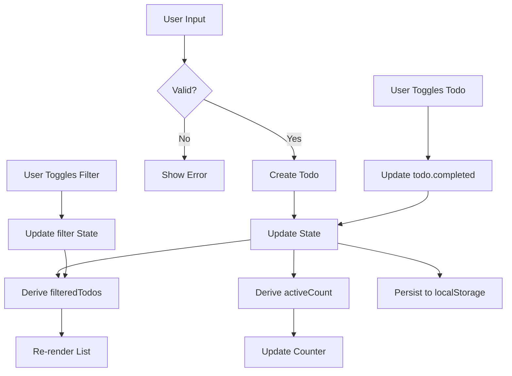
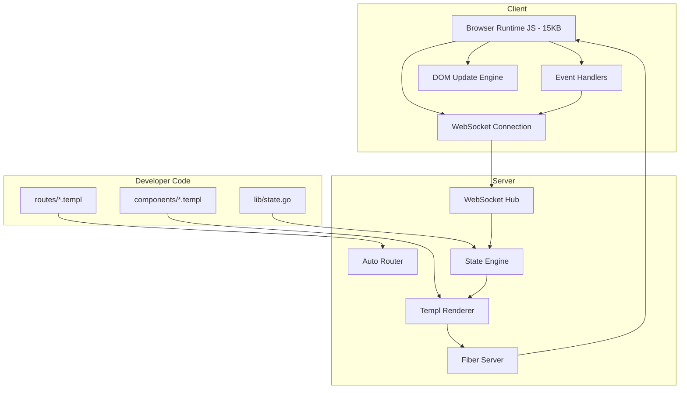
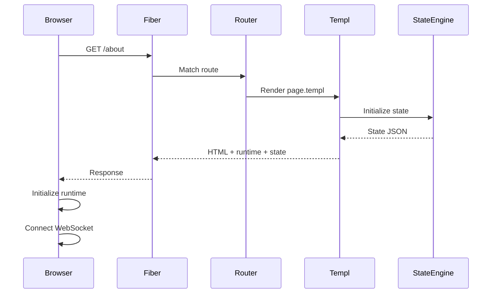
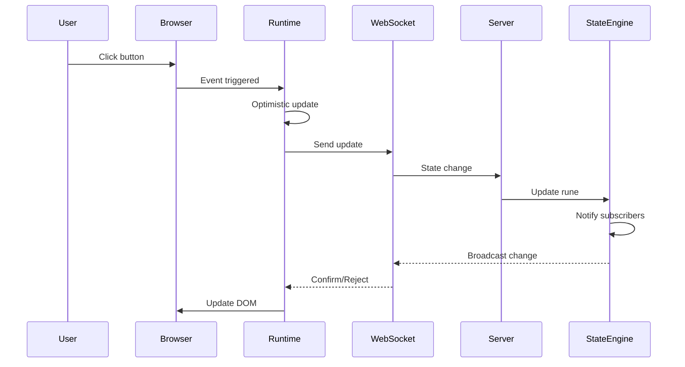
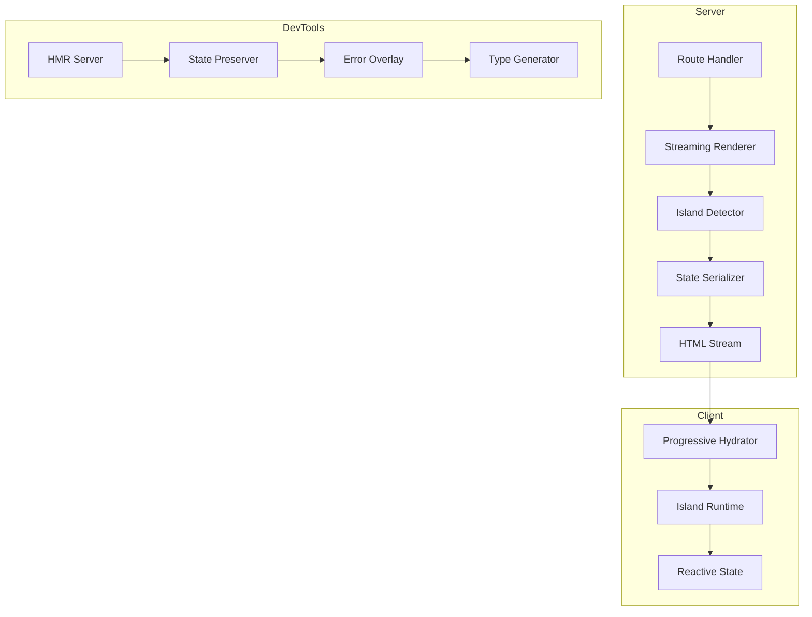
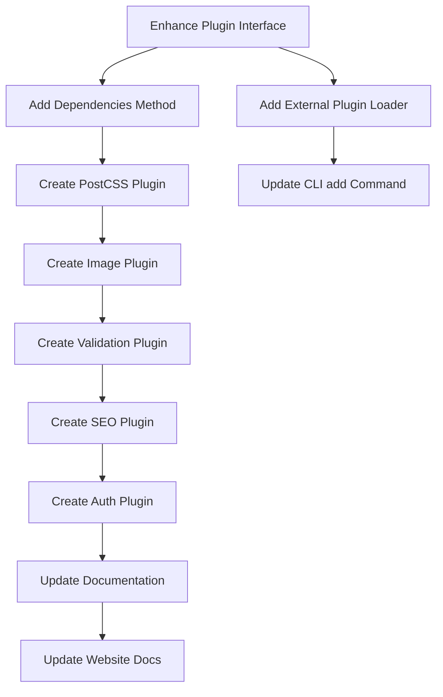
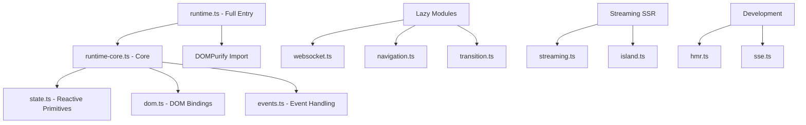
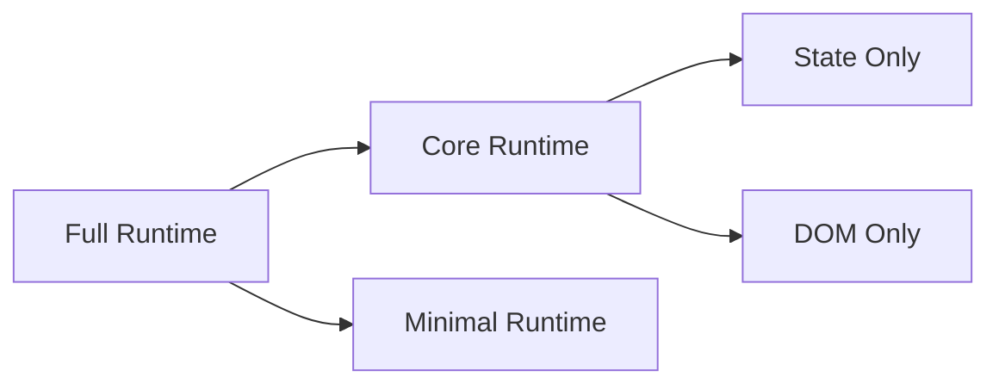

# Repository: https://github.com/aydenstechdungeon/gospa/
# Official website: https://gospa.onrender.com/
# Website's Docs: https://gospa.onrender.com/docs

<!-- FILE: README.md -->
================================================================================

# GoSPA 


A Go framework for building reactive SPAs with server-side rendering. Brings Svelte-like reactivity to Go using Fiber and Templ.

-# Pushing to master/main will stop once framework is stable or if other people start working on it.

## Features

- **Reactive Primitives** — `Rune[T]`, `Derived[T]`, `Effect` - Svelte-like reactivity in Go
- **File-Based Routing** — SvelteKit-style routing for `.templ` files
- **WebSocket Sync** — Real-time client-server state synchronization
- **Session Management** — Secure session persistence with `SessionStore` and `ClientStateStore`
- **Type Safety** — Compile-time template validation with Templ
- **Lightweight Runtime** — ~11KB for the simple runtime, ~17KB for the full runtime with DOMPurify.
- **Remote Actions** — Type-safe server functions callable directly from the client.
- **Error Handling** — Global error boundaries, panic recovery, and error overlay in dev mode.
- **Security** — Built-in CSRF protection, customizable CORS origins, and strict XSS prevention.
- **Rendering Modes** — Mix SSR, SSG, ISR, and PPR per-page rendering strategies.

## Installation

```bash
go get github.com/aydenstechdungeon/gospa
```

## Quick Start

### 1. Initialize Project

```bash
go run github.com/aydenstechdungeon/gospa/cmd/gospa@latest create myapp
```
or
from examples/:
```bash
go run ../cmd/gospa create myapp
```
from inside a examples project:
```bash
go run ../../cmd/gospa create myapp
```

```bash
mkdir myapp && cd myapp
go mod init myapp
```

### 2. Create Main File

```go
// main.go
package main

import (
    "log"
    _ "myapp/routes" // Import routes to trigger init()
    
    "github.com/aydenstechdungeon/gospa"
)

func main() {
    app := gospa.New(gospa.Config{
        RoutesDir: "./routes",
        DevMode:   true,
        AppName:   "myapp",
    })

    if err := app.Run(":3000"); err != nil {
        log.Fatal(err)
    }
}
```

### 3. Create a Page

```templ
// routes/page.templ
package routes

templ Page() {
    <div data-gospa-component="counter" data-gospa-state='{"count":0}'>
        <h1>Counter</h1>
        <span data-bind="text:count">0</span>
        <button data-on="click:increment">+</button>
        <button data-on="click:decrement">−</button>
    </div>
}
```

### 4. Run

```bash
go run main.go
```

## Core Concepts

### State Modes

GoSPA supports two state management modes:

#### Local State (Client-Only)

State lives entirely in the browser. No server synchronization.

```templ
<div data-gospa-component="counter" data-gospa-local>
    <span data-bind="text:count">0</span>
    <button data-on="click:increment">+</button>
</div>
```

#### Synced State (Client-Server)

State synchronizes across all connected clients via WebSocket.

```go
// Server-side handler with broadcast
fiber.RegisterActionHandler("increment", func(client *fiber.WSClient, payload json.RawMessage) {
    GlobalCounter.Count++
    fiber.BroadcastState(hub, "count", GlobalCounter.Count)
})
```

### Reactive Primitives

#### Rune[T] — Reactive State

```go
count := state.NewRune(0)
count.Get()           // 0
count.Set(5)          // notifies subscribers
count.Update(func(v int) int { return v + 1 })
```

#### Derived[T] — Computed State

```go
count := state.NewRune(5)
doubled := state.NewDerived(func() int {
    return count.Get() * 2
})
doubled.Get() // 10
```

#### Effect — Side Effects

```go
cleanup := state.NewEffect(func() func() {
    fmt.Println("Count:", count.Get())
    return func() { fmt.Println("cleanup") }
})
defer cleanup()
```

### File-Based Routing

```
routes/
├ root_layout.templ    → Base HTML shell
├ page.templ           → /
├ about/
│   └ page.templ       → /about
├ (auth)/              → Grouped routes
│   ├ layout.templ
│   ├ login/
│   │   └ page.templ   → /login
│   └ register/
│       └ page.templ   → /register
├ blog/
│   ├── layout.templ   → Layout for /blog/*
│   └ [id]/
│       └ page.templ   → /blog/:id
└ posts/
    └ [...rest]/
        └ page.templ   → /posts/* (catch-all)
```

#### Embedded Routes (Production)

For production, you can embed your routes into the binary using `go:embed`. This allows for a zero-dependency, single-binary distribution.

```go
// prod.go
//go:embed routes/*
var embeddedRoutes embed.FS

// main.go
var routesFS fs.FS
if devMode {
    routesFS = os.DirFS("./routes") // Real files for hot-reloading
} else {
    // Use the embedded files for production
    sub, _ := fs.Sub(embeddedRoutes, "routes")
    routesFS = sub
}

app := gospa.New(gospa.Config{
    RoutesFS: routesFS,
    DevMode:  devMode,
    // ...
})
```

### Client Runtime

```javascript
// Initialize component
GoSPA.init({ wsUrl: 'ws://localhost:3000/_gospa/ws' })

// Reactive state
const count = new GoSPA.Rune(0)
const doubled = new GoSPA.Derived(() => count.get() * 2)

// Effects
new GoSPA.Effect(() => {
    console.log('Count:', count.get())
})

// DOM binding
GoSPA.bindElement('element-id', count)

// Navigation
GoSPA.navigate('/about')
GoSPA.prefetch('/blog')

// Transitions
GoSPA.fade(element, { duration: 300 })
```

#### Performance vs Security (Simple Runtime)

By default, the client runtime includes [DOMPurify](https://github.com/cure53/DOMPurify) for robust XSS protection on dynamically bound templates. If you prefer a smaller bundle size and are comfortable with a less strictly-secured basic sanitizer, you can switch to the lightweight runtime using the configuration flag:

```go
app := gospa.New(gospa.Config{
    // ...
    SimpleRuntime: true,
    // SimpleRuntimeSVGs: true, // ⚠️ Only enable for fully trusted content — allows SVG in sanitizer
})
```

### Remote Actions

Remote Actions allow you to define type-safe server functions that can be invoked seamlessly from the client without manually managing HTTP endpoints.

```go
import (
    "context"
    "github.com/aydenstechdungeon/gospa/routing"
)

// Register on server
routing.RegisterRemoteAction("saveData", func(ctx context.Context, input interface{}) (interface{}, error) {
    // Type assert input to access data
    data, ok := input.(map[string]interface{})
    if !ok {
        return nil, errors.New("invalid input")
    }
    
    // Process data securely on the server
    id, _ := data["id"].(float64) // JSON numbers parse as float64
    
    return map[string]interface{}{
        "status": "success",
        "id":     int(id),
    }, nil
})

// Configure endpoint restrictions
app := gospa.New(gospa.Config{
    RemotePrefix:       "/api/rpc",
    MaxRequestBodySize: 1024 * 1024, // Limit body to 1MB
})
```

```typescript
// Call from client
import { remote } from '@gospa/runtime';

const result = await remote('saveData', { id: 123 });

if (result.ok) {
    console.log('Success:', result.data);
} else {
    console.error('Error:', result.error, 'Code:', result.code);
    // Handle specific error codes programmatically
    if (result.code === 'ACTION_NOT_FOUND') {
        console.error('Action does not exist');
    }
}
```

### Application Security

GoSPA comes with secure defaults, but robust configurations exist for production use to secure cross-origin requests and mitigate CSRF attacks:

```go
app := gospa.New(gospa.Config{
    // ...
    AllowedOrigins: []string{"https://myapp.com", "https://api.myapp.com"},
})
```

> **CSRF protection requires two middlewares** — one to issue the token cookie, one to validate it:
>
> ```go
> app.Fiber.Use(fiber.CSRFSetTokenMiddleware()) // issues csrf_token cookie on GET
> app.Fiber.Use(fiber.CSRFTokenMiddleware())    // validates X-CSRF-Token header on POST/PUT/DELETE
> ```
>
> Setting `EnableCSRF: true` alone is not sufficient — you must wire both middlewares.

### Rendering Strategies

GoSPA supports four per-page rendering strategies:

| Strategy | When to Use |
|----------|-------------|
| `StrategySSR` | Auth-gated pages, per-user content, real-time data (default) |
| `StrategySSG` | Fully static: marketing, docs, landing pages |
| `StrategyISR` | Mostly static, refresh every N minutes (stale-while-revalidate) |
| `StrategyPPR` | Static shell with dynamic inner sections (app dashboards) |

Select a strategy per-page in your `init()`:

```go
import (
    "time"
    "github.com/aydenstechdungeon/gospa/routing"
)

func init() {
    // ISR: serve stale, revalidate in background every 5 minutes
    routing.RegisterPageWithOptions("/pricing", pricingPage, routing.RouteOptions{
        Strategy:        routing.StrategyISR,
        RevalidateAfter: 5 * time.Minute,
    })

    // PPR: cache nav/footer shell, re-render feed slot per-request
    routing.RegisterPageWithOptions("/dashboard", dashboardPage, routing.RouteOptions{
        Strategy:     routing.StrategyPPR,
        DynamicSlots: []string{"feed"},
    })
    routing.RegisterSlot("/dashboard", "feed", feedSlot)
}
```

Enable caching in your app config:

```go
app := gospa.New(gospa.Config{
    CacheTemplates:         true,
    DefaultRenderStrategy:  routing.StrategyISR,  // app-wide fallback
    DefaultRevalidateAfter: 10 * time.Minute,
})
```

See [`docs/RENDERING.md`](docs/RENDERING.md) for full documentation.

### Partial Hydration

Opt out of reactivity for static content:

```html
<div data-gospa-static>
    <h1>Static content — no bindings or event listeners</h1>
</div>
```

### Transitions

```html
<div data-transition="fade" data-transition-params='{"duration": 300}'>
    Fades in and out
</div>

<div data-transition-in="fly" data-transition-out="slide">
    Different enter/exit animations
</div>
```

## Project Structure

```
myapp/
├ routes/              # Auto-routed .templ files
│   ├── root_layout.templ  # Root HTML shell (optional)
│   ├── layout.templ       # Root-level layout (optional)
│   ├── page.templ         # Home page
│   └ about/
│       └ page.templ
├ components/          # Reusable .templ components (optional)
├ lib/                 # Shared Go code (optional)
│   └ state.go         # App state
├ main.go
└ go.mod
```

### Layout Files

GoSPA supports two types of layout files:

| File | Purpose | Scope |
|------|---------|-------|
| `root_layout.templ` | Outer HTML shell with `<html>`, `<head>`, `<body>` | Entire application |
| `layout.templ` | Nested layouts for sections | Route segment and children |

**`root_layout.templ`** — The outermost wrapper for your app. Must include the HTML document structure and GoSPA runtime script. There can only be one root layout (at `routes/root_layout.templ`). Requires `routing.RegisterRootLayout()`.

**`layout.templ`** — Regular layouts that wrap pages within a route segment. You can have multiple nested layouts (e.g., `routes/blog/layout.templ` wraps all `/blog/*` pages).

```
routes/
├── root_layout.templ     # (Optional) Wraps entire app (Requires routing.RegisterRootLayout())
├── layout.templ          # Optional root-level layout
├── page.templ            # Home page (/)
├── about/
│   └── page.templ        # About page (/about)
└── blog/
    ├── layout.templ      # Wraps all blog pages
    └── page.templ        # Blog index (/blog)
```

If no `root_layout.templ` exists, GoSPA provides a minimal default HTML wrapper.

## API Reference

See [`docs/API.md`](docs/API.md) for complete API documentation.
[`docs/llms/llms.txt`](docs/llms/llms.txt)
[`docs/llms/llms-full.md`](docs/llms/llms-full.md)

## CLI

```bash
gospa create myapp    # Create new project
gospa generate        # Generate types and routes
gospa dev             # Development server with hot reload
gospa build           # Production build
```

Run any command with `--help` (e.g., `gospa build --help`) to see all available options and flags.

For more details, see the [CLI Reference](https://gospa.dev/docs/cli).

## Plugin Ecosystem

GoSPA includes a powerful plugin system for extending build and development workflows.

### Built-in Plugins

| Plugin | Description | Commands |
|--------|-------------|----------|
| **Tailwind** | CSS processing with Tailwind CSS v4 | `gospa add:tailwind` (alias: `at`), `gospa tailwind:build` (alias: `tb`), `gospa tailwind:watch` (alias: `tw`) |
| **PostCSS** | Advanced CSS with plugins (autoprefixer, typography, forms) | `gospa add:postcss` (alias: `ap`), `gospa postcss:build` (alias: `pb`), `gospa postcss:watch` (alias: `pw`), `gospa postcss:config` (alias: `pc`) |
| **Image** | Image optimization and responsive variants | `gospa image:optimize` (alias: `io`), `gospa image:clean` (alias: `ic`), `gospa image:sizes` (alias: `is`) |
| **Validation** | Form validation (Valibot client + Go validator server) | `gospa validation:generate` (alias: `vg`), `gospa validation:create` (alias: `vc`), `gospa validation:list` (alias: `vl`) |
| **SEO** | Sitemap, robots.txt, meta tags, structured data | `gospa seo:generate` (alias: `sg`), `gospa seo:meta` (alias: `sm`), `gospa seo:structured` (alias: `ss`) |
| **Auth** | OAuth2, JWT sessions, TOTP/OTP authentication | `gospa auth:generate` (alias: `ag`), `gospa auth:secret` (alias: `as`), `gospa auth:otp` (alias: `ao`), `gospa auth:backup` (alias: `ab`), `gospa auth:verify` (alias: `av`) |
| **QRCode** | QR code generation with customizable options | Programmatic API only (no CLI commands) |

### Configuration

Plugins are configured in `gospa.yaml`:

```yaml
plugins:
  tailwind:
    input: ./styles/main.css
    output: ./static/css/output.css
  image:
    input: ./images
    output: ./static/images
    formats: [webp, jpeg]
    sizes: [320, 640, 1280, 1920]
  auth:
    jwt_secret: ${JWT_SECRET}
    oauth:
      google:
        client_id: ${GOOGLE_CLIENT_ID}
        client_secret: ${GOOGLE_CLIENT_SECRET}
```

### Plugin Hooks

Plugins integrate at key lifecycle points:

- `BeforeGenerate` / `AfterGenerate` — Code generation
- `BeforeDev` / `AfterDev` — Development server
- `BeforeBuild` / `AfterBuild` — Production build

### Creating Custom Plugins

```go
package myplugin

import "github.com/aydenstechdungeon/gospa/plugin"

type MyPlugin struct{}

func (p *MyPlugin) Name() string { return "my-plugin" }
func (p *MyPlugin) Init() error { return nil }
func (p *MyPlugin) Dependencies() []plugin.Dependency {
    return []plugin.Dependency{
        {Name: "some-go-package", Type: plugin.DepGo},
        {Name: "some-bun-package", Type: plugin.DepBun},
    }
}
func (p *MyPlugin) OnHook(hook plugin.Hook, ctx map[string]interface{}) error {
    // Handle lifecycle hooks
    return nil
}
func (p *MyPlugin) Commands() []plugin.Command {
    return []plugin.Command{
        {Name: "my-plugin:run", Short: "mp", Description: "Run my plugin"},
    }
}
```

See [`docs/PLUGINS.md`](docs/PLUGINS.md) for complete plugin documentation.

## Architecture

```
┌─────────────────────────────────────────────────────────────┐
│                         Browser                              │
│  ┌─────────────────────────────────────────────────────┐    │
│  │              GoSPA Runtime (<15KB*)                   │    │
│  │  ┌─────────┐ ┌──────────┐ ┌─────────┐ ┌──────────┐ │    │
│  │  │  Rune   │ │ Derived  │ │ Effect  │ │WebSocket │ │    │
│  │  └────┬────┘ └────┬─────┘ └────┬────┘ └────┬─────┘ │    │
│  │       └───────────┴────────────┴──────────┘        │    │
│  │                      │                              │    │
│  │              ┌───────┴───────┐                     │    │
│  │              │  DOM Binder   │                     │    │
│  │              └───────────────┘                     │    │
│  └─────────────────────────────────────────────────────┘    │
└─────────────────────────────────────────────────────────────┘
                               │
                               │ WebSocket / HTTP
                               ▼
┌─────────────────────────────────────────────────────────────┐
│                       Go Server                              │
│  ┌─────────────────────────────────────────────────────┐    │
│  │                    Fiber App                         │    │
│  │  ┌──────────────┐  ┌──────────────┐                 │    │
│  │  │   Runtime    │  │   WebSocket  │                 │    │
│  │  │  Middleware  │  │   Handler    │                 │    │
│  │  └──────────────┘  └──────────────┘                 │    │
│  └─────────────────────────────────────────────────────┘    │
│  ┌─────────────────────────────────────────────────────┐    │
│  │                  State Package                       │    │
│  │  ┌─────────┐ ┌──────────┐ ┌─────────┐ ┌──────────┐ │    │
│  │  │  Rune   │ │ Derived  │ │ Effect  │ │  Batch   │ │    │
│  │  └─────────┘ └──────────┘ └─────────┘ └──────────┘ │    │
│  └─────────────────────────────────────────────────────┘    │
└─────────────────────────────────────────────────────────────┘
```

## Comparison

| Feature | GoSPA | HTMX | Alpine | SvelteKit |
|---------|-------|------|--------|-----------|
| Language | Go | HTML | JS | JS/TS |
| Runtime Size | <15KB* | ~14KB | ~15KB | Varies |
| SSR | ✅ | ✅ | ❌ | ✅ |
| SSG | ✅ | ❌ | ❌ | ✅ |
| ISR | ✅ | ❌ | ❌ | ✅ |
| PPR | ✅ | ❌ | ❌ | ✅ |
| Type Safety | ✅ | ❌ | ❌ | ✅ |
| WebSocket | ✅ | ❌ | ❌ | ✅ |
| File Routing | ✅ | ❌ | ❌ | ✅ |
| Reactivity | ✅ | ❌ | ✅ | ✅ |

## License

[Apache License 2.0](LICENSE)


<!-- FILE: docs/GETTING_STARTED.md -->
================================================================================

# Getting Started with GoSPA

Complete guide to building reactive single-page applications with GoSPA.

## What is GoSPA?

GoSPA is a Go-based SPA framework that brings Svelte-like reactive primitives to server-side rendering. It combines:

- **Go + Templ** for server-side rendering
- **TypeScript Runtime** for client-side reactivity
- **WebSocket Sync** for real-time state synchronization
- **File-based Routing** with automatic code generation

## Prerequisites

- Go 1.21 or later
- Node.js 18+ (for client-side tooling)
- Basic understanding of Go and TypeScript

## Installation

### Install the CLI

```bash
go install github.com/aydenstechdungeon/gospa/cmd/gospa@latest
```

### Create a New Project

```bash
gospa create myapp
cd myapp
go mod tidy
```

### Project Structure

```
myapp/
├── main.go                 # Application entry point
├── gospa.yaml              # Application configuration
├── go.mod                  # Go dependencies
├── routes/                 # Route definitions
│   ├── root_layout.templ   # Root HTML shell (optional)
│   ├── layout.templ        # Root-level layout (optional)
│   ├── page.templ          # Home page
│   └── generated_routes.go # Auto-generated routing
├── components/             # Reusable .templ components (optional)
├── lib/                    # Shared Go code (optional)
├── static/                 # Static assets
└── .gospa/                 # Framework cache
```

#### Layout Files

GoSPA uses two types of layout files with different purposes:

| File | Purpose | Scope |
|------|---------|-------|
| `root_layout.templ` | Outer HTML shell (`<html>`, `<head>`, `<body>`) | Entire application |
| `layout.templ` | Nested layouts for sections | Route segment and children |

**`root_layout.templ`** — Place this at `routes/root_layout.templ` to define the outermost HTML document structure. It must include the GoSPA runtime script and is registered specially via `routing.RegisterRootLayout()`. Only one root layout exists per app.

**`layout.templ`** — Regular layouts that wrap pages. Create these in subdirectories (e.g., `routes/blog/layout.templ`) to wrap all pages in that section. Multiple nested layouts are supported.

**Layout Hierarchy Example:**
```
routes/
├── root_layout.templ     # Wraps entire app
├── layout.templ          # Optional: additional root wrapper
├── page.templ            # Home page
├── about/
│   └── page.templ        # About page (wrapped by root_layout)
└── dashboard/
    ├── layout.templ      # Dashboard sidebar/header
    └── page.templ        # Dashboard home
```

In this example, the dashboard page is wrapped first by `dashboard/layout.templ`, then by `root_layout.templ`.

## Development Workflow

### Start Development Server

```bash
gospa dev
```

This starts:
- Go server with hot reload
- TypeScript generation on file changes
- WebSocket server for state sync

### Build for Production

```bash
gospa build
```

Creates optimized production build.

## Your First Page

### Create a Route

Create `routes/about.templ`:

```go
package routes

templ AboutPage() {
	<div>
		<h1>About</h1>
		<p>This is the about page.</p>
	</div>
}
```

### Add Interactive State

Create `routes/counter.templ`:

```go
package routes

import (
	"github.com/aydenstechdungeon/gospa/templ"
	"github.com/aydenstechdungeon/gospa/state"
)

templ CounterPage() {
	<div data-gospa-component="counter">
		<h1>Counter</h1>
		<p data-bind="text:count">0</p>
		<button data-on="click:increment">+1</button>
	</div>
}

templ CounterState() *state.StateMap {
	sm := state.NewStateMap()
	sm.AddAny("count", 0)
	return sm
}

templ CounterActions() map[string]func() {
	return map[string]func(){
		"increment": func() {
			// Action handled by client runtime
		},
	}
}
```

## Client-Side Reactivity

### The Runtime

GoSPA includes a TypeScript runtime that provides Svelte-like reactivity:

```typescript
import { Rune, Derived, Effect, StateMap } from '@gospa/runtime'

// Create reactive state
const count = new Rune(0)

// Create derived value
const doubled = new Derived(() => count.get() * 2)

// React to changes
const effect = new Effect(() => {
  console.log('Count changed:', count.get())
  return () => console.log('Cleanup')
})

// Update state
count.set(5)
count.update(v => v + 1)
```

### DOM Bindings

The runtime automatically handles DOM bindings:

```html
<!-- Bind text content -->
<p data-bind="text:count">0</p>

<!-- Bind input value -->
<input data-bind="value:name" />

<!-- Two-way binding -->
<input data-model="name" />

<!-- Event handlers -->
<button data-on="click:increment">Click</button>

<!-- Conditional rendering -->
<div data-bind="if:isVisible">Hidden content</div>

<!-- List rendering -->
<ul data-bind="list:items" data-item-name="todo">
  <li>{ todo.text }</li>
</ul>
```

## Routing

### File-Based Routing

Routes are defined by files in the `routes/` directory:

| File | URL | Description |
|------|-----|-------------|
| `page.templ` | `/` | Home page |
| `about.templ` | `/about` | About page |
| `blog/index.templ` | `/blog` | Blog index |
| `blog/[slug].templ` | `/blog/:slug` | Dynamic route |
| `(auth)/login.templ` | `/login` | Grouped route |
| `layout.templ` | N/A | Layout wrapper |

### Layouts

Create `routes/layout.templ` for a root layout:

```go
package routes

templ Layout(content templ.Component) {
	<!DOCTYPE html>
	<html>
		<head>
			<title>My App</title>
			<script src="/static/runtime.js"></script>
		</head>
		<body>
			<nav>
				<a href="/">Home</a>
				<a href="/about">About</a>
			</nav>
			<main>
				@content
			</main>
		</body>
	</html>
}
```

### Dynamic Routes

Create `routes/blog/[slug].templ`:

```go
package routes

templ BlogPost(slug string) {
	<article>
		<h1>Post: { slug }</h1>
	</article>
}
```

Access via `/blog/my-post` - `slug` will be `"my-post"`.

### Route Parameters

Access URL parameters in your templates:

```go
package routes

import "github.com/aydenstechdungeon/gospa/routing"

templ SearchPage(params routing.Params) {
	<div>
		<h1>Search: { params.Get("q") }</h1>
	</div>
}
```

## State Management

### Server-Side State

Use Go's state primitives for server-side state:

```go
package routes

import "github.com/aydenstechdungeon/gospa/state"

templ TodoPage() *state.StateMap {
	sm := state.NewStateMap()
	sm.AddAny("items", []string{})
	sm.AddAny("newItem", "")
	return sm
}
```

### Client-Side State

The client runtime mirrors server primitives:

```typescript
import { Rune, StateMap, batch } from '@gospa/runtime'

// Create state map
const state = new StateMap()
state.add('count', new Rune(0))
state.add('items', new Rune<string[]>([]))

// Batch updates
batch(() => {
  state.get('count')?.set(0)
  state.get('items')?.set([])
})
```

### WebSocket Sync

Enable real-time state sync:

```typescript
import { WSClient, syncedRune } from '@gospa/runtime'

const ws = new WSClient({
  url: 'ws://localhost:3000/ws',
  onConnect: () => console.log('Connected'),
  onDisconnect: () => console.log('Disconnected')
})

// Create synced rune
const count = syncedRune('count', 0, ws)
```

## Events

### Server-Side Events

Define event handlers:

```go
package routes

templ ButtonEvents() map[string]interface{} {
	return map[string]interface{}{
		"click": func(e templ.Event) {
			// Handle click
		},
	}
}
```

### Client-Side Events

The runtime handles events automatically:

```typescript
import { on, delegate, debounce, throttle } from '@gospa/runtime'

// Direct event
const unsub = on(button, 'click', (e) => {
  console.log('Clicked')
})

// Delegated events
delegate(document, 'click', '.btn', (e) => {
  console.log('Button clicked')
})

// Debounced handler
const debouncedClick = debounce((e) => {
  console.log('Debounced')
}, 300)
```

## Transitions

Add animations with the transition system:

```typescript
import { fade, fly, slide, scale, blur } from '@gospa/runtime'

// Apply transition
const element = document.querySelector('.fade-in')
fade(element, { duration: 300, delay: 0 })

// Available transitions
fly(element, { y: 50, duration: 400 })
slide(element, { direction: 'left', duration: 300 })
scale(element, { from: 0.5, duration: 200 })
blur(element, { from: 10, duration: 300 })
```

## Configuration

### Application Config

Create `gospa.yaml`:

```yaml
app:
  name: myapp
  port: 3000

performance:
  compress_state: true
  state_diffing: true

runtime:
  simple: false
  websocket: true
```

### Runtime Selection

Choose between full and minimal runtime:

**Full Runtime** (~17KB):
- DOMPurify sanitization
- Full reactive primitives
- WebSocket client
- Transitions

**Minimal Runtime** (~11KB):
- Basic reactivity
- No sanitization
- No WebSocket
- No transitions

```json
{
  "runtime": {
    "mode": "minimal"
  }
}
```

## CLI Commands

| Command | Description |
|---------|-------------|
| `gospa create <name>` | Create new project |
| `gospa dev` | Start development server |
| `gospa build` | Build for production |
| `gospa generate` | Generate routes and types |
| `gospa check` | Type check project |

## Next Steps

1. **[Configuration Reference](./CONFIGURATION.md)** - All configuration options
2. **[Client Runtime API](./CLIENT_RUNTIME.md)** - Complete TypeScript API
3. **[State Primitives](./STATE_PRIMITIVES.md)** - Go reactive primitives
4. **[CLI Reference](./CLI.md)** - All CLI commands
5. **[Runtime Selection](./RUNTIME.md)** - Choose the right runtime

## Common Patterns

### Counter Component

```go
// routes/counter.templ
package routes

templ CounterPage() {
	<div data-gospa-component="counter">
		<h2>Counter</h2>
		<p>Count: <span data-gospa-bind="count">0</span></p>
		<button data-gospa-on:click="decrement">-</button>
		<button data-gospa-on:click="increment">+</button>
	</div>
}
```

```typescript
// Client-side handler
document.querySelector('[data-gospa-component="counter"]')
```

### Todo List

```go
// routes/todos.templ
package routes

templ TodosPage() {
	<div data-gospa-component="todos">
		<h2>Todos</h2>
		<input 
			type="text" 
			data-gospa-bind:value="newTodo"
			placeholder="Add todo..."
		/>
		<button data-gospa-on:click="addTodo">Add</button>
		<ul data-gospa-each="todos">
			<li>
				<span data-gospa-bind="text"></span>
				<button data-gospa-on:click="removeTodo">×</button>
			</li>
		</ul>
	</div>
}
```

### Form Handling

```go
// routes/contact.templ
package routes

templ ContactPage() {
	<form data-gospa-component="contact-form">
		<input 
			type="text" 
			name="name"
			data-gospa-bind:value="name"
			required
		/>
		<input 
			type="email" 
			name="email"
			data-gospa-bind:value="email"
			required
		/>
		<textarea 
			name="message"
			data-gospa-bind:value="message"
		></textarea>
		<button type="submit" data-gospa-on:click="submit">Send</button>
	</form>
}
```

## Troubleshooting

### Port Already in Use

```bash
# Kill process on port 3000
lsof -i :3000 | grep LISTEN | awk '{print $2}' | xargs kill -9
```

### Types Not Generated

```bash
# Regenerate types
gospa generate
```

### WebSocket Connection Failed

Check that WebSocket is enabled in config:

```json
{
  "runtime": {
    "websocket": true
  }
}
```

### Hot Reload Not Working

Ensure you're running `gospa dev` not `go run main.go`.


<!-- FILE: docs/API.md -->
================================================================================

# GoSPA API Reference

## Table of Contents

- [GoSPA Package](#gospa-package)
- [State Package](#state-package)
- [Routing Package](#routing-package)
- [Fiber Package](#fiber-package)
- [Templ Package](#templ-package)
- [Client Runtime](#client-runtime)

---

## GoSPA Package

`github.com/aydenstechdungeon/gospa`

### App

The main GoSPA application.

```go
// Create new app
app := gospa.New(config gospa.Config)

// Start server
err := app.Run(":3000")
err := app.RunTLS(":443", "cert.pem", "key.pem")

// Graceful shutdown
err := app.Shutdown()

// Routing & Middleware
app.Scan()            // Scans routes directory
app.RegisterRoutes()  // Registers Fiber routes
app.Use(middleware)   // Adds global middleware
group := app.Group("/api") // Creates route group

// Access internals
hub := app.GetHub()
router := app.GetRouter()
fiberApp := app.GetFiber()

// Broadcast to all WebSocket clients
app.Broadcast([]byte("message"))
err := app.BroadcastState("key", value)

// Add routes manually
app.Get("/path", handler)
app.Post("/path", handler)
app.Put("/path", handler)
app.Delete("/path", handler)

// Static files
app.Static("/static", "./public")
```

### `Config`
The `Config` struct defines the application's configuration.

```go
type Config struct {
	// RoutesDir is the directory containing route files.
	RoutesDir string
	// RoutesFS is the filesystem containing route files (optional).
	RoutesFS fs.FS
	// DevMode enables development features.
	DevMode bool
	// RuntimeScript is the path to the client runtime script.
	RuntimeScript string
	// StaticDir is the directory for static files.
	StaticDir string
	// StaticPrefix is the URL prefix for static files.
	StaticPrefix string
	// AppName is the application name.
	AppName string
	// DefaultState is the initial state for new sessions.
	DefaultState map[string]interface{}
	// EnableWebSocket enables WebSocket support.
	EnableWebSocket bool
	// WebSocketPath is the WebSocket endpoint path.
	WebSocketPath string
	// WebSocketMiddleware allows injecting middleware before WebSocket upgrade.
	WebSocketMiddleware fiberpkg.Handler

	// Performance Options
	CompressState  bool // Gzip-compress outbound state payloads; client must decompress via DecompressionStream
	StateDiffing   bool // Only send changed state keys (patch messages) after the initial full snapshot
	CacheTemplates bool // Cache compiled templates
	SimpleRuntime  bool // Use lightweight runtime without DOMPurify

	// WebSocket Options
	WSReconnectDelay time.Duration // Initial reconnect delay (default 1s), passed to client runtime
	WSMaxReconnect   int           // Max reconnect attempts (default 10), passed to client runtime
	WSHeartbeat      time.Duration // Heartbeat ping interval (default 30s), passed to client runtime

	// Hydration Options
	HydrationMode    string // "immediate" | "lazy" | "visible" | "idle" (default: "immediate")
	HydrationTimeout int    // ms before force hydrate

	// Serialization Options
	StateSerializer   StateSerializerFunc // Custom serialization for outbound state
	StateDeserializer StateDeserializerFunc // Custom deserialization for inbound state

	// Routing Options
	DisableSPA bool // Disable SPA navigation completely
	SSR        bool // NOTE: planned, not yet implemented

	// Remote Action Options
	MaxRequestBodySize int    // Maximum allowed size for remote action request bodies
	RemotePrefix       string // Prefix for remote action endpoints

	// Security Options
	AllowedOrigins []string // Allowed CORS origins
	EnableCSRF     bool     // Enable CSRF (requires CSRFSetTokenMiddleware + CSRFTokenMiddleware)

	// Cache Options
	SSGCacheMaxEntries int // Max SSG cache entries (default 500; -1 = unbounded)

	// Distributed & Scaling Options
	Prefork bool          // Enables Fiber Prefork. WARNING: If true, you MUST use external Storage/PubSub to share state.
	Storage store.Storage // External Key-Value store (e.g., Redis) for Session and ClientState. Default is memory.
	PubSub  store.PubSub  // External messaging broker (e.g., Redis PubSub) for WebSocket broadcasting. Default is memory.
}
```

#### Key Options:
- `RoutesFS`: Allows embedding routes using `go:embed`.
- `CompressState`: Enables gzip+base64 compression of outbound WebSocket state payloads. Client decodes with the `DecompressionStream` browser API.
- `StateDiffing`: Sends only changed state keys as `"patch"` WebSocket messages after the initial full snapshot — reduces bandwidth for large states.
- `StateSerializer` / `StateDeserializer`: Custom hooks replacing JSON for WebSocket state encoding/decoding.
- `SimpleRuntime`: Reduces client bundle size by ~6KB by removing DOMPurify. ⚠️ Security Risk: Only enable SimpleRuntime for fully trusted content.
- `SimpleRuntimeSVGs`: Allows SVG elements in the simple runtime sanitizer. ⚠️ Security Risk: Only enable SimpleRuntimeSVGs for fully trusted content.
- `HydrationMode`: Controls when components become interactive. Values: `"immediate"` (default), `"lazy"`, `"visible"`, `"idle"`.
- `WSReconnectDelay`: Initial reconnect delay passed to the client WebSocket runtime. Default: 1s.
- `WSMaxReconnect`: Maximum reconnect attempts passed to the client. Default: 10.
- `WSHeartbeat`: Heartbeat ping interval passed to the client. Default: 30s.
- `SSR`: **Planned** — not yet implemented.
- `EnableCSRF`: Enables CSRF protection. Must wire up **both** `CSRFSetTokenMiddleware()` (issues cookie) **and** `CSRFTokenMiddleware()` (validates).
- `SSGCacheMaxEntries`: Caps the SSG page cache with FIFO eviction. Default 500.
- `Prefork`, `Storage`, `PubSub`: Used for horizontal scaling. See `store/redis` for the Redis implementation.

```go
// Default configuration
config := gospa.DefaultConfig()

---

## State Package

`github.com/aydenstechdungeon/gospa/state`

### Rune[T]

Core reactive primitive. Holds a value and notifies subscribers on changes.

```go
// Create
rune := state.NewRune[T](initial T)

// Read
rune.Get() T
rune.GetAny() any  // for Observable interface
rune.ID() string   // returns unique internal ID
// NOTE: rune.peek() does NOT exist — there is no non-tracking read on the server-side Rune.

// Write
rune.Set(value T)
rune.Update(fn func(T) T)
rune.SetAny(value any) error // for Settable interface

// Subscribe
unsubscribe := rune.Subscribe(func(newValue T) {})
unsubscribe := rune.SubscribeAny(func(newValue any) {})

// Serialization
data, err := rune.MarshalJSON()
```

**Interfaces**

```go
type Observable interface {
    GetAny() any
    SubscribeAny(func(any)) func()
}

type Settable interface {
    SetAny(value any) error
}
```

**Example**

```go
count := state.NewRune(0)

// Read
fmt.Println(count.Get()) // 0

// Write
count.Set(5)
count.Update(func(v int) int { return v + 1 })

// React
unsub := count.Subscribe(func(v int) {
    fmt.Println("Count:", v)
})
defer unsub()
```

---

### Derived[T]

Computed state that recalculates when dependencies change.

```go
// Create
derived := state.NewDerived[T](compute func() T)

// Read
derived.Get() T

// Subscribe
unsubscribe := derived.Subscribe(func(T) {})

// Lifecycle
derived.Dispose()
```

**Helper Functions**

```go
// Single dependency
d := state.DerivedFrom(rune, func(v T) U { ... })

// Two dependencies
d := state.Derived2(rune1, rune2, func(v1 T1, v2 T2) U { ... })

// Three dependencies
d := state.Derived3(rune1, rune2, rune3, func(v1 T1, v2 T2, v3 T3) U { ... })
```

**Example**

```go
count := state.NewRune(5)
doubled := state.NewDerived(func() int {
    return count.Get() * 2
})

fmt.Println(doubled.Get()) // 10
count.Set(10)
fmt.Println(doubled.Get()) // 20
```

---

### Effect

Side effects that run when dependencies change.

```go
// Create - returns cleanup function
cleanup := state.NewEffect(func() func() {
    // effect logic
    return func() {
        // cleanup logic
    }
})
```

**Helper Functions**

```go
// Single dependency
cleanup := state.EffectOn(rune, func(v T) { ... })

// Watch multiple
cleanup := state.Watch(rune1, rune2, func(v1 T1, v2 T2) { ... })
cleanup := state.Watch3(rune1, rune2, rune3, func(v1 T1, v2 T2, v3 T3) { ... })
```

**Example**

```go
count := state.NewRune(0)

cleanup := state.NewEffect(func() func() {
    fmt.Println("Count is:", count.Get())
    return func() {
        fmt.Println("Cleaning up")
    }
})
defer cleanup()

count.Set(1) // Prints: "Count is: 1"
```

---

### Batch

Batch multiple updates into single notification cycle.

```go
state.Batch(func() {
    count.Set(1)
    name.Set("Alice")
})
```

---

### StateMap

Collection of named reactive values.

```go
// Create
sm := state.NewStateMap()

// Add reactive value
sm.Add(key string, observable Observable)
sm.AddAny(key string, value any) error // Adds plain value as auto-rune

// Get value
obs, ok := sm.Get(key string)

// Remove
sm.Remove(key string)

// Iteration
sm.ForEach(func(key string, value Observable) { ... })

// Conversion
m := sm.ToMap() // returns map[string]any

// Serialization
json, err := sm.ToJSON()
data, err := sm.MarshalJSON()
sm.FromJSON(data []byte)

// Diff
diff := sm.Diff(other *StateMap) *StateDiff

// OnChange callback
sm.OnChange = func(key string, value any) { ... }
```

---

### StateValidator

Validates reactive state updates.

```go
validator := state.NewStateValidator()

// Register rules
validator.AddValidator("count", func(v any) error {
    if v.(int) < 0 { return errors.New("must be positive") }
    return nil
})

// Validate
err := validator.Validate("count", -1)
err := validator.ValidateAll(map[string]any{"count": 5})
```

---

### Serialization Types

```go
type StateMessage struct {
    Type        string      `json:"type"`
    ComponentID string      `json:"componentId"`
    State       interface{} `json:"state"`
    Timestamp   int64       `json:"timestamp"`
}

type StateSnapshot struct {
    ComponentID string
    State       StateMap
    Timestamp   int64
}

type StateDiff struct {
    Added   map[string]interface{}
    Removed map[string]interface{}
    Changed map[string]interface{}
}

// Constructors
msg := state.NewInitMessage(componentID string, state interface{})
msg := state.NewSyncMessage(componentID string, state interface{})
snapshot := state.NewSnapshot(componentID string, state StateMap)
```

---

## Routing Package

`github.com/aydenstechdungeon/gospa/routing`

### Router

File-based router that scans `.templ` files.

```go
// Create from directory
router := routing.NewRouter(routesDir string)

// Create from filesystem (hybrid approach)
router := routing.NewRouter(routesFS fs.FS)

// Scan routes directory
err := router.Scan()

// Match route
route, params := router.Match(path string)

// Match with layout chain
route, params, layouts := router.MatchWithLayout(path string)

// Get all routes
routes := router.GetRoutes()

// Get page routes only
pages := router.GetPages()

// Resolve layout chain for route
layouts := router.ResolveLayoutChain(route *Route)
```

**Route Structure**

```go
type Route struct {
    Path       string            // URL path
    FilePath   string            // Source .templ file
    Params     []string          // Dynamic param names
    IsCatchAll bool              // [...rest] route
    Type       RouteType         // page, layout, error, api
    Meta       map[string]string // Custom metadata
}

type RouteType int
const (
    RouteTypePage RouteType = iota
    RouteTypeLayout
    RouteTypeError
    RouteTypeAPI
)
```

**File Convention**

```
routes/
├ root_layout.templ    → Base HTML shell
├ page.templ           → /
├ about/
│   └ page.templ       → /about
├ blog/
│   ├── layout.templ   → Layout for /blog/*
│   └ [id]/
│       └ page.templ   → /blog/:id
└ posts/
    └ [...rest]/
        └ page.templ   → /posts/*
```

---

### Manual Router

For programmatic route registration.

```go
router := routing.NewManualRouter()

// Register routes
router.GET(path string, handler Handler, middleware ...Middleware)
router.POST(path string, handler Handler, middleware ...Middleware)
router.PUT(path string, handler Handler, middleware ...Middleware)
router.DELETE(path string, handler Handler, middleware ...Middleware)
router.PATCH(path string, handler Handler, middleware ...Middleware)

// Get all routes
routes := router.GetRoutes()

// Create route group
group := router.Group(prefix string, middleware ...Middleware)
group.GET("/subpath", handler)

// Register all routes to Fiber
router.RegisterToFiber(fiberApp *fiber.App)
```

**Handler Type**

```go
type Handler func(c *fiber.Ctx) error
type Middleware func(c *fiber.Ctx) error
```

---

### Params

Route parameter extraction and typed access.

```go
type Params map[string]string

// Basic access
value := params.Get("id")
value := params.GetDefault("id", "default")
exists := params.Has("id")

// Writing
params.Set("id", "123")

// Typed access (returns (T, error))
intVal, err := params.Int("count")
int64Val, err := params.Int64("id")
floatVal, err := params.Float64("price")
boolVal, err := params.Bool("active")

// Slice (for catch-all params, splits by '/')
sliceVal := params.Slice("path")

// Utility functions
params := routing.ExtractParams(c *fiber.Ctx, paramKeys []string)
queryParams := routing.QueryParams(c *fiber.Ctx)
```

---

### Route Registry

Register page and layout components.

```go
// Defined types
// type ComponentFunc func(props map[string]interface{}) templ.Component
// type LayoutFunc func(children templ.Component, props map[string]interface{}) templ.Component
// type SlotFunc func(props map[string]interface{}) templ.Component

// Register page component
routing.RegisterPage(path string, fn ComponentFunc)
routing.RegisterPageWithOptions(path string, fn ComponentFunc, opts RouteOptions)

// Register layout component
routing.RegisterLayout(path string, fn LayoutFunc)

// Register root layout
routing.RegisterRootLayout(fn LayoutFunc)

// Get registered components
pageFunc := routing.GetPage(path string)
layoutFunc := routing.GetLayout(path string)
rootLayoutFunc := routing.GetRootLayout()

// Remote actions
routing.RegisterRemoteAction(name string, fn RemoteActionFunc)
fn, ok := routing.GetRemoteAction(name string)

// PPR slot registration
routing.RegisterSlot(pagePath string, slotName string, fn SlotFunc)
slotFn := routing.GetSlot(pagePath string, slotName string)
```

---

### Route Options

```go
type RouteOptions struct {
    // Strategy controls how the page is rendered and cached.
    // Values: StrategySSR (default), StrategySSG, StrategyISR, StrategyPPR.
    Strategy   RenderStrategy

    // ISR only: duration after which the cached page is considered stale.
    // On a stale hit, the old page is returned immediately and a background
    // goroutine re-renders and updates the cache (stale-while-revalidate).
    // Zero means always revalidate (behaves like SSR).
    RevalidateAfter time.Duration

    // PPR only: names of dynamic slots excluded from the cached static shell.
    // Each name must match a SlotFunc registered via RegisterSlot for this path.
    DynamicSlots []string
}

const (
    StrategySSR RenderStrategy = "ssr" // fresh render per request (default)
    StrategySSG RenderStrategy = "ssg" // render once, cache forever
    StrategyISR RenderStrategy = "isr" // render once, revalidate after TTL
    StrategyPPR RenderStrategy = "ppr" // static shell + per-request dynamic slots
)

// Get options for route
opts := routing.GetRouteOptions(path string)
```

---

## Fiber Package

`github.com/aydenstechdungeon/gospa/fiber`

### Middleware

```go
// SPA middleware - initializes state and component ID
app.Use(fiber.SPAMiddleware(config fiber.Config))

// State injection into HTML responses
app.Use(fiber.StateMiddleware(config fiber.Config))

// Runtime script serving
app.Get("/_gospa/runtime.js", fiber.RuntimeMiddleware(simple bool))
app.Get("/_gospa/runtime.js", fiber.RuntimeMiddlewareWithContent(content []byte))

// SPA navigation detection
app.Use(fiber.SPANavigationMiddleware())
isSPA := fiber.IsSPANavigation(c *fiber.Ctx) bool

// CORS
app.Use(fiber.CORSMiddleware(allowedOrigins []string))

// Security headers
app.Use(fiber.SecurityHeadersMiddleware())

// CSRF protection — use BOTH middlewares:
// 1. CSRFSetTokenMiddleware issues the cookie on GET responses
// 2. CSRFTokenMiddleware validates the token on POST/PUT/DELETE/PATCH
app.Use(fiber.CSRFSetTokenMiddleware()) // must come before CSRFTokenMiddleware
app.Use(fiber.CSRFTokenMiddleware())

// Compression (Brotli + Gzip)
app.Use(fiber.BrotliGzipMiddleware(fiber.DefaultCompressionConfig()))

// Request logging
app.Use(fiber.RequestLoggerMiddleware())

// Panic recovery
app.Use(fiber.RecoveryMiddleware())
```

---

### WebSocket Hub

```go
// Create hub
hub := fiber.NewWSHub()

// Start hub (run in goroutine)
go hub.Run()

// Broadcast to all clients
hub.Broadcast <- []byte(message)

// Broadcast to specific clients
hub.BroadcastTo(clientIDs []string, message []byte)

// Broadcast except one
hub.BroadcastExcept(exceptID string, message []byte)

// Get client
client, ok := hub.GetClient(id string)

// Client count
count := hub.ClientCount()
```

---

### WebSocket Client

```go
// Create client
client := fiber.NewWSClient(id string, conn *websocket.Conn)

// Properties
client.ID        string
client.SessionID string
client.Conn      *websocket.Conn
client.State     *state.StateMap

// Methods
client.SendJSON(v interface{}) error
client.SendError(message string)
client.SendState()
client.SendInitWithSession(sessionToken string)
client.Close() error

// Read/Write pumps
client.ReadPump(hub *WSHub, onMessage func(*WSClient, WSMessage))
client.WritePump()
```

---

### WebSocket Configuration

```go
config := fiber.WebSocketConfig{
    Hub:         hub,                    // WebSocket hub
    OnConnect:   func(*WSClient) {},     // Connect callback
    OnDisconnect: func(*WSClient) {},    // Disconnect callback
    OnMessage:   func(*WSClient, WSMessage) {}, // Message handler
    GenerateID:  func() string {},       // ID generator
}

// Create handler
handler := fiber.WebSocketHandler(config)
```

---

### Action Handlers

```go
// Register action handler
fiber.RegisterActionHandler(name string, handler func(*WSClient, json.RawMessage))

// Register connect handler
fiber.RegisterOnConnectHandler(handler func(*WSClient))

// Get action handler
handler, ok := fiber.GetActionHandler(name string)
```

**Example**

```go
fiber.RegisterActionHandler("increment", func(client *fiber.WSClient, payload json.RawMessage) {
    GlobalCounter.Count++
    fiber.BroadcastState(hub, "count", GlobalCounter.Count)
})
```

---

### Session Management

```go
// Session store - maps tokens to client IDs
sessionStore := fiber.NewSessionStore()
token := sessionStore.CreateSession(clientID string)
clientID, ok := sessionStore.ValidateSession(token string)
sessionStore.RemoveSession(token string)
sessionStore.RemoveClientSessions(clientID string)

// Client state store - persists state by client ID
stateStore := fiber.NewClientStateStore()
stateStore.Save(clientID string, state *state.StateMap)
state, ok := stateStore.Get(clientID string)
stateStore.Remove(clientID string)

// Global instances
fiber.globalSessionStore
fiber.globalClientStateStore
```

---

### Utility Functions

```go
// Broadcast state to all clients
fiber.BroadcastState(hub *WSHub, key string, value interface{}) error

// Send to specific client
fiber.SendToClient(hub *WSHub, clientID string, message interface{}) error

// State sync HTTP handler
handler := fiber.StateSyncHandler(hub *WSHub)

// Component rendering
fiber.RenderComponent(c *fiber.Ctx, config Config, component templ.Component, name string) error

// State access
stateMap := fiber.GetState(c *fiber.Ctx, config Config)
componentID := fiber.GetComponentID(c *fiber.Ctx, config Config)
sessionState := fiber.GetSessionState(c *fiber.Ctx, config Config)
fiber.SetSessionState(c *fiber.Ctx, config Config, key string, value interface{})

// Response helpers
fiber.JSONResponse(c *fiber.Ctx, status int, data interface{}) error
fiber.JSONError(c *fiber.Ctx, status int, message string) error
fiber.ParseBody(c *fiber.Ctx, v interface{}) error
```

---

## Templ Package

`github.com/aydenstechdungeon/gospa/templ`

### Reactive Bindings

```go
// Create data binding attribute
attrs := templ.Bind(componentID, key string) templ.Attributes

// Create multiple bindings
attrs := templ.BindAll(componentID string, keys ...string) templ.Attributes
```

**Example**

```templ
templ Counter(count int) {
    <div data-component="counter">
        <span { templ.Bind("counter", "count")... }>{ count }</span>
        <button { templ.On("click", "counter", "increment")... }>+</button>
    </div>
}
```

---

### Event Handlers

```go
// Create event handler attribute
attrs := templ.On(event, componentID, handler string) templ.Attributes

// With options
attrs := templ.OnWithOpts(event, componentID, handler string, opts templ.EventOptions) templ.Attributes

type EventOptions struct {
    PreventDefault  bool
    StopPropagation bool
    Debounce        int // milliseconds
    Throttle        int // milliseconds
}
```

**Example**

```templ
templ Button() {
    <button { templ.On("click", "counter", "increment")... }>
        Click me
    </button>

    <form { templ.OnWithOpts("submit", "form", "handleSubmit", templ.EventOptions{
        PreventDefault: true,
    })... }>
        <input type="text" name="value" />
        <button type="submit">Submit</button>
    </form>
}
```

---

### Component Helpers

```go
// Create component wrapper
comp := templ.NewComponent(name string, opts ...ComponentOption) *Component

// Options
templ.WithProps(props map[string]any) ComponentOption
templ.WithState(state *state.StateMap) ComponentOption

// Render
rendered := templ.RenderComponent(comp *Component, content templ.Component) templ.Component
```

---

## Client Runtime

### Rune Class

```javascript
const count = new GoSPA.Rune(0)

count.get()           // 0
count.set(5)
count.update(v => v + 1)

const unsub = count.subscribe((value, oldValue) => {
    console.log('Count:', value)
})
unsub() // stop listening
```

---

### Derived Class

```javascript
const count = new GoSPA.Rune(5)
const doubled = new GoSPA.Derived(() => count.get() * 2)

doubled.get() // 10
count.set(10)
doubled.get() // 20
```

---

### Effect Class

```javascript
const count = new GoSPA.Rune(0)

const cleanup = new GoSPA.Effect(() => {
    console.log('Count:', count.get())
    return () => console.log('Cleanup')
})

cleanup() // stop effect
```

---

### StateMap Class

```javascript
const state = new GoSPA.StateMap()

state.set('count', 0)
state.get('count')     // Rune object
state.has('count')     // true
state.delete('count')
state.clear()

state.toJSON()         // { count: 0 }
state.fromJSON({ count: 5 })
```

---

### Batch Updates

```javascript
GoSPA.batch(() => {
    count.set(1)
    name.set('Alice')
})
```

---

### Watch

```javascript
// Watch single rune
const unsub = GoSPA.watch(count, (value, oldValue) => {
    console.log('Changed:', value)
})

// Watch multiple runes
const unsub = GoSPA.watch([count, name], (values, oldValues) => {
    console.log('Count:', values[0], 'Name:', values[1])
})
```

---

### Advanced State

```javascript
// Untrack - read without subscribing
const value = GoSPA.untrack(() => count.get())

// Raw rune - shallow reactivity
const raw = new GoSPA.RuneRaw({ name: 'Alice' })

// Snapshot - non-reactive copy
const snap = GoSPA.snapshot(count)

// Pre-effect - runs before DOM updates
const cleanup = new GoSPA.PreEffect(() => {
    console.log('Before DOM update')
})

// Effect root - manual lifecycle
const stop = GoSPA.effectRoot(() => {
    console.log('Effect running')
})

// Check if tracking
if (GoSPA.tracking()) { ... }
```

---

### Async State

```javascript
// Async derived
const data = new GoSPA.DerivedAsync(async () => {
    const res = await fetch('/api/data')
    return res.json()
})

data.get()       // undefined while loading
data.status      // 'idle' | 'pending' | 'success' | 'error'
data.isPending   // true/false
data.isSuccess   // true/false
data.isError     // true/false
data.error       // Error object if failed

// Resource
const res = new GoSPA.Resource(async () => {
    const response = await fetch('/api/data')
    return response.json()
})

await res.refetch()
res.reset()
res.data         // current data
res.status       // current status

// Reactive resource
const res = GoSPA.resourceReactive([userId], async () => {
    return fetch(`/api/users/${userId.get()}`).then(r => r.json())
})
```

---

### Debug

```javascript
// Inspect state changes (dev only)
GoSPA.inspect(count, name)
GoSPA.inspect(count).with((type, values) => {
    if (type === 'update') debugger
})

// Trace dependencies
GoSPA.inspect.trace('label')
```

---

### WebSocket Client

```javascript
// Initialize WebSocket
const ws = GoSPA.initWebSocket('ws://localhost:3000/_gospa/ws')

// Get client
const client = GoSPA.getWebSocketClient()

// Send action
GoSPA.sendAction('increment', { value: 1 })

// Synced rune (auto-syncs with server)
const count = GoSPA.syncedRune('count', 0)

// Apply state update
GoSPA.applyStateUpdate({ key: 'count', value: 5 })
```

---

### Navigation

```javascript
// Navigate
GoSPA.navigate('/about')
GoSPA.navigate('/about', { replace: true })

// History
GoSPA.back()
GoSPA.forward()
GoSPA.go(-2)  // Go back 2

// Prefetch
GoSPA.prefetch('/blog')      // Prefetch page into cache (30s TTL)

// State
GoSPA.getCurrentPath()
GoSPA.isNavigating()

// Events
GoSPA.onBeforeNavigate((from, to) => {
    // Return false to cancel
})
GoSPA.onAfterNavigate((from, to) => {
    console.log('Navigated to:', to)
})

// Initialize navigation
GoSPA.initNavigation()
GoSPA.destroyNavigation()

// Navigation state
const navState = GoSPA.createNavigationState()

// Global DOM Event (for vanilla JS)
document.addEventListener('gospa:navigated', (e) => {
    console.log('Navigated to:', e.detail.path)
})
```

---

### Transitions

```javascript
// Setup transitions on element
GoSPA.setupTransitions(element, {
    enter: 'fade',
    leave: 'slide'
})

// Built-in transitions
GoSPA.fade(element, { duration: 300 })
GoSPA.fly(element, { duration: 300, y: 50 })
GoSPA.slide(element, { duration: 300, direction: 'left' })
GoSPA.scale(element, { duration: 300, start: 0.8 })
GoSPA.blur(element, { duration: 300 })

// Crossfade between elements
GoSPA.crossfade(elementA, elementB, { duration: 300 })
```

---

### DOM Binding

```javascript
// Bind element to rune
GoSPA.bindElement('element-id', countRune)

// Two-way binding for inputs
GoSPA.bindTwoWay('input-id', nameRune)

// Conditional rendering
GoSPA.renderIf(conditionRune, element)

// List rendering
GoSPA.renderList(itemsRune, (item, index) => {
    return document.createElement('div')
})

// Register/unregister custom bindings
GoSPA.registerBinding('custom', (element, rune) => { ... })
GoSPA.unregisterBinding('custom')
```

---

### Events

```javascript
// Add event listener with auto-cleanup
GoSPA.on(element, 'click', handler)

// Remove all listeners
GoSPA.offAll(element)

// Debounce
const debounced = GoSPA.debounce(handler, 300)

// Throttle
const throttled = GoSPA.throttle(handler, 300)

// Event delegation
GoSPA.delegate(container, '.button', 'click', handler)

// Keyboard shortcuts
GoSPA.onKey(['ctrl', 's'], handler)
GoSPA.keys.ctrl  // Check if key is pressed
GoSPA.keys.all   // Set of all pressed keys

// Event transformers
GoSPA.transformers.preventDefault
GoSPA.transformers.stopPropagation
```

---

### Event Handling Patterns

GoSPA sanitizes HTML during SPA navigation using DOMPurify, which strips inline event handlers (`onclick`, `onmouseover`, etc.) for security. Use these patterns instead:

**Inside Components (data-on):**

```html
<div data-gospa-component="counter">
    <button data-on="click:increment">+</button>
    <span data-bind="count">0</span>
</div>
```

**Outside Components (data-action with global delegation):**

For elements outside `data-gospa-component` (like layouts, static content), use `data-action` attributes with global event delegation:

```html
<!-- In your template -->
<button data-action="copy-code">Copy</button>
<button data-action="toggle-menu">Menu</button>
```

```javascript
// In your root layout or main script
document.addEventListener('click', (e) => {
    const target = e.target.closest('[data-action]');
    if (!target) return;
    
    const action = target.getAttribute('data-action');
    
    switch (action) {
        case 'copy-code':
            const code = target.parentElement.querySelector('code');
            navigator.clipboard.writeText(code.innerText);
            break;
        case 'toggle-menu':
            document.getElementById('menu').classList.toggle('hidden');
            break;
    }
});
```

This pattern survives SPA navigation because the handler is attached at document level, not on individual elements.

---

### Component API

```javascript
// Initialize component
GoSPA.init({
    wsUrl: 'ws://localhost:3000/_gospa/ws',
    debug: true,
    hydration: {
        mode: 'immediate',  // 'immediate' | 'lazy' | 'visible'
        timeout: 5000
    }
})

// Create component
const comp = GoSPA.createComponent('counter', {
    count: new GoSPA.Rune(0)
})

// Get component
const comp = GoSPA.getComponent('counter')

// State access
const state = GoSPA.getState('counter')
GoSPA.setState('counter', { count: 5 })

// Call action
GoSPA.callAction('increment', { value: 1 })

// Destroy component
GoSPA.destroyComponent('counter')

// Auto-initialize from DOM
GoSPA.autoInit()
```

---

### Partial Hydration

```html
<div data-gospa-static>
    <!-- No bindings or event listeners -->
    <p>Static content</p>
</div>
```

---

### Transitions

```html
<!-- Single transition -->
<div data-transition="fade" data-transition-params='{"duration": 300}'>
    Content
</div>

<!-- Separate in/out -->
<div data-transition-in="fly" data-transition-out="slide">
    Content
</div>
```

Available transitions: `fade`, `fly`, `slide`, `scale`, `blur`

---

### Local State Mode

Components with client-only state (no server sync).

```html
<div data-gospa-component="counter" data-gospa-local>
    <span data-bind="count">0</span>
    <button data-on="click:increment">+</button>
</div>
```

Local state handlers run entirely in the browser without WebSocket communication.

---

## Islands & Partial Hydration

See [ISLANDS.md](ISLANDS.md) for full documentation.

```typescript
import { initIslands, hydrateIsland, getIslandManager } from './island.ts';

// Initialize — auto-discovers [data-gospa-island] elements
const manager = initIslands({
    moduleBasePath: '/islands',    // Where island JS files are served from
    defaultTimeout: 30000,
    debug: false,
    moduleLoader: async (name) => import(`./islands/${name}`), // optional custom loader
});

// Manually hydrate a lazy island
await hydrateIsland('Counter');  // by name or DOM id

// Check status
manager.isHydrated('counter-1');
manager.getIslands();       // all discovered islands
manager.discoverIslands();  // re-scan DOM (use after SPA nav)
manager.destroy();          // clean up observers

// Browser globals (available when island.ts is loaded)
window.__GOSPA_ISLAND_MANAGER__.init(config)
window.__GOSPA_ISLAND_MANAGER__.get()
window.__GOSPA_ISLAND_MANAGER__.hydrate(name)

// DOM event — fired on the island element after hydration
element.addEventListener('gospa:hydrated', (ev) => {
    console.log(ev.detail.island); // IslandElementData
});
```

### Hydration Modes (via `data-gospa-mode`)

| Mode | Trigger |
|------|---------|
| `immediate` | On discovery (default) |
| `visible` | Enters viewport (IntersectionObserver) |
| `idle` | Browser idle (requestIdleCallback) |
| `interaction` | mouseenter / touchstart / focusin / click |
| `lazy` | Manual call only |

### Island Module Shape

```typescript
// Both default export and named export are supported.
export default {
    hydrate(element: Element, props: Record<string, unknown>, state: Record<string, unknown>) {
        // Mount your UI here
    }
}
// OR
export function hydrate(element, props, state) { ... }
export function mount(element, props, state) { ... }  // alias for hydrate
```

---

## HMR (Hot Module Replacement)

See [HMR.md](HMR.md) for full documentation.

```go
// Server setup
hmr := fiber.InitHMR(fiber.HMRConfig{
    Enabled:      true,
    WatchPaths:   []string{"./routes", "./static"},
    IgnorePaths:  []string{"node_modules", ".git"},
    DebounceTime: 500 * time.Millisecond, // default
})
hmr.Start()
defer hmr.Stop()

// Register endpoints
app.Get("/__hmr", hmr.HMREndpoint())  // WebSocket upgrades
app.Use(hmr.HMRMiddleware())           // Inject client script into HTML

// State preservation (for modules that need it)
hmr.PreserveState(moduleID string, state any)
state, exists := hmr.GetState(moduleID string)
hmr.ClearState(moduleID string)

// Global accessor
hmr := fiber.GetHMR()
```

### HMRConfig Fields

| Field | Type | Default | Description |
|-------|------|---------|-------------|
| `Enabled` | bool | false | Master switch |
| `WatchPaths` | []string | — | Dirs to poll for changes |
| `IgnorePaths` | []string | — | Path substrings to skip |
| `DebounceTime` | Duration | 500ms | Min time between updates for same file |
| `BroadcastAll` | bool | false | Broadcast to all clients regardless of path |


<!-- FILE: docs/TODO_APP_EXAMPLE.md -->
================================================================================

# Todo App Example - Implementation Plan

## Overview

A comprehensive todo app example demonstrating GoSPA's reactive state management, derived values, and real-time synchronization capabilities. This example showcases intermediate framework features beyond the basic counter demo.

## Architecture

### State Structure

```go
type Todo struct {
    ID        string `json:"id"`
    Text      string `json:"text"`
    Completed bool   `json:"completed"`
    CreatedAt int64  `json:"createdAt"`
}

type TodoState struct {
    Todos      []*Todo `json:"todos"`
    Filter     string  `json:"filter"`     // "all", "active", "completed"
    InputValue string  `json:"inputValue"`
}
```

### Derived Values

| Derived Value | Dependencies | Purpose |
|--------------|--------------|---------|
| `filteredTodos` | `todos`, `filter` | Display list based on filter |
| `activeCount` | `todos` | Count of incomplete items |
| `completedCount` | `todos` | Count of completed items |
| `allCompleted` | `todos` | Boolean for toggle-all state |

### File Structure

```
examples/todo/
├── main.go                    # Entry point
├── go.mod                     # Module definition
├── routes/
│   ├── layout.templ          # Base layout with styles
│   ├── page.templ            # Main todo page
│   └── components.templ      # Reusable components
└── static/
    └── todo.css              # Custom animations
```

## Features

### Core Functionality
- [ ] Add todos via input + Enter
- [ ] Toggle individual todo completion
- [ ] Delete individual todos
- [ ] Toggle all todos (complete/uncomplete all)
- [ ] Filter by: All / Active / Completed
- [ ] Clear all completed todos
- [ ] Persistent storage via localStorage

### UI Features
- [ ] Empty state illustration
- [ ] Strikethrough animation on completion
- [ ] Slide-out animation on deletion
- [ ] Filter tabs with active indicator
- [ ] Items left counter
- [ ] Checkbox morphing animations

### Technical Features
- [ ] Reactive state with `data-gospa-state`
- [ ] Derived values using client-side `Derived`
- [ ] Batch updates for toggle-all
- [ ] Effect for localStorage persistence
- [ ] Keyboard shortcuts (Enter to add, Escape to clear)

## Design System

### Color Palette

```css
--bg-void: #0a0a0f;
--bg-card: rgba(15, 23, 42, 0.6);
--border-glow: rgba(99, 102, 241, 0.3);
--accent-active: #22d3ee;   /* cyan-400 */
--accent-complete: #a78bfa; /* violet-400 */
--text-primary: #f8fafc;    /* slate-50 */
--text-secondary: #94a3b8;  /* slate-400 */
--text-muted: #64748b;      /* slate-500 */
```

### Typography

- Headers: Space Grotesk, 700 weight
- Body: IBM Plex Sans, 400/500 weight
- Todo items: 18px, line-height 1.5

### Spacing Scale

- Card padding: 2rem (32px)
- Todo item height: 64px
- Gap between items: 0.5rem (8px)
- Input padding: 1rem 1.25rem

### Animations

| Animation | Duration | Easing |
|-----------|----------|--------|
| Item enter | 300ms | cubic-bezier(0.4, 0, 0.2, 1) |
| Item exit | 200ms | cubic-bezier(0.4, 0, 1, 1) |
| Checkbox check | 200ms | cubic-bezier(0.34, 1.56, 0.64, 1) |
| Strikethrough | 250ms | ease-out |
| Filter underline | 200ms | ease-in-out |

## Implementation Steps

### Phase 1: Project Setup
1. Create `examples/todo/` directory structure
2. Initialize Go module with `go mod init todo`
3. Create `main.go` with basic GoSPA setup
4. Test server runs on `:3000`

### Phase 2: Layout & Styling
1. Create `layout.templ` with dark theme and glassmorphism
2. Add custom CSS for animations and transitions
3. Import Google Fonts (Space Grotesk, IBM Plex Sans)
4. Ensure responsive design (mobile-first)

### Phase 3: Core Components
1. Create `components.templ` with:
   - `TodoInput` - Input field with add button
   - `TodoItem` - Individual todo row with checkbox and delete
   - `TodoFilters` - Filter tabs (All/Active/Completed)
   - `TodoFooter` - Items left + Clear completed
2. Add `data-gospa-component` attributes for islands

### Phase 4: State Management
1. Define initial state in `page.templ`:
   ```json
   {
     "todos": [],
     "filter": "all",
     "inputValue": ""
   }
   ```
2. Implement state update handlers using `__GOSPA__` global
3. Add helper functions for todo operations

### Phase 5: Derived Values
1. Create client-side `Derived` for `filteredTodos`
2. Create `Derived` for `activeCount` and `completedCount`
3. Bind derived values to DOM using `data-bind`

### Phase 6: Persistence
1. Add `Effect` to sync state with localStorage
2. Load saved todos on component init
3. Handle localStorage errors gracefully

### Phase 7: Polish
1. Add keyboard shortcuts (Enter, Escape)
2. Implement empty state
3. Add loading skeleton (optional)
4. Test all interactions

## Code Patterns

### Adding a Todo

```javascript
// Get current state
const state = __GOSPA__.getState('todo-app');
if (!state) return;

// Get input value
const input = state.get('inputValue');
if (!input || !input.trim()) return;

// Create new todo
const newTodo = {
    id: Date.now().toString(36) + Math.random().toString(36).substr(2),
    text: input.trim(),
    completed: false,
    createdAt: Date.now()
};

// Update todos array
state.update('todos', todos => [...todos, newTodo]);
state.set('inputValue', ''); // Clear input
```

### Derived Value: Filtered Todos

```javascript
const filtered = new GoSPA.Derived(() => {
    const todos = state.get('todos');
    const filter = state.get('filter');
    
    switch (filter) {
        case 'active': return todos.filter(t => !t.completed);
        case 'completed': return todos.filter(t => t.completed);
        default: return todos;
    }
});
```

### localStorage Persistence

```javascript
new GoSPA.Effect(() => {
    const todos = state.get('todos');
    try {
        localStorage.setItem('gospa-todos', JSON.stringify(todos));
    } catch (e) {
        console.warn('Failed to save todos:', e);
    }
});
```

## Testing Checklist

- [ ] Can add todo by typing and pressing Enter
- [ ] Can add todo by clicking add button
- [ ] Empty todos cannot be added
- [ ] Can toggle todo completion
- [ ] Toggle all works with mixed state
- [ ] Can delete individual todos
- [ ] Filter tabs show correct counts
- [ ] Filter changes update displayed list
- [ ] Clear completed removes only completed
- [ ] Items left counter updates correctly
- [ ] Todos persist after page refresh
- [ ] Keyboard navigation works
- [ ] Mobile layout is usable
- [ ] Animations are smooth (60fps)

## Documentation

The example includes:
- Inline code comments explaining patterns
- README.md with setup instructions
- Reference to state primitives documentation

## Mermaid Diagram



## Notes

- Follow the counter example's pattern for consistency
- Use Tailwind CSS v4 via CDN for styling
- Keep JavaScript inline in templates for readability
- Ensure accessibility with proper ARIA attributes
- Comment complex reactive patterns for learning purposes


<!-- FILE: docs/STATE_PRIMITIVES.md -->
================================================================================

# Go State Primitives Reference

Server-side reactive primitives for GoSPA, mirroring Svelte's rune system for server-side state management.

## Overview

The `state` package provides Svelte rune-like reactive primitives for Go. These primitives enable reactive state management on the server side, with automatic change notification and dependency tracking.

```go
import "github.com/aydenstechdungeon/gospa/state"
```

## Core Types

### Rune[T]

The base reactive primitive, similar to Svelte's `$state` rune. Holds a value and notifies subscribers on changes.

#### Constructor

```go
func NewRune[T any](initial T) *Rune[T]
```

Creates a new Rune with the given initial value.

**Example:**
```go
count := state.NewRune(0)
name := state.NewRune("hello")
items := state.NewRune([]string{})
```

#### Methods

##### Get

```go
func (r *Rune[T]) Get() T
```

Returns the current value. Thread-safe for concurrent access.

**Example:**
```go
value := count.Get()
fmt.Println("Current count:", value)
```

##### Set

```go
func (r *Rune[T]) Set(value T)
```

Updates the value and notifies all subscribers. Skips notification if value unchanged. Defers notification in batch mode.

**Example:**
```go
count.Set(42)
name.Set("updated")
```

##### Update

```go
func (r *Rune[T]) Update(fn func(T) T)
```

Applies a function to the current value and sets the result. Useful for updates that depend on current value.

**Example:**
```go
count.Update(func(v int) int {
    return v + 1
})

items.Update(func(v []string) []string {
    return append(v, "new item")
})
```

##### Subscribe

```go
func (r *Rune[T]) Subscribe(fn Subscriber[T]) Unsubscribe
```

Registers a callback invoked on value changes. Returns unsubscribe function.

**Example:**
```go
unsub := count.Subscribe(func(v int) {
    fmt.Println("Count changed to:", v)
})
defer unsub()
```

##### ID

```go
func (r *Rune[T]) ID() string
```

Returns unique identifier for client-side synchronization.

##### MarshalJSON

```go
func (r *Rune[T]) MarshalJSON() ([]byte, error)
```

Implements `json.Marshaler` for serialization to client.

---

### Derived[T]

Computed value that automatically updates when dependencies change. Similar to Svelte's `$derived` rune.

#### Constructor

```go
func NewDerived[T any](compute func() T) *Derived[T]
```

Creates a derived value from a compute function. Called immediately for initial value.

**Example:**
```go
count := state.NewRune(5)
doubled := state.NewDerived(func() int {
    return count.Get() * 2
})
```

#### Methods

##### Get

```go
func (d *Derived[T]) Get() T
```

Returns current computed value. Recomputes if dependencies changed.

##### Subscribe

```go
func (d *Derived[T]) Subscribe(fn Subscriber[T]) Unsubscribe
```

Registers callback for derived value changes.

##### DependOn

```go
func (d *Derived[T]) DependOn(o Observable)
```

Adds an observable as a dependency. When it changes, derived value marked dirty.

**Example:**
```go
count := state.NewRune(5)
doubled := state.NewDerived(func() int {
    return count.Get() * 2
})
doubled.DependOn(count) // Auto-recompute when count changes
```

##### Dispose

```go
func (d *Derived[T]) Dispose()
```

Cleans up all subscriptions to dependencies. Call when no longer needed.

##### ID

```go
func (d *Derived[T]) ID() string
```

Returns unique identifier.

---

### Effect

Reactive side effect that runs when dependencies change. Similar to Svelte's `$effect` rune.

#### Constructor

```go
func NewEffect(fn EffectFn) *Effect
```

Where `EffectFn` is:
```go
type EffectFn func() CleanupFunc
```

Creates effect that runs immediately. Return cleanup function for resource cleanup.

**Example:**
```go
count := state.NewRune(0)
effect := state.NewEffect(func() state.CleanupFunc {
    fmt.Println("Count is:", count.Get())
    return func() {
        fmt.Println("Cleaning up")
    }
})
defer effect.Dispose()
```

#### Methods

##### DependOn

```go
func (e *Effect) DependOn(o Observable)
```

Adds observable as dependency. Effect re-runs when it changes.

**Example:**
```go
effect := state.NewEffect(func() state.CleanupFunc {
    fmt.Println("Count:", count.Get())
    return nil
})
effect.DependOn(count)
```

##### IsActive

```go
func (e *Effect) IsActive() bool
```

Returns whether effect is currently active.

##### Pause

```go
func (e *Effect) Pause()
```

Temporarily stops effect from running.

##### Resume

```go
func (e *Effect) Resume()
```

Reactivates a paused effect. Re-runs if was inactive.

##### Dispose

```go
func (e *Effect) Dispose()
```

Permanently stops effect and cleans up resources.

---

## Convenience Functions

### DerivedFrom

```go
func DerivedFrom[T any](compute func() T, observables ...Observable) *Derived[T]
```

Creates derived value with automatic dependency setup.

**Example:**
```go
count := state.NewRune(5)
doubled := state.DerivedFrom(func() int {
    return count.Get() * 2
}, count)
```

### Derived2

```go
func Derived2[A, B, T any](a *Rune[A], b *Rune[B], combine func(A, B) T) *Derived[T]
```

Creates derived from two runes.

**Example:**
```go
firstName := state.NewRune("John")
lastName := state.NewRune("Doe")
fullName := state.Derived2(firstName, lastName, func(a, b string) string {
    return a + " " + b
})
```

### Derived3

```go
func Derived3[A, B, C, T any](a *Rune[A], b *Rune[B], c *Rune[C], combine func(A, B, C) T) *Derived[T]
```

Creates derived from three runes.

### EffectOn

```go
func EffectOn(fn EffectFn, observables ...Observable) *Effect
```

Creates effect with automatic dependency setup.

**Example:**
```go
effect := state.EffectOn(func() state.CleanupFunc {
    fmt.Println("Count:", count.Get())
    return nil
}, count)
defer effect.Dispose()
```

### Watch

```go
func Watch[T any](r *Rune[T], callback func(T)) Unsubscribe
```

Watches a single rune with callback.

**Example:**
```go
unsub := state.Watch(count, func(v int) {
    fmt.Println("Count changed to:", v)
})
defer unsub()
```

### Watch2

```go
func Watch2[A, B any](a *Rune[A], b *Rune[B], callback func(A, B)) Unsubscribe
```

Watches two runes.

### Watch3

```go
func Watch3[A, B, C any](a *Rune[A], b *Rune[B], c *Rune[C], callback func(A, B, C)) Unsubscribe
```

Watches three runes.

---

## Interfaces

### Observable

Type-erased interface for state primitives. Allows storing mixed-type Runes in single collection.

```go
type Observable interface {
    SubscribeAny(func(any)) Unsubscribe
    GetAny() any
}
```

### Settable

Extends Observable for types that can be updated.

```go
type Settable interface {
    Observable
    SetAny(any) error
}
```

### Serializable

Values that can be serialized to JSON.

```go
type Serializable interface {
    Serialize() ([]byte, error)
}
```

---

## StateMap

Collection of observables for component state management.

### Constructor

```go
func NewStateMap() *StateMap
```

### Methods

#### Add

```go
func (sm *StateMap) Add(name string, obs Observable) *StateMap
```

Adds observable to collection. Returns self for chaining.

**Example:**
```go
stateMap := state.NewStateMap()
stateMap.Add("count", count).Add("name", name)
```

#### AddAny

```go
func (sm *StateMap) AddAny(name string, value interface{}) *StateMap
```

Adds primitive value as rune.

**Example:**
```go
stateMap.AddAny("initialized", true)
stateMap.AddAny("items", []string{"a", "b"})
```

#### Get

```go
func (sm *StateMap) Get(name string) (Observable, bool)
```

Retrieves observable by name.

#### ForEach

```go
func (sm *StateMap) ForEach(fn func(key string, value any))
```

Iterates over all observables.

#### ToMap

```go
func (sm *StateMap) ToMap() map[string]any
```

Returns all state values as plain map.

#### MarshalJSON

```go
func (sm *StateMap) MarshalJSON() ([]byte, error)
```

Serializes state map to JSON.

#### ToJSON

```go
func (sm *StateMap) ToJSON() (string, error)
```

Returns state as JSON string.

### OnChange Callback

```go
stateMap.OnChange = func(key string, value any) {
    fmt.Printf("State changed: %s = %v\n", key, value)
}
```
> **Note for OnChange:** The `OnChange` callback runs as a background goroutine entirely outside the `StateMap` mutex bounds, meaning it is **100% safe** to call `Add()`, `Remove()`, `Set()`, or `Clear()` on the very same `StateMap` without risking a deadlock.

---

## Batch Updates

### Batch

```go
func Batch(fn func())
```

Executes function within a batch context. Server-side batching ensures proper synchronization ordering but does NOT defer notifications (unlike client-side). Notifications are dispatched synchronously for thread safety.

> **Server vs Client Behavior Difference:**
> - **Server (Go)**: `Batch()` executes synchronously with immediate notifications. Used for grouping related updates for atomicity and proper lock ordering.
> - **Client (TypeScript)**: `batch()` defers notifications to the next microtask, coalescing multiple updates into a single DOM render.

**Example:**
```go
state.Batch(func() {
    count.Set(1)
    name.Set("updated")
    // Notifications dispatched immediately for server thread safety
})
```

### BatchResult

```go
func BatchResult[T any](fn func() T) T
```

Batch with return value.

**Example:**
```go
result := state.BatchResult(func() int {
    count.Set(10)
    multiplier.Set(2)
    return count.Get() * multiplier.Get()
})
```

### BatchError

```go
func BatchError(fn func() error) error
```

Batch with error return.

**Example:**
```go
err := state.BatchError(func() error {
    if err := validate(data); err != nil {
        return err
    }
    count.Set(data.Count)
    name.Set(data.Name)
    return nil
})

---

## Auto-Batching (Client-Side)

The client-side state system automatically batches rapid synchronous updates to minimize DOM reflows and improve performance. When multiple state changes occur within the same event loop tick, they are automatically coalesced into a single update.

### How It Works

```javascript
const count = new GoSPA.Rune(0);

// These three updates will be batched into a single DOM update
count.set(1);
count.set(2);
count.set(3);
// DOM only updates once with the final value (3)
```

### When Batching Occurs

Auto-batching triggers for:
- Multiple `set()` calls in the same synchronous block
- Rapid updates within event handlers
- State changes during component initialization

### Disabling Batching

For cases where immediate updates are required, you can flush the batch queue:

```javascript
// Force immediate sync
GoSPA.flushBatch();

// Or use the low-level API for synchronous updates
GoSPA.scheduleUpdate(() => {
    // This runs immediately, bypassing batch
});
```

### Performance Benefits

- **Reduced DOM Reflows**: Multiple state changes result in a single DOM update
- **Better Frame Rates**: Batched updates prevent layout thrashing
- **Server Sync Efficiency**: WebSocket messages are debounced during batch operations

### Comparison: With vs Without Batching

```javascript
// Without batching - 3 DOM updates, 3 WebSocket messages
for (let i = 0; i < 3; i++) {
    count.set(i);
}

// With batching - 1 DOM update, 1 WebSocket message
GoSPA.batch(() => {
    for (let i = 0; i < 3; i++) {
        count.set(i);
    }
});
```

> **Note**: Server-side batching behavior differs from client-side. The Go `Batch()` function provides pass-through semantics for thread safety, while the client-side auto-batching uses microtask-based deferred updates for performance.

---

## Serialization

### SerializeState

```go
func SerializeState(runes map[string]interface{}) ([]byte, error)
```

Serializes multiple runes into JSON object.

**Example:**
```go
data, err := state.SerializeState(map[string]interface{}{
    "count": count,
    "name":  name,
})
```

---

## State Messages

### StateSnapshot

Snapshot of component state at a point in time.

```go
type StateSnapshot struct {
    ComponentID string                 `json:"componentId"`
    State       map[string]interface{} `json:"state"`
    Timestamp   int64                  `json:"timestamp"`
}
```

#### Constructor

```go
func NewSnapshot(componentID string, state map[string]interface{}) *StateSnapshot
```

### StateDiff

Represents a change in state.

```go
type StateDiff struct {
    ComponentID string      `json:"componentId"`
    Key         string      `json:"key"`
    OldValue    interface{} `json:"oldValue,omitempty"`
    NewValue    interface{} `json:"newValue"`
    Timestamp   int64       `json:"timestamp"`
}
```

#### Constructor

```go
func NewStateDiff(componentID, key string, oldValue, newValue interface{}) *StateDiff
```

### StateMessage

Message sent between server and client.

```go
type StateMessage struct {
    Type        string      `json:"type"` // "init", "update", "sync", "error"
    ComponentID string      `json:"componentId,omitempty"`
    Key         string      `json:"key,omitempty"`
    Value       interface{} `json:"value,omitempty"`
    State       interface{} `json:"state,omitempty"`
    Error       string      `json:"error,omitempty"`
    Timestamp   int64       `json:"timestamp"`
}
```

#### Message Constructors

```go
func NewInitMessage(componentID string, state interface{}) *StateMessage
func NewUpdateMessage(componentID, key string, value interface{}) *StateMessage
func NewSyncMessage(componentID string, state interface{}) *StateMessage
func NewErrorMessage(componentID, errMsg string) *StateMessage
```

#### ParseMessage

```go
func ParseMessage(data []byte) (*StateMessage, error)
```

Parses JSON message.

### Sync Limitations

When using WebSocket state synchronization between client and server, keep the following limitations in mind:
- **Max Message Size:** Messages are strictly limited to `64KB`. Payload states larger than this will cause the WebSocket connection to close with an error. Use `StateDiffing` in `gospa.Config` to mitigate this for large objects.
- **Circular References:** The built-in state JSON serialization does **not** support circular references in your structs/maps. Attempting to sync circular state will result in serialization failures.

---

## Validation

### StateValidator

Validates state values.

```go
validator := state.NewStateValidator()
validator.AddValidator("age", func(v interface{}) error {
    if age, ok := v.(int); !ok || age < 0 {
        return fmt.Errorf("invalid age")
    }
    return nil
})

err := validator.Validate("age", 25)
err := validator.ValidateAll(map[string]interface{}{
    "age": 25,
    "name": "John",
})
```

---

## Type Definitions

### Unsubscribe

```go
type Unsubscribe func()
```

Function returned by Subscribe to remove subscription.

### Subscriber

```go
type Subscriber[T any] func(T)
```

Callback function that receives value updates.

### CleanupFunc

```go
type CleanupFunc func()
```

Returned by effects for cleanup.

### Validator

```go
type Validator func(interface{}) error
```

Validates a state value.

---

## Thread Safety

All primitives are thread-safe:
- `Rune[T]` uses `sync.RWMutex` for concurrent access
- `Derived[T]` uses `sync.RWMutex` for concurrent access
- `Effect` uses `sync.RWMutex` and `sync.Mutex` for safe execution
- `StateMap` uses `sync.RWMutex` for concurrent access

---

## Complete Example

```go
package main

import (
    "fmt"
    "github.com/aydenstechdungeon/gospa/state"
)

func main() {
    // Create reactive state
    count := state.NewRune(0)
    name := state.NewRune("World")
    
    // Create derived value
    greeting := state.DerivedFrom(func() string {
        return fmt.Sprintf("Hello, %s! Count: %d", name.Get(), count.Get())
    }, count, name)
    
    // Watch for changes
    unsubGreeting := greeting.Subscribe(func(v string) {
        fmt.Println("Greeting:", v)
    })
    defer unsubGreeting()
    
    // Effect with cleanup
    effect := state.EffectOn(func() state.CleanupFunc {
        fmt.Printf("Effect: count=%d, name=%s\n", count.Get(), name.Get())
        return func() {
            fmt.Println("Effect cleanup")
        }
    }, count, name)
    defer effect.Dispose()
    
    // State map for component
    stateMap := state.NewStateMap()
    stateMap.Add("count", count)
    stateMap.Add("name", name)
    stateMap.OnChange = func(key string, value any) {
        fmt.Printf("State changed: %s = %v\n", key, value)
    }
    
    // Update state
    count.Set(1)
    name.Set("GoSPA")
    count.Update(func(v int) int { return v + 1 })
    
    // Serialize state
    json, _ := stateMap.ToJSON()
    fmt.Println("State JSON:", json)
}
```

---

## Comparison with Client-Side Primitives

| Feature | Go Server | TypeScript Client |
|---------|-----------|-------------------|
| Basic State | `Rune[T]` | `Rune<T>` |
| Computed | `Derived[T]` | `Derived<T>` |
| Side Effects | `Effect` | `Effect` |
| Batch Updates | `Batch()` | `batch()` |
| State Collection | `StateMap` | `StateMap` |
| Async Resources | Manual | `Resource<T>` |
| Raw State | N/A | `RuneRaw<T>` |
| Pre-Effects | N/A | `PreEffect` |

The Go implementation focuses on server-side concerns:
- Thread safety for concurrent requests
- JSON serialization for client sync
- No async primitives (use goroutines directly)
- No DOM-related features


<!-- FILE: docs/STATE_PRUNING.md -->
================================================================================

# StatePruner — API Reference

`github.com/aydenstechdungeon/gospa/state`

## Overview

`StatePruner` automatically removes stale `Rune` values from a `StateMap` when they haven't changed for a configurable duration. This prevents unbounded state map growth in long-lived applications where keys are added dynamically.

---

## Types

```go
// StatePruner periodically removes stale entries from a StateMap.
type StatePruner struct {
    // ...
}

// PrunerConfig configures the StatePruner.
type PrunerConfig struct {
    // Interval is how often the pruner runs (default: 5m).
    Interval time.Duration
    // MaxAge is how long a value must be unchanged before it is pruned (default: 30m).
    MaxAge time.Duration
    // OnPrune is an optional callback fired for each pruned key.
    OnPrune func(key string)
}
```

---

## Constructor

### `NewStatePruner(sm *StateMap, config PrunerConfig) *StatePruner`

Creates a new `StatePruner` targeting the given `StateMap`. Does not start pruning until `Start()` is called.

**Example:**

```go
sm := state.NewStateMap()

pruner := state.NewStatePruner(sm, state.PrunerConfig{
    Interval: 10 * time.Minute,
    MaxAge:   1 * time.Hour,
    OnPrune: func(key string) {
        log.Printf("Pruned stale key: %s", key)
    },
})
pruner.Start()
defer pruner.Stop()
```

---

## Methods

### `(*StatePruner) Start()`

Begins the background pruning loop. Safe to call multiple times (no-op if already running).

### `(*StatePruner) Stop()`

Stops the background pruning loop and blocks until it exits. Safe to call multiple times.

### `(*StatePruner) Prune() int`

Runs a single pruning pass immediately (outside the normal interval). Returns the number of keys pruned.

---

## Behavior Notes

- The pruner tracks the last modification time of each Rune via a subscription. It does **not** poll Rune values directly.
- Keys added after `Start()` are automatically tracked.
- Pruned keys are deleted from the `StateMap`. The corresponding Rune is also disposed if it implements `Disposable`.
- The `OnPrune` callback is invoked synchronously during the prune pass. Keep it fast; heavy work should be dispatched asynchronously.
- The pruner does **not** protect against re-adding pruned keys — if code adds them back, they will be tracked again.

---

## Interaction with `WebSocket` state sync

If you use a `StateMap` for per-session WebSocket state, attach a pruner to avoid unbounded growth of per-user keys as sessions expire:

```go
// Per-session state example
sessionState := state.NewStateMap()

pruner := state.NewStatePruner(sessionState, state.PrunerConfig{
    Interval: 5 * time.Minute,
    MaxAge:   fiber.SessionTTL, // match session TTL from websocket package
})
pruner.Start()
defer pruner.Stop()
```

---

## See Also

- [`StateMap`](API.md#statemap)
- [`Rune`](API.md#runet)
- [`SessionTTL`](API.md#websocket-hub) in `fiber` package


<!-- FILE: docs/CLIENT_RUNTIME.md -->
================================================================================

# GoSPA Client Runtime API Reference

Complete reference for the GoSPA client-side TypeScript runtime. The runtime provides reactive primitives, DOM bindings, navigation, events, WebSocket synchronization, and transitions.

## Table of Contents

- [GoSPA Client Runtime API Reference](#gospa-client-runtime-api-reference)
  - [Table of Contents](#table-of-contents)
  - [Installation](#installation)
    - [Manual Import (for advanced usage)](#manual-import-for-advanced-usage)
  - [Runtime Variants](#runtime-variants)
  - [Reactive Primitives](#reactive-primitives)
    - [Rune](#rune)
      - [Constructor](#constructor)
      - [Properties](#properties)
      - [Methods](#methods)
      - [Example: Object State](#example-object-state)
    - [Derived](#derived)
      - [Constructor](#constructor-1)
      - [Properties](#properties-1)
      - [Methods](#methods-1)
      - [Example: Multi-dependency](#example-multi-dependency)
    - [Effect](#effect)
      - [Constructor](#constructor-2)
      - [Methods](#methods-2)
      - [Example: DOM Effect](#example-dom-effect)
    - [StateMap](#statemap)
      - [Constructor](#constructor-3)
      - [Methods](#methods-3)
    - [Resource](#resource)
      - [Constructor](#constructor-4)
      - [Properties](#properties-2)
      - [Methods](#methods-4)
      - [Reactive Resource](#reactive-resource)
    - [DerivedAsync](#derivedasync)
      - [Constructor](#constructor-5)
      - [Properties](#properties-3)
    - [RuneRaw](#runeraw)
      - [Constructor](#constructor-6)
      - [Methods](#methods-5)
    - [PreEffect](#preeffect)
      - [Constructor](#constructor-7)
    - [EffectRoot](#effectroot)
      - [Constructor](#constructor-8)
      - [Methods](#methods-6)
  - [Utility Functions](#utility-functions)
    - [batch](#batch)
    - [untrack](#untrack)
    - [snapshot](#snapshot)
    - [tracking](#tracking)
    - [watch](#watch)
    - [watchPath](#watchpath)
    - [derivedPath](#derivedpath)
    - [inspect](#inspect)
  - [DOM Bindings](#dom-bindings)
    - [bindElement](#bindelement)
      - [Signature](#signature)
    - [bindDerived](#bindderived)
    - [bindTwoWay](#bindtwoway)
    - [renderIf](#renderif)
    - [renderList](#renderlist)
    - [createElement](#createelement)
    - [setSanitizer](#setsanitizer)
  - [Navigation](#navigation)
    - [navigate](#navigate)
      - [Signature](#signature-1)
    - [back/forward/go](#backforwardgo)
    - [prefetch](#prefetch)
    - [createNavigationState](#createnavigationstate)
    - [Navigation Callbacks](#navigation-callbacks)
  - [Event Handling](#event-handling)
    - [on](#on)
      - [Available Modifiers](#available-modifiers)
    - [offAll](#offall)
    - [debounce](#debounce)
    - [throttle](#throttle)
    - [delegate](#delegate)
    - [onKey](#onkey)
    - [transformers](#transformers)
  - [WebSocket Client](#websocket-client)
    - [WSClient](#wsclient)
    - [syncedRune](#syncedrune)
    - [syncBatch](#syncbatch)
    - [applyStateUpdate](#applystateupdate)
  - [Transitions](#transitions)
    - [Built-in Transitions](#built-in-transitions)
    - [Easing Functions](#easing-functions)
    - [transitionIn/transitionOut](#transitionintransitionout)
    - [setupTransitions](#setuptransitions)
      - [HTML Attributes](#html-attributes)
  - [Core Runtime](#core-runtime)
    - [init](#init)
    - [createComponent](#createcomponent)
    - [destroyComponent](#destroycomponent)
    - [getComponent](#getcomponent)
    - [getState/setState](#getstatesetstate)
    - [callAction](#callaction)
    - [bind](#bind)
    - [autoInit](#autoinit)
      - [HTML Structure](#html-structure)
      - [Hydration Modes](#hydration-modes)
  - [DOM Attributes Reference](#dom-attributes-reference)
  - [Global API](#global-api)
  - [TypeScript Types](#typescript-types)

---

## Installation

The runtime is automatically injected into your pages by the GoSPA server. No manual installation required.

### Manual Import (for advanced usage)

```typescript
// Full runtime with DOMPurify
import { Rune, Effect, navigate } from '@gospa/runtime';

// Lightweight runtime (no sanitizer)
import { Rune, Effect, navigate } from '@gospa/runtime-simple';
```

---

## Runtime Variants

| Variant | Size | Includes |
|---------|------|----------|
| `runtime.js` | ~17KB | Full runtime + DOMPurify sanitizer |
| `runtime-simple.js` + `runtime-core.js` | ~11KB | Lightweight runtime (no sanitizer) |

Use the simple runtime when:
- You don't need HTML sanitization
- You provide your own sanitizer via `setSanitizer()`
- Bundle size is critical

---

## Reactive Primitives

### Rune

Core reactive state container. Similar to Svelte's `$state` rune.

```typescript
import { Rune, rune } from '@gospa/runtime';

// Create
const count = new Rune(0);
const name = rune('initial'); // factory function

// Read
console.log(count.value);  // 0
console.log(count.get());  // 0

// Write
count.value = 1;
count.set(2);
count.update(n => n + 1);

// Subscribe
const unsubscribe = count.subscribe((value, oldValue) => {
  console.log(`Changed: ${oldValue} -> ${value}`);
});

// Cleanup
unsubscribe();
```

#### Constructor

```typescript
new Rune<T>(initialValue: T)
```

#### Properties

| Property | Type | Description |
|----------|------|-------------|
| `value` | `T` | Get/set the current value (tracks dependencies) |

#### Methods

| Method | Signature | Description |
|--------|-----------|-------------|
| `get()` | `() => T` | Get value (tracks dependencies) |
| `set()` | `(value: T) => void` | Set new value |
| `update()` | `(fn: (current: T) => T) => void` | Update using function |
| `subscribe()` | `(fn: Subscriber<T>) => Unsubscribe` | Subscribe to changes |
| `peek()` | `() => T` | Get value without tracking dependency |
| `toString()`| `() => string` | String representation |
| `valueOf()` | `() => T` | Primitive value |
| `ID()` | `() => string` | Unique internal identifier |
| `toJSON()` | `() => { id: string; value: T }` | Serialize for JSON |

#### Example: Object State

```typescript
interface User {
  name: string;
  email: string;
}

const user = new Rune<User>({ name: '', email: '' });

// Update nested property
user.update(u => ({ ...u, name: 'John' }));
```

---

### Derived

Computed reactive value that recalculates when dependencies change.

```typescript
import { Derived, derived } from '@gospa/runtime';

const count = new Rune(5);
const doubled = new Derived(() => count.get() * 2);
const summary = derived(() => `Count: ${count.get()}`);

// Read
console.log(doubled.value); // 10

// Subscribe
doubled.subscribe(v => console.log('Doubled:', v));

// Cleanup
doubled.dispose();
```

#### Constructor

```typescript
new Derived<T>(compute: () => T)
```

#### Properties

| Property | Type | Description |
|----------|------|-------------|
| `value` | `T` | Get computed value (lazy, caches result) |

#### Methods

| Method | Signature | Description |
|--------|-----------|-------------|
| `get()` | `() => T` | Get computed value |
| `subscribe()` | `(fn: Subscriber<T>) => Unsubscribe` | Subscribe to changes |
| `peek()` | `() => T` | Get value without tracking dependency |
| `dispose()` | `() => void` | Cleanup and release dependencies |
| `toJSON()` | `() => T` | Result of computation |

#### Example: Multi-dependency

```typescript
const a = new Rune(1);
const b = new Rune(2);
const sum = derived(() => a.get() + b.get());

console.log(sum.value); // 3
a.set(5);
console.log(sum.value); // 7
```

---

### Effect

Side effects that re-run when dependencies change.

```typescript
import { Effect, effect } from '@gospa/runtime';

const count = new Rune(0);

// Create effect
const myEffect = new Effect(() => {
  console.log('Count changed:', count.get());
  
  // Optional cleanup function
  return () => {
    console.log('Cleanup before next run');
  };
});

// Or use factory
const myEffect2 = effect(() => {
  document.title = `Count: ${count.get()}`;
});

// Control
myEffect.pause();   // Stop reacting
myEffect.resume();  // Resume reacting
myEffect.dispose(); // Permanently cleanup
```

#### Constructor

```typescript
new Effect(fn: () => void | (() => void))
```

The function can return a cleanup function that runs before the next effect execution or on dispose.

#### Methods

| Method | Signature | Description |
|--------|-----------|-------------|
| `isActive` | `boolean` | (Property) Returns if effect is currently active |
| `pause()` | `() => void` | Stop reacting to changes |
| `resume()` | `() => void` | Resume reacting (immediately re-runs) |
| `dispose()` | `() => void` | Permanently cleanup |

#### Example: DOM Effect

```typescript
const theme = new Rune<'light' | 'dark'>('light');

effect(() => {
  document.body.className = theme.get();
  
  return () => {
    document.body.className = '';
  };
});
```

---

### StateMap

Collection of named runes for managing multiple state values.

```typescript
import { StateMap, stateMap } from '@gospa/runtime';

const states = new StateMap();

// Set (creates or updates)
states.set('count', 0);
states.set('name', 'GoSPA');

// Get
const countRune = states.get<number>('count');
console.log(countRune?.get()); // 0

// Check
states.has('count'); // true

// Delete
states.delete('name');

// Serialize
const json = states.toJSON(); // { count: 0 }

// Deserialize
states.fromJSON({ count: 5, name: 'Restored' });

// Clear all
states.clear();
```

#### Constructor

```typescript
new StateMap()
```

#### Methods

| Method | Signature | Description |
|--------|-----------|-------------|
| `size` | `number` | (Property) Number of runes in map |
| `set()` | `<T>(key: string, value: T) => Rune<T>` | Create or update rune |
| `get()` | `<T>(key: string) => Rune<T> \| undefined` | Get rune by key |
| `has()` | `(key: string) => boolean` | Check if key exists |
| `delete()` | `(key: string) => boolean` | Delete rune by key |
| `clear()` | `() => void` | Remove all runes |
| `keys()` | `() => IterableIterator<string>` | Iterator for keys |
| `values()` | `() => IterableIterator<Rune<any>>` | Iterator for runes |
| `entries()`| `() => IterableIterator<[string, Rune<any>]>`| Iterator for pairs |
| `toJSON()` | `() => Record<string, unknown>` | Serialize all values |
| `fromJSON()` | `(data: Record<string, unknown>) => void` | Restore from JSON |

---

### Resource

Async data fetching with loading/error states.

```typescript
import { Resource, resource, resourceReactive } from '@gospa/runtime';

// Create resource
const userResource = new Resource(async () => {
  const res = await fetch('/api/user');
  return res.json();
});

// Or use factory
const dataResource = resource(async () => fetchData());

// Check status
console.log(userResource.status);     // 'idle' | 'pending' | 'success' | 'error'
console.log(userResource.isPending);  // boolean
console.log(userResource.isSuccess);  // boolean
console.log(userResource.isError);    // boolean
console.log(userResource.data);       // T | undefined
console.log(userResource.error);      // E | undefined

// Fetch/refetch
await userResource.refetch();

// Reset to idle
userResource.reset();
```

#### Constructor

```typescript
new Resource<T, E = Error>(fetcher: () => Promise<T>)
```

#### Properties

| Property | Type | Description |
|----------|------|-------------|
| `data` | `T \| undefined` | The fetched data |
| `error` | `E \| undefined` | Error if fetch failed |
| `status` | `ResourceStatus` | Current status |
| `isIdle` | `boolean` | Status is 'idle' |
| `isPending` | `boolean` | Status is 'pending' |
| `isSuccess` | `boolean` | Status is 'success' |
| `isError` | `boolean` | Status is 'error' |

#### Methods

| Method | Signature | Description |
|--------|-----------|-------------|
| `refetch()` | `() => Promise<void>` | Fetch or refetch data |
| `reset()` | `() => void` | Reset to idle state |

#### Reactive Resource

Auto-refetch when dependencies change:

```typescript
const userId = new Rune(1);

const userResource = resourceReactive(
  [userId], // Dependencies
  async () => {
    const res = await fetch(`/api/user/${userId.get()}`);
    return res.json();
  }
);
```

---

### DerivedAsync

Async computed values with loading/error states.

```typescript
import { DerivedAsync, derivedAsync } from '@gospa/runtime';

const userId = new Rune(1);

const userDetails = new DerivedAsync(async () => {
  const res = await fetch(`/api/user/${userId.get()}`);
  return res.json();
});

// Or factory
const userDetails2 = derivedAsync(async () => fetchUser());

// Status
console.log(userDetails.status);     // 'pending' | 'success' | 'error'
console.log(userDetails.isPending);  // boolean
console.log(userDetails.value);      // T | undefined
console.log(userDetails.error);      // E | undefined

// Cleanup
userDetails.dispose();
```

#### Constructor

```typescript
new DerivedAsync<T, E = Error>(compute: () => Promise<T>)
```

#### Properties

| Property | Type | Description |
|----------|------|-------------|
| `value` | `T \| undefined` | The computed value |
| `error` | `E \| undefined` | Error if computation failed |
| `status` | `ResourceStatus` | Current status |
| `isPending` | `boolean` | Status is 'pending' |
| `isSuccess` | `boolean` | Status is 'success' |
| `isError` | `boolean` | Status is 'error' |

---

### RuneRaw

Shallow reactive state without deep proxying. Updates require reassignment.

```typescript
import { RuneRaw, runeRaw } from '@gospa/runtime';

const person = new RuneRaw({ name: 'John', age: 30 });

// Read
console.log(person.value); // { name: 'John', age: 30 }

// Update (must reassign entire value)
person.value = { ...person.value, age: 31 };

// Create snapshot (non-reactive copy)
const snapshot = person.snapshot();

// Subscribe
person.subscribe((value, oldValue) => {
  console.log('Changed:', value);
});
```

#### Constructor

```typescript
new RuneRaw<T>(initialValue: T)
```

#### Methods

| Method | Signature | Description |
|--------|-----------|-------------|
| `snapshot()` | `() => T` | Create non-reactive shallow copy |

---

### PreEffect

Effect that runs BEFORE DOM updates. Useful for reading DOM state.

```typescript
import { PreEffect, preEffect } from '@gospa/runtime';

const show = new Rune(true);

// Runs before DOM updates
new PreEffect(() => {
  const scrollY = window.scrollY; // Read before DOM changes
  console.log('Scroll position:', scrollY);
});
```

#### Constructor

```typescript
new PreEffect(fn: () => void | (() => void))
```

---

### EffectRoot

Manual effect lifecycle control. Effect doesn't auto-dispose.

```typescript
import { EffectRoot, effectRoot } from '@gospa/runtime';

const root = new EffectRoot(() => {
  console.log('Effect running');
});

// Control
root.stop();     // Stop effect
root.restart();  // Restart effect
root.dispose();  // Permanently cleanup

// Or use factory for cleanup function
const cleanup = effectRoot(() => {
  console.log('Effect running');
});
cleanup(); // Dispose
```

#### Constructor

```typescript
new EffectRoot(fn: () => void | (() => void))
```

#### Methods

| Method | Signature | Description |
|--------|-----------|-------------|
| `stop()` | `() => void` | Stop the effect |
| `restart()` | `() => void` | Restart the effect |
| `dispose()` | `() => void` | Permanently cleanup |

---

## Utility Functions

### batch

Batch multiple updates into a single notification.

```typescript
import { batch } from '@gospa/runtime';

const a = new Rune(1);
const b = new Rune(2);

// Without batch: two separate updates
a.set(2);
b.set(3);

// With batch: single update after all changes
batch(() => {
  a.set(10);
  b.set(20);
});
```

---

### untrack

Execute function without tracking dependencies.

```typescript
import { untrack } from '@gospa/runtime';

const count = new Rune(0);
const tracked = new Rune(0);

effect(() => {
  // This tracks count
  console.log('Count:', count.get());
  
  // This does NOT track tracked
  untrack(() => {
    console.log('Tracked (untracked):', tracked.get());
  });
});
```

---

### snapshot

Create non-reactive plain copy of a value.

```typescript
import { snapshot } from '@gospa/runtime';

const person = new Rune({ name: 'John', age: 30 });
const copy = snapshot(person); // Plain object, not reactive
```

---

### tracking

Check if currently inside a reactive tracking context.

```typescript
import { tracking } from '@gospa/runtime';

console.log(tracking()); // false

effect(() => {
  console.log(tracking()); // true
});
```

---

### watch

Watch one or more runes for changes.

```typescript
import { watch } from '@gospa/runtime';

const a = new Rune(1);
const b = new Rune(2);

// Single rune
const unsub1 = watch(a, (value, oldValue) => {
  console.log(`a: ${oldValue} -> ${value}`);
});

// Multiple runes
const unsub2 = watch([a, b], (values, oldValues) => {
  console.log('Changed:', values, oldValues);
});

// Cleanup
unsub1();
unsub2();
```

---

### watchPath

Watch a specific path in an object rune.

```typescript
import { watchPath } from '@gospa/runtime';

const user = new Rune({
  profile: { name: 'John', email: 'john@example.com' }
});

const unsub = watchPath(user, 'profile.name', (value, oldValue) => {
  console.log(`Name: ${oldValue} -> ${value}`);
});
```

---

### derivedPath

Create derived value from a specific path.

```typescript
import { derivedPath } from '@gospa/runtime';

const user = new Rune({
  profile: { name: 'John' }
});

const name = derivedPath(user, 'profile.name');
console.log(name.get()); // 'John'
```

---

### inspect

Debug helper for observing state changes (dev only).

```typescript
import { inspect } from '@gospa/runtime';

const count = new Rune(0);

// Log changes
inspect(count);

// Custom callback
inspect(count).with((type, value) => {
  if (type === 'update') {
    console.log('Updated to:', value);
  }
});

// Trace dependencies in effect
effect(() => {
  inspect.trace('myEffect');
  console.log('Count:', count.get());
});
```

---

## DOM Bindings

### bindElement

Bind a rune to an element's content or attribute.

```typescript
import { bindElement } from '@gospa/runtime';

const text = new Rune('Hello');
const count = new Rune(5);

// Text content (default)
bindElement(document.getElementById('output'), text);

// HTML content
bindElement(element, htmlRune, { type: 'html' });

// Value
bindElement(input, valueRune, { type: 'value' });

// Checked
bindElement(checkbox, checkedRune, { type: 'checked' });

// Class (toggle)
bindElement(element, activeRune, { type: 'class', attribute: 'active' });

// Class (string/object/array)
bindElement(element, classRune, { type: 'class' });

// Style property
bindElement(element, colorRune, { type: 'style', attribute: 'color' });

// Style object
bindElement(element, stylesRune, { type: 'style' });

// Attribute
bindElement(element, disabledRune, { type: 'attr', attribute: 'disabled' });

// Property
bindElement(element, customRune, { type: 'prop', attribute: 'customProp' });

// With transform
bindElement(element, count, { 
  type: 'text', 
  transform: v => `Count: ${v}` 
});
```

#### Signature

```typescript
function bindElement<T>(
  element: Element,
  rune: Rune<T>,
  options?: {
    type?: 'text' | 'html' | 'value' | 'checked' | 'class' | 'style' | 'attr' | 'prop';
    key?: string;
    attribute?: string;
    transform?: (value: unknown) => unknown;
  }
): () => void // cleanup function
```

---

### bindDerived

Bind a derived value to an element.

```typescript
import { bindDerived } from '@gospa/runtime';

const count = new Rune(5);
const doubled = derived(() => count.get() * 2);

bindDerived(element, doubled, { type: 'text' });
```

---

### bindTwoWay

Two-way binding for form elements.

```typescript
import { bindTwoWay } from '@gospa/runtime';

const text = new Rune('');
const number = new Rune(0);
const checked = new Rune(false);

// Text input
bindTwoWay(textInput, text);

// Number input
bindTwoWay(numberInput, number);

// Checkbox
bindTwoWay(checkbox, checked);

// Returns cleanup function
const cleanup = bindTwoWay(input, text);
cleanup(); // Remove binding
```

---

### renderIf

Conditional rendering helper.

```typescript
import { renderIf } from '@gospa/runtime';

const show = new Rune(true);

const { element, cleanup } = renderIf(
  show,
  () => document.createElement('div'), // true render
  () => document.createElement('span') // false render (optional)
);

// element is the current rendered element or null
// cleanup removes subscription
```

---

### renderList

List rendering with key tracking for efficient updates.

```typescript
import { renderList } from '@gospa/runtime';

interface Item {
  id: number;
  text: string;
}

const items = new Rune<Item[]>([
  { id: 1, text: 'First' },
  { id: 2, text: 'Second' }
]);

const { container, cleanup } = renderList(
  items,
  (item, index) => {
    const el = document.createElement('li');
    el.textContent = item.text;
    return el;
  },
  (item) => item.id // key function
);

// container is the wrapper element
// cleanup removes all subscriptions
```

---

### createElement

Create element with bindings support.

```typescript
import { createElement } from '@gospa/runtime';

const active = new Rune(true);

const div = createElement('div', {
  class: { active }, // Reactive class
  style: { color: 'red' },
  'data-id': '123',
  onclick: () => console.log('clicked')
}, ['Hello', ' World']);

document.body.appendChild(div);
```

---

### setSanitizer

import DOMPurify from 'dompurify';
setSanitizer((html) => DOMPurify.sanitize(html));
```

---

## Navigation

### navigate

SPA-style navigation without full page reload.

```typescript
import { navigate } from '@gospa/runtime';

// Basic navigation
await navigate('/about');

// With options
await navigate('/dashboard', {
  replace: true,       // Use history.replaceState
  scrollToTop: false,  // Don't scroll to top
  preserveState: true  // Keep current state
});

// Returns true on success, false on failure
const success = await navigate('/new-page');
```

#### Signature

```typescript
function navigate(path: string, options?: NavigationOptions): Promise<boolean>

interface NavigationOptions {
  replace?: boolean;
  scrollToTop?: boolean;
  preserveState?: boolean;
}
```

---

### back/forward/go

Navigation history methods.

```typescript
import { back, forward, go } from '@gospa/runtime';

back();      // Equivalent to history.back()
forward();   // Equivalent to history.forward()
go(-2);      // Equivalent to history.go(-2)
```

History navigation.

```typescript
import { back, forward, go } from '@gospa/runtime';

back();       // history.back()
forward();    // history.forward()
go(-2);       // history.go(-2)
```

---

### prefetch

Prefetch a page for faster navigation.

```typescript
import { prefetch } from '@gospa/runtime';

// Prefetch on hover
document.querySelector('a[href="/about"]')
  .addEventListener('mouseenter', () => prefetch('/about'));
```

Prefetched pages are cached for 30 seconds.

---

### createNavigationState

Create reactive navigation state object.

```typescript
import { createNavigationState } from '@gospa/runtime';

const nav = createNavigationState();

console.log(nav.path);         // Current path
console.log(nav.isNavigating); // Is currently navigating

await nav.navigate('/new');
nav.back();
nav.forward();
nav.go(-1);
nav.prefetch('/prefetch-me');
```

---

### Navigation Callbacks

Register callbacks for navigation events.

```typescript
import { onBeforeNavigate, onAfterNavigate } from '@gospa/runtime';

// Before navigation
const unsub1 = onBeforeNavigate((path) => {
  console.log('Navigating to:', path);
  // Can show loading indicator
});

// After navigation
const unsub2 = onAfterNavigate((path) => {
  console.log('Navigated to:', path);
  // Can hide loading indicator, update analytics
});

// Cleanup
unsub1();
unsub2();
```

#### Global DOM Event

For scripts outside the GoSPA lifecycle (like simple script tags), a global `gospa:navigated` event is dispatched on the `document` whenever a navigation completes.

```javascript
document.addEventListener('gospa:navigated', (event) => {
  const { path } = event.detail;
  console.log('DOM informed of navigation to:', path);
});
```

---

## Event Handling

### on

Add event listener with modifiers.

```typescript
import { on } from '@gospa/runtime';

// Basic
const unsub1 = on(button, 'click', (e) => {
  console.log('Clicked');
});

// With modifiers (colon-separated)
const unsub2 = on(form, 'submit:prevent', (e) => {
  // preventDefault() called automatically
  console.log('Submitted');
});

// Multiple modifiers
const unsub3 = on(element, 'click:prevent:stop:once', (e) => {
  // preventDefault(), stopPropagation(), runs once
});

// Cleanup
unsub1();
```

#### Available Modifiers

| Modifier | Description |
|----------|-------------|
| `prevent` | Calls `event.preventDefault()` |
| `stop` | Calls `event.stopPropagation()` |
| `capture` | Use capture phase |
| `once` | Run only once |
| `passive` | Passive listener |
| `self` | Only trigger if `event.target === event.currentTarget` |

---

### offAll

Remove all event listeners registered via `on()`.

```typescript
import { offAll } from '@gospa/runtime';

offAll();
```

Remove all event listeners from a target.

```typescript
import { offAll } from '@gospa/runtime';

offAll(element); // Removes all listeners registered via on()
```

---

### debounce

Create debounced event handler.

```typescript
import { debounce, on } from '@gospa/runtime';

const handleSearch = debounce((e: Event) => {
  console.log('Search:', (e.target as HTMLInputElement).value);
}, 300);

on(input, 'input', handleSearch);
```

---

### throttle

Create throttled event handler.

```typescript
import { throttle, on } from '@gospa/runtime';

const handleScroll = throttle((e: Event) => {
  console.log('Scroll position:', window.scrollY);
}, 100);

on(window, 'scroll', handleScroll);
```

---

### delegate

Event delegation for dynamic elements.

```typescript
import { delegate } from '@gospa/runtime';

const unsub = delegate(
  document.body,
  '.dynamic-button',
  'click:prevent',
  (e) => {
    console.log('Button clicked:', e.target);
  }
);
```

---

### onKey

Create keyboard event handler for specific keys.

```typescript
import { onKey, on } from '@gospa/runtime';

const handleKeys = onKey(['Enter', 'Escape'], (e) => {
  if (e.key === 'Enter') console.log('Enter pressed');
  if (e.key === 'Escape') console.log('Escape pressed');
});

on(input, 'keydown', handleKeys);

// With preventDefault
const handleEnter = onKey('Enter', handleSubmit, { preventDefault: true });
```

---

### transformers

Common event value transformers.

```typescript
import { transformers, on } from '@gospa/runtime';

// Get input value
on(input, 'input', (e) => {
  const value = transformers.value(e);
});

// Get checkbox checked
on(checkbox, 'change', (e) => {
  const checked = transformers.checked(e);
});

// Get number value
on(numberInput, 'input', (e) => {
  const num = transformers.numberValue(e);
});

// Get files
on(fileInput, 'change', (e) => {
  const files = transformers.files(e);
});

// Get form data (calls preventDefault)
on(form, 'submit', (e) => {
  const formData = transformers.formData(e);
});
```

---

## WebSocket Client

### WSClient

WebSocket client for real-time state synchronization.

```typescript
import { WSClient, initWebSocket, getWebSocketClient } from '@gospa/runtime';

// Initialize
const ws = initWebSocket({
  url: 'ws://localhost:3000/ws',
  reconnect: true,              // Auto-reconnect (default: true)
  reconnectInterval: 1000,      // Base interval (default: 1000ms)
  maxReconnectAttempts: 10,     // Max attempts (default: 10)
  heartbeatInterval: 30000,     // Ping interval (default: 30s)
  onOpen: () => console.log('Connected'),
  onClose: (e) => console.log('Disconnected'),
  onError: (e) => console.error('Error'),
  onMessage: (msg) => console.log('Message:', msg)
});

// Connect
await ws.connect();

// Check state
console.log(ws.state);        // 'connecting' | 'connected' | 'disconnecting' | 'disconnected'
console.log(ws.isConnected);  // boolean

// Send message
ws.send({ type: 'update', payload: { key: 'value' } });

// Send with response
const response = await ws.sendWithResponse({ type: 'init', componentId: 'my-component' });

// Request state sync
ws.requestSync();

// Send action
ws.sendAction('increment', { amount: 1 });

// Disconnect
ws.disconnect();

// Get singleton instance
const client = getWebSocketClient();
```

---

### syncedRune

Create a rune that syncs with server.

```typescript
import { syncedRune } from '@gospa/runtime';

const count = syncedRune(0, {
  componentId: 'counter',
  key: 'count',
  debounce: 100 // Optional debounce
});

// Local update (optimistic)
count.set(5);

// Server will be notified
// If server rejects, value rolls back
```

---

### syncBatch

Batch sync multiple runes.

```typescript
import { syncBatch, Rune } from '@gospa/runtime';

const states = {
  name: new Rune(''),
  email: new Rune('')
};

syncBatch('user-form', states);
```

---

### applyStateUpdate

Apply server state updates to runes.

```typescript
import { applyStateUpdate } from '@gospa/runtime';

const states = {
  count: new Rune(0),
  name: new Rune('')
};

applyStateUpdate(states, {
  count: 10,
  name: 'Updated'
});
```

---

## Transitions

### Built-in Transitions

```typescript
import { fade, fly, slide, scale, blur, crossfade } from '@gospa/runtime';

// Fade
fade(element, { delay: 0, duration: 400 });

// Fly
fly(element, { x: 100, y: 0, opacity: 0, duration: 400 });

// Slide
slide(element, { duration: 400 });

// Scale
scale(element, { start: 0, opacity: 0, duration: 400 });

// Blur
blur(element, { amount: 5, opacity: 0, duration: 400 });

// Crossfade
crossfade(element, { duration: 400 });
```

---

### Easing Functions

```typescript
import { linear, cubicOut, cubicInOut, elasticOut, bounceOut } from '@gospa/runtime';

// Use in transitions
fly(element, { easing: cubicOut });
```

---

### transitionIn/transitionOut

Programmatic transitions.

```typescript
import { transitionIn, transitionOut, fade } from '@gospa/runtime';

// Enter transition
transitionIn(element, fade, { duration: 300 });

// Exit transition with callback
transitionOut(element, fade, { duration: 300 }, () => {
  element.remove();
});
```

---

### setupTransitions

Auto-setup transitions from DOM attributes.

```typescript
import { setupTransitions } from '@gospa/runtime';

// Setup on document.body
setupTransitions();

// Setup on specific root
setupTransitions(document.getElementById('app'));
```

#### HTML Attributes

```html
<!-- Enter transition -->
<div data-transition="fade">Fades in</div>
<div data-transition-in="fly">Flies in</div>

<!-- Exit transition -->
<div data-transition-out="slide">Slides out</div>

<!-- Both -->
<div data-transition="fade" data-transition-out="slide">Custom transitions</div>

<!-- With parameters -->
<div data-transition="fly" data-transition-params='{"x": 100, "duration": 500}'>
  Custom params
</div>
```

---

## Core Runtime

### init

Initialize the GoSPA runtime.

```typescript
import { init } from '@gospa/runtime';

init({
  wsUrl: 'ws://localhost:3000/ws',
  debug: true,
  onConnectionError: (err) => console.error('WS error:', err),
  hydration: {
    mode: 'immediate', // 'immediate' | 'lazy' | 'visible' | 'idle'
    timeout: 2000
  }
});
```

---

### createComponent

Create a component instance.

```typescript
import { createComponent } from '@gospa/runtime';

const instance = createComponent({
  id: 'counter',
  name: 'Counter',
  state: {
    count: 0,
    step: 1
  },
  actions: {
    increment() {
      const count = instance.states.get('count');
      count?.set(count.get() + instance.states.get('step')?.get());
    }
  },
  computed: {
    doubled() {
      return instance.states.get('count')?.get() * 2;
    }
  },
  watch: {
    count(value, oldValue) {
      console.log(`Count: ${oldValue} -> ${value}`);
    }
  },
  mount() {
    console.log('Mounted');
    return () => console.log('Cleanup');
  },
  destroy() {
    console.log('Destroyed');
  }
}, element, isLocal);
```

---

### destroyComponent

Destroy a component instance.

```typescript
import { destroyComponent } from '@gospa/runtime';

destroyComponent('counter');
```

---

### getComponent

Get a component instance by ID.

```typescript
import { getComponent } from '@gospa/runtime';

const instance = getComponent('counter');
if (instance) {
  console.log(instance.states.toJSON());
}
```

---

### getState/setState

Get or set state values.

```typescript
import { getState, setState } from '@gospa/runtime';

// Get
const countRune = getState('counter', 'count');
console.log(countRune?.get());

// Set (also syncs with server)
await setState('counter', 'count', 10);
```

---

### callAction

Call a component action.

```typescript
import { callAction } from '@gospa/runtime';

callAction('counter', 'increment');
callAction('counter', 'add', 5); // With arguments
```

---

### bind

Bind element to component state.

```typescript
import { bind } from '@gospa/runtime';

// One-way binding
bind('counter', element, 'text', 'count');

// Two-way binding
bind('counter', input, 'value', 'count', { twoWay: true });

// With transform
bind('counter', element, 'text', 'count', {
  transform: v => `Count: ${v}`
});
```

---

### autoInit

Auto-initialize components from DOM.

```typescript
import { autoInit } from '@gospa/runtime';

// Call after DOM ready
autoInit();
```

#### HTML Structure

```html
<div data-gospa-component="counter"
     data-gospa-state='{"count": 0}'
     data-gospa-local>
  <!-- Local component (persisted to localStorage) -->
</div>

<div data-gospa-component="synced-counter"
     data-gospa-state='{"count": 0}'
     data-gospa-hydrate="visible">
  <!-- Hydrate when visible -->
</div>

<!-- Auto-init when data-gospa-auto attribute on <html> -->
<html data-gospa-auto>
```

#### Hydration Modes

| Mode | Description |
|------|-------------|
| `immediate` | Initialize immediately (default) |
| `lazy` | Defer initialization |
| `visible` | Initialize when element enters viewport |
| `idle` | Initialize during browser idle time |

---

## DOM Attributes Reference

| Attribute | Description |
|-----------|-------------|
| `data-gospa-component` | Component ID |
| `data-gospa-state` | Initial state (JSON) |
| `data-gospa-local` | Persist to localStorage |
| `data-gospa-auto` | Auto-init runtime |
| `data-gospa-hydrate` | Hydration mode |
| `data-gospa-root` | Navigation content root |
| `data-gospa-spa` | SPA mode enabled |
| `data-gospa-static` | Skip transition setup |
| `data-bind` | State binding (`key:type`) |
| `data-model` | Two-way binding (`key`) |
| `data-on` | Event handler (`event:action:args`) |
| `data-transform` | Transform function name |
| `data-transition` | Transition type |
| `data-transition-in` | Enter transition |
| `data-transition-out` | Exit transition |
| `data-transition-params` | Transition params (JSON) |
| `data-external` | Disable SPA navigation |
| `data-gospa-head` | Managed head element |

---

## Global API

The runtime exposes a global `__GOSPA__` object for debugging:

```typescript
window.__GOSPA__ = {
  config,           // Runtime configuration
  components,       // Component registry Map
  globalState,      // Global StateMap
  init,             // init function
  createComponent,  // createComponent function
  destroyComponent, // destroyComponent function
  getComponent,     // getComponent function
  getState,         // getState function
  setState,         // setState function
  callAction,       // callAction function
  bind,             // bind function
  autoInit          // autoInit function
};
```

---

## TypeScript Types

All types are exported:

```typescript
import type {
  Unsubscribe,
  Subscriber,
  EffectFn,
  ComputeFn,
  ResourceStatus,
  ConnectionState,
  MessageType,
  StateMessage,
  Binding,
  BindingType,
  EventConfig,
  EventModifier,
  EventHandler,
  ModifierHandler,
  NavigationOptions,
  RuntimeConfig,
  ComponentDefinition,
  ComponentInstance
} from '@gospa/runtime';
```


<!-- FILE: docs/PARAMS.md -->
================================================================================

# GoSPA Route Parameters

GoSPA provides a comprehensive route parameter handling system for extracting, validating, and building URLs with path and query parameters.

## Overview

The parameter system in `routing/params.go` provides:

- **Params**: Type-safe parameter map with conversion methods
- **QueryParams**: Query string parameter handling
- **ParamExtractor**: Route matching and parameter extraction
- **PathBuilder**: URL path construction with parameters

---

## Params

The `Params` type is a map for storing route parameters with type-safe accessors.

### Basic Usage

```go
import "github.com/aydenstechdungeon/gospa/routing"

// Create params
params := routing.Params{
    "id":    "123",
    "name":  "john",
    "admin": "true",
}

// Get value
id := params.Get("id")  // "123"

// Get with default
name := params.GetDefault("nickname", "anonymous")  // "anonymous" if not found

// Check existence
if params.Has("id") {
    // Parameter exists
}

// Set value
params.Set("email", "john@example.com")

// Delete value
params.Delete("temp")

// Clone
cloned := params.Clone()

// Merge
otherParams := routing.Params{"role": "admin"}
params.Merge(otherParams)
```

### Type Conversion Methods

```go
// String
name := params.GetString("name")  // string

// Integer
id := params.GetInt("id")         // int
id64 := params.GetInt64("id")     // int64

// Float
price := params.GetFloat64("price")  // float64

// Boolean
admin := params.GetBool("admin")  // bool

// Slice (comma-separated)
tags := params.GetSlice("tags")   // []any

// JSON
json, err := params.ToJSON()      // []byte
```

### All Methods

| Method | Signature | Description |
|--------|-----------|-------------|
| `Get()` | `Get(key string) any` | Get parameter value |
| `GetDefault()` | `GetDefault(key string, def any) any` | Get with default |
| `GetString()` | `GetString(key string) string` | Get as string |
| `GetInt()` | `GetInt(key string) int` | Get as int |
| `GetInt64()` | `GetInt64(key string) int64` | Get as int64 |
| `GetFloat64()` | `GetFloat64(key string) float64` | Get as float64 |
| `GetBool()` | `GetBool(key string) bool` | Get as bool |
| `GetSlice()` | `GetSlice(key string) []any` | Get as slice |
| `Has()` | `Has(key string) bool` | Check if exists |
| `Set()` | `Set(key string, value any)` | Set parameter |
| `Delete()` | `Delete(key string)` | Delete parameter |
| `Clone()` | `Clone() Params` | Clone params |
| `Merge()` | `Merge(other Params)` | Merge params |
| `ToJSON()` | `ToJSON() ([]byte, error)` | Serialize to JSON |
| `Keys()` | `Keys() []string` | Get all keys |
| `Values()` | `Values() []any` | Get all values |

---

## QueryParams

Handle URL query string parameters.

### Creating QueryParams

```go
// From URL
url, _ := url.Parse("https://example.com/search?q=gospa&page=2")
queryParams := routing.NewQueryParams(url.Query())

// From map
queryParams := routing.NewQueryParamsFromMap(map[string][]string{
    "q":    {"gospa"},
    "page": {"2"},
})

// Empty
queryParams := routing.NewQueryParamsEmpty()
```

### Methods

```go
// Get first value
q := queryParams.Get("q")  // "gospa"

// Get all values (for multi-value params)
tags := queryParams.GetAll("tags")  // []string

// Get with default
page := queryParams.GetDefault("page", "1")  // "2" or "1" if not found

// Type conversions
page := queryParams.GetInt("page")        // int
price := queryParams.GetFloat64("price")  // float64
active := queryParams.GetBool("active")   // bool

// Check existence
if queryParams.Has("q") {
    // Query param exists
}

// Set value
queryParams.Set("sort", "desc")

// Add value (for multi-value params)
queryParams.Add("filter", "active")
queryParams.Add("filter", "pending")  // filter=active&filter=pending

// Delete
queryParams.Del("temp")

// Encode to string
encoded := queryParams.Encode()  // "q=gospa&page=2"

// Clone
cloned := queryParams.Clone()

// To URL values
values := queryParams.Values()  // url.Values
```

### QueryParams Methods Table

| Method | Signature | Description |
|--------|-----------|-------------|
| `Get()` | `Get(key string) string` | Get first value |
| `GetAll()` | `GetAll(key string) []string` | Get all values |
| `GetDefault()` | `GetDefault(key, def string) string` | Get with default |
| `GetInt()` | `GetInt(key string) int` | Get as int |
| `GetInt64()` | `GetInt64(key string) int64` | Get as int64 |
| `GetFloat64()` | `GetFloat64(key string) float64` | Get as float64 |
| `GetBool()` | `GetBool(key string) bool` | Get as bool |
| `Has()` | `Has(key string) bool` | Check if exists |
| `Set()` | `Set(key, value string)` | Set value |
| `Add()` | `Add(key, value string)` | Add value |
| `Del()` | `Del(key string)` | Delete key |
| `Encode()` | `Encode() string` | Encode to string |
| `Clone()` | `Clone() QueryParams` | Clone params |
| `Values()` | `Values() url.Values` | Get as url.Values |

---

## ParamExtractor

Extract parameters from routes during matching.

### Creating an Extractor

```go
// Create an extractor for a specific pattern
extractor := routing.NewParamExtractor("/users/:id")

// Match and extract
params, ok := extractor.Extract("/users/123")
if ok {
    id := params.Get("id")  // "123"
}
```

### Extracting Parameters

```go
// Match with wildcard
extractor = routing.NewParamExtractor("/files/*filepath")
params, ok = extractor.Extract("/files/docs/readme.txt")
if ok {
    filepath := params.Get("filepath")  // "docs/readme.txt"
}
```

### RouteMatch

```go
type RouteMatch struct {
    Pattern string  // Matched pattern
    Params  Params  // Extracted parameters
    Handler any     // Associated handler
}
```

### Pattern Syntax

| Pattern | Description | Example |
|---------|-------------|---------|
| `:name` | Named parameter | `/users/:id` matches `/users/123` |
| `*name` | Wildcard (greedy) | `/files/*path` matches `/files/a/b/c` |
| `{name:regex}` | Regex constraint | `/users/{id:\\d+}` matches digits only |

---

## Route Groups

Route groups allow you to organize routes into logical groups without affecting the URL path. This is useful for:

- Grouping related routes together
- Applying layouts to specific sections
- Keeping feature areas separated

### Syntax

Route groups are created by wrapping a folder name in parentheses: `(name)`

```
routes/
├── (marketing)/
│   ├── about/
│   │   └── page.templ      → /about
│   └── contact/
│       └── page.templ      → /contact
├── (shop)/
│   ├── products/
│   │   └── page.templ      → /products
│   └── cart/
│       └── page.templ      → /cart
└── page.templ              → /
```

### How It Works

When a folder is named with parentheses:

1. The folder name is **not** included in the URL path
2. Routes inside the group behave as if they were at the parent level
3. Multiple groups can exist at the same level

### Example Structure

```
routes/
├── (docs)/
│   ├── layout.templ        → Layout for /docs/* routes
│   ├── getting-started/
│   │   └── page.templ      → /getting-started
│   └── api/
│       └── page.templ      → /api
├── (auth)/
│   ├── login/
│   │   └── page.templ      → /login
│   └── register/
│       └── page.templ      → /register
└── page.templ              → /
```

### Benefits

1. **Organization**: Keep related routes together without URL bloat
2. **Layouts**: Apply layouts to groups of routes
3. **Clean URLs**: Maintain clean URL structures while organizing code

### Comparison with Other Patterns

| Pattern | URL Impact | Use Case |
|---------|------------|----------|
| `(name)` | Not included in URL | Organizational grouping |
| `_name` | Becomes `:name` | Dynamic parameter |
| `[name]` | Becomes `:name` | Dynamic parameter (bracket syntax) |
| `name` | Included as `/name` | Static path segment |

### Methods

| Method | Signature | Description |
|--------|-----------|-------------|
| `AddPattern()` | `AddPattern(pattern string)` | Add route pattern |
| `Match()` | `Match(path string) *RouteMatch` | Match path and extract |
| `MatchPattern()` | `MatchPattern(pattern, path string) *RouteMatch` | Match specific pattern |
| `Extract()` | `Extract(pattern, path string) Params` | Extract params only |
| `Patterns()` | `Patterns() []string` | Get all patterns |

---

## PathBuilder

Build URL paths with parameters.

### Creating a PathBuilder

```go
builder := routing.NewPathBuilder("/users/:userId/posts/:postId")
builder.Param("userId", "1")
builder.Param("postId", "42")
path := builder.Build()
// Result: "/users/1/posts/42"
```

### With Query Parameters

```go
builder = routing.NewPathBuilder("/search")
builder.Query("q", "gospa")
builder.Query("page", "1")
path = builder.Build()
// Result: "/search?q=gospa&page=1"
```

### URL Encoding

```go
// Automatic URL encoding
path := builder.Build("/search/:q", routing.Params{
    "q": "hello world",
})
// Result: "/search/hello%20world"
```

### Methods

| Method | Signature | Description |
|--------|-----------|-------------|
| `Build()` | `Build(pattern string, params Params) string` | Build path |
| `BuildWithQuery()` | `BuildWithQuery(pattern string, params Params, query QueryParams) string` | Build with query |
| `SetStrictSlash()` | `SetStrictSlash(strict bool) *PathBuilder` | Enable/disable trailing slash |
| `SetURLEncoding()` | `SetURLEncoding(enabled bool) *PathBuilder` | Enable/disable URL encoding |

---

## Complete Example

```go
package main

import (
    "fmt"
    "net/url"
    
    "github.com/aydenstechdungeon/gospa/routing"
)

func main() {
    // Create param extractor
    extractor := routing.NewParamExtractor("/users/:id")
    
    // Match routes
    params, ok := extractor.Extract("/users/123")
    if ok {
        fmt.Printf("User ID: %s\n", params.Get("id"))
    }
    
    // Match with wildcard
    extractor = routing.NewParamExtractor("/api/:version/*path")
    params, ok = extractor.Extract("/api/v1/users/123/profile")
    if ok {
        fmt.Printf("Version: %s\n", params.Get("version"))
        fmt.Printf("Path: %s\n", params.Get("path"))
    }
    
    // Build paths
    builder := routing.NewPathBuilder("/users/:id/posts/:postId")
    builder.Param("id", "1")
    builder.Param("postId", "42")
    path := builder.Build()
    fmt.Println("Built path:", path)
    
    // With query params
    builder = routing.NewPathBuilder("/search")
    builder.Query("q", "gospa")
    builder.Query("page", "1")
    fullPath := builder.Build()
    fmt.Println("Full path:", fullPath)
    
    // Parse and use query params
    u, _ := url.Parse("https://example.com/search?q=gospa&page=2&filter=active&filter=pending")
    qp := routing.NewQueryParams(u.Query())
    
    fmt.Println("Query:", qp.Get("q"))
    fmt.Println("Page:", qp.GetInt("page"))
    fmt.Println("Filters:", qp.GetAll("filter"))
}
```

---

## Integration with Fiber

```go
func GetUser(c *fiber.Ctx) error {
    // Get path params
    id := c.Params("id")
    
    // Get query params
    qp := routing.NewQueryParams(c.Request().URI().QueryArgs())
    page := qp.GetDefault("page", "1")
    
    // Type-safe access
    pageNum := qp.GetInt("page")
    active := qp.GetBool("active")
    
    // ...
}

func Search(c *fiber.Ctx) error {
    // Build URL for redirect
    builder := routing.NewPathBuilder()
    redirectURL := builder.BuildWithQuery("/results", nil, routing.QueryParams{
        "q":    []string{c.Query("q")},
        "page": []string{"1"},
    })
    
    return c.Redirect(redirectURL)
}
```

---

## Best Practices

1. **Use type-safe accessors**: Always use `GetInt`, `GetBool`, etc. for type conversion
2. **Provide defaults**: Use `GetDefault` for optional parameters
3. **Validate parameters**: Check existence with `Has` before processing
4. **URL encode**: Let PathBuilder handle URL encoding
5. **Clone when modifying**: Clone params before modification if original needed
6. **Use wildcards sparingly**: Wildcards are greedy, use specific patterns when possible


<!-- FILE: docs/COMPONENT_SYSTEM.md -->
================================================================================

# GoSPA Component System

The component system provides a structured way to build reusable, composable UI components with lifecycle management, props validation, and state handling.

## Overview

GoSPA components are built using the `component` package which provides:

- **BaseComponent**: Foundation for all components
- **ComponentTree**: Hierarchical component management
- **Lifecycle**: Component lifecycle hooks
- **Props**: Type-safe property handling with validation

---

## BaseComponent

The `BaseComponent` is the foundation for all GoSPA components.

### Creating a Component

```go
import "github.com/gospa/gospa/component"

// Create a basic component
comp := component.NewBaseComponent("my-component")

// Create with options
comp := component.NewBaseComponent("my-component",
    component.WithProps(component.Props{
        "title": "Hello",
        "count": 0,
    }),
    component.WithState(stateMap),
    component.WithChildren(childComponent),
)
```

### Methods

| Method | Signature | Description |
|--------|-----------|-------------|
| `ID()` | `string` | Returns unique component identifier |
| `Name()` | `string` | Returns component name |
| `State()` | `*state.StateMap` | Returns component state |
| `Props()` | `Props` | Returns component props |
| `Children()` | `[]Component` | Returns child components |
| `Parent()` | `Component` | Returns parent component |
| `AddChild()` | `AddChild(child Component)` | Adds a child component |
| `RemoveChild()` | `RemoveChild(child Component)` | Removes a child component |
| `GetSlot()` | `GetSlot(name string) templ.Component` | Gets a named slot |
| `SetSlot()` | `SetSlot(name string, comp templ.Component)` | Sets a named slot |
| `Context()` | `context.Context` | Returns component context |
| `SetContext()` | `SetContext(ctx context.Context)` | Sets component context |
| `ToJSON()` | `([]byte, error)` | Serializes component to JSON |
| `Clone()` | `Component` | Creates a deep copy |

### Component Options

```go
// Props option
component.WithProps(component.Props{
    "title": "My Title",
    "visible": true,
})

// State option
component.WithState(stateMap)

// Children option
component.WithChildren(child1, child2, child3)

// Parent option
component.WithParent(parentComponent)

// Context option
component.WithContext(context.Background())

// Slots option
component.WithSlots(map[string]templ.Component{
    "header": headerComponent,
    "footer": footerComponent,
})
```

---

## Component Interface

```go
type Component interface {
    ID() string
    Name() string
    State() *state.StateMap
    Props() Props
    Children() []Component
    Parent() Component
    AddChild(child Component)
    RemoveChild(child Component)
    GetSlot(name string) templ.Component
    SetSlot(name string, comp templ.Component)
    Context() context.Context
    SetContext(ctx context.Context)
    ToJSON() ([]byte, error)
    Clone() Component
}
```

---

## ComponentTree

Manages hierarchical component relationships.

### Creating a Tree

```go
// Create with root component
tree := component.NewComponentTree(rootComponent)

// Get root
root := tree.Root()

// Get component by ID
comp := tree.Get("component-id")

// Add component to tree
tree.Add(parent, child)

// Remove component from tree
tree.Remove(component)
```

### Tree Methods

| Method | Signature | Description |
|--------|-----------|-------------|
| `Root()` | `Component` | Returns root component |
| `Get()` | `Get(id string) Component` | Get component by ID |
| `Add()` | `Add(parent, child Component)` | Add child to parent |
| `Remove()` | `Remove(component Component)` | Remove from tree |
| `OnMount()` | `OnMount(fn func(Component))` | Register mount callback |
| `OnUpdate()` | `OnUpdate(fn func(Component))` | Register update callback |
| `OnDestroy()` | `OnDestroy(fn func(Component))` | Register destroy callback |
| `Mount()` | `Mount()` | Trigger mount lifecycle |
| `Update()` | `Update()` | Trigger update lifecycle |
| `Walk()` | `Walk(fn func(Component) bool)` | Walk tree depth-first |
| `Find()` | `Find(fn func(Component) bool) Component` | Find first matching |
| `FindAll()` | `FindAll(fn func(Component) bool) []Component` | Find all matching |
| `FindByName()` | `FindByName(name string) Component` | Find by component name |
| `FindByProp()` | `FindByProp(key string, value any) Component` | Find by prop value |

### Walking the Tree

```go
// Walk all components
tree.Walk(func(comp Component) bool {
    fmt.Println("Component:", comp.Name())
    return true // continue walking
})

// Find specific component
found := tree.Find(func(comp Component) bool {
    return comp.Name() == "target-component"
})

// Find all matching
all := tree.FindAll(func(comp Component) bool {
    props := comp.Props()
    return props.GetBool("active")
})
```

---

## Lifecycle

The `Lifecycle` type manages component lifecycle phases and hooks.

### Lifecycle Phases

```go
const (
    PhaseCreated   LifecyclePhase = iota // Component created
    PhaseMounting                        // Component mounting
    PhaseMounted                         // Component mounted
    PhaseUpdating                        // Component updating
    PhaseUpdated                         // Component updated
    PhaseDestroying                      // Component destroying
    PhaseDestroyed                       // Component destroyed
)
```

### Creating a Lifecycle

```go
lc := component.NewLifecycle()

// Check current phase
phase := lc.Phase()

// Check if mounted
if lc.IsMounted() {
    // Component is mounted
}
```

### Registering Hooks

```go
// Before mount
lc.OnBeforeMount(func() {
    fmt.Println("About to mount")
})

// On mount
lc.OnMount(func() {
    fmt.Println("Mounted")
})

// Before update
lc.OnBeforeUpdate(func() {
    fmt.Println("About to update")
})

// On update
lc.OnUpdate(func() {
    fmt.Println("Updated")
})

// Before destroy
lc.OnBeforeDestroy(func() {
    fmt.Println("About to destroy")
})

// On destroy
lc.OnDestroy(func() {
    fmt.Println("Destroyed")
})

// Cleanup (runs after destroy)
lc.OnCleanup(func() {
    fmt.Println("Cleanup")
})
```

### Triggering Lifecycle Events

```go
// Trigger mount
lc.Mount()

// Trigger update
lc.Update()

// Trigger destroy
lc.Destroy()

// Clear all hooks
lc.ClearHooks()
```

### Lifecycle-Aware Components

```go
type LifecycleAware interface {
    OnBeforeMount()
    OnMount()
    OnBeforeUpdate()
    OnUpdate()
    OnBeforeDestroy()
    OnDestroy()
}
```

### Helper Functions

```go
// Mount a component with lifecycle
err := component.MountComponent(comp)

// Update a component with lifecycle
err := component.UpdateComponent(comp)

// Destroy a component with lifecycle
err := component.DestroyComponent(comp)
```

---

## Props

Type-safe property handling with validation.

### Basic Usage

```go
// Create props
props := component.Props{
    "title": "Hello",
    "count": 42,
    "active": true,
}

// Get values
title := props.Get("title")           // any
titleStr := props.GetString("title")  // string
count := props.GetInt("count")        // int
count64 := props.GetInt64("count")    // int64
price := props.GetFloat64("price")    // float64
active := props.GetBool("active")     // bool
items := props.GetSlice("items")      // []any
config := props.GetMap("config")      // map[string]any

// Get with default
title := props.GetDefault("title", "Default Title")

// Set value
props.Set("newKey", "newValue")

// Check existence
if props.Has("title") {
    // Key exists
}

// Delete key
props.Delete("oldKey")

// Get all keys
keys := props.Keys()

// Get all values
values := props.Values()

// Clone props
cloned := props.Clone()

// Merge props
props.Merge(otherProps)

// JSON serialization
json, err := props.ToJSON()

// Compare props
if props.Equals(otherProps) {
    // Props are equal
}
```

### Props Methods

| Method | Signature | Description |
|--------|-----------|-------------|
| `Get()` | `Get(key string) any` | Get prop value |
| `Set()` | `Set(key string, value any)` | Set prop value |
| `GetDefault()` | `GetDefault(key string, def any) any` | Get with default |
| `GetString()` | `GetString(key string) string` | Get as string |
| `GetInt()` | `GetInt(key string) int` | Get as int |
| `GetInt64()` | `GetInt(key string) int64` | Get as int64 |
| `GetFloat64()` | `GetFloat64(key string) float64` | Get as float64 |
| `GetBool()` | `GetBool(key string) bool` | Get as bool |
| `GetSlice()` | `GetSlice(key string) []any` | Get as slice |
| `GetMap()` | `GetMap(key string) map[string]any` | Get as map |
| `Has()` | `Has(key string) bool` | Check if exists |
| `Delete()` | `Delete(key string)` | Delete prop |
| `Keys()` | `Keys() []string` | Get all keys |
| `Values()` | `Values() []any` | Get all values |
| `Clone()` | `Clone() Props` | Clone props |
| `Merge()` | `Merge(other Props)` | Merge props |
| `ToJSON()` | `ToJSON() ([]byte, error)` | JSON serialization |
| `Equals()` | `Equals(other Props) bool` | Compare props |

---

## PropSchema

Define and validate prop schemas.

### Creating a Schema

```go
schema := component.NewPropSchema()

// Define props
schema.Define("title", reflect.String).
       Define("count", reflect.Int).
       Define("active", reflect.Bool)

// Define with validator
schema.DefineWithValidator("email", func(value any) error {
    str, ok := value.(string)
    if !ok {
        return errors.New("email must be string")
    }
    if !strings.Contains(str, "@") {
        return errors.New("invalid email format")
    }
    return nil
})
```

### PropDefinition

```go
type PropDefinition struct {
    Name         string            // Prop name
    Type         reflect.Kind      // Expected type
    DefaultValue any               // Default value
    Required     bool              // Is required
    Validator    func(any) error   // Custom validator
}
```

### Validation

```go
// Validate props
err := schema.Validate(props)

// Apply defaults
propsWithDefaults := schema.ApplyDefaults(props)

// Validate and apply
validated, err := schema.ValidateAndApply(props)

// Get definition
def := schema.GetDefinition("title")

// Get all definitions
defs := schema.Definitions()
```

---

## BindableProp

Two-way bindable properties.

### Creating Bindable Props

```go
// Create bindable prop
bp := component.NewBindableProp("count", 0)

// Get value
value := bp.Get()

// Set value
bp.Set(42)

// Get name
name := bp.Name()

// On change callback
bp.OnChange(func(newValue any) {
    fmt.Println("Value changed to:", newValue)
})

// Set validator
bp.SetValidator(func(value any) error {
    if value.(int) < 0 {
        return errors.New("count cannot be negative")
    }
    return nil
})

// Two-way bind to another prop
bp.Bind(otherBindableProp)
```

### BindableProps Collection

```go
// Create collection
bps := component.NewBindableProps()

// Add bindable
bps.Add(component.NewBindableProp("count", 0))

// Get bindable
bp := bps.Get("count")

// Remove bindable
bps.Remove("count")

// Get all names
names := bps.Names()

// Convert to Props
props := bps.ToProps()
```

---

## Complete Example

```go
package main

import (
    "context"
    "fmt"
    
    "github.com/gospa/gospa/component"
    "github.com/gospa/gospa/state"
)

// Custom component
type ButtonComponent struct {
    *component.BaseComponent
    lifecycle *component.Lifecycle
}

func NewButtonComponent(text string, onClick func()) *ButtonComponent {
    btn := &ButtonComponent{
        BaseComponent: component.NewBaseComponent("button",
            component.WithProps(component.Props{
                "text":    text,
                "onClick": onClick,
            }),
        ),
        lifecycle: component.NewLifecycle(),
    }
    
    // Setup lifecycle hooks
    btn.lifecycle.OnMount(func() {
        fmt.Println("Button mounted")
    })
    
    btn.lifecycle.OnDestroy(func() {
        fmt.Println("Button destroyed")
    })
    
    return btn
}

func main() {
    // Create state
    sm := state.NewStateMap()
    sm.Add("counter", state.NewRune(0))
    
    // Create component tree
    root := component.NewBaseComponent("app",
        component.WithState(sm),
    )
    
    tree := component.NewComponentTree(root)
    
    // Add child components
    button := NewButtonComponent("Click Me", func() {
        counter := sm.Get("counter").(*state.Rune[int])
        counter.Set(counter.Get() + 1)
    })
    
    tree.Add(root, button)
    
    // Mount tree
    tree.Mount()
    
    // Walk tree
    tree.Walk(func(comp component.Component) bool {
        fmt.Printf("Component: %s (ID: %s)\n", comp.Name(), comp.ID())
        return true
    })
    
    // Cleanup
    tree.Destroy()
}
```


<!-- FILE: docs/ISLANDS.md -->
================================================================================

# Island Hydration & Streaming SSR

GoSPA implements a partial hydration (Islands Architecture) system, allowing you to ship static HTML by default and selectively hydrate interactive components based on viewport visibility, idle time, or user interaction.

---

## Islands Architecture

An **island** is an interactive component that is loaded and hydrated on the client. The server renders the HTML placeholder; the client loads the JavaScript module and calls its `hydrate` or `mount` function.

### DOM Attributes

Mark an element as an island using `data-gospa-island`:

```html
<div
  data-gospa-island="Counter"
  data-gospa-mode="visible"
  data-gospa-priority="high"
  data-gospa-props='{"initial": 10}'
  data-gospa-state='{"count": 0}'
  data-gospa-threshold="200"
  id="my-counter"
>
  <!-- Server-rendered placeholder content here -->
  <p>Loading...</p>
</div>
```

| Attribute | Type | Description |
|-----------|------|-------------|
| `data-gospa-island` | string | **Required.** Island name — maps to `/islands/{name}.js` |
| `data-gospa-mode` | string | Hydration mode (see below, default: `immediate`) |
| `data-gospa-priority` | string | Queue priority: `high`, `normal`, `low` (default: `normal`) |
| `data-gospa-props` | JSON | Props passed to `hydrate(element, props, state)` |
| `data-gospa-state` | JSON | State passed to `hydrate(element, props, state)` |
| `data-gospa-threshold` | number | Intersection margin in px for `visible` mode (default: 200) |
| `data-gospa-defer` | number | ms delay for `idle` mode (default: 2000) |
| `data-gospa-client-only` | boolean | Skip server rendering entirely |
| `data-gospa-server-only` | boolean | Never hydrate — render only |

### Hydration Modes

| Mode | Description |
|------|-------------|
| `immediate` | (Default) Hydrate when the island is discovered |
| `visible` | Hydrate when the element enters the viewport (uses `IntersectionObserver`) |
| `idle` | Hydrate when the browser is idle (uses `requestIdleCallback`, falls back to `setTimeout`) |
| `interaction` | Hydrate on first user event: `mouseenter`, `touchstart`, `focusin`, or `click` |
| `lazy` | Never auto-hydrate — call `hydrateIsland(id)` manually |

### Priority Queue

When multiple islands are scheduled for `immediate` hydration, they are processed in priority order:

| Priority | Use Case |
|----------|----------|
| `high` | Navigation, purchase buttons, search — hydrate first |
| `normal` | (Default) General interactive components |
| `low` | Below-the-fold, non-essential widgets |

---

## Island Module Convention

Island modules must be ES modules served at `/islands/{name}.js` (configurable via `moduleBasePath`).

```typescript
// /islands/Counter.ts
export default {
    hydrate(element: Element, props: Record<string, unknown>, state: Record<string, unknown>) {
        const btn = element.querySelector('button')!;
        let count = (state.count as number) ?? (props.initial as number) ?? 0;

        const render = () => btn.textContent = `Count: ${count}`;
        render();
        btn.addEventListener('click', () => { count++; render(); });
    }
}
```

Both `hydrate` and `mount` are accepted (either on the default export or as named exports). `hydrate` takes precedence.

---

## Client API

### `initIslands(config?) → IslandManager`

Initializes the global island manager. Auto-discovers all `[data-gospa-island]` elements in the DOM.

```typescript
import { initIslands } from './island.ts';

const manager = initIslands({
    moduleBasePath: '/islands',   // Where to load island JS from
    defaultTimeout: 30000,        // ms until hydration times out
    debug: true,                  // Enable console logging
    // Custom loader for bundlers that handle imports differently:
    moduleLoader: async (name) => import(`./islands/${name}`),
});
```

### `getIslandManager() → IslandManager | null`

Returns the global island manager.

### `hydrateIsland(idOrName) → Promise<IslandHydrationResult | null>`

Manually triggers hydration for a specific island (by DOM `id` or island name):

```typescript
import { hydrateIsland } from './island.ts';

// Hydrate the lazy island when user clicks "Show chart"
document.getElementById('show-chart')?.addEventListener('click', async () => {
    const result = await hydrateIsland('Chart');
    if (!result?.success) console.error('Chart hydration failed:', result?.error);
});
```

### `IslandManager` Methods

```typescript
manager.discoverIslands()               // Scan DOM for new islands
manager.hydrateIsland(data)             // Hydrate a specific island data object
manager.hydrate(idOrName)               // Hydrate by id or name string
manager.isHydrated(id)                  // Check if an island is already hydrated
manager.getIslands()                    // All discovered islands
manager.getIsland(id)                   // Get island data by id
manager.destroy()                       // Clean up observers and listeners
```

### Browser Globals

```js
// Available at runtime when island.ts is loaded
window.__GOSPA_ISLAND_MANAGER__.init(config?)   // == initIslands
window.__GOSPA_ISLAND_MANAGER__.get()           // == getIslandManager
window.__GOSPA_ISLAND_MANAGER__.hydrate(name)   // == hydrateIsland
```

### Events

```typescript
// Fired on the island element when hydration completes
element.addEventListener('gospa:hydrated', (ev: CustomEvent) => {
    console.log('hydrated:', ev.detail.island); // IslandElementData
});
```

---

## Streaming SSR

GoSPA's `StreamingManager` handles progressive hydration from server-streamed HTML chunks. It is usually initialized automatically; each chunk type triggers a different action:

| Chunk Type | Action |
|------------|--------|
| `html` | Updates a specific DOM element by `id` with new innerHTML |
| `island` | Registers and schedules the island for hydration per its mode |
| `script` | Dynamically injects and executes a `<script>` tag |
| `state` | Merges the payload into the global `__GOSPA_STATE__` |
| `error` | Logs a server-side rendering error to the console |

### Manual Setup

```typescript
import { initStreaming } from './streaming.ts';

const streamer = initStreaming({
    hydrationTimeout: 5000,  // ms before island hydration times out
    enableLogging: true,
});

// Manually hydrate an island that arrived via streaming
await streamer.hydrate('IslandId');

// Check hydration status
console.log(streamer.getHydratedIslands()); // Set<string>
console.log(streamer.isHydrated('IslandId')); // boolean
```

---

## Auto-Initialize

If a `<script data-gospa-islands>` tag is present, `initIslands()` is called automatically when the DOM is ready. Otherwise, call it manually before the page finishes loading.

---

## Notes

- Islands do **not** require a framework. They can be Svelte, Preact, Vanilla JS, or any library that runs in a browser `<script type="module">`.
- Islands discovered after `initIslands()` (e.g. via SPA navigation) can be re-scanned with `manager.discoverIslands()`.
- Setting `data-gospa-server-only="true"` skips hydration entirely — useful for purely decorative server-rendered components.


<!-- FILE: docs/RENDERING.md -->
================================================================================

# Rendering Strategies

GoSPA supports four per-page rendering strategies that can be mixed freely across routes. Each strategy controls how and when a page is rendered and how its HTTP `Cache-Control` header is set.

## Strategy Overview

| Strategy | When to Use | Cache-Control |
|----------|-------------|---------------|
| `StrategySSR` | Auth-gated pages, real-time data, per-user content | `no-store` |
| `StrategySSG` | Fully static content: marketing pages, docs, landing pages | `public, max-age=31536000, immutable` |
| `StrategyISR` | Mostly static, acceptable to serve stale for N minutes | `public, s-maxage=<TTL>, stale-while-revalidate=<TTL>` |
| `StrategyPPR` | "App shell" pages with a static outer frame and dynamic inner sections | `no-store` (slots rendered per-request) |

All four strategies share the same rendering pipeline (file-based routing, layout chain, root layout). The strategy only affects **caching and when re-rendering occurs**.

---

## SSR — Server-Side Rendering (default)

Every request triggers a fresh render. This is the default and requires no extra configuration.

```go
// Default — no options needed
routing.RegisterPage("/dashboard", dashboardPage)

// Or explicitly:
routing.RegisterPageWithOptions("/dashboard", dashboardPage, routing.RouteOptions{
    Strategy: routing.StrategySSR,
})
```

**HTTP header:** `Cache-Control: no-store`  
**Requires `CacheTemplates`:** No

---

## SSG — Static Site Generation

The page is rendered **once** on first request and cached until `SSGCacheTTL` expires or it is evicted by FIFO policy or server restart. Subsequent requests are served instantly from the in-memory cache.

> **Warning:** If `SSGCacheTTL` is set to `0` (the default), SSG caches forever without expiring, making it susceptible to stale content and memory pressure over time. **For most use-cases, we strongly recommend using ISR (Incremental Static Regeneration) instead**, which provides the exact same performance but allows pages to expire.

```go
routing.RegisterPageWithOptions("/about", aboutPage, routing.RouteOptions{
    Strategy: routing.StrategySSG,
})
```

**Enable the cache** in your app config:

```go
app := gospa.New(gospa.Config{
    CacheTemplates:     true,
    SSGCacheMaxEntries: 500, // FIFO eviction at 500 entries (default for in-memory)
    SSGCacheTTL:        1 * time.Hour, // Optional expiration time for static pages
    // Optional: Configure an external store like Redis to share cache across processes
    Storage: redisstore.NewStore(redisClient),
})
```

**HTTP header:** `Cache-Control: public, max-age=31536000, immutable`  
**Requires `CacheTemplates`:** Yes

> **Note:** If `CacheTemplates` is `false`, SSG pages fall back to per-request SSR rendering. No error is raised.

---

## ISR — Incremental Static Regeneration

ISR is an extension of SSG with a **TTL (Time-To-Live)**. On first request the page is rendered and cached. Subsequent requests within the TTL are served from cache. When a request arrives **after** the TTL has expired, the **stale** cached version is returned immediately (zero added latency) and a background goroutine re-renders the page to update the cache. This is known as the **stale-while-revalidate** pattern.

```go
routing.RegisterPageWithOptions("/blog", blogIndexPage, routing.RouteOptions{
    Strategy:        routing.StrategyISR,
    RevalidateAfter: 5 * time.Minute,
})
```

**App config:**
```go
app := gospa.New(gospa.Config{
    CacheTemplates:         true,
    DefaultRevalidateAfter: 10 * time.Minute, // ISR TTL fallback for pages that don't set it
})
```

**HTTP header:** `Cache-Control: public, s-maxage=300, stale-while-revalidate=300`  
**Requires `CacheTemplates`:** Yes

### ISR Behaviour Details

| Scenario | Result |
|----------|--------|
| Cache miss (first request) | Render synchronously, store, respond |
| Cache hit, age < TTL | Serve from cache immediately |
| Cache hit, age ≥ TTL | Serve stale cache immediately; background goroutine re-renders and updates cache |
| Multiple simultaneous stale requests | Only **one** background goroutine is launched (deduplicated via `sync.Map`) |

> **Prefork warning:** By default, ISR cache is in-memory and per-process. With `Prefork: true` each child process maintains its own cache. TTL-based revalidation still works correctly per process, but cache entries are not shared between processes. For shared ISR, configure an external `Storage` backend (e.g., Redis).

---

## PPR — Partial Prerendering

PPR renders a **static shell** of the page (header, nav, footer, skeleton layout) once and caches it. Per-request only the **named dynamic slots** (e.g. a user feed, notification list, or live data widget) are re-rendered and merged into the cached shell before responding.

This gives you the performance of SSG for the page frame and SSR freshness for dynamic content sections, without the overhead of re-rendering the entire page tree on every request.

### Step 1 — Register the page with slot names

```go
routing.RegisterPageWithOptions("/dashboard", dashboardPage, routing.RouteOptions{
    Strategy:     routing.StrategyPPR,
    DynamicSlots: []string{"feed", "notifications"},
})

// Register each slot's render function
routing.RegisterSlot("/dashboard", "feed", feedSlot)
routing.RegisterSlot("/dashboard", "notifications", notificationsSlot)
```

### Step 2 — Use `DynamicSlot` in your templ component

```go
// routes/dashboard/page.templ
package dashboard

import "github.com/aydenstechdungeon/gospa/templ"

templ Page(props map[string]interface{}) {
    <div class="dashboard">
        <header>...</header>  // ← rendered into the cached shell
        <nav>...</nav>        // ← rendered into the cached shell

        // This slot is excluded from the shell and re-rendered per-request
        @templ.DynamicSlot("feed", FeedComponent(props))

        // This slot is also per-request
        @templ.DynamicSlot("notifications", NotificationsComponent(props))

        <footer>...</footer>  // ← rendered into the cached shell
    </div>
}
```

During the first request (shell build), `DynamicSlot` emits `<!--gospa-slot:feed-->` and `<!--gospa-slot:notifications-->` into the cached HTML. On each subsequent request, the server renders each slot function and replaces the placeholder comment with the live `<div data-gospa-slot="...">` fragment.

**App config:**
```go
app := gospa.New(gospa.Config{
    CacheTemplates: true,
})
```

**HTTP header:** `Cache-Control: no-store` (slots are per-request)  
**Requires `CacheTemplates`:** Yes

### PPR API Reference

```go
// templ package — use in .templ files
templ.DynamicSlot(name string, content templ.Component) templ.Component

// Context helpers (used internally by the framework)
templ.WithPPRShellBuild(ctx context.Context) context.Context
templ.IsPPRShellBuild(ctx context.Context) bool

// routing package — register slot render functions
routing.RegisterSlot(pagePath, slotName string, fn routing.SlotFunc)
routing.GetSlot(pagePath, slotName string) routing.SlotFunc

// SlotFunc signature
type SlotFunc func(props map[string]interface{}) templ.Component
```

---

## Per-Page Strategy Selector

### Option A — Inline `init()` (recommended, works today)

Register strategy directly in your route file's `init()` function:

```go
// routes/blog/page.templ or a companion .go file
func init() {
    routing.RegisterPageWithOptions("/blog", blogPage, routing.RouteOptions{
        Strategy:        routing.StrategyISR,
        RevalidateAfter: 5 * time.Minute,
    })
}
```

### Option B — `page.options.go` convention (used by code generator)

Place a companion file next to your `page.templ`:

```go
// routes/blog/page.options.go
package blog

import (
    "time"
    "github.com/aydenstechdungeon/gospa/routing"
)

var PageOptions = routing.RouteOptions{
    Strategy:        routing.StrategyISR,
    RevalidateAfter: 5 * time.Minute,
}
```

The code generator (`gospa generate`) reads `PageOptions` and emits `RegisterPageWithOptions` in `generated/routes.go`.

---

## Global Strategy Defaults

Set defaults in `gospa.Config` for pages that don't specify their own strategy:

```go
app := gospa.New(gospa.Config{
    CacheTemplates:         true,
    DefaultRenderStrategy:  routing.StrategyISR,  // default for all pages
    DefaultRevalidateAfter: 10 * time.Minute,     // ISR TTL default
    SSGCacheMaxEntries:     1000,                 // shared FIFO limit for SSG+ISR+PPR
})
```

Per-page `RouteOptions` always take precedence over these defaults.

---

## Cache Sizing and Eviction

All three caching strategies (SSG, ISR, PPR shells) share a unified **FIFO eviction** policy controlled by `SSGCacheMaxEntries`:

- Default: `500`
- Set to `-1` for unbounded (not recommended in production)
- SSG and ISR pages share the same pool; PPR shells share the same pool

---

## Interaction with Prefork

In Prefork mode (`Prefork: true`), if no external `Storage` is configured, each child process has its own independent in-memory cache. Cache entries are not shared between processes. ISR TTLs fire independently per process.

To support shared SSG, ISR, and PPR caching across Prefork child processes or horizontally scaled clusters, configure the `Storage` option in `gospa.Config` with a distributed backend such as Redis. This ensures consistent cache hits and dedicates a single background revalidation per route across the entire cluster.

---

## Quick Reference

```go
import (
    "time"
    "github.com/aydenstechdungeon/gospa/routing"
    gospatmpl "github.com/aydenstechdungeon/gospa/templ"
)

// SSR (default)
routing.RegisterPage("/", indexPage)

// SSG
routing.RegisterPageWithOptions("/about", aboutPage, routing.RouteOptions{
    Strategy: routing.StrategySSG,
})

// ISR with 5-minute TTL
routing.RegisterPageWithOptions("/blog", blogPage, routing.RouteOptions{
    Strategy:        routing.StrategyISR,
    RevalidateAfter: 5 * time.Minute,
})

// PPR with two dynamic slots
routing.RegisterPageWithOptions("/dashboard", dashboardPage, routing.RouteOptions{
    Strategy:     routing.StrategyPPR,
    DynamicSlots: []string{"feed", "notifications"},
})
routing.RegisterSlot("/dashboard", "feed",          feedSlot)
routing.RegisterSlot("/dashboard", "notifications", notificationsSlot)
```


<!-- FILE: docs/CONFIGURATION.md -->
================================================================================

# GoSPA Configuration Reference

Complete reference for all `gospa.Config` options. This is the single source of truth for configuring your GoSPA application.

## Quick Reference

```go
app := gospa.New(gospa.Config{
    RoutesDir: "./routes",
    DevMode:   true,
    AppName:   "My App",
})
```

## All Configuration Options

### Basic Options

| Option | Type | Default | Description |
|--------|------|---------|-------------|
| `RoutesDir` | `string` | `"./routes"` | Directory containing route files |
| `RoutesFS` | `fs.FS` | `nil` | Filesystem for routes (takes precedence over RoutesDir) |
| `DevMode` | `bool` | `false` | Enable development features (logging, print routes) |
| `RuntimeScript` | `string` | `"/_gospa/runtime.js"` | Path to client runtime script |
| `StaticDir` | `string` | `"./static"` | Directory for static files |
| `StaticPrefix` | `string` | `"/static"` | URL prefix for static files |
| `AppName` | `string` | `"GoSPA App"` | Application name (used in default layout) |

### State Options

| Option | Type | Default | Description |
|--------|------|---------|-------------|
| `DefaultState` | `map[string]interface{}` | `{}` | Initial state for new sessions |
| `StateSerializer` | `StateSerializerFunc` | JSON | Custom state serialization function |
| `StateDeserializer` | `StateDeserializerFunc` | JSON | Custom state deserialization function |

### WebSocket Options

| Option | Type | Default | Description |
|--------|------|---------|-------------|
| `EnableWebSocket` | `bool` | `true` | Enable real-time state synchronization via WebSocket |
| `WebSocketPath` | `string` | `"/_gospa/ws"` | Endpoint for WebSocket connections |
| `WebSocketMiddleware` | `fiber.Handler` | `nil` | Middleware to run before WebSocket upgrade (for auth/sessions) |
| `WSReconnectDelay` | `time.Duration` | `0` | Initial delay before reconnecting on failure |
| `WSMaxReconnect` | `int` | `0` | Maximum number of reconnect attempts (0 for unlimited) |
| `WSHeartbeat` | `time.Duration` | `0` | Interval for heartbeat messages to keep connection alive |
| `WSMaxMessageSize` | `int` | `65536` | Maximum payload size for WebSocket messages (default 64KB) |
| `WSConnRateLimit` | `float64` | `0.2` | Refilling rate in connections per second for WebSocket upgrades |
| `WSConnBurst` | `float64` | `5.0` | Burst capacity for WebSocket connection upgrades |

### Performance Options

| Option | Type | Default | Description |
|--------|------|---------|-------------|
| `CompressState` | `bool` | `false` | Enable zlib compression for WebSocket messages |
| `StateDiffing` | `bool` | `false` | Only send state diffs over WebSocket to save bandwidth |
| `CacheTemplates` | `bool` | `false` | Enable template caching for SSG, ISR, and PPR pages (recommended for production) |
| `SimpleRuntime` | `bool` | `false` | Use lightweight ~11KB runtime without DOMPurify |
| `SimpleRuntimeSVGs` | `bool` | `false` | Allow SVG/math elements in simple runtime (security risk for untrusted content) |
| `SSGCacheMaxEntries` | `int` | `500` | FIFO eviction limit shared by SSG, ISR, and PPR shell caches. `-1` = unbounded. |
| `SSGCacheTTL` | `time.Duration` | `0` | Expiration time for SSG cache entries. `0` means cache forever. |

### Rendering Strategy Options

| Option | Type | Default | Description |
|--------|------|---------|-------------|
| `DefaultRenderStrategy` | `routing.RenderStrategy` | `""` (StrategySSR) | Fallback strategy for pages that don't explicitly call `RegisterPageWithOptions` |
| `DefaultRevalidateAfter` | `time.Duration` | `0` | ISR TTL fallback for ISR pages that don't set `RouteOptions.RevalidateAfter` |

### Hydration Options

| Option | Type | Default | Description |
|--------|------|---------|-------------|
| `HydrationMode` | `string` | `""` | Hydration strategy: `"immediate"`, `"lazy"`, `"visible"`, `"idle"` |
| `HydrationTimeout` | `int` | `0` | Milliseconds before force hydrate |

### Routing Options

| Option | Type | Default | Description |
|--------|------|---------|-------------|
| `DisableSPA` | `bool` | `false` | Disable SPA navigation completely |
| `SSR` | `bool` | `false` | Global SSR mode |

### Distributed & Scaling Options

| Option | Type | Default | Description |
|--------|------|---------|-------------|
| `Prefork` | `bool` | `false` | Enables Fiber Prefork. **CRITICAL**: Without external storage, state is isolated per process. |
| `Storage` | `store.Storage` | `memory` | External Key-Value store (e.g., Redis) for Session, ClientState, and caching of SSG/ISR/PPR pages. |
| `PubSub` | `store.PubSub` | `memory` | External messaging broker (e.g., Redis PubSub) for WebSocket broadcasting. |

### Remote Action Options

| Option | Type | Default | Description |
|--------|------|---------|-------------|
| `MaxRequestBodySize` | `int` | `4194304` (4MB) | Max size for remote action request bodies |
| `RemotePrefix` | `string` | `"/_gospa/remote"` | Prefix for remote action endpoints |

### Security Options

| Option | Type | Default | Description |
|--------|------|---------|-------------|
| `AllowedOrigins` | `[]string` | `[]` | Allowed CORS origins |
| `EnableCSRF` | `bool` | `false` | Enable automatic CSRF protection |

---

## Detailed Option Descriptions

### RoutesDir

Directory containing your `.templ` route files. GoSPA scans this directory to build the route tree.

```go
RoutesDir: "./routes"
```

### RoutesFS

Alternative: provide an `fs.FS` filesystem for routes. Takes precedence over `RoutesDir` if provided. Useful for embedding routes in the binary.

```go
//go:embed routes
var routesFS embed.FS

app := gospa.New(gospa.Config{
    RoutesFS: routesFS,
})
```

### DevMode

Enables development features:
- Request logging
- Route printing on startup
- Debug mode in client runtime

```go
DevMode: true
```

### RuntimeScript

Path to the client runtime script. Defaults to the embedded runtime. Override to use a custom build.

```go
RuntimeScript: "/static/js/runtime.js"
```

### StaticDir & StaticPrefix

Configure static file serving:

```go
StaticDir:    "./public",     // Directory containing static files
StaticPrefix: "/assets",      // Serve at /assets/*
```

### DefaultState

Initial state for new sessions. This state is synced to the client on initial load.

```go
DefaultState: map[string]interface{}{
    "user":    nil,
    "theme":   "light",
    "counter": 0,
}
```

### StateSerializer / StateDeserializer

Custom serialization for state. Useful for complex types or compression.

```go
StateSerializer: func(state interface{}) ([]byte, error) {
    return json.Marshal(state)
},

StateDeserializer: func(data []byte, target interface{}) error {
    return json.Unmarshal(data, target)
},
```

### WebSocketPath

WebSocket endpoint path. Must match client configuration.

```go
WebSocketPath: "/_gospa/ws"
```

### WebSocketMiddleware

Middleware that runs before WebSocket upgrade. Use for authentication, session validation, etc.

```go
WebSocketMiddleware: func(c *fiber.Ctx) error {
    // Check session/auth before upgrade
    token := c.Get("Authorization")
    if !validateToken(token) {
        return c.Status(401).SendString("Unauthorized")
    }
    return c.Next()
},
```

### WSReconnectDelay

Initial delay before reconnecting after WebSocket disconnect. The delay increases exponentially with each failed attempt.

```go
WSReconnectDelay: 100 * time.Millisecond,
```

### WSMaxReconnect

Maximum number of reconnection attempts. Set to 0 for unlimited attempts.

```go
WSMaxReconnect: 10,  // Give up after 10 attempts
```

### WSHeartbeat

Interval for sending heartbeat/ping messages to keep the connection alive.

```go
WSHeartbeat: 30 * time.Second,
```

### Rate Limiting (Built-in)

GoSPA includes an automatic, non-configurable token bucket rate limiter for WebSocket upgrades to prevent DoS attacks. The default limits are:
- **Burst Capacity:** 5 concurrent connection requests per IP
- **Refill Rate:** 0.2 tokens per second (1 connection allowed every 5 seconds)

If an IP exceeds this limit, they will receive a `429 Too Many Requests` response.

### CompressState

Enable compression for WebSocket messages. Reduces bandwidth for large state updates.

```go
CompressState: true,
```

### StateDiffing

Only send state differences over WebSocket instead of full state. Reduces bandwidth when state changes are small.

```go
StateDiffing: true,
```

### CacheTemplates

Cache compiled templates in memory. Enables SSG, ISR, and PPR page caching. Required for all three strategies to operate; without it every request is rendered fresh (SSR behaviour).

```go
CacheTemplates: true,
```

### SimpleRuntime

Use the lightweight runtime without DOMPurify sanitization. **Faster but less secure.** Only use when you control all HTML content.

```go
SimpleRuntime: true,  // ~30% smaller runtime, no DOMPurify
```

See [Runtime Selection Guide](./RUNTIME.md) for details.

### SimpleRuntimeSVGs

Allow SVG and math elements in the simple runtime sanitizer. **Only use when you control ALL HTML content.**

```go
SimpleRuntime:    true,
SimpleRuntimeSVGs: true,  // Allow SVG/math elements in simple runtime
```

> ⚠️ **Security Warning**: SVG elements can contain embedded JavaScript and event handlers (e.g., `<svg onload="alert('xss')">`). Only enable this option if you completely trust all HTML content being rendered. Never enable when rendering user-generated content. This option has no effect when using the full runtime (when `SimpleRuntime: false`).

### HydrationMode

Control when components hydrate (become interactive):

- `"immediate"` - Hydrate as soon as possible (default)
- `"lazy"` - Hydrate during browser idle time
- `"visible"` - Hydrate when component enters viewport
- `"idle"` - Hydrate when browser is idle (uses requestIdleCallback)

```go
HydrationMode: "visible",  // Hydrate when scrolled into view
```

### HydrationTimeout

Milliseconds before forcing hydration. Used with `"lazy"` and `"idle"` modes to ensure hydration happens even if the browser never becomes idle.

```go
HydrationMode:    "idle",
HydrationTimeout: 2000,  // Force hydrate after 2 seconds
```

### DisableSPA

Disable SPA navigation completely. All navigation will trigger full page loads.

```go
DisableSPA: true,  // Traditional multi-page app behavior
```

### SSR

Enable global Server-Side Rendering mode.

```go
SSR: true,
```

### Prefork, Storage, and PubSub

Used for horizontal scaling and multi-core utilization via Fiber's `Prefork`.

> **⚠️ CRITICAL WARNING: Prefork Requires External Storage**
>
> When `Prefork: true` is enabled, GoSPA spawns multiple worker processes. Each process has **isolated memory**, meaning:
> - In-memory sessions are NOT shared between workers (users may lose login state)
> - WebSocket broadcasts only reach clients connected to the same worker
> - CSRF tokens stored in memory will fail validation across workers
> - SSG/ISR/PPR page caches are duplicated per worker instead of shared
>
> **You MUST provide external Storage and PubSub implementations** (e.g., Redis) when using Prefork:

```go
import "github.com/aydenstechdungeon/gospa/store/redis"

app := gospa.New(gospa.Config{
    Prefork: true,
    Storage: redis.NewStore(rdb),    // Required: shared session/state storage
    PubSub:  redis.NewPubSub(rdb),   // Required: cross-worker WebSocket broadcasts
})
```

Without external storage, your application will exhibit unpredictable behavior in production as requests are routed to different workers.

### MaxRequestBodySize

Maximum allowed size for remote action request bodies in bytes.

```go
MaxRequestBodySize: 10 * 1024 * 1024,  // 10MB
```

### RemotePrefix

URL prefix for remote action endpoints.

```go
RemotePrefix: "/api/remote",  // Remote actions at /api/remote/:name
```

### AllowedOrigins

CORS allowed origins. Set to allow cross-origin requests.

```go
AllowedOrigins: []string{
    "https://example.com",
    "https://app.example.com",
},
```

### EnableCSRF

Enable automatic CSRF protection. Adds CSRF token to forms and validates on POST requests.

```go
EnableCSRF: true,
```

---

## Complete Example

```go
package main

import (
    "time"
    
    "github.com/aydenstechdungeon/gospa"
)

func main() {
    app := gospa.New(gospa.Config{
        // Basic
        RoutesDir: "./routes",
        AppName:   "My Application",
        DevMode:   true,
        
        // State
        DefaultState: map[string]interface{}{
            "theme": "dark",
            "user":  nil,
        },
        
        // WebSocket
        EnableWebSocket:    true,
        WebSocketPath:      "/_gospa/ws",
        WSReconnectDelay:   100 * time.Millisecond,
        WSMaxReconnect:     10,
        WSHeartbeat:        30 * time.Second,
        
        // Performance
        CompressState:  true,
        StateDiffing:   true,
        CacheTemplates: true,
        SimpleRuntime:  false,  // Use full runtime with DOMPurify
        
        // Rendering Strategy Defaults
        DefaultRenderStrategy:  routing.StrategyISR,
        DefaultRevalidateAfter: 10 * time.Minute,
        SSGCacheMaxEntries:     1000,
        
        // Hydration
        HydrationMode:    "visible",
        HydrationTimeout: 3000,
        
        // Security
        AllowedOrigins: []string{"https://myapp.com"},
        EnableCSRF:     true,
        
        // Remote Actions
        MaxRequestBodySize: 8 * 1024 * 1024,  // 8MB
    })
    
    if err := app.Run(":3000"); err != nil {
        panic(err)
    }
}
```

---

## Default Configuration

The `DefaultConfig()` function returns sensible defaults:

```go
config := gospa.DefaultConfig()
// Returns:
// - RoutesDir: "./routes"
// - RuntimeScript: "/_gospa/runtime.js"
// - StaticDir: "./static"
// - StaticPrefix: "/static"
// - AppName: "GoSPA App"
// - EnableWebSocket: true
// - WebSocketPath: "/_gospa/ws"
// - RemotePrefix: "/_gospa/remote"
// - MaxRequestBodySize: 4MB
```

---

## Environment-Specific Configuration

### Development

```go
app := gospa.New(gospa.Config{
    DevMode:     true,
    AppName:     "My App (Dev)",
    RoutesDir:   "./routes",
    SimpleRuntime: false,  // Full sanitization for dev
})
```

### Production

```go
app := gospa.New(gospa.Config{
    DevMode:         false,
    AppName:         "My App",
    RoutesDir:       "./routes",
    CompressState:   true,
    StateDiffing:    true,
    CacheTemplates:  true,
    EnableCSRF:      true,
    AllowedOrigins:  []string{"https://myapp.com"},
    WSHeartbeat:     30 * time.Second,
})
```

### High-Performance

```go
app := gospa.New(gospa.Config{
    DevMode:         false,
    SimpleRuntime:   true,   // No DOMPurify - only if you control all content!
    CompressState:   true,
    StateDiffing:    true,
    CacheTemplates:  true,
    HydrationMode:   "lazy",
})
```


<!-- FILE: docs/RUNTIME.md -->
================================================================================

# GoSPA Runtime Selection Guide

GoSPA provides two runtime variants to balance security and performance. This guide helps you choose the right one.

## Runtime Variants

### Full Runtime (Default)

The full runtime includes DOMPurify for HTML sanitization. Use this when security is a priority.

**File:** `runtime.js` (embedded)

**Features:**
- DOMPurify HTML sanitization
- Protection against XSS attacks
- Safe rendering of user-generated content
- All core features (WebSocket, Navigation, Transitions)

**Size:**
- Uncompressed: 25.2 KB
- Gzipped: 9.8 KB

**When to use:**
- Rendering user-generated content
- Public-facing applications
- Applications handling untrusted data
- Default choice for most applications

### Simple Runtime

The simple runtime uses a basic HTML sanitizer for higher performance. Use this when you control all content.

**File:** `runtime-simple.js` (embedded)

**Features:**
- Basic HTML sanitization (tag stripping only)
- Smaller bundle size
- All core features (WebSocket, Navigation, Transitions)
- Higher performance
- Optional SVG/math element support via `SimpleRuntimeSVGs` config

**Size:**
- Uncompressed: 1.7 KB (wrapper) + 7.6 KB (core) = 9.3 KB total
- Gzipped: 0.9 KB (wrapper) + 3.0 KB (core) = 3.9 KB total

**When to use:**
- Internal tools and admin panels
- Applications where you control all HTML content
- Performance-critical applications
- No user-generated content

**SVG Support:**

By default, the simple runtime strips SVG and math elements for security (they can contain malicious event handlers). If your application needs SVGs and you control all content, enable them with:

```go
app := gospa.New(gospa.Config{
    RoutesDir:        "./routes",
    SimpleRuntime:    true,
    SimpleRuntimeSVGs: true,  // Allow SVG/math elements
})
```

> ⚠️ **Security Warning**: Only enable `SimpleRuntimeSVGs` if you control ALL HTML content. SVG elements can contain embedded JavaScript and event handlers that could execute malicious code. Never enable this option when rendering user-generated content.

---

## How to Select Runtime

### Server-Side Configuration

Set `SimpleRuntime: true` in your `gospa.Config`:

```go
app := gospa.New(gospa.Config{
    RoutesDir:     "./routes",
    SimpleRuntime: true,  // Use simple runtime
})
```

The framework automatically serves the correct runtime file based on this setting.

### How It Works

1. When `SimpleRuntime: false` (default):
   - Serves `runtime.js` with DOMPurify
   
2. When `SimpleRuntime: true`:
   - Serves `runtime-simple.js` with basic sanitizer

The runtime files are embedded in the binary with content hashes for cache busting.

---

## Security Considerations

### Full Runtime Security

The full runtime uses DOMPurify to sanitize HTML before rendering:

```typescript
// DOMPurify removes dangerous content
const dirty = '<script>alert("xss")</script><p>Safe content</p>';
const clean = DOMPurify.sanitize(dirty);
// Result: '<p>Safe content</p>'
```

**Protected against:**
- XSS (Cross-Site Scripting)
- HTML injection
- JavaScript URL injection
- Event handler injection

### Simple Runtime Security

The simple runtime uses a basic sanitizer that strips HTML tags:

```typescript
// Basic sanitizer - strips tags only
const dirty = '<script>alert("xss")</script><p>Safe content</p>';
const clean = simpleSanitizer(dirty);
// Result: 'Safe content' (tags removed)
```

**Limitations:**
- Does not validate attribute values
- Does not handle all edge cases
- Not suitable for untrusted content

---

## Size Comparison

| Runtime | Uncompressed | Gzipped |
|---------|--------------|---------|
| Full (runtime.js) | 25.2 KB | 9.8 KB |
| Simple (wrapper + core) | 9.3 KB | 3.9 KB |
| Savings | 16 KB (63%) | 5.9 KB (60%) |

---

## Client-Side Usage

Both runtimes export the same API:

```typescript
import {
    // Core
    init,
    createComponent,
    destroyComponent,
    getComponent,
    getState,
    setState,
    callAction,
    bind,
    autoInit,
    
    // State Primitives
    Rune,
    Derived,
    Effect,
    StateMap,
    batch,
    effect,
    watch,
    
    // DOM Bindings
    bindElement,
    bindTwoWay,
    renderIf,
    renderList,
    
    // Events
    on,
    offAll,
    debounce,
    throttle,
    delegate,
    onKey,
    
    // WebSocket
    getWebSocket,
    sendAction,
    syncedRune,
    
    // Navigation
    getNavigation,
    navigate,
    back,
    forward,
    
    // Transitions
    getTransitions,
    fade,
    fly,
    slide,
    scale,
} from '@gospa/runtime';
```

---

## Manual Runtime Selection

If you need to manually specify the runtime script:

```go
app := gospa.New(gospa.Config{
    RuntimeScript: "/static/js/custom-runtime.js",
})
```

This overrides the automatic selection.

---

## Hybrid Approach

For applications with mixed security requirements, you can:

1. Use simple runtime for the main application
2. Use DOMPurify directly for specific user-generated content:

```typescript
import DOMPurify from 'dompurify';

// In your component
const safeContent = DOMPurify.sanitize(userContent);
element.innerHTML = safeContent;
```

This gives you performance for most operations while maintaining security where needed.

---

## Decision Matrix

| Scenario | Recommended Runtime |
|----------|---------------------|
| Public website with user comments | Full |
| E-commerce product pages | Full |
| Admin dashboard (internal) | Simple |
| Data visualization app | Simple |
| Blog with markdown posts | Simple (if sanitized server-side) |
| Forum or social app | Full |
| Single-player game | Simple |
| Real-time trading dashboard | Simple |
| CMS with rich text editing | Full |

---

## Migration

To switch between runtimes, simply change the config:

```go
// Before (full runtime)
app := gospa.New(gospa.Config{
    RoutesDir: "./routes",
    // SimpleRuntime defaults to false
})

// After (simple runtime)
app := gospa.New(gospa.Config{
    RoutesDir:     "./routes",
    SimpleRuntime: true,
})
```

No client-side code changes required - the API is identical.

---

## Troubleshooting

### Content Not Rendering Correctly

If content is being over-sanitized in simple runtime:

1. Check if content contains valid HTML
2. Consider switching to full runtime
3. Pre-sanitize content server-side

### Security Warnings

If security tools flag content:

1. Ensure you're using full runtime for user content
2. Add Content-Security-Policy headers
3. Audit content sources


<!-- FILE: docs/PLUGINS.md -->
================================================================================

# GoSPA Plugin System

GoSPA features a powerful plugin system that allows you to extend and customize your development workflow. Plugins can hook into the build process, add CLI commands, and integrate with external tools.

## Table of Contents

- [Architecture Overview](#architecture-overview)
- [Built-in Plugins](#built-in-plugins)
- [Plugin Configuration](#plugin-configuration)
- [Creating Custom Plugins](#creating-custom-plugins)
- [Plugin API Reference](#plugin-api-reference)
- [External Plugins](#external-plugins)

## Architecture Overview

The GoSPA plugin system is built around interfaces that define how plugins interact with the CLI and build process.

### Core Interfaces

```go
// Plugin is the base interface all plugins must implement
type Plugin interface {
    Name() string        // Returns the plugin name
    Init() error         // Called when plugin is loaded
    Dependencies() []Dependency  // Returns required dependencies
}

// CLIPlugin extends Plugin with hook and command support
type CLIPlugin interface {
    Plugin
    OnHook(hook Hook, ctx map[string]interface{}) error  // Handle lifecycle hooks
    Commands() []Command                                  // Provide CLI commands
}
```

### Lifecycle Hooks

Plugins can respond to lifecycle events:

| Hook | When | Context |
|------|------|---------|
| `BeforeDev` | Before dev server starts | `nil` |
| `AfterDev` | After dev server stops | `nil` |
| `BeforeBuild` | Before production build | `{"config": *BuildConfig}` |
| `AfterBuild` | After production build | `{"config": *BuildConfig}` |
| `BeforeGenerate` | Before code generation | `nil` |
| `AfterGenerate` | After code generation | `nil` |

### Dependency Types

Plugins declare their dependencies with type information:

```go
type DependencyType string

const (
    DepGo  DependencyType = "go"  // Go module dependency
    DepBun DependencyType = "bun" // Bun/JavaScript dependency
)

type Dependency struct {
    Type    DependencyType
    Name    string    // Package name (e.g., "github.com/example/pkg")
    Version string    // Version constraint (e.g., "v1.2.3", "^4.0.0")
}
```

## Built-in Plugins

### Tailwind CSS

Adds Tailwind CSS v4 support with CSS-first configuration, content scanning, and watch mode.

**Installation:**
```bash
gospa add tailwind
# or
gospa add:tailwind
```

**Configuration (`gospa.yaml`):**
```yaml
plugins:
  tailwind:
    input: ./styles/main.css      # Input CSS file (default: ./styles/main.css)
    output: ./static/css/main.css # Output CSS file (default: ./static/css/main.css)
    content:                      # Content paths for class scanning
      - ./routes/**/*.templ
      - ./components/**/*.templ
      - ./views/**/*.go
    minify: true                  # Minify in production (default: true)
```

**CLI Commands:**
| Command | Alias | Description |
|---------|-------|-------------|
| `add:tailwind` | `at` | Install Tailwind deps and create starter files |
| `tailwind:build` | `tb` | Build CSS for production (with minification) |
| `tailwind:watch` | `tw` | Watch and rebuild CSS on changes |

**Usage:**
1. Run `gospa add:tailwind` to install dependencies and create starter files
2. Create `styles/main.css`:
```css
@import 'tailwindcss';

@theme {
    --font-display: 'Inter', sans-serif;
    --color-primary: oklch(0.6 0.2 250);
}
```
3. The plugin automatically runs during `gospa dev` (watch mode) and `gospa build` (production)

**Lifecycle Hooks:**
- `BeforeDev`: Starts Tailwind CLI in watch mode
- `BeforeBuild`: Builds minified CSS for production
- `AfterDev`: Stops the watch process gracefully

**Dependencies:**
- `@tailwindcss/cli` (bun) - Tailwind CSS v4 CLI

---

### PostCSS

PostCSS processing with Tailwind CSS v4 integration and additional plugins.

**Installation:**
```bash
gospa add postcss
# or
gospa add:postcss
```

**Configuration:**
```yaml
plugins:
  postcss:
    input: ./styles/main.css      # Input CSS file (default: ./styles/main.css)
    output: ./static/css/main.css # Output CSS file (default: ./static/css/main.css)
    watch: true                   # Watch mode in dev (default: true)
    minify: true                  # Minify in production (default: true)
    source_map: false             # Generate source maps (default: false)
    plugins:                      # PostCSS plugins to enable
      - typography                # @tailwindcss/typography
      - forms                     # @tailwindcss/forms
      - aspect-ratio              # @tailwindcss/aspect-ratio
```

**CLI Commands:**
| Command | Alias | Description |
|---------|-------|-------------|
| `add:postcss` | `ap` | Install PostCSS deps and create config |
| `postcss:build` | `pb` | Build CSS for production |
| `postcss:watch` | `pw` | Watch and rebuild CSS on changes |
| `postcss:config` | `pc` | Generate PostCSS configuration file |

**Usage:**
1. Run `gospa add:postcss` to install dependencies and create `postcss.config.js`
2. The plugin automatically processes CSS during `gospa dev` and `gospa build`

**Generated `postcss.config.js`:**
```javascript
export default {
  plugins: {
    '@tailwindcss/postcss': {},
  },
};
```

**Note on Tailwind v4 Plugins:**
Typography, forms, and aspect-ratio plugins are no longer added via `postcss.config.js`. Instead, they are automatically added to your `styles/main.css` via the `@plugin` directive when enabled in the GoSPA PostCSS configuration.

**Lifecycle Hooks:**
- `BeforeDev`: Starts PostCSS in watch mode
- `BeforeBuild`: Processes CSS for production
- `AfterDev`: Stops the watch process gracefully

**Dependencies:**
- `postcss` (bun)
- `postcss-cli` (bun)
- `@tailwindcss/postcss` (bun)
- `@tailwindcss/typography` (bun, optional)
- `@tailwindcss/forms` (bun, optional)
- `@tailwindcss/aspect-ratio` (bun, optional)

**Note:** Container queries and line-clamp are built into Tailwind CSS v4, so separate plugins are no longer needed for those features.

---

### Image Optimization

Optimize images for production with responsive sizes.

**Installation:**
```bash
gospa add image
```

**Configuration:**
```yaml
plugins:
  image:
    input: ./static/images
    output: ./static/images/optimized
    formats:
      - webp
      - jpeg
    widths: [320, 640, 1280, 1920]
    quality: 85
    on_the_fly: false  # Enable runtime optimization
```

**CLI Commands:**
| Command | Alias | Description |
|---------|-------|-------------|
| `image:optimize` | `io` | Optimize all images |
| `image:clean` | `ic` | Clean optimized images |
| `image:sizes` | `is` | List image sizes |

**Features:**
- Build-time optimization (default)
- Optional on-the-fly processing
- WebP, JPEG, PNG support
- Responsive srcset generation
- No external dependencies (stdlib only)

---

### Form Validation

Client and server-side form validation with Valibot and Go validator.

**Installation:**
```bash
gospa add validation
```

**Configuration:**
```yaml
plugins:
  validation:
    schemas_dir: ./schemas
    output_dir: ./generated/validation
```

**CLI Commands:**
| Command | Alias | Description |
|---------|-------|-------------|
| `validation:generate` | `vg` | Generate validation code |
| `validation:create` | `vc` | Create schema file |
| `validation:list` | `vl` | List all schemas |

**Usage:**

1. Define schema (`schemas/user.json`):
```json
{
  "name": "UserSchema",
  "fields": {
    "email": {"type": "string", "format": "email", "required": true},
    "password": {"type": "string", "minLength": 8, "required": true},
    "age": {"type": "integer", "min": 0, "max": 150}
  }
}
```

2. Generate validation:
```bash
gospa validation:generate
```

3. Use in Go:
```go
import "your-project/generated/validation"

user, err := validation.ValidateUser(data)
```

4. Use in TypeScript:
```typescript
import { UserSchema } from './generated/validation';
import * as v from 'valibot';

const result = v.safeParse(UserSchema, data);
```

**Dependencies:**
- `github.com/go-playground/validator/v10` (go)
- `valibot` (bun)

---

### SEO Optimization

Generate SEO assets including sitemap, meta tags, and structured data.

**Installation:**
```bash
gospa add seo
```

**Configuration:**
```yaml
plugins:
  seo:
    site_url: https://example.com
    site_name: My GoSPA Site
    site_description: A modern web application
    generate_sitemap: true
    generate_robots: true
    default_image: /images/og-default.png
```

**CLI Commands:**
| Command | Alias | Description |
|---------|-------|-------------|
| `seo:generate` | `sg` | Generate sitemap and robots.txt |
| `seo:meta` | `sm` | Generate meta tags |
| `seo:structured` | `ss` | Generate JSON-LD |

**Features:**
- Automatic sitemap.xml generation
- robots.txt with configurable rules
- Meta tags (title, description, keywords)
- Open Graph tags for social sharing
- Twitter Cards
- JSON-LD structured data (Organization, WebSite, Article, etc.)

**Usage in Templates:**
```go
import "github.com/aydenstechdungeon/gospa/plugin/seo"

// Generate meta tags
meta := seo.MetaTags(seo.MetaConfig{
    Title:       "Page Title",
    Description: "Page description",
    Image:       "/images/page.png",
    URL:         "https://example.com/page",
})

// Generate structured data
jsonLD := seo.StructuredData("Article", seo.ArticleData{
    Headline:   "Article Title",
    Author:     "John Doe",
    DatePublished: "2024-01-15",
})
```

---

### Authentication

Complete authentication solution with OAuth2, JWT, and OTP support.

**Installation:**
```bash
gospa add auth
```

**Configuration:**
```yaml
plugins:
  auth:
    jwt_secret: ${JWT_SECRET}  # Use environment variable
    jwt_expiry: 24             # Hours
    oauth_providers:
      - google
      - github
      - facebook
      - microsoft
      - discord
      - telegram
      - twitter
    otp_enabled: true
    otp_issuer: MyGoSPAApp
    backup_codes_count: 10
```

**CLI Commands:**
| Command | Alias | Description |
|---------|-------|-------------|
| `auth:generate` | `ag` | Generate auth code |
| `auth:secret` | `as` | Generate JWT secret |
| `auth:otp` | `ao` | Generate OTP secret + QR URL |
| `auth:backup` | `ab` | Generate backup codes |
| `auth:verify` | `av` | Verify OTP code |

**OAuth2 Provider Setup:**

1. **Google:**
   ```env
   GOOGLE_CLIENT_ID=your-client-id
   GOOGLE_CLIENT_SECRET=your-client-secret
   ```

2. **GitHub:**
   ```env
   GITHUB_CLIENT_ID=your-client-id
   GITHUB_CLIENT_SECRET=your-client-secret
   ```

3. **Facebook:**
   ```env
   FACEBOOK_CLIENT_ID=your-client-id
   FACEBOOK_CLIENT_SECRET=your-client-secret
   ```

4. **Microsoft:**
   ```env
   MICROSOFT_CLIENT_ID=your-client-id
   MICROSOFT_CLIENT_SECRET=your-client-secret
   ```

5. **Discord:**
   ```env
   DISCORD_CLIENT_ID=your-client-id
   DISCORD_CLIENT_SECRET=your-client-secret
   ```

6. **Telegram:**
   ```env
   TELEGRAM_BOT_TOKEN=your-bot-token
   ```
   Note: Telegram uses Login Widget flow (non-standard OAuth2). Create a bot via [@BotFather](https://t.me/botfather) and set your domain as the login domain.

7. **Twitter/X:**
   ```env
   TWITTER_CLIENT_ID=your-client-id
   TWITTER_CLIENT_SECRET=your-client-secret
   ```
   Note: Twitter uses OAuth 2.0 with PKCE flow.

**Usage:**
```go
import "github.com/aydenstechdungeon/gospa/plugin/auth"

// Initialize auth
authPlugin := auth.New(auth.Config{
    JWTSecret:  "your-secret",
    JWTExpiry:  24 * time.Hour,
    OTPEnabled: true,
})

// Create JWT token
token, err := authPlugin.CreateToken(userID)

// Validate token
claims, err := authPlugin.ValidateToken(token)

// Generate OTP for 2FA
otpSecret, qrURL, err := authPlugin.GenerateOTP(userEmail)

// Verify OTP code
valid := authPlugin.VerifyOTP(secret, code)

// Generate backup codes
backupCodes := authPlugin.GenerateBackupCodes(10)
```

**Dependencies:**
- `github.com/golang-jwt/jwt/v5` (go)
- `golang.org/x/oauth2` (go)
- `github.com/pquerna/otp` (go)

---

### QR Code

Pure Go QR code generation plugin for URLs, OTP/TOTP setup, and general use.

**Installation:**
```bash
gospa add qrcode
```

**Configuration:**
```yaml
plugins:
  qrcode:
    default_size: 256        # Default QR code size in pixels
    default_level: medium    # Error correction: low, medium, quartile, high
```

**Usage:**

```go
import "github.com/aydenstechdungeon/gospa/plugin/qrcode"

// Generate a QR code as data URL (for HTML img src)
dataURL, err := qrcode.GenerateDataURL("https://example.com")
if err != nil {
    log.Fatal(err)
}
// Use in HTML: 

// Generate with custom options
dataURL, err := qrcode.GenerateDataURL("https://example.com",
    qrcode.WithSize(512),
    qrcode.WithLevel(qrcode.LevelHigh),
)

// Generate PNG bytes
pngBytes, err := qrcode.GeneratePNG("https://example.com")

// Generate for OTP/TOTP setup
otpURL := "otpauth://totp/MyApp:user@example.com?secret=JBSWY3DPEHPK3PXP&issuer=MyApp"
qrDataURL, err := qrcode.ForOTP(otpURL)

// Create plugin instance with custom defaults
plugin := qrcode.NewWithConfig(qrcode.Config{
    DefaultSize:  400,
    DefaultLevel: "high",
})

// Use plugin instance
dataURL, err := plugin.GenerateDataURL("https://example.com")
```

**Package Functions:**

| Function | Description |
|----------|-------------|
| `Generate(content, ...Option)` | Generate QR as image.Image |
| `GeneratePNG(content, ...Option)` | Generate QR as PNG bytes |
| `GenerateBase64(content, ...Option)` | Generate QR as base64 string |
| `GenerateDataURL(content, ...Option)` | Generate QR as data URL |
| `ForOTP(otpURL, ...Option)` | Generate QR for OTP setup (300px default) |

**Options:**

| Option | Description | Default |
|--------|-------------|---------|
| `WithSize(int)` | Image size in pixels | 256 |
| `WithLevel(Level)` | Error correction level | LevelMedium |
| `WithColors(fg, bg)` | Foreground/background colors | Black/White |

**Error Correction Levels:**

| Level | Recovery | Use Case |
|-------|----------|----------|
| `LevelLow` | 7% | Clean environments |
| `LevelMedium` | 15% | General use (default) |
| `LevelQuartile` | 25% | Moderate damage risk |
| `LevelHigh` | 30% | High damage risk, logos/overlays |

**Features:**
- Multiple output formats: Image, PNG bytes, Base64, Data URL
- Configurable error correction levels
- Customizable size and colors
- Built-in OTP/TOTP QR code generation
- Functional options pattern for flexible configuration
- Integrates with Auth plugin for 2FA flows

**Dependencies:**
- `github.com/skip2/go-qrcode` (go)

## Plugin Configuration

Plugins are configured via `gospa.yaml` in your project root:

```yaml
# gospa.yaml

# Global plugin settings
plugins_dir: ./plugins

# Plugin configurations
plugins:
  tailwind:
    input: ./styles/main.css
    output: ./static/css/main.css
  
  image:
    input: ./static/images
    output: ./static/images/optimized
    formats: [webp, jpeg]
    widths: [320, 640, 1280]
  
  seo:
    site_url: https://example.com
    site_name: My Site
    generate_sitemap: true
  
  auth:
    jwt_secret: ${JWT_SECRET}
    jwt_expiry: 24
    oauth_providers: [google, github]
    otp_enabled: true
```

### Environment Variables

Use `${VAR_NAME}` syntax to reference environment variables:

```yaml
plugins:
  auth:
    jwt_secret: ${JWT_SECRET}
    github_client_id: ${GITHUB_CLIENT_ID}
```

## Creating Custom Plugins

### Basic Plugin Structure

```go
package myplugin

import (
    "github.com/aydenstechdungeon/gospa/plugin"
)

type MyPlugin struct {
    config Config
}

type Config struct {
    Option1 string `yaml:"option1"`
    Option2 bool   `yaml:"option2"`
}

func New(config Config) *MyPlugin {
    return &MyPlugin{config: config}
}

func (p *MyPlugin) Name() string {
    return "myplugin"
}

func (p *MyPlugin) Init() error {
    // Initialize plugin
    return nil
}

func (p *MyPlugin) Dependencies() []plugin.Dependency {
    return []plugin.Dependency{
        {Type: plugin.DepGo, Name: "github.com/example/pkg", Version: "v1.0.0"},
    }
}
```

### CLI Plugin with Hooks

```go
package myplugin

import (
    "github.com/aydenstechdungeon/gospa/plugin"
)

type MyCLIPlugin struct {
    MyPlugin
}

func (p *MyCLIPlugin) OnHook(hook plugin.Hook, ctx map[string]interface{}) error {
    switch hook {
    case plugin.BeforeBuild:
        // Run before production build
        return p.beforeBuild(ctx)
    case plugin.AfterBuild:
        // Run after production build
        return p.afterBuild(ctx)
    }
    return nil
}

func (p *MyCLIPlugin) Commands() []plugin.Command {
    return []plugin.Command{
        {
            Name:        "myplugin:run",
            Alias:       "mr",
            Description: "Run my plugin",
            Action:      p.runCommand,
        },
    }
}

func (p *MyCLIPlugin) runCommand(args []string) error {
    // Command implementation
    return nil
}
```

### Registering Plugins

Register your plugin in your application's main package:

```go
import (
    "github.com/aydenstechdungeon/gospa/plugin"
    "your-project/plugins/myplugin"
)

func init() {
    plugin.Register(myplugin.New(myplugin.Config{
        Option1: "value",
        Option2: true,
    }))
}
```

## Plugin API Reference

### Plugin Interface

```go
type Plugin interface {
    Name() string
    Init() error
    Dependencies() []Dependency
}
```

### CLIPlugin Interface

```go
type CLIPlugin interface {
    Plugin
    OnHook(hook Hook, ctx map[string]interface{}) error
    Commands() []Command
}
```

### Command Structure

```go
type Command struct {
    Name        string                           // Full command name
    Alias       string                           // Short alias
    Description string                           // Help text
    Action      func(args []string) error        // Command handler
    Flags       []Flag                           // Command flags
}

type Flag struct {
    Name        string
    Shorthand   string
    Description string
    Default     interface{}
}
```

### Hook Types

```go
type Hook string

const (
    BeforeDev      Hook = "before:dev"
    AfterDev       Hook = "after:dev"
    BeforeBuild    Hook = "before:build"
    AfterBuild     Hook = "after:build"
    BeforeGenerate Hook = "before:generate"
    AfterGenerate  Hook = "after:generate"
)
```

## External Plugins

### Plugin Cache

External plugins are cached in `~/.gospa/plugins/`:

```
~/.gospa/plugins/
├── plugin-name/
│   ├── plugin.so      # Compiled plugin
│   ├── plugin.yaml    # Plugin metadata
│   └── version.txt    # Version info
```

### Installing External Plugins

```bash
# Install from GitHub
gospa plugin install github.com/user/gospa-plugin-name

# Install from local path
gospa plugin install ./local-plugin

# List installed plugins
gospa plugin list

# Update a plugin
gospa plugin update plugin-name

# Remove a plugin
gospa plugin remove plugin-name
```

### Publishing Plugins

1. Create a Go module with your plugin
2. Include a `plugin.yaml` manifest:

```yaml
name: my-plugin
version: 1.0.0
description: My custom GoSPA plugin
author: Your Name
repository: github.com/user/gospa-plugin-name
gospa_version: ">=0.1.3"
```

3. Build as shared library:
```bash
go build -buildmode=plugin -o my-plugin.so
```

4. Publish to GitHub with release tags

## Best Practices

1. **Keep plugins focused**: Each plugin should do one thing well
2. **Document configuration**: Provide clear YAML configuration examples
3. **Handle errors gracefully**: Return meaningful error messages
4. **Use semantic versioning**: Follow semver for plugin versions
5. **Test with multiple GoSPA versions**: Ensure compatibility
6. **Minimize dependencies**: Only include necessary dependencies
7. **Provide CLI commands**: Make common tasks accessible via CLI
8. **Support environment variables**: Allow sensitive values via env vars

## Troubleshooting

### Plugin Not Loading

1. Check plugin is registered in `init()` function
2. Verify dependencies are installed
3. Check `gospa.yaml` configuration
4. Run `gospa doctor` to diagnose issues

### Dependency Issues

```bash
# Install Go dependencies
go get github.com/example/pkg@v1.0.0

# Install Bun dependencies
bun add package-name
```

### Hook Not Firing

1. Ensure plugin implements `CLIPlugin` interface
2. Check hook is registered correctly
3. Verify plugin is loaded before hook fires

### Configuration Not Applied

1. Check YAML syntax is correct
2. Verify environment variables are set
3. Run `gospa config validate` to check configuration


<!-- FILE: docs/SSE.md -->
================================================================================

# Server-Sent Events (SSE)

GoSPA provides first-class support for Server-Sent Events (SSE) via the `fiber.SSEBroker`. SSE enables real-time, server-to-client push without the full bidirectionality of WebSockets — ideal for notifications, status updates, and live counters.

---

## Server-Side API

### `SSEConfig`

```go
type SSEConfig struct {
    // EventBufferSize is the channel buffer for pending events per client (default: 100)
    EventBufferSize int
    // HeartbeatInterval is how often a keepalive comment is sent (default: 30s; 0 = disable)
    HeartbeatInterval time.Duration
    // OnConnect is called when a client connects
    OnConnect func(client *SSEClient)
    // OnDisconnect is called when a client disconnects
    OnDisconnect func(client *SSEClient)
}
```

### `NewSSEBroker(config *SSEConfig) *SSEBroker`

Creates a new SSE broker. Pass `nil` to use defaults.

### `SetupSSE(app *fiber.App, broker *SSEBroker, prefix string, middleware ...fiber.Handler)`

Registers all SSE routes under a path prefix:

| Route | Handler | Description |
|-------|---------|-------------|
| `GET  {prefix}/connect` | `SSEHandler` | Client opens EventSource connection |
| `POST {prefix}/subscribe` | `SSESubscribeHandler` | Subscribe client to topics |
| `POST {prefix}/unsubscribe` | `SSEUnsubscribeHandler` | Unsubscribe client from topics |

```go
broker := fiber.NewSSEBroker(&fiber.SSEConfig{
    HeartbeatInterval: 30 * time.Second,
    OnConnect: func(c *fiber.SSEClient) {
        log.Printf("SSE client connected: %s", c.ID)
    },
})

fiber.SetupSSE(app.Fiber, broker, "/_sse")
```

### `SSEClient`

```go
type SSEClient struct {
    ID       string            // Unique client ID (UUID)
    Topics   []string          // Currently subscribed topics
    Metadata map[string]string // Arbitrary metadata (e.g. user ID, set on connect)
}
```

### Broker Methods

```go
// Subscribe clientID to one or more topics
broker.Subscribe(clientID string, topics ...string)

// Unsubscribe clientID from one or more topics
broker.Unsubscribe(clientID string, topics ...string)

// Send an event to a single client
broker.Send(clientID string, event SSEEvent) error

// Broadcast an event to all connected clients
broker.Broadcast(event SSEEvent)

// Broadcast an event to all clients subscribed to a topic
broker.BroadcastToTopic(topic string, event SSEEvent)

// Disconnect a client
broker.Disconnect(clientID string)
```

### `SSEEvent`

```go
type SSEEvent struct {
    ID    string // Optional event ID (for client reconnect resume)
    Event string // Event type (e.g. "notification", "update")
    Data  any    // Payload — will be JSON-encoded
    Retry int    // Optional retry delay (ms)
}
```

### `SSEHelper` (High-Level)

```go
helper := fiber.NewSSEHelper(broker)

// Send a notification
helper.Notify(clientID, map[string]string{"message": "Hello!"})

// Broadcast to all clients
helper.NotifyAll("System maintenance in 5 minutes")

// Send a state update
helper.Update(clientID, "count", 42)

// Send an alert
helper.Alert(clientID, "warning", "Low disk space")

// Report progress (0–100)
helper.Progress(clientID, 75, "Uploading...")
```

---

## Security

> **IMPORTANT:** `SSESubscribeHandler` verifies that the target `clientId` is connected, but does **NOT** verify that the HTTP requester is that client. Any caller who knows another client's ID can subscribe it to arbitrary topics.
>
> Always place `SSESubscribeHandler` behind authentication middleware that validates the session identity matches the requested `clientId`:
>
> ```go
> fiber.SetupSSE(app.Fiber, broker, "/_sse", myAuthMiddleware)
> ```

---

## Client-Side

The browser uses the native `EventSource` API to connect and receive events. GoSPA does not ship a client-side SSE wrapper — the native API is sufficient:

```typescript
const clientId = crypto.randomUUID();

// Connect
const es = new EventSource(`/_sse/connect?clientId=${clientId}`);

// Generic message
es.onmessage = (ev) => console.log('message:', ev.data);

// Named event
es.addEventListener('notification', (ev) => {
    const data = JSON.parse(ev.data);
    showToast(data.message);
});

es.addEventListener('error', () => {
    console.warn('SSE connection lost, browser will reconnect automatically');
});
```

### Topic Subscription from Client

```typescript
// Subscribe to topics after connecting
await fetch('/_sse/subscribe', {
    method: 'POST',
    headers: { 'Content-Type': 'application/json' },
    body: JSON.stringify({ clientId, topics: ['alerts', 'updates'] }),
});
```

---

## Full Example

```go
package main

import (
    "fmt"
    "time"
    "github.com/aydenstechdungeon/gospa"
    "github.com/aydenstechdungeon/gospa/fiber"
)

func main() {
    app := gospa.New(gospa.Config{RoutesDir: "./routes"})

    broker := fiber.NewSSEBroker(&fiber.SSEConfig{
        HeartbeatInterval: 30 * time.Second,
        OnConnect: func(c *fiber.SSEClient) {
            fmt.Printf("Client connected: %s\n", c.ID)
        },
    })

    fiber.SetupSSE(app.Fiber, broker, "/_sse")

    // Push an event from a background task
    go func() {
        for {
            time.Sleep(5 * time.Second)
            broker.Broadcast(fiber.SSEEvent{
                Event: "tick",
                Data:  map[string]int{"count": int(time.Now().Unix())},
            })
        }
    }()

    app.Listen(":3000")
}
```

---

## Heartbeat

When `HeartbeatInterval > 0`, the broker sends a comment line (`: heartbeat`) at the configured interval. This keeps proxies from closing idle connections. The browser `EventSource` ignores comment lines; they are invisible to `onmessage` handlers.


<!-- FILE: docs/DEV_TOOLS.md -->
================================================================================

# Development Tools

GoSPA exposes debug utilities via the `window.__GOSPA__` global and several server-side helpers designed exclusively for **development mode**. Do not enable these in production.

---

## Client-Side Debug Object

When the `data-gospa-auto` attribute is present on `<html>`, the runtime exposes itself on `window.__GOSPA__`:

```html
<html data-gospa-auto>
```

From the browser console you can inspect:

```js
// All active component instances (Map<string, ComponentInstance>)
__GOSPA__.components

// The root StateMap holding global state
__GOSPA__.globalState

// The active runtime configuration
__GOSPA__.config

// Functions
__GOSPA__.init(options)
__GOSPA__.createComponent(def, element?, isLocal?)
__GOSPA__.destroyComponent(id)
__GOSPA__.getComponent(id)
__GOSPA__.getState(componentId, key)
__GOSPA__.setState(componentId, key, value)
__GOSPA__.callAction(componentId, action, ...args)
__GOSPA__.bind(componentId, element, binding, key, options?)
__GOSPA__.autoInit()
```

---

## HMR Integration

During development the HMR system logs to the browser console:

```
[HMR] Connected
[HMR] Update: routes/docs/page
[HMR] Full reload required
[HMR] Disconnected, reconnecting...
```

See [HMR.md](HMR.md) for full setup instructions.

---

## Server-Side Debug Logging

The framework uses the standard `log` package for server-side output. Key log messages:

| Message | Source | Meaning |
|---------|--------|---------|
| `Client connected: <id>` | `fiber/websocket.go` | WebSocket client registered |
| `Client disconnected: <id>` | `fiber/websocket.go` | WebSocket client unregistered |
| `Render error: <err>` | `gospa.go` | Template render failed |
| `Streaming render error: <err>` | `gospa.go` | Streaming render failed |
| `CRITICAL: crypto/rand.Read failed` | `fiber/websocket.go` | OS CSPRNG failure (should never happen) |
| `[HMR] Client error: <msg>` | `fiber/hmr.go` | Client reported an HMR error |
| `Failed to read initial message` | `fiber/websocket.go` | Client connected but timed out on auth |

---

## GOSPA_DEBUG Environment Variable

`routing.RegisterPageWithOptions` previously emitted a debug print on every page registration; it has been removed. To re-enable verbose registration logging, set the `GOSPA_DEBUG` environment variable:

```bash
GOSPA_DEBUG=1 go run .
```

> **Note:** This env variable is a convention — individual packages must check it manually if you add custom debug output.

---

## Error Overlay

The `fiber.ErrorOverlay` renders a rich full-page HTML error overlay for development mode, showing the error message, type, file location, stack trace, and request details.

### Configuration

```go
config := fiber.ErrorOverlayConfig{
    Enabled:     true,
    ShowStack:   true,     // Display stack traces
    ShowRequest: true,     // Show request details
    ShowCode:    true,     // Show source code snippets
    Theme:       "dark",   // "dark" or "light"
    Editor:      "code",   // "code" (VS Code), "idea" (JetBrains), "sublime"
}

overlay := fiber.NewErrorOverlay(config)
```

### Automatic DevMode Wiring

When `DevMode: true` is set in `gospa.Config`, a development error handler is automatically registered. Any unhandled error that returns HTML renders the overlay instead of a plain JSON response.

```go
app := gospa.New(gospa.Config{
    DevMode: true,
    // ...
})
```

### Manual Usage

Render the overlay HTML for any Go `error`:

```go
// With request context
overlayHTML := overlay.RenderOverlay(err, c.Request())

// Without request context (e.g., background goroutines)
overlayHTML := overlay.RenderOverlay(err, nil)

// Send as response
c.Status(500)
c.Set("Content-Type", "text/html; charset=utf-8")
return c.SendString(overlayHTML)
```

### `ErrorOverlayConfig` Fields

| Field | Type | Default | Description |
|-------|------|---------|-------------|
| `Enabled` | `bool` | `true` | Enable the overlay |
| `ShowStack` | `bool` | `true` | Render Go stack traces |
| `ShowRequest` | `bool` | `true` | Include method, URL, and query params |
| `ShowCode` | `bool` | `true` | Show code snippet (if available) |
| `Theme` | `string` | `"dark"` | `"dark"` or `"light"` |
| `Editor` | `string` | `"code"` | `"code"`, `"idea"`, or `"sublime"` — sets the click-to-open protocol |
| `EditorPort` | `int` | `0` | Optional port for local editor server |

---

## State Inspector

`fiber.DevTools` provides a real-time WebSocket-backed state inspector panel for development. It tracks every state key and value change across server and client.

### Setup

```go
devTools := fiber.NewDevTools(fiber.DevConfig{
    Enabled:   true,
    RoutesDir: "./routes",
})
devTools.Start()
defer devTools.Stop()

// Add state inspector middleware (before routes)
app.Use(fiber.StateInspectorMiddleware(devTools, config))

// Mount the dev panel UI at /_gospa/dev
app.Get("/_gospa/dev", devTools.DevPanelHandler())

// Mount WebSocket endpoint for real-time updates
app.Get("/_gospa/dev/ws", devTools.DevToolsHandler())
```

Navigate to `/_gospa/dev` in the browser to open the panel.

### `DevConfig` Fields

| Field | Type | Default | Description |
|-------|------|---------|-------------|
| `Enabled` | `bool` | `false` | Enable development tools |
| `RoutesDir` | `string` | `"routes"` | Directory to watch for changes |
| `ComponentsDir` | `string` | `"components"` | Components directory to watch |
| `WatchPaths` | `[]string` | `[]` | Additional paths to watch |
| `IgnorePaths` | `[]string` | `["node_modules", ".git", ...]` | Paths to skip |
| `Debounce` | `time.Duration` | `100ms` | Debounce interval for file changes |
| `OnReload` | `func()` | `nil` | Called when files change |
| `StateKey` | `string` | `"gospa.state"` | Context key for state |

### `DevTools` API

```go
// Lifecycle
devTools.Start()  // starts file watcher and dev tools
devTools.Stop()   // stops file watcher

// State logging
devTools.LogStateChange(key, oldValue, newValue, source)
// source: "client" or "server"

// Query log
entries := devTools.GetStateLog()     // []StateLogEntry
keys    := devTools.GetStateKeys()    // []string

// Handlers (registered to Fiber)
devTools.DevPanelHandler()  // fiber.Handler — serves the dev panel HTML
devTools.DevToolsHandler()  // fiber.Handler — WebSocket for real-time updates
```

### Panel Features

The dev panel at `/_gospa/dev` provides:
- **Live Change Log** — every state key change as it happens (server or client origin)
- **Diff View** — before and after values
- **Source Tracking** — whether update came from `"server"` or `"client"`
- **Key Registry** — all currently tracked reactive state keys

### Debug Middleware

`fiber.DebugMiddleware` logs every request with method, path, HTTP status, and processing time:

```go
app.Use(fiber.DebugMiddleware(devTools))
// Output: [GET] /docs/api 200 1.2ms
```

---

## Request Logging

`fiber.RequestLoggerMiddleware()` logs every request with method, path, status code, and duration:

```go
app.Use(fiber.RequestLoggerMiddleware())
// Output: [GET] /docs/api 200 1.234ms
```

For more advanced structured logging (JSON, fields, sampling), use Fiber's built-in logger middleware:

```go
import "github.com/gofiber/fiber/v2/middleware/logger"

app.Fiber.Use(logger.New())
```

---

## Recovery Middleware

`fiber.RecoveryMiddleware()` catches panics and returns a 500 JSON response:

```go
app.Fiber.Use(fiber.RecoveryMiddleware())
```

Use this in all environments to prevent a single panicking goroutine from crashing the server.


<!-- FILE: docs/HMR.md -->
================================================================================

# Hot Module Replacement (HMR)

GoSPA includes a built-in Hot Module Replacement (HMR) system that watches files for changes and notifies connected browser clients in real-time — without losing application state.

---

## How It Works

The HMR system has three parts:

1. **`HMRFileWatcher`** — polls the file system every 500ms for `.templ`, `.go`, `.ts`, `.js`, `.css`, `.html`, `.svelte`, `.vue`, `.jsx`, `.tsx` changes.
2. **`HMRManager`** — debounces change events, determines the update type, and broadcasts `HMRMessage` payloads over WebSocket to connected clients.
3. **Client script** — injected automatically by `HMRMiddleware`, connects over WebSocket and applies updates or triggers a full reload.

> **Note:** The file watcher uses polling (not `fsnotify`). For faster feedback loops, set `DebounceTime` to a lower value or replace the watcher with an inotify-based solution.

---

## Server-Side API

### `HMRConfig`

```go
type HMRConfig struct {
    Enabled      bool          // Enable the HMR system
    WatchPaths   []string      // Directories to watch (e.g. []string{"./routes", "./static"})
    IgnorePaths  []string      // Path substrings to ignore (e.g. []string{"node_modules", ".git"})
    DebounceTime time.Duration // Min time between two updates for the same file (default: 500ms)
    BroadcastAll bool          // Broadcast all updates, not just matching clients (unused currently)
}
```

### `NewHMRManager(config HMRConfig) *HMRManager`

Creates a new HMR manager. Does not start watching; call `Start()` to begin.

### `(*HMRManager) Start()`

Starts the file watcher and the change-processing goroutine.

### `(*HMRManager) Stop()`

Stops the file watcher and closes the change channel. Safe to call multiple times.

### `(*HMRManager) HMREndpoint() fiber.Handler`

Returns a Fiber handler that upgrades WebSocket connections for HMR clients. Register this at `/__hmr`.

```go
app.Get("/__hmr", hmr.HMREndpoint())
```

### `(*HMRManager) HMRMiddleware() fiber.Handler`

Returns middleware that injects the HMR client script into HTML responses. Must be used **after** the route handlers so the body is available.

```go
app.Use(hmr.HMRMiddleware())
```

### State Preservation

Clients can push state before a reload and retrieve it after:

```go
// Server: preserve module state sent from client
hmr.PreserveState(moduleID string, state any)

// Server: retrieve preserved state for a module
state, exists := hmr.GetState(moduleID string)

// Server: clear preserved state for a module
hmr.ClearState(moduleID string)
```

The client script sends `state-preserve` messages automatically via `window.__gospaPreserveState()` on `beforeunload`.

### `InitHMR(config HMRConfig) *HMRManager`

Initializes and stores a global HMR manager instance.

### `GetHMR() *HMRManager`

Returns the global HMR manager set by `InitHMR`.

---

## Message Types

| Type | Direction | Meaning |
|------|-----------|---------|
| `connected` | Server → Client | Welcome message on connect |
| `update` | Server → Client | A file changed; contains `path`, `moduleId`, `event`, `timestamp` |
| `reload` | Server → Client | Full page reload required |
| `error` | Server → Client | A server-side HMR error |
| `state-preserve` | Client → Server | Client is saving module state before reload |
| `state-request` | Client → Server | Client requests previously saved state |
| `error` | Client → Server | Client-side HMR error logged to server |

---

## Complete Setup Example

```go
package main

import (
    "time"
    "github.com/aydenstechdungeon/gospa"
    "github.com/aydenstechdungeon/gospa/fiber"
)

func main() {
    app := gospa.New(gospa.Config{
        RoutesDir: "./routes",
        DevMode:   true,
    })

    if app.Config.DevMode {
        hmr := fiber.InitHMR(fiber.HMRConfig{
            Enabled:      true,
            WatchPaths:   []string{"./routes", "./static"},
            IgnorePaths:  []string{"node_modules", ".git", "_templ.go"},
            DebounceTime: 500 * time.Millisecond,
        })
        hmr.Start()
        defer hmr.Stop()

        // WebSocket endpoint for HMR clients
        app.Fiber.Get("/__hmr", hmr.HMREndpoint())

        // Inject HMR script into HTML pages
        app.Fiber.Use(hmr.HMRMiddleware())
    }

    app.Listen(":3000")
}
```

---

## Troubleshooting

| Symptom | Cause | Fix |
|---------|-------|-----|
| Full reload instead of hot update | `.go` or `.templ` file changed requiring rebuild | Expected — Go templates require re-render |
| HMR doesn't connect over HTTPS | Script used `ws://` (now fixed — uses `wss://` on HTTPS) | Ensure you're on a recent GoSPA version |
| Changes not detected | File not in `WatchPaths` or path matches `IgnorePaths` | Review config; check console for `[HMR] Connected` |
| State lost across reload | `window.__gospaPreserveState` not implemented | Implement the state preservation hook |


<!-- FILE: docs/ERROR_HANDLING.md -->
================================================================================

# GoSPA Error Handling

GoSPA provides a comprehensive error handling system with typed error codes, structured error responses, and middleware for consistent error management.

## Overview

The error handling system in `fiber/errors.go` provides:

- **AppError**: Structured application errors with codes
- **ErrorCode**: Typed error codes for categorization
- **ErrorHandler**: Middleware for consistent error responses
- **Error Pages**: Custom error page support

---

## ErrorCode

Error codes categorize errors for consistent handling.

### Available Error Codes

```go
const (
    ErrorCodeInternal    ErrorCode = "internal_error"    // 500
    ErrorCodeNotFound    ErrorCode = "not_found"         // 404
    ErrorCodeBadRequest  ErrorCode = "bad_request"       // 400
    ErrorCodeUnauthorized ErrorCode = "unauthorized"     // 401
    ErrorCodeForbidden   ErrorCode = "forbidden"         // 403
    ErrorCodeConflict    ErrorCode = "conflict"          // 409
    ErrorCodeValidation  ErrorCode = "validation_error"  // 422
    ErrorCodeTimeout     ErrorCode = "timeout"           // 408
    ErrorCodeUnavailable ErrorCode = "service_unavailable" // 503
)
```

### HTTP Status Mapping

| ErrorCode | HTTP Status |
|-----------|-------------|
| `ErrorCodeInternal` | 500 |
| `ErrorCodeNotFound` | 404 |
| `ErrorCodeBadRequest` | 400 |
| `ErrorCodeUnauthorized` | 401 |
| `ErrorCodeForbidden` | 403 |
| `ErrorCodeConflict` | 409 |
| `ErrorCodeValidation` | 422 |
| `ErrorCodeTimeout` | 408 |
| `ErrorCodeUnavailable` | 503 |

---

## AppError

The main error type for application errors.

### Creating Errors

```go
import "github.com/gospa/gospa/fiber"

// Basic error
err := fiber.NewAppError(fiber.ErrorCodeNotFound, "User not found")

// With details
err := fiber.NewAppError(fiber.ErrorCodeValidation, "Invalid input").
    WithDetails(map[string]any{
        "field": "email",
        "value": "invalid-email",
    })

// With stack trace (dev mode)
err := fiber.NewAppError(fiber.ErrorCodeInternal, "Database error").
    WithStack(debug.Stack())

// With recovery info
err := fiber.NewAppError(fiber.ErrorCodeInternal, "Panic recovered").
    WithRecover(recoveredValue)
```

### AppError Structure

```go
type AppError struct {
    Code      ErrorCode  `json:"code"`
    Message   string     `json:"message"`
    Details   any        `json:"details,omitempty"`
    Stack     []byte     `json:"-"`              // Not serialized
    Recover   any        `json:"-"`              // Panic recovery info
    Timestamp time.Time  `json:"timestamp"`
    RequestID string     `json:"requestId,omitempty"`
}
```

### Methods

| Method | Signature | Description |
|--------|-----------|-------------|
| `Error()` | `string` | Implements error interface |
| `WithDetails()` | `WithDetails(details any) *AppError` | Add error details |
| `WithStack()` | `WithStack(stack []byte) *AppError` | Add stack trace |
| `WithRecover()` | `WithRecover(r any) *AppError` | Add recovery info |
| `StatusCode()` | `int` | Get HTTP status code |
| `ToJSON()` | `([]byte, error)` | Serialize to JSON |

---

## Pre-defined Errors

```go
var (
    ErrInternal    = NewAppError(ErrorCodeInternal, "Internal server error")
    ErrNotFound    = NewAppError(ErrorCodeNotFound, "Resource not found")
    ErrBadRequest  = NewAppError(ErrorCodeBadRequest, "Bad request")
    ErrUnauthorized = NewAppError(ErrorCodeUnauthorized, "Unauthorized")
    ErrForbidden   = NewAppError(ErrorCodeForbidden, "Forbidden")
    ErrConflict    = NewAppError(ErrorCodeConflict, "Conflict")
    ErrValidation  = NewAppError(ErrorCodeValidation, "Validation error")
    ErrTimeout     = NewAppError(ErrorCodeTimeout, "Request timeout")
    ErrUnavailable = NewAppError(ErrorCodeUnavailable, "Service unavailable")
)
```

### Usage

```go
// Return pre-defined error
return fiber.ErrNotFound

// Clone with custom message
return fiber.ErrNotFound.WithDetails(map[string]any{
    "resource": "user",
    "id": userId,
})
```

---

## Validation Errors

### Single Field Error

```go
err := fiber.ValidationError("email", "Invalid email format")
// Returns AppError with code "validation_error"
```

### Multiple Field Errors

```go
errors := map[string]string{
    "email": "Invalid email format",
    "password": "Password must be at least 8 characters",
    "name": "Name is required",
}
err := fiber.ValidationErrors(errors)
// Returns AppError with all errors in details
```

### Example Response

```json
{
    "code": "validation_error",
    "message": "Validation error",
    "details": {
        "email": "Invalid email format",
        "password": "Password must be at least 8 characters",
        "name": "Name is required"
    },
    "timestamp": "2024-01-15T10:30:00Z"
}
```

---

## Error Handler Middleware

### Configuration

```go
type ErrorHandlerConfig struct {
    DevMode         bool                     // Include stack traces
    StateKey        string                   // State key for error pages
    CustomErrorPages map[int]templ.Component // Custom error pages
    OnError         func(*AppError)          // Error callback
    RecoverState    bool                     // Recover state on error
}
```

### Setup

```go
// Basic setup
app.Use(fiber.ErrorHandler(fiber.ErrorHandlerConfig{
    DevMode: config.DevMode,
}))

// With custom error pages
app.Use(fiber.ErrorHandler(fiber.ErrorHandlerConfig{
    DevMode:  config.DevMode,
    StateKey: "error",
    CustomErrorPages: map[int]templ.Component{
        404: NotFoundPage(),
        500: ServerErrorPage(),
    },
    OnError: func(err *fiber.AppError) {
        log.Printf("Error: %s - %s", err.Code, err.Message)
    },
}))
```

### Error Response Format

```json
{
    "code": "not_found",
    "message": "User not found",
    "details": {
        "userId": "123"
    },
    "timestamp": "2024-01-15T10:30:00Z",
    "requestId": "req-abc123"
}
```

---

## Not Found Handler

```go
// 404 handler
app.Use(fiber.NotFoundHandler())
```

Returns 404 for unmatched routes with proper error format.

---

## Panic Handler

Recover from panics and return structured errors.

```go
// Panic recovery middleware
app.Use(fiber.PanicHandler())
```

### Example

```go
app.Get("/panic", func(c *fiber.Ctx) error {
    panic("something went wrong")
    // PanicHandler catches this and returns:
    // {
    //   "code": "internal_error",
    //   "message": "Internal server error",
    //   "timestamp": "..."
    // }
})
```

---

## Helper Functions

### IsAppError

Check if an error is an AppError.

```go
if fiber.IsAppError(err) {
    // Handle as AppError
}
```

### AsAppError

Convert error to AppError.

```go
appErr, ok := fiber.AsAppError(err)
if ok {
    fmt.Println("Code:", appErr.Code)
    fmt.Println("Message:", appErr.Message)
}
```

### WrapError

Wrap any error as an AppError.

```go
err := someFunction()
if err != nil {
    return fiber.WrapError(err, fiber.ErrorCodeInternal)
}
```

---

## Custom Error Pages

### Creating Custom Pages

```go
// Define custom error page
func NotFoundPage() templ.Component {
    return templ.ComponentFunc(func(ctx context.Context, w io.Writer) error {
        _, err := fmt.Fprintf(w, `
            <html>
                <body>
                    <h1>404 - Page Not Found</h1>
                    <p>The page you're looking for doesn't exist.</p>
                    <a href="/">Go Home</a>
                </body>
            </html>
        `)
        return err
    })
}

// Register with error handler
app.Use(fiber.ErrorHandler(fiber.ErrorHandlerConfig{
    CustomErrorPages: map[int]templ.Component{
        404: NotFoundPage(),
        500: ServerErrorPage(),
        401: UnauthorizedPage(),
        403: ForbiddenPage(),
    },
}))
```

### Using State in Error Pages

```go
func ErrorPage() templ.Component {
    return templ.ComponentFunc(func(ctx context.Context, w io.Writer) error {
        // Get error from state
        state := ctx.Value("state").(*state.StateMap)
        errData := state.Get("error")
        
        // Render error page with data
        // ...
    })
}
```

---

## Error Handling Patterns

### In Route Handlers

```go
func GetUser(c *fiber.Ctx) error {
    id := c.Params("id")
    
    user, err := db.FindUser(id)
    if err != nil {
        if errors.Is(err, ErrUserNotFound) {
            return fiber.ErrNotFound.WithDetails(map[string]any{
                "userId": id,
            })
        }
        return fiber.WrapError(err, fiber.ErrorCodeInternal)
    }
    
    return c.JSON(user)
}
```

### With Validation

```go
func CreateUser(c *fiber.Ctx) error {
    var input CreateUserInput
    if err := c.BodyParser(&input); err != nil {
        return fiber.ErrBadRequest.WithDetails(map[string]any{
            "error": "Invalid JSON body",
        })
    }
    
    // Validate input
    errors := validateInput(input)
    if len(errors) > 0 {
        return fiber.ValidationErrors(errors)
    }
    
    // Create user...
}
```

### With Context

```go
func ProtectedRoute(c *fiber.Ctx) error {
    user := c.Locals("user")
    if user == nil {
        return fiber.ErrUnauthorized.WithDetails(map[string]any{
            "reason": "Authentication required",
        })
    }
    
    // Handle request...
}
```

---

## Error Logging

```go
app.Use(fiber.ErrorHandler(fiber.ErrorHandlerConfig{
    OnError: func(err *fiber.AppError) {
        // Log to external service
        logger.Error("Application error",
            "code", err.Code,
            "message", err.Message,
            "requestId", err.RequestID,
            "details", err.Details,
        )
        
        // Send to error tracking
        sentry.CaptureException(err)
    },
}))
```

---

## Best Practices

1. **Use appropriate error codes**: Match error codes to HTTP semantics
2. **Include helpful details**: Add context for debugging
3. **Don't expose internals**: Sanitize error messages in production
4. **Log errors**: Always log errors for debugging
5. **Use custom pages**: Provide user-friendly error pages
6. **Handle panics**: Always use PanicHandler in production
7. **Validate early**: Return validation errors before processing
8. **Use typed errors**: Create domain-specific error types


<!-- FILE: docs/SECURITY.md -->
================================================================================

# Security Policy for GoSPA

## Supported Versions

Currently, only the latest version of GoSPA is supported with security updates.

| Version | Supported          |
| ------- | ------------------ |
| v0.x    | :white_check_mark: |

## Security Features

GoSPA incorporates several fundamental security practices by design:

- **Cross-Site Scripting (XSS) Protection**: Client-side states and UI reactivity use DOMPurify to effectively sanitize any injected HTML layout payloads unless explicitly opted out (`SimpleRuntimeSVGs` configuration).
- **Cross-Site Request Forgery (CSRF)**: Framework provides optional Double-Submit-Cookie strategies for authenticating mutable state requests.

## CSRF Protection Setup

GoSPA uses a **two-middleware pattern** for CSRF protection. You must configure both middleware correctly:

### 1. CSRFSetTokenMiddleware (GET/HEAD requests)
This middleware sets the CSRF cookie and token for safe (read-only) requests:

```go
app.Use(gospa.CSRFSetTokenMiddleware(gospa.CSRFConfig{
    CookieName:     "csrf_token",
    CookieHTTPOnly: true,
    CookieSecure:   true,  // Use true in production with HTTPS
    CookieSameSite: "Strict",
}))
```

### 2. CSRFTokenMiddleware (POST/PUT/DELETE/PATCH)
This middleware validates the CSRF token on mutating requests:

```go
app.Use(gospa.CSRFTokenMiddleware(gospa.CSRFConfig{
    TokenLookup:    "header:X-CSRF-Token",
    CookieName:     "csrf_token",
    CookieHTTPOnly: true,
    CookieSecure:   true,
}))
```

### Important: Middleware Order Matters

Place `CSRFSetTokenMiddleware` BEFORE `CSRFTokenMiddleware`:

```go
// CORRECT: Set token first, then validate
app.Use(gospa.CSRFSetTokenMiddleware(csrfConfig))  // Sets cookie on GET
app.Use(gospa.CSRFTokenMiddleware(csrfConfig))     // Validates on POST/PUT/DELETE

// INCORRECT: Don't reverse the order!
// app.Use(gospa.CSRFTokenMiddleware(csrfConfig))   // Validation will fail
// app.Use(gospa.CSRFSetTokenMiddleware(csrfConfig))
```

### Prefork Mode Warning

When using Prefork mode (`Prefork: true`), each worker process has **isolated memory**. CSRF tokens stored in memory will not be shared across workers, causing validation failures. You must use an external session store (Redis, database) for CSRF state in Prefork deployments.

### Client-Side Integration

Fetch the CSRF token from the cookie and include it in requests:

```javascript
// Get token from cookie
const csrfToken = document.cookie
  .split('; ')
  .find(row => row.startsWith('csrf_token='))
  ?.split('=')[1];

// Include in request headers
fetch('/api/action', {
  method: 'POST',
  headers: {
    'X-CSRF-Token': csrfToken,
    'Content-Type': 'application/json',
  },
  body: JSON.stringify(data)
});
```

- **Data Encapsulation**: Server states synchronize differentially while validating scopes. Ensure proper RBAC authorization on all sensitive payload actions via custom Handlers or Plugins.

## Configuration Hardening Guidelines

For production environments, ensure you abide by these guidelines:
- Set `DevMode: false`. Development mode enables detailed stack traces to leak which is unsafe for public endpoints.
- Initialize explicitly locked `AllowedOrigins` for `CORSMiddleware`. Avoid wildcard `*` domains whenever sensitive cookies/authentication tokens are utilized.
- Never place session identifiers in URL query arguments or params.
- Rate-limit Action routes dynamically leveraging proxies or internal token buckets.

## Reporting a Vulnerability

If you have discovered a security vulnerability in this project, do not open a public issue. We handle vulnerability disclosures privately.

Please report any identified vulnerability via email directly to the maintainers or report it through our GitHub Security platform.
You will receive an acknowledgment within 48 hours with an estimation of when the problem will be resolved.

## Security Update Policy

Vulnerabilities with a "Critical" or "High" classification are usually prioritized immediately with an out-of-band hotfix release. Regular security updates are appended to the next minor version iteration.


<!-- FILE: docs/CLI.md -->
================================================================================

# GoSPA CLI Reference

The GoSPA CLI provides commands for creating, building, and developing GoSPA applications.

## Installation

```bash
go install github.com/aydenstechdungeon/gospa/cmd/gospa@latest
```

## Commands Overview

| Command | Alias | Description |
|---------|-------|-------------|
| `create` | - | Create a new GoSPA project |
| `dev` | - | Start development server with hot reload |
| `build` | - | Build for production |
| `generate` | - | Generate route registration code |
| `prune` | - | Remove unused state from state stores |
| `add` | - | Add a feature (e.g., tailwind) |
| `clean` | - | Remove build artifacts and generated files |
| `version` | `-v`, `--version` | Show GoSPA version |
| `help` | `-h`, `--help` | Show help message |

---

## `gospa create`

Creates a new GoSPA project with all necessary files and directory structure.

```bash
gospa create <project-name> [options]
```

### Options

| Flag | Short | Default | Description |
|------|-------|---------|-------------|
| `--module` | `-m` | `<project-name>` | Go module name for the project |
| `--output` | `-o` | `<project-name>` | Output directory for the project |
| `--no-git` | - | `false` | Skip creation of `.gitignore` file |
| `--docker` | - | `false` | Add a default `Dockerfile` to the project |
| `--help` | `-h` | - | Show help for this command |

### Generated Project Structure

```
myapp/
├── main.go              # Application entry point
├── go.mod               # Go module file
├── routes/              # Route components
│   ├── layout.templ     # Root layout component
│   └── page.templ       # Home page component
├── components/          # Reusable components
├── lib/                 # Shared libraries
└── static/              # Static assets
```

### Generated main.go

```go
package main

import (
    "log"

    "github.com/aydenstechdungeon/gospa"
    _ "myapp/routes" // Import routes to trigger init()
)

func main() {
    app := gospa.New(gospa.Config{
        RoutesDir:   "./routes",
        DevMode:     true,
        AppName:     "myapp",
    })

    if err := app.Run(":3000"); err != nil {
        log.Fatal(err)
    }
}
```

### Examples

```bash
# Create a new project
gospa create myapp

# Navigate to project
cd myapp

# Install dependencies
go mod tidy

# Generate templ files
templ generate

# Generate GoSPA routes
gospa generate

# Start development server
gospa dev
```

---

## `gospa dev`

Starts the development server with hot reload. Watches for file changes and automatically regenerates templates.

```bash
gospa dev [options]
```

### Options

| Flag | Short | Default | Description |
|------|-------|---------|-------------|
| `--port` | `-p` | `3000` | Server port |
| `--host` | `-H` | `localhost` | Server host |
| `--routes` | `-r` | `./routes` | Routes directory to watch |
| `--components` | `-c` | `./components` | Components directory to watch |
| `--help` | `-h` | - | Show help for this command |

### Behavior

1. Checks for `go.mod` and `routes/` directory (must be in a GoSPA project)
2. Triggers `BeforeDev` plugin hooks
3. Generates initial templ files
4. Generates TypeScript types and routes
5. Starts file watcher for:
   - `.templ` files → regenerate templates, restart server
   - `.go` files → restart server
   - `.css`, `.js` files → browser reload (no restart)
6. Runs server with `GOSPA_DEV=1` environment variable

### Default Configuration

| Setting | Value |
|---------|-------|
| Port | 3000 |
| Host | localhost |
| Routes Directory | ./routes |
| Components Directory | ./components |
| Watch Interval | 500ms |

### File Watching

The dev server watches these directories:
- `./routes`
- `./components`

Ignored files:
- `generated_routes.go` (prevents infinite loops)
- Files starting with `_` (underscore prefix)

### Hot Reload Events

| Event Type | Trigger | Action |
|------------|---------|--------|
| `create` | New file created | Regenerate, restart |
| `modify` | File modified | Regenerate, restart |
| `delete` | File deleted | Restart |

### Examples

```bash
# Start dev server (default port 3000)
gospa dev

# Server will be available at http://localhost:3000
```

---

## `gospa build`

Builds the application for production deployment.

```bash
gospa build [options]
```

### Options

| Flag | Short | Default | Description |
|------|-------|---------|-------------|
| `--output` | `-o` | `dist` | Output directory for built files |
| `--platform` | `-p` | `runtime.GOOS` | Target platform (OS) |
| `--arch` | `-a` | `runtime.GOARCH` | Target architecture |
| `--env` | `-e` | `production` | Build environment |
| `--no-minify` | - | `false` | Disable JavaScript minification |
| `--no-compress` | - | `false` | Disable asset pre-compression (gzip) |
| `--no-static` | - | `false` | Skip copying static assets |
| `--all` | - | `false` | Build for all platforms (linux/darwin/windows, amd64/arm64) |
| `--help` | `-h` | - | Show help for this command |

### Build Process

1. Triggers `BeforeBuild` plugin hooks
2. Generates templ files (`templ generate`)
3. Generates TypeScript types
4. Builds client runtime with bun (if `client/` directory exists)
5. Builds Go binary with optimizations:
   - `-ldflags "-s -w"` (strip debug info)
   - `CGO_ENABLED=0` (static binary)
6. Copies static assets to `dist/static/`
7. Pre-compresses assets with gzip
8. Triggers `AfterBuild` plugin hooks

### Default Configuration

| Setting | Value |
|---------|-------|
| Output Directory | `./dist` |
| Platform | Current OS (`runtime.GOOS`) |
| Architecture | Current Arch (`runtime.GOARCH`) |
| Static Assets | true (embedded) |
| Minify | true |
| Compress | true |
| Environment | production |

### Output Structure

```
dist/
├── server              # Executable (server.exe on Windows)
└── static/
    ├── js/
    │   └── runtime.js  # Minified client runtime
    │   └── runtime.js.gz
    ├── css/
    └── ...
```

### Cross-Compilation

The build uses Go's cross-compilation support via `GOOS` and `GOARCH` environment variables.

### Examples

```bash
# Build for current platform
gospa build

# Output: dist/server
```

---

## `gospa generate`

Generates TypeScript route definitions and types from Go source code.

```bash
gospa generate [options]
```

### Options

| Flag | Short | Default | Description |
|------|-------|---------|-------------|
| `--input` | `-i` | `.` | Input directory to scan |
| `--output` | `-o` | `./generated` | Output directory for generated files |
| `--help` | `-h` | - | Show help for this command |

### What Gets Generated

1. **Go Route Registry** (`routes/generated_routes.go`)
   - Auto-registers all routes from `.templ` files
   - Generated by `routing/generator`

2. **TypeScript Types** (`generated/types.ts`)
   - Interfaces from Go structs with `State` or `Props` suffix
   - Structs with `gospa:state` comment

3. **TypeScript Routes** (`generated/routes.ts`)
   - Route definitions with paths, params, and metadata
   - Helper functions: `getRoute()`, `buildPath()`

### Generated TypeScript Types

Go structs are converted to TypeScript interfaces:

```go
// Go source
// gospa:state
type CounterState struct {
    Count int    `json:"count"`
    Label string `json:"label"`
}
```

```typescript
// Generated types.ts
export interface CounterState {
  count: number;
  label: string;
}
```

### Type Mappings

| Go Type | TypeScript Type |
|---------|-----------------|
| `string` | `string` |
| `int`, `int8`, `int16`, `int32`, `int64` | `number` |
| `uint`, `uint8`, `uint16`, `uint32`, `uint64` | `number` |
| `float32`, `float64` | `number` |
| `bool` | `boolean` |
| `any` | `any` |
| `[]T` | `Array<T>` |
| `map[K]V` | `Record<K, V>` |
| `*T` | `T` (marked optional) |

### Generated Routes

```typescript
// generated/routes.ts
export interface Route {
  path: string;
  file: string;
  params: string[];
  isDynamic: boolean;
  isCatchAll: boolean;
}

export const routes: Route[] = [
  { path: "/", file: "routes/page.templ", params: [], isDynamic: false, isCatchAll: false },
  { path: "/users/[id]", file: "routes/users/[id]/page.templ", params: ["id"], isDynamic: true, isCatchAll: false },
];

export function getRoute(path: string): Route | undefined;
export function buildPath(route: Route, params: Record<string, string>): string;
```

### Route Path Conventions

| File Path | Route Path | Type |
|-----------|------------|------|
| `routes/page.templ` | `/` | Static |
| `routes/about/page.templ` | `/about` | Static |
| `routes/users/[id]/page.templ` | `/users/[id]` | Dynamic |
| `routes/docs/[...slug]/page.templ` | `/docs/[...slug]` | Catch-all |

### Examples

```bash
# Generate route code from .templ files
gospa generate
```

---

## `gospa add`

Adds a feature to the project via plugins.

```bash
gospa add <feature>
```

### Available Features

| Feature | Description |
|---------|-------------|
| `tailwind` | Adds Tailwind CSS support |
| `postcss` | Adds PostCSS with Tailwind extensions |
| `image` | Adds image optimization |
| `validation` | Adds form validation (Valibot + Go validator) |
| `seo` | Adds SEO optimization (sitemap, meta tags, JSON-LD) |
| `auth` | Adds authentication (OAuth2, JWT, OTP) |

### Examples

```bash
# Add Tailwind CSS
gospa add tailwind

# Add authentication
gospa add auth

# Add SEO optimization
gospa add seo
```

---

## Plugin Commands

Plugins can provide custom CLI commands. Below are the commands provided by built-in plugins.

### PostCSS Plugin

| Command | Alias | Description |
|---------|-------|-------------|
| `postcss:process` | `pp` | Process CSS with PostCSS |
| `postcss:watch` | `pw` | Watch and process CSS files |

```bash
# Process CSS once
gospa postcss:process

# Watch for changes
gospa postcss:watch
```

### Image Plugin

| Command | Alias | Description |
|---------|-------|-------------|
| `image:optimize` | `io` | Optimize images in a directory |
| `image:resize` | `ir` | Resize images to specified dimensions |

```bash
# Optimize all images in static/
gospa image:optimize

# Resize images to specific widths
gospa image:resize --widths 320,640,1280
```

### Validation Plugin

| Command | Alias | Description |
|---------|-------|-------------|
| `validation:generate` | `vg` | Generate validation code from schema |
| `validation:schema` | `vs` | Generate Valibot schema from JSON |

```bash
# Generate validation code
gospa validation:generate

# Generate schema from JSON
gospa validation:schema schema.json
```

### SEO Plugin

| Command | Alias | Description |
|---------|-------|-------------|
| `seo:generate` | `sg` | Generate SEO files (sitemap, robots.txt) |
| `seo:meta` | `sm` | Generate meta tags for a page |
| `seo:structured` | `ss` | Generate structured data (JSON-LD) |

```bash
# Generate sitemap and robots.txt
gospa seo:generate

# Generate meta tags for a page
gospa seo:meta /about

# Generate JSON-LD for Organization
gospa seo:structured Organization
```

### Auth Plugin

| Command | Alias | Description |
|---------|-------|-------------|
| `auth:generate` | `ag` | Generate authentication code |
| `auth:secret` | `as` | Generate a secure JWT secret |
| `auth:otp` | `ao` | Generate OTP secret and QR code URL |
| `auth:backup` | `ab` | Generate backup codes for 2FA |
| `auth:verify` | `av` | Verify an OTP code against a secret |

```bash
# Generate auth code
gospa auth:generate

# Generate JWT secret
gospa auth:secret

# Generate OTP setup for user
gospa auth:otp user@example.com

# Generate backup codes
gospa auth:backup 10

# Verify OTP code
gospa auth:verify <secret> <code>
```

---

## `gospa prune`

Removes unused component state from state stores to prevent memory leaks in long-running applications. This is particularly important for applications using WebSocket state synchronization with high component churn.

```bash
gospa prune [options]
```

### Options

| Flag | Short | Default | Description |
|------|-------|---------|-------------|
| `--dry-run` | `-d` | `false` | Show what would be pruned without removing |
| `--older-than` | `-o` | `1h` | Remove state older than duration (e.g., `30m`, `2h`, `1d`) |
| `--all` | `-a` | `false` | Remove all state (use with caution) |
| `--store` | `-s` | `all` | Target specific store: `session`, `client`, or `all` |
| `--help` | `-h` | - | Show help for this command |

### When to Use

- **Memory Management**: Long-running servers with many short-lived components
- **WebSocket Cleanup**: Remove stale WebSocket connection state
- **Session Cleanup**: Clean up expired or abandoned session data
- **Before Deployments**: Clean slate for major version updates

### Examples

```bash
# Dry run to see what would be pruned
gospa prune --dry-run

# Prune state older than 2 hours
gospa prune --older-than 2h

# Prune only session store
gospa prune --store session

# Prune everything (dangerous - use with caution)
gospa prune --all
```

### Automatic Pruning

For production applications, consider enabling automatic pruning in your app configuration:

```go
app := gospa.New(gospa.Config{
    EnableStatePrune:    true,
    StatePruneInterval: 30 * time.Minute,
    StatePruneMaxAge:   2 * time.Hour,
})
```

---

## `gospa clean`

Removes build artifacts and generated files.

```bash
gospa clean
```

### What Gets Removed

- `dist/` directory
- `node_modules/` directory
- `*_templ.go` files (generated templ files)
- `*_templ.txt` files

---

## Plugin System

The CLI supports a plugin system with hooks for extending functionality.

### Available Hooks

| Hook | When | Context |
|------|------|---------|
| `BeforeDev` | Before dev server starts | `nil` |
| `AfterDev` | After dev server stops | `nil` |
| `BeforeBuild` | Before production build | `{"config": *BuildConfig}` |
| `AfterBuild` | After production build | `{"config": *BuildConfig}` |
| `BeforeGenerate` | Before code generation | `nil` |
| `AfterGenerate` | After code generation | `nil` |

### Built-in Plugins

| Plugin | Description | Dependencies |
|--------|-------------|--------------|
| **Tailwind** | Tailwind CSS v4 support | `tailwindcss` (bun) |
| **PostCSS** | PostCSS with Tailwind extensions | `postcss`, `@tailwindcss/postcss` (bun) |
| **Image** | Image optimization (WebP, JPEG, PNG) | None (stdlib) |
| **Validation** | Form validation (Valibot + Go validator) | `github.com/go-playground/validator/v10` (go), `valibot` (bun) |
| **SEO** | SEO optimization (sitemap, meta, JSON-LD) | None (stdlib) |
| **Auth** | Authentication (OAuth2, JWT, OTP) | `github.com/golang-jwt/jwt/v5`, `golang.org/x/oauth2`, `github.com/pquerna/otp` (go) |

### Plugin Configuration

Plugins can be configured via `gospa.yaml`:

```yaml
# gospa.yaml
plugins:
  tailwind:
    input: ./styles/main.css
    output: ./static/css/main.css
  
  image:
    input: ./static/images
    output: ./static/images/optimized
    formats: [webp, jpeg]
    widths: [320, 640, 1280]
  
  seo:
    site_url: https://example.com
    site_name: My GoSPA Site
    generate_sitemap: true
  
  auth:
    jwt_secret: ${JWT_SECRET}
    jwt_expiry: 24
    oauth_providers: [google, github]
    otp_enabled: true
```

### Plugin Cache

External plugins are cached in `~/.gospa/plugins/`. This allows plugins to be downloaded and reused across projects.

### Creating Custom Plugins

Plugins implement the `Plugin` interface:

```go
type Plugin interface {
    Name() string
    Init() error
    Dependencies() []Dependency
}

type CLIPlugin interface {
    Plugin
    OnHook(hook Hook, ctx map[string]interface{}) error
    Commands() []Command
}
```

See [PLUGINS.md](./PLUGINS.md) for detailed plugin development guide.

---

## Environment Variables

| Variable | Description |
|----------|-------------|
| `GOSPA_DEV` | Set to `1` when running in dev mode |
| `GOSPA_ENV` | Set during build (`production`) |
| `GOOS` | Target OS for cross-compilation |
| `GOARCH` | Target architecture for cross-compilation |
| `CGO_ENABLED` | Set to `0` for static binaries |

---

## Output Formatting

The CLI provides colored output for different message types:

| Type | Color | Prefix |
|------|-------|--------|
| Success | Green | ✓ |
| Error | Red | ✗ |
| Warning | Yellow | ⚠ |
| Info | Cyan | ℹ |
| Step | Blue | `N/M` |

---

## Exit Codes

| Code | Description |
|------|-------------|
| `0` | Success |
| `1` | General error |
| `2` | Invalid arguments |

---

## Development Workflow

```bash
# 1. Create new project
gospa create myapp
cd myapp

# 2. Install dependencies
go mod tidy

# 3. Generate templ files (first time)
templ generate

# 4. Generate GoSPA routes
gospa generate

# 5. Start development
gospa dev

# 6. Build for production
gospa build

# 7. Run production binary
./dist/server
```


<!-- FILE: plans/gospa-architecture.md -->
================================================================================

# GoSPA Framework Architecture Plan

## Overview

GoSPA is a modern SPA framework for Go that brings Svelte-like reactivity to server-side rendering with Fiber and Templ. This document outlines the complete architecture and implementation plan.

## High-Level Architecture



## Package Structure

```
gospa/
├── state/              # Reactive state primitives
│   ├── rune.go         # Core Rune[T] type
│   ├── derived.go      # Derived[T] computed state
│   ├── effect.go       # Side effects
│   ├── batch.go        # Batch update support
│   └── serialize.go    # JSON serialization
├── templ/              # Templ integration helpers
│   ├── bind.go         # Reactive bindings
│   ├── events.go       # Event handlers
│   ├── component.go    # Component initialization
│   └── render.go       # Rendering helpers
├── routing/            # File-based and manual routing
│   ├── auto.go         # Auto-routing from filesystem
│   ├── manual.go       # Manual route registration
│   ├── params.go       # Route parameter extraction
│   └── layout.go       # Layout nesting
├── fiber/              # Fiber integration
│   ├── middleware.go   # SPA middleware
│   ├── websocket.go    # WebSocket handler
│   ├── errors.go       # Error handling
│   └── dev.go          # Development tools
├── client/             # TypeScript runtime
│   ├── src/
│   │   ├── runtime.ts  # Main runtime
│   │   ├── state.ts    # Client-side state
│   │   ├── dom.ts      # DOM updates
│   │   ├── events.ts   # Event handling
│   │   └── websocket.ts# WebSocket client
│   └── dist/
│       └── runtime.js  # Compiled bundle
├── component/          # Component system
│   ├── base.go         # Base component
│   ├── props.go        # Props handling
│   ├── slots.go        # Slot support
│   └── lifecycle.go    # Lifecycle hooks
└── cli/                # CLI tool
    ├── main.go         # Entry point
    ├── create.go       # Project scaffolding
    ├── generate.go     # Type generation
    ├── dev.go          # Dev server
    └── build.go        # Production build
```

## Core Components Detail

### 1. State Management Engine - state/

#### Rune[T] - Base Reactive Primitive

```go
// rune.go
package state

type Rune[T any] struct {
    value       T
    subscribers []func(T)
    mu          sync.RWMutex
}

func NewRune[T any](initial T) *Rune[T]
func (r *Rune[T]) Set(value T)
func (r *Rune[T]) Get() T
func (r *Rune[T]) Subscribe(fn func(T)) Unsubscribe
func (r *Rune[T]) Notify()
```

#### Derived[T] - Computed State

```go
// derived.go
package state

type Derived[T any] struct {
    compute     func() T
    value       T
    deps        []*Rune[any]
    subscribers []func(T)
}

func NewDerived[T any](compute func() T, deps ...*Rune[any]) *Derived[T]
func (d *Derived[T]) Get() T
func (d *Derived[T]) Subscribe(fn func(T)) Unsubscribe
```

#### Effect - Side Effects

```go
// effect.go
package state

type Effect struct {
    fn       func()
    deps     []any
    active   bool
}

func NewEffect(fn func(), deps ...any) *Effect
func (e *Effect) Run()
func (e *Effect) Dispose()
```

#### Batch Updates

```go
// batch.go
package state

type BatchContext struct {
    pending   map[*Rune[any]]any
    flushing  bool
}

func Batch(fn func())
func (b *BatchContext) Queue(rune *Rune[T], value T)
func (b *BatchContext) Flush()
```

### 2. Client Runtime - client/

#### Core Runtime Structure

```typescript
// runtime.ts
interface GoSPARuntime {
  state: Map<string, ReactiveState>;
  components: Map<string, Component>;
  ws: WebSocketConnection;
  dom: DOMEngine;
  events: EventManager;
}

interface ReactiveState<T = unknown> {
  value: T;
  subscribers: Set<Subscriber<T>>;
  set: (value: T) => void;
  subscribe: (fn: Subscriber<T>) => () => void;
}

interface Component {
  id: string;
  state: Record<string, ReactiveState>;
  mounted: boolean;
  element: HTMLElement | null;
}
```

#### DOM Update Engine

```typescript
// dom.ts
class DOMEngine {
  updateAttribute(element: Element, name: string, value: unknown): void;
  updateText(element: Text, value: string): void;
  updateClass(element: Element, classes: Record<string, boolean>): void;
  updateStyle(element: HTMLElement, styles: Record<string, string>): void;
  conditionalRender(condition: boolean, template: string, target: Element): void;
  listRender<T>(items: T[], keyFn: (item: T) => string, renderFn: (item: T) => string): void;
}
```

#### WebSocket Synchronization

```typescript
// websocket.ts
class WebSocketConnection {
  private ws: WebSocket;
  private pending: Map<string, PendingUpdate>;
  private debounceMs: number;
  
  connect(url: string): void;
  sendStateUpdate(componentId: string, key: string, value: unknown): void;
  receiveUpdate(data: ServerMessage): void;
  optimisticUpdate<T>(key: string, newValue: T, rollback: T): void;
}
```

### 3. Templ Integration - templ/

#### Reactive Bindings

```go
// bind.go
package templ

import "github.com/a-h/templ"

// Bind creates a data-bind attribute for reactive binding
func Bind(componentID, key string) templ.Component

// BindValue creates a two-way value binding
func BindValue(componentID, key string) templ.Component

// BindChecked creates a checkbox binding
func BindChecked(componentID, key string) templ.Component

// BindClass creates a class binding
func BindClass(componentID, key string, classes map[string]bool) templ.Component
```

#### Event Handlers

```go
// events.go
package templ

// On creates an event handler attribute
func On(event, componentID, handler string) templ.Component

// OnClick shorthand for click events
func OnClick(componentID, handler string) templ.Component

// OnInput shorthand for input events with debounce
func OnInput(componentID, handler string, debounceMs int) templ.Component

// OnSubmit handles form submissions
func OnSubmit(componentID, handler string) templ.Component
```

#### Component Initialization

```go
// component.go
package templ

// Component creates a component wrapper with state
func Component(id, name string, state map[string]any, content templ.Component) templ.Component

// InitScript injects the runtime and initial state
func InitScript(state map[string]any) templ.Component

// StateJSON serializes state for client
func StateJSON(state map[string]any) string
```

### 4. Auto-Routing System - routing/

#### Route Scanner

```go
// auto.go
package routing

import "github.com/gofiber/fiber/v2"

type Route struct {
    Path       string
    Component  templ.Component
    Layouts    []templ.Component
    Params     []string
    IsCatchAll bool
}

type Router struct {
    routes    map[string]*Route
    layouts   map[string]templ.Component
    fiber     *fiber.App
}

// ScanDirectory scans routes/ for .templ files
func (r *Router) ScanDirectory(root string) error

// parseRoutePath converts file path to URL pattern
// routes/page.templ -> /
// routes/about/page.templ -> /about
// routes/blog/[id]/page.templ -> /blog/:id
// routes/posts/[...rest]/page.templ -> /posts/*
func parseRoutePath(filePath string) string

// RegisterRoutes registers all scanned routes with Fiber
func (r *Router) RegisterRoutes() error
```

#### Layout Nesting

```go
// layout.go
package routing

// LayoutStack manages nested layouts
type LayoutStack struct {
    layouts []templ.Component
}

// FindLayouts finds all layout.templ files for a route
func FindLayouts(routePath string) []templ.Component

// RenderWithLayouts renders a page with its layout chain
func RenderWithLayouts(page templ.Component, layouts []templ.Component) templ.Component
```

#### Route Parameters

```go
// params.go
package routing

// ExtractParams extracts URL params from request
func ExtractParams(c *fiber.Ctx, route *Route) map[string]string

// ParamMatcher validates route parameters
type ParamMatcher interface {
    Match(value string) bool
}

// RegisterMatcher registers a custom param matcher
func RegisterMatcher(name string, matcher ParamMatcher)
```

### 5. Fiber Integration - fiber/

#### SPA Middleware

```go
// middleware.go
package fiber

import "github.com/gofiber/fiber/v2"

type SPAMiddleware struct {
    runtimeJS  []byte
    devMode    bool
}

// SPA injects runtime scripts and handles SPA routing
func SPA(config Config) fiber.Handler

// InjectRuntime adds the client runtime to responses
func InjectRuntime(c *fiber.Ctx) error

// HandleSPA fallback for client-side routing
func HandleSPA(c *fiber.Ctx) error
```

#### WebSocket Handler

```go
// websocket.go
package fiber

import "github.com/gofiber/fiber/v2/middleware/websocket"

type WSMessage struct {
    Type        string `json:"type"`
    ComponentID string `json:"componentId"`
    Key         string `json:"key"`
    Value       any    `json:"value"`
}

type WSHub struct {
    clients    map[*websocket.Conn]bool
    broadcast  chan WSMessage
    register   chan *websocket.Conn
    unregister chan *websocket.Conn
}

// NewWSHub creates a WebSocket hub for state sync
func NewWSHub() *WSHub

// Run starts the hub
func (h *WSHub) Run()

// WebSocket handler for Fiber
func WebSocketHandler(hub *WSHub) fiber.Handler
```

### 6. Component System - component/

#### Base Component

```go
// base.go
package component

type BaseComponent struct {
    ID         string
    State      map[string]*state.Rune[any]
    Props      Props
    Lifecycle  LifecycleHooks
}

func NewBaseComponent(id string) *BaseComponent
func (c *BaseComponent) Mount()
func (c *BaseComponent) Update()
func (c *BaseComponent) Destroy()
```

#### Props System

```go
// props.go
package component

type Props map[string]any

// Prop retrieves a prop with type safety
func Prop[T any](p Props, key string, defaultValue ...T) T

// RequiredProp retrieves a required prop
func RequiredProp[T any](p Props, key string) (T, error)
```

#### Lifecycle Hooks

```go
// lifecycle.go
package component

type LifecycleHooks struct {
    OnMount   func()
    OnUpdate  func()
    OnDestroy func()
}

func OnMount(c *BaseComponent, fn func())
func OnUpdate(c *BaseComponent, fn func())
func OnDestroy(c *BaseComponent, fn func())
```

### 7. CLI Tool - cli/

#### Commands

```go
// main.go
package main

// gospa create <name> - Scaffold new project
// gospa generate - Generate types and routes
// gospa dev - Development server with hot reload
// gospa build - Production build
```

#### Project Template

```
myapp/
├── routes/
│   ├── page.templ
│   └── about/
│       └── page.templ
├── components/
├── lib/
│   └── state.go
├── main.go
├── go.mod
└── gospa.config.yaml
```

## Data Flow

### Initial Page Load



### State Update Flow



## API Examples

### Counter Component

```go
// components/counter.templ
package components

import "github.com/aydenstechdungeon/gospa/templ"

templ Counter(id string) {
    @templ.Component(id, "Counter", map[string]any{
        "count": 0,
    }) {
        <div data-component={ id }>
            <button @templ.OnClick(id, "decrement")>-</button>
            <span @templ.Bind(id, "count")>{ templ.State("count") }</span>
            <button @templ.OnClick(id, "increment")>+</button>
        </div>
    }
}
```

### Page with State

```go
// routes/blog/[id]/page.templ
package blog

import "github.com/aydenstechdungeon/gospa/templ"

templ Page(params map[string]string) {
    @templ.Component("blog-"+params["id"], "BlogPost", map[string]any{
        "post": nil,
        "loading": true,
    }) {
        <article data-component={ "blog-"+params["id"] }>
            if templ.StateBool("loading") {
                <p>Loading...</p>
            } else {
                <h1>{ templ.StateString("post.title") }</h1>
                <p>{ templ.StateString("post.content") }</p>
            }
        </article>
    }
}
```

### Server-Side Handler

```go
// main.go
package main

import (
    "github.com/gofiber/fiber/v2"
    "github.com/aydenstechdungeon/gospa/fiber"
    "github.com/aydenstechdungeon/gospa/routing"
)

func main() {
    app := fiber.New()
    
    // Auto-scan routes directory
    router := routing.NewRouter(app)
    router.ScanDirectory("./routes")
    router.RegisterRoutes()
    
    // SPA middleware
    app.Use(fiber.SPA(fiber.Config{
        DevMode: true,
    }))
    
    // WebSocket for state sync
    hub := fiber.NewWSHub()
    go hub.Run()
    app.Get("/ws", fiber.WebSocketHandler(hub))
    
    app.Listen(":3000")
}
```

## Implementation Phases

### Phase 1: Core State Engine
1. Implement `Rune[T]` with subscriptions
2. Implement `Derived[T]` with dependency tracking
3. Implement `Effect` with cleanup
4. Implement batch updates
5. Add JSON serialization

### Phase 2: Client Runtime
1. Create TypeScript project structure
2. Implement reactive state primitives
3. Implement DOM update engine
4. Implement WebSocket client
5. Implement event handling
6. Build and optimize to <15KB

### Phase 3: Templ Integration
1. Create binding helpers
2. Create event handler helpers
3. Create component wrapper
4. Create state injection

### Phase 4: Routing System
1. Implement file scanner
2. Implement route parser
3. Implement layout nesting
4. Implement param extraction
5. Add manual routing API

### Phase 5: Fiber Integration
1. Create SPA middleware
2. Create WebSocket handler
3. Create error handling
4. Add dev tools

### Phase 6: Component System
1. Implement base component
2. Implement props system
3. Implement lifecycle hooks
4. Add slot support

### Phase 7: CLI Tool
1. Implement create command
2. Implement generate command
3. Implement dev command
4. Implement build command

### Phase 8: Examples & Docs
1. Counter example
2. Todo list example
3. Blog example
4. Chat example
5. API documentation
6. Getting started guide

## Performance Targets

- Client runtime: <15KB gzipped
- First paint: <100ms
- Time to interactive: <200ms
- WebSocket latency: <50ms
- Memory per component: <1KB

## Security Considerations

- XSS prevention: All bindings are escaped by default
- CSRF protection: Built into WebSocket handshake
- Input validation: Server-side validation required
- State isolation: Components have isolated state

## Testing Strategy

- Unit tests for state engine (>80% coverage)
- Integration tests for routing
- E2E tests for examples
- Performance benchmarks


<!-- FILE: plans/framework-enhancement-plan.md -->
================================================================================

# GoSPA Framework Enhancement Plan

## Overview

This plan outlines the implementation of 10 major features to enhance the GoSPA framework:

1. Streaming SSR with Progressive Hydration
2. Auto-Detection of Reactive Boundaries
3. Formal Islands Architecture
4. Hot Module Replacement (HMR) with State Preservation
5. Type-Safe Route Helpers
6. Enhanced Error Overlay
7. Priority-Based Selective Hydration
8. Build-Time State Pruning
9. Starter Component Library/Plugin
10. Server-Sent Events (SSE) Support

---

## Architecture Overview



---

## Feature 1: Streaming SSR with Progressive Hydration

### Goal
Stream HTML to the client as it renders, enabling faster TTFB and progressive enhancement.

### Implementation Steps

#### 1.1 Server-Side Streaming Renderer
**File**: `templ/stream.go`

```go
// StreamConfig configures streaming SSR
type StreamConfig struct {
    EnableStreaming   bool
    FlushInterval     time.Duration
    BoundaryMarkers   bool
    AsyncComponents   bool
}

// StreamWriter handles streaming HTML output
type StreamWriter struct {
    w          http.ResponseWriter
    flusher    http.Flusher
    buffer     *bytes.Buffer
    boundaries []StreamBoundary
}

// StreamBoundary marks a streaming boundary
type StreamBoundary struct {
    ID       string
    Priority int
    Status   string // pending, ready, error
}
```

**Tasks**:
- [ ] Create `templ/stream.go` with StreamWriter struct
- [ ] Implement chunked HTML rendering with flush points
- [ ] Add boundary markers for component boundaries
- [ ] Integrate with Fiber's streaming response API

#### 1.2 Client-Side Progressive Hydrator
**File**: `client/src/hydration.ts`

```typescript
// Hydration scheduler with priority queue
class HydrationScheduler {
  private queue: HydrationTask[] = [];
  private priorities = { high: 0, medium: 1, low: 2 };
  
  schedule(component: ComponentDefinition, priority: Priority) {
    this.queue.push({ component, priority });
    this.flush();
  }
  
  private flush() {
    // Use requestIdleCallback for low priority
    // Use requestAnimationFrame for medium
    // Execute immediately for high priority
  }
}
```

**Tasks**:
- [ ] Create `client/src/hydration.ts` with HydrationScheduler
- [ ] Implement priority-based hydration queue
- [ ] Add intersection observer for viewport-based hydration
- [ ] Support idle callback for deferred hydration

#### 1.3 Template Integration
**File**: `templ/render.go` modifications

- Add `StreamComponent` function for async components
- Add `SuspenseBoundary` for loading states
- Integrate with existing `SPAPage` function

**Tasks**:
- [ ] Add streaming helpers to `templ/render.go`
- [ ] Create `templ/suspense.go` for async boundaries
- [ ] Update route generator to support streaming routes

---

## Feature 2: Auto-Detection of Reactive Boundaries

### Goal
Automatically detect which components need client-side reactivity based on usage patterns.

### Implementation Steps

#### 2.1 Static Analysis Engine
**File**: `routing/generator/analyzer.go`

```go
// BoundaryAnalyzer analyzes templates for reactive patterns
type BoundaryAnalyzer struct {
    patterns []ReactivePattern
}

// ReactivePattern defines a pattern that indicates reactivity
type ReactivePattern struct {
    Type       string // event, bind, state, effect
    Attribute  string
    Severity   int    // 1=definitely reactive, 2=likely, 3=maybe
}

// AnalysisResult contains detected boundaries
type AnalysisResult struct {
    ComponentID   string
    IsReactive    bool
    Boundaries    []Boundary
    Confidence    float64
}
```

**Detection Rules**:
1. `data-bind` attribute → reactive
2. `data-on` attribute → reactive
3. `data-model` attribute → reactive
4. `data-gospa-component` with state → reactive
5. Event handlers in template → reactive

**Tasks**:
- [ ] Create `routing/generator/analyzer.go`
- [ ] Implement pattern matching for reactive attributes
- [ ] Add AST analysis for templ files
- [ ] Generate boundary metadata in route info

#### 2.2 Runtime Detection
**File**: `client/src/detection.ts`

```typescript
// Detects reactive boundaries at runtime
function detectReactiveBoundaries(root: Element): Boundary[] {
  const boundaries: Boundary[] = [];
  
  // Query for reactive markers
  const reactiveElements = root.querySelectorAll(
    '[data-bind], [data-on], [data-model], [data-gospa-state]'
  );
  
  reactiveElements.forEach(el => {
    boundaries.push({
      element: el,
      type: detectBoundaryType(el),
      priority: inferPriority(el)
    });
  });
  
  return boundaries;
}
```

**Tasks**:
- [ ] Create `client/src/detection.ts`
- [ ] Implement DOM-based boundary detection
- [ ] Add heuristics for priority inference
- [ ] Integrate with hydration scheduler

---

## Feature 3: Formal Islands Architecture

### Goal
Implement a formal islands architecture where only interactive components are hydrated.

### Implementation Steps

#### 3.1 Island Definition
**File**: `component/island.go`

```go
// Island represents an interactive component
type Island struct {
    ID           string
    Component    templ.Component
    State        map[string]any
    Hydration    HydrationStrategy
    Priority     int
    Dependencies []string
}

// HydrationStrategy defines how an island hydrates
type HydrationStrategy string

const (
    HydrationImmediate HydrationStrategy = "immediate"
    HydrationVisible   HydrationStrategy = "visible"
    HydrationIdle      HydrationStrategy = "idle"
    HydrationLazy      HydrationStrategy = "lazy"
)

// IslandRegistry tracks all islands
type IslandRegistry struct {
    islands map[string]*Island
}
```

**Tasks**:
- [ ] Create `component/island.go` with Island struct
- [ ] Implement IslandRegistry for tracking
- [ ] Add island serialization for client transfer

#### 3.2 Island Template Helpers
**File**: `templ/island.go`

```go
// Island creates an island component
func Island(id string, component templ.Component, opts ...IslandOption) templ.Component {
    return templ.ComponentFunc(func(ctx context.Context, w io.Writer) error {
        // Render island wrapper with data attributes
        fmt.Fprintf(w, `<div data-gospa-island="%s" data-gospa-hydrate="%s">`, id, strategy)
        component.Render(ctx, w)
        fmt.Fprint(w, `</div>`)
        return nil
    })
}

// IslandState embeds initial state for an island
func IslandState(id string, state map[string]any) templ.Component
```

**Tasks**:
- [ ] Create `templ/island.go` with Island helper
- [ ] Add IslandState for state embedding
- [ ] Create IslandLazy for code-split islands

#### 3.3 Client Island Runtime
**File**: `client/src/island.ts`

```typescript
// IslandRuntime manages island lifecycle
class IslandRuntime {
  private islands: Map<string, IslandInstance> = new Map();
  
  async hydrate(id: string, strategy: HydrationStrategy) {
    const island = await this.loadIsland(id);
    const instance = this.createInstance(island);
    this.islands.set(id, instance);
  }
  
  private async loadIsland(id: string): Promise<IslandModule> {
    // Dynamic import for code-split islands
    return import(`/islands/${id}.js`);
  }
}
```

**Tasks**:
- [ ] Create `client/src/island.ts` with IslandRuntime
- [ ] Implement lazy loading for islands
- [ ] Add island-to-island communication

---

## Feature 4: Hot Module Replacement (HMR) with State Preservation

### Goal
Enable hot reloading during development while preserving component state.

### Implementation Steps

#### 4.1 HMR Server
**File**: `fiber/hmr.go`

```go
// HMRServer handles hot module replacement
type HMRServer struct {
    clients   map[string]*websocket.Conn
    watcher   *fsnotify.Watcher
    state     *StatePreserver
    moduleMap map[string]string // file -> module ID
}

// HMRUpdate represents an update message
type HMRUpdate struct {
    Type      string // full-reload, update, prune
    ModuleID  string
    URL       string
    Timestamp int64
    State     map[string]any // preserved state
}
```

**Tasks**:
- [ ] Create `fiber/hmr.go` with HMRServer
- [ ] Implement file watching with fsnotify
- [ ] Add WebSocket-based update propagation
- [ ] Integrate with existing dev server

#### 4.2 State Preservation
**File**: `fiber/state_preserve.go`

```go
// StatePreserver saves and restores component state
type StatePreserver struct {
    snapshots map[string]StateSnapshot
}

// StateSnapshot captures component state
type StateSnapshot struct {
    ComponentID string
    State       map[string]any
    Timestamp   time.Time
    Version     string
}

// Preserve captures current state before HMR
func (s *StatePreserver) Preserve(componentID string, state map[string]any)

// Restore returns preserved state after HMR
func (s *StatePreserver) Restore(componentID string) map[string]any
```

**Tasks**:
- [ ] Create `fiber/state_preserve.go`
- [ ] Implement state snapshot mechanism
- [ ] Add state versioning for compatibility

#### 4.3 Client HMR Runtime
**File**: `client/src/hmr.ts`

```typescript
// HMRClient handles hot updates
class HMRClient {
  private ws: WebSocket;
  private state: Map<string, any> = new Map();
  
  connect() {
    this.ws = new WebSocket('/_gospa/hmr');
    this.ws.onmessage = (e) => this.handleUpdate(JSON.parse(e.data));
  }
  
  private async handleUpdate(update: HMRUpdate) {
    // Save current state
    this.preserveState();
    
    // Apply update
    if (update.type === 'update') {
      await this.applyUpdate(update);
    } else if (update.type === 'full-reload') {
      location.reload();
    }
    
    // Restore state
    this.restoreState(update.state);
  }
}
```

**Tasks**:
- [ ] Create `client/src/hmr.ts` with HMRClient
- [ ] Implement module replacement logic
- [ ] Add state preservation/restoration

---

## Feature 5: Type-Safe Route Helpers

### Goal
Generate TypeScript types for routes, enabling type-safe navigation and data fetching.

### Implementation Steps

#### 5.1 Enhanced TypeScript Generator
**File**: `routing/generator/tsgen.go` (enhance existing)

```go
// TypeScriptGenerator generates type-safe route helpers
type TypeScriptGenerator struct {
    routes []RouteInfo
}

// GenerateRouteTypes creates TypeScript types for all routes
func (g *TypeScriptGenerator) GenerateRouteTypes() string {
    // Generate:
    // - RouteParams type for each route
    // - RouteQuery type for query params
    // - RouteData type for page data
    // - Typed navigate function
    // - Typed Link component
}

// Generate output:
// type Routes = '/' | '/blog/:id' | '/admin/users';
// type RouteParams<T extends Routes> = T extends '/blog/:id' 
//   ? { id: string } : {};
// function navigate<T extends Routes>(route: T, params?: RouteParams<T>): Promise<void>;
```

**Tasks**:
- [ ] Enhance `routing/generator/tsgen.go`
- [ ] Generate route parameter types
- [ ] Generate typed navigate function
- [ ] Generate typed Link component props

#### 5.2 Client Navigation Types
**File**: `client/src/navigation.ts` (enhance existing)

```typescript
// Type-safe navigation
export function navigate<T extends Routes>(
  route: T,
  params?: RouteParams<T>,
  options?: NavigateOptions
): Promise<void>;

// Type-safe Link component
export function Link<T extends Routes>(props: {
  to: T;
  params?: RouteParams<T>;
  children: ReactNode;
}): JSX.Element;
```

**Tasks**:
- [ ] Add type-safe navigate function
- [ ] Create typed Link component
- [ ] Add route data fetching types

---

## Feature 6: Enhanced Error Overlay

### Goal
Provide a rich development error overlay with source maps and component stack.

### Implementation Steps

#### 6.1 Error Collector
**File**: `fiber/errors.go` (enhance existing)

```go
// ErrorCollector gathers error information
type ErrorCollector struct {
    errors   []ErrorInfo
    sourceMap *SourceMapCache
}

// ErrorInfo contains detailed error information
type ErrorInfo struct {
    ID           string
    Message      string
    Stack        []StackFrame
    Component    string
    Source       string
    Line         int
    Column       int
    Suggestions  []string
    Timestamp    time.Time
}

// StackFrame represents a stack trace frame
type StackFrame struct {
    File     string
    Line     int
    Column   int
    Function string
    Source   string // source code snippet
}
```

**Tasks**:
- [ ] Enhance `fiber/errors.go` with ErrorCollector
- [ ] Implement source map parsing
- [ ] Add error suggestion engine

#### 6.2 Error Overlay UI
**File**: `client/src/overlay.ts`

```typescript
// ErrorOverlay displays errors in development
class ErrorOverlay {
  private container: HTMLElement;
  
  show(error: ErrorInfo) {
    // Create overlay with:
    // - Error message
    // - Component stack
    // - Source code context
    // - Suggested fixes
    // - Actions (dismiss, copy, open in editor)
  }
  
  private renderSourceContext(frame: StackFrame): HTMLElement {
    // Show source code with syntax highlighting
    // Highlight error line
    // Show surrounding context
  }
}
```

**Tasks**:
- [ ] Create `client/src/overlay.ts` with ErrorOverlay
- [ ] Implement source code display
- [ ] Add syntax highlighting
- [ ] Add open-in-editor functionality

---

## Feature 7: Priority-Based Selective Hydration

### Goal
Hydrate components based on priority for optimal perceived performance.

### Implementation Steps

#### 7.1 Priority System
**File**: `client/src/priority.ts`

```typescript
// Priority levels for hydration
enum Priority {
  Critical = 0,  // Above fold, interactive
  High = 1,      // User will interact soon
  Medium = 2,    // Below fold, visible
  Low = 3,       // Deferred until idle
  Deferred = 4   // May never hydrate
}

// PriorityResolver determines component priority
class PriorityResolver {
  resolve(element: Element): Priority {
    // Factors:
    // - data-gospa-priority attribute
    // - Position in viewport
    // - Component type (interactive vs static)
    // - User interaction likelihood
  }
}
```

**Tasks**:
- [ ] Create `client/src/priority.ts` with Priority enum
- [ ] Implement PriorityResolver
- [ ] Add viewport-based priority adjustment

#### 7.2 Hydration Scheduler
**File**: `client/src/scheduler.ts`

```typescript
// HydrationScheduler manages hydration order
class HydrationScheduler {
  private queues: Map<Priority, HydrationTask[]> = new Map();
  private isProcessing = false;
  
  schedule(task: HydrationTask) {
    const priority = task.priority;
    this.queues.get(priority)?.push(task);
    this.scheduleFlush();
  }
  
  private flush() {
    // Process critical immediately
    // Process high on next frame
    // Process medium on idle
    // Process low when nothing else pending
  }
}
```

**Tasks**:
- [ ] Create `client/src/scheduler.ts`
- [ ] Implement priority queues
- [ ] Add requestIdleCallback integration
- [ ] Add hydration budget management

---

## Feature 8: Build-Time State Pruning

### Goal
Remove unused state from the client bundle at build time.

### Implementation Steps

#### 8.1 State Analyzer
**File**: `state/analyzer.go`

```go
// StateAnalyzer analyzes state usage
type StateAnalyzer struct {
    usedState  map[string]bool
    allState   map[string]StateDef
}

// AnalyzeResult contains pruning information
type AnalyzeResult struct {
    UsedState    []string
    UnusedState  []string
    Savings      int64 // bytes saved
}

// Analyze determines which state is actually used
func (a *StateAnalyzer) Analyze(routes []RouteInfo) AnalyzeResult
```

**Tasks**:
- [ ] Create `state/analyzer.go`
- [ ] Implement state usage tracking
- [ ] Add dead code elimination

#### 8.2 Build Integration
**File**: `cli/build.go` (enhance existing)

```go
// Add state pruning step to build process
func (b *Builder) pruneState() error {
    analyzer := state.NewAnalyzer()
    result := analyzer.Analyze(b.routes)
    
    // Generate pruned state initialization
    // Remove unused state from client bundle
    // Report savings
}
```

**Tasks**:
- [ ] Enhance `cli/build.go` with pruning step
- [ ] Add state usage reporting
- [ ] Integrate with TypeScript generator

---

## Feature 9: Starter Component Library/Plugin

### Goal
Provide a starter plugin with common UI components. Modern inspired by mostly shadcn, some by BitsUI.

### Implementation Steps

#### 9.1 Plugin Structure
**Directory**: `plugin/starter/`

```
plugin/starter/
├── starter.go          # Plugin registration
├── components/
│   ├── button.templ    # Button component
│   ├── input.templ     # Input component
│   ├── card.templ      # Card component
│   ├── modal.templ     # Modal component
│   ├── dropdown.templ  # Dropdown component
│   └── toast.templ     # Toast notification
└── styles/
    └── components.css  # Base styles
```

**Tasks**:
- [ ] Create `plugin/starter/starter.go`
- [ ] Create Button component
- [ ] Create Input component
- [ ] Create Card component
- [ ] Create Modal component
- [ ] Create Dropdown component
- [ ] Create Toast component

#### 9.2 Component Examples
**File**: `plugin/starter/components/button.templ`

```templ
package components

// ButtonProps defines button properties
type ButtonProps struct {
    Variant string // primary, secondary, ghost, danger
    Size    string // sm, md, lg
    Disabled bool
    Loading  bool
}

// Button renders a styled button
templ Button(props ButtonProps) {
    <button
        class={ fmt.Sprintf("btn btn-%s btn-%s", props.Variant, props.Size) }
        if props.Disabled { disabled }
        data-gospa-component="button"
    >
        if props.Loading {
            <span class="spinner"></span>
        }
        { children... }
    </button>
}
```

**Tasks**:
- [ ] Implement each component with variants
- [ ] Add accessibility attributes
- [ ] Add keyboard navigation
- [ ] Create documentation

---

## Feature 10: Server-Sent Events (SSE) Support

### Goal
Provide SSE as a lighter alternative to WebSocket for server-to-client updates.

### Implementation Steps

#### 10.1 SSE Server
**File**: `fiber/sse.go`

```go
// SSEServer handles Server-Sent Events
type SSEServer struct {
    clients   map[string]*SSEClient
    broadcast chan SSEMessage
    mu        sync.RWMutex
}

// SSEClient represents an SSE connection
type SSEClient struct {
    ID        string
    Send      chan []byte
    Quit      chan struct{}
    LastEvent string
}

// SSEMessage represents an SSE event
type SSEMessage struct {
    Event string
    Data  interface{}
    ID    string
}

// SSEHandler returns a Fiber handler for SSE
func (s *SSEServer) SSEHandler() fiber.Handler {
    return func(c *fiber.Ctx) error {
        c.Set("Content-Type", "text/event-stream")
        c.Set("Cache-Control", "no-cache")
        c.Set("Connection", "keep-alive")
        c.Set("X-Accel-Buffering", "no")
        
        // Stream events to client
        c.Context().SetBodyStreamWriter(func(w *bufio.Writer) {
            // Event loop
        })
    }
}
```

**Tasks**:
- [ ] Create `fiber/sse.go` with SSEServer
- [ ] Implement SSE handler for Fiber
- [ ] Add heartbeat mechanism
- [ ] Add reconnection support

#### 10.2 SSE Client
**File**: `client/src/sse.ts`

```typescript
// SSEClient handles Server-Sent Events
export class SSEClient {
  private es: EventSource | null = null;
  private reconnectDelay = 1000;
  private maxReconnectDelay = 30000;
  private handlers: Map<string, Set<(data: any) => void>> = new Map();
  
  constructor(private url: string) {}
  
  connect() {
    this.es = new EventSource(this.url);
    
    this.es.onmessage = (e) => {
      const msg = JSON.parse(e.data);
      this.handlers.get(msg.event)?.forEach(h => h(msg.data));
    };
    
    this.es.onerror = () => {
      this.es?.close();
      setTimeout(() => this.connect(), this.reconnectDelay);
      this.reconnectDelay = Math.min(
        this.reconnectDelay * 2, 
        this.maxReconnectDelay
      );
    };
  }
  
  on(event: string, handler: (data: any) => void) {
    if (!this.handlers.has(event)) {
      this.handlers.set(event, new Set());
    }
    this.handlers.get(event)!.add(handler);
  }
  
  close() {
    this.es?.close();
  }
}
```

**Tasks**:
- [ ] Create `client/src/sse.ts` with SSEClient
- [ ] Implement reconnection logic
- [ ] Add event subscription API

#### 10.3 Template Integration
**File**: `templ/sse.go`

```go
// SSEScript returns the SSE client script
func SSEScript() templ.Component

// SSEComponent marks a component for SSE updates
func SSEComponent(id string, component templ.Component) templ.Component
```

**Tasks**:
- [ ] Create `templ/sse.go` with SSE helpers
- [ ] Add SSE component wrapper
- [ ] Integrate with existing state sync

---

## Implementation Order

### Phase 1: Core Infrastructure
1. Feature 3: Islands Architecture (foundation for others)
2. Feature 1: Streaming SSR
3. Feature 2: Auto-Detection

### Phase 2: Developer Experience
4. Feature 4: HMR with State Preservation
5. Feature 6: Enhanced Error Overlay
6. Feature 5: Type-Safe Route Helpers

### Phase 3: Performance
7. Feature 7: Priority-Based Hydration
8. Feature 8: Build-Time State Pruning

### Phase 4: Ecosystem
9. Feature 10: SSE Support
10. Feature 9: Starter Component Library

---

## Testing Strategy

Each feature should include:

1. **Unit Tests**: Core functionality
2. **Integration Tests**: Feature interactions
3. **E2E Tests**: User-facing behavior
4. **Performance Tests**: Benchmarks for critical paths
5. **Documentation**: API docs and examples

---

## Breaking Changes

| Feature | Breaking Change | Migration Path |
|---------|-----------------|----------------|
| Islands | New attribute format | Auto-migration tool |
| Streaming | Response format change | Feature flag |
| HMR | Dev server changes | Transparent |
| Types | Generated file location | Update imports |

---

## Configuration

```go
// Config additions for new features
type Config struct {
    // ... existing config
    
    // Streaming
    Streaming   StreamingConfig
    
    // Islands
    Islands     IslandsConfig
    
    // HMR
    HMR         HMRConfig
    
    // SSE
    SSE         SSEConfig
}
```

---

## Next Steps

1. Review and approve this plan
2. Switch to Code mode for implementation
3. Implement features in the specified order
4. Create documentation for each feature
5. Update website with new feature docs


<!-- FILE: plans/plugin-system-enhancement.md -->
================================================================================

# GoSPA Plugin System Enhancement Plan

## Overview

This plan outlines the enhancement of GoSPA's plugin system to support a richer ecosystem of plugins with dependency management, external plugin loading, and comprehensive documentation.

## Current State Analysis

### Existing Plugin Interface ([`plugin/plugin.go`](plugin/plugin.go))

```go
type Plugin interface {
    Name() string
    Init() error
}

type CLIPlugin interface {
    Plugin
    OnHook(hook Hook, ctx map[string]interface{}) error
    Commands() []Command
}
```

### Existing Hooks
- `BeforeGenerate` / `AfterGenerate`
- `BeforeDev` / `AfterDev`
- `BeforeBuild` / `AfterBuild`

### Existing Plugin: Tailwind v4 ([`plugin/tailwind/tailwind.go`](plugin/tailwind/tailwind.go))
- Installs: `tailwindcss @tailwindcss/postcss postcss`
- Creates `static/css/app.css` with `@import "tailwindcss"`
- Creates `postcss.config.js`
- Provides `add:tailwind` command

---

## Proposed Architecture

### 1. Enhanced Plugin Interface

```go
// Dependency represents a package dependency
type Dependency struct {
    Name     string // Package name e.g. "@tailwindcss/typography"
    Version  string // Version constraint e.g. "^1.0.0" or "latest"
    Dev      bool   // Is this a dev dependency?
}

// Plugin interface with dependency support
type Plugin interface {
    Name() string
    Init() error
    Dependencies() []Dependency  // NEW: Declare NPM dependencies
}

// CLIPlugin with enhanced capabilities
type CLIPlugin interface {
    Plugin
    OnHook(hook Hook, ctx map[string]interface{}) error
    Commands() []Command
    Config() map[string]interface{} // NEW: Plugin configuration schema
}
```

### 2. External Plugin Support

```go
// ExternalPluginLoader handles loading plugins from GitHub
type ExternalPluginLoader struct {
    cacheDir string
}

// LoadFromGitHub downloads and loads a plugin from a GitHub URL
// Format: github.com/owner/repo@version or github.com/owner/repo
func (l *ExternalPluginLoader) LoadFromGitHub(url string) (CLIPlugin, error)
```

### 3. Plugin Registry Enhancement

```go
// InstallDependencies installs all dependencies for registered plugins
func InstallDependencies() error

// GetPluginDeps returns combined dependencies from all plugins
func GetPluginDeps() []Dependency
```

---

## New Plugins

### 1. PostCSS Plugin (`plugin/postcss/`)

**Purpose**: Extend Tailwind with official extensions and CSS processing.

**Dependencies**:
```json
[
  {"name": "@tailwindcss/typography", "dev": true},
  {"name": "@tailwindcss/forms", "dev": true},
  {"name": "@tailwindcss/aspect-ratio", "dev": true},
  {"name": "cssnano", "dev": true}
]
```

**Commands**:
- `add:postcss` - Install PostCSS with Tailwind extensions

**Files Created**:
- Updates `postcss.config.js` with plugins
- Creates `static/css/app.css` with `@plugin` directives

**Usage in CSS**:
```css
@import "tailwindcss";
@plugin "@tailwindcss/typography";
@plugin "@tailwindcss/forms";
@plugin "@tailwindcss/aspect-ratio";
```

---

### 2. Image Optimization Plugin (`plugin/image/`)

**Purpose**: Auto-optimize images with modern formats and responsive srcset.

**Dependencies**:
```json
[
  {"name": "sharp", "dev": true}
]
```

**Commands**:
- `add:image` - Install image optimization tooling

**Features**:
- Auto WebP/AVIF conversion during build (70-90%, maybe 85%  by default, of course adjustable in a config some way)
- Responsive srcset generation
- Image component helper for templates

**Hooks**:
- `AfterBuild`: Process images in `static/images/`

---

### 3. Form Validation Plugin (`plugin/validation/`)

**Purpose**: Go validator integration with Valibot for client-side validation.

**Dependencies**:
```json
[
  {"name": "valibot", "dev": false}  // ~1.5KB gzipped (vs Zod's ~12KB)
]
```

**Go Dependencies**:
```go
github.com/go-playground/validator/v10
```

**Commands**:
- `add:validation` - Setup validation scaffolding

**Features**:
- Go struct tag parsing for validation rules
- Valibot schema generation from Go structs
- Server-side validation middleware for Fiber
- Client-side validation with Valibot (optional, lightweight)

**Generated Example**:
```go
// Go struct
type UserForm struct {
    Email string `validate:"required,email" json:"email"`
    Age   int    `validate:"min=18" json:"age"`
}
```

```typescript
// Generated Valibot schema
import * as v from 'valibot';
export const UserFormSchema = v.object({
  email: v.pipe(v.string(), v.minLength(1), v.email()),
  age: v.pipe(v.number(), v.minValue(18))
});
export type UserForm = v.InferOutput<typeof UserFormSchema>;
```

**Why Valibot?**
- ~1.5KB gzipped vs Zod's ~12KB (8x smaller)
- Same TypeScript-first API
- Tree-shakeable (only import what you use)
- Works with Standard Schema spec

---

### 4. SEO Plugin (`plugin/seo/`)

**Purpose**: Sitemap generation, Open Graph, and JSON-LD support.

**Dependencies**: None (pure Go)

**Commands**:
- `add:seo` - Configure SEO helpers

**Features**:
- Sitemap.xml generation from routes
- Open Graph meta tag helpers
- JSON-LD structured data components

**Hooks**:
- `AfterBuild`: Generate sitemap.xml

**Templ Components**:
```go
// SEO component helpers
templ OpenGraph(title, description, image string)
templ JSONLD(data any)
templ SitemapEntry(path string, lastMod time.Time)
```

---

### 5. Auth Plugin (`plugin/auth/`)

**Purpose**: OAuth2, JWT, OTP, and session management.

**Dependencies**: None (uses Go stdlib + golang.org/x/oauth2)

**Go Dependencies**:
```go
golang.org/x/oauth2
github.com/golang-jwt/jwt/v5
github.com/pquerna/otp  // TOTP/HOTP support
```

**Commands**:
- `add:auth` - Setup authentication scaffolding

**Features**:
- **OAuth2 providers** (Google, Facebook, GitHub, Microsoft, Discord)
- JWT token generation/validation
- **OTP/TOTP support** (Google Authenticator, Authy compatible)
- Backup codes generation
- Session middleware for Fiber
- Protected route helpers

**Generated Files**:
```
lib/auth/
├── auth.go       # Core auth functions
├── oauth.go      # OAuth2 handlers
├── providers/    # Provider-specific configs
│   ├── google.go
│   ├── facebook.go
│   ├── github.go
│   ├── microsoft.go
│   └── discord.go
├── jwt.go        # JWT utilities
├── otp.go        # TOTP/HOTP + QR code generation
├── backup.go     # Backup codes generation/validation
└── middleware.go # Fiber middleware
```

**OAuth Providers**:
- Google (OAuth2)
- Facebook (OAuth2)
- GitHub (OAuth2)
- Microsoft (OAuth2)
- Discord (OAuth2)

**OTP Features**:
- TOTP (Time-based One-Time Password) - RFC 6238
- QR code generation for authenticator apps
- Backup codes (single-use recovery codes)
- Rate limiting for OTP verification
- Configurable code length (6 or 8 digits)

**Usage Example**:
```go
// Generate TOTP secret + QR code
secret, qrURL, _ := otp.GenerateTOTP("user@example.com", "MyApp")

// Verify TOTP code
valid := otp.VerifyTOTP(secret, userCode)

// Generate backup codes
backupCodes := backup.Generate(10) // 10 single-use codes
```

---

## CLI Commands Update

### `gospa add` Command

```
gospa add <feature>     Add a feature via plugin

Available Features:
  tailwind    Add Tailwind CSS v4
  postcss     Add PostCSS with Tailwind extensions
  image       Add image optimization
  validation  Add form validation with Zod
  seo         Add SEO helpers
  auth        Add authentication scaffolding

External Plugins:
  gospa add github.com/owner/gospa-plugin-name
```

### New Commands

```
gospa plugin list              List installed plugins
gospa plugin deps              Show all plugin dependencies
gospa plugin install           Install all plugin dependencies
```

---

## Documentation Updates

### docs/CLI.md Updates
- Add all new `gospa add` commands
- Document plugin hooks
- Add external plugin usage

### docs/PLUGINS.md (New)
- Plugin architecture overview
- Creating custom plugins
- Plugin API reference
- Hook reference

### README.md Updates
- Add plugin ecosystem section
- List available plugins
- Link to plugin documentation

### Website Docs
- Create `website/routes/docs/plugins/` page
- Update sidebar with Plugins link

---

## Implementation Order



---

## File Structure

```
plugin/
├── plugin.go           # Enhanced interface
├── loader.go           # NEW: External plugin loader
├── tailwind/
│   └── tailwind.go     # Existing
├── postcss/
│   └── postcss.go      # NEW
├── image/
│   └── image.go        # NEW
├── validation/
│   └── validation.go   # NEW
├── seo/
│   └── seo.go          # NEW
└── auth/
    └── auth.go         # NEW

docs/
├── CLI.md              # Update
├── PLUGINS.md          # NEW
└── ...

website/routes/docs/
├── plugins/            # NEW
│   └── page.templ
└── ...
```

---

## Questions for User

1. **Auth Plugin Scope**: Should the auth plugin support multiple OAuth providers out of the box, or start with a single provider (e.g., GitHub)?

2. **Image Plugin**: Should image optimization happen on-the-fly during dev or only during build?

3. **Validation Plugin**: Should this integrate with a specific Go validation library (go-playground/validator) or be agnostic?

4. **External Plugins**: Should external plugins be cached locally? If so, where (`~/.gospa/plugins/` or within project)?

5. **Plugin Configuration**: Should plugins support configuration files (e.g., `gospa.yaml`)?


<!-- FILE: plans/ssg-isr-ppr-rendering-plan.md -->
================================================================================

# GoSPA Rendering Strategy Plan: SSG, ISR & PPR

## Overview

This plan extends the existing rendering strategy system in GoSPA to add **ISR** (Incremental Static Regeneration) and **PPR** (Partial Prerendering), alongside a **per-page strategy selector**. The current system only has `StrategySSR` and `StrategySSG`. This plan also covers proper documentation in `docs/`, `website/`, and `README.md`.

---

## Current State

| Component | Location | Status |
|---|---|---|
| `RenderStrategy` type + `StrategySSR`/`StrategySSG` consts | `routing/registry.go` | ✅ Exists |
| `RouteOptions.Strategy` field | `routing/registry.go` | ✅ Exists |
| `RegisterPageWithOptions` | `routing/registry.go` | ✅ Exists |
| SSG cache (FIFO, `ssgCache` map) | `gospa.go` | ✅ Exists |
| `CacheTemplates` config flag | `gospa.go` | ✅ Exists |
| ISR (TTL-based revalidation) | — | ❌ Missing |
| PPR (partial static shell + dynamic slots) | — | ❌ Missing |
| Per-page strategy selector in code gen | — | ❌ Missing |
| Docs for rendering strategies | `docs/`, `website/` | ❌ Missing |

---

## Architecture

```
RouteOptions.Strategy selects one of four strategies:
  StrategySSR  — render fresh on every request (default)
  StrategySSG  — render once, cache forever (FIFO eviction)
  StrategyISR  — render once, then revalidate after TTL expires
  StrategyPPR  — render static shell at startup, stream dynamic slots per-request
```

All four strategies share the same `renderRoute` dispatch path in `gospa.go`. The strategy is looked up via `routing.GetRouteOptions(route.Path)` and the resulting `RouteOptions` drives which cache branch executes.

---

## Phase 1 — Extend `routing/registry.go`

### 1.1 Add new strategy constants

Add `StrategyISR` and `StrategyPPR` alongside the existing two.

```go
const (
    StrategySSR RenderStrategy = "ssr"  // existing
    StrategySSG RenderStrategy = "ssg"  // existing
    StrategyISR RenderStrategy = "isr"  // new: revalidate after TTL
    StrategyPPR RenderStrategy = "ppr"  // new: static shell + dynamic slots
)
```

### 1.2 Extend `RouteOptions`

Add optional TTL for ISR and slot names for PPR:

```go
type RouteOptions struct {
    Strategy     RenderStrategy
    // ISR: how long the cached version is valid before background revalidation.
    // Zero means "revalidate on every request" (same as SSR).
    RevalidateAfter time.Duration

    // PPR: list of named slot component keys that are excluded from the static
    // shell and streamed dynamically per-request.
    DynamicSlots []string
}
```

No other changes are needed to the `Registry` struct itself — it already stores per-path `RouteOptions`.

---

## Phase 2 — ISR Cache Layer in `gospa.go`

ISR extends the existing `ssgCache`. Instead of caching forever, each entry also stores a generation timestamp. The first stale request triggers a **background revalidation goroutine** and immediately returns the stale cached page (stale-while-revalidate pattern).

### 2.1 New cache entry type

Replace the current `ssgCache map[string][]byte` with:

```go
type ssgEntry struct {
    html      []byte
    createdAt time.Time
}

// app fields:
ssgCache     map[string]ssgEntry
ssgCacheKeys []string
ssgCacheMu   sync.RWMutex
isrRevalidating sync.Map // key: string → bool (guard against duplicate goroutines)
```

### 2.2 ISR render path in `renderRoute`

```
1. opts = GetRouteOptions(route.Path)
2. if opts.Strategy == StrategyISR:
   a. RLock → check ssgCache[cacheKey]
   b. If hit AND age < opts.RevalidateAfter → serve cached HTML (fresh)
   c. If hit AND age >= opts.RevalidateAfter → serve cached HTML (stale), launch background revalidation goroutine (deduplicated via isrRevalidating)
   d. If miss → render synchronously, store entry with createdAt = now
3. Background goroutine:
   a. Re-render page to bytes
   b. Lock → update ssgCache[cacheKey] with new html + createdAt = now
   c. Delete key from isrRevalidating
```

The `isrRevalidating sync.Map` prevents multiple concurrent goroutines from rerendering the same page at the same time.

### 2.3 ISR eviction

ISR entries share the same FIFO eviction pool as SSG entries, bounded by `SSGCacheMaxEntries`. No separate limit is needed.

---

## Phase 3 — PPR: Static Shell + Dynamic Slots

PPR (Partial Prerendering) renders the **outer static shell** (everything not in a dynamic slot) once at startup and caches it. On each request, only the **named dynamic slots** are re-rendered and merged into the shell via a streaming replacement.

### 3.1 `DynamicSlot` templ helper (`templ/ppr.go`)

A new helper that marks a subtree as a dynamic slot. Server-side it emits a placeholder comment; client-side the runtime replaces it on arrival.

```go
// DynamicSlot wraps content that must be rendered dynamically per-request.
// In PPR mode, the shell is cached without this content.
// name must match a key in RouteOptions.DynamicSlots.
func DynamicSlot(name string, content templ.Component) templ.Component {
    return templ.ComponentFunc(func(ctx context.Context, w io.Writer) error {
        if IsPPRShellBuild(ctx) {
            // Emit placeholder for shell
            fmt.Fprintf(w, `<!--gospa-slot:%s-->`, name)
            return nil
        }
        // Normal render: emit full content wrapped in marker
        fmt.Fprintf(w, `<div data-gospa-slot="%s">`, name)
        if err := content.Render(ctx, w); err != nil {
            return err
        }
        fmt.Fprint(w, `</div>`)
        return nil
    })
}

// context key used to signal shell-build phase
type pprShellKey struct{}

func WithPPRShellBuild(ctx context.Context) context.Context {
    return context.WithValue(ctx, pprShellKey{}, true)
}

func IsPPRShellBuild(ctx context.Context) bool {
    v, _ := ctx.Value(pprShellKey{}).(bool)
    return v
}
```

### 3.2 PPR shell cache in `gospa.go`

Add a separate shell cache (separate map, same eviction pool):

```go
pprShellCache map[string][]byte   // path → static shell HTML (with slot placeholders)
pprShellKeys  []string
```

### 3.3 PPR render path in `renderRoute`

```
1. opts = GetRouteOptions(route.Path); strategy == StrategyPPR
2. Check pprShellCache[cacheKey]:
   a. Miss → render with WithPPRShellBuild(ctx), store result as static shell
   b. Hit  → use cached shell

3. For each slot in opts.DynamicSlots:
   a. Re-render the relevant sub-component (looked up by slot name from a SlotRegistry, see §3.4)
   b. Produce slot HTML fragment

4. Stream response:
   a. Write shell up to <!--gospa-slot:name-->
   b. Write dynamic slot content
   c. Continue writing shell after placeholder
   d. Repeat for each slot
   e. Flush
```

### 3.4 PPR Slot Registry

A simple registry mapping slot names to component functions, registered alongside the page:

```go
// routing/registry.go addition
type SlotFunc func(props map[string]interface{}) templ.Component

// Per-page slot registry (stored in Registry, keyed by page path)
slots map[string]map[string]SlotFunc

func RegisterSlot(pagePath, slotName string, fn SlotFunc)
func GetSlot(pagePath, slotName string) SlotFunc
```

---

## Phase 4 — Per-Page Strategy Selector in Generated Code

Currently `gospa generate` produces `generated/routes.go` which calls `routing.RegisterPage`. Extend it to also emit `routing.RegisterPageWithOptions` calls.

### 4.1 Convention: `page.options.go` file

Each route can optionally have a `page.options.go` file next to `page.templ`:

```go
// routes/blog/[slug]/page.options.go
package blog

import (
    "time"
    "github.com/aydenstechdungeon/gospa/routing"
)

var PageOptions = routing.RouteOptions{
    Strategy:        routing.StrategyISR,
    RevalidateAfter: 5 * time.Minute,
}
```

The code generator (`routing/generator/`) reads `PageOptions` from each route package (via a naming convention, not reflection) and emits the correct `RegisterPageWithOptions` call in `generated/routes.go`.

### 4.2 Inline option via `init()` (always available, no code gen required)

Users can always skip code gen entirely and register manually in any `init()`:

```go
// routes/blog/[slug]/page.templ
func init() {
    routing.RegisterPageWithOptions("/blog/:slug", func(props map[string]interface{}) templ.Component {
        return Page(props)
    }, routing.RouteOptions{
        Strategy:        routing.StrategyISR,
        RevalidateAfter: 5 * time.Minute,
    })
}
```

This already works today with SSG. The plan just adds ISR/PPR options.

### 4.3 PPR slot inline registration

```go
func init() {
    routing.RegisterPageWithOptions("/dashboard", dashboardPage, routing.RouteOptions{
        Strategy:     routing.StrategyPPR,
        DynamicSlots: []string{"feed", "notifications"},
    })
    routing.RegisterSlot("/dashboard", "feed",          feedSlot)
    routing.RegisterSlot("/dashboard", "notifications", notificationsSlot)
}
```

---

## Phase 5 — Config-Level Defaults

Add a `DefaultRenderStrategy` field to `Config` so apps can set a global default without touching every page:

```go
// gospa.go Config struct addition:
DefaultRenderStrategy routing.RenderStrategy // overrides built-in SSR default
DefaultRevalidateAfter time.Duration         // ISR default TTL when not set per-page
```

`GetRouteOptions` continues to return the per-page override when set, falling back to these config defaults.

---

## Phase 6 — HTTP Cache Headers

Each strategy emits appropriate `Cache-Control` headers so CDNs and proxies can cooperate:

| Strategy | Cache-Control |
|---|---|
| SSR | `no-store` |
| SSG | `public, max-age=31536000, immutable` |
| ISR | `public, s-maxage=<TTL>, stale-while-revalidate=<TTL>` |
| PPR | Shell: `public, max-age=31536000` / Slots: `no-store` |

These are set in `renderRoute` before writing the response body.

---

## Phase 7 — Documentation

### 7.1 `docs/RENDERING.md` (new file)

Create `/home/aydenstechdungeon/gospa/docs/RENDERING.md` with:

- Overview table: SSR / SSG / ISR / PPR comparison
- When to use each strategy
- Config reference (`CacheTemplates`, `SSGCacheMaxEntries`, `DefaultRenderStrategy`, `DefaultRevalidateAfter`)
- Per-page API (`RouteOptions`, `RegisterPageWithOptions`)
- ISR stale-while-revalidate explanation
- PPR slot API (`DynamicSlot`, `RegisterSlot`, `RouteOptions.DynamicSlots`)
- Code examples for all four strategies
- HTTP cache header behavior per strategy
- Interaction with Prefork mode (ISR/SSG cache is per-process without shared storage — document the limitation)

### 7.2 Update `docs/API.md`

- Update `RouteOptions` block at line ~576 to include `RevalidateAfter` and `DynamicSlots`
- Update `Config` block to include `DefaultRenderStrategy` and `DefaultRevalidateAfter`
- Add `RegisterSlot` / `GetSlot` to the Route Registry section
- Add `DynamicSlot`, `WithPPRShellBuild`, `IsPPRShellBuild` to the Templ Package section

### 7.3 `docs/CONFIGURATION.md`

Add a **Rendering Strategies** subsection documenting:
- `CacheTemplates` (already exists, clarify it applies to SSG and ISR both)
- `SSGCacheMaxEntries` (also covers ISR entries)
- `DefaultRenderStrategy`
- `DefaultRevalidateAfter`

### 7.4 Website: new docs page `website/routes/docs/rendering/page.templ`

Create a new route at `/docs/rendering` with:

- Section: Strategy Overview (comparison table)
- Section: SSR (default, how it works)
- Section: SSG (static generation, cache config)
- Section: ISR (TTL, stale-while-revalidate, background regen)
- Section: PPR (shell concept, slot registration, streaming)
- Section: Per-Page Configuration (inline `init()` + `page.options.go` convention)
- Section: Global Defaults (Config fields)
- Code examples for each strategy using `@components.CodeBlock`

Add the new page to the nav in `website/routes/docs/page.templ` and the sidebar layout.

### 7.5 Update `README.md`

Add **Rendering Strategies** subsection under **Core Concepts**:

```markdown
### Rendering Strategies

GoSPA supports four per-page rendering strategies:

| Strategy | When to Use |
|---|---|
| `StrategySSR` | Dynamic content, auth-gated pages (default) |
| `StrategySSG` | Fully static content, marketing pages |
| `StrategyISR` | Mostly static, refreshes every N minutes |
| `StrategyPPR` | Static shell with dynamic sections (e.g. dashboards) |

Select a strategy per-page in your route's `init()`:

​```go
func init() {
    routing.RegisterPageWithOptions("/pricing", PricingPage, routing.RouteOptions{
        Strategy:        routing.StrategyISR,
        RevalidateAfter: 10 * time.Minute,
    })
}
​```
```

Also update the Features bullet point (currently "Rendering Modes — Seamlessly mix CSR, SSR, and SSG per-page rendering strategies") to mention ISR and PPR.

Update the Comparison table to add ISR and PPR rows.

---

## Implementation Order

1. **`routing/registry.go`** — add `StrategyISR`, `StrategyPPR`, `RevalidateAfter`, `DynamicSlots` to `RouteOptions`; add `SlotFunc`, `RegisterSlot`, `GetSlot`
2. **`gospa.go`** — refactor `ssgCache` to `ssgEntry`, add `pprShellCache`; extend `renderRoute` with ISR and PPR branches; add HTTP cache headers; add config defaults
3. **`templ/ppr.go`** — `DynamicSlot`, `WithPPRShellBuild`, `IsPPRShellBuild`
4. **`docs/RENDERING.md`** — new file
5. **`docs/API.md`** — update `RouteOptions`, `Config`, route registry, templ sections
6. **`docs/CONFIGURATION.md`** — add rendering fields
7. **`website/routes/docs/rendering/page.templ`** — new website page
8. **`README.md`** — add Rendering Strategies section, update features + table

---

## Non-Goals (Out of Scope for This Plan)

- Global SSG ("build-time" pre-render CLI command) — covered by `runtime-performance-optimization-plan.md`
- Edge/CDN deployment helpers
- ISR persistence across restarts (cache is in-memory; acceptable since ISR revalidates by TTL anyway)
- PPR streaming over SSE (uses Fiber's existing `SetBodyStreamWriter`)


<!-- FILE: plans/audit-fixes-plan.md -->
================================================================================

# GoSPA Audit Fix Plan

Generated: 2026-02-25  
**FULLY COMPLETED: 2026-02-25** — all tracked bugs, security issues, performance bottlenecks, and documentation gaps resolved  
Audit found: 10 bugs · 9 security issues · 8 perf bottlenecks · 12 doc gaps  
Total items fixed: **39 of 39**

---

## Execution Order

Fixes are ordered so later fixes don't rely on broken code from earlier passes.

---

## Phase 1 — Critical Bugs (data races, panics, channel corruption)

### B1 + B2 — HMR `Broadcast` mutates map under RLock + double channel close
**File:** `fiber/hmr.go`
- Fix: Collect failed connections during RLock iteration, then remove them under a separate Lock after iteration ends. Never call `delete(mgr.clients, conn)` inside the RLock loop.

### B2 — WSHub double-close of `client.Send`
**File:** `fiber/websocket.go`
- Fix: In the `Broadcast` case, when a client channel is full, do NOT `close(client.Send)`. Instead, just mark them for removal. The `Unregister` path (which correctly guards with `existing == client`) will be the sole closer. Add the `WSClient.closed` flag check before closing in `WSHub.Run` Unregister path.

### B3 — `WebSocketHandler` starts extra `hub.Run()` goroutines
**File:** `fiber/websocket.go`
- Fix: Remove the `go config.Hub.Run()` call inside `WebSocketHandler`. The hub is always started in `gospa.go:New()` via `go hub.Run()`. Document that callers using `DefaultWebSocketConfig()` must call `go hub.Run()` themselves.

### B6 — `RegisterPageWithOptions` leaks `fmt.Printf` in production
**File:** `routing/registry.go`
- Fix: Remove the `fmt.Printf("Registering page: %s\n", path)` line entirely. Add it behind a `if os.Getenv("GOSPA_DEBUG") != ""` guard only.

### B10 — HMR FileWatcher double-close of `stopChan`
**File:** `fiber/hmr.go`
- Fix: Re-create `stopChan` on each `Start()` so `Stop(); Start(); Stop()` doesn't panic. Use a pattern that only closes on first Stop call (guard with `running` which is already mutex-protected).

---

## Phase 2 — Memory Leaks & Logic Bugs

### B4 — `Derived` leaks subscribers on old dependencies
**File:** `client/src/state.ts`
- Fix: In `_recompute()`, store the unsubscribe functions returned by `dep.subscribe(...)` into a WeakMap keyed by dep. When a dep is removed from `_dependencies`, call its unsubscribe. This prevents subscriber accumulation.

### B5 — `navigate()` race: `pendingNavigation` cleared before resolved
**File:** `client/src/navigation.ts`
- Fix: Use a mutex pattern (a flag + queue) so concurrent calls serialize correctly. The `finally` block should only clear `pendingNavigation` after all chained consumers resolve. A simple fix: do `state.pendingNavigation = null` inside the inner async IIFE after it completes, not in `finally` of the outer wrapper.

### B7 — `StateMap.Add` deadlock risk: `OnChange` can re-enter the map
**File:** `state/serialize.go`
- Fix: After releasing `sm.mu.Unlock()` at line 61, the `settable.SetAny()` at line 66 correctly runs outside the lock — this is safe. However, the `SubscribeAny` callback (line 52-58) takes `sm.mu.RLock()` to read `OnChange`. If `OnChange` itself calls `sm.Add()`/`sm.Remove()`, it will deadlock. Fix: copy the handler reference before releasing the lock (already done with `sm.mu.RLock()` on line 53). Document clearly with a comment that `OnChange` must not call back into `sm.Add/Remove`.

### B8 — `Rune.notify()` passes `value` as both new and old value
**File:** `client/src/state.ts`
- Fix: `notify()` doesn't have access to old value. Store `_prevValue` before assignment in `set value(newValue)`, pass it to `_notifySubscribers(oldValue)`. Update `notify()` to accept an optional oldValue param, or change notification to always carry oldValue through the pipeline.

### B9 — `SPANavigationMiddleware` reads body on streaming responses
**File:** `fiber/middleware.go`
- Fix: The middleware should check `c.Response().Header.Peek("X-GoSPA-Stream")` or simply skip body manipulation on streaming responses. Since body is set via `SetBodyStreamWriter`, `c.Response().Body()` will be empty. Add a guard: `if len(c.Response().Body()) == 0 { return nil }`.

---

## Phase 3 — Security Fixes

### S1 — Sessions never expire (DoS / session fixation)
**File:** `fiber/websocket.go`
- Fix: Add a TTL to `SessionStore` entries. Store `SessionEntry{clientID string, expiresAt time.Time}`. On `ValidateSession`, check `time.Now().Before(entry.expiresAt)`. Add a background goroutine to prune expired entries every N minutes. Default TTL: 24 hours.

### S2 — CSRF middleware never issues tokens
**File:** `fiber/middleware.go`
- Fix: Add a `CSRFSetTokenMiddleware()` that generates a new token (if cookie absent) and sets it as a cookie on all GET responses. The existing `CSRFTokenMiddleware()` validates POSTs. Document both must be used together. Without the setter, the validator is useless.

### S3 — SSE subscribe handler allows cross-client topic subscription
**File:** `fiber/sse.go`
- Fix: `SSESubscribeHandler` must verify the requester IS the client they're subscribing for. Since SSE is HTTP-based, the only way to do this is either: (a) pass a client-owned token that was issued at connect time and validate it, or (b) derive the clientID from a session/auth mechanism in the handler rather than from the request body. Short-term fix: document that `SSESubscribeHandler` should only be used behind authentication middleware that validates `req.ClientID` matches the authenticated session.

### S5 — WebSocket action/error messages echo unvalidated strings
**File:** `fiber/websocket.go`
- Fix: Cap `msg.Action` length to 256 characters before any lookup. Cap `msg.Type` to VALID_TYPES check. Add a max message size on the WebSocket read (`c.Conn.SetReadLimit(maxSize)`).

### S6 — HMR script hardcodes `ws://` ignoring HTTPS
**File:** `fiber/hmr.go`
- Fix: Change the inline script to use `(window.location.protocol === 'https:' ? 'wss://' : 'ws://')` for the WebSocket URL.

### S9 — CORS reflects origin + `Allow-Credentials: true` when wildcard is configured
**File:** `fiber/middleware.go`
- Fix: When `o == "*"`, set `Access-Control-Allow-Origin: *` (not the reflected origin) and do NOT set `Allow-Credentials: true` (the two are incompatible). `Allow-Credentials: true` should only be set when matching an explicit named origin.

---

## Phase 4 — Performance

### P2 — Unbounded SSG cache
**File:** `gospa.go`
- Fix: Cap `ssgCache` at a configurable max entries (default 500). Use a simple LRU eviction: maintain a slice of keys in insertion order; on overflow, delete the oldest. Or add an optional `SSGCacheMaxEntries int` field to `Config`.

### P4 — HMR polls O(n×m) every 100ms
**File:** `fiber/hmr.go`
- Note: `fsnotify` isn't in dependencies. Instead of adding a dependency, change the poll interval default to 500ms (better) and document the limitation. Full fix would require adding `github.com/fsnotify/fsnotify`.

### P5 — `StateMiddleware` full body string alloc
**File:** `fiber/middleware.go`
- Note: This middleware isn't in the default stack — no change needed to default behavior. Add a comment warning about memory cost for large responses.

---

## Phase 5 — Documentation Fixes

### D1 — Phantom API methods in `docs/API.md`
- Remove `app.HandleSSE()`, `app.HandleWS()`, `rune.peek()` from the docs
- Fix `MatchWithLayout` return order documentation
- Remove `RouteOptions.CacheTTL` and `RouteOptions.Prerender` (don't exist)

### D2 — No-op Config fields
- Add `// NOTE: not yet implemented` inline to `CompressState`, `StateDiffing`, `WSReconnectDelay`, `WSMaxReconnect`, `WSHeartbeat`, `StateSerializer`, `StateDeserializer`, `SSR` in `gospa.go`
- Update `docs/API.md` and `Config` table in README to mark these as "planned"

### D3 — `HydrationMode` "idle" ghost option
- Remove "idle" from `docs/API.md` line 102 since the `Config` struct only documents 3 values (implementation in `runtime-core.ts` *does* handle it via `requestIdleCallback`, so actually keep it and add it to the Go struct comment)

### D4 — `SimpleRuntimeSVGs` undocumented
- Add to `README.md` Config section
- Add to `docs/API.md` Config table with security warning

### D5 — `HMR.md` and `DEV_TOOLS.md` are stubs
- Add full `HMRConfig` struct docs, all `HMRManager` methods, setup example

### D6 — `fiber.CompressionMiddleware()` phantom
- Replace with correct `BrotliGzipMiddleware(config CompressionConfig)` in API doc

### D7 — `docs/ISLANDS.md` and `docs/SSE.md` incomplete
- Add full `SSEBroker`, `SSEConfig`, `SSEClient` API reference

### D10 — Website docs phantom methods
- Remove `HandleSSE`/`HandleWS` from website API page

### D12 — `StatePruner` completely undocumented
- Add `docs/STATE_PRUNING.md` with API reference and usage examples

---

## Files Modified

| File | Changes |
|------|---------|
| `fiber/hmr.go` | B1, B10, S6 |
| `fiber/websocket.go` | B2, B3, S1, S5 |
| `fiber/middleware.go` | B9, S2, S9 |
| `fiber/sse.go` | S3 (doc/comment) |
| `routing/registry.go` | B6 |
| `state/serialize.go` | B7 (comment) |
| `gospa.go` | D2 (comments), P2 |
| `client/src/state.ts` | B4, B8 |
| `client/src/navigation.ts` | B5 |
| `docs/API.md` | D1, D2, D3, D4, D6 |
| `docs/HMR.md` | D5 |
| `docs/DEV_TOOLS.md` | D5 |
| `docs/SSE.md` | D7 |
| `docs/ISLANDS.md` | D7 (partial) |
| `docs/STATE_PRUNING.md` | D12 (new file) |
| `README.md` | D2, D4 |
| `website/routes/docs/api/page.templ` | D10 |

---

## What Is NOT Changed

- No changes to the public Go API surface (no breaking changes)
- No new required configuration (all additions are optional)
- `StateMiddleware`, `BrotliGzipMiddleware`, `StatePruner` left functionally intact
- Plugin system untouched
- Route generator untouched
- TypeScript build system untouched


<!-- FILE: plans/prefork-session-storage-plan.md -->
================================================================================

# GoSPA Prefork & External Session Storage Plan

## Overview
Currently, GoSPA's state synchronization (`ClientStateStore`), session management (`SessionStore`), and WebSocket broadcast hub (`WSHub`) are strictly **in-memory**. If Fiber's `Prefork` mode is enabled (which spawns multiple processes), state and WebSocket connections become isolated per process.

To achieve horizontal scalability and fully leverage `Prefork`, we need to decouple state and pub/sub mechanisms from local memory and allow backing them with external data stores like **Redis** or **Valkey**.

---

## Architectural Changes

### 1. Storage Abstraction
We need a unified Key-Value interface that can be backed by Memory (default) or External Storage (Redis/Valkey).

```go
type Storage interface {
    Get(key string) ([]byte, error)
    Set(key string, val []byte, exp time.Duration) error
    Delete(key string) error
}
```

- **SessionStore**: Move away from `map[string]sessionEntry` to using the `Storage` interface.
- **ClientStateStore**: Serialize `StateMap` to JSON and save it in `Storage`. On connection, load the JSON and deserialize it back into a `StateMap`.

### 2. Pub/Sub Abstraction for WebSocket Hub
`WSHub` needs to broadcast state changes across *all* connected clients in *all* processes.

```go
type PubSub interface {
    Publish(channel string, message []byte) error
    Subscribe(channel string, handler func(message []byte)) error
}
```

- When `BroadcastState` is called, it should `Publish` to a Redis channel instead of (or in addition to) the local `broadcast` channel.
- Each GoSPA process's `WSHub` will `Subscribe` to the channel. When a message is received from Redis, the `WSHub` forwards it to its locally connected `Clients`.

### 3. Configuration Updates
Update the `gospa.Config` struct to accept `Prefork` and external dependencies.

```go
type Config struct {
    // ... existing fields ...
    
    // Enable Fiber Prefork
    Prefork bool
    
    // External storage for Sessions and State (defaults to Memory)
    Storage Storage
    
    // PubSub for multi-process WebSocket broadcasting (defaults to local memory)
    PubSub PubSub
}
```

---

## Implementation Phases

### Phase 1: Abstraction & In-Memory Defaults
1. Introduce `store/storage.go` with the `Storage` interface.
2. Introduce `store/pubsub.go` with the `PubSub` interface.
3. Implement `memory` adapters for both to serve as the default so the framework runs out-of-the-box without Redis.
4. Refactor `fiber/websocket.go` (specifically `SessionStore` and `ClientStateStore`) to use the `Storage` interface instead of maps.
5. Refactor `fiber/websocket.go` (`WSHub`) to use the `PubSub` interface for broadcasting. 

### Phase 2: Configuration & Fiber Integration
1. Add `Prefork`, `Storage`, and `PubSub` to `gospa.Config` in `gospa.go`.
2. Map `Config.Prefork` to `fiberConfig.Prefork`.
3. Validate config on startup: Output a `WARNING` if `Prefork: true` is combined with memory-based Storage/PubSub, notifying the user that state will be isolated.

### Phase 3: Redis/Valkey Plugin
1. Create a `plugin/store/redis` or `store/redis` package.
2. Implement the `Storage` and `PubSub` interfaces using the `github.com/redis/go-redis/v9` client.
3. Create an example app (`examples/prefork`) demonstrating Prefork scaling with Redis.

### Phase 4: State Serialization Improvements
- In `state/serialize.go`, ensure `StateMap` can be fully serialized and fully hydrated from raw JSON bytes, as external storage only stores bytes.
- Handle state versioning or diffing carefully if multiple processes write to the same state concurrently (consider optimistic locking or last-write-wins).

---

## Security & Concurrency Considerations
- **Race Conditions**: With multiple processes accessing the same session/state, we may encounter race conditions. Ensure atomic updates where possible.
- **Payload Size**: `ClientStateStore` could grow large for complex apps. Minimize what is saved to the store by leveraging state diffing.


<!-- FILE: plans/runtime-performance-optimization-plan.md -->
================================================================================

# GoSPA Runtime Performance Optimization Plan

## Executive Summary

This plan outlines a comprehensive strategy to optimize the GoSPA runtime environment for minimal initial load times and maximum execution speed. The optimization spans three phases: profiling and analysis, implementation, and validation.

## Current Architecture Analysis

### Client Runtime Structure



### Existing Optimizations

| Feature | Implementation | Status |
|---------|---------------|--------|
| Code Splitting | Bun `--splitting` flag | Active |
| Lazy Loading | Dynamic imports for WS/Nav/Transition | Active |
| Cache Busting | SHA256 hash in filename | Active |
| Compression | Fiber compress middleware | Active |
| Long-term Caching | max-age=31536000, immutable | Active |
| Streaming SSR | SetBodyStreamWriter | Active |
| Hydration Strategies | immediate/visible/idle/interaction/lazy | Active |
| Runtime Variants | full/core/simple | Active |

### Identified Bottlenecks

1. **Bundle Size**: No tree-shaking validation, potential dead code
2. **Initial Parse Time**: Full state.ts included in core bundle
3. **WebSocket Connection**: No connection pooling or multiplexing
4. **State Serialization**: JSON.stringify without optimization
5. **Memory Leaks**: Potential in reactive subscriptions without cleanup
6. **Critical Path**: DOMPurify loaded synchronously in full runtime

---

## Phase 1: Profiling and Analysis

### 1.1 Bundle Analysis Setup

**Objective**: Establish baseline metrics and identify optimization targets.

**Tasks**:
- [ ] Add bundle analyzer to build process
- [ ] Generate source maps for production builds
- [ ] Create bundle size regression test
- [ ] Document current bundle sizes per entry point

**Implementation**:
```json
// client/package.json - Add analyze script
{
  "scripts": {
    "analyze": "bun build ./src/runtime.ts --outdir ./dist --target browser --splitting --format esm --sourcemap && bunx bundle-analyzer ./dist"
  }
}
```

**Metrics to Track**:
- Total bundle size (gzipped)
- Individual chunk sizes
- Dependency tree depth
- Duplicate code percentage

### 1.2 Runtime Performance Profiling

**Objective**: Measure execution speed and identify hot paths.

**Tasks**:
- [ ] Add performance marks to critical initialization paths
- [ ] Create benchmark suite for reactive primitives
- [ ] Profile hydration time across strategies
- [ ] Measure WebSocket message throughput

**Key Metrics**:
- Time to Interactive (TTI)
- First Contentful Paint (FCP)
- Hydration completion time
- State update latency

### 1.3 Memory Profiling

**Objective**: Identify memory leaks and optimization opportunities.

**Tasks**:
- [ ] Add memory profiling to reactive primitives
- [ ] Test subscription cleanup on component destroy
- [ ] Profile long-running WebSocket connections
- [ ] Measure island hydration memory impact

---

## Phase 2: Implementation Steps

### 2.1 Code Splitting Enhancements

**Objective**: Reduce initial bundle size through strategic code splitting.

#### 2.1.1 Extract Debug Utilities

```typescript
// client/src/state.ts - Move debug utilities to separate module
// BEFORE: Debug utilities in state.ts
// AFTER: Lazy-loaded debug module

// client/src/debug.ts - New file
export function inspect<T>(rune: Rune<T>): void { ... }
export function tracking(): boolean { ... }
export function watchPath(...): void { ... }
```

**Impact**: Reduces core bundle by ~2KB

#### 2.1.2 Create Micro-Runtimes



**Tasks**:
- [ ] Create `runtime-state.ts` - State primitives only
- [ ] Create `runtime-dom.ts` - DOM bindings only  
- [ ] Create `runtime-island.ts` - Island hydration only
- [ ] Update Go server to serve appropriate runtime variant

#### 2.1.3 Lazy Load DOMPurify

```typescript
// client/src/dom.ts - Lazy load sanitizer
let dompurifyModule: Promise<typeof DOMPurify> | null = null;

async function getSanitizer(): Promise<(html: string) => string> {
  if (!dompurifyModule) {
    dompurifyModule = import('dompurify').then(m => m.default);
  }
  const purify = await dompurifyModule;
  return (html: string) => purify.sanitize(html);
}
```

### 2.2 Lazy Loading Improvements

**Objective**: Defer non-critical module loading.

#### 2.2.1 Preload Hints Integration

```go
// gospa.go - Add preload headers for critical chunks
func (a *App) setupRoutes() {
    // Add Link header for preload hints
    a.Fiber.Use(func(c *fiberpkg.Ctx) error {
        c.Set("Link", fmt.Sprintf(
            "<%s>; rel=modulepreload",
            a.getRuntimePath(),
        ))
        return c.Next()
    })
}
```

#### 2.2.2 Intelligent Module Preloading

```typescript
// client/src/runtime-core.ts - Predictive preloading
let preloadedModules = new Set<string>();

export function preloadModule(module: 'ws' | 'nav' | 'transition'): void {
  if (preloadedModules.has(module)) return;
  preloadedModules.add(module);
  
  switch (module) {
    case 'ws':
      import('./websocket.ts');
      break;
    case 'nav':
      import('./navigation.ts');
      break;
    case 'transition':
      import('./transition.ts');
      break;
  }
}

// Preload navigation on hover
document.addEventListener('mouseover', (e) => {
  const link = (e.target as Element).closest('a[href]');
  if (link) preloadModule('nav');
}, { passive: true, capture: true });
```

### 2.3 Asset Compression Optimization

**Objective**: Maximize compression efficiency.

#### 2.3.1 Brotli Compression for Static Assets

```go
// gospa.go - Add Brotli compression option
import "github.com/andybalholm/brotli"

func (a *App) setupMiddleware() {
    // Add Brotli for supported clients
    a.Fiber.Use(func(c *fiberpkg.Ctx) error {
        acceptEncoding := c.Get("Accept-Encoding")
        if strings.Contains(acceptEncoding, "br") {
            // Use Brotli compression
        }
        return c.Next()
    })
}
```

#### 2.3.2 Pre-compress Embedded Assets

```go
// embed/runtime.go - Pre-compressed variants
//go:embed *.js *.js.br *.js.gz
var runtimeFS embed.FS

func RuntimeJS(simple bool, encoding string) ([]byte, error) {
    ext := ".js"
    if encoding == "br" {
        ext = ".js.br"
    } else if encoding == "gzip" {
        ext = ".js.gz"
    }
    name := "runtime" + ext
    if simple {
        name = "runtime-simple" + ext
    }
    return runtimeFS.ReadFile(name)
}
```

### 2.4 Memory Management

**Objective**: Prevent memory leaks and optimize garbage collection.

#### 2.4.1 Reactive Primitive Cleanup

```typescript
// client/src/state.ts - Enhanced cleanup
export class Effect {
  private disposed = false;
  private cleanupFns: (() => void)[] = [];
  
  addCleanup(fn: () => void): void {
    this.cleanupFns.push(fn);
  }
  
  dispose(): void {
    if (this.disposed) return;
    this.disposed = true;
    
    // Run all cleanup functions
    for (const fn of this.cleanupFns) {
      try { fn(); } catch {}
    }
    this.cleanupFns = [];
    
    // Unregister from all dependencies
    for (const dep of this.dependencies) {
      dep.unsubscribe(this);
    }
    this.dependencies.clear();
  }
}
```

#### 2.4.2 WeakRef for Element Bindings

```typescript
// client/src/dom.ts - Use WeakRef for element bindings
const elementBindings = new WeakMap<Element, Set<Binding>>();

export function bindElement<T>(
  element: Element,
  rune: Rune<T>,
  options: Partial<Binding> = {}
): () => void {
  // WeakMap automatically cleans up when element is GC'd
  let bindings = elementBindings.get(element);
  if (!bindings) {
    bindings = new Set();
    elementBindings.set(element, bindings);
  }
  
  const binding: Binding = { ... };
  bindings.add(binding);
  
  return () => {
    bindings.delete(binding);
    if (bindings.size === 0) {
      elementBindings.delete(element);
    }
  };
}
```

#### 2.4.3 Island Cleanup on Navigation

```typescript
// client/src/island.ts - Cleanup islands on navigation
export class IslandManager {
  private cleanupFns: Map<string, () => void> = new Map();
  
  registerCleanup(id: string, fn: () => void): void {
    this.cleanupFns.set(id, fn);
  }
  
  cleanupIsland(id: string): void {
    const cleanup = this.cleanupFns.get(id);
    if (cleanup) {
      cleanup();
      this.cleanupFns.delete(id);
    }
    this.islands.delete(id);
    this.hydrated.delete(id);
  }
  
  cleanupAll(): void {
    for (const [id, cleanup] of this.cleanupFns) {
      cleanup();
    }
    this.cleanupFns.clear();
    this.islands.clear();
    this.hydrated.clear();
  }
}
```

### 2.5 Caching Optimization

**Objective**: Maximize cache hit rates and minimize redundant operations.

#### 2.5.1 Navigation Cache Enhancement

```typescript
// client/src/navigation.ts - Enhanced caching
interface CacheEntry {
  html: string;
  head: string;
  timestamp: number;
  etag: string;
  status: 'fresh' | 'stale' | 'fetching';
}

class NavigationCache {
  private cache = new Map<string, CacheEntry>();
  private maxAge = 30000; // 30 seconds
  private maxSize = 50; // Maximum entries
  
  get(url: string): CacheEntry | null {
    const entry = this.cache.get(url);
    if (!entry) return null;
    
    if (Date.now() - entry.timestamp > this.maxAge) {
      entry.status = 'stale';
    }
    return entry;
  }
  
  set(url: string, html: string, head: string, etag: string): void {
    // LRU eviction
    if (this.cache.size >= this.maxSize) {
      const oldest = [...this.cache.entries()]
        .sort((a, b) => a[1].timestamp - b[1].timestamp)[0];
      this.cache.delete(oldest[0]);
    }
    
    this.cache.set(url, {
      html, head, etag,
      timestamp: Date.now(),
      status: 'fresh'
    });
  }
}
```

#### 2.5.2 Service Worker for Offline Support

```javascript
// client/sw.js - Service worker for runtime caching
const RUNTIME_CACHE = 'gospa-runtime-v1';
const STATIC_CACHE = 'gospa-static-v1';

self.addEventListener('install', (event) => {
  event.waitUntil(
    caches.open(RUNTIME_CACHE).then((cache) => {
      return cache.addAll([
        '/_gospa/runtime.js',
        '/_gospa/runtime-core.js',
      ]);
    })
  );
});

self.addEventListener('fetch', (event) => {
  if (event.request.url.includes('/_gospa/')) {
    event.respondWith(
      caches.match(event.request).then((response) => {
        return response || fetch(event.request);
      })
    );
  }
});
```

#### 2.5.3 WebSocket Message Caching

```typescript
// client/src/websocket.ts - Message deduplication
class MessageCache {
  private seen = new Set<string>();
  private max = 1000;
  
  shouldProcess(message: StateMessage): boolean {
    const key = `${message.type}:${message.componentId || ''}:${JSON.stringify(message.data || message.diff || {})}`;
    
    if (this.seen.has(key)) {
      return false;
    }
    
    this.seen.add(key);
    if (this.seen.size > this.max) {
      // Remove oldest entries
      const entries = [...this.seen].slice(0, this.max / 2);
      this.seen = new Set(entries);
    }
    
    return true;
  }
}
```

### 2.6 State Serialization Optimization

**Objective**: Minimize serialization overhead.

#### 2.6.1 Binary State Protocol

```typescript
// client/src/state.ts - Binary serialization option
export class StateMap {
  toBinary(): Uint8Array {
    const encoder = new TextEncoder();
    const entries: [string, unknown][] = [];
    
    for (const [key, rune] of this.runes) {
      entries.push([key, rune.get()]);
    }
    
    // Simple binary format: [length][key][value]...
    const json = JSON.stringify(entries);
    return encoder.encode(json);
  }
  
  static fromBinary(data: Uint8Array): StateMap {
    const decoder = new TextDecoder();
    const json = decoder.decode(data);
    const entries = JSON.parse(json) as [string, unknown][];
    
    const map = new StateMap();
    for (const [key, value] of entries) {
      map.set(key, value);
    }
    return map;
  }
}
```

#### 2.6.2 State Diffing Enhancement

```typescript
// client/src/state.ts - Optimized diffing
export function diffStates(
  oldState: Record<string, unknown>,
  newState: Record<string, unknown>
): Record<string, unknown> {
  const diff: Record<string, unknown> = {};
  
  for (const key in newState) {
    if (!Object.is(oldState[key], newState[key])) {
      diff[key] = newState[key];
    }
  }
  
  for (const key in oldState) {
    if (!(key in newState)) {
      diff[key] = null; // Mark for deletion
    }
  }
  
  return diff;
}
```

### 2.7 Hydration Optimization

**Objective**: Minimize hydration blocking time.

#### 2.7.1 Batched Hydration

```typescript
// client/src/streaming.ts - Batched hydration
export class StreamingManager {
  private hydrationBatch: IslandData[] = [];
  private batchTimeout: number | null = null;
  
  private addToHydrationQueue(island: IslandData, priority: 'high' | 'normal' | 'low'): void {
    if (this.hydratedIslands.has(island.id)) return;
    
    this.hydrationBatch.push(island);
    
    if (!this.batchTimeout) {
      this.batchTimeout = window.requestIdleCallback(() => {
        this.processBatch();
      }, { timeout: 100 });
    }
  }
  
  private processBatch(): void {
    const batch = this.hydrationBatch;
    this.hydrationBatch = [];
    this.batchTimeout = null;
    
    // Sort by priority
    batch.sort((a, b) => {
      const order = { high: 0, normal: 1, low: 2 };
      return order[a.priority] - order[b.priority];
    });
    
    // Process in chunks to avoid blocking
    const processChunk = (index: number) => {
      const chunk = batch.slice(index, index + 5);
      if (chunk.length === 0) return;
      
      chunk.forEach(island => this.hydrateIsland(island));
      
      requestAnimationFrame(() => processChunk(index + 5));
    };
    
    processChunk(0);
  }
}
```

#### 2.7.2 Progressive Hydration with requestIdleCallback

```typescript
// client/src/island.ts - Progressive hydration
export class IslandManager {
  private idleCallbackId: number | null = null;
  
  scheduleIdleHydration(island: IslandElementData): void {
    if ('requestIdleCallback' in window) {
      this.idleCallbackId = (window as any).requestIdleCallback(
        (deadline: IdleDeadline) => {
          // Hydrate as many islands as possible within deadline
          while (deadline.timeRemaining() > 0 && !this.queue.isEmpty()) {
            const item = this.queue.shift();
            if (item) this.hydrateIsland(item.island);
          }
          
          // Schedule remaining for next idle period
          if (!this.queue.isEmpty()) {
            this.scheduleIdleHydration(island);
          }
        },
        { timeout: island.defer ?? 2000 }
      );
    }
  }
}
```

---

## Phase 3: Validation Metrics

### 3.1 Performance Budgets

| Metric | Current | Target | Threshold |
|--------|---------|--------|-----------|
| Runtime Core Bundle | ~15KB | <12KB | <15KB |
| Full Runtime Bundle | ~25KB | <20KB | <25KB |
| Time to Interactive | TBD | <100ms | <200ms |
| Hydration Time | TBD | <50ms | <100ms |
| Memory Usage | TBD | <10MB | <20MB |
| WebSocket Latency | TBD | <10ms | <50ms |

### 3.2 Benchmark Suite

```typescript
// client/src/__benchmarks__/runtime.bench.ts
import { test, expect, bench } from 'bun:test';

bench('Rune creation', () => {
  const rune = new Rune(0);
  rune.get();
});

bench('Derived computation', () => {
  const a = new Rune(1);
  const b = new Rune(2);
  const derived = new Derived(() => a.get() + b.get());
  derived.get();
});

bench('State update propagation', () => {
  const rune = new Rune(0);
  const effect = new Effect(() => rune.get());
  for (let i = 0; i < 1000; i++) {
    rune.set(i);
  }
  effect.dispose();
});

bench('StateMap serialization', () => {
  const map = new StateMap();
  for (let i = 0; i < 100; i++) {
    map.set(`key${i}`, { value: i, nested: { data: 'test' } });
  }
  map.toJSON();
});
```

### 3.3 Continuous Monitoring

**Tasks**:
- [ ] Add Lighthouse CI to build pipeline
- [ ] Create performance regression alerts
- [ ] Set up bundle size tracking
- [ ] Monitor Core Web Vitals in production

---

## Implementation Priority

### High Priority - Immediate Impact
1. Bundle analysis and tree-shaking validation
2. DOMPurify lazy loading
3. Memory leak fixes in reactive primitives
4. Navigation cache enhancement

### Medium Priority - Significant Improvement
1. Micro-runtime variants
2. Preload hints integration
3. Brotli compression
4. Batched hydration

### Low Priority - Optimization Polish
1. Binary state protocol
2. Service worker caching
3. WebSocket message deduplication
4. Progressive hydration refinement

---

## Risk Assessment

| Risk | Impact | Mitigation |
|------|--------|------------|
| Breaking changes to runtime API | High | Maintain backward compatibility layer |
| Memory regression from lazy loading | Medium | Comprehensive memory profiling |
| Compression compatibility issues | Low | Feature detection and fallbacks |
| Service worker cache invalidation | Medium | Version-based cache keys |

---

## Success Criteria

1. **Bundle Size**: 20% reduction in core runtime size
2. **Load Time**: 30% improvement in Time to Interactive
3. **Memory**: No memory leaks in 24-hour stress test
4. **Hydration**: 50% reduction in hydration blocking time
5. **Cache Hit Rate**: >90% for navigation requests

---

## Next Steps

1. Review and approve this plan
2. Set up bundle analysis tooling
3. Create benchmark baseline measurements
4. Begin Phase 1 implementation


<!-- FILE: plans/unimplemented-tools-plan.md -->
================================================================================

# GoSPA Unimplemented Tools — Implementation Plan

Generated: 2026-02-25  
Status: **FULLY COMPLETED 2026-02-25** — All 10 phases implemented. Zero lint errors. Zero format issues.

This plan covers every API surface that is referenced in documentation, code comments,
or the website but **not yet implemented**, plus documentation and lint corrections.

---

## Summary of Gaps Found

| Category | Item | Location | Priority |
|----------|------|----------|----------|
| Config fields | `CompressState`, `StateDiffing` | `gospa.go` | Low |
| Config fields | `WSReconnectDelay`, `WSMaxReconnect`, `WSHeartbeat` | `gospa.go` | Medium |
| Config fields | `StateSerializer`, `StateDeserializer` | `gospa.go` | Medium |
| Config fields | `SSR` (global SSR mode) | `gospa.go` | Low |
| Middleware | `RequestLoggerMiddleware()` (no-op) | `fiber/middleware.go` | Low |
| Doc sync | `DEV_TOOLS.md` still says ErrorOverlay/DevTools are "planned" | `docs/DEV_TOOLS.md` | High |
| Error overlay | Not wired to Fiber's error handler in DevMode | `gospa.go` | High |
| Website | DevTools page references unimplemented functions | `website/routes/docs/devtools/page.templ` | Medium |
| gofmt | Three generated files not formatted | `examples/*/routes/generated_routes.go`, `website/routes/generated_routes.go` | High |

---

## Phase 1 — Fix gofmt Issues ✅ DONE

### 1.1 Run gofmt on all files

The following files need formatting:
- `examples/counter/routes/generated_routes.go`
- `examples/counter-test-prefork/routes/generated_routes.go`
- `website/routes/generated_routes.go`

**Action:** Run `gofmt -w` on each, or add a `gofmt -w ./...` step.

```bash
gofmt -w examples/counter/routes/generated_routes.go
gofmt -w examples/counter-test-prefork/routes/generated_routes.go
gofmt -w website/routes/generated_routes.go
```

---

## Phase 2 — Fix Documentation Sync ✅ DONE

### 2.1 Update `docs/DEV_TOOLS.md`

**Problem:** Lines 84-92 say `ErrorOverlay` and `DevTools/StateInspectorMiddleware` are "planned but not yet implemented."  
**Reality:** Both are **fully implemented** in `fiber/error_overlay.go` and `fiber/dev.go`.

**Changes needed:**

**Error Overlay section (line 84-88):**  
Replace the "Planned" note with actual usage documentation covering:
- `fiber.ErrorOverlayConfig` struct fields
- `fiber.NewErrorOverlay(config)` constructor
- `overlay.RenderOverlay(err, req)` method
- How to wire it into Fiber's error handler

**State Inspector section (line 90-93):**  
Replace the "Planned" note with actual usage docs covering:
- `fiber.NewDevTools(config DevConfig)` — creates dev tools
- `devTools.Start()` / `devTools.Stop()` lifecycle
- `fiber.StateInspectorMiddleware(devTools, config)` — add before routes
- `devTools.DevPanelHandler()` → mount at `/_gospa/dev`
- `devTools.DevToolsHandler()` → mount WebSocket at `/_gospa/dev/ws`
- `devTools.LogStateChange(key, oldVal, newVal, source)` — manual logging
- `devTools.GetStateLog()` / `devTools.GetStateKeys()`

**RequestLoggerMiddleware section (line 96-104):**  
Update note to accurately say it's a no-op placeholder and document the Fiber logger alternative.

### 2.2 Update `docs/API.md`

Verify the `ErrorOverlay` and `DevTools` APIs are documented (they are mentioned as planned in lines 133-138). Add a proper API reference section.

---

## Phase 3 — Wire Error Overlay to DevMode ✅ DONE

### 3.1 Integrate `ErrorOverlay` with Fiber's error handler

**File:** `gospa.go` — `New()` function  
**Problem:** `fiber/error_overlay.go` is fully implemented but never wired to Fiber's error handler in `gospa.go`. In DevMode, 500 errors should display the overlay HTML instead of a JSON response.

**Implementation:**

```go
// In gospa.go New(), after creating fiberApp:
if config.DevMode {
    overlay := fiber.NewErrorOverlay(fiber.DefaultErrorOverlayConfig())
    fiberApp.Use(func(c *fiberpkg.Ctx) error {
        err := c.Next()
        if err != nil {
            // Render error overlay for HTML requests in dev mode
            if strings.Contains(string(c.Request().Header.Peek("Accept")), "text/html") {
                overlayHTML := overlay.RenderOverlay(err, nil)
                c.Status(500)
                c.Set("Content-Type", "text/html; charset=utf-8")
                return c.SendString(overlayHTML)
            }
        }
        return err
    })
}
```

**Files to modify:**
- `gospa.go`: Add overlay to `setupMiddleware()`, add `strings` import

---

## Phase 4 — Implement `RequestLoggerMiddleware()` ✅ DONE

### 4.1 Remove the no-op and add actual logging

**File:** `fiber/middleware.go` — `RequestLoggerMiddleware()`  
**Current state:** Function returns a handler that calls `c.Next()` and logs nothing.

**Implementation:**

```go
// RequestLoggerMiddleware logs requests with method, path, status, and duration.
func RequestLoggerMiddleware() gofiber.Handler {
    return func(c *gofiber.Ctx) error {
        start := time.Now()
        err := c.Next()
        log.Printf("[%s] %s %d %v",
            c.Method(),
            c.Path(),
            c.Response().StatusCode(),
            time.Since(start),
        )
        return err
    }
}
```

**Files to modify:**
- `fiber/middleware.go`: Add `log` and `time` imports, implement the body

---

## Phase 5 — Implement `WSReconnectDelay`, `WSMaxReconnect`, `WSHeartbeat` Config Fields ✅ DONE

### 5.1 Pass WS config to the client runtime

**Files:** `gospa.go`  
**Current state:** The three fields exist in `Config` but are never read. The client runtime manages reconnect using its own hardcoded defaults (1s delay, 10 attempts, 30s heartbeat).

**Implementation:** When rendering the init script in `renderRoute()`, pass these values if set:

```go
// In renderRoute(), in the runtime.init({...}) call, add:
reconnectDelay := int(a.Config.WSReconnectDelay.Milliseconds())
if reconnectDelay == 0 {
    reconnectDelay = 1000 // default 1s
}
maxReconnect := a.Config.WSMaxReconnect
if maxReconnect == 0 {
    maxReconnect = 10 // default 10 attempts
}
heartbeat := int(a.Config.WSHeartbeat.Milliseconds())
if heartbeat == 0 {
    heartbeat = 30000 // default 30s
}

// Inject into script:
// wsReconnectDelay: %d,
// wsMaxReconnect: %d,
// wsHeartbeat: %d,
```

**Client runtime:** The runtime already supports reconnect config; the Go side just needs to pass values into the `init()` call.

**Files to modify:**
- `gospa.go`: Read and inject WS config into the rendered script block

---

## Phase 6 — Implement `CompressState` ✅ DONE

### 6.1 Compress state JSON with gzip before sending

**File:** `fiber/websocket.go` — `SendState()` and `SendInitWithSession()`  
**Current state:** State is sent as plain JSON. `CompressState` config field exists but has no effect.

The difficulty: `gospa.Config` is not available inside the `fiber` package. Options:
1. Pass a `compress bool` flag to `SendState()`.
2. Add a `CompressState bool` field to `WebSocketConfig`.

**Implementation Plan:**
1. Add `CompressState bool` to `WebSocketConfig` in `fiber/websocket.go`
2. In `WebSocketHandler`, read `config.CompressState ` 
3. In `WSClient`, add a `compressState bool` field set at creation time
4. In `SendState()` / `SendInitWithSession()`: if `compressState`, gzip the JSON before sending, set a `"compressed": true` flag in the outer message
5. In `gospa.go` `setupRoutes()`: pass `CompressState: a.Config.CompressState` to `WebSocketConfig`
6. Client runtime: detect `"compressed": true` and decompress using `DecompressionStream` API

**Files to modify:**
- `fiber/websocket.go`: Add compress support to `WebSocketConfig`, `WSClient`, `SendState`, `SendInitWithSession`
- `gospa.go`: Wire `Config.CompressState` to `WebSocketConfig`
- `client/src/websocket.ts`: Add decompression support

---

## Phase 7 — Implement `StateDiffing` ✅ DONE

### 7.1 Send only changed state keys instead of full state

**Current state:** On every state sync, the full state JSON is sent. `StateDiffing` exists but is ignored.

**Implementation Plan:**
1. In `WSClient`, add a `lastSentState map[string]interface{}` field
2. In `SendState()`: if `stateDiffing`, compute the diff between `lastSentState` and current state, send only changed keys with a `"type": "patch"` message
3. Client runtime: handle `"type": "patch"` messages by merging partial state

**Files to modify:**
- `fiber/websocket.go`: Add `StateDiffing bool` to `WebSocketConfig`, implement diff logic
- `gospa.go`: Wire `Config.StateDiffing` to `WebSocketConfig`
- `client/src/websocket.ts`: Handle `"patch"` message type

---

## Phase 8 — Implement `StateSerializer` / `StateDeserializer` ✅ DONE

### 8.1 Allow custom serialization for state

**Current state:** State is always JSON-serialized. `StateSerializerFunc` and `StateDeserializerFunc` types exist in `gospa.go` but nothing uses them.

**Implementation Plan:**
1. Add `Serializer StateSerializerFunc` and `Deserializer StateDeserializerFunc` to `WebSocketConfig`
2. In `SendState()` / `SendInitWithSession()`: if `Serializer` is set, use it instead of `json.Marshal`
3. In `DefaultMessageHandler` on `"update"`: if `Deserializer` is set, use it instead of `json.Unmarshal`
4. In `gospa.go`: wire `Config.StateSerializer/Deserializer` to `WebSocketConfig`

**Files to modify:**
- `fiber/websocket.go`: Add `Serializer/Deserializer` to `WebSocketConfig`, use in send/receive paths
- `gospa.go`: Wire `Config.StateSerializer/StateDeserializer`

---

## Phase 9 — Update Website Docs ✅ DONE

### 9.1 Update `website/routes/docs/devtools/page.templ`

The State Inspector section references:
```typescript
import { enableStateInspector } from 'gospa/runtime';
enableStateInspector({ logChanges: true, showTimeline: true, highlightUpdates: true });
window.__GOSPA_STATE_INSPECTOR__.getState();
```

These functions don't exist. Replace with the real API:

```go
// Server-side (real API):
devTools := fiber.NewDevTools(fiber.DevConfig{...})
app.Use(fiber.StateInspectorMiddleware(devTools, config))
app.Get("/_gospa/dev", devTools.DevPanelHandler())
app.Get("/_gospa/dev/ws", devTools.DevToolsHandler())
```

And:
```js
// Client-side (real API):
window.__GOSPA__.globalState  // Access live state directly
```

Also fix the Performance Profiling section — `window.__GOSPA_PROFILER__` doesn't exist. Replace with a note that performance profiling is not yet implemented and direct users to browser DevTools.

### 9.2 Fix Error Overlay section in website

Update to show actual working usage with `fiber.NewErrorOverlay(config)` wired into Fiber's error handler. Remove the reference to `displayError()` from `@gospa/runtime` (doesn't exist).

---

## Phase 10 — Lint & Format ✅ DONE

### 10.1 Run gofmt

```bash
gofmt -w ./...
```

Specifically fixes:
- `examples/counter/routes/generated_routes.go`
- `examples/counter-test-prefork/routes/generated_routes.go`
- `website/routes/generated_routes.go`

### 10.2 Run golangci-lint

```bash
golangci-lint run --timeout 120s
```

Verify zero errors before and after all changes.

---

## Execution Order

1. **Phase 1** — gofmt (no code risk, trivial)
2. **Phase 2** — Fix `docs/DEV_TOOLS.md` (docs only)
3. **Phase 3** — Wire ErrorOverlay to DevMode (small wiring change)
4. **Phase 4** — Implement `RequestLoggerMiddleware()` (trivial)
5. **Phase 5** — Pass WS reconnect config to client (low risk)
6. **Phase 9** — Update website docs (templ/docs only)
7. **Phase 6** — `CompressState` (medium complexity)
8. **Phase 7** — `StateDiffing` (medium complexity)
9. **Phase 8** — `StateSerializer/Deserializer` (medium complexity)
10. **Phase 10** — Final lint + format pass

---

## Files to Modify

| File | Phases |
|------|--------|
| `gospa.go` | 3, 5, 6, 7, 8 |
| `fiber/middleware.go` | 4 |
| `fiber/websocket.go` | 6, 7, 8 |
| `docs/DEV_TOOLS.md` | 2 |
| `docs/API.md` | 2 |
| `website/routes/docs/devtools/page.templ` | 9 |
| `examples/counter/routes/generated_routes.go` | 1 |
| `examples/counter-test-prefork/routes/generated_routes.go` | 1 |
| `website/routes/generated_routes.go` | 1 |

---

## What Is NOT Changing

- The public Go API surface (no breaking changes to existing implemented methods)
- `CompressState`, `StateDiffing`, `StateSerializer`, `StateDeserializer` fields remain in `Config` — they just get wired up
- Plugin system untouched
- Client runtime TypeScript (except for new message type handling)
- No new required configuration


<!-- FILE: plans/website-plan.md -->
================================================================================

# GoSPA Website Architecture Plan

## Overview

Build a documentation website for GoSPA framework **using GoSPA itself** (dogfooding). The site will showcase the framework's capabilities while providing comprehensive documentation.

## Deep Reasoning Chain

### Psychological Analysis
- **Target Audience**: Go developers seeking reactive SPA solutions, likely coming from JavaScript frameworks
- **Cognitive Load**: Developers want quick answers - code samples first, explanations second
- **Trust Signals**: Performance benchmarks, type safety, comparison table build credibility
- **Differentiation**: "Svelte-like reactivity in Go" is the key hook - must be prominent

### Technical Analysis
- **Framework**: GoSPA with Fiber + Templ (the framework documenting itself)
- **Rendering**: SSR for SEO, client-side hydration for interactivity
- **Performance**: Sub-15KB runtime aligns with "lightweight" positioning
- **State Management**: Use GoSPA's own Rune/Derived/Effect primitives for interactive components

### Accessibility Analysis
- Semantic HTML via Templ components
- Keyboard navigation for sidebar and code examples
- High contrast dark theme (Go/terminal aesthetic)
- Skip links and proper heading hierarchy

### Scalability Analysis
- File-based routing scales naturally with docs growth
- Component-based architecture for reusable UI elements
- Markdown content can be migrated to CMS later if needed

---

## Project Structure

```
website/
├── main.go                    # GoSPA app entry point
├── go.mod                     # Go module
├── go.sum
├── routes/                    # File-based routing
│   ├── root_layout.templ      # Base HTML shell with nav
│   ├── page.templ             # Homepage
│   ├── docs/
│   │   ├── layout.templ       # Docs layout with sidebar
│   │   ├── page.templ         # /docs redirect or overview
│   │   ├── get-started/
│   │   │   └── page.templ     # Getting started guide
│   │   ├── reactive-primitives/
│   │   │   └── page.templ     # Rune, Derived, Effect docs
│   │   ├── routing/
│   │   │   └── page.templ     # File-based routing docs
│   │   ├── state-management/
│   │   │   └── page.templ     # State sync, sessions
│   │   ├── websocket/
│   │   │   └── page.templ     # WebSocket integration
│   │   ├── remote-actions/
│   │   │   └── page.templ     # Remote actions docs
│   │   ├── security/
│   │   │   └── page.templ     # CSRF, CORS, XSS
│   │   ├── client-runtime/
│   │   │   └── page.templ     # JS API reference
│   │   └── api/
│   │       └── page.templ     # Go API reference
│   └── components/            # Shared Templ components
│       ├── sidebar.templ
│       ├── code_block.templ
│       ├── benchmark_card.templ
│       └── nav.templ
├── static/
│   ├── css/
│   │   └── styles.css         # Tailwind v4 via CDN or custom
│   └── js/                    # Any additional client JS
└── content/                   # Markdown content (optional)
```

---

## Routing Architecture

```mermaid
graph TD
    A[/] --> B[Homepage]
    A --> C[/docs]
    C --> D[/docs/get-started]
    C --> E[/docs/reactive-primitives]
    C --> F[/docs/routing]
    C --> G[/docs/state-management]
    C --> H[/docs/websocket]
    C --> I[/docs/remote-actions]
    C --> J[/docs/security]
    C --> K[/docs/client-runtime]
    C --> L[/docs/api]
```

---

## Homepage Design

### Hero Section
- **Headline**: "Svelte-like Reactivity for Go"
- **Subheadline**: "Build reactive SPAs with server-side rendering. Type-safe. Lightweight. Fast."
- **CTA Buttons**: "Get Started" | "View on GitHub"
- **Visual**: Animated code comparison (Go + Templ vs React/Svelte)

### Benchmark Visualization Section
Transform the benchmark data into an interactive, visually compelling display:

```
┌─────────────────────────────────────────────────────────────────┐
│  PERFORMANCE BENCHMARK                                           │
│  ─────────────────────────────────────────────────────────────── │
│                                                                  │
│  Peak RPS: 24,345                                               │
│  ████████████████████████████████████████  24k                  │
│                                                                  │
│  Latency @ 150 concurrent: 6.03ms avg                           │
│  ▓▓▓▓▓▓░░░░░░░░░░░░░░░░░░░░░░░░░░░░░░░░░  6ms                  │
│                                                                  │
│  ┌──────────────────────────────────────────────────────────┐   │
│  │  RPS vs Concurrency                                       │   │
│  │                                                           │   │
│  │  25k ┤                                    ●──●──●         │   │
│  │  20k ┤                           ●──●──●                  │   │
│  │  15k ┤                    ●──●                            │   │
│  │  10k ┤              ●──●                                  │   │
│  │   5k ┤        ●──●                                        │   │
│  │      └─────────────────────────────────────────────────  │   │
│  │         5    10    25    50   75   100  150  200         │   │
│  │                     Concurrency                          │   │
│  └──────────────────────────────────────────────────────────┘   │
│                                                                  │
│  ✓ 100% Success Rate  ✓ 307,600 Total Requests  ✓ 14.6s Total  │
└─────────────────────────────────────────────────────────────────┘
```

**Interactive Elements**:
- Hover over data points for exact values
- Animated chart on scroll into view
- Toggle between RPS and Latency views

### Features Grid
Six feature cards with icons:
1. **Reactive Primitives** - Rune, Derived, Effect
2. **File-Based Routing** - SvelteKit-style
3. **WebSocket Sync** - Real-time state
4. **Type Safety** - Compile-time validation
5. **Lightweight Runtime** - <15KB gzipped
6. **Security Built-in** - CSRF, CORS, XSS protection

### Comparison Table
| Feature | GoSPA | HTMX | Alpine | SvelteKit |
|---------|-------|------|--------|-----------|
| Language | Go | HTML | JS | JS/TS |
| Runtime Size | <15KB | ~14KB | ~15KB | Varies |
| SSR | ✅ | ✅ | ❌ | ✅ |
| Type Safety | ✅ | ❌ | ❌ | ✅ |
| WebSocket | ✅ | ❌ | ❌ | ✅ |
| File Routing | ✅ | ❌ | ❌ | ✅ |
| Reactivity | ✅ | ❌ | ✅ | ✅ |

### Code Example Section
Show a complete counter example with syntax highlighting:
- Server-side Go code
- Templ template
- Client-side reactivity

---

## Documentation Section Design

### Sidebar Navigation
```
docs/
├── Getting Started
│   └── Quick Start
├── Core Concepts
│   ├── Reactive Primitives
│   ├── Routing
│   └── State Management
├── Features
│   ├── WebSocket Integration
│   ├── Remote Actions
│   └── Security
└── Reference
    ├── Client Runtime API
    └── Go API
```

### Page Layout
```
┌─────────────────────────────────────────────────────────────────┐
│  HEADER: Logo | Search | GitHub | Theme Toggle                  │
├────────────┬────────────────────────────────────────────────────┤
│            │                                                    │
│  SIDEBAR   │   MAIN CONTENT                                     │
│            │                                                    │
│  ▸ Getting │   # Page Title                                     │
│    Started │   ─────────────────────────────────────            │
│            │                                                    │
│  ▸ Core    │   Introduction paragraph...                        │
│    Concepts│                                                    │
│            │   ## Section                                       │
│    ▸ Primit│   ────────────────                                 │
│    ▸ Routin│                                                    │
│    ▸ State │   ```go                                            │
│            │   // Code example                                  │
│  ▸ Features│   ```                                              │
│    ▸ WebSoc│                                                    │
│    ▸ Remote│   > Note: Important information                    │
│    ▸ Securi│                                                    │
│            │   ## Next Section                                  │
│  ▸ Referenc│   ...                                              │
│    ▸ Client│                                                    │
│    ▸ Go API│   ─────────────────────────────────────            │
│            │   ← Previous Page    Next Page →                   │
└────────────┴────────────────────────────────────────────────────┘
```

---

## Components to Build

### Go/Templ Components

| Component | Purpose |
|-----------|---------|
| `Sidebar` | Collapsible navigation with active state |
| `CodeBlock` | Syntax-highlighted code with copy button |
| `BenchmarkChart` | Interactive SVG/Canvas chart |
| `FeatureCard` | Icon + title + description |
| `ComparisonTable` | Feature comparison matrix |
| `Nav` | Top navigation with mobile menu |
| `Footer` | Links and copyright |
| `Breadcrumbs` | Docs navigation path |
| `Pagination` | Previous/Next page links |
| `SearchModal` | Command+K search (future) |
| `ThemeProvider` | Dark/light mode toggle |

### Client-Side Interactive Components

| Component | Purpose | GoSPA Feature Used |
|-----------|---------|-------------------|
| `BenchmarkViz` | Animated benchmark charts | Rune for state, Effect for animations |
| `CodeTabs` | Tabbed code examples | Rune for active tab |
| `ThemeToggle` | Dark/light mode | Local state (data-gospa-local) |
| `SidebarCollapse` | Expand/collapse sections | Rune for expanded state |
| `CopyButton` | Copy code to clipboard | Effect for clipboard API |

---

## Benchmark Data Structure

```go
type BenchmarkData struct {
    Tests []BenchmarkTest
    Summary BenchmarkSummary
}

type BenchmarkTest struct {
    Name        string
    Concurrency int
    Requests    int
    RPS         float64
    AvgLatency  string
    P95Latency  string
    SuccessRate float64
}

type BenchmarkSummary struct {
    PeakRPS          float64
    PeakConcurrency  int
    BestLatency      string
    BestLatencyConc  int
    TotalRequests    int
    TotalDuration    string
    SuccessRate      float64
}
```

---

## Visual Design Direction

### Aesthetic: **Terminal-Inspired Modern Dark**

**Rationale**: Go developers often work in terminals. A dark, terminal-inspired aesthetic feels native while remaining modern and readable.

**Typography**:
- Display: JetBrains Mono or Fira Code (monospace for code feel)
- Body: Inter or system-ui (readable for long docs)

**Color Palette**:
```css
:root {
  --bg-primary: #0a0a0f;      /* Deep black */
  --bg-secondary: #12121a;    /* Slightly lighter */
  --bg-tertiary: #1a1a24;     /* Cards, code blocks */
  --text-primary: #e4e4e7;    /* Off-white */
  --text-secondary: #a1a1aa;  /* Muted */
  --text-muted: #71717a;      /* Very muted */
  --accent-primary: #22d3ee;  /* Cyan - Go-ish */
  --accent-secondary: #a78bfa;/* Purple - secondary */
  --accent-success: #22c55e;  /* Green - success */
  --accent-warning: #f59e0b;  /* Amber - warning */
  --border: #27272a;          /* Subtle borders */
}
```

**Visual Elements**:
- Subtle grid pattern background (like graph paper)
- Glowing accent borders on interactive elements
- Code blocks with line numbers and syntax highlighting
- Smooth transitions between pages (SPA navigation)

---

## Implementation Phases

### Phase 1: Foundation
1. Initialize GoSPA project in `website/`
2. Create root layout with navigation
3. Set up Tailwind CSS v4 via CDN
4. Create homepage hero section

### Phase 2: Homepage
1. Build benchmark visualization component
2. Create features grid
3. Add comparison table
4. Implement code example section

### Phase 3: Docs Infrastructure
1. Create docs layout with sidebar
2. Implement sidebar navigation
3. Add breadcrumbs and pagination
4. Create code block component with copy

### Phase 4: Documentation Pages
1. Write Getting Started guide
2. Create Reactive Primitives docs
3. Create Routing docs
4. Create remaining feature docs
5. Create API reference pages

### Phase 5: Polish
1. Add theme toggle (dark/light)
2. Implement smooth page transitions
3. Add search functionality (optional)
4. Optimize for SEO

---

## Technical Considerations

### SEO
- Use semantic HTML in Templ components
- Add meta tags in root layout
- Create sitemap endpoint
- Use proper heading hierarchy

### Performance
- Leverage GoSPA's SSR for fast initial load
- Use client-side navigation for SPA feel
- Lazy load interactive components
- Optimize images and assets

### Accessibility
- ARIA labels for interactive elements
- Keyboard navigation support
- Skip links for main content
- Proper focus management

---

## File Dependencies

The website will need to reference:
- `../docs/API.md` - Source content for API reference
- `../tests/benchmark.txt` - Performance data for visualization
- `../README.md` - Feature descriptions and comparison table

---

## Next Steps

1. **Approve this plan** - Review and confirm architecture
2. **Switch to Code mode** - Begin implementation
3. **Start with Phase 1** - Foundation setup


<!-- FILE: plans/website-performance-optimization.md -->
================================================================================

# Website Performance & Network Optimization Plan

## Executive Summary

The website at `/website` is re-requesting the same image (`gospa1-64.webp`) on every SPA navigation. This is caused by the client-side navigation system replacing the entire `[data-gospa-root]` element, which destroys and recreates DOM elements including the header logo.

## Root Cause Analysis

### Problem 1: SPA Navigation Destroys Persistent Elements

**Location:** [`client/src/navigation.ts:147`](client/src/navigation.ts:147)

```typescript
// Current behavior - replaces entire root including header
rootEl.innerHTML = sanitizedContent;
```

The `updateDOM` function replaces the entire `[data-gospa-root]` element content. This includes:
- Header with logo image
- Footer
- Main content area

When the `` element is destroyed and recreated, the browser treats it as a new resource request, bypassing the cache in some cases.

### Problem 2: Content Hash Detection Insufficient

**Location:** [`website/main.go:64-80`](website/main.go:64)

The `hasContentHash` function requires 4+ character hashes:
- `gospa1-64.webp` has hash `64` (2 chars) → fails check
- Gets 1-day cache instead of immutable cache

### Problem 3: Missing ETag Support

No `ETag` or `Last-Modified` headers for conditional requests (`If-None-Match`, `If-Modified-Since`).

### Problem 4: No Resource Hints

Critical assets like the logo are not preloaded, causing delayed loading.

---

## Solution Architecture

```mermaid
flowchart TB
    subgraph Current Flow
        A[User clicks doc link] --> B[fetchPageFromServer]
        B --> C[Server returns full HTML]
        C --> D[updateDOM replaces data-gospa-root]
        D --> E[Header img destroyed]
        E --> F[New img created]
        F --> G[Browser requests image again]
    end
    
    subgraph Optimized Flow
        A2[User clicks doc link] --> B2[fetchPageFromServer]
        B2 --> C2[Server returns page content only]
        C2 --> D2[updateDOM replaces main only]
        D2 --> E2[Header/footer preserved]
        E2 --> F2[No image re-request]
    end
```



---

## Implementation Plan

### Phase 1: Fix SPA Navigation - Preserve Persistent Elements

**Files to modify:**
1. `client/src/navigation.ts` - Update DOM update logic
2. `website/routes/root_layout.templ` - Add content region markers

**Changes:**

#### 1.1 Add Content Region Marker in Layout

In `root_layout.templ`, wrap only the page-specific content:

```templ
<!-- Add data-gospa-page-content to main content area -->
<main class="flex-grow z-10 relative">
    <div data-gospa-page-content>
        @children
    </div>
</main>
```

#### 1.2 Update Navigation to Target Content Region

In `navigation.ts`, modify `updateDOM`:

```typescript
async function updateDOM(data: PageData): Promise<void> {
    // Update title
    if (data.title) {
        document.title = data.title;
    }

    // Target content region only, not entire root
    const contentEl = document.querySelector('[data-gospa-page-content]');
    const rootEl = document.querySelector('[data-gospa-root]');
    
    if (contentEl) {
        // Only update the content area - preserves header/footer
        const sanitizedContent = await safeSanitize(data.content);
        contentEl.innerHTML = sanitizedContent;
    } else if (rootEl) {
        // Fallback for legacy behavior
        rootEl.innerHTML = await safeSanitize(data.content);
    }
    
    // Update head
    updateHead(data.head);
    
    // Re-initialize runtime for new content
    await initNewContent();
}
```

#### 1.3 Update Server Response

Modify the server to return only the page content, not the full layout:

```typescript
// In fetchPageFromServer, extract content region
const contentEl = doc.querySelector('[data-gospa-page-content]');
const content = contentEl ? contentEl.innerHTML : /* fallback */;
```

### Phase 2: Improve Cache Headers

**File:** `website/main.go`

#### 2.1 Fix Content Hash Detection

```go
// hasContentHash checks if filename contains a content hash pattern
func hasContentHash(path string) bool {
    // Known static assets that should be cached immutably
    immutablePatterns := []string{
        "gospa1-",  // Logo variants
        "gospa2-",  // Other brand assets
    }
    
    for _, pattern := range immutablePatterns {
        if strings.Contains(path, pattern) {
            return true
        }
    }
    
    // Check for common hash patterns: -abc123, .abc123, _abc123
    for _, pattern := range []string{"-", ".", "_"} {
        parts := strings.Split(path, pattern)
        if len(parts) >= 2 {
            last := parts[len(parts)-1]
            if idx := strings.Index(last, "."); idx >= 2 {
                hash := last[:idx]
                if isAlphanumeric(hash) && len(hash) >= 4 {
                    return true
                }
            }
        }
    }
    return false
}
```

#### 2.2 Add ETag Support

```go
import "crypto/sha256"

func staticCacheMiddleware(c *fiber.Ctx) error {
    path := c.Path()
    
    if strings.HasPrefix(path, "/static/") {
        // Generate ETag from file path + mtime
        etag := generateETag(path)
        c.Set("ETag", etag)
        
        // Check If-None-Match for 304 response
        if c.Get("If-None-Match") == etag {
            return c.SendStatus(fiber.StatusNotModified)
        }
        
        if hasContentHash(path) {
            c.Set("Cache-Control", "public, max-age=31536000, immutable")
        } else {
            c.Set("Cache-Control", "public, max-age=86400, stale-while-revalidate=604800")
        }
    }
    
    return c.Next()
}

func generateETag(path string) string {
    // Use path as basis - in production would include file hash/mtime
    h := sha256.Sum256([]byte(path))
    return fmt.Sprintf(`"%x"`, h[:8])
}
```

### Phase 3: Add Resource Hints

**File:** `website/routes/root_layout.templ`

Add preload directives in the `<head>`:

```templ
<head>
    <!-- Preload critical assets -->
    <link rel="preload" href="/static/gospa1-64.webp" as="image" type="image/webp" />
    
    <!-- Preconnect to external origins -->
    <link rel="preconnect" href="https://fonts.googleapis.com" />
    <link rel="preconnect" href="https://fonts.gstatic.com" crossorigin />
    <link rel="preconnect" href="https://unpkg.com" />
    
    <!-- DNS prefetch for less critical external resources -->
    <link rel="dns-prefetch" href="https://fonts.googleapis.com" />
    
    <!-- Existing head content... -->
</head>
```

### Phase 4: Optional Service Worker for Offline Caching

**File:** `website/static/sw.js` (new file)

```javascript
const CACHE_NAME = 'gospa-docs-v1';
const STATIC_ASSETS = [
    '/static/gospa1-64.webp',
    '/static/gospa1-64.ico',
];

self.addEventListener('install', (event) => {
    event.waitUntil(
        caches.open(CACHE_NAME).then((cache) => {
            return cache.addAll(STATIC_ASSETS);
        })
    );
});

self.addEventListener('fetch', (event) => {
    if (event.request.destination === 'image') {
        event.respondWith(
            caches.match(event.request).then((response) => {
                return response || fetch(event.request);
            })
        );
    }
});
```

Register in layout:

```templ
<script>
if ('serviceWorker' in navigator) {
    navigator.serviceWorker.register('/static/sw.js');
}
</script>
```

---

## Expected Results

| Metric | Before | After |
|--------|--------|-------|
| Image requests per navigation | 1 per page | 0 (cached) |
| Cache hit rate for static assets | ~50% | ~100% |
| DOM elements replaced | Full root | Content only |
| 304 responses possible | No | Yes |

---

## Implementation Priority

1. **High Priority** - Phase 1: Fix SPA Navigation (solves the main issue)
2. **Medium Priority** - Phase 2: Improve Cache Headers
3. **Low Priority** - Phase 3: Resource Hints
4. **Optional** - Phase 4: Service Worker

---

## Testing Checklist

- [ ] Navigate between doc pages - verify no image re-requests
- [ ] Check Network tab for 304 responses on repeat visits
- [ ] Verify header/footer remain interactive after navigation
- [ ] Test mobile menu still works after SPA navigation
- [ ] Verify WebSocket reconnection after navigation
- [ ] Check that state management still functions

